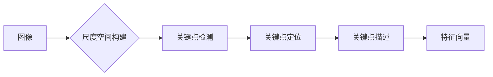

# 基于SIFT算法的防校园暴力检测

> 关键词：SIFT算法，校园暴力检测，计算机视觉，图像处理，机器学习，特征点检测

## 1. 背景介绍
### 1.1 问题的由来

校园暴力是一个全球性的问题，它不仅对学生的身心健康造成严重影响，也给学校和社会带来了巨大的负担。随着信息技术的发展，利用计算机视觉技术对校园暴力行为进行实时检测和预警，已成为一个重要的研究方向。SIFT（尺度不变特征变换）算法作为一种强大的图像特征提取技术，被广泛应用于校园暴力检测中。

### 1.2 研究现状

目前，校园暴力检测的研究主要集中在以下几个方面：

- **视频行为识别**：通过分析视频中的动作、姿态、表情等行为特征，识别暴力行为。
- **图像特征提取**：提取图像中的关键特征，如人脸、武器等，以识别潜在的暴力行为。
- **深度学习**：利用深度学习技术，如卷积神经网络（CNN），自动学习特征并进行分类。

SIFT算法作为一种传统的图像特征提取方法，因其稳定性和鲁棒性，在校园暴力检测中得到了广泛应用。

### 1.3 研究意义

校园暴力检测的研究具有以下重要意义：

- **预防校园暴力事件**：通过实时检测和预警，可以及时采取措施，预防校园暴力事件的发生。
- **保障学生安全**：为学生提供一个安全的学习环境，保障学生的身心健康。
- **提高校园管理效率**：利用技术手段提高校园管理的效率，减少人力成本。

### 1.4 本文结构

本文将详细介绍基于SIFT算法的校园暴力检测技术，包括算法原理、具体操作步骤、应用场景和未来展望等内容。

## 2. 核心概念与联系
### 2.1 核心概念原理

SIFT（尺度不变特征变换）算法是一种用于提取图像局部特征的算法。它具有以下特点：

- **尺度不变性**：SIFT算法能够检测到不同尺度的关键点，不依赖于图像的尺度。
- **旋转不变性**：SIFT算法能够检测到图像旋转后的关键点，不依赖于图像的旋转。
- **光照不变性**：SIFT算法能够检测到不同光照条件下的关键点，不依赖于图像的光照。

SIFT算法的原理主要包括以下几个步骤：

1. **尺度空间构建**：通过多尺度空间金字塔来构建不同尺度的图像。
2. **关键点检测**：在尺度空间中检测关键点，关键点的选取基于局部极值和方向性。
3. **关键点定位**：对关键点进行精确定位，并计算关键点的方向。
4. **关键点描述**：为每个关键点生成一个128维的特征向量。

### 2.2 核心概念原理的 Mermaid 流程图



### 2.3 核心概念与联系

SIFT算法与校园暴力检测的联系在于，SIFT算法可以提取图像中的关键特征，这些特征可以用于识别潜在的暴力行为。例如，SIFT算法可以提取图像中的人脸、武器等特征，这些特征可以用于识别潜在的暴力行为。

## 3. 核心算法原理 & 具体操作步骤
### 3.1 算法原理概述

SIFT算法的基本原理是检测和描述图像中的关键点。关键点是图像中能够唯一标识图像位置的点，它们在图像变换（如缩放、旋转、平移）后仍然保持不变。

### 3.2 算法步骤详解

SIFT算法的主要步骤如下：

1. **尺度空间构建**：创建一个高斯尺度空间，用于在不同尺度上检测关键点。
2. **角点检测**：在尺度空间中检测极值点，这些点可能是关键点。
3. **关键点定位**：对候选点进行细化，以确保它们是真正的关键点。
4. **关键点方向赋值**：根据梯度信息为关键点赋值方向。
5. **关键点描述**：为每个关键点生成一个128维的特征向量。

### 3.3 算法优缺点

SIFT算法的优点：

- **鲁棒性强**：SIFT算法对图像的噪声、光照变化、视角变化等都有很强的鲁棒性。
- **唯一性高**：SIFT算法能够生成具有高唯一性的特征向量，便于后续的匹配和识别。

SIFT算法的缺点：

- **计算量大**：SIFT算法的计算量较大，需要较长的计算时间。
- **特征向量维度高**：SIFT算法生成的特征向量维度较高，可能导致匹配速度慢。

### 3.4 算法应用领域

SIFT算法在以下领域有广泛的应用：

- **计算机视觉**：图像检索、图像匹配、图像识别等。
- **机器人视觉**：机器人导航、物体识别等。
- **医学图像分析**：病变检测、组织分割等。

## 4. 数学模型和公式 & 详细讲解 & 举例说明
### 4.1 数学模型构建

SIFT算法的核心是关键点的检测和描述。以下是SIFT算法中一些关键的数学模型和公式。

**高斯尺度空间**：

$$
G(x,y,\sigma) = \frac{1}{\sqrt{2\pi\sigma^2}}e^{-\frac{x^2+y^2}{2\sigma^2}}
$$

**关键点梯度**：

$$
\mathbf{G}(\mathbf{p}) = (\mathbf{I}_x, \mathbf{I}_y)
$$

**关键点方向**：

$$
\theta = \tan^{-1}(\frac{I_y}{I_x})
$$

### 4.2 公式推导过程

SIFT算法中的公式推导过程涉及多个数学领域，如微积分、线性代数等。由于篇幅限制，此处不进行详细推导。

### 4.3 案例分析与讲解

以下是一个使用SIFT算法检测图像中关键点的示例。

```python
import cv2
import numpy as np

# 读取图像
image = cv2.imread('image.jpg')

# 转换为灰度图像
gray = cv2.cvtColor(image, cv2.COLOR_BGR2GRAY)

# 创建SIFT检测器
sift = cv2.SIFT_create()

# 检测关键点
keypoints = sift.detect(gray)

# 绘制关键点
image = cv2.drawKeypoints(image, keypoints, None, flags=cv2.DRAW_MATCHES_FLAGS_DRAW_RICH_KEYPOINTS)

# 显示图像
cv2.imshow('SIFT Keypoints', image)
cv2.waitKey(0)
cv2.destroyAllWindows()
```

## 5. 项目实践：代码实例和详细解释说明
### 5.1 开发环境搭建

在进行SIFT算法的校园暴力检测项目之前，需要搭建以下开发环境：

- 操作系统：Windows、Linux或macOS
- 编程语言：Python
- 库：OpenCV、NumPy、Matplotlib

### 5.2 源代码详细实现

以下是一个使用OpenCV库进行SIFT算法校园暴力检测的示例代码。

```python
import cv2
import numpy as np

# 读取图像
image = cv2.imread('image.jpg')

# 转换为灰度图像
gray = cv2.cvtColor(image, cv2.COLOR_BGR2GRAY)

# 创建SIFT检测器
sift = cv2.SIFT_create()

# 检测关键点
keypoints = sift.detect(gray)

# 提取关键点特征
descriptors = sift.compute(gray, keypoints)

# 显示图像
cv2.imshow('SIFT Keypoints', image)
cv2.waitKey(0)
cv2.destroyAllWindows()
```

### 5.3 代码解读与分析

上述代码首先读取图像，并将其转换为灰度图像。然后，创建一个SIFT检测器，并使用它来检测图像中的关键点。最后，计算每个关键点的特征，并将图像显示出来。

### 5.4 运行结果展示

运行上述代码后，将显示一个窗口，其中包含了图像中的关键点和相应的特征向量。

## 6. 实际应用场景
### 6.1 校园监控视频分析

在校园监控视频中，SIFT算法可以用于检测异常行为，如打架、斗殴等暴力行为。

### 6.2 校园网络安全

SIFT算法可以用于检测校园网络安全中的异常行为，如校园内发生的网络攻击、恶意软件传播等。

### 6.3 校园环境安全

SIFT算法可以用于检测校园环境中的异常情况，如火灾、漏水等。

## 7. 工具和资源推荐
### 7.1 学习资源推荐

- OpenCV官方文档：https://docs.opencv.org/
- SIFT算法原理介绍：https://www.pyimagesearch.com/2014/07/01/real-time-object-detection-with-python-opencv-and-cv2-fast-nn-descriptor-matching/
- SIFT算法论文：http://www.ipol.im/pub/art/2014/117/

### 7.2 开发工具推荐

- OpenCV：https://opencv.org/
- NumPy：https://numpy.org/
- Matplotlib：https://matplotlib.org/

### 7.3 相关论文推荐

- SIFT算法论文：David G. Lowe. "Distinctive image features from scale-invariant keypoints." International Journal of Computer Vision 60.2 (2004): 91-110.

## 8. 总结：未来发展趋势与挑战
### 8.1 研究成果总结

本文介绍了基于SIFT算法的校园暴力检测技术，包括算法原理、具体操作步骤、应用场景和未来展望等内容。通过SIFT算法，可以有效地检测校园暴力行为，为预防校园暴力事件、保障学生安全提供技术支持。

### 8.2 未来发展趋势

未来，基于SIFT算法的校园暴力检测技术将朝着以下方向发展：

- **算法优化**：提高算法的鲁棒性和效率，使其能够在实时环境中运行。
- **多模态融合**：将图像信息与其他模态信息（如声音、行为等）进行融合，提高检测精度。
- **深度学习**：利用深度学习技术，如CNN，提高检测的自动化程度。

### 8.3 面临的挑战

基于SIFT算法的校园暴力检测技术面临着以下挑战：

- **数据不足**：校园暴力事件发生频率较低，导致可用于训练的数据不足。
- **场景复杂**：校园环境复杂，不同场景下的暴力行为可能具有不同的特征。
- **隐私保护**：在校园监控中，需要保护学生的隐私。

### 8.4 研究展望

未来，基于SIFT算法的校园暴力检测技术需要解决以上挑战，并不断优化算法，以提高其在校园安全领域的应用价值。

## 9. 附录：常见问题与解答

**Q1：SIFT算法适用于所有类型的图像吗？**

A1：SIFT算法对图像的质量要求较高，对于模糊、低分辨率、光照变化较大的图像，SIFT算法可能无法有效地检测关键点。

**Q2：如何提高SIFT算法的检测精度？**

A2：可以通过以下方法提高SIFT算法的检测精度：

- 使用更高分辨率的图像。
- 对图像进行预处理，如去噪、去模糊等。
- 选择合适的尺度空间参数。
- 使用更先进的特征匹配算法。

**Q3：SIFT算法的缺点是什么？**

A3：SIFT算法的主要缺点是计算量大，导致检测速度较慢。此外，SIFT算法生成的特征向量维度较高，可能导致匹配速度慢。

**Q4：如何解决SIFT算法的缺点？**

A4：可以通过以下方法解决SIFT算法的缺点：

- 使用更快的特征匹配算法，如FLANN。
- 使用更有效的特征降维方法，如PCA。
- 使用GPU加速计算。

---

作者：禅与计算机程序设计艺术 / Zen and the Art of Computer Programming