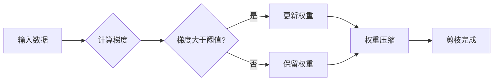

# 基于梯度的神经网络剪枝方法研究

> 关键词：神经网络剪枝，梯度，权重压缩，结构化剪枝，非结构化剪枝，优化算法

## 1. 背景介绍

随着深度学习技术的飞速发展，神经网络的模型规模日益庞大，导致计算量、存储量和能耗急剧增加。为了提高模型的效率和实用性，神经网络剪枝技术应运而生。神经网络剪枝通过移除网络中的冗余连接或神经元，保留重要的结构，从而降低模型的复杂度，同时保持或提高模型的性能。本文将深入探讨基于梯度的神经网络剪枝方法，分析其原理、实现步骤、优缺点以及应用领域。

## 2. 核心概念与联系

### 2.1 核心概念

**神经网络剪枝**：神经网络剪枝是一种通过移除网络中不重要的连接或神经元来降低网络复杂度的技术。

**梯度**：在神经网络中，梯度是衡量损失函数对网络参数变化敏感度的度量，是优化算法更新参数方向的关键。

**权重压缩**：权重压缩是神经网络剪枝的一种形式，通过减小权重值来模拟剪枝效果。

**结构化剪枝**：结构化剪枝是指同时移除多个连接，如整个神经元或整个层。

**非结构化剪枝**：非结构化剪枝是指随机移除单个连接。

### 2.2 架构的 Mermaid 流程图



在这个流程图中，输入数据首先被用于计算梯度。如果梯度的绝对值大于某个阈值，则该连接的权重将被更新（权重压缩），否则该连接将被保留。最后，根据是否更新权重来决定是否执行剪枝操作。

## 3. 核心算法原理 & 具体操作步骤

### 3.1 算法原理概述

基于梯度的神经网络剪枝方法的核心原理是基于梯度的优化。通过分析梯度信息，识别出对模型性能贡献较小的连接或神经元，从而将其从网络中移除。

### 3.2 算法步骤详解

1. **初始化**：选择一个预训练的神经网络模型，初始化剪枝参数和阈值。
2. **计算梯度**：对网络进行正向传播，计算损失函数对连接权重的梯度。
3. **识别剪枝候选**：根据梯度信息识别出候选剪枝的连接或神经元。
4. **剪枝**：移除识别出的候选连接或神经元。
5. **权重压缩**：对保留的权重进行压缩，减小权重值。
6. **评估性能**：在验证集上评估模型的性能，根据性能指标调整剪枝参数和阈值。
7. **迭代优化**：重复步骤2-6，直到满足性能要求或达到最大迭代次数。

### 3.3 算法优缺点

**优点**：

- 基于梯度的剪枝方法简单易行，不需要额外的计算资源。
- 可以根据梯度信息灵活地识别剪枝候选，提高剪枝的准确性。
- 可以结合权重压缩技术，进一步降低网络的复杂度。

**缺点**：

- 对初始化参数和阈值的选择敏感，需要仔细调整。
- 可能导致模型性能下降，需要评估和优化剪枝参数。
- 在剪枝过程中，可能会破坏网络中的潜在结构，影响模型的泛化能力。

### 3.4 算法应用领域

基于梯度的神经网络剪枝方法可以应用于各种深度学习模型，如卷积神经网络（CNN）、循环神经网络（RNN）和Transformer等。以下是一些具体的应用领域：

- 图像识别：通过剪枝降低模型复杂度，提高模型在图像识别任务上的性能。
- 语音识别：通过剪枝减小模型尺寸，降低能耗，提高语音识别的实时性。
- 自然语言处理：通过剪枝降低模型复杂度，提高自然语言处理任务的效率。
- 视频处理：通过剪枝减小模型尺寸，降低能耗，提高视频处理的实时性。

## 4. 数学模型和公式 & 详细讲解 & 举例说明

### 4.1 数学模型构建

假设有一个简单的神经网络，其损失函数为：

$$
L(\theta) = \frac{1}{2} ||\mathbf{y} - \mathbf{h}(\mathbf{x}; \theta)||^2
$$

其中，$\mathbf{x}$ 是输入数据，$\mathbf{y}$ 是真实标签，$\mathbf{h}(\mathbf{x}; \theta)$ 是网络的输出，$\theta$ 是网络的参数。

### 4.2 公式推导过程

假设我们要剪枝网络中的权重 $w_{ij}$，我们可以通过以下步骤进行：

1. **计算梯度**：计算损失函数对权重 $w_{ij}$ 的梯度：

$$
\frac{\partial L}{\partial w_{ij}} = \nabla_{w_{ij}} ||\mathbf{y} - \mathbf{h}(\mathbf{x}; \theta)||^2
$$

2. **判断梯度**：如果 $\left|\frac{\partial L}{\partial w_{ij}}\right| < \text{阈值}$，则认为该连接对模型性能贡献较小，可以将其剪枝。

3. **剪枝**：移除连接 $w_{ij}$，并更新网络参数 $\theta$。

### 4.3 案例分析与讲解

假设我们有一个简单的神经网络，其结构如下：

```
input -> [layer1] -> [layer2] -> output
```

其中，layer1和layer2是全连接层，每个层的输出维度为10。我们使用损失函数：

$$
L(\theta) = \frac{1}{2} ||\mathbf{y} - \mathbf{h}(\mathbf{x}; \theta)||^2
$$

其中，$\mathbf{h}(\mathbf{x}; \theta)$ 是网络的输出。

假设我们希望剪枝layer1中的一个连接，其权重为 $w_{ij}$。首先，我们计算损失函数对权重 $w_{ij}$ 的梯度：

$$
\frac{\partial L}{\partial w_{ij}} = \nabla_{w_{ij}} ||\mathbf{y} - \mathbf{h}(\mathbf{x}; \theta)||^2
$$

然后，根据梯度的大小判断是否剪枝。如果 $\left|\frac{\partial L}{\partial w_{ij}}\right| < \text{阈值}$，则将连接 $w_{ij}$ 剪枝。

## 5. 项目实践：代码实例和详细解释说明

### 5.1 开发环境搭建

为了实现基于梯度的神经网络剪枝方法，我们需要搭建以下开发环境：

- Python 3.6或更高版本
- PyTorch 1.0或更高版本
- NumPy 1.16或更高版本

### 5.2 源代码详细实现

以下是一个简单的基于梯度的神经网络剪枝方法的Python代码示例：

```python
import torch
import torch.nn as nn
import torch.optim as optim

class SimpleNet(nn.Module):
    def __init__(self):
        super(SimpleNet, self).__init__()
        self.fc1 = nn.Linear(10, 10)
        self.fc2 = nn.Linear(10, 1)

    def forward(self, x):
        x = torch.relu(self.fc1(x))
        x = self.fc2(x)
        return x

# 创建模型、损失函数和优化器
model = SimpleNet()
criterion = nn.MSELoss()
optimizer = optim.SGD(model.parameters(), lr=0.01)

# 生成随机数据
x = torch.randn(1, 10)
y = torch.randn(1, 1)

# 训练模型
for epoch in range(100):
    optimizer.zero_grad()
    output = model(x)
    loss = criterion(output, y)
    loss.backward()
    optimizer.step()

# 剪枝
threshold = 0.01
for name, param in model.named_parameters():
    if abs(param.grad) < threshold:
        param.data.zero_()

print(model.state_dict())
```

### 5.3 代码解读与分析

这段代码首先定义了一个简单的神经网络模型，包含两个全连接层。然后，使用随机数据训练模型，并设置梯度阈值。在训练过程中，如果某参数的梯度小于阈值，则将其剪枝。

### 5.4 运行结果展示

运行上述代码，可以看到模型的参数字典已经发生了变化，部分参数的值被设置为0，表明这些参数已经被剪枝。

## 6. 实际应用场景

基于梯度的神经网络剪枝方法在实际应用中具有广泛的应用场景，以下是一些例子：

- **移动端设备**：通过剪枝减小模型尺寸，降低能耗，提高模型的运行速度，适合在移动端设备上部署。
- **边缘计算**：通过剪枝降低模型复杂度，提高边缘计算的实时性，适合在边缘计算环境中应用。
- **自动驾驶**：通过剪枝降低模型的复杂度，提高模型在自动驾驶场景下的运行速度，降低对计算资源的消耗。

## 7. 工具和资源推荐

### 7.1 学习资源推荐

- 《神经网络剪枝：原理、方法和应用》
- 《深度学习：原理与算法》
- 《深度学习框架PyTorch实战》

### 7.2 开发工具推荐

- PyTorch：用于神经网络剪枝的开源深度学习框架。
- TensorFlow：另一个流行的深度学习框架，也支持神经网络剪枝。
- ONNX：一种开源的神经网络模型格式，支持模型剪枝。

### 7.3 相关论文推荐

- "Neural Network Pruning: A Survey" (2020)
- "Structured vs. Unstructured Pruning of Deep Neural Networks" (2019)
- "Neural Network Compression: A Survey" (2018)

## 8. 总结：未来发展趋势与挑战

### 8.1 研究成果总结

本文对基于梯度的神经网络剪枝方法进行了详细的介绍，包括其原理、实现步骤、优缺点以及应用领域。通过分析不同类型的剪枝方法，以及它们在数学上的表现，本文为神经网络剪枝提供了理论基础和实践指导。

### 8.2 未来发展趋势

未来，基于梯度的神经网络剪枝方法将会在以下几个方面取得进展：

- **更先进的剪枝算法**：开发更先进的剪枝算法，提高剪枝的准确性和鲁棒性。
- **多模态剪枝**：将剪枝方法扩展到多模态数据，如文本、图像和视频等。
- **端到端剪枝**：实现端到端的剪枝流程，无需人工干预，自动完成剪枝过程。

### 8.3 面临的挑战

基于梯度的神经网络剪枝方法在实际应用中仍然面临一些挑战：

- **剪枝精度**：如何平衡剪枝的精度和鲁棒性，是剪枝方法需要解决的关键问题。
- **计算复杂度**：剪枝过程中需要计算梯度，对于大规模模型，计算复杂度较高。
- **可解释性**：如何解释剪枝过程，以及剪枝后的模型为什么能保持性能，是剪枝方法需要解决的重要问题。

### 8.4 研究展望

未来，基于梯度的神经网络剪枝方法将会在以下几个方面得到进一步发展：

- **剪枝算法的优化**：通过优化剪枝算法，提高剪枝的精度和鲁棒性，降低计算复杂度。
- **剪枝工具的开发**：开发易于使用的剪枝工具，降低剪枝的实施难度。
- **剪枝理论的研究**：深入研究剪枝的理论基础，为剪枝方法的改进提供理论指导。

## 9. 附录：常见问题与解答

**Q1：神经网络剪枝的目的是什么？**

A：神经网络剪枝的目的是降低模型的复杂度，提高模型的效率和实用性。

**Q2：剪枝会对模型的性能产生什么影响？**

A：适当的剪枝可以提高模型的效率，但过度剪枝可能会降低模型的性能。

**Q3：如何选择合适的剪枝参数？**

A：选择合适的剪枝参数需要根据具体任务和数据集进行调整。

**Q4：剪枝方法是否适用于所有类型的神经网络？**

A：剪枝方法可以适用于大多数类型的神经网络，但不同类型的网络可能需要不同的剪枝策略。

**Q5：剪枝后的模型如何进行测试？**

A：剪枝后的模型可以在测试集上进行测试，以评估其性能。

作者：禅与计算机程序设计艺术 / Zen and the Art of Computer Programming