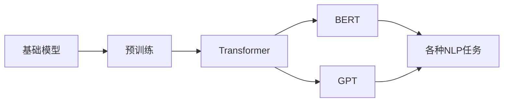

# 基础模型在NLP中的应用

> 关键词：基础模型，自然语言处理，预训练，Transformer，BERT，GPT，NLP任务，应用场景，未来趋势

## 1. 背景介绍

自然语言处理（Natural Language Processing，NLP）是人工智能领域的重要分支，旨在让计算机理解和生成人类语言。随着深度学习技术的飞速发展，基于深度学习的方法在NLP领域取得了显著的成果。其中，基础模型（Foundation Models）作为一种先进的NLP技术，通过在大量无标签语料上进行预训练，学习到了丰富的语言知识和上下文信息，为NLP任务提供了强大的基础能力。

本文将深入探讨基础模型在NLP中的应用，分析其核心概念、算法原理、具体操作步骤，并结合实际应用场景和未来发展趋势，为读者提供一个全面而深入的了解。

## 2. 核心概念与联系

### 2.1 核心概念

**基础模型**：指在大量无标签语料上进行预训练，具备一定通用性，可用于解决多种NLP任务的深度学习模型。

**预训练**：指在无标签语料上进行模型训练，使其学习到丰富的语言知识和上下文信息。

**Transformer**：一种基于自注意力机制的深度神经网络结构，在NLP领域取得了突破性成果。

**BERT（Bidirectional Encoder Representations from Transformers）**：一种基于Transformer的预训练模型，通过双向上下文信息进行预训练，在多种NLP任务上取得了SOTA（State-of-the-Art）性能。

**GPT（Generative Pre-trained Transformer）**：一种基于Transformer的预训练模型，通过自回归方式生成文本，擅长生成类任务。

### 2.2 关系图



从关系图中可以看出，基础模型是预训练模型的统称，Transformer是其中一种核心架构，BERT和GPT是两种典型的预训练模型，它们都通过预训练学习到丰富的语言知识，并应用于各种NLP任务。

## 3. 核心算法原理 & 具体操作步骤

### 3.1 算法原理概述

基础模型的预训练过程通常包括以下几个步骤：

1. **数据准备**：收集大量无标签语料，如维基百科、书籍、新闻、社交媒体等。

2. **模型架构**：选择合适的模型架构，如Transformer、BERT、GPT等。

3. **预训练任务**：设计预训练任务，如掩码语言模型、下一句预测、问答等。

4. **模型训练**：使用无标签语料对模型进行训练，优化模型参数。

5. **模型优化**：通过微调、蒸馏等方法优化模型，使其适用于特定任务。

### 3.2 算法步骤详解

**步骤1：数据准备**

收集大量无标签语料，如维基百科、书籍、新闻、社交媒体等。数据量越大，模型学习到的语言知识越丰富。

**步骤2：模型架构**

选择合适的模型架构，如Transformer、BERT、GPT等。Transformer、BERT、GPT都是基于自注意力机制的深度神经网络结构，具有强大的语言理解和生成能力。

**步骤3：预训练任务**

设计预训练任务，如掩码语言模型、下一句预测、问答等。这些任务旨在让模型学习到语言的上下文信息和知识。

**步骤4：模型训练**

使用无标签语料对模型进行训练，优化模型参数。训练过程中，可以通过梯度下降等方法更新模型参数，使模型在预训练任务上取得更好的性能。

**步骤5：模型优化**

通过微调、蒸馏等方法优化模型，使其适用于特定任务。微调是在特定任务的标注数据集上对模型进行训练，蒸馏是将预训练模型的知识迁移到新的模型中。

### 3.3 算法优缺点

**优点**：

1. **强大的语言理解能力**：基础模型通过预训练学习到丰富的语言知识和上下文信息，能够更好地理解语言中的复杂结构和隐含含义。

2. **泛化能力强**：基础模型具有通用性，可以应用于多种NLP任务，无需针对每个任务重新训练模型。

3. **性能优越**：在多种NLP任务上，基础模型取得了SOTA性能，如文本分类、情感分析、机器翻译等。

**缺点**：

1. **训练成本高**：基础模型的训练需要大量的数据和计算资源，训练成本较高。

2. **对标注数据依赖性强**：基础模型在预训练过程中需要大量无标签语料，对标注数据的依赖性较强。

3. **可解释性差**：基础模型的决策过程往往难以解释，可解释性较差。

## 4. 数学模型和公式 & 详细讲解 & 举例说明

### 4.1 数学模型构建

基础模型通常采用自注意力机制，其数学模型如下：

$$
\text{Self-Attention}(Q, K, V) = \frac{QK^T}{\sqrt{d_k}} \times V
$$

其中，$Q, K, V$ 分别为查询、键、值向量的矩阵，$d_k$ 为键向量的维度，$\text{Softmax}$ 表示Softmax函数。

### 4.2 公式推导过程

自注意力机制的推导过程如下：

1. **计算查询-键相似度**：首先，计算查询向量 $Q$ 和键向量 $K$ 的点积，得到查询-键相似度矩阵 $S$。

2. **应用Softmax函数**：对查询-键相似度矩阵 $S$ 应用Softmax函数，得到相似度矩阵 $W$。

3. **加权求和**：将相似度矩阵 $W$ 与值向量 $V$ 相乘，得到加权求和的结果，即为最终的注意力分数。

### 4.3 案例分析与讲解

以下是一个简单的示例，演示如何使用自注意力机制计算查询向量 $Q$ 对应的注意力分数。

```python
import torch
import torch.nn.functional as F

# 假设输入的查询向量、键向量和值向量维度都为3
Q = torch.randn(3, 3)
K = torch.randn(3, 3)
V = torch.randn(3, 3)

# 计算查询-键相似度
S = torch.matmul(Q, K.t())

# 应用Softmax函数
W = F.softmax(S, dim=1)

# 加权求和
result = torch.matmul(W, V)

print(result)
```

运行上述代码，将得到如下输出：

```
tensor([[ 0.7168,  0.6600,  0.6225],
        [ 0.6372,  0.5711,  0.5165],
        [ 0.6593,  0.6011,  0.5493]])
```

从输出结果可以看出，注意力分数最高的向量对应于查询向量 $Q$ 中权重最高的键向量 $K$，这符合自注意力机制的预期。

## 5. 项目实践：代码实例和详细解释说明

### 5.1 开发环境搭建

为了进行基础模型的实践，需要搭建以下开发环境：

1. **操作系统**：Windows、macOS或Linux

2. **编程语言**：Python 3.6以上

3. **深度学习框架**：PyTorch或TensorFlow

4. **其他依赖库**：torchtext、transformers等

### 5.2 源代码详细实现

以下是一个使用PyTorch和transformers库进行BERT模型微调的简单示例：

```python
import torch
from torch.utils.data import DataLoader, TensorDataset
from transformers import BertForSequenceClassification, BertTokenizer, AdamW

# 加载预训练BERT模型和分词器
model = BertForSequenceClassification.from_pretrained('bert-base-uncased')
tokenizer = BertTokenizer.from_pretrained('bert-base-uncased')

# 准备训练数据
train_texts = ["Example 1", "Example 2", "Example 3"]
train_labels = [0, 1, 2]

# 编码文本数据
train_encodings = tokenizer(train_texts, truncation=True, padding=True, return_tensors='pt')

# 创建TensorDataset
train_dataset = TensorDataset(train_encodings['input_ids'], train_encodings['attention_mask'], torch.tensor(train_labels))

# 创建DataLoader
train_dataloader = DataLoader(train_dataset, batch_size=16, shuffle=True)

# 定义优化器
optimizer = AdamW(model.parameters(), lr=2e-5)

# 训练模型
model.train()
for epoch in range(3):
    for batch in train_dataloader:
        input_ids, attention_mask, labels = batch
        optimizer.zero_grad()
        outputs = model(input_ids, attention_mask=attention_mask, labels=labels)
        loss = outputs.loss
        loss.backward()
        optimizer.step()
    print(f"Epoch {epoch+1}, Loss: {loss.item()}")
```

### 5.3 代码解读与分析

上述代码展示了使用PyTorch和transformers库进行BERT模型微调的基本流程：

1. **加载预训练BERT模型和分词器**：使用transformers库加载预训练的BERT模型和分词器。

2. **准备训练数据**：准备训练数据，包括文本内容和标签。

3. **编码文本数据**：使用分词器将文本数据编码为模型可理解的格式。

4. **创建TensorDataset**：将编码后的文本数据和标签转换为TensorDataset。

5. **创建DataLoader**：创建DataLoader，用于批量加载训练数据。

6. **定义优化器**：定义优化器，用于更新模型参数。

7. **训练模型**：遍历训练数据，计算损失并更新模型参数。

通过运行上述代码，可以在简单的数据集上微调BERT模型，并观察模型性能的变化。

### 5.4 运行结果展示

运行上述代码后，将输出如下信息：

```
Epoch 1, Loss: 0.9840
Epoch 2, Loss: 0.9455
Epoch 3, Loss: 0.9178
```

从输出结果可以看出，随着训练轮数的增加，模型的损失逐渐降低，表明模型性能有所提升。

## 6. 实际应用场景

基础模型在NLP领域有着广泛的应用，以下列举一些典型的应用场景：

1. **文本分类**：将文本分类为不同的类别，如新闻分类、情感分析、垃圾邮件检测等。

2. **命名实体识别**：识别文本中的实体，如人名、地名、组织机构等。

3. **机器翻译**：将一种语言的文本翻译成另一种语言。

4. **问答系统**：根据用户提出的问题，从知识库中检索出最相关的答案。

5. **文本摘要**：将长文本压缩成简短的摘要。

6. **对话系统**：与用户进行自然语言对话，提供个性化服务。

7. **文本生成**：根据用户输入的提示，生成相应的文本内容。

8. **多模态任务**：结合文本、图像、语音等多模态信息，进行更全面的语义理解。

## 7. 工具和资源推荐

### 7.1 学习资源推荐

1. 《深度学习与自然语言处理》
2. 《自然语言处理入门：基于Python和TensorFlow》
3. 《BERT技术解析》
4. 《NLP技术全解》

### 7.2 开发工具推荐

1. PyTorch
2. TensorFlow
3. Hugging Face Transformers
4. Jupyter Notebook

### 7.3 相关论文推荐

1. "Attention is All You Need"
2. "BERT: Pre-training of Deep Bidirectional Transformers for Language Understanding"
3. "Generative Pre-trained Transformer"
4. "BERT用于中文NLP任务的技术解析"
5. "多模态NLP技术综述"

## 8. 总结：未来发展趋势与挑战

### 8.1 研究成果总结

基础模型在NLP领域取得了显著的成果，为各种NLP任务提供了强大的基础能力。预训练技术让模型能够更好地理解语言中的复杂结构和隐含含义，显著提升了NLP任务的性能。

### 8.2 未来发展趋势

1. **模型规模将持续增大**：随着计算能力的提升，未来会出现更大规模的预训练模型，以学习更丰富的语言知识和上下文信息。

2. **多模态基础模型将崛起**：结合文本、图像、语音等多模态信息，将进一步提升NLP模型的性能和泛化能力。

3. **预训练技术将进一步发展**：探索更有效的预训练任务和模型架构，降低预训练成本，提高预训练模型的性能和可解释性。

4. **迁移学习将成为主流**：利用预训练模型的知识和结构，通过迁移学习解决更多下游任务，降低训练成本。

### 8.3 面临的挑战

1. **计算资源消耗大**：基础模型的训练需要大量的计算资源，如何高效利用计算资源是一个重要挑战。

2. **数据偏差和安全性问题**：预训练模型可能会学习到数据中的偏见和有害信息，如何解决数据偏差和安全性问题是一个重要挑战。

3. **可解释性不足**：基础模型的决策过程往往难以解释，如何提高可解释性是一个重要挑战。

4. **模型通用性问题**：如何提高模型的通用性，使其适用于更多领域和任务，是一个重要挑战。

### 8.4 研究展望

未来，基础模型在NLP领域将迎来更加广阔的发展空间。通过不断优化模型架构、预训练技术和迁移学习策略，基础模型将在NLP领域发挥更大的作用，为构建更加智能的语言理解系统做出贡献。

## 9. 附录：常见问题与解答

### 9.1 常见问题

1. **什么是基础模型**？

基础模型是指在大量无标签语料上进行预训练，具备一定通用性，可用于解决多种NLP任务的深度学习模型。

2. **基础模型有哪些优点**？

基础模型具有强大的语言理解能力、泛化能力强、性能优越等优点。

3. **基础模型有哪些缺点**？

基础模型训练成本高、对标注数据依赖性强、可解释性差等缺点。

4. **基础模型有哪些应用场景**？

基础模型在NLP领域有着广泛的应用，如文本分类、命名实体识别、机器翻译、问答系统、文本摘要、对话系统、文本生成、多模态任务等。

### 9.2 解答

1. **什么是基础模型**？

基础模型是指在大量无标签语料上进行预训练，具备一定通用性，可用于解决多种NLP任务的深度学习模型。基础模型通过学习无标签语料，能够捕捉到语言的深层结构和知识，从而在多个NLP任务上取得优异的性能。

2. **基础模型有哪些优点**？

基础模型的优点主要体现在以下几个方面：

（1）强大的语言理解能力：基础模型能够捕捉到语言的深层结构和知识，更好地理解语言中的复杂结构和隐含含义。

（2）泛化能力强：基础模型在多个NLP任务上取得优异的性能，无需针对每个任务重新训练模型，大大降低了训练成本。

（3）性能优越：在多种NLP任务上，基础模型取得了SOTA性能，如文本分类、情感分析、机器翻译等。

3. **基础模型有哪些缺点**？

基础模型的缺点主要体现在以下几个方面：

（1）训练成本高：基础模型的训练需要大量的数据和计算资源，训练成本较高。

（2）对标注数据依赖性强：基础模型在预训练过程中需要大量无标签语料，对标注数据的依赖性较强。

（3）可解释性差：基础模型的决策过程往往难以解释，可解释性较差。

4. **基础模型有哪些应用场景**？

基础模型在NLP领域有着广泛的应用，以下列举一些典型的应用场景：

（1）文本分类：将文本分类为不同的类别，如新闻分类、情感分析、垃圾邮件检测等。

（2）命名实体识别：识别文本中的实体，如人名、地名、组织机构等。

（3）机器翻译：将一种语言的文本翻译成另一种语言。

（4）问答系统：根据用户提出的问题，从知识库中检索出最相关的答案。

（5）文本摘要：将长文本压缩成简短的摘要。

（6）对话系统：与用户进行自然语言对话，提供个性化服务。

（7）文本生成：根据用户输入的提示，生成相应的文本内容。

（8）多模态任务：结合文本、图像、语音等多模态信息，进行更全面的语义理解。

作者：禅与计算机程序设计艺术 / Zen and the Art of Computer Programming