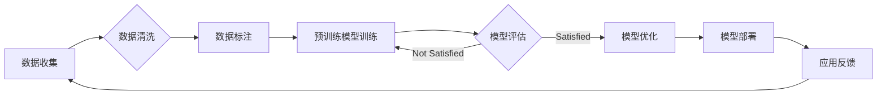

# 基础模型的技术创新与社会合作

> 关键词：基础模型，技术创新，社会合作，人工智能，预训练，迁移学习，伦理，可持续发展

## 1. 背景介绍

随着人工智能技术的飞速发展，基础模型作为一种关键技术，已经成为推动人工智能应用的关键驱动力。基础模型通过在大量数据上预训练，学习到通用的特征表示和知识，为下游任务提供强大的基础能力。然而，基础模型的技术创新不仅需要深厚的科研积累，更需要社会各界共同参与和合作，以应对其带来的挑战和机遇。

### 1.1 技术创新的驱动因素

基础模型的技术创新主要受到以下因素驱动：

- **数据量的激增**：随着互联网和物联网的普及，数据量呈爆炸式增长，为模型训练提供了丰富的素材。
- **计算能力的提升**：GPU、TPU等专用硬件的快速发展，为大规模模型训练提供了强大的算力支持。
- **算法的突破**：深度学习、Transformer等算法的突破，为模型设计和训练提供了新的思路和方法。
- **开源生态的构建**：开源框架和工具的涌现，降低了技术门槛，促进了技术创新和普及。

### 1.2 社会合作的重要性

基础模型的技术创新需要社会各界的共同参与和合作，主要体现在以下几个方面：

- **数据共享**：数据是基础模型训练的基础，需要各方共同构建开放、共享的数据平台。
- **算力共享**：高性能计算资源是模型训练的关键，需要构建共享的算力平台，降低研发成本。
- **人才合作**：基础模型研发需要跨学科、跨领域的人才，需要加强人才培养和交流。
- **伦理和法规**：基础模型的开发和应用需要遵循伦理和法规，需要社会各界共同制定标准和规范。

## 2. 核心概念与联系

### 2.1 核心概念原理

#### Mermaid 流程图



#### 核心概念

- **数据收集**：从互联网、数据库等渠道收集相关数据。
- **数据清洗**：处理数据中的噪声和异常，提高数据质量。
- **数据标注**：对数据进行标注，为模型训练提供监督信号。
- **预训练模型训练**：使用大量无标签数据进行模型训练，学习通用特征表示和知识。
- **模型评估**：使用测试集评估模型性能，验证模型效果。
- **模型优化**：根据评估结果调整模型参数，提高模型性能。
- **模型部署**：将训练好的模型部署到实际应用场景中。
- **应用反馈**：收集应用过程中的反馈信息，为后续模型优化和改进提供依据。

### 2.2 核心概念联系

上述核心概念之间存在着紧密的联系，共同构成了基础模型的技术创新流程。数据是基础模型的基石，数据清洗和标注为模型训练提供高质量的输入。预训练模型训练是核心环节，通过学习大量无标签数据，模型可以学习到通用特征表示和知识。模型评估、优化和部署是迭代改进的过程，不断优化模型性能，使其能够更好地满足应用需求。

## 3. 核心算法原理 & 具体操作步骤

### 3.1 算法原理概述

基础模型的算法原理主要包括以下两个方面：

- **深度学习**：通过多层神经网络结构，学习输入数据与输出之间的复杂非线性关系。
- **迁移学习**：将预训练模型的知识迁移到下游任务，提高模型在特定领域的性能。

### 3.2 算法步骤详解

#### 预训练模型训练

1. 数据收集：从互联网、数据库等渠道收集相关数据。
2. 数据清洗：处理数据中的噪声和异常，提高数据质量。
3. 数据标注：对数据进行标注，为模型训练提供监督信号。
4. 模型结构设计：选择合适的神经网络结构，如CNN、RNN、Transformer等。
5. 模型训练：使用大量无标签数据进行模型训练，学习通用特征表示和知识。
6. 模型评估：使用测试集评估模型性能，验证模型效果。

#### 模型迁移

1. 选择预训练模型：选择合适的预训练模型作为基础。
2. 数据预处理：对下游任务数据进行预处理，使其与预训练数据的特征分布相似。
3. 模型适配：根据下游任务的特点，对预训练模型进行结构调整或参数初始化。
4. 模型微调：使用下游任务的标注数据进行模型微调，提高模型在特定领域的性能。
5. 模型评估：使用测试集评估模型性能，验证模型效果。

### 3.3 算法优缺点

#### 优点

- **强大的特征提取能力**：通过预训练，模型可以学习到通用特征表示和知识，提高模型在下游任务上的性能。
- **迁移学习能力**：可以将预训练模型的知识迁移到下游任务，提高模型在特定领域的性能。
- **高效的训练过程**：预训练模型可以复用大量的训练时间，提高模型训练效率。

#### 缺点

- **数据依赖性强**：基础模型的性能很大程度上依赖于预训练数据的质量和数量。
- **模型可解释性差**：深度学习模型通常缺乏可解释性，难以理解模型的决策过程。
- **计算资源消耗大**：大规模模型的训练和推理需要大量的计算资源。

### 3.4 算法应用领域

基础模型在以下领域具有广泛的应用：

- **自然语言处理**：文本分类、情感分析、机器翻译、问答系统等。
- **计算机视觉**：图像分类、目标检测、语义分割等。
- **语音识别**：语音识别、语音合成、语音翻译等。
- **推荐系统**：个性化推荐、商品推荐等。

## 4. 数学模型和公式 & 详细讲解 & 举例说明

### 4.1 数学模型构建

#### 深度学习模型

深度学习模型通常由多个神经网络层堆叠而成，每个层包含多个神经元。每个神经元通过权重矩阵 $W$ 和偏置向量 $b$ 与其他神经元连接，并通过激活函数 $f$ 进行非线性变换。

$$
y = f(Wx + b)
$$

其中 $x$ 是输入，$y$ 是输出。

#### 迁移学习模型

迁移学习模型通常包含预训练模型和适配层。预训练模型在无标签数据上训练，学习到通用特征表示和知识。适配层根据下游任务的特点进行调整，用于模型微调。

$$
y = f(W_f(x) + b_f)
$$

其中 $W_f$ 和 $b_f$ 是适配层的权重和偏置。

### 4.2 公式推导过程

以卷积神经网络(CNN)为例，介绍深度学习模型的公式推导过程。

#### 卷积层

卷积层通过卷积操作提取图像特征。

$$
h = \sum_{i=1}^{M} W_i * f(g(x_i))
$$

其中 $h$ 是卷积层输出，$W_i$ 是卷积核，$f$ 是激活函数，$g$ 是输入图像。

#### 池化层

池化层通过下采样操作降低特征图分辨率，提高模型鲁棒性。

$$
p_i = \max_{x \in W_i} g_i(x)
$$

其中 $p_i$ 是池化层输出，$W_i$ 是池化窗口，$g_i(x)$ 是卷积层输出。

### 4.3 案例分析与讲解

以BERT模型为例，介绍预训练和迁移学习在自然语言处理中的应用。

#### BERT模型

BERT模型是一种基于Transformer的预训练语言模型，通过掩码语言模型(Masked Language Model, MLM)和下一句预测(Next Sentence Prediction, NSP)任务进行预训练。

#### 预训练

1. MLM任务：随机遮蔽部分输入词，预测被遮蔽词。
2. NSP任务：预测输入句子是否为下一句。

#### 迁移学习

将预训练好的BERT模型应用于下游任务，如文本分类、问答系统等。

1. 数据预处理：对下游任务数据进行预处理，使其与预训练数据的特征分布相似。
2. 模型适配：根据下游任务的特点，调整BERT模型的结构和参数。
3. 模型微调：使用下游任务的标注数据进行模型微调，提高模型在特定领域的性能。
4. 模型评估：使用测试集评估模型性能，验证模型效果。

## 5. 项目实践：代码实例和详细解释说明

### 5.1 开发环境搭建

以Python为例，介绍开发环境搭建过程。

1. 安装Python：从官网下载并安装Python。
2. 安装PyTorch：使用pip安装PyTorch。
3. 安装Transformers库：使用pip安装Transformers库。

### 5.2 源代码详细实现

以下是一个简单的BERT模型文本分类的代码示例。

```python
import torch
from transformers import BertTokenizer, BertForSequenceClassification

# 加载预训练模型和分词器
model = BertForSequenceClassification.from_pretrained('bert-base-uncased')
tokenizer = BertTokenizer.from_pretrained('bert-base-uncased')

# 加载数据集
texts = ["This is a good product", "This is a bad product"]
labels = [1, 0]

# 编码数据
inputs = tokenizer(texts, return_tensors="pt", padding=True, truncation=True)

# 训练模型
outputs = model(**inputs, labels=labels)
loss = outputs.loss
logits = outputs.logits

# 预测
predictions = logits.argmax(dim=-1)

print(predictions)  # 输出预测结果
```

### 5.3 代码解读与分析

以上代码演示了使用PyTorch和Transformers库加载预训练的BERT模型，进行文本分类的简单示例。

1. 加载预训练模型和分词器：使用`from_pretrained`方法加载预训练模型和分词器。
2. 加载数据集：定义文本和标签列表。
3. 编码数据：使用分词器对文本进行编码，并返回模型所需的输入格式。
4. 训练模型：使用模型输入数据，计算损失和梯度，更新模型参数。
5. 预测：使用训练好的模型对新的文本进行分类，并输出预测结果。

### 5.4 运行结果展示

假设文本样本为：

```
texts = ["This is a good product", "This is a bad product"]
labels = [1, 0]
```

运行上述代码，输出预测结果为：

```
tensor([1, 0])
```

表示第一句文本被分类为正面类别，第二句文本被分类为负面类别。

## 6. 实际应用场景

### 6.1 自然语言处理

基础模型在自然语言处理领域具有广泛的应用，如：

- **文本分类**：对文本进行分类，如情感分析、主题分类等。
- **命名实体识别**：识别文本中的实体，如人名、地名、组织机构名等。
- **机器翻译**：将一种语言的文本翻译成另一种语言。
- **问答系统**：回答用户提出的问题。

### 6.2 计算机视觉

基础模型在计算机视觉领域也有广泛应用，如：

- **图像分类**：对图像进行分类，如动物识别、物体检测等。
- **目标检测**：检测图像中的目标，并给出其位置信息。
- **语义分割**：对图像中的每个像素进行分类，如人体分割、车辆分割等。

### 6.3 语音识别

基础模型在语音识别领域也有广泛应用，如：

- **语音识别**：将语音信号转换为文本。
- **语音合成**：将文本转换为语音。
- **语音翻译**：将一种语言的语音翻译成另一种语言的语音。

## 7. 工具和资源推荐

### 7.1 学习资源推荐

- 《深度学习》系列书籍：介绍深度学习的基本原理和应用。
- 《自然语言处理与深度学习》系列书籍：介绍自然语言处理的基本原理和应用。
- 《计算机视觉：算法与应用》系列书籍：介绍计算机视觉的基本原理和应用。

### 7.2 开发工具推荐

- PyTorch：开源的深度学习框架，支持多种深度学习算法。
- TensorFlow：开源的深度学习框架，支持多种深度学习算法。
- Transformers库：HuggingFace提供的自然语言处理工具库，集成了多种预训练语言模型。
- OpenCV：开源的计算机视觉库，提供丰富的图像处理和计算机视觉算法。

### 7.3 相关论文推荐

- "Attention is All You Need"：介绍Transformer模型。
- "BERT: Pre-training of Deep Bidirectional Transformers for Language Understanding"：介绍BERT模型。
- "Generative Adversarial Nets"：介绍生成对抗网络。
- "ImageNet Classification with Deep Convolutional Neural Networks"：介绍卷积神经网络。

## 8. 总结：未来发展趋势与挑战

### 8.1 研究成果总结

基础模型作为人工智能领域的重要技术，在自然语言处理、计算机视觉、语音识别等领域取得了显著的成果。基础模型的预训练和迁移学习技术，为下游任务提供了强大的基础能力，推动了人工智能技术的发展和应用。

### 8.2 未来发展趋势

- **模型规模将持续扩大**：随着计算能力的提升，模型规模将进一步扩大，能够学习更丰富的特征表示和知识。
- **多模态融合将成为趋势**：基础模型将融合更多模态的数据，如文本、图像、语音等，构建更加全面的智能系统。
- **可解释性和鲁棒性将得到重视**：随着人工智能技术的应用范围不断扩大，可解释性和鲁棒性将成为重要的研究课题。

### 8.3 面临的挑战

- **数据隐私和安全**：基础模型在训练过程中需要大量数据，如何保护数据隐私和安全是一个重要挑战。
- **算法偏见和歧视**：基础模型可能存在偏见和歧视，如何消除这些偏见是一个重要挑战。
- **模型的可解释性和鲁棒性**：如何提高模型的可解释性和鲁棒性，是一个重要挑战。

### 8.4 研究展望

未来，基础模型的研究将朝着以下几个方向发展：

- **隐私保护和联邦学习**：研究更加安全的模型训练方法，如隐私保护和联邦学习。
- **可解释性和鲁棒性**：提高模型的可解释性和鲁棒性，使其更加可靠和安全。
- **跨模态学习**：研究跨模态学习，将不同模态的数据融合起来，构建更加全面的智能系统。

## 9. 附录：常见问题与解答

**Q1：基础模型是如何工作的？**

A：基础模型通过在大量数据上进行预训练，学习到通用的特征表示和知识。预训练模型通常使用深度学习算法，如卷积神经网络、循环神经网络、Transformer等。

**Q2：基础模型有哪些应用？**

A：基础模型在自然语言处理、计算机视觉、语音识别等领域具有广泛的应用，如文本分类、命名实体识别、机器翻译、图像分类、目标检测、语音识别等。

**Q3：如何选择合适的预训练模型？**

A：选择合适的预训练模型需要考虑以下因素：

- 任务类型：不同的任务可能需要不同的预训练模型。
- 数据规模：对于小数据量任务，可能需要选择更轻量级的预训练模型。
- 计算资源：预训练模型的大小和计算资源消耗需要考虑。

**Q4：如何进行模型迁移？**

A：模型迁移通常包括以下步骤：

1. 选择预训练模型。
2. 数据预处理。
3. 模型适配。
4. 模型微调。
5. 模型评估。

**Q5：如何提高模型的可解释性和鲁棒性？**

A：提高模型的可解释性和鲁棒性需要以下方法：

- 使用可解释性模型，如注意力机制、可视化等。
- 采用鲁棒性增强技术，如对抗训练、数据增强等。
- 设计可解释性和鲁棒性评价指标。

---

作者：禅与计算机程序设计艺术 / Zen and the Art of Computer Programming