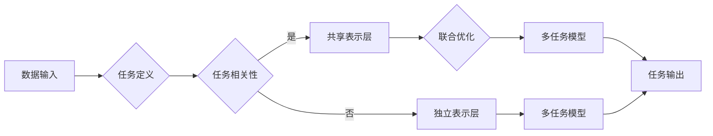

# 多任务学习Multi-Task Learning原理与代码实例讲解

> 关键词：多任务学习，共享表示，联合优化，深度学习，迁移学习，协同训练

## 1. 背景介绍

随着深度学习技术的快速发展，单任务学习（Single-Task Learning）在各个领域都取得了显著的成果。然而，现实世界中的许多问题往往涉及多个相关任务，例如，在自然语言处理（NLP）中，文本情感分析、实体识别和命名实体识别等任务往往具有相关性。多任务学习（Multi-Task Learning, MTL）正是为了解决这类问题而提出的。

多任务学习旨在通过共享表示层（Shared Representation）和联合优化（Joint Optimization）来同时学习多个相关任务。这种方法不仅可以提高模型的泛化能力，还可以减少计算成本，使得模型能够在多个任务上同时取得良好的性能。

## 2. 核心概念与联系

### 2.1 核心概念

- **共享表示层**：多个任务共享同一组参数，这有助于学习到通用的特征表示，从而提高模型的泛化能力。

- **联合优化**：通过优化多个任务的损失函数，使得各个任务能够相互促进，共同提高。

- **任务相关性**：任务之间的相关性可以是功能上的（如情感分析和主题分类），也可以是数据上的（如图像识别和物体检测）。

### 2.2 Mermaid流程图



### 2.3 联系

- 共享表示层和联合优化是多任务学习的关键，它们共同决定了模型在多个任务上的性能。

- 任务相关性是设计多任务学习模型的重要依据，它影响了共享表示层的结构和联合优化策略。

## 3. 核心算法原理 & 具体操作步骤

### 3.1 算法原理概述

多任务学习的核心思想是利用任务之间的相关性来提高模型的泛化能力和效率。具体来说，多任务学习模型通过以下步骤实现：

1. 定义多个相关任务。
2. 设计共享表示层，使得多个任务共享同一组参数。
3. 对共享表示层进行联合优化，使得多个任务能够相互促进。
4. 根据任务需求，设计独立的任务输出层。
5. 训练和评估多任务模型。

### 3.2 算法步骤详解

1. **定义任务**：首先需要明确要解决的任务，并确定它们之间的关系。

2. **设计共享表示层**：根据任务相关性，设计共享表示层，使得多个任务共享同一组参数。共享表示层可以是一个深度神经网络，其输出可以作为多个任务的输入。

3. **联合优化**：使用联合优化策略来优化共享表示层的参数。常见的联合优化策略包括以下几种：

   - **权重共享**：将多个任务的损失函数合并为一个总损失函数，并使用同一个优化器来更新参数。
   - **任务加权**：在总损失函数中为每个任务分配不同的权重，以平衡不同任务的贡献。
   - **多任务损失**：为每个任务设计特定的损失函数，并在总损失函数中结合这些损失函数。

4. **设计任务输出层**：根据任务需求，设计独立的任务输出层。输出层可以是分类器、回归器或其他类型的神经网络。

5. **训练和评估**：使用训练数据训练多任务模型，并使用验证数据评估模型性能。根据评估结果调整模型结构和超参数。

### 3.3 算法优缺点

**优点**：

- 提高模型的泛化能力：通过共享表示层，模型可以学习到更加通用的特征表示，从而提高在未见过的数据上的表现。
- 减少计算成本：共享表示层减少了参数的数量，从而降低了计算成本。
- 提高模型效率：多任务模型可以在多个任务上同时进行推理，从而提高模型效率。

**缺点**：

- 模型性能依赖于任务相关性：如果任务之间没有相关性，共享表示层可能无法提供有效的特征表示，从而导致模型性能下降。
- 模型复杂度增加：多任务模型通常比单任务模型更复杂，需要更多的计算资源。
- 超参数调整困难：多任务模型通常需要更多的超参数调整，这使得模型训练更加困难。

### 3.4 算法应用领域

多任务学习在以下领域得到了广泛应用：

- 计算机视觉：图像识别、物体检测、图像分割等。
- 自然语言处理：文本分类、情感分析、机器翻译等。
- 语音处理：说话人识别、语音识别、语音合成等。
- 生物信息学：基因表达分析、蛋白质结构预测等。

## 4. 数学模型和公式 & 详细讲解 & 举例说明

### 4.1 数学模型构建

多任务学习的数学模型可以表示为：

$$
\mathcal{L}(\theta) = \sum_{i=1}^M \lambda_i \ell_i(\theta)
$$

其中，$\mathcal{L}$ 是总损失函数，$\theta$ 是模型参数，$M$ 是任务的数量，$\ell_i(\theta)$ 是第 $i$ 个任务的损失函数，$\lambda_i$ 是第 $i$ 个任务的权重。

### 4.2 公式推导过程

假设我们有 $M$ 个相关任务，每个任务的目标函数为：

$$
\ell_i(\theta) = \frac{1}{N_i} \sum_{n=1}^{N_i} \ell(\theta, x_n^{(i)}, y_n^{(i)})
$$

其中，$x_n^{(i)}$ 是第 $i$ 个任务的第 $n$ 个输入样本，$y_n^{(i)}$ 是对应的标签，$\ell$ 是损失函数。

将上述公式代入总损失函数，得：

$$
\mathcal{L}(\theta) = \sum_{i=1}^M \lambda_i \ell_i(\theta) = \sum_{i=1}^M \lambda_i \left( \frac{1}{N_i} \sum_{n=1}^{N_i} \ell(\theta, x_n^{(i)}, y_n^{(i)}) \right)
$$

### 4.3 案例分析与讲解

以下是一个简单的多任务学习例子，假设我们有两个相关任务：

- 任务 1：分类任务，输入为文本数据，输出为文本类别。
- 任务 2：情感分析任务，输入为文本数据，输出为情感类别。

我们可以设计一个共享表示层，将文本数据转换为特征表示，然后分别为两个任务设计独立的输出层。总损失函数可以表示为：

$$
\mathcal{L}(\theta) = \lambda_1 \ell_1(\theta) + \lambda_2 \ell_2(\theta)
$$

其中，$\ell_1$ 是分类任务的损失函数，$\ell_2$ 是情感分析任务的损失函数。

## 5. 项目实践：代码实例和详细解释说明

### 5.1 开发环境搭建

为了演示多任务学习的实现，我们将使用Python和TensorFlow框架。以下是开发环境的搭建步骤：

1. 安装TensorFlow：

```bash
pip install tensorflow
```

2. 安装其他必要的库：

```bash
pip install numpy pandas scikit-learn matplotlib
```

### 5.2 源代码详细实现

以下是一个简单的多任务学习例子，我们将使用TensorFlow实现一个同时进行文本分类和情感分析的任务。

```python
import tensorflow as tf
from tensorflow.keras.layers import Embedding, LSTM, Dense
from tensorflow.keras.models import Model

# 定义模型结构
def build_model(vocab_size, embedding_dim, hidden_units, output_sizes):
    inputs = tf.keras.Input(shape=(None,), dtype='int32')
    x = Embedding(vocab_size, embedding_dim)(inputs)
    x = LSTM(hidden_units)(x)
    outputs = []
    for output_size in output_sizes:
        output = Dense(output_size, activation='softmax')(x)
        outputs.append(output)
    model = Model(inputs=inputs, outputs=outputs)
    return model

# 构建模型
vocab_size = 10000  # 假设有10000个词汇
embedding_dim = 128
hidden_units = 64
output_sizes = [2, 1]  # 文本分类和情感分析

model = build_model(vocab_size, embedding_dim, hidden_units, output_sizes)

# 编译模型
model.compile(optimizer='adam',
              loss={'class': 'categorical_crossentropy', 'sentiment': 'binary_crossentropy'},
              metrics={'class': 'accuracy', 'sentiment': 'accuracy'})

# 模型结构
model.summary()
```

### 5.3 代码解读与分析

在上面的代码中，我们首先定义了一个函数 `build_model`，用于构建多任务学习模型。该函数接受词汇量、嵌入维度、隐藏层单元数和输出大小作为输入，并返回构建好的模型。

在 `build_model` 函数中，我们首先创建了一个输入层 `inputs`，然后使用 `Embedding` 层将文本数据转换为嵌入表示。接下来，我们使用 `LSTM` 层对嵌入表示进行处理，得到特征表示。

然后，我们为每个任务创建了一个 `Dense` 层，并使用 `softmax` 激活函数，得到任务输出。

在模型构建完成后，我们使用 `Model` 类将输入层、输出层和中间层组合成一个完整的模型。

最后，我们使用 `compile` 方法编译模型，指定优化器、损失函数和评估指标。

### 5.4 运行结果展示

为了演示模型的运行结果，我们可以使用以下代码：

```python
import numpy as np

# 创建随机数据
vocab_size = 10000
embedding_dim = 128
hidden_units = 64
output_sizes = [2, 1]

X = np.random.randint(1, vocab_size, (10, 50))  # 10个样本，每个样本长度为50
y_class = np.random.randint(0, 2, (10, 2))  # 10个样本的文本分类标签
y_sentiment = np.random.randint(0, 2, (10, 1))  # 10个样本的情感分析标签

# 训练模型
model.fit(X, {'class': y_class, 'sentiment': y_sentiment}, epochs=10)

# 预测
predictions = model.predict(X)
print(predictions)
```

在这个例子中，我们创建了10个随机样本的数据，并使用这些数据训练和预测模型。模型的输出是一个包含两个数组的字典，分别对应文本分类和情感分析的结果。

## 6. 实际应用场景

多任务学习在以下实际应用场景中得到了广泛应用：

- **医疗诊断**：在医疗诊断中，可以通过多任务学习同时预测多个疾病，如糖尿病、高血压和心脏病。

- **语音识别**：在语音识别中，可以通过多任务学习同时进行说话人识别、语音合成和语音情感分析。

- **自然语言处理**：在自然语言处理中，可以通过多任务学习同时进行文本分类、情感分析和实体识别。

- **图像识别**：在图像识别中，可以通过多任务学习同时进行目标检测、图像分割和图像分类。

## 7. 工具和资源推荐

### 7.1 学习资源推荐

- **《深度学习》（Goodfellow et al.）**：这本书提供了深度学习的全面介绍，包括多任务学习。
- **《深度学习与计算机视觉》（Fei-Fei Li）**：这本书介绍了深度学习在计算机视觉领域的应用，其中包括多任务学习。
- **《深度学习与自然语言处理》（Doina Precup）**：这本书介绍了深度学习在自然语言处理领域的应用，其中包括多任务学习。

### 7.2 开发工具推荐

- **TensorFlow**：TensorFlow是一个开源的深度学习框架，它提供了丰富的工具和库，可以用于多任务学习。
- **PyTorch**：PyTorch是一个开源的深度学习框架，它提供了动态计算图，可以方便地进行多任务学习。
- **Keras**：Keras是一个基于TensorFlow和Theano的开源深度学习库，它提供了简单的API，可以方便地进行多任务学习。

### 7.3 相关论文推荐

- **“Multi-Task Learning” by Yair Weiss (1999)**：这篇论文提出了多任务学习的基本概念和理论框架。
- **“Multi-Task Learning Using Deep Neural Networks” by Yarin Gal and Zoubin Ghahramani (2016)**：这篇论文介绍了使用深度神经网络进行多任务学习的方法。
- **“Deep Multi-Task Learning” by Graham W. Taylor et al. (2016)**：这篇论文介绍了深度多任务学习的理论和方法。

## 8. 总结：未来发展趋势与挑战

### 8.1 研究成果总结

多任务学习是一种有效的机器学习方法，它通过共享表示层和联合优化策略，可以在多个相关任务上同时取得良好的性能。多任务学习在各个领域都得到了广泛应用，并取得了显著的成果。

### 8.2 未来发展趋势

- **更加通用的多任务学习方法**：未来的研究将致力于开发更加通用的多任务学习方法，使得模型能够在更多样化的任务上同时学习。
- **多任务学习的可解释性**：未来的研究将更加关注多任务学习的可解释性，使得模型的行为更加透明和可靠。
- **多任务学习的硬件加速**：随着硬件技术的发展，多任务学习的计算效率将得到进一步提高。

### 8.3 面临的挑战

- **任务相关性**：如何准确地识别和利用任务之间的相关性是多任务学习的一个挑战。
- **模型复杂度**：多任务学习模型通常比单任务模型更复杂，需要更多的计算资源。
- **超参数调整**：多任务学习模型通常需要更多的超参数调整，这使得模型训练更加困难。

### 8.4 研究展望

多任务学习是一种非常有前景的机器学习方法，它将在未来的人工智能研究中发挥重要作用。未来，随着研究的深入和技术的进步，多任务学习将会在更多领域得到应用，并为解决实际问题提供更加有效的解决方案。

## 9. 附录：常见问题与解答

**Q1：多任务学习和迁移学习有什么区别？**

A：多任务学习和迁移学习都是利用已有知识来解决新问题的方法。多任务学习是在多个相关任务上同时学习，而迁移学习是将知识从一个领域迁移到另一个领域。

**Q2：多任务学习是否总是比单任务学习更有效？**

A：不一定。多任务学习在任务之间存在相关性时通常更有效。如果任务之间没有相关性，多任务学习可能不会带来性能提升。

**Q3：如何设计共享表示层？**

A：设计共享表示层时，需要考虑任务之间的相关性。如果任务之间存在相关性，可以共享特征提取层；如果任务之间没有相关性，则需要为每个任务设计独立的特征提取层。

**Q4：多任务学习是否可以提高模型的泛化能力？**

A：是的。多任务学习可以通过共享表示层学习到更加通用的特征表示，从而提高模型的泛化能力。

**Q5：如何评估多任务学习模型的效果？**

A：可以使用多个指标来评估多任务学习模型的效果，如准确率、召回率、F1分数等。

作者：禅与计算机程序设计艺术 / Zen and the Art of Computer Programming