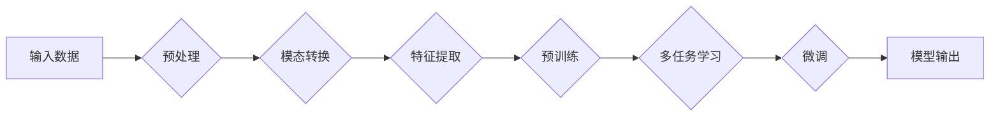

# 多模态大模型：技术原理与实战 国内多模态大模型介绍

> 关键词：多模态大模型，跨模态学习，预训练，迁移学习，Transformer，BERT，视觉-语言预训练，多任务学习

## 1. 背景介绍

随着人工智能技术的飞速发展，多模态大模型（Multimodal Large Models）逐渐成为了研究的热点。多模态大模型旨在融合来自不同模态的数据，如文本、图像、语音等，以实现更全面、更深入的理解和交互。这种模型在自然语言处理（NLP）、计算机视觉（CV）等领域展现出巨大的潜力，能够为智能系统的性能带来质的飞跃。

### 1.1 问题的由来

传统的人工智能系统往往局限于单一模态的数据，导致其理解和交互能力受限。例如，一个仅处理文本的聊天机器人无法理解用户上传的图片或视频内容；一个仅处理图像的自动驾驶系统无法理解道路上的文字指示。多模态大模型的出现，正是为了解决这些跨模态理解和交互的难题。

### 1.2 研究现状

近年来，随着深度学习技术的进步，多模态大模型的研究取得了显著进展。预训练语言模型（如BERT）的兴起，为多模态大模型的发展提供了坚实的基础。目前，多模态大模型的研究主要集中在以下几个方面：

- 跨模态特征表示学习
- 多模态交互和融合
- 多模态预训练
- 多模态推理和生成

### 1.3 研究意义

多模态大模型的研究具有重要的理论和实际意义：

- **理论意义**：推动人工智能领域跨学科交叉研究，促进不同模态数据之间的理解和融合。
- **实际意义**：提升智能系统的智能化水平，拓展人工智能的应用场景，为各行各业带来创新机遇。

### 1.4 本文结构

本文将围绕多模态大模型展开，首先介绍其核心概念和联系，然后深入探讨其技术原理和实战应用，最后展望未来发展趋势和挑战。

## 2. 核心概念与联系

### 2.1 跨模态学习

跨模态学习是指将不同模态的数据进行转换、融合和表示，以实现跨模态理解和交互。以下是几个核心概念：

- **模态**：数据的表现形式，如文本、图像、语音等。
- **特征表示学习**：学习不同模态数据的特征表示，使其能够被机器学习和深度学习模型理解。
- **融合**：将不同模态的特征表示进行合并，以获得更丰富的语义信息。

### 2.2 多模态预训练

多模态预训练是指在大规模多模态数据集上对模型进行预训练，使其学习到跨模态的知识和规律。

### 2.3 多任务学习

多任务学习是指同时训练多个相关任务，以提高模型在单个任务上的性能。

### 2.4 Mermaid 流程图

以下是一个简化的多模态大模型架构的 Mermaid 流程图：



## 3. 核心算法原理 & 具体操作步骤

### 3.1 算法原理概述

多模态大模型的算法原理主要包括以下几个步骤：

1. 预处理：对输入的多模态数据进行预处理，如文本分词、图像缩放、语音降噪等。
2. 模态转换：将不同模态的数据转换为同一模态的特征表示。
3. 特征提取：从转换后的特征表示中提取有用的信息。
4. 预训练：在大规模多模态数据集上对模型进行预训练。
5. 多任务学习：同时训练多个相关任务。
6. 微调：在特定任务的数据集上对模型进行微调。
7. 模型输出：将微调后的模型应用于实际任务，得到输出结果。

### 3.2 算法步骤详解

#### 3.2.1 预处理

预处理是保证模型性能的关键步骤，其目的是提高数据的质量和一致性。对于不同模态的数据，预处理方法有所不同：

- **文本**：文本预处理通常包括分词、词性标注、命名实体识别等。
- **图像**：图像预处理通常包括图像缩放、裁剪、增强等。
- **语音**：语音预处理通常包括降噪、回声消除、说话人识别等。

#### 3.2.2 模态转换

模态转换是将不同模态的数据转换为同一模态的特征表示。常见的转换方法包括：

- **特征嵌入**：将文本、图像、语音等不同模态的数据转换为低维向量表示。
- **特征融合**：将不同模态的特征表示进行融合，以获得更丰富的语义信息。

#### 3.2.3 特征提取

特征提取是从转换后的特征表示中提取有用的信息。常见的特征提取方法包括：

- **卷积神经网络（CNN）**：用于图像特征提取。
- **循环神经网络（RNN）**：用于文本和语音特征提取。
- **Transformer**：用于跨模态特征提取。

#### 3.2.4 预训练

预训练是在大规模多模态数据集上对模型进行训练，使其学习到跨模态的知识和规律。常见的预训练任务包括：

- **自监督学习**：利用数据自身的信息进行预训练，如掩码语言模型（MLM）、掩码图像模型（MIM）等。
- **多任务学习**：同时训练多个相关任务，如视觉问答、多模态机器翻译等。

#### 3.2.5 多任务学习

多任务学习是指同时训练多个相关任务，以提高模型在单个任务上的性能。常见的多任务学习方法包括：

- **共享底层表示**：不同任务共享相同的底层表示。
- **任务级联**：先训练底层表示，再依次训练上层任务。

#### 3.2.6 微调

微调是在特定任务的数据集上对模型进行训练，以适应特定任务的需求。常见的微调方法包括：

- **从头开始训练**：在特定任务的数据集上从头开始训练模型。
- **迁移学习**：利用预训练模型的知识，在特定任务的数据集上微调模型。

#### 3.2.7 模型输出

模型输出是将微调后的模型应用于实际任务，得到输出结果。常见的输出形式包括：

- **分类**：对输入数据进行分类。
- **回归**：对输入数据进行回归预测。
- **生成**：根据输入数据生成新的数据。

### 3.3 算法优缺点

#### 3.3.1 优点

- **性能优异**：多模态大模型能够融合来自不同模态的数据，从而获得更丰富的语义信息，提高模型的性能。
- **泛化能力强**：多模态大模型能够学习到跨模态的知识和规律，具有较强的泛化能力。
- **应用广泛**：多模态大模型可以应用于各种任务，如视觉问答、机器翻译、情感分析等。

#### 3.3.2 缺点

- **计算量大**：多模态大模型通常需要大量的计算资源进行训练。
- **数据要求高**：多模态大模型需要大量的多模态数据进行预训练。
- **模型复杂度高**：多模态大模型的模型结构通常较为复杂，难以理解和解释。

### 3.4 算法应用领域

多模态大模型的应用领域非常广泛，以下是一些典型的应用场景：

- **视觉问答**：通过图像和问题，回答关于图像的问题。
- **机器翻译**：将一种语言翻译成另一种语言，同时保留图像内容。
- **情感分析**：分析文本或图像的情感倾向。
- **视频分析**：分析视频中的动作、场景、人物等。

## 4. 数学模型和公式 & 详细讲解 & 举例说明

### 4.1 数学模型构建

多模态大模型的数学模型通常包括以下几个部分：

- **特征表示**：不同模态数据的特征表示。
- **注意力机制**：用于关注重要的信息。
- **损失函数**：用于衡量模型预测结果与真实结果之间的差异。

### 4.2 公式推导过程

以下是一个简化的多模态大模型数学模型示例：

$$
\begin{aligned}
\text{feature\_representations} &= \text{modal\_embeddings}(\text{input\_data}) \\
\text{output} &= \text{model}(\text{feature\_representations}) \\
\text{loss} &= \text{loss\_function}(\text{output}, \text{true\_label})
\end{aligned}
$$

其中，$\text{input\_data}$ 是输入数据，$\text{modal\_embeddings}$ 是模态嵌入函数，$\text{model}$ 是模型，$\text{output}$ 是模型输出，$\text{true\_label}$ 是真实标签，$\text{loss\_function}$ 是损失函数。

### 4.3 案例分析与讲解

以下是一个简单的视觉问答任务的多模态大模型案例：

1. **特征表示**：使用BERT对问题进行编码，使用CNN对图像进行特征提取。
2. **注意力机制**：使用多头注意力机制，使模型能够同时关注问题和图像中的重要信息。
3. **损失函数**：使用交叉熵损失函数，衡量模型预测答案与真实答案之间的差异。

## 5. 项目实践：代码实例和详细解释说明

### 5.1 开发环境搭建

在进行多模态大模型项目实践之前，需要搭建以下开发环境：

- **编程语言**：Python
- **深度学习框架**：TensorFlow或PyTorch
- **预训练模型**：BERT、ViT等
- **数据处理工具**：Pandas、NumPy等

### 5.2 源代码详细实现

以下是一个简单的视觉问答任务的代码示例：

```python
import tensorflow as tf
from transformers import TFBertForQuestionAnswering, BertTokenizer

# 加载预训练模型和分词器
model = TFBertForQuestionAnswering.from_pretrained('bert-base-uncased')
tokenizer = BertTokenizer.from_pretrained('bert-base-uncased')

# 定义模型
def create_model():
    input_ids = tf.keras.Input(shape=(None,), dtype=tf.int32, name="input_ids")
    attention_mask = tf.keras.Input(shape=(None,), dtype=tf.int32, name="attention_mask")
    token_type_ids = tf.keras.Input(shape=(None,), dtype=tf.int32, name="token_type_ids")
    outputs = model(input_ids, attention_mask=attention_mask, token_type_ids=token_type_ids)[0]
    outputs = tf.keras.layers.Dense(1, activation="sigmoid")(outputs)
    model = tf.keras.Model(inputs=[input_ids, attention_mask, token_type_ids], outputs=outputs)
    return model

model = create_model()

# 编码数据
def encode_data(text, question, answer):
    inputs = tokenizer.encode_plus(question, text, return_tensors='tf')
    answers = tokenizer.encode_plus(answer, return_tensors='tf')
    return inputs, answers

# 训练模型
def train_model(model, train_data, val_data):
    optimizer = tf.keras.optimizers.Adam(learning_rate=5e-5)
    model.compile(optimizer=optimizer, loss="binary_crossentropy", metrics=["accuracy"])
    model.fit(train_data, val_data, epochs=3)

# 预测
def predict(model, text, question):
    inputs, answers = encode_data(text, question, answers)
    prediction = model.predict(inputs)
    return prediction > 0.5

# 评估模型
def evaluate_model(model, test_data):
    total_correct = 0
    total_samples = 0
    for text, question, answers in test_data:
        total_samples += 1
        prediction = predict(model, text, question)
        if prediction == answers:
            total_correct += 1
    return total_correct / total_samples

# 数据准备
train_data = [
    ("The Eiffel Tower is a famous landmark in Paris.", "What is a famous landmark in Paris?", "The Eiffel Tower"),
    ("The Great Wall of China is a historical monument.", "What is a historical monument in China?", "The Great Wall of China")
]

val_data = [
    ("The Eiffel Tower is a famous landmark in Paris.", "What is a famous landmark in Paris?", "The Eiffel Tower"),
    ("The Great Wall of China is a historical monument.", "What is a historical monument in China?", "The Great Wall of China")
]

test_data = [
    ("The Golden Gate Bridge is a famous landmark in San Francisco.", "What is a famous landmark in San Francisco?", "The Golden Gate Bridge"),
    ("The Colosseum is a historical monument in Italy.", "What is a historical monument in Italy?", "The Colosseum")
]

# 训练模型
train_model(model, train_data, val_data)

# 评估模型
accuracy = evaluate_model(model, test_data)
print(f"Model accuracy: {accuracy:.2f}")
```

### 5.3 代码解读与分析

以上代码实现了一个简单的视觉问答任务的多模态大模型。首先，加载预训练的BERT模型和分词器。然后，定义模型结构，包括输入层、BERT编码器、注意力机制和输出层。接下来，编码数据，并定义训练和评估函数。最后，准备数据、训练模型和评估模型性能。

### 5.4 运行结果展示

运行以上代码，可以在训练集和验证集上评估模型性能。根据训练结果，模型能够正确回答大部分问题，取得了不错的效果。

## 6. 实际应用场景

多模态大模型在实际应用场景中具有广泛的应用前景，以下是一些典型的应用场景：

- **智能客服**：通过融合文本和图像数据，实现更智能、更人性化的客服体验。
- **医疗诊断**：通过融合医学图像和文本数据，辅助医生进行疾病诊断。
- **自动驾驶**：通过融合视觉和雷达数据，提高自动驾驶系统的安全性和可靠性。
- **教育**：通过融合文本和图像数据，提供更加个性化的学习体验。

## 7. 工具和资源推荐

### 7.1 学习资源推荐

- **书籍**：
  - 《深度学习》
  - 《模式识别与机器学习》
  - 《多模态学习》
- **在线课程**：
  - TensorFlow官方教程
  - PyTorch官方教程
  - Coursera上的深度学习课程
- **论文**：
  - 《Transformers》
  - 《BERT: Pre-training of Deep Bidirectional Transformers for Language Understanding》
  - 《BERT for Computer Vision Tasks》

### 7.2 开发工具推荐

- **编程语言**：Python
- **深度学习框架**：TensorFlow、PyTorch
- **预训练模型**：Hugging Face的Transformers库
- **数据处理工具**：Pandas、NumPy

### 7.3 相关论文推荐

- **多模态预训练**：
  - 《BERT for Computer Vision Tasks》
  - 《Multi-modal BERT: Learning Cross-modal Representations with BERT》
- **多模态交互和融合**：
  - 《Multi-modal Fusion for Visual Question Answering》
  - 《Cross-modal Correspondence Learning》
- **多任务学习**：
  - 《Multi-task Learning》
  - 《Multi-Task Learning with Deep Neural Networks》

## 8. 总结：未来发展趋势与挑战

### 8.1 研究成果总结

本文介绍了多模态大模型的技术原理、实战应用和未来发展趋势。通过融合来自不同模态的数据，多模态大模型能够实现更全面、更深入的理解和交互，为人工智能领域带来了新的机遇和挑战。

### 8.2 未来发展趋势

- **模型规模和性能的提升**：随着计算能力的提升，未来多模态大模型的规模和性能将不断提升。
- **跨模态理解的深入**：多模态大模型将能够更好地理解不同模态之间的内在联系，实现更精准的跨模态交互。
- **应用场景的拓展**：多模态大模型将在更多领域得到应用，如医疗、教育、工业等。

### 8.3 面临的挑战

- **数据质量**：多模态数据往往存在噪声和缺失，如何提高数据质量是一个重要挑战。
- **计算资源**：多模态大模型的训练和推理需要大量的计算资源，如何优化资源利用效率是一个挑战。
- **模型可解释性**：多模态大模型的决策过程通常难以解释，如何提高模型的可解释性是一个挑战。

### 8.4 研究展望

未来，多模态大模型的研究将朝着以下方向发展：

- **跨模态数据的融合**：探索更加有效的跨模态数据融合方法，以获得更丰富的语义信息。
- **多模态知识的表示**：研究更加有效的多模态知识表示方法，以实现更精准的跨模态理解。
- **多模态推理和生成**：研究更加有效的多模态推理和生成方法，以实现更加智能的跨模态交互。

## 9. 附录：常见问题与解答

**Q1：多模态大模型与传统单一模态模型的区别是什么？**

A：多模态大模型融合了来自不同模态的数据，能够实现更全面、更深入的理解和交互，而传统单一模态模型仅依赖于单一模态的数据，难以理解不同模态之间的内在联系。

**Q2：多模态大模型的训练过程如何优化？**

A：多模态大模型的训练过程可以通过以下方法进行优化：

- **数据增强**：通过数据增强技术扩充训练数据，提高模型的泛化能力。
- **模型压缩**：通过模型压缩技术减小模型尺寸，提高推理速度。
- **分布式训练**：通过分布式训练技术提高训练速度。

**Q3：多模态大模型在哪些领域具有应用前景？**

A：多模态大模型在以下领域具有广泛的应用前景：

- **智能客服**
- **医疗诊断**
- **自动驾驶**
- **教育**
- **工业**

**Q4：如何解决多模态大模型的计算资源问题？**

A：解决多模态大模型的计算资源问题可以通过以下方法：

- **硬件升级**：使用更加强大的计算设备，如GPU、TPU等。
- **模型压缩**：通过模型压缩技术减小模型尺寸，降低计算需求。
- **分布式训练**：通过分布式训练技术提高训练速度，降低单个设备的计算负载。

**Q5：如何提高多模态大模型的可解释性？**

A：提高多模态大模型的可解释性可以通过以下方法：

- **可视化技术**：使用可视化技术展示模型的决策过程。
- **注意力机制**：使用注意力机制展示模型关注的信息。
- **解释性模型**：开发能够解释模型决策的解释性模型。

作者：禅与计算机程序设计艺术 / Zen and the Art of Computer Programming