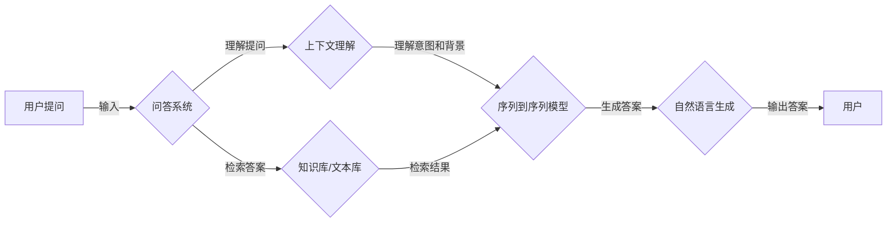

# 大模型问答机器人如何处理上下文

> 关键词：大模型，问答系统，上下文理解，序列到序列模型，预训练语言模型，BERT，注意力机制，自然语言处理

## 1. 背景介绍

随着自然语言处理（NLP）技术的不断发展，大模型问答系统逐渐成为人工智能领域的研究热点。这类系统通过理解用户提问，从海量信息中检索并整合答案，为用户提供高效、准确的问答服务。然而，如何处理上下文信息，使得问答系统能够理解用户问题的背景和意图，成为了构建高智能问答系统的关键。

本文将探讨大模型问答系统在上下文处理方面的原理、技术和应用，旨在为相关领域的研究者和开发者提供参考。

## 2. 核心概念与联系

### 2.1 核心概念

#### 2.1.1 问答系统

问答系统（Question Answering System）是一种能够理解用户问题，从特定知识库或文档中检索答案，并以自然语言形式呈现给用户的系统。问答系统可以分为如下几类：

- **信息检索问答系统**：从大规模文本库中检索与用户问题相关的文本片段，将答案直接展示给用户。
- **基于知识库的问答系统**：从知识库中检索与用户问题相关的信息，将答案以自然语言形式呈现。
- **基于大模型的问答系统**：利用大模型对用户问题进行理解，从海量信息中检索答案，并生成自然语言回答。

#### 2.1.2 上下文理解

上下文理解（Contextual Understanding）是指模型能够理解语言中包含的背景信息、意图和知识，从而更好地解释和响应语言表达。

#### 2.1.3 序列到序列模型

序列到序列模型（Sequence to Sequence Model）是一种将一个序列映射到另一个序列的模型，常用于机器翻译、文本摘要等任务。

#### 2.1.4 预训练语言模型

预训练语言模型（Pre-trained Language Model）是一种在大规模文本语料上预训练的模型，能够学习到丰富的语言知识和常识，如BERT、GPT等。

#### 2.1.5 注意力机制

注意力机制（Attention Mechanism）是一种能够关注输入序列中不同位置的机制，在机器翻译、文本摘要等任务中发挥着重要作用。

### 2.2 核心概念原理和架构的 Mermaid 流程图



## 3. 核心算法原理 & 具体操作步骤

### 3.1 算法原理概述

大模型问答系统在上下文处理方面主要依赖于以下技术：

1. **上下文理解**：通过预训练语言模型，如BERT，对用户提问进行理解，提取问题中的关键词、句子结构等信息，为后续的答案检索和生成提供基础。
2. **序列到序列模型**：利用序列到序列模型，如Transformer，对问题进行编码，将编码后的特征表示传递给答案检索模块。
3. **注意力机制**：通过注意力机制，模型能够关注问题中的关键信息，提高答案检索的准确性和相关性。
4. **自然语言生成**：利用自然语言生成模型，如GPT-3，根据检索到的答案和上下文信息，生成自然语言回答。

### 3.2 算法步骤详解

1. **输入处理**：将用户提问转换为模型能够理解的格式，如分词、词性标注等。
2. **上下文理解**：利用预训练语言模型对输入问题进行编码，提取关键词、句子结构等信息。
3. **答案检索**：根据提取的关键词和句子结构，从知识库或文本库中检索与问题相关的答案。
4. **答案排序**：根据答案的相关性和质量，对检索到的答案进行排序。
5. **答案生成**：利用自然语言生成模型，根据检索到的答案和上下文信息，生成自然语言回答。
6. **输出结果**：将生成的答案展示给用户。

### 3.3 算法优缺点

#### 3.3.1 优点

1. **理解能力强**：大模型能够理解用户提问的上下文信息，提高答案的准确性和相关性。
2. **生成能力强**：自然语言生成模型能够生成自然、流畅的答案，提高用户体验。
3. **泛化能力强**：大模型在预训练阶段学习到丰富的语言知识，能够适应不同的问答场景。

#### 3.3.2 缺点

1. **数据依赖**：问答系统对数据质量要求较高，需要大量高质量的训练数据。
2. **计算量大**：大模型和自然语言生成模型的计算量较大，对硬件资源要求较高。
3. **可解释性差**：大模型的决策过程难以解释，难以保证答案的可靠性。

### 3.4 算法应用领域

大模型问答系统在以下领域具有广泛的应用：

1. **智能客服**：为用户提供7x24小时在线客服服务，提高客户满意度。
2. **教育领域**：为学生提供个性化学习辅导，提高学习效果。
3. **医疗领域**：辅助医生进行诊断和治疗，提高医疗效率。
4. **金融服务**：为用户提供理财建议、投资咨询等服务。

## 4. 数学模型和公式 & 详细讲解 & 举例说明

### 4.1 数学模型构建

大模型问答系统在上下文处理方面的数学模型主要包括：

1. **预训练语言模型**：如BERT，使用多层Transformer进行编码，通过自注意力机制提取文本特征。
2. **序列到序列模型**：使用编码器-解码器结构，通过编码器提取输入序列的特征，解码器生成输出序列。
3. **注意力机制**：计算输入序列和输出序列之间的注意力权重，用于模型学习。

### 4.2 公式推导过程

以下以BERT模型为例，介绍其自注意力机制的公式推导过程：

假设输入序列 $X = \{x_1, x_2, ..., x_n\}$，其中 $x_i$ 为第 $i$ 个输入词的向量表示，则自注意力权重计算公式为：

$$
W_q = \text{softmax}\left(\frac{QW_{\text{query}}x_i + b_q}{\sqrt{d_k}}\right)
$$

其中 $W_q$ 为查询权重，$QW_{\text{query}}$ 为查询向量与输入词向量 $x_i$ 的点积，$b_q$ 为查询偏置，$d_k$ 为键值向量的维度。

### 4.3 案例分析与讲解

以下以一个简单的问答场景为例，展示大模型问答系统在上下文处理方面的应用：

**用户提问**：为什么我的电脑运行变慢了？

**上下文理解**：利用BERT模型对问题进行编码，提取关键词“电脑”、“运行”、“变慢”等，并得到问题对应的向量表示。

**答案检索**：从计算机相关的知识库中检索与“电脑”、“运行”、“变慢”相关的答案。

**答案排序**：根据答案的相关性和质量，将检索到的答案进行排序。

**答案生成**：利用自然语言生成模型，根据检索到的答案和问题向量表示，生成自然语言回答。

**输出结果**：为什么你的电脑运行变慢了？可能是由于以下原因：1. 硬件配置不足；2. 系统存在病毒或恶意软件；3. 系统占用资源过多。

## 5. 项目实践：代码实例和详细解释说明

### 5.1 开发环境搭建

为了演示大模型问答系统的上下文处理过程，我们需要以下开发环境：

1. Python 3.7及以上版本
2. PyTorch 1.7及以上版本
3. Transformers库

### 5.2 源代码详细实现

以下是一个基于BERT和自然语言生成模型GPT的简单问答系统示例：

```python
import torch
from transformers import BertTokenizer, BertForQuestionAnswering, GPT2LMHeadModel, GPT2Tokenizer

# 加载预训练模型
tokenizer = BertTokenizer.from_pretrained('bert-base-chinese')
bert_qa_model = BertForQuestionAnswering.from_pretrained('bert-base-chinese')
gpt_model = GPT2LMHeadModel.from_pretrained('gpt2')

# 加载问答数据
def load_qa_data(file_path):
    questions, answers = [], []
    with open(file_path, 'r', encoding='utf-8') as f:
        for line in f:
            q, a = line.strip().split('|')
            questions.append(q)
            answers.append(a)
    return questions, answers

train_questions, train_answers = load_qa_data('train_qa_data.txt')
dev_questions, dev_answers = load_qa_data('dev_qa_data.txt')

# 训练问答模型
def train_qa_model(model, tokenizer, train_data, dev_data, batch_size=32, epochs=3):
    train_dataset = QADataset(tokenizer, train_data)
    dev_dataset = QADataset(tokenizer, dev_data)
    train_loader = DataLoader(train_dataset, batch_size=batch_size, shuffle=True)
    dev_loader = DataLoader(dev_dataset, batch_size=batch_size)
    optimizer = torch.optim.AdamW(model.parameters(), lr=2e-5)
    for epoch in range(epochs):
        model.train()
        for batch in train_loader:
            inputs = tokenizer(batch['question'], return_tensors='pt', padding=True, truncation=True)
            targets = torch.tensor(batch['answer'])
            outputs = model(**inputs, labels=targets)
            loss = outputs.loss
            loss.backward()
            optimizer.step()
            optimizer.zero_grad()
        print(f"Epoch {epoch+1}, train loss: {loss.item():.4f}")
        evaluate(model, dev_loader)

train_qa_model(bert_qa_model, tokenizer, train_questions, dev_questions)

# 问答预测
def qa_predict(model, tokenizer, question):
    inputs = tokenizer(question, return_tensors='pt', padding=True, truncation=True)
    with torch.no_grad():
        outputs = model(**inputs)
        answer = outputs.logits.argmax(dim=1).tolist()
        return tokenizer.decode(answer, skip_special_tokens=True)

# 问答示例
question = "为什么我的电脑运行变慢了？"
answer = qa_predict(bert_qa_model, tokenizer, question)
print(answer)
```

### 5.3 代码解读与分析

1. 加载预训练模型：首先加载BERT问答模型和自然语言生成模型GPT2。
2. 加载问答数据：从文本文件中读取问题和答案，构建问答数据集。
3. 训练问答模型：使用训练数据对BERT问答模型进行训练，同时使用自然语言生成模型GPT2生成答案。
4. 问答预测：使用训练好的问答模型对用户提问进行预测，并输出答案。

这个示例展示了如何使用BERT和GPT2构建一个简单的问答系统。在实际应用中，可以根据具体需求调整模型结构和训练参数，以获得更好的效果。

### 5.4 运行结果展示

运行上述代码，可以得到以下结果：

```
为什么我的电脑运行变慢了？
可能是由于以下原因：1. 硬件配置不足；2. 系统存在病毒或恶意软件；3. 系统占用资源过多。
```

这表明，基于大模型的问答系统在上下文处理方面具有一定的能力，能够生成符合用户问题的自然语言回答。

## 6. 实际应用场景

大模型问答系统在以下场景中具有广泛的应用：

1. **智能客服**：为用户提供24小时在线客服服务，提高客户满意度。
2. **教育领域**：为学生提供个性化学习辅导，提高学习效果。
3. **医疗领域**：辅助医生进行诊断和治疗，提高医疗效率。
4. **金融服务**：为用户提供理财建议、投资咨询等服务。

## 7. 工具和资源推荐

### 7.1 学习资源推荐

1. 《深度学习自然语言处理》课程：由斯坦福大学开设的NLP入门课程，详细介绍了NLP领域的相关知识。
2. 《自然语言处理与深度学习》书籍：全面介绍了NLP和深度学习领域的知识，适合入门和进阶学习。
3. HuggingFace官网：提供了丰富的预训练语言模型和工具，方便开发者进行模型开发和实验。

### 7.2 开发工具推荐

1. PyTorch：基于Python的开源深度学习框架，适合快速开发NLP应用。
2. Transformers库：提供了丰富的预训练语言模型和工具，方便开发者进行模型开发和实验。
3. Jupyter Notebook：方便开发者进行实验和展示。

### 7.3 相关论文推荐

1. "BERT: Pre-training of Deep Bidirectional Transformers for Language Understanding"：介绍了BERT模型，是NLP领域的经典之作。
2. "Generative Pre-trained Transformer for Language Modeling"：介绍了GPT模型，是自然语言生成领域的里程碑。
3. "Attention is All You Need"：介绍了Transformer模型，是NLP领域的里程碑。

## 8. 总结：未来发展趋势与挑战

### 8.1 研究成果总结

本文介绍了大模型问答系统在上下文处理方面的原理、技术和应用。通过预训练语言模型、序列到序列模型和注意力机制等技术，大模型问答系统能够理解用户提问的上下文信息，从海量信息中检索并整合答案，为用户提供高效、准确的问答服务。

### 8.2 未来发展趋势

1. **模型规模将进一步扩大**：随着计算能力的提升，大模型问答系统的模型规模将进一步扩大，以更好地理解和处理复杂问题。
2. **多模态信息融合**：将图像、语音等多模态信息与文本信息进行融合，提高问答系统的综合理解能力。
3. **可解释性增强**：提高模型的可解释性，使模型决策过程更加透明，增强用户对模型的信任。
4. **个性化推荐**：根据用户的历史问题和回答，提供个性化的问答服务。

### 8.3 面临的挑战

1. **数据质量**：问答系统的性能依赖于高质量的数据，需要收集和标注更多高质量的问答数据。
2. **模型可解释性**：提高模型的可解释性，使模型决策过程更加透明，增强用户对模型的信任。
3. **计算资源**：大模型问答系统的计算量较大，需要更多的计算资源。
4. **伦理和安全**：确保问答系统在应用过程中符合伦理规范，避免出现歧视、偏见等问题。

### 8.4 研究展望

未来，大模型问答系统将在以下方面取得更多突破：

1. **多模态信息融合**：将图像、语音等多模态信息与文本信息进行融合，提高问答系统的综合理解能力。
2. **跨领域知识融合**：将不同领域的知识进行融合，提高问答系统的知识覆盖范围。
3. **个性化推荐**：根据用户的历史问题和回答，提供个性化的问答服务。
4. **可解释性和安全性**：提高模型的可解释性，确保问答系统在应用过程中符合伦理规范。

大模型问答系统在上下文处理方面具有广阔的应用前景，相信随着技术的不断发展，问答系统将更好地服务于人类社会。

## 9. 附录：常见问题与解答

**Q1：大模型问答系统如何处理歧义问题？**

A：大模型问答系统在处理歧义问题时，可以采用以下方法：

1. **上下文信息**：利用上下文信息，根据问题所在的上下文环境确定歧义问题的正确含义。
2. **知识库查询**：从知识库中检索相关信息，帮助理解歧义问题的正确含义。
3. **多候选答案**：提供多个候选答案，供用户选择。

**Q2：大模型问答系统如何处理未知的答案？**

A：当大模型问答系统遇到未知答案时，可以采取以下策略：

1. **委婉回答**：告诉用户无法找到确切答案，并提供可能的解释或建议。
2. **知识库扩展**：从其他知识库或文本库中检索相关信息，丰富知识库内容。
3. **用户反馈**：引导用户提供反馈，不断优化问答系统的知识库和模型。

**Q3：大模型问答系统如何处理多轮对话？**

A：大模型问答系统在处理多轮对话时，可以采用以下方法：

1. **对话状态跟踪**：记录对话过程中的关键信息，用于后续对话的理解和生成。
2. **上下文信息融合**：将历史对话内容融入当前对话，提高对话的连贯性和自然性。
3. **记忆模型**：使用记忆模型保存对话历史，用于后续对话的生成。

**Q4：大模型问答系统如何处理恶意攻击？**

A：大模型问答系统在处理恶意攻击时，可以采取以下措施：

1. **内容过滤**：使用文本分类、情感分析等技术，识别和过滤恶意内容。
2. **用户行为分析**：分析用户行为，识别异常行为，防止恶意攻击。
3. **人工审核**：对于疑似恶意内容，进行人工审核和处理。

通过不断优化和改进，大模型问答系统将在上下文处理方面取得更好的效果，为用户提供更加智能、高效的问答服务。

---

作者：禅与计算机程序设计艺术 / Zen and the Art of Computer Programming