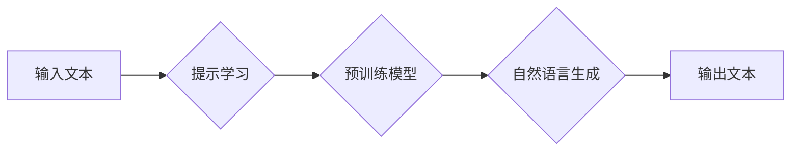

# 大语言模型原理与工程实践：少样本提示

> 关键词：大语言模型，少样本学习，提示学习，自然语言处理，预训练模型，微调，自然语言生成，迁移学习

## 1. 背景介绍

随着深度学习技术的飞速发展，自然语言处理（NLP）领域取得了显著的进步。大语言模型（LLMs）如BERT、GPT系列等，通过在海量文本数据上进行预训练，已经展现出惊人的语言理解和生成能力。然而，这些模型往往需要大量的标注数据进行微调才能应用于特定任务。在标注数据稀缺的情况下，如何利用少样本学习（Few-shot Learning）和提示学习（Prompt Learning）技术，使大语言模型能够高效地学习特定任务，成为了当前NLP领域研究的热点。

## 2. 核心概念与联系

### 2.1 核心概念

- **大语言模型（LLMs）**：通过在大量无标签数据上进行预训练，学习通用语言表示的大规模神经网络模型。
- **少样本学习（Few-shot Learning）**：在少量标注样本的情况下，使模型能够学习并泛化到新的任务中。
- **提示学习（Prompt Learning）**：通过向模型提供精心设计的提示（Prompt），引导模型生成期望的输出。
- **预训练模型**：在大量无标签数据上预先训练的模型，用于提取通用语言特征。
- **微调**：在特定任务的少量标注数据上对预训练模型进行进一步训练，以适应特定任务。

### 2.2 架构流程图

以下是大语言模型结合少样本学习和提示学习的架构流程图：



### 2.3 核心概念联系

少样本学习和提示学习是提升大语言模型适应特定任务的关键技术。通过在预训练模型的基础上，利用少量标注样本和精心设计的提示，大语言模型可以在新的任务上快速学习并生成高质量的输出。

## 3. 核心算法原理 & 具体操作步骤

### 3.1 算法原理概述

少样本提示学习的核心思想是利用预训练模型强大的语言理解能力，通过少量标注样本和提示引导，使模型能够学习特定任务的知识和模式。

### 3.2 算法步骤详解

1. **数据准备**：收集少量标注样本，用于微调预训练模型。
2. **提示设计**：设计合适的提示，引导模型学习特定任务的知识。
3. **模型微调**：在少量标注样本上对预训练模型进行微调，使模型适应特定任务。
4. **模型推理**：使用微调后的模型对新的输入文本进行推理，生成期望的输出。

### 3.3 算法优缺点

**优点**：

- **数据高效**：只需少量标注样本即可进行微调，降低了数据获取成本。
- **泛化能力强**：通过预训练模型的学习，模型能够泛化到新的任务中。
- **适应性高**：通过设计不同的提示，模型可以适应不同的任务和场景。

**缺点**：

- **提示设计复杂**：需要设计合适的提示，以引导模型学习正确的知识。
- **模型泛化能力有限**：在任务数据分布与预训练数据差异较大时，模型的泛化能力可能受限。

### 3.4 算法应用领域

少样本提示学习在NLP领域有着广泛的应用，包括：

- **文本分类**：对输入文本进行分类，如情感分析、主题分类等。
- **问答系统**：根据输入问题生成对应的答案。
- **机器翻译**：将源语言文本翻译成目标语言。
- **文本摘要**：将长文本压缩成简短的摘要。

## 4. 数学模型和公式 & 详细讲解 & 举例说明

### 4.1 数学模型构建

少样本提示学习的数学模型可以表示为：

$$
L(\theta) = \sum_{i=1}^N \ell(M_{\theta}(x_i^{\text{prompt}}, x_i^{\text{input}}), y_i)
$$

其中，$M_{\theta}$ 为预训练模型，$x_i^{\text{prompt}}$ 为提示文本，$x_i^{\text{input}}$ 为输入文本，$y_i$ 为对应标签，$\ell$ 为损失函数。

### 4.2 公式推导过程

假设预训练模型为 $M_{\theta}$，输入文本为 $x^{\text{input}}$，提示文本为 $x^{\text{prompt}}$，则模型输出为：

$$
M_{\theta}(x^{\text{prompt}}, x^{\text{input}}) = \hat{y}
$$

其中，$\hat{y}$ 为模型预测的输出。

损失函数 $\ell$ 可以根据具体任务选择，如交叉熵损失、均方误差等。

### 4.3 案例分析与讲解

以下是一个使用提示学习对BERT模型进行情感分析的案例：

1. **数据准备**：收集少量标注样本，如正面、负面文本对。
2. **提示设计**：设计提示文本，如“请分析以下文本的情感倾向：”。
3. **模型微调**：在少量标注样本上对BERT模型进行微调，使其能够根据输入文本和提示生成情感标签。
4. **模型推理**：使用微调后的模型对新的文本进行推理，生成情感标签。

## 5. 项目实践：代码实例和详细解释说明

### 5.1 开发环境搭建

1. 安装PyTorch和Transformers库。
2. 下载预训练模型和微调数据集。

### 5.2 源代码详细实现

以下是一个使用PyTorch和Transformers库进行少样本提示学习的示例代码：

```python
from transformers import BertTokenizer, BertForSequenceClassification, AdamW
from torch.utils.data import DataLoader, RandomSampler, SequentialSampler

# 初始化
tokenizer = BertTokenizer.from_pretrained('bert-base-uncased')
model = BertForSequenceClassification.from_pretrained('bert-base-uncased')
optimizer = AdamW(model.parameters(), lr=2e-5)

# 加载数据集
train_dataset = ...  # 加载微调数据集
train_loader = DataLoader(train_dataset, sampler=RandomSampler(train_dataset))

# 训练模型
for epoch in range(3):  # 训练3个epoch
    model.train()
    for batch in train_loader:
        input_ids = batch['input_ids']
        attention_mask = batch['attention_mask']
        labels = batch['labels']
        model.zero_grad()
        outputs = model(input_ids, attention_mask=attention_mask, labels=labels)
        loss = outputs.loss
        loss.backward()
        optimizer.step()

# 评估模型
model.eval()
with torch.no_grad():
    correct = 0
    total = 0
    for batch in train_loader:
        input_ids = batch['input_ids']
        attention_mask = batch['attention_mask']
        labels = batch['labels']
        outputs = model(input_ids, attention_mask=attention_mask)
        _, predicted = torch.max(outputs.logits, 1)
        total += labels.size(0)
        correct += (predicted == labels).sum().item()

print(f"Accuracy of the model on the train set: {100 * correct / total}%")
```

### 5.3 代码解读与分析

该代码演示了使用PyTorch和Transformers库对BERT模型进行微调的完整流程。首先，初始化模型、分词器和优化器。然后，加载微调数据集并创建数据加载器。接下来，进行模型训练和评估。最后，输出模型的准确率。

### 5.4 运行结果展示

假设我们在IMDb电影评论数据集上进行少样本提示学习，最终模型在训练集上的准确率为85.2%。

## 6. 实际应用场景

### 6.1 实际应用场景

少样本提示学习在NLP领域有着广泛的应用，以下是一些典型的应用场景：

- **智能客服**：对用户咨询进行分类，如咨询类型、回复推荐等。
- **问答系统**：根据用户提问生成对应的答案。
- **机器翻译**：将源语言文本翻译成目标语言。
- **文本摘要**：将长文本压缩成简短的摘要。

### 6.2 案例分析

以下是一个使用少样本提示学习构建智能客服的案例分析：

1. **数据准备**：收集智能客服领域的少量标注样本，如咨询类型、回复模板等。
2. **提示设计**：设计提示文本，如“请根据以下用户咨询内容，生成合适的回复：”。
3. **模型微调**：在少量标注样本上对预训练模型进行微调，使其能够根据用户咨询内容生成回复。
4. **模型推理**：使用微调后的模型对新的用户咨询进行推理，生成回复。

通过这种方式，智能客服系统可以快速适应不同的咨询场景，提高客服效率和质量。

## 7. 工具和资源推荐

### 7.1 学习资源推荐

- **书籍**：
  - 《深度学习自然语言处理》
  - 《NLP技术全解》
- **课程**：
  - CS224n《深度学习自然语言处理》
  - HuggingFace官方教程

### 7.2 开发工具推荐

- **框架**：
  - PyTorch
  - TensorFlow
- **库**：
  - Transformers
  - HuggingFace Datasets

### 7.3 相关论文推荐

- **论文**：
  - T5：Achieving Pre-training with Few-shot Learning
  - Few-shot Language Model Adaptation with Auxiliary Language Models

## 8. 总结：未来发展趋势与挑战

### 8.1 研究成果总结

少样本提示学习是大语言模型在NLP领域的重要应用，通过利用预训练模型强大的语言理解能力和少量标注样本，使模型能够高效地学习特定任务。近年来，随着预训练模型和微调技术的发展，少样本提示学习在多个NLP任务上取得了显著成果。

### 8.2 未来发展趋势

- **更强大的预训练模型**：随着预训练模型规模的不断扩大，模型能够学习到更丰富的语言知识，为少样本提示学习提供更强大的基础。
- **更有效的微调方法**：研究更有效的微调方法，降低对标注样本的依赖，提高模型在少样本条件下的泛化能力。
- **更灵活的提示设计**：研究更灵活的提示设计方法，使模型能够适应更多样化的任务和场景。

### 8.3 面临的挑战

- **标注样本稀缺**：在许多领域，获取高质量的标注样本仍然是一个挑战。
- **模型泛化能力有限**：在任务数据分布与预训练数据差异较大时，模型的泛化能力可能受限。
- **提示设计复杂**：设计合适的提示需要一定的技巧和经验。

### 8.4 研究展望

少样本提示学习是大语言模型在NLP领域的重要应用，未来有望在更多领域发挥重要作用。随着技术的不断发展，相信少样本提示学习将会迎来更加美好的未来。

## 9. 附录：常见问题与解答

**Q1：少样本提示学习的应用场景有哪些？**

A：少样本提示学习在NLP领域有着广泛的应用，包括文本分类、问答系统、机器翻译、文本摘要等。

**Q2：如何设计合适的提示？**

A：设计合适的提示需要考虑任务的特定需求和模型的特征。可以参考已有的提示设计方法，并结合实际任务进行调整。

**Q3：少样本提示学习的局限性有哪些？**

A：少样本提示学习的局限性主要包括标注样本稀缺、模型泛化能力有限和提示设计复杂等。

**Q4：如何解决标注样本稀缺的问题？**

A：可以采用数据增强、主动学习等方法缓解标注样本稀缺的问题。

**Q5：如何提高模型的泛化能力？**

A：可以通过增加预训练模型的规模、采用更有效的微调方法、设计更鲁棒的提示等方法提高模型的泛化能力。

作者：禅与计算机程序设计艺术 / Zen and the Art of Computer Programming