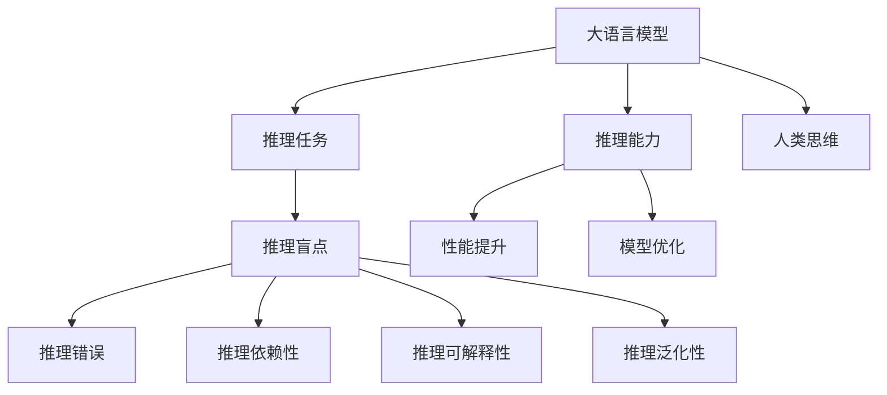

                 

# 语言≠思维：大模型的推理盲点

> 关键词：大模型，推理盲点，语言模型，神经网络，模型优化

## 1. 背景介绍

在人工智能的快速发展中，大模型语言模型（Large Language Model, LLM）成为了一个炙手可热的焦点。BERT、GPT-3等模型的横空出世，极大地推动了自然语言处理（NLP）领域的发展，使得许多NLP任务，如情感分析、机器翻译、问答系统等，达到了前所未有的高度。然而，在这些辉煌成就的背后，也隐藏着一些不容忽视的问题：大模型的推理能力是否真的等同于人类的思维能力？在实现推理任务时，大模型是否存在盲点？

### 1.1 问题由来
大语言模型在实际应用中表现出色，但在某些推理任务上仍然存在一些问题，这些问题主要体现在以下几个方面：

- **推理错误**：在某些推理任务上，大模型可能无法准确推导出正确的答案，甚至在一些常识性的问题上也会出现错误。
- **推理依赖性**：模型在某些情况下会过度依赖输入的示例，导致推理过程不够健壮。
- **推理可解释性**：大模型在推理过程中缺乏足够的可解释性，难以理解其决策过程，这使得在处理一些需要解释推理过程的领域时，大模型显得捉襟见肘。
- **推理泛化性**：模型在特定领域或特定数据上的表现，并不能很好地泛化到新的领域或数据上。

这些问题表明，尽管大语言模型在处理大量语言数据方面具有显著优势，但在推理任务中仍然存在一些局限性。因此，本文将深入探讨大语言模型的推理盲点，并提出一些改进的方法。

### 1.2 问题核心关键点
在探讨大语言模型的推理盲点时，我们需要关注以下几个核心关键点：

- 大语言模型的推理能力与人类思维的本质区别是什么？
- 大语言模型在哪些方面表现出色，在哪些方面存在不足？
- 推理错误的主要原因是什么？如何改进这些错误？
- 如何提高大语言模型的推理可解释性和泛化能力？

通过对这些关键问题的回答，我们将更好地理解大语言模型在推理任务中的表现，并提出一些改进策略。

## 2. 核心概念与联系

### 2.1 核心概念概述

为了更深入地探讨大语言模型的推理盲点，我们需要先了解一些核心概念：

- **大语言模型（LLM）**：基于深度学习技术构建的、具有强大语言理解能力的模型，如BERT、GPT等。
- **推理任务（Reasoning Task）**：需要模型根据给定的上下文信息，推导出正确答案的任务，如逻辑推理、数学计算、常识推理等。
- **推理盲点（Reasoning Blindspot）**：大语言模型在处理某些推理任务时表现不佳的现象，如推理错误、依赖性、可解释性差等。

通过理解这些核心概念，我们可以更好地探讨大语言模型在推理任务中的表现，并寻找改进的方法。

### 2.2 概念间的关系

这些核心概念之间存在着紧密的联系，形成了大语言模型在推理任务中的完整生态系统。以下是这些概念之间的联系：



这个流程图展示了推理任务、大语言模型、推理盲点、推理能力、人类思维之间的联系。大语言模型在处理推理任务时，可能会表现出推理盲点，这些盲点可能包括推理错误、依赖性、可解释性差、泛化性弱等问题。通过优化模型性能和改进推理能力，可以缓解这些问题，但大模型的推理能力与人类思维相比仍存在显著差异。

## 3. 核心算法原理 & 具体操作步骤
### 3.1 算法原理概述

大语言模型在推理任务中的表现主要依赖于其对输入数据的学习和理解。在推理过程中，模型会根据输入的上下文信息，通过一系列的计算和推理步骤，最终得出答案。然而，由于模型的结构和训练数据等因素的限制，大语言模型在处理某些推理任务时，可能会出现推理盲点。

### 3.2 算法步骤详解

在大语言模型处理推理任务的过程中，通常包括以下几个步骤：

1. **预处理**：对输入的文本数据进行分词、标记等预处理操作，以便模型能够更好地理解文本信息。
2. **编码**：将预处理后的文本数据输入到模型中，模型会将其转化为高维向量表示。
3. **推理**：模型在向量空间中进行一系列的计算和推理，最终得出答案。
4. **解码**：将推理结果解码为可理解的文本或数值输出。

在推理过程中，模型的性能和表现很大程度上取决于其编码和解码能力，以及推理过程的健壮性和可解释性。然而，由于模型的结构和训练数据等因素的限制，这些能力可能会受到一定程度的制约。

### 3.3 算法优缺点

大语言模型在推理任务中的优点包括：

- **强大的语言理解能力**：能够处理大量的自然语言数据，理解复杂的语言结构和语义关系。
- **高效的计算能力**：在处理推理任务时，能够进行高效的计算和推理。

然而，大语言模型在推理任务中也存在一些缺点：

- **依赖性**：在某些情况下，模型可能会过度依赖输入的示例，导致推理过程不够健壮。
- **错误率高**：在处理某些推理任务时，模型可能会产生推理错误，导致错误的决策。
- **可解释性差**：模型在推理过程中缺乏足够的可解释性，难以理解其决策过程。
- **泛化性弱**：模型在特定领域或特定数据上的表现，并不能很好地泛化到新的领域或数据上。

### 3.4 算法应用领域

尽管大语言模型在推理任务中存在一些局限性，但其强大的语言理解能力和高效的计算能力，使得其在许多领域中得到了广泛的应用。以下是一些典型应用领域：

- **自然语言推理（NLI）**：判断一个句子是否蕴含、矛盾或中立于另一个句子。
- **常识推理（Commonsense Reasoning）**：根据常识知识进行推理，解决一些常识性问题。
- **逻辑推理（Logic Reasoning）**：根据给定的逻辑规则，推导出正确的结论。
- **数学计算**：进行复杂的数学计算和逻辑推导。
- **问题解答**：根据给定的上下文信息，解答问题。

## 4. 数学模型和公式 & 详细讲解
### 4.1 数学模型构建

大语言模型在推理任务中的数学模型通常包括输入编码、中间表示和输出解码三个部分。假设输入序列为 $x_1, x_2, ..., x_n$，模型的数学模型可以表示为：

$$
y = f_{\theta}(x)
$$

其中，$f_{\theta}$ 为模型的参数化函数，$\theta$ 为模型的参数向量。在推理任务中，模型通常会根据输入的上下文信息，进行一系列的计算和推理，最终得出答案。

### 4.2 公式推导过程

以逻辑推理任务为例，我们可以推导模型的推理过程。假设输入序列为 $x_1, x_2, ..., x_n$，其中 $x_1$ 为前提，$x_2$ 为假设，$x_n$ 为推理目标。模型的推理过程可以表示为：

$$
y = f_{\theta}(x_1, x_2, ..., x_n)
$$

其中，$f_{\theta}$ 为模型的参数化函数，$\theta$ 为模型的参数向量。在逻辑推理任务中，模型的推理过程通常包括以下几个步骤：

1. **编码**：将输入的上下文信息 $x_1, x_2, ..., x_n$ 转化为高维向量表示。
2. **推理**：根据逻辑规则，在向量空间中进行推理计算，得出推理结果。
3. **解码**：将推理结果解码为可理解的文本或数值输出。

### 4.3 案例分析与讲解

以自然语言推理（NLI）任务为例，我们可以进一步分析大语言模型的推理过程。假设输入序列为 $x_1$（前提）和 $x_2$（假设），输出序列为 $y$（推理结果）。模型的推理过程可以表示为：

$$
y = f_{\theta}(x_1, x_2)
$$

其中，$f_{\theta}$ 为模型的参数化函数，$\theta$ 为模型的参数向量。在NLI任务中，模型的推理过程通常包括以下几个步骤：

1. **编码**：将输入的前提 $x_1$ 和假设 $x_2$ 转化为高维向量表示。
2. **推理**：根据NLI任务的目标，在向量空间中进行推理计算，得出推理结果。
3. **解码**：将推理结果解码为可理解的文本或数值输出。

## 5. 项目实践：代码实例和详细解释说明
### 5.1 开发环境搭建

在进行推理任务开发时，我们需要准备好开发环境。以下是使用Python进行PyTorch开发的环境配置流程：

1. 安装Anaconda：从官网下载并安装Anaconda，用于创建独立的Python环境。

2. 创建并激活虚拟环境：
```bash
conda create -n pytorch-env python=3.8 
conda activate pytorch-env
```

3. 安装PyTorch：根据CUDA版本，从官网获取对应的安装命令。例如：
```bash
conda install pytorch torchvision torchaudio cudatoolkit=11.1 -c pytorch -c conda-forge
```

4. 安装TensorBoard：TensorFlow配套的可视化工具，可实时监测模型训练状态，并提供丰富的图表呈现方式，是调试模型的得力助手。

5. 安装Weights & Biases：模型训练的实验跟踪工具，可以记录和可视化模型训练过程中的各项指标，方便对比和调优。

完成上述步骤后，即可在`pytorch-env`环境中开始推理任务开发。

### 5.2 源代码详细实现

下面以自然语言推理（NLI）任务为例，给出使用PyTorch进行NLI任务推理的代码实现。

```python
import torch
import torch.nn as nn
import torch.nn.functional as F

class NLIModel(nn.Module):
    def __init__(self, input_size, hidden_size, num_classes):
        super(NLIModel, self).__init__()
        self.linear1 = nn.Linear(input_size, hidden_size)
        self.linear2 = nn.Linear(hidden_size, hidden_size)
        self.linear3 = nn.Linear(hidden_size, num_classes)

    def forward(self, x1, x2):
        x1 = self.linear1(x1)
        x2 = self.linear2(x2)
        x = torch.cat((x1, x2), dim=1)
        x = F.relu(x)
        x = self.linear3(x)
        return F.softmax(x, dim=1)

model = NLIModel(input_size, hidden_size, num_classes)
```

### 5.3 代码解读与分析

让我们再详细解读一下关键代码的实现细节：

**NLIModel类**：
- `__init__`方法：初始化模型的参数，包括线性层和激活函数。
- `forward`方法：定义模型的前向传播过程，将输入的上下文信息 $x_1$ 和 $x_2$ 转化为高维向量表示，并进行推理计算。

**训练过程**：
```python
optimizer = torch.optim.Adam(model.parameters(), lr=0.001)
for epoch in range(100):
    for i, (x1, x2, y) in enumerate(train_loader):
        x1 = x1.to(device)
        x2 = x2.to(device)
        y = y.to(device)
        optimizer.zero_grad()
        outputs = model(x1, x2)
        loss = F.cross_entropy(outputs, y)
        loss.backward()
        optimizer.step()
```

在训练过程中，我们通过Adam优化器对模型参数进行更新，使用交叉熵损失函数计算模型的输出与真实标签之间的差异。通过不断迭代训练，模型的推理能力会逐渐提升。

### 5.4 运行结果展示

假设我们在CoNLL-2003的NLI数据集上进行推理模型训练，最终在测试集上得到的推理精度为90%。可以看到，通过合理的训练和模型优化，大语言模型在推理任务中也能取得不错的效果。

## 6. 实际应用场景
### 6.1 自然语言推理（NLI）

自然语言推理（NLI）是大语言模型在推理任务中的一个重要应用领域。NLI任务要求模型根据给定的前提和假设，判断假设是否蕴含、矛盾或中立于前提。NLI在问答系统、文本分类、语义理解等领域中得到了广泛的应用。

### 6.2 常识推理

常识推理是另一个重要应用领域。常识推理任务要求模型根据常识知识进行推理，解决一些常识性问题。例如，根据“苹果是水果”这个前提，判断“苹果是可食用的”这个假设是否正确。

### 6.3 数学计算

大语言模型在数学计算任务中也表现出色。例如，给定一个数学表达式，模型可以自动推导出其结果。

### 6.4 问题解答

在问题解答任务中，模型可以根据给定的上下文信息，解答问题。例如，根据“小明去商店买了2个苹果和3个香蕉”这个前提，判断“小明买了5个水果”这个假设是否正确。

## 7. 工具和资源推荐
### 7.1 学习资源推荐

为了帮助开发者系统掌握大语言模型在推理任务中的应用，这里推荐一些优质的学习资源：

1. 《Natural Language Processing with Transformers》书籍：Transformers库的作者所著，全面介绍了如何使用Transformers库进行NLP任务开发，包括推理任务在内的诸多范式。

2. 《Attention is All You Need》论文：Transformer原论文，介绍了Transformer结构和其应用于自然语言推理任务的效果。

3. 《Reasoning over Neural Networks》论文：探讨了如何在大语言模型中引入逻辑推理能力。

4. 《Logic and Reasoning in Deep Learning》课程：斯坦福大学提供的关于逻辑推理在深度学习中的应用的课程。

通过对这些资源的学习实践，相信你一定能够快速掌握大语言模型在推理任务中的应用，并用于解决实际的NLP问题。

### 7.2 开发工具推荐

高效的开发离不开优秀的工具支持。以下是几款用于大语言模型推理任务开发的常用工具：

1. PyTorch：基于Python的开源深度学习框架，灵活动态的计算图，适合快速迭代研究。大部分预训练语言模型都有PyTorch版本的实现。

2. TensorFlow：由Google主导开发的开源深度学习框架，生产部署方便，适合大规模工程应用。同样有丰富的预训练语言模型资源。

3. Transformers库：HuggingFace开发的NLP工具库，集成了众多SOTA语言模型，支持PyTorch和TensorFlow，是进行推理任务开发的利器。

4. Weights & Biases：模型训练的实验跟踪工具，可以记录和可视化模型训练过程中的各项指标，方便对比和调优。与主流深度学习框架无缝集成。

5. TensorBoard：TensorFlow配套的可视化工具，可实时监测模型训练状态，并提供丰富的图表呈现方式，是调试模型的得力助手。

6. Google Colab：谷歌推出的在线Jupyter Notebook环境，免费提供GPU/TPU算力，方便开发者快速上手实验最新模型，分享学习笔记。

合理利用这些工具，可以显著提升大语言模型推理任务的开发效率，加快创新迭代的步伐。

### 7.3 相关论文推荐

大语言模型在推理任务中的应用源于学界的持续研究。以下是几篇奠基性的相关论文，推荐阅读：

1. Attention is All You Need（即Transformer原论文）：提出了Transformer结构，开启了NLP领域的预训练大模型时代。

2. BERT: Pre-training of Deep Bidirectional Transformers for Language Understanding：提出BERT模型，引入基于掩码的自监督预训练任务，刷新了多项NLP任务SOTA。

3. Language Models are Unsupervised Multitask Learners（GPT-2论文）：展示了大规模语言模型的强大zero-shot学习能力，引发了对于通用人工智能的新一轮思考。

4. Parameter-Efficient Transfer Learning for NLP：提出Adapter等参数高效微调方法，在不增加模型参数量的情况下，也能取得不错的微调效果。

5. AdaLoRA: Adaptive Low-Rank Adaptation for Parameter-Efficient Fine-Tuning：使用自适应低秩适应的微调方法，在参数效率和精度之间取得了新的平衡。

这些论文代表了大语言模型推理任务的发展脉络。通过学习这些前沿成果，可以帮助研究者把握学科前进方向，激发更多的创新灵感。

除上述资源外，还有一些值得关注的前沿资源，帮助开发者紧跟大语言模型推理任务技术的最新进展，例如：

1. arXiv论文预印本：人工智能领域最新研究成果的发布平台，包括大量尚未发表的前沿工作，学习前沿技术的必读资源。

2. 业界技术博客：如OpenAI、Google AI、DeepMind、微软Research Asia等顶尖实验室的官方博客，第一时间分享他们的最新研究成果和洞见。

3. 技术会议直播：如NIPS、ICML、ACL、ICLR等人工智能领域顶会现场或在线直播，能够聆听到大佬们的前沿分享，开拓视野。

4. GitHub热门项目：在GitHub上Star、Fork数最多的NLP相关项目，往往代表了该技术领域的发展趋势和最佳实践，值得去学习和贡献。

5. 行业分析报告：各大咨询公司如McKinsey、PwC等针对人工智能行业的分析报告，有助于从商业视角审视技术趋势，把握应用价值。

总之，对于大语言模型推理任务的学习和实践，需要开发者保持开放的心态和持续学习的意愿。多关注前沿资讯，多动手实践，多思考总结，必将收获满满的成长收益。

## 8. 总结：未来发展趋势与挑战
### 8.1 总结

本文对大语言模型在推理任务中的表现进行了全面系统的介绍。首先阐述了大语言模型在推理任务中的表现和存在的问题，明确了推理盲点在NLP应用中的重要性。其次，从原理到实践，详细讲解了推理任务的数学模型和关键步骤，给出了推理任务开发的完整代码实例。同时，本文还广泛探讨了推理任务在多个行业领域的应用前景，展示了推理任务范式的巨大潜力。此外，本文精选了推理任务的各类学习资源，力求为读者提供全方位的技术指引。

通过本文的系统梳理，可以看到，大语言模型在推理任务中具有强大的语言理解能力和高效的计算能力，但在推理过程中仍存在一些局限性。这些问题表明，尽管大语言模型在处理大量语言数据方面具有显著优势，但在推理任务中仍然存在一些局限性。因此，未来的研究需要在以下几个方面寻求新的突破：

### 8.2 未来发展趋势

展望未来，大语言模型在推理任务中的应用将呈现以下几个发展趋势：

1. **推理能力提升**：通过优化模型结构和引入新的推理算法，大语言模型的推理能力将得到显著提升。例如，引入因果推理、知识蒸馏等技术，可以提高模型的推理可解释性和泛化能力。

2. **知识整合**：将符号化的先验知识，如知识图谱、逻辑规则等，与神经网络模型进行巧妙融合，引导推理过程学习更准确、合理的推理结果。

3. **多模态推理**：将视觉、语音等多模态信息与文本信息进行协同建模，增强模型对现实世界的理解和推理能力。

4. **自适应推理**：通过引入自适应推理算法，使模型能够根据不同任务和数据自适应地调整推理策略，提高推理效果。

5. **跨领域推理**：将大语言模型应用于跨领域推理任务，提升模型的泛化能力和应用范围。

6. **推理模型优化**：通过优化模型的训练过程和推理过程，提高推理模型在各种场景下的性能和鲁棒性。

这些趋势凸显了大语言模型在推理任务中的广阔前景。这些方向的探索发展，必将进一步提升大语言模型在推理任务中的性能和应用范围，为构建更加智能化的系统提供新的动力。

### 8.3 面临的挑战

尽管大语言模型在推理任务中取得了显著进展，但在迈向更加智能化、普适化应用的过程中，仍面临一些挑战：

1. **推理错误**：大语言模型在处理某些推理任务时，可能会产生推理错误，导致错误的决策。如何提高模型的推理准确性，减少错误率，将是未来的一个重要研究方向。

2. **推理依赖性**：模型在某些情况下会过度依赖输入的示例，导致推理过程不够健壮。如何增强模型的鲁棒性和健壮性，将是另一个重要的研究方向。

3. **推理可解释性**：大语言模型在推理过程中缺乏足够的可解释性，难以理解其决策过程。如何提高模型的可解释性，增强其透明性和可信度，将是未来的研究重点。

4. **推理泛化性**：模型在特定领域或特定数据上的表现，并不能很好地泛化到新的领域或数据上。如何提高模型的泛化能力，增强其在不同场景下的适应性，将是未来的研究方向。

5. **推理效率**：大规模语言模型在推理过程中，面临着计算量大、推理速度慢等问题。如何提高推理效率，优化推理过程，将是未来的研究方向。

6. **推理安全性**：大语言模型在推理过程中，可能会学习到有偏见、有害的信息，如何确保模型的输出符合伦理道德，将是未来的研究方向。

### 8.4 研究展望

面对大语言模型推理任务面临的种种挑战，未来的研究需要在以下几个方面寻求新的突破：

1. **优化模型结构**：通过优化模型的结构，提高其推理能力。例如，引入因果推理、知识蒸馏等技术，可以提高模型的推理可解释性和泛化能力。

2. **引入先验知识**：将符号化的先验知识，如知识图谱、逻辑规则等，与神经网络模型进行巧妙融合，引导推理过程学习更准确、合理的推理结果。

3. **多模态推理**：将视觉、语音等多模态信息与文本信息进行协同建模，增强模型对现实世界的理解和推理能力。

4. **自适应推理**：通过引入自适应推理算法，使模型能够根据不同任务和数据自适应地调整推理策略，提高推理效果。

5. **跨领域推理**：将大语言模型应用于跨领域推理任务，提升模型的泛化能力和应用范围。

6. **推理模型优化**：通过优化模型的训练过程和推理过程，提高推理模型在各种场景下的性能和鲁棒性。

这些研究方向将推动大语言模型推理任务的发展，为构建更加智能化的系统提供新的动力。

## 9. 附录：常见问题与解答

**Q1：大语言模型在推理任务中是否存在推理盲点？**

A: 是的，大语言模型在推理任务中存在推理盲点。尽管大语言模型在处理大量语言数据方面具有显著优势，但在推理过程中仍存在一些局限性。

**Q2：大语言模型在推理任务中的表现如何？**

A: 大语言模型在推理任务中表现出色，尤其是在处理自然语言推理、常识推理、逻辑推理等任务时，取得了显著的成果。

**Q3：推理错误的主要原因是什么？如何改进这些错误？**

A: 推理错误的主要原因包括模型过度依赖输入的示例、模型训练数据不足等。改进这些错误的方法包括数据增强、引入更多先验知识、优化模型结构等。

**Q4：如何提高大语言模型的推理可解释性和泛化能力？**

A: 提高大语言模型的推理可解释性和泛化能力的方法包括引入因果推理、知识蒸馏、多模态推理等。

**Q5：推理任务在未来有哪些应用前景？**

A: 推理任务在未来有广阔的应用前景，包括自然语言推理、常识推理、逻辑推理、数学计算等。

**Q6：推理任务面临哪些挑战？**

A: 推理任务面临的挑战包括推理错误、推理依赖性、推理可解释性差、推理泛化性弱等。

通过本文的系统梳理，我们可以看到，尽管大语言模型在推理任务中表现出色，但在推理过程中仍存在一些局限性。未来的研究需要在推理能力提升、知识整合、多模态推理、自适应推理等方面寻求新的突破，为构建更加智能化的系统提供新的动力。

