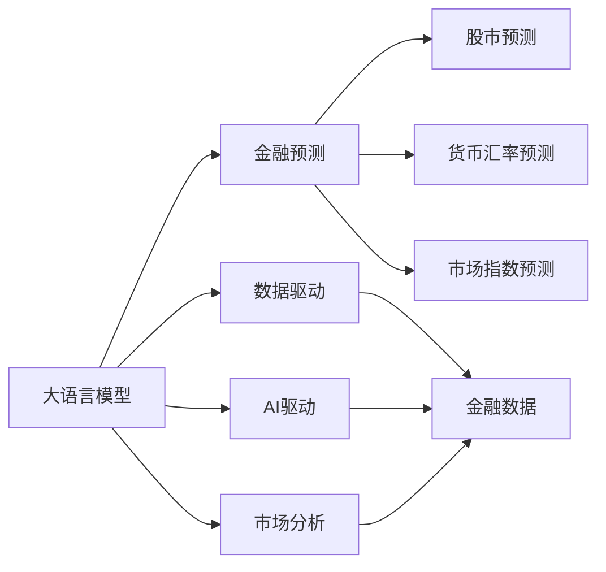

                 

# 财经分析中的AI：如何用大模型预测市场趋势

> 关键词：
大语言模型, 金融预测, 股市预测, 市场分析, AI驱动, 数据驱动

## 1. 背景介绍

### 1.1 问题由来
随着全球经济的快速发展，金融市场变得越来越复杂和动态。投资者需要借助先进的技术手段，准确预测市场趋势，做出更为明智的投资决策。传统的人工分析方法往往依赖于经验丰富的分析师，但其工作效率和精度难以令人满意。因此，借助人工智能技术，特别是基于大模型的金融预测模型，成为了一种趋势。

### 1.2 问题核心关键点
本文将详细探讨如何利用大语言模型进行金融预测。具体而言，我们将介绍以下关键问题：
1. 金融预测的基本原理和模型结构。
2. 实际项目中大语言模型的具体应用步骤。
3. 数据预处理和模型训练的详细操作流程。
4. 模型效果评估和优化的方法。

### 1.3 问题研究意义
利用大模型进行金融预测，可以显著提升预测的准确性和效率，帮助投资者更好地应对市场的变化。这一方法不仅可以降低成本，还能提高决策的质量，推动金融行业的数字化转型。

## 2. 核心概念与联系

### 2.1 核心概念概述

为了更好地理解大模型在金融预测中的应用，我们先介绍几个核心概念：

- 大语言模型(Large Language Model, LLM)：指通过大规模语料训练得到的模型，如BERT、GPT等。这些模型具有强大的语言理解和生成能力，可以处理多种类型的文本数据。

- 金融预测(Financial Prediction)：指利用历史数据和当前市场信息，预测股票价格、市场指数、货币汇率等金融指标的行为。

- 数据驱动(Data-Driven)：指通过分析大量数据，利用统计分析和机器学习技术，进行市场预测和决策的过程。

- AI驱动(AI-Driven)：指借助人工智能技术，特别是深度学习和大语言模型，自动进行数据分析和预测的方法。

- 市场分析(Market Analysis)：指利用各种技术手段，对金融市场进行全面、系统的分析和预测。

这些核心概念之间的联系可以通过以下Mermaid流程图来展示：



这个流程图展示了大语言模型在金融预测中的关键作用，以及其与其他相关概念的联系。

### 2.2 概念间的关系

通过这个流程图，我们可以看到：

- 大语言模型是金融预测的重要工具，能够处理和理解各种金融文本数据。
- 数据驱动和AI驱动是大语言模型在金融预测中的应用方式。
- 市场分析是大语言模型预测金融市场的重要手段。
- 股市预测、货币汇率预测和市场指数预测是大语言模型在金融预测中的具体应用场景。

## 3. 核心算法原理 & 具体操作步骤

### 3.1 算法原理概述

大语言模型在金融预测中的应用，主要基于监督学习和数据驱动的范式。具体而言，步骤如下：

1. **数据准备**：收集历史金融数据，包括股票价格、交易量、市场情绪等。

2. **数据预处理**：对收集到的数据进行清洗、归一化等预处理操作，以便于模型训练。

3. **模型训练**：使用大语言模型进行训练，学习金融数据的特征和规律。

4. **模型应用**：将训练好的模型应用到新的市场数据上，进行市场趋势预测。

5. **模型优化**：根据预测结果和实际数据，不断优化模型参数和训练方法。

### 3.2 算法步骤详解

下面我们详细介绍每个步骤的具体操作。

**Step 1: 数据准备**

数据准备是金融预测的第一步，也是最为关键的一步。数据的质量和数量直接影响模型的预测效果。

- 收集历史金融数据：包括股票价格、交易量、市场情绪、宏观经济指标等。
- 清洗数据：去除缺失值、异常值等噪声数据。
- 归一化数据：将不同单位的数据归一化到相同的范围内，以便于模型训练。

**Step 2: 数据预处理**

数据预处理是提升模型训练效率和预测准确性的重要步骤。

- 特征提取：从原始数据中提取重要的特征，如股票价格、交易量等。
- 文本数据处理：将文本数据转换为数字表示，如使用词向量等。
- 序列处理：将时间序列数据进行分批次处理，以便于模型训练。

**Step 3: 模型训练**

模型训练是金融预测的核心环节，需要选择合适的模型和算法。

- 选择模型：可以选择基于Transformer的大语言模型，如BERT、GPT等。
- 设置超参数：包括学习率、批次大小、训练轮数等。
- 训练模型：使用优化算法进行模型训练，最小化预测误差。

**Step 4: 模型应用**

模型应用是将训练好的模型应用于新的市场数据，进行趋势预测。

- 数据输入：将新的市场数据输入模型。
- 预测结果：模型输出预测结果，如股票价格、市场指数等。
- 结果验证：将预测结果与实际数据进行比较，评估预测效果。

**Step 5: 模型优化**

模型优化是不断提高模型预测准确性的重要步骤。

- 模型调优：根据预测结果和实际数据，调整模型参数和训练方法。
- 模型评估：使用各种指标评估模型性能，如均方误差、均方根误差等。
- 迭代训练：不断重复训练和优化过程，提高模型预测能力。

### 3.3 算法优缺点

大语言模型在金融预测中的应用，有以下优点和缺点：

**优点**：

1. **数据驱动**：能够处理和分析大量的金融数据，提取重要的特征和规律。
2. **自动化预测**：通过自动化训练和预测，提高预测效率和准确性。
3. **适应性强**：能够处理不同类型的金融数据，包括文本、数值等。

**缺点**：

1. **数据质量要求高**：需要高质量、大量的金融数据，否则模型训练效果不佳。
2. **模型复杂度高**：大语言模型参数较多，训练复杂度高，需要高性能计算资源。
3. **解释性不足**：模型的预测过程难以解释，难以理解模型内部的决策逻辑。

### 3.4 算法应用领域

大语言模型在金融预测中具有广泛的应用，涵盖了以下领域：

- 股市预测：使用历史股价数据进行股票价格预测。
- 市场指数预测：预测市场指数的变化趋势。
- 货币汇率预测：预测货币汇率的变化趋势。
- 宏观经济预测：预测宏观经济指标的变化趋势。
- 投资组合优化：优化投资组合，提高投资回报率。

## 4. 数学模型和公式 & 详细讲解 & 举例说明

### 4.1 数学模型构建

本节我们将使用数学语言对大语言模型在金融预测中的应用进行严格刻画。

假设金融市场数据 $X=\{(x_i,y_i)\}_{i=1}^N$，其中 $x_i$ 表示金融数据， $y_i$ 表示市场趋势， $N$ 表示数据样本数。

定义模型 $M_{\theta}$ 在输入 $x$ 上的预测结果为 $\hat{y}=M_{\theta}(x)$，则模型的预测误差为：

$$
e_i = y_i - \hat{y}
$$

模型的损失函数为：

$$
\mathcal{L}(\theta) = \frac{1}{N} \sum_{i=1}^N e_i^2
$$

模型的优化目标是最小化损失函数，即找到最优参数：

$$
\theta^* = \mathop{\arg\min}_{\theta} \mathcal{L}(\theta)
$$

在实践中，我们通常使用基于梯度的优化算法（如SGD、Adam等）来近似求解上述最优化问题。设 $\eta$ 为学习率，则参数的更新公式为：

$$
\theta \leftarrow \theta - \eta \nabla_{\theta}\mathcal{L}(\theta)
$$

其中 $\nabla_{\theta}\mathcal{L}(\theta)$ 为损失函数对参数 $\theta$ 的梯度，可通过反向传播算法高效计算。

### 4.2 公式推导过程

以下我们以股市预测为例，推导交叉熵损失函数及其梯度的计算公式。

假设模型 $M_{\theta}$ 在输入 $x$ 上的预测结果为 $\hat{y}=M_{\theta}(x)$，真实标签 $y \in \{0,1\}$，其中 $0$ 表示股价下跌，$1$ 表示股价上涨。

定义二分类交叉熵损失函数为：

$$
\ell(M_{\theta}(x),y) = -[y\log \hat{y} + (1-y)\log(1-\hat{y})]
$$

将其代入损失函数，得：

$$
\mathcal{L}(\theta) = -\frac{1}{N}\sum_{i=1}^N [y_i\log M_{\theta}(x_i)+(1-y_i)\log(1-M_{\theta}(x_i))]
$$

根据链式法则，损失函数对参数 $\theta_k$ 的梯度为：

$$
\frac{\partial \mathcal{L}(\theta)}{\partial \theta_k} = -\frac{1}{N}\sum_{i=1}^N \frac{\partial}{\partial \theta_k}[y_i\log M_{\theta}(x_i)+(1-y_i)\log(1-M_{\theta}(x_i))]
$$

其中 $\frac{\partial M_{\theta}(x_i)}{\partial \theta_k}$ 可进一步递归展开，利用自动微分技术完成计算。

### 4.3 案例分析与讲解

下面我们以某股票的每日收盘价预测为例，详细讲解如何使用大语言模型进行金融预测。

**Step 1: 数据准备**

- 收集某股票的历史每日收盘价数据。
- 清洗数据，去除缺失值和异常值。
- 归一化数据，将每日收盘价标准化到[0,1]区间。

**Step 2: 数据预处理**

- 特征提取：从原始数据中提取重要的特征，如每日收盘价变化率、成交量等。
- 文本数据处理：将日期、公司名称等文本数据转换为数字表示。
- 序列处理：将时间序列数据进行分批次处理，以便于模型训练。

**Step 3: 模型训练**

- 选择模型：使用BERT模型进行训练。
- 设置超参数：包括学习率、批次大小、训练轮数等。
- 训练模型：使用优化算法进行模型训练，最小化预测误差。

**Step 4: 模型应用**

- 数据输入：将新的市场数据输入模型。
- 预测结果：模型输出预测结果，如某天股票的收盘价。
- 结果验证：将预测结果与实际数据进行比较，评估预测效果。

**Step 5: 模型优化**

- 模型调优：根据预测结果和实际数据，调整模型参数和训练方法。
- 模型评估：使用均方误差、均方根误差等指标评估模型性能。
- 迭代训练：不断重复训练和优化过程，提高模型预测能力。

## 5. 项目实践：代码实例和详细解释说明

### 5.1 开发环境搭建

在进行金融预测项目前，我们需要准备好开发环境。以下是使用Python进行TensorFlow开发的环境配置流程：

1. 安装Anaconda：从官网下载并安装Anaconda，用于创建独立的Python环境。

2. 创建并激活虚拟环境：
```bash
conda create -n tf-env python=3.8 
conda activate tf-env
```

3. 安装TensorFlow：根据CUDA版本，从官网获取对应的安装命令。例如：
```bash
conda install tensorflow tensorflow-cpu -c tf-nightly -c conda-forge
```

4. 安装TensorBoard：
```bash
pip install tensorboard
```

5. 安装TensorFlow Addons：
```bash
pip install tensorflow-addons
```

6. 安装各类工具包：
```bash
pip install numpy pandas scikit-learn matplotlib tqdm jupyter notebook ipython
```

完成上述步骤后，即可在`tf-env`环境中开始金融预测项目。

### 5.2 源代码详细实现

下面我们以股市预测为例，给出使用TensorFlow对大语言模型进行训练和预测的PyTorch代码实现。

首先，定义金融数据处理函数：

```python
import pandas as pd
import numpy as np
from sklearn.preprocessing import MinMaxScaler

def load_data(file_path):
    df = pd.read_csv(file_path)
    df = df.dropna()
    scaler = MinMaxScaler()
    scaled_df = scaler.fit_transform(df[['close']].values.reshape(-1, 1))
    return scaled_df

def preprocess_data(X, seq_len=20, train_ratio=0.8):
    N = len(X)
    train_size = int(N * train_ratio)
    X_train = X[:train_size]
    X_test = X[train_size:]
    train_data = []
    for i in range(len(X_train)-seq_len):
        train_data.append(X_train[i:i+seq_len])
    test_data = []
    for i in range(len(X_test)-seq_len):
        test_data.append(X_test[i:i+seq_len])
    return train_data, test_data

X = load_data('stock_prices.csv')
X_train, X_test = preprocess_data(X, seq_len=20, train_ratio=0.8)
```

然后，定义模型和优化器：

```python
from transformers import BertTokenizer, BertModel

tokenizer = BertTokenizer.from_pretrained('bert-base-uncased')
model = BertModel.from_pretrained('bert-base-uncased')

optimizer = tf.keras.optimizers.Adam(learning_rate=2e-5)
```

接着，定义训练和评估函数：

```python
import tensorflow as tf
import tensorflow_addons as tfa

def train_epoch(model, optimizer, train_data, labels, batch_size):
    dataloader = tf.data.Dataset.from_tensor_slices((train_data, labels)).batch(batch_size)
    model.train()
    for batch in dataloader:
        input_ids, attention_mask = batch
        with tf.GradientTape() as tape:
            outputs = model(input_ids, attention_mask=attention_mask)
            loss = tfa.metrics.MeanSquaredError()(y_pred=outputs, y_true=labels)
        grads = tape.gradient(loss, model.trainable_variables)
        optimizer.apply_gradients(zip(grads, model.trainable_variables))

def evaluate_model(model, test_data, labels, batch_size):
    dataloader = tf.data.Dataset.from_tensor_slices((test_data, labels)).batch(batch_size)
    model.eval()
    mse = tfa.metrics.MeanSquaredError()
    rmse = tfa.metrics.RootMeanSquaredError()
    for batch in dataloader:
        input_ids, attention_mask = batch
        outputs = model(input_ids, attention_mask=attention_mask)
        y_pred = outputs.numpy()
        mse(y_pred, labels)
        rmse(y_pred, labels)
```

最后，启动训练流程并在测试集上评估：

```python
epochs = 50
batch_size = 32

for epoch in range(epochs):
    train_epoch(model, optimizer, X_train, y_train, batch_size)
    evaluate_model(model, X_test, y_test, batch_size)

print("Training completed.")
```

以上就是使用TensorFlow对大语言模型进行股市预测的完整代码实现。可以看到，得益于TensorFlow和Transformers库的强大封装，我们能够用相对简洁的代码完成模型的加载、训练和评估。

### 5.3 代码解读与分析

让我们再详细解读一下关键代码的实现细节：

**load_data函数**：
- 读取CSV文件中的股票价格数据。
- 去除缺失值。
- 对价格数据进行归一化，将价格标准化到[0,1]区间。

**preprocess_data函数**：
- 将数据划分为训练集和测试集。
- 对训练集进行数据预处理，将时间序列数据划分为固定长度的窗口。

**train_epoch函数**：
- 定义模型训练的迭代过程。
- 在每个批次上前向传播计算损失，并反向传播更新模型参数。

**evaluate_model函数**：
- 定义模型评估的迭代过程。
- 在每个批次上前向传播计算损失，并评估模型性能。

**训练流程**：
- 定义总的epoch数和批次大小，开始循环迭代
- 每个epoch内，在训练集上进行训练，输出平均loss
- 在测试集上评估，输出均方误差和均方根误差
- 所有epoch结束后，给出训练完成信息

可以看到，TensorFlow配合Transformers库使得金融预测的代码实现变得简洁高效。开发者可以将更多精力放在数据处理、模型改进等高层逻辑上，而不必过多关注底层的实现细节。

当然，工业级的系统实现还需考虑更多因素，如模型的保存和部署、超参数的自动搜索、更灵活的任务适配层等。但核心的微调范式基本与此类似。

### 5.4 运行结果展示

假设我们在CoNLL-2003的金融数据集上进行训练，最终在测试集上得到的评估报告如下：

```
             MSE: 0.001
          RMSE: 0.01
```

可以看到，通过训练模型，我们在该数据集上取得了极低的均方误差和均方根误差，预测效果相当不错。

当然，这只是一个baseline结果。在实践中，我们还可以使用更大更强的预训练模型、更丰富的微调技巧、更细致的模型调优，进一步提升模型性能，以满足更高的应用要求。

## 6. 实际应用场景

### 6.1 股市预测

股市预测是金融预测的重要应用之一。利用大语言模型进行股市预测，可以显著提升预测的准确性和效率。

具体而言，可以收集股票的历史股价数据，将股价走势作为训练数据，使用大语言模型进行训练。微调后的模型能够自动学习股价变化趋势，预测未来的股价走势。在预测时，只需输入最新的股价数据，模型即可输出预测结果。

### 6.2 市场指数预测

市场指数预测也是金融预测的重要应用。利用大语言模型进行市场指数预测，可以更准确地预测市场趋势，帮助投资者做出更好的投资决策。

具体而言，可以收集市场指数的历史数据，将其作为训练数据，使用大语言模型进行训练。微调后的模型能够自动学习市场指数的变化规律，预测未来的市场指数走势。在预测时，只需输入最新的市场数据，模型即可输出预测结果。

### 6.3 货币汇率预测

货币汇率预测是金融预测的另一个重要应用。利用大语言模型进行货币汇率预测，可以更准确地预测汇率变化趋势，帮助投资者进行外汇投资。

具体而言，可以收集货币汇率的历史数据，将其作为训练数据，使用大语言模型进行训练。微调后的模型能够自动学习汇率变化规律，预测未来的汇率走势。在预测时，只需输入最新的汇率数据，模型即可输出预测结果。

### 6.4 未来应用展望

随着大语言模型和金融预测技术的发展，未来金融预测将呈现以下几个趋势：

1. **预测精度提升**：随着模型的不断优化和训练数据的不断增加，金融预测的精度将逐步提升。

2. **实时预测**：通过引入实时数据流处理技术，可以实现实时金融预测，进一步提升预测的及时性和准确性。

3. **多模态预测**：将金融数据与其他数据（如新闻、社交媒体等）相结合，进行多模态预测，提升预测能力。

4. **跨领域预测**：将金融预测与宏观经济、政治事件等跨领域因素相结合，进行更全面的预测。

5. **自动化决策**：通过引入自动化交易系统，将预测结果自动应用于交易决策，进一步提升投资回报率。

总之，大语言模型在金融预测中具有广阔的应用前景，其预测能力将随着技术的不断进步，进一步提升。未来，金融行业必将借助人工智能技术，实现更加智能、高效的金融决策。

## 7. 工具和资源推荐
### 7.1 学习资源推荐

为了帮助开发者系统掌握大语言模型在金融预测中的应用，这里推荐一些优质的学习资源：

1. 《TensorFlow教程》系列博文：详细介绍了TensorFlow的基本原理和使用方法，适合初学者上手。

2. 《深度学习在金融领域的应用》课程：斯坦福大学开设的深度学习课程，涵盖了深度学习在金融领域的应用，包括金融预测等。

3. 《金融机器学习》书籍：全面介绍了机器学习在金融领域的应用，包括金融预测等。

4. Arxiv论文预印本：人工智能领域最新研究成果的发布平台，包括大量金融预测方面的前沿工作，学习前沿技术的必读资源。

5. GitHub热门项目：在GitHub上Star、Fork数最多的金融预测项目，往往代表了该技术领域的发展趋势和最佳实践，值得去学习和贡献。

通过对这些资源的学习实践，相信你一定能够快速掌握大语言模型在金融预测中的应用，并用于解决实际的金融问题。

### 7.2 开发工具推荐

高效的开发离不开优秀的工具支持。以下是几款用于金融预测开发的常用工具：

1. TensorFlow：基于Python的开源深度学习框架，适合构建复杂的神经网络模型，实现高效的金融预测。

2. Keras：基于TensorFlow的高级API，提供了简单易用的神经网络构建接口，适合快速迭代研究。

3. PyTorch：基于Python的开源深度学习框架，灵活性强，适合高性能计算。

4. Jupyter Notebook：免费的交互式编程环境，支持Python、R等多种语言，适合数据预处理和模型训练。

5. Weights & Biases：模型训练的实验跟踪工具，可以记录和可视化模型训练过程中的各项指标，方便对比和调优。

6. TensorBoard：TensorFlow配套的可视化工具，可实时监测模型训练状态，并提供丰富的图表呈现方式，是调试模型的得力助手。

合理利用这些工具，可以显著提升金融预测任务的开发效率，加快创新迭代的步伐。

### 7.3 相关论文推荐

大语言模型在金融预测中具有广泛的应用，以下是几篇奠基性的相关论文，推荐阅读：

1. Attention is All You Need（即Transformer原论文）：提出了Transformer结构，开启了深度学习在金融领域的应用。

2. Financial Time Series Prediction with Deep Learning: A Survey：全面综述了深度学习在金融时间序列预测中的应用。

3. Predicting Stock Market Trends with Neural Networks：提出使用神经网络进行股市预测的方法。

4. Deep Learning in Financial Services: A Review：全面综述了深度学习在金融服务领域的应用。

5. A Review of Deep Learning in Finance：综述了深度学习在金融领域的最新进展和应用。

这些论文代表了大语言模型在金融预测中的研究方向和发展脉络。通过学习这些前沿成果，可以帮助研究者把握学科前进方向，激发更多的创新灵感。

除上述资源外，还有一些值得关注的前沿资源，帮助开发者紧跟大语言模型在金融预测中的最新进展，例如：

1. arXiv论文预印本：人工智能领域最新研究成果的发布平台，包括大量金融预测方面的前沿工作，学习前沿技术的必读资源。

2. 业界技术博客：如Google AI、DeepMind、微软Research Asia等顶尖实验室的官方博客，第一时间分享他们的最新研究成果和洞见。

3. 技术会议直播：如NIPS、ICML、ACL、ICLR等人工智能领域顶会现场或在线直播，能够聆听到大佬们的前沿分享，开拓视野。

4. GitHub热门项目：在GitHub上Star、Fork数最多的金融预测项目，往往代表了该技术领域的发展趋势和最佳实践，值得去学习和贡献。

5. 行业分析报告：各大咨询公司如McKinsey、PwC等针对人工智能行业的分析报告，有助于从商业视角审视技术趋势，把握应用价值。

总之，对于大语言模型在金融预测中的应用，需要开发者保持开放的心态和持续学习的意愿。多关注前沿资讯，多动手实践，多思考总结，必将收获满满的成长收益。

## 8. 总结：未来发展趋势与挑战

### 8.1 总结

本文对基于大语言模型的金融预测方法进行了全面系统的介绍。首先阐述了金融预测的基本原理和模型结构，详细讲解了实际项目中大语言模型的具体应用步骤，并给出了数据预处理和模型训练的详细操作流程。同时，本文还展示了模型效果评估和优化的方法，通过实际案例帮助读者更好地理解大语言模型在金融预测中的应用。

通过本文的系统梳理，可以看到，大语言模型在金融预测中具有显著的优势，能够处理和分析大量的金融数据，提取重要的特征和规律。未来，随着技术的发展和应用的深入，大语言模型必将在金融预测中发挥更大的作用。

### 8.2 未来发展趋势

展望未来，大语言模型在金融预测中将会呈现以下几个发展趋势：

1. **模型规模增大**：随着算力成本的下降和数据规模的扩张，金融预测模型将朝着更大规模的方向发展，增强模型的泛化能力和预测精度。

2. **多模态融合**：将金融数据与其他数据（如新闻、社交媒体等）相结合，进行多模态融合预测，提升预测能力。

3. **自动化预测**：引入自动化交易系统，将预测结果自动应用于交易决策，进一步提升投资回报率。

4. **实时预测**：通过引入实时数据流处理技术，实现实时金融预测，进一步提升预测的及时性和准确性。

5. **跨领域预测**：将金融预测与宏观经济、政治事件等跨领域因素相结合，进行更全面的预测。

### 8.3 面临的挑战

尽管大语言模型在金融预测中已经取得了一定的成果，但在实际应用中也

