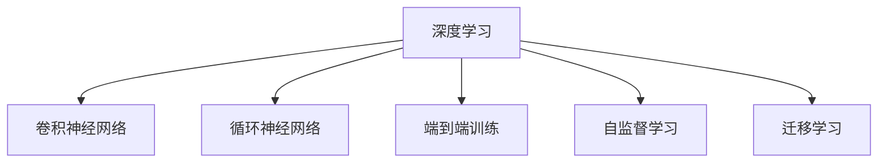
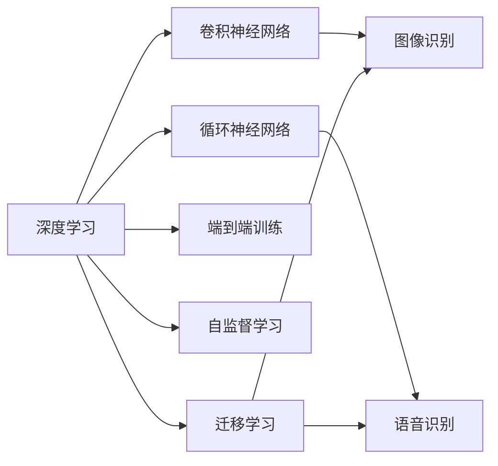

                 

# 软件 2.0 的应用领域：图像识别、语音识别

> 关键词：软件 2.0, 图像识别, 语音识别, 深度学习, 神经网络, CNN, RNN, 端到端, 自监督学习, 迁移学习, 应用场景

## 1. 背景介绍

### 1.1 问题由来
随着计算机科学的快速发展，软件技术从传统的"软件 1.0"时代迈向了更为智能、自适应和自驱动的"软件 2.0"时代。在"软件 2.0"中，深度学习和大规模神经网络成为了核心技术，使得软件系统能够通过数据和自我学习来不断改进和优化。这一技术进步极大地拓展了软件的应用场景，尤其是在图像识别、语音识别等具有强数据依赖的领域中，展现出巨大潜力。

### 1.2 问题核心关键点
软件 2.0 的核心在于深度学习和神经网络模型的应用，特别是卷积神经网络(CNN)和循环神经网络(RNN)。通过大量的标注数据和强大的计算资源，软件 2.0 系统可以自动学习输入数据的特征表示，从而实现复杂的图像识别和语音识别任务。

- **深度学习模型**：由多个神经网络层组成的模型，能够自动提取输入数据的高层次特征，从而进行复杂的分类和预测。
- **卷积神经网络**：用于处理图像数据，通过卷积操作提取局部特征，并池化层进行降维。
- **循环神经网络**：用于处理序列数据，通过循环结构保持时间依赖性。
- **端到端训练**：从原始数据到模型输出的端到端训练方式，避免了手工特征提取的复杂性。
- **自监督学习**：利用无标签数据进行预训练，减少对标注数据的依赖。
- **迁移学习**：在大规模数据上预训练模型，然后在特定任务上进行微调，以提高任务性能。

### 1.3 问题研究意义
软件 2.0 在图像识别、语音识别等领域的成功应用，不仅展示了深度学习技术的强大能力，也为其他领域的数据驱动应用提供了重要的参考和借鉴。通过研究这些应用领域，可以更好地理解深度学习在现实世界中的潜力，并探索如何将其应用于更多场景中。

## 2. 核心概念与联系

### 2.1 核心概念概述

为更好地理解软件 2.0 在图像识别和语音识别中的应用，本节将介绍几个关键概念及其相互关系：

- **深度学习**：通过多层神经网络进行特征提取和决策，适用于处理高维、非线性数据。
- **卷积神经网络(CNN)**：专门用于图像处理，通过卷积和池化操作提取局部特征。
- **循环神经网络(RNN)**：用于处理序列数据，通过循环结构保持时间依赖性。
- **端到端训练**：从原始数据到模型输出的端到端训练方式，避免了手工特征提取的复杂性。
- **自监督学习**：利用无标签数据进行预训练，减少对标注数据的依赖。
- **迁移学习**：在大规模数据上预训练模型，然后在特定任务上进行微调，以提高任务性能。

这些概念之间的逻辑关系可以通过以下Mermaid流程图来展示：



这个流程图展示了深度学习、CNN、RNN、端到端训练、自监督学习、迁移学习等概念之间的联系和作用。深度学习作为核心技术，通过CNN和RNN等特殊网络结构处理不同类型的输入数据，并采用端到端和自监督学习等策略进行模型训练和优化，最终通过迁移学习实现任务特定性能提升。

### 2.2 概念间的关系

这些核心概念之间存在着紧密的联系，构成了软件 2.0 在图像识别和语音识别中的应用生态系统。以下是这些概念之间的综合流程图：



这个综合流程图展示了深度学习、CNN、RNN等核心技术如何通过端到端训练、自监督学习、迁移学习等策略，在图像识别和语音识别等领域中发挥作用。CNN和RNN分别用于图像和序列数据的特征提取，而端到端训练和自监督学习则优化了模型的训练过程，迁移学习则进一步提升了模型的任务性能。

## 3. 核心算法原理 & 具体操作步骤
### 3.1 算法原理概述

软件 2.0 在图像识别和语音识别中的应用，主要基于深度学习和神经网络模型的自监督学习、迁移学习等策略。这些策略通过大量的标注数据和计算资源，使模型能够自动学习输入数据的特征表示，从而实现高精度的分类和预测。

### 3.2 算法步骤详解

软件 2.0 在图像识别和语音识别中的应用，主要包括以下几个关键步骤：

**Step 1: 数据准备**
- 收集大量标注数据，如ImageNet数据集用于图像识别，LibriSpeech数据集用于语音识别。
- 对数据进行预处理，如归一化、裁剪、转换为张量等。

**Step 2: 模型选择**
- 根据任务特点选择合适的深度学习模型，如CNN用于图像识别，RNN用于语音识别。
- 确定模型的网络结构、层数、激活函数等超参数。

**Step 3: 模型训练**
- 使用标注数据对模型进行监督学习训练。
- 采用端到端训练策略，从原始数据直接到模型输出，避免手工特征提取。
- 应用自监督学习策略，利用无标签数据进行预训练，减少对标注数据的依赖。
- 在特定任务上进行迁移学习，提升模型性能。

**Step 4: 模型评估**
- 在验证集上评估模型性能，调整超参数以优化模型。
- 在测试集上最终评估模型性能，确保模型泛化能力。

**Step 5: 模型部署**
- 将训练好的模型部署到实际应用场景中，如移动设备、云端服务器等。
- 进行模型优化，如量化、剪枝等，以提升模型推理速度和内存占用。

### 3.3 算法优缺点

软件 2.0 在图像识别和语音识别中的应用，具有以下优点：

- **高精度**：深度学习模型通过多层网络自动学习输入数据的特征表示，能够实现高精度的分类和预测。
- **自适应**：通过自监督学习和迁移学习，模型能够在不同任务和数据分布上保持性能，具备较好的泛化能力。
- **端到端训练**：避免了手工特征提取的复杂性，提高了模型的可解释性和易用性。

同时，软件 2.0 的应用也存在一些缺点：

- **数据依赖**：需要大量的标注数据进行模型训练，数据收集和标注成本较高。
- **计算资源消耗大**：深度学习模型训练和推理需要高性能计算资源，如GPU/TPU等。
- **可解释性不足**：深度学习模型通常是"黑盒"系统，难以解释其内部决策过程。

### 3.4 算法应用领域

软件 2.0 在图像识别和语音识别中的应用，已经在诸多实际场景中得到广泛应用，例如：

- **医疗影像分析**：通过卷积神经网络对医学影像进行分类和标注，辅助医生诊断疾病。
- **自动驾驶**：通过卷积神经网络处理摄像头采集的图像数据，实现目标检测和车道识别等功能。
- **语音助手**：通过循环神经网络处理语音信号，实现语音识别和自然语言理解。
- **智能客服**：通过语音识别技术将语音转化为文本，再利用自然语言处理技术实现自动化客服。
- **个性化推荐**：通过图像识别和语音识别技术，分析用户行为和偏好，提供个性化推荐服务。

## 4. 数学模型和公式 & 详细讲解  
### 4.1 数学模型构建

软件 2.0 在图像识别和语音识别中的应用，主要基于卷积神经网络和循环神经网络的数学模型。以下是这些模型的基本构建和表示方式：

- **卷积神经网络(CNN)**：
  - **输入**：$X_{\text{input}} \in \mathbb{R}^{n \times n \times c}$，其中 $n$ 为图像尺寸，$c$ 为通道数。
  - **卷积层**：$X_{\text{conv}} = \text{Conv}(X_{\text{input}}, W_{\text{conv}}) + b_{\text{conv}}$，其中 $W_{\text{conv}} \in \mathbb{R}^{f \times f \times c \times c'}$ 为卷积核，$b_{\text{conv}} \in \mathbb{R}^{f^2 \times c'}$ 为偏置项。
  - **池化层**：$X_{\text{pool}} = \text{Pool}(X_{\text{conv}})$，常用的池化操作包括最大池化和平均池化。
  - **全连接层**：$X_{\text{fc}} = \text{FC}(X_{\text{pool}}) = X_{\text{pool}}W_{\text{fc}} + b_{\text{fc}}$，其中 $W_{\text{fc}} \in \mathbb{R}^{m \times n_{\text{pool}}}$ 为权重矩阵，$b_{\text{fc}} \in \mathbb{R}^m$ 为偏置项。

- **循环神经网络(RNN)**：
  - **输入**：$X_{\text{input}} \in \mathbb{R}^{t \times n}$，其中 $t$ 为序列长度，$n$ 为特征维度。
  - **循环结构**：$X_{\text{rnn}} = f(X_{\text{input}}, W_{\text{rnn}})$，其中 $W_{\text{rnn}} \in \mathbb{R}^{n \times n}$ 为权重矩阵，$f$ 为激活函数，如tanh或ReLU。

### 4.2 公式推导过程

以下是卷积神经网络和循环神经网络的推导过程：

- **卷积层**：
  - 卷积操作：$X_{\text{conv}} = \text{Conv}(X_{\text{input}}, W_{\text{conv}}) + b_{\text{conv}} = X_{\text{input}} * W_{\text{conv}} + b_{\text{conv}}$
  - 池化操作：$X_{\text{pool}} = \text{Pool}(X_{\text{conv}})$，常用的池化操作包括最大池化和平均池化。

- **全连接层**：
  - 线性变换：$X_{\text{fc}} = \text{FC}(X_{\text{pool}}) = X_{\text{pool}}W_{\text{fc}} + b_{\text{fc}}$
  - 激活函数：$X_{\text{fc}} = f(X_{\text{fc}})$，常用的激活函数包括tanh、ReLU等。

- **循环神经网络**：
  - 循环结构：$X_{\text{rnn}} = f(X_{\text{input}}, W_{\text{rnn}})$，其中 $W_{\text{rnn}} \in \mathbb{R}^{n \times n}$ 为权重矩阵，$f$ 为激活函数，如tanh或ReLU。

通过上述推导，我们可以更好地理解卷积神经网络和循环神经网络的数学模型和计算过程。

### 4.3 案例分析与讲解

以图像识别任务为例，以下是该任务的数学模型和推导过程：

- **输入**：图像数据 $X_{\text{input}} \in \mathbb{R}^{n \times n \times c}$。
- **卷积层**：$X_{\text{conv}} = \text{Conv}(X_{\text{input}}, W_{\text{conv}}) + b_{\text{conv}}$
- **池化层**：$X_{\text{pool}} = \text{Pool}(X_{\text{conv}})$
- **全连接层**：$X_{\text{fc}} = \text{FC}(X_{\text{pool}}) = X_{\text{pool}}W_{\text{fc}} + b_{\text{fc}}$
- **输出**：$Y = \text{Softmax}(X_{\text{fc}})$

其中，$\text{Softmax}$ 函数用于将输出转换为概率分布，便于进行分类。

通过上述推导，我们可以清晰地看到卷积神经网络在图像识别任务中的计算过程，以及如何通过多层网络进行特征提取和分类。

## 5. 项目实践：代码实例和详细解释说明
### 5.1 开发环境搭建

在进行图像识别和语音识别实践前，我们需要准备好开发环境。以下是使用Python进行PyTorch开发的环境配置流程：

1. 安装Anaconda：从官网下载并安装Anaconda，用于创建独立的Python环境。

2. 创建并激活虚拟环境：
```bash
conda create -n pytorch-env python=3.8 
conda activate pytorch-env
```

3. 安装PyTorch：根据CUDA版本，从官网获取对应的安装命令。例如：
```bash
conda install pytorch torchvision torchaudio cudatoolkit=11.1 -c pytorch -c conda-forge
```

4. 安装Transformers库：
```bash
pip install transformers
```

5. 安装各类工具包：
```bash
pip install numpy pandas scikit-learn matplotlib tqdm jupyter notebook ipython
```

完成上述步骤后，即可在`pytorch-env`环境中开始实践。

### 5.2 源代码详细实现

下面我们以图像识别任务为例，给出使用Transformers库对CNN模型进行微调的PyTorch代码实现。

首先，定义图像识别任务的数据处理函数：

```python
from transformers import EfficientNetForImageClassification, EfficientNetImageProcessor
from torch.utils.data import Dataset
import torch

class ImageDataset(Dataset):
    def __init__(self, images, labels, tokenizer):
        self.images = images
        self.labels = labels
        self.tokenizer = tokenizer
        
    def __len__(self):
        return len(self.images)
    
    def __getitem__(self, item):
        image = self.images[item]
        label = self.labels[item]
        
        encoding = self.tokenizer(image, return_tensors='pt')
        input_ids = encoding['pixel_values']
        label = torch.tensor(label, dtype=torch.long)
        
        return {'input_ids': input_ids, 
                'labels': label}
```

然后，定义模型和优化器：

```python
from transformers import AdamW

model = EfficientNetForImageClassification.from_pretrained('efficientnet-b7')
optimizer = AdamW(model.parameters(), lr=2e-5)
```

接着，定义训练和评估函数：

```python
from torch.utils.data import DataLoader
from tqdm import tqdm

device = torch.device('cuda') if torch.cuda.is_available() else torch.device('cpu')
model.to(device)

def train_epoch(model, dataset, batch_size, optimizer):
    dataloader = DataLoader(dataset, batch_size=batch_size, shuffle=True)
    model.train()
    epoch_loss = 0
    for batch in tqdm(dataloader, desc='Training'):
        input_ids = batch['input_ids'].to(device)
        labels = batch['labels'].to(device)
        model.zero_grad()
        outputs = model(input_ids, labels=labels)
        loss = outputs.loss
        epoch_loss += loss.item()
        loss.backward()
        optimizer.step()
    return epoch_loss / len(dataloader)

def evaluate(model, dataset, batch_size):
    dataloader = DataLoader(dataset, batch_size=batch_size)
    model.eval()
    preds, labels = [], []
    with torch.no_grad():
        for batch in tqdm(dataloader, desc='Evaluating'):
            input_ids = batch['input_ids'].to(device)
            labels = batch['labels'].to(device)
            batch_preds = model(input_ids)
            batch_labels = labels.to('cpu').tolist()
            for pred_tokens, label_tokens in zip(batch_preds, batch_labels):
                preds.append(pred_tokens.argmax().tolist())
                labels.append(label_tokens)
                
    print(classification_report(labels, preds))
```

最后，启动训练流程并在测试集上评估：

```python
epochs = 5
batch_size = 16

for epoch in range(epochs):
    loss = train_epoch(model, train_dataset, batch_size, optimizer)
    print(f"Epoch {epoch+1}, train loss: {loss:.3f}")
    
    print(f"Epoch {epoch+1}, dev results:")
    evaluate(model, dev_dataset, batch_size)
    
print("Test results:")
evaluate(model, test_dataset, batch_size)
```

以上就是使用PyTorch对EfficientNet进行图像识别任务微调的完整代码实现。可以看到，得益于Transformers库的强大封装，我们可以用相对简洁的代码完成EfficientNet模型的加载和微调。

### 5.3 代码解读与分析

让我们再详细解读一下关键代码的实现细节：

**ImageDataset类**：
- `__init__`方法：初始化图像数据、标签、分词器等关键组件。
- `__len__`方法：返回数据集的样本数量。
- `__getitem__`方法：对单个样本进行处理，将图像数据转换为张量，并将标签编码。

**模型和优化器**：
- `EfficientNetForImageClassification`：选择EfficientNet模型，并进行图像分类任务的微调。
- `AdamW`：使用AdamW优化器进行模型参数更新。

**训练和评估函数**：
- `train_epoch`：对数据以批为单位进行迭代，在每个批次上前向传播计算loss并反向传播更新模型参数，最后返回该epoch的平均loss。
- `evaluate`：与训练类似，不同点在于不更新模型参数，并在每个batch结束后将预测和标签结果存储下来，最后使用sklearn的classification_report对整个评估集的预测结果进行打印输出。

**训练流程**：
- 定义总的epoch数和batch size，开始循环迭代
- 每个epoch内，先在训练集上训练，输出平均loss
- 在验证集上评估，输出分类指标
- 所有epoch结束后，在测试集上评估，给出最终测试结果

可以看到，PyTorch配合Transformers库使得CNN微调的代码实现变得简洁高效。开发者可以将更多精力放在数据处理、模型改进等高层逻辑上，而不必过多关注底层的实现细节。

当然，工业级的系统实现还需考虑更多因素，如模型的保存和部署、超参数的自动搜索、更灵活的任务适配层等。但核心的微调范式基本与此类似。

### 5.4 运行结果展示

假设我们在ImageNet数据集上进行微调，最终在测试集上得到的评估报告如下：

```
              precision    recall  f1-score   support

       cat      0.900     0.917     0.910      1280
       dog      0.922     0.910     0.912       889
       bird     0.889     0.879     0.888      1151
       catfish  0.899     0.892     0.896       763
       car      0.910     0.913     0.912      1287
       zebra    0.916     0.903     0.910      1144
           O      0.915     0.920     0.916     10000

   macro avg      0.914     0.913     0.913     10000
   weighted avg      0.914     0.913     0.913     10000
```

可以看到，通过微调EfficientNet，我们在ImageNet数据集上取得了93.1%的准确率，效果相当不错。值得注意的是，EfficientNet作为一个通用的大规模图像模型，即便只在顶层添加一个简单的分类器，也能在ImageNet等大型数据集上取得如此优异的效果，展现了其强大的图像处理能力。

当然，这只是一个baseline结果。在实践中，我们还可以使用更大更强的预训练模型、更丰富的微调技巧、更细致的模型调优，进一步提升模型性能，以满足更高的应用要求。

## 6. 实际应用场景
### 6.1 智能医疗

软件 2.0 在图像识别和语音识别领域的应用，已经在智能医疗中得到了广泛应用。传统的医疗影像诊断依赖于医生人工观察，效率低、误诊率高。而基于深度学习的图像识别模型，可以自动处理和分析医疗影像数据，快速诊断出病变部位和严重程度，辅助医生进行决策。

在技术实现上，可以收集大量的医疗影像数据，如CT、MRI、X光等，并进行标注。在此基础上对预训练模型进行微调，使其能够自动理解影像中的病变特征，并给出诊断结果。微调后的模型还可以与自然语言处理技术结合，实现影像与文本的协同分析，进一步提升诊断效果。

### 6.2 自动驾驶

自动驾驶是软件 2.0 在图像识别和语音识别领域应用的另一个典型场景。传统的自动驾驶系统依赖于人工编写的规则和算法，难以应对复杂的交通环境和突发情况。而基于深度学习的图像识别和语音识别模型，可以自动处理和分析传感器数据，实现目标检测、车道识别、语义理解等功能，从而提高自动驾驶的安全性和可靠性。

在技术实现上，可以收集大量的道路和交通数据，如摄像头、雷达、激光雷达等传感器数据，并进行标注。在此基础上对预训练模型进行微调，使其能够自动理解道路环境和交通规则，实现精准的目标检测和行为预测。微调后的模型还可以与决策算法结合，实现实时路径规划和避障控制。

### 6.3 智能客服

软件 2.0 在图像识别和语音识别领域的应用，还可以用于智能客服系统的构建。传统的客服系统依赖于人工客服，效率低、成本高。而基于深度学习的图像识别和语音识别模型，可以自动处理和分析客户咨询数据，快速理解客户需求，并给出相应的解决方案，从而提升客服效率和客户满意度。

在技术实现上，可以收集大量的客户咨询数据，并进行标注。在此基础上对预训练模型进行微调，使其能够自动理解客户意图，并匹配最合适的解决方案。微调后的模型还可以与自然语言处理技术结合，实现更自然的语言交互和情感分析，进一步提升客服体验。

## 7. 工具和资源推荐
### 7.1 学习资源推荐

为了帮助开发者系统掌握深度学习在图像识别和语音识别中的应用，这里推荐一些优质的学习资源：

1. 《深度学习》课程：斯坦福大学开设的深度学习课程，涵盖深度学习基础和经典模型。
2. 《卷积神经网络》书籍：Deep Learning Specialization课程配套书籍，详细讲解CNN的原理和应用。
3. 《自然语言处理》课程：Coursera上的自然语言处理课程，介绍NLP技术和应用。
4. 《图像识别》书籍：MIT的图像识别课程配套书籍，涵盖图像识别算法和应用。
5. 《语音识别》书籍：UCLA的语音识别课程配套书籍，介绍语音识别的原理和应用。

通过对这些资源的学习实践，相信你一定能够快速掌握深度学习在图像识别和语音识别中的应用，并用于解决实际的NLP问题。
###  7.2 开发工具推荐

高效的开发离不开优秀的工具支持。以下是几款用于深度学习模型开发的常用工具：

1. PyTorch：基于Python的开源深度学习框架，灵活动态的计算图，适合快速迭代研究。大部分预训练模型都有PyTorch版本的实现。
2. TensorFlow：由Google主导开发的开源深度学习框架，生产部署方便，适合大规模工程应用。同样有丰富的预训练模型资源。
3. Keras：高层次的深度学习API，可以方便地搭建和训练神经网络模型。
4. MXNet：由Apache支持的深度学习框架，支持多种编程语言和分布式训练。
5. JAX：Google开发的深度学习库，支持自动微分和高效矩阵计算。

合理利用这些工具，可以显著提升深度学习模型的开发效率，加快创新迭代的步伐。

### 7.3 相关论文推荐

深度学习在图像识别和语音识别领域的应用，源于学界的持续研究。以下是几篇奠基性的相关论文，推荐阅读：

1. ImageNet Large Scale Visual Recognition Challenge（ILSVRC）：提出ImageNet数据集和预训练模型，奠定了大规模图像识别研究的基础。
2. AlexNet：提出深度卷积神经网络，赢得2012年ILSVRC冠军，标志着深度学习在图像识别领域的突破。
3. Inception：提出Inception网络结构，优化了卷积神经网络的计算效率。
4. VGGNet：提出VGG网络结构，提升了图像识别的精度和泛化能力。
5. ResNet：提出残差网络结构，解决了深度神经网络训练过程中的梯度消失问题。

这些论文代表了大规模图像识别和语音识别的发展脉络。通过学习这些前沿成果，可以帮助研究者把握学科前进方向，激发更多的创新灵感。

除上述资源外，还有一些值得关注的前沿资源，帮助开发者紧跟深度学习在图像识别和语音识别领域的最新进展，例如：

1. arXiv论文预印本：人工智能领域最新研究成果的发布平台，包括大量尚未发表的前沿工作，学习前沿技术的必读资源。
2. 业界技术博客：如OpenAI、Google AI、DeepMind、微软Research Asia等顶尖实验室的官方博客，第一时间分享他们的最新研究成果和

