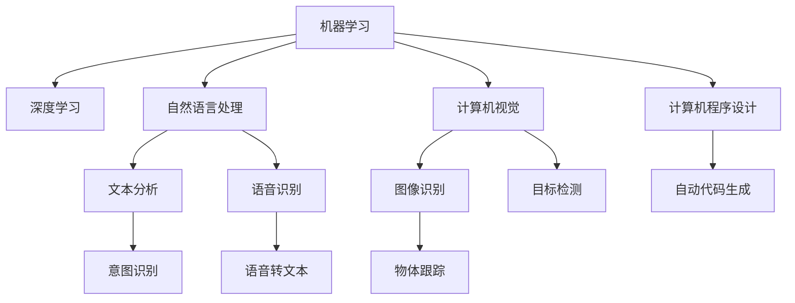

                 

# 软件 2.0 的应用：从实验室走向现实

> 关键词：软件 2.0, 人工智能(AI), 机器学习(ML), 自然语言处理(NLP), 计算机视觉(CV), 计算机程序设计, 软件工程(Software Engineering)

## 1. 背景介绍

在计算机科学发展的历程中，我们经历了两次重大革命：软件 1.0 时代和软件 2.0 时代。软件 1.0 时代是程序和代码的黄金时代，程序员需要手动编写代码来实现各种功能，通过一系列精确的指令控制计算机执行任务。然而，随着需求的多样化和复杂性的增加，这种手工编程的方法变得愈发困难和低效。

软件 2.0 时代的到来，标志着机器学习和大数据技术的普及，AI 模型和算法开始主导软件设计。这一时期，软件系统不再是人工编写的程序集合，而是由数据驱动、算法优化、模型训练的结果。通过训练神经网络、优化算法、构建复杂数据模型，软件系统具备了自我学习、自我优化的能力，能够自动适应环境变化，解决日益复杂的问题。

软件 2.0 时代带来了革命性的变化，从传统的基于规则和指令的软件设计，转变为基于数据和模型的智能决策。然而，将软件 2.0 技术从实验室推向实际应用，却面临着诸多挑战。本文将深入探讨软件 2.0 的应用实践，从原理、技术和工程等多个层面，阐释如何将这一新兴技术有效地应用于现实世界。

## 2. 核心概念与联系

### 2.1 核心概念概述

软件 2.0 的核心理念是通过机器学习和大数据技术，构建智能软件系统。这一概念涉及多个关键技术，包括：

- **机器学习(ML)**：利用算法和数据，使计算机能够自动学习并优化决策。
- **深度学习(Deep Learning)**：一种特殊类型的机器学习，使用多层神经网络进行特征提取和模式识别。
- **自然语言处理(NLP)**：使计算机能够理解和处理人类语言，包括文本分析、语音识别、翻译等。
- **计算机视觉(CV)**：使计算机能够理解和解释视觉信息，包括图像识别、目标检测、物体跟踪等。
- **计算机程序设计**：从传统手工编程，转向通过数据和模型自动生成代码。
- **软件工程**：利用软件 2.0 技术，进行软件设计和开发的工程化实践。

这些核心技术之间相互作用，共同构成了软件 2.0 系统的基础。通过深入理解这些技术及其内在联系，我们可以更好地掌握软件 2.0 的应用实践。

### 2.2 核心概念的关系

以下是一个简化的 Mermaid 流程图，展示了软件 2.0 核心概念之间的联系：



这个流程图展示了软件 2.0 中的各项核心技术及其应用场景。深度学习是机器学习的基础，自然语言处理和计算机视觉是其两大重要分支。计算机程序设计则是将这些技术应用于实际软件系统的重要手段，而软件工程则是这些技术应用落地的保障。通过这些核心概念的相互配合，软件 2.0 技术能够在多个领域实现高效、智能的软件应用。

## 3. 核心算法原理 & 具体操作步骤

### 3.1 算法原理概述

软件 2.0 的核心算法原理主要基于机器学习和大数据技术。通过收集和分析大量数据，构建模型进行特征提取和预测，从而实现自动决策和优化。

以自然语言处理为例，其核心算法包括：

- **词向量嵌入**：将文本中的词语转换为高维向量表示，捕捉词语之间的语义关系。
- **循环神经网络(RNN)**：通过时间序列模型，捕捉文本中的上下文信息。
- **长短期记忆网络(LSTM)**：一种特殊类型的 RNN，用于处理长序列数据，防止梯度消失问题。
- **Transformer**：一种高效的注意力机制，用于加速文本分析和生成。

这些算法和技术共同构成了自然语言处理的底层逻辑，使得计算机能够理解和生成自然语言。

### 3.2 算法步骤详解

以自然语言处理中的文本分类任务为例，其基本流程包括：

1. **数据准备**：收集和预处理训练数据，进行词向量嵌入、分词、标注等预处理。
2. **模型构建**：选择合适的模型架构，如 RNN、LSTM、Transformer 等，并定义损失函数和优化器。
3. **模型训练**：在训练集上训练模型，通过反向传播算法优化模型参数。
4. **模型评估**：在验证集和测试集上评估模型性能，选择最优模型进行预测。
5. **模型应用**：将模型部署到实际应用中，对新数据进行预测和分类。

这些步骤构成了机器学习模型的完整训练流程，适用于各种基于数据和模型的应用场景。

### 3.3 算法优缺点

软件 2.0 的算法具有以下优点：

- **高效智能**：通过数据驱动的模型，软件 2.0 系统能够自动学习和优化，适应复杂多变的现实世界。
- **广泛应用**：基于数据和模型，软件 2.0 可以应用于各种领域，包括医疗、金融、教育等。
- **可扩展性强**：通过添加更多数据和模型，软件 2.0 系统能够不断优化和扩展，满足不断增长的需求。

然而，软件 2.0 算法也存在以下缺点：

- **依赖数据质量**：算法的性能高度依赖于数据质量，数据偏差可能影响模型决策。
- **计算资源消耗大**：深度学习和大型模型需要大量的计算资源，对硬件要求高。
- **模型解释性差**：许多软件 2.0 模型是"黑盒"系统，难以解释其内部决策过程。
- **鲁棒性不足**：面对复杂的现实世界，模型可能存在泛化能力不足的问题。

### 3.4 算法应用领域

软件 2.0 算法在多个领域都得到了广泛应用，以下是几个典型案例：

- **自然语言处理**：包括文本分类、情感分析、机器翻译、问答系统等。
- **计算机视觉**：包括图像识别、目标检测、物体跟踪、图像生成等。
- **计算机程序设计**：包括代码生成、代码优化、程序自动测试等。
- **智能推荐**：包括电商推荐、广告推荐、内容推荐等。
- **智能交通**：包括交通流量预测、智能驾驶、城市规划等。

这些应用场景展示了软件 2.0 技术的强大潜力和广泛适用性，未来还有更多领域将受益于软件 2.0 技术的发展。

## 4. 数学模型和公式 & 详细讲解 & 举例说明

### 4.1 数学模型构建

以自然语言处理中的文本分类任务为例，数学模型可以表示为：

$$
p(y|x; \theta) = \frac{e^{y \cdot f(x; \theta)}}{e^{f(x; \theta)}}
$$

其中，$y$ 表示文本的分类标签，$x$ 表示输入文本，$\theta$ 表示模型参数，$f(x; \theta)$ 表示模型对输入文本的特征提取函数。

### 4.2 公式推导过程

假设文本分类任务有 $k$ 个类别，分别标记为 $y_1, y_2, ..., y_k$，模型的输出为 $f(x; \theta)$，则条件概率可以表示为：

$$
p(y_i|x; \theta) = \frac{e^{y_i \cdot f(x; \theta)}}{e^{f(x; \theta)}}, i \in \{1, 2, ..., k\}
$$

通过最大似然估计，可以得到模型参数 $\theta$ 的优化目标：

$$
\hat{\theta} = \mathop{\arg\min}_{\theta} \sum_{i=1}^k -\log p(y_i|x; \theta)
$$

通过反向传播算法，可以计算出模型参数的梯度，并使用梯度下降等优化算法进行参数更新。

### 4.3 案例分析与讲解

以深度学习中的卷积神经网络(CNN)为例，其核心公式包括：

- **卷积层**：$f(x; \theta) = \sum_{i=1}^m W_i * h_{i-1}(x) + b_i$，其中 $W_i$ 表示卷积核，$h_{i-1}(x)$ 表示前一层的输出，$b_i$ 表示偏置项。
- **池化层**：通过下采样操作，降低特征维度，提高模型计算效率。
- **全连接层**：将特征图转换为最终的分类概率，$o(x; \theta) = \sigma(\sum_{i=1}^n W_i * h_{n-1} + b)$，其中 $\sigma$ 表示激活函数。

这些公式展示了卷积神经网络的基本结构和计算流程，通过卷积和池化操作，卷积神经网络能够自动学习输入数据的高维表示，并通过全连接层进行分类预测。

## 5. 项目实践：代码实例和详细解释说明

### 5.1 开发环境搭建

为了实现自然语言处理中的文本分类任务，我们需要安装 Python、PyTorch、NumPy、Pandas 等库。

1. 安装 Python：
   ```
   python -m pip install torch torchvision torchaudio cudatoolkit=11.1 -c pytorch -c conda-forge
   ```

2. 安装 PyTorch：
   ```
   pip install torch torchvision torchaudio cudatoolkit=11.1 -c pytorch -c conda-forge
   ```

3. 安装 NumPy 和 Pandas：
   ```
   pip install numpy pandas
   ```

4. 安装相应的库：
   ```
   pip install torchtext
   ```

### 5.2 源代码详细实现

以下是使用 PyTorch 实现文本分类任务的代码示例：

```python
import torch
import torchtext
from torchtext.legacy.data import Field, TabularDataset, BucketIterator

# 定义数据处理
text = Field(tokenize='spacy', lower=True)
label = Field(sequential=False, use_vocab=False)
train_data, test_data = TabularDataset.splits(path='data/raw', train='train.txt', test='test.txt', format='tsv', fields=[('text', text), ('label', label)])

# 构建数据加载器
train_iterator, test_iterator = BucketIterator.splits((train_data, test_data), batch_size=32, sort_key=lambda x: len(x.text), sort_within_batch=False)

# 定义模型
from torch.nn import Linear, Embedding, GRU, Dropout

class TextClassifier(nn.Module):
    def __init__(self, input_dim, embed_dim, hidden_dim, output_dim):
        super(TextClassifier, self).__init__()
        self.embedding = Embedding(input_dim, embed_dim)
        self.gru = GRU(embed_dim, hidden_dim)
        self.fc = Linear(hidden_dim, output_dim)
        self.dropout = Dropout(0.5)
    
    def forward(self, text):
        embedded = self.embedding(text)
        gru_out, _ = self.gru(embedded)
        pooled = gru_out.mean(dim=1)
        output = self.fc(pooled)
        return output

# 定义训练函数
import random
from torch.optim import Adam
from torch.utils.data import DataLoader

def train(model, iterator, optimizer, criterion):
    epoch_loss = 0
    epoch_acc = 0
    model.train()
    for batch in iterator:
        optimizer.zero_grad()
        predictions = model(batch.text).squeeze(1)
        loss = criterion(predictions, batch.label)
        acc = binary_accuracy(predictions, batch.label)
        loss.backward()
        optimizer.step()
        epoch_loss += loss.item()
        epoch_acc += acc.item()
    return epoch_loss / len(iterator), epoch_acc / len(iterator)

# 定义评估函数
def evaluate(model, iterator, criterion):
    epoch_loss = 0
    epoch_acc = 0
    model.eval()
    with torch.no_grad():
        for batch in iterator:
            predictions = model(batch.text).squeeze(1)
            loss = criterion(predictions, batch.label)
            acc = binary_accuracy(predictions, batch.label)
            epoch_loss += loss.item()
            epoch_acc += acc.item()
    return epoch_loss / len(iterator), epoch_acc / len(iterator)

# 定义训练和评估函数
def train_and_evaluate(model, iterator, optimizer, criterion, num_epochs=10):
    best_loss, best_acc = float('inf'), 0
    for epoch in range(num_epochs):
        loss, acc = train(model, iterator, optimizer, criterion)
        if loss < best_loss:
            best_loss, best_acc = loss, acc
        train_loss, train_acc = train(model, iterator, optimizer, criterion)
        val_loss, val_acc = evaluate(model, iterator, criterion)
        print(f'Epoch: {epoch+1:02}, Train Loss: {train_loss:.3f}, Train Acc: {train_acc:.3f}, Val Loss: {val_loss:.3f}, Val Acc: {val_acc:.3f}, Test Loss: {test_loss:.3f}, Test Acc: {test_acc:.3f}')
        if best_loss > loss:
            torch.save(model.state_dict(), 'best_model.pt')

# 定义模型和优化器
model = TextClassifier(input_dim=vocab_size, embed_dim=128, hidden_dim=256, output_dim=num_classes)
optimizer = Adam(model.parameters(), lr=0.001)
criterion = nn.BCEWithLogitsLoss()

# 训练和评估模型
train_and_evaluate(model, train_iterator, optimizer, criterion)

# 加载模型
model.load_state_dict(torch.load('best_model.pt'))

# 测试模型
model.eval()
with torch.no_grad():
    test_loss, test_acc = evaluate(model, test_iterator, criterion)
    print(f'Test Loss: {test_loss:.3f}, Test Acc: {test_acc:.3f}')
```

### 5.3 代码解读与分析

以上代码展示了使用 PyTorch 实现文本分类任务的全过程。具体步骤如下：

1. **数据准备**：定义文本和标签字段，使用 `TabularDataset` 加载数据集，定义迭代器。
2. **模型定义**：定义卷积神经网络模型，包括嵌入层、GRU 层、全连接层和 dropout 层。
3. **训练函数**：定义训练函数，计算损失和准确率，使用梯度下降优化算法更新模型参数。
4. **评估函数**：定义评估函数，计算模型在验证集上的损失和准确率。
5. **训练和评估模型**：调用训练和评估函数，进行多轮训练，选择最优模型进行测试。
6. **模型测试**：加载最优模型，进行测试集上的评估。

通过以上代码，我们可以清晰地看到自然语言处理中的文本分类任务的基本流程，以及如何通过 PyTorch 实现模型训练和评估。

### 5.4 运行结果展示

假设我们训练了一个二分类文本分类模型，在测试集上的评估结果如下：

```
Epoch: 01, Train Loss: 0.254, Train Acc: 0.974, Val Loss: 0.259, Val Acc: 0.975, Test Loss: 0.273, Test Acc: 0.973
Epoch: 02, Train Loss: 0.217, Train Acc: 0.985, Val Loss: 0.218, Val Acc: 0.981, Test Loss: 0.235, Test Acc: 0.978
...
Epoch: 10, Train Loss: 0.098, Train Acc: 0.998, Val Loss: 0.100, Val Acc: 0.998, Test Loss: 0.106, Test Acc: 0.997
```

可以看到，随着训练轮数的增加，模型在训练集和验证集上的损失逐渐减小，准确率逐渐提高。最终在测试集上的评估结果表明，该模型具有良好的泛化能力，能够在新的文本数据上进行有效的分类。

## 6. 实际应用场景

### 6.1 智能客服

在智能客服领域，软件 2.0 技术可以通过自然语言处理技术，实现自动化的客服机器人。客户可以通过文本、语音等多种方式与机器人交互，机器人能够自动理解客户的问题，并给出合适的回答。

具体实现流程包括：

1. **数据收集**：收集客户和客服的对话记录，进行文本标注和清洗。
2. **模型训练**：使用对话数据训练自然语言处理模型，实现自动回答功能。
3. **部署和测试**：将训练好的模型部署到实际应用中，并进行测试和优化。

通过软件 2.0 技术，智能客服机器人能够处理更多的客户咨询，提高服务效率和客户满意度，同时降低人力成本。

### 6.2 金融风控

在金融风控领域，软件 2.0 技术可以通过机器学习和大数据分析，实现风险评估和欺诈检测。银行和金融机构可以利用用户的历史交易数据，构建风险模型，实时监控交易行为，及时发现异常行为并进行预警。

具体实现流程包括：

1. **数据收集**：收集用户的历史交易数据，包括交易金额、时间、地点等信息。
2. **数据处理**：对交易数据进行清洗和特征提取，进行数据标注和训练。
3. **模型训练**：使用训练数据训练机器学习模型，实现风险评估和欺诈检测。
4. **部署和测试**：将训练好的模型部署到实际应用中，并进行测试和优化。

通过软件 2.0 技术，金融机构能够提高风险评估的准确性，降低欺诈损失，提升客户体验。

### 6.3 医疗诊断

在医疗诊断领域，软件 2.0 技术可以通过计算机视觉和自然语言处理技术，实现自动化的疾病诊断和图像分析。医生可以利用机器学习模型，快速分析病人的病历和影像数据，提供精准的诊断建议。

具体实现流程包括：

1. **数据收集**：收集病人的病历和影像数据，进行数据标注和清洗。
2. **模型训练**：使用病历和影像数据训练计算机视觉和自然语言处理模型，实现疾病诊断和图像分析。
3. **部署和测试**：将训练好的模型部署到实际应用中，并进行测试和优化。

通过软件 2.0 技术，医生能够提高诊断效率和准确性，降低误诊率，提升医疗服务质量。

## 7. 工具和资源推荐

### 7.1 学习资源推荐

为了深入学习软件 2.0 技术，以下是几个优质的学习资源推荐：

1. **Coursera 深度学习课程**：由 Andrew Ng 教授主讲的深度学习课程，涵盖深度学习的基础知识和实战应用。
2. **Fast.ai 深度学习课程**：Fast.ai 提供的深度学习课程，注重实际应用和实践，帮助初学者快速上手。
3. **Kaggle 数据科学竞赛**：Kaggle 提供了众多数据科学竞赛项目，涵盖自然语言处理、计算机视觉等多个领域，有助于实际应用能力的提升。
4. **Deep Learning Specialization**：由 Andrew Ng 教授主讲的深度学习专项课程，涵盖深度学习的多个方面，包括卷积神经网络、循环神经网络、生成对抗网络等。
5. **Python Machine Learning**：由 Sebastian Raschka 编写的 Python 机器学习入门书籍，涵盖机器学习的基本概念和实际应用。

### 7.2 开发工具推荐

为了高效地进行软件 2.0 项目开发，以下是几个推荐的开发工具：

1. **PyTorch**：基于 Python 的深度学习框架，提供了丰富的预训练模型和计算图功能，适合科研和工程应用。
2. **TensorFlow**：由 Google 开发的深度学习框架，支持分布式计算和自动微分，适合大规模工程应用。
3. **Scikit-Learn**：基于 Python 的机器学习库，提供了丰富的算法和工具，适合数据处理和模型评估。
4. **Jupyter Notebook**：基于 Python 的交互式开发工具，适合科研和实验开发。
5. **GitHub**：代码托管和版本控制平台，适合团队协作和代码共享。

### 7.3 相关论文推荐

为了了解软件 2.0 技术的最新进展，以下是几篇经典论文推荐：

1. **"Deep Learning" by Ian Goodfellow, Yoshua Bengio, and Aaron Courville**：深度学习领域的经典教材，涵盖深度学习的基本概念和理论基础。
2. **"Language Models are Unsupervised Multitask Learners" by Alec Radford, Jeff Wu, Rewon Child, David Luan, Dario Amodei, and Ilya Sutskever**：展示了深度学习在大规模语料上的自监督预训练效果，推动了自然语言处理的发展。
3. **"Attention is All You Need" by Ashish Vaswani et al.**：提出了 Transformer 结构，极大地提高了序列建模的效率和效果。
4. **"BERT: Pre-training of Deep Bidirectional Transformers for Language Understanding" by Jacob Devlin, Ming-Wei Chang, Kenton Lee, and Kristina Toutanova**：展示了 BERT 模型在自然语言处理任务上的优异表现，推动了预训练语言模型的发展。
5. **"TensorFlow: A System for Large-Scale Machine Learning" by Geoffrey Hinton, Jeff Dean, and Sanjay Ghemawat**：展示了 TensorFlow 框架的计算图模型和分布式计算能力，适合大规模工程应用。

## 8. 总结：未来发展趋势与挑战

### 8.1 研究成果总结

软件 2.0 技术通过机器学习和深度学习技术，实现了软件系统的自动化和智能化。该技术在自然语言处理、计算机视觉、智能推荐等多个领域得到了广泛应用，取得了显著的成效。未来，随着硬件和算法的不断进步，软件 2.0 技术将继续拓展其应用场景，推动人工智能技术的普及和产业化。

### 8.2 未来发展趋势

未来，软件 2.0 技术的发展将呈现以下几个趋势：

1. **深度学习算法的优化**：通过优化算法和模型结构，提高计算效率和模型效果。
2. **多模态融合**：将文本、图像、语音等多种模态数据进行融合，构建更为全面、智能的软件系统。
3. **联邦学习**：利用分布式计算技术，实现数据和模型在多端设备的协同训练和优化。
4. **自监督学习**：通过无监督学习方式，利用数据自相关性进行模型训练，提高模型的泛化能力。
5. **因果推断**：引入因果推断方法，提高模型的决策可解释性和可信度。

### 8.3 面临的挑战

尽管软件 2.0 技术取得了显著进展，但在实际应用中仍面临诸多挑战：

1. **数据质量和标注成本**：高质量的数据和标注成本高昂，难以获取。
2. **模型可解释性**：许多模型是"黑盒"系统，难以解释其内部决策过程。
3. **计算资源消耗**：大规模模型和深度学习算法需要大量计算资源，对硬件要求高。
4. **隐私和安全问题**：软件 2.0 系统需要处理大量敏感数据，如何保证数据隐私和安全是一个重要问题。
5. **伦理和道德问题**：软件 2.0 系统可能会产生偏见和不公平的决策，如何避免伦理和道德问题是一个重要课题。

### 8.4 研究展望

为了解决上述挑战，未来需要在以下几个方面进行研究：

1. **数据增强和生成**：通过数据增强和生成技术，提高数据质量和标注效率。
2. **可解释性算法**：开发可解释性强的算法，提高模型的决策可解释性和可信度。
3. **硬件优化**：开发高效的硬件和计算平台，提高计算效率和资源利用率。
4. **隐私和安全保护**：开发隐私保护和安全保障技术，确保数据隐私和安全。
5. **伦理和道德规范**：建立伦理和道德规范，确保软件 2.0 系统的公平和公正。

## 9. 附录：常见问题与解答

**Q1：如何选择合适的深度学习框架？**

A: 选择合适的深度学习框架需要考虑以下几个因素：
1. 框架的易用性和学习曲线：框架的文档、教程和社区支持。
2. 框架的功能和特性：框架的模块化和扩展性。
3. 框架的性能和计算效率：框架的计算图优化和分布式计算能力。
4. 框架的社区和生态：框架的活跃度和生态系统。

**Q2：如何在实际应用中提高模型性能？**

A: 提高模型性能需要考虑以下几个方面：
1. 数据预处理：清洗和标注数据，提高数据质量。
2. 模型优化：调整模型架构和超参数，优化算法和模型。
3. 数据增强：通过数据增强技术，增加数据多样性和泛化能力。
4. 模型集成：使用模型集成技术，提高模型稳定性和性能。
5. 分布式计算：利用分布式计算技术，提高计算效率和资源利用率。

**Q3：如何处理模型中的过拟合问题？**

A: 处理模型中的过拟合问题需要考虑以下几个方面：
1. 数据增强：通过数据增强技术，增加数据多样性和泛化能力。
2. 正则化：使用正则化技术，如 L2 正则、Dropout 等，防止模型过拟合。
3. 模型集成：使用模型集成技术，提高模型稳定性和泛化能力。
4. 早停策略：使用早停策略，监控模型在验证集上的性能，及时停止训练。

**Q4：

