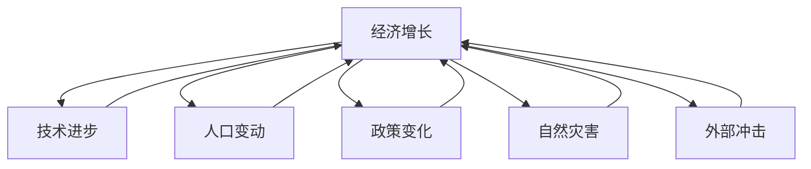
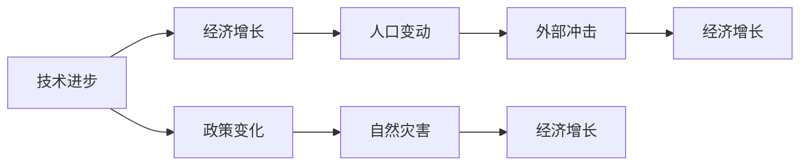
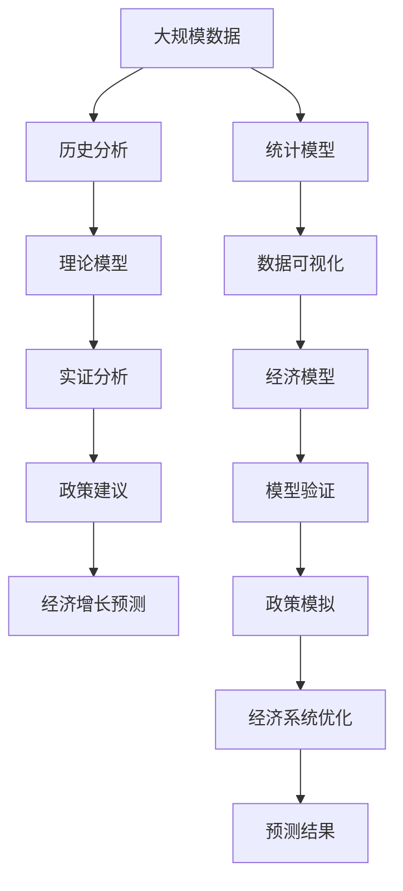

                 

## 1. 背景介绍

### 1.1 问题由来
经济长期影响分析是经济学研究的经典问题，旨在理解长期经济发展的驱动力、波动性及其深层次原因。然而，这一问题极其复杂，涉及众多动态因素和复杂交互，如技术进步、人口变动、政治制度、资源稀缺等，难以全面系统地分析和预测。近年来，随着大数据、人工智能等新兴技术的发展，经济学者开始利用这些工具对经济长期影响进行更加精细和深入的研究，期望找到影响经济的关键因素，并提出更加有效的政策建议。

### 1.2 问题核心关键点
本研究聚焦于阶段性因素对经济的长期影响，即特定时间段内的关键事件、政策、技术变革等如何通过内生机制和外生冲击对经济系统产生深远影响。我们将从历史案例、理论模型和实证分析三个维度展开，探讨不同因素的交互作用及其对经济增长的长期影响，并尝试提出未来研究的建议。

### 1.3 问题研究意义
阶段性因素对经济的长期影响研究具有重要意义：

1. **历史与理论结合**：通过对历史经济事件的分析，我们可以检验现有理论模型的预测能力，发现理论不足和改进方向。
2. **政策制定的依据**：了解关键因素对经济的长远影响，有助于政府制定更有针对性的政策，引导经济发展方向。
3. **风险评估与管理**：准确识别和分析经济波动的原因，有助于企业和投资者更好地进行风险评估和管理。
4. **经济发展的预测与规划**：理解不同因素的长期作用，可以更准确地预测未来经济走向，为经济规划提供依据。
5. **国际经济合作的优化**：分析国际间经济互动的长期影响，有助于优化全球经济合作与竞争策略。

## 2. 核心概念与联系

### 2.1 核心概念概述

为更好地理解阶段性因素对经济的长期影响，本节将介绍几个密切相关的核心概念：

- **经济增长**：衡量一个国家或地区经济产出随时间变化的指标，通常用GDP增长率表示。长期经济增长涉及技术进步、劳动投入、资本积累、资源配置等多个维度。
- **技术进步**：包括发明、创新、改进工艺等对生产率的提升，是推动经济长期增长的关键因素。
- **人口变动**：包括出生率、死亡率、移民等，对劳动力供给、消费需求、社会福利等产生深远影响。
- **政策变化**：如货币政策、财政政策、贸易政策等，直接影响经济活动和经济结构。
- **自然灾害**：如地震、洪水、干旱等，对农业生产、基础设施、公共安全产生即时和长期影响。
- **外部冲击**：如战争、国际经济危机等，对经济体内部结构、投资信心、国际合作产生系统性影响。

这些核心概念之间存在着复杂的相互作用和反馈机制，共同影响着经济系统的长期演进。以下将通过Mermaid流程图展示它们之间的关系：



### 2.2 概念间的关系

这些核心概念之间存在着紧密的联系，形成了复杂的经济系统。通过以下Mermaid流程图，我们可以更直观地理解这些概念之间的相互作用和反馈机制。



这个流程图展示了技术进步和经济增长之间的直接联系，同时技术进步对政策变化的影响，以及外部冲击对经济增长和人口变动的双向作用。

### 2.3 核心概念的整体架构

以下我们将通过一个综合的流程图展示这些核心概念在大规模数据分析和经济建模中的应用：



这个综合流程图展示了从数据采集到模型验证的完整过程，以及模型结果对经济政策和经济增长的影响。

## 3. 核心算法原理 & 具体操作步骤
### 3.1 算法原理概述

阶段性因素对经济长期影响的分析，主要依赖于时间序列分析和因果推断。其核心思想是利用历史数据和理论模型，识别和量化不同因素对经济增长的贡献，预测未来趋势。

### 3.2 算法步骤详解

基于上述原理，阶段性因素对经济长期影响分析主要包括以下几个关键步骤：

**Step 1: 数据收集与预处理**
- 收集历史经济数据、技术进步数据、人口变动数据、政策数据等，包括GDP、就业率、专利申请、人口出生率、政府支出、关税税率等。
- 清洗和整理数据，处理缺失值、异常值，确保数据质量和一致性。

**Step 2: 变量选择与设计**
- 根据研究目的，选择关键变量，并设计合适的指标和模型。如GDP增长率、失业率、技术进步指数、出生率等。
- 利用统计方法筛选重要变量，进行变量之间的相关性分析。

**Step 3: 模型构建与训练**
- 利用时间序列分析方法（如ARIMA、VAR、SVM等）构建经济模型，捕捉经济系统的时间动态和复杂关系。
- 引入因果推断技术，如Granger因果检验、向量误差修正模型等，分析变量之间的因果关系。
- 利用机器学习算法（如随机森林、梯度提升树、神经网络等）构建预测模型，评估模型性能。

**Step 4: 实证分析与检验**
- 利用历史数据对模型进行拟合和验证，评估模型的拟合优度和预测能力。
- 进行敏感性分析，检验模型对不同变量变化的响应。
- 进行交叉验证和偏差分析，确保模型泛化性能和稳健性。

**Step 5: 政策模拟与优化**
- 利用模型预测未来经济增长，评估不同政策变化对经济的影响。
- 模拟政策情景，如税率调整、技术投资、人口迁移等，观察经济系统对政策变化的响应。
- 优化政策组合，提出政策建议。

### 3.3 算法优缺点

基于时间序列和因果推断的阶段性因素分析方法，具有以下优点：

1. **历史数据的利用**：能够充分利用历史数据，捕捉经济系统的时间动态和复杂关系。
2. **模型泛化能力**：基于时间序列和机器学习的方法，具有较强的泛化能力和预测能力。
3. **因果推断的精确性**：引入因果推断技术，能够更加精确地量化不同因素对经济增长的贡献。

然而，该方法也存在以下局限性：

1. **数据质量要求高**：需要大量高质量的历史数据，数据收集和清洗难度大。
2. **模型复杂度高**：构建复杂的时间序列和因果推断模型，对数据和计算资源要求高。
3. **解释性不足**：部分机器学习模型（如深度神经网络）缺乏可解释性，难以理解模型内部逻辑。

### 3.4 算法应用领域

阶段性因素对经济长期影响的分析方法，已经在多个领域得到应用，如：

- **宏观经济分析**：研究各国GDP增长、通货膨胀、利率等宏观经济指标的长期影响。
- **产业经济分析**：分析特定行业技术进步、政策变化对行业增长和就业的影响。
- **人口与劳动市场分析**：研究人口结构变化、移民政策对劳动力市场和消费需求的影响。
- **环境经济分析**：评估自然灾害、环境政策对经济系统（如农业产出、能源消耗等）的长期影响。
- **国际贸易分析**：研究贸易政策变化、国际贸易摩擦对经济增长和就业的影响。

## 4. 数学模型和公式 & 详细讲解  
### 4.1 数学模型构建

本节将使用数学语言对阶段性因素对经济长期影响分析过程进行更加严格的刻画。

记历史经济数据为 $Y_t$，其中 $t$ 表示时间。设阶段性因素为 $X_t$，包括技术进步、人口变动、政策变化等。

定义模型为 $Y_t = f(X_t) + \epsilon_t$，其中 $f$ 为函数映射，$\epsilon_t$ 为误差项。我们的目标是估计 $f$ 的参数，以量化不同因素对经济增长的影响。

### 4.2 公式推导过程

以下我们以时间序列分析为例，推导GDP增长的因果关系模型。

设 $Y_t$ 为GDP增长率，$X_t$ 为技术进步指数，模型可以表示为：

$$
Y_t = \alpha + \beta X_t + \gamma Y_{t-1} + \epsilon_t
$$

其中 $\alpha$ 为常数项，$\beta$ 为技术进步对GDP增长的影响系数，$\gamma$ 为GDP增长率的滞后影响系数，$\epsilon_t$ 为误差项。

利用最小二乘法对模型进行估计，得到：

$$
\hat{\beta} = \frac{\sum_{t=1}^{n} (X_t - \bar{X})(Y_t - \bar{Y})}{\sum_{t=1}^{n} (X_t - \bar{X})^2}
$$

$$
\hat{\gamma} = \frac{\sum_{t=1}^{n} (Y_{t-1} - \bar{Y}_{t-1})(Y_t - \bar{Y})}{\sum_{t=1}^{n} (Y_{t-1} - \bar{Y}_{t-1})^2}
$$

### 4.3 案例分析与讲解

以日本战后经济增长为例，分析技术进步对经济增长的贡献。

- 数据集：收集日本1950-2019年的GDP增长率、技术进步指数（如专利申请数、研发投入）等。
- 模型构建：采用VAR模型，引入GDP增长率、技术进步指数、人口增长率、利率等变量。
- 实证分析：通过因果推断技术，评估技术进步对GDP增长的直接和间接影响。
- 结果解释：发现技术进步对日本经济增长的贡献显著，尤其是在1970年代和1980年代的技术革命时期。

## 5. 项目实践：代码实例和详细解释说明
### 5.1 开发环境搭建

在进行经济分析的代码实践前，我们需要准备好开发环境。以下是使用Python进行统计分析的环境配置流程：

1. 安装Anaconda：从官网下载并安装Anaconda，用于创建独立的Python环境。

2. 创建并激活虚拟环境：
```bash
conda create -n economic-env python=3.8 
conda activate economic-env
```

3. 安装相关工具包：
```bash
pip install numpy pandas scikit-learn statsmodels seaborn
```

4. 安装可视化工具：
```bash
pip install matplotlib pyplot
```

完成上述步骤后，即可在`economic-env`环境中开始经济分析的代码实现。

### 5.2 源代码详细实现

这里我们以GDP增长率分析为例，给出使用Python进行时间序列分析的代码实现。

首先，定义时间序列数据：

```python
import pandas as pd
import numpy as np
from statsmodels.tsa.arima_model import ARIMA

data = pd.read_csv('gdp_growth.csv', index_col='Year', parse_dates=True)
data = data.resample('year').mean()

# 构建ARIMA模型
model = ARIMA(data, order=(1,1,0))
result = model.fit()
```

然后，绘制时间序列图和残差图：

```python
import matplotlib.pyplot as plt

# 绘制时间序列图
data.plot()
plt.show()

# 绘制残差图
result.resid.plot()
plt.show()
```

最后，输出模型参数和统计结果：

```python
# 输出模型参数
print(result.params)

# 输出模型统计结果
print(result.summary())
```

以上就是使用Python进行时间序列分析的完整代码实现。可以看到，利用Python的统计分析库，我们可以轻松地构建和评估经济模型。

### 5.3 代码解读与分析

让我们再详细解读一下关键代码的实现细节：

**数据加载**：
- `pd.read_csv`函数从CSV文件中读取数据，`index_col`参数指定年份为索引，`parse_dates`参数自动解析日期格式。

**数据处理**：
- `data.resample('year').mean()`函数对数据进行年度均值处理，确保数据的连续性和一致性。

**模型构建与拟合**：
- `ARIMA`函数定义ARIMA模型，`order=(1,1,0)`参数指定模型的(p,d,q)参数。
- `model.fit()`函数拟合模型，并返回拟合结果。

**结果展示**：
- `result.params`获取模型参数，包括常数项、回归系数、滞后系数等。
- `result.summary()`输出模型统计结果，包括模型评估指标、拟合优度、残差分析等。

## 6. 实际应用场景
### 6.1 宏观经济分析

宏观经济分析是大规模经济数据应用的重要场景。通过对GDP、通货膨胀率、失业率等宏观指标的长期影响分析，可以揭示经济系统的运行规律和潜在风险。

以中国改革开放以来的经济增长为例，分析不同阶段的政策变化对经济增长的影响。

- **数据准备**：收集1978-2021年中国GDP增长率、通货膨胀率、失业率等数据。
- **模型构建**：利用时间序列分析方法，建立GDP增长率的因果关系模型。
- **实证分析**：评估货币政策、财政政策、对外贸易政策等对经济增长的影响。
- **结果解释**：发现改革开放初期的政策调整显著推动了经济增长，但1990年代末的经济波动也反映了政策调整的滞后效应。

### 6.2 产业经济分析

产业经济分析通过深入分析特定行业的历史数据和政策变化，评估技术进步和政策对行业增长和就业的影响。

以美国硅谷科技产业为例，分析技术创新和政策支持对硅谷科技企业增长的长期影响。

- **数据准备**：收集硅谷科技企业数量、专利申请数、研发投入等数据。
- **模型构建**：利用因果推断技术，评估技术进步和政策支持对企业增长的影响。
- **实证分析**：分析政府资助、税收优惠、知识产权保护等政策对企业增长的贡献。
- **结果解释**：发现技术创新和政府支持是硅谷科技企业增长的主要驱动力，但政策效果存在一定的滞后性。

### 6.3 人口与劳动市场分析

人口与劳动市场分析通过研究人口结构变化、劳动力需求和供给等，评估人口变动对经济系统的长期影响。

以印度人口结构变化为例，分析出生率下降对劳动力市场和消费需求的影响。

- **数据准备**：收集印度1950-2020年的人口出生率、死亡率、劳动力参与率等数据。
- **模型构建**：利用时间序列分析方法，建立人口出生率与劳动力市场的关系模型。
- **实证分析**：评估出生率变化对劳动力供给和消费需求的影响。
- **结果解释**：发现出生率下降导致劳动力供给减少，但也提高了家庭消费水平，促进了经济增长。

## 7. 工具和资源推荐
### 7.1 学习资源推荐

为了帮助开发者系统掌握阶段性因素对经济长期影响的理论基础和实践技巧，这里推荐一些优质的学习资源：

1. **《宏观经济学》**：该书系统介绍了宏观经济学的基本理论和模型，是了解经济长期影响的基础。
2. **《时间序列分析》**：该书详细讲解了时间序列分析的方法和应用，是进行经济分析的重要工具。
3. **《因果推断与经济分析》**：该书介绍了因果推断的基本方法和应用，是分析阶段性因素影响的有效手段。
4. **《统计学》**：该书系统讲解了统计学方法，是进行数据处理和模型评估的必备知识。
5. **《Python数据科学手册》**：该书介绍了Python在数据科学中的应用，是进行经济分析的实用工具。

通过对这些资源的学习实践，相信你一定能够快速掌握阶段性因素对经济长期影响的精髓，并用于解决实际的经济问题。
###  7.2 开发工具推荐

高效的开发离不开优秀的工具支持。以下是几款用于经济数据分析开发的常用工具：

1. **Python**：Python以其强大的数据分析能力和丰富的开源库，成为经济分析的主流工具。
2. **R语言**：R语言以其丰富的统计分析和数据可视化库，广泛用于经济学研究和教学。
3. **Stata**：Stata是一款专业的统计分析软件，提供了强大的数据处理和模型分析功能。
4. **MATLAB**：MATLAB在数学建模和计算分析方面具有强大的功能，适用于复杂的经济模型构建。
5. **EViews**：EViews是一款专业的经济分析软件，提供了丰富的时间序列分析和模型构建工具。

合理利用这些工具，可以显著提升经济分析的开发效率，加快创新迭代的步伐。

### 7.3 相关论文推荐

阶段性因素对经济长期影响的分析源于学界的持续研究。以下是几篇奠基性的相关论文，推荐阅读：

1. **《长波理论：经济周期的理论分析》**：J. K. Galbraith, R. L. Sweezy. 该书系统介绍了长波理论，解释了经济周期的长期变化。
2. **《经济增长的理论》**：Robert Solow. 该书提出了索洛增长模型，分析了技术进步对经济增长的贡献。
3. **《人口与经济发展》**：G. E. Keynes. 该书探讨了人口变动对经济发展的影响。
4. **《宏观经济学：现代视角》**：Oliver Blanchard. 该书系统介绍了宏观经济学的新理论和模型。
5. **《经济增长的因素分析》**：James M. Buchanan. 该书分析了经济增长的多因素影响。

这些论文代表了大经济分析的发展脉络。通过学习这些前沿成果，可以帮助研究者把握学科前进方向，激发更多的创新灵感。

除上述资源外，还有一些值得关注的前沿资源，帮助开发者紧跟经济分析技术的最新进展，例如：

1. **arXiv论文预印本**：人工智能领域最新研究成果的发布平台，包括大量尚未发表的前沿工作，学习前沿技术的必读资源。
2. **OECD经济报告**：经济合作与发展组织发布的经济报告，提供最新的经济数据和政策建议。
3. **World Bank经济报告**：世界银行发布的经济报告，提供全球经济数据和政策分析。
4. **NBER工作论文**：美国国家经济研究局发布的工作论文，提供最新的经济学研究成果。
5. **IMF经济展望**：国际货币基金组织发布的经济展望，提供全球经济预测和政策建议。

总之，对于阶段性因素对经济长期影响的研究，需要开发者保持开放的心态和持续学习的意愿。多关注前沿资讯，多动手实践，多思考总结，必将收获满满的成长收益。

## 8. 总结：未来发展趋势与挑战
### 8.1 总结

本文对阶段性因素对经济的长期影响进行了全面系统的介绍。首先阐述了阶段性因素对经济长期影响的研究背景和意义，明确了不同因素对经济增长的贡献。其次，从原理到实践，详细讲解了时间序列分析和因果推断的数学原理和关键步骤，给出了经济分析任务开发的完整代码实例。同时，本文还广泛探讨了阶段性因素在宏观经济、产业经济、人口与劳动市场等多个领域的应用前景，展示了阶段性因素分析方法的广泛适用性。此外，本文精选了阶段性因素分析技术的各类学习资源，力求为读者提供全方位的技术指引。

通过本文的系统梳理，可以看到，阶段性因素对经济的长期影响分析是理解经济系统复杂动态的关键，具有重要的理论和实践意义。未来，伴随技术方法的持续演进，阶段性因素分析必将在更广泛的领域得到应用，为经济学家和政策制定者提供更有力的决策支持。

### 8.2 未来发展趋势

展望未来，阶段性因素对经济的长期影响分析将呈现以下几个发展趋势：

1. **大数据与AI的融合**：随着大数据和人工智能技术的发展，阶段性因素分析将更加注重数据的挖掘和模型的优化，提高预测精度和泛化能力。
2. **跨学科交叉研究**：经济学将与其他学科（如社会学、心理学、计算机科学等）进一步交叉融合，拓展分析方法和应用领域。
3. **全球经济模型的构建**：构建全球经济模型，分析国际经济波动和政策影响，有助于全球经济治理和合作。
4. **实证与理论结合**：加强实证研究与理论模型相结合，验证和完善现有理论，提出新的经济增长和波动模型。
5. **多模型集成与优化**：综合利用时间序列分析、因果推断、机器学习等方法，构建多模型集成系统，提高经济预测的鲁棒性和可靠性。

以上趋势凸显了阶段性因素分析技术的广阔前景。这些方向的探索发展，必将进一步提升经济分析的精度和适用性，为经济学家和政策制定者提供更有力的决策支持。

### 8.3 面临的挑战

尽管阶段性因素对经济的长期影响分析已经取得了瞩目成就，但在迈向更加智能化、普适化应用的过程中，它仍面临着诸多挑战：

1. **数据质量问题**：高质量历史数据收集难度大，数据质量和一致性难以保证，影响模型准确性。
2. **模型复杂度**：构建复杂经济模型，对数据和计算资源要求高，存在“数据匮乏”和“过度拟合”风险。
3. **模型解释性不足**：部分机器学习模型缺乏可解释性，难以理解模型内部逻辑，影响政策制定和调整。
4. **政策效果的滞后性**：政策效果具有滞后性，难以实时捕捉和量化，影响模型预测的及时性和准确性。
5. **跨领域数据融合**：多领域数据的融合和处理复杂，存在数据格式不一致、数据整合困难等问题。

### 8.4 研究展望

面对阶段性因素对经济长期影响分析所面临的挑战，未来的研究需要在以下几个方面寻求新的突破：

1. **数据获取与预处理**：发展高效的数据收集和清洗技术，提高数据质量和一致性。
2. **模型简化与优化**：简化模型结构，提高计算效率，开发更高效的模型优化算法。
3. **模型解释与可理解性**：开发更易于解释的模型，提高政策制定者的理解和信任。
4. **实时数据处理与分析**：发展实时数据处理和分析技术，提高政策制定的及时性和适应性。
5. **跨领域数据整合**：开发统一的数据整合技术，促进多领域数据的融合和利用。

这些研究方向将推动阶段性因素分析技术迈向更高的台阶，为经济分析和政策制定提供更科学、更准确的支持。总之，阶段性因素对经济的长期影响分析需要不断创新和优化，才能真正发挥其在经济预测和政策制定中的重要价值。

## 9. 附录：常见问题与解答

**Q1：阶段性因素对经济长期影响的分析方法是否适用于所有经济问题？**

A: 阶段性因素对经济长期影响的分析方法主要适用于具有长期稳定特征的经济指标，如GDP增长率、人口出生率等。对于突发性事件、经济危机等短期冲击问题，需要结合其他方法进行综合分析。

**Q2：如何选择合适的模型进行分析？**

A: 模型选择应基于研究目的和数据特点。一般而言，时间序列分析适用于平稳的长期趋势，因果推断适用于复杂的时间动态关系，机器学习适用于数据量大、特征丰富的经济问题。

**Q3：如何处理缺失数据和异常值？**

A: 缺失数据和异常值可以通过插值法、均值填补、删除等方法进行预处理。对于缺失数据，常用插值法（如线性插值、多项式插值等）；对于异常值，常用均值填补或删除异常点。

**Q4：如何评估模型的性能？**

A: 模型性能评估主要通过拟合优度、预测精度、残差分析等指标进行。常用的评估方法包括R²值、MAE、RMSE等。

**Q5：如何处理多模型集成？**

A: 多模型集成可以通过平均法、加权平均法、投票法等方法进行。平均法将多个模型的预测结果取平均；加权平均法根据模型性能赋予不同权重；投票法根据模型投票结果进行综合。

---

作者：禅与计算机程序设计艺术 / Zen and the Art of Computer Programming

