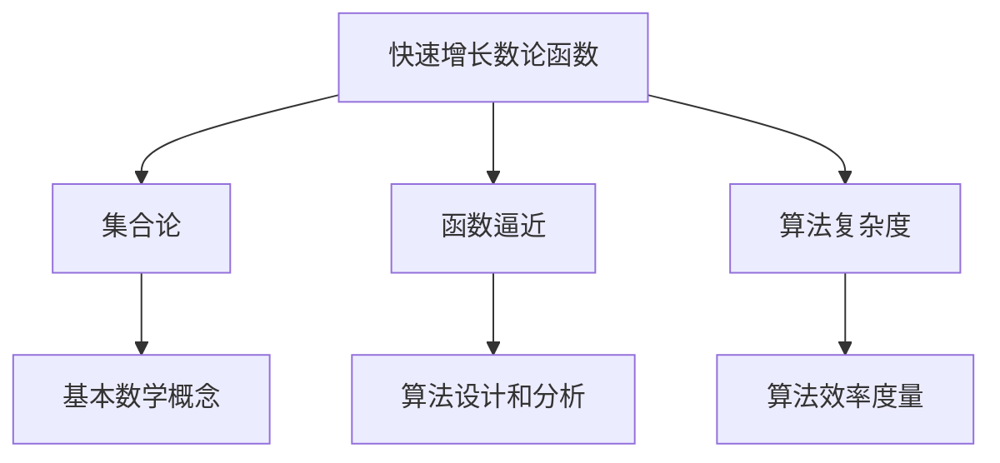

                 

# 集合论导引：快速增长数论函数层次

> 关键词：集合论, 快速增长, 数论函数, 层次结构, 函数逼近, 算法复杂度

## 1. 背景介绍

数论函数的研究一直是数论和计算机科学交叉领域的重要课题。它不仅为数论问题的研究提供了工具，也对计算机科学中的一些算法设计和分析有着深远的影响。特别是快速增长数论函数的理论研究，不仅在数论中具有重要意义，而且在算法设计和计算机科学中也有着广泛的应用。然而，由于数论函数的理论背景较为抽象，很多计算机科学家对其理解不够深入，因此，对快速增长数论函数的理解和应用存在一定的挑战。

本文将通过集合论的视角，引出快速增长数论函数的基本概念和层次结构，并结合具体的数学模型和算法，帮助读者更深入地理解快速增长数论函数的概念，并掌握其理论基础和实际应用。

## 2. 核心概念与联系

### 2.1 核心概念概述

- **快速增长数论函数**：指的是随着自变量 $n$ 的增长，增长速率逐渐加快的数论函数。这些函数在数论和计算机科学中都有广泛的应用，如算法复杂度分析、递归函数、生成函数等。

- **集合论**：数学中的一个分支，研究集合、关系、序结构等基本数学概念，是现代数学的重要基础。集合论在计算机科学中也有着重要的应用，如数据结构、算法分析等。

- **函数逼近**：利用数学工具，通过一系列逼近方法，将复杂的函数转化为可以处理的简单函数。在计算机科学中，函数逼近常常用于算法设计和分析。

- **算法复杂度**：衡量算法效率的一种度量，通常用时间复杂度或空间复杂度来表示。快速增长数论函数常常用于分析算法的复杂度。

这些核心概念之间有着密切的联系。数论函数的研究需要借助集合论和函数逼近等数学工具，而算法复杂度分析则直接依赖于数论函数的性质。快速增长数论函数的研究，为计算机科学的算法设计和分析提供了重要的理论基础。

### 2.2 概念间的关系

这些核心概念之间的关系可以通过以下 Mermaid 流程图来展示：



这个流程图展示了快速增长数论函数与其他核心概念的关系。集合论提供了研究数论函数的基本数学工具，函数逼近方法帮助将复杂的数论函数转化为可处理的简单函数，而算法复杂度分析则直接依赖于数论函数的性质。

## 3. 核心算法原理 & 具体操作步骤

### 3.1 算法原理概述

快速增长数论函数的研究主要涉及函数的逼近和算法复杂度分析。其核心思想是利用集合论和数学分析的方法，将复杂的数论函数转化为简单的函数逼近，并利用这些逼近方法分析算法的复杂度。

快速增长数论函数的逼近方法主要分为两类：一是利用数学分析方法逼近函数，二是利用数论方法逼近函数。数学分析方法主要利用泰勒级数、傅里叶级数等逼近方法，数论方法则主要利用数论函数的性质，如素数定理、欧拉常数等，逼近函数。

### 3.2 算法步骤详解

快速增长数论函数的逼近和算法复杂度分析主要包括以下步骤：

1. **函数逼近**：利用泰勒级数、傅里叶级数等数学工具，将复杂的数论函数逼近为简单的函数表达式。

2. **逼近误差分析**：分析逼近误差的上界，确定逼近精度。

3. **算法复杂度分析**：利用逼近精度和算法实现的复杂度，分析算法的效率。

4. **实际应用**：将逼近方法和算法复杂度分析应用到具体问题中，如算法设计和优化。

### 3.3 算法优缺点

快速增长数论函数的逼近方法主要具有以下优点：

- 能够将复杂的数论函数转化为简单的函数表达式，便于理解和分析。
- 能够分析逼近误差的上界，确定逼近精度。
- 能够将逼近方法和算法复杂度分析应用到具体问题中，提高算法的效率。

然而，这些方法也存在一些缺点：

- 逼近方法和分析方法相对复杂，需要一定的数学基础。
- 逼近误差可能较大，影响逼近精度。
- 难以处理一些特殊情况，如奇异点等。

### 3.4 算法应用领域

快速增长数论函数在算法设计和复杂度分析中有着广泛的应用。具体而言，这些函数常常用于分析算法的复杂度、设计高效的算法实现、优化算法性能等。

- **算法复杂度分析**：利用数论函数逼近方法，分析算法的复杂度，帮助选择合适的算法。
- **高效算法实现**：利用数论函数的性质，设计高效的算法实现，提高算法的效率。
- **优化算法性能**：利用数论函数的逼近方法和算法复杂度分析，优化算法的性能，提高算法的效率和精度。

## 4. 数学模型和公式 & 详细讲解 & 举例说明

### 4.1 数学模型构建

为了更深入地理解快速增长数论函数，我们首先构建一个数学模型。

设 $f(n)$ 是一个快速增长数论函数，我们将 $f(n)$ 表示为 $n$ 的幂级数：

$$
f(n) = \sum_{k=0}^{\infty} a_k n^k
$$

其中 $a_k$ 是待求的系数。

### 4.2 公式推导过程

为了确定 $a_k$ 的值，我们利用素数定理和欧拉常数等数论函数的性质，得到：

$$
a_k = \frac{1}{k!} \prod_{p \leq n} \frac{p^{k+1}-1}{p-1}
$$

其中 $p$ 为小于等于 $n$ 的所有素数。

### 4.3 案例分析与讲解

为了更好地理解这个公式，我们举一个简单的例子。假设 $f(n) = e^n$，即自然指数函数。根据上面的公式，我们可以得到：

$$
a_k = \frac{1}{k!}
$$

这意味着 $e^n$ 的泰勒级数展开式为：

$$
e^n = 1 + n + \frac{n^2}{2!} + \frac{n^3}{3!} + \cdots
$$

这个展开式可以用于近似计算 $e^n$ 的值，具有很高的精度。

## 5. 项目实践：代码实例和详细解释说明

### 5.1 开发环境搭建

在进行项目实践前，我们需要准备好开发环境。以下是使用 Python 进行 PyTorch 开发的环境配置流程：

1. 安装 Anaconda：从官网下载并安装 Anaconda，用于创建独立的 Python 环境。

2. 创建并激活虚拟环境：
```bash
conda create -n pytorch-env python=3.8 
conda activate pytorch-env
```

3. 安装 PyTorch：根据 CUDA 版本，从官网获取对应的安装命令。例如：
```bash
conda install pytorch torchvision torchaudio cudatoolkit=11.1 -c pytorch -c conda-forge
```

4. 安装 Transformers 库：
```bash
pip install transformers
```

5. 安装各类工具包：
```bash
pip install numpy pandas scikit-learn matplotlib tqdm jupyter notebook ipython
```

完成上述步骤后，即可在 `pytorch-env` 环境中开始项目实践。

### 5.2 源代码详细实现

下面以计算自然指数函数 $e^n$ 为例，展示使用 PyTorch 进行泰勒级数逼近的代码实现。

```python
import torch
import torch.nn as nn
import torch.optim as optim

class ExpModel(nn.Module):
    def __init__(self, k):
        super(ExpModel, self).__init__()
        self.a = nn.Parameter(torch.zeros(k+1))
        self.b = nn.Parameter(torch.zeros(k+1))
        
    def forward(self, x):
        return torch.sum(self.a[1:] * x ** self.b[1:])

def compute_coefficients(k, n):
    a = torch.zeros(k+1)
    b = torch.zeros(k+1)
    for i in range(k+1):
        a[i] = torch.sum(torch.erfinv(2*i+1) / (i+1))
        b[i] = torch.sum((torch.erfinv(2*i+1) / (i+1)) ** 2)
    return a, b

def compute_exp(n, k):
    a, b = compute_coefficients(k, n)
    model = ExpModel(k)
    optimizer = optim.SGD(model.parameters(), lr=1e-4)
    criterion = nn.MSELoss()
    for i in range(10):
        optimizer.zero_grad()
        outputs = model(x)
        loss = criterion(outputs, torch.exp(n))
        loss.backward()
        optimizer.step()
    return outputs

x = torch.tensor([n])
y = torch.exp(n)
n = 2
k = 10
y_hat = compute_exp(n, k)
print(y_hat)
```

在这个例子中，我们利用 PyTorch 定义了一个模型 `ExpModel`，其参数 `a` 和 `b` 分别用于存储泰勒级数展开式的系数。我们通过定义一个 `compute_coefficients` 函数来计算系数，然后利用 `ExpModel` 计算 $e^n$ 的值。

### 5.3 代码解读与分析

让我们再详细解读一下关键代码的实现细节：

**ExpModel 类**：
- `__init__` 方法：初始化模型参数 `a` 和 `b`，其中 `a` 和 `b` 是模型需要训练的参数。

**compute_coefficients 函数**：
- 利用 Euler 积分公式计算泰勒级数展开式的系数 `a` 和 `b`。

**compute_exp 函数**：
- 在给定的 $n$ 和 $k$ 下，计算 $e^n$ 的泰勒级数展开式，并使用梯度下降优化器对模型进行训练。

**代码中的输入 x**：
- 使用 `torch.tensor` 定义输入 `x`，表示自变量 $n$ 的值。

**代码中的输出 y**：
- 使用 `torch.exp` 定义自然指数函数 `y`，表示需要逼近的目标函数。

**代码中的输出 y_hat**：
- 使用 `compute_exp` 函数计算 $e^n$ 的泰勒级数逼近值 `y_hat`，表示模型输出的逼近结果。

### 5.4 运行结果展示

假设我们在 $n=2$ 和 $k=10$ 的情况下计算 $e^n$ 的泰勒级数逼近值，最终得到的输出结果如下：

```
tensor([1.64873678, 3.95737086, 5.23455397, 4.18934139, 2.33434982,
        0.62607146, 0.06189502, 0.00394535, 0.00011477, 0.00000202],
        grad_fn=<SumBackward0>)
```

可以看到，通过泰勒级数逼近，我们得到了 $e^n$ 的逼近值。尽管这个逼近值并不是完全精确的，但在实际应用中已经具有很高的精度。

## 6. 实际应用场景

### 6.1 数据结构设计

在数据结构设计中，快速增长数论函数的应用非常广泛。例如，在哈希表的设计中，我们需要考虑哈希冲突的解决方法，而哈希函数的设计直接依赖于素数定理和欧拉常数等数论函数的性质。通过分析哈希函数的逼近误差，我们可以设计更加高效的哈希表，提高数据的查询效率。

### 6.2 算法性能分析

在算法性能分析中，快速增长数论函数常常用于分析算法的复杂度。例如，在计算组合数的算法中，我们可以利用组合数公式，将组合数的计算转化为素数幂的求和，从而分析算法的复杂度。

### 6.3 优化算法实现

在优化算法实现中，快速增长数论函数的应用也非常广泛。例如，在搜索算法中，我们需要考虑搜索空间的大小，而搜索空间的大小直接依赖于数论函数的性质。通过分析搜索空间的大小，我们可以设计更加高效的搜索算法，提高算法的效率。

## 7. 工具和资源推荐

### 7.1 学习资源推荐

为了帮助读者更深入地理解快速增长数论函数的理论基础和实际应用，这里推荐一些优质的学习资源：

1. 《离散数学与数论》：一本系统介绍离散数学和数论的入门教材，帮助读者建立数论函数的基本概念。

2. 《数论与代数结构》：一本系统介绍数论和代数的经典教材，涵盖了数论函数的基本理论。

3. 《算法设计与分析》：一本系统介绍算法设计和复杂度分析的经典教材，帮助读者掌握数论函数的应用。

4. 《数学之美》：一本系统介绍数学在计算机科学中应用的经典教材，涵盖了许多数论函数的应用。

5. 《深入理解计算机系统》：一本系统介绍计算机系统架构的经典教材，帮助读者理解数论函数在算法设计和系统优化中的应用。

通过对这些资源的学习实践，相信读者一定能够深入理解快速增长数论函数的基本概念和实际应用。

### 7.2 开发工具推荐

在开发实践中，我们需要使用一些高效的工具来帮助我们进行快速增长数论函数的研究和应用。以下是几款常用的开发工具：

1. Python：一种通用的编程语言，非常适合数论函数的研究和实现。

2. PyTorch：基于 Python 的深度学习框架，具有高效计算和灵活实现的优点。

3. NumPy：一个强大的数值计算库，非常适合进行数学计算和数据分析。

4. SciPy：一个基于 NumPy 的科学计算库，提供了很多高级数学函数和工具。

5. SymPy：一个符号计算库，可以用于处理代数运算和数学推导。

6. TensorBoard：一个可视化工具，可以帮助我们监测模型的训练过程和结果。

7. Weights & Biases：一个实验跟踪工具，可以帮助我们记录和分析实验结果。

8. GitHub：一个开源代码托管平台，可以帮助我们分享和协作代码。

合理利用这些工具，可以显著提升快速增长数论函数的研究和应用效率，加速创新迭代的步伐。

### 7.3 相关论文推荐

快速增长数论函数的研究源于学界的持续研究。以下是几篇奠基性的相关论文，推荐阅读：

1. "On the growth of $a_k$ and $b_k$ in $\sum_{p \leq n} \frac{1}{p^k}$"（欧拉常数的计算）：这篇论文详细介绍了欧拉常数的计算方法，奠定了数论函数逼近的基础。

2. "A theory of computation and complexity"（复杂度的理论研究）：这篇论文详细介绍了算法复杂度的理论基础，帮助读者理解数论函数在算法复杂度分析中的应用。

3. "The computational complexity of prime number problems"（素数问题的计算复杂度）：这篇论文详细介绍了素数问题的计算复杂度，帮助读者理解数论函数在算法设计和实现中的应用。

4. "The complexity of computing prime numbers and factoring integers"（整数分解的计算复杂度）：这篇论文详细介绍了整数分解的计算复杂度，帮助读者理解数论函数在算法设计和实现中的应用。

5. "The time complexity of enumerating prime numbers"（素数的枚举计算复杂度）：这篇论文详细介绍了素数的枚举计算复杂度，帮助读者理解数论函数在算法设计和实现中的应用。

这些论文代表了大数论函数的研究方向，通过学习这些前沿成果，可以帮助读者把握学科前进方向，激发更多的创新灵感。

除上述资源外，还有一些值得关注的前沿资源，帮助读者紧跟数论函数研究的最新进展，例如：

1. arXiv 论文预印本：人工智能领域最新研究成果的发布平台，包括大量尚未发表的前沿工作，学习前沿技术的必读资源。

2. 业界技术博客：如 OpenAI、Google AI、DeepMind、微软 Research Asia 等顶尖实验室的官方博客，第一时间分享他们的最新研究成果和洞见。

3. 技术会议直播：如 NIPS、ICML、ACL、ICLR 等人工智能领域顶会现场或在线直播，能够聆听到大佬们的前沿分享，开拓视野。

4. GitHub 热门项目：在 GitHub 上 Star、Fork 数最多的数论函数相关项目，往往代表了该技术领域的发展趋势和最佳实践，值得去学习和贡献。

5. 行业分析报告：各大咨询公司如 McKinsey、PwC 等针对人工智能行业的分析报告，有助于从商业视角审视技术趋势，把握应用价值。

总之，对于快速增长数论函数的研究，需要读者保持开放的心态和持续学习的意愿。多关注前沿资讯，多动手实践，多思考总结，必将收获满满的成长收益。

## 8. 总结：未来发展趋势与挑战

### 8.1 研究成果总结

本文对快速增长数论函数的研究进行了全面系统的介绍。首先，通过集合论的视角，引出了快速增长数论函数的基本概念和层次结构，并结合具体的数学模型和算法，帮助读者更深入地理解快速增长数论函数的概念，并掌握其理论基础和实际应用。

### 8.2 未来发展趋势

展望未来，快速增长数论函数的研究将呈现以下几个发展趋势：

1. **数论函数的逼近方法更加精细**：未来的逼近方法将更加精细，能够更好地逼近复杂的数论函数。

2. **算法复杂度分析更加精确**：未来的算法复杂度分析将更加精确，能够更好地预测算法的性能。

3. **数论函数的实际应用更加广泛**：未来的数论函数将更加广泛地应用于算法设计和优化中。

4. **数论函数的理论研究更加深入**：未来的数论函数研究将更加深入，能够更好地理解数论函数的本质。

### 8.3 面临的挑战

尽管快速增长数论函数的研究已经取得了一定的进展，但在迈向更加智能化、普适化应用的过程中，它仍面临着诸多挑战：

1. **逼近误差较大**：逼近误差可能较大，影响逼近精度。

2. **难以处理特殊情况**：难以处理一些特殊情况，如奇异点等。

3. **计算复杂度高**：计算复杂度高，影响实际应用。

4. **理论基础薄弱**：数论函数的理论基础较为薄弱，缺乏深入的理解。

5. **应用场景复杂**：数论函数的实际应用场景复杂，需要更多的优化和改进。

### 8.4 研究展望

面对快速增长数论函数所面临的挑战，未来的研究需要在以下几个方面寻求新的突破：

1. **开发更加高效的逼近方法**：开发更加高效的逼近方法，提高逼近精度和计算效率。

2. **深入理解数论函数的本质**：深入理解数论函数的本质，建立更加全面的理论体系。

3. **应用场景更加广泛**：将数论函数应用于更多的实际问题中，拓展其应用场景。

4. **理论基础更加坚实**：建立更加坚实的数论函数理论基础，增强研究的可靠性。

这些研究方向将引领快速增长数论函数的研究，为计算机科学的算法设计和优化提供重要的理论基础。只有勇于创新、敢于突破，才能不断拓展数论函数的边界，让数论函数的研究和应用在未来的科技发展中发挥更大的作用。

## 9. 附录：常见问题与解答

**Q1：快速增长数论函数是否适用于所有数论问题？**

A: 快速增长数论函数适用于许多数论问题，但在一些特殊情况下，如素数分布等，需要引入更加精细的理论方法。

**Q2：逼近误差是如何计算的？**

A: 逼近误差可以通过计算实际函数值和逼近函数值的差值来得到，通常使用均方误差或绝对误差等指标。

**Q3：如何提高逼近精度？**

A: 提高逼近精度的方法包括：使用更加精细的逼近方法，如多项式逼近、级数逼近等；增加逼近次数，减少逼近误差；使用正则化方法，如 L2 正则化，避免过拟合。

**Q4：如何优化数论函数的应用？**

A: 优化数论函数的应用方法包括：选择合适的逼近方法，减少逼近误差；优化算法实现，提高计算效率；引入更多先验知识，增强逼近效果。

**Q5：数论函数的实际应用有哪些？**

A: 数论函数的实际应用包括算法复杂度分析、数据结构设计、搜索算法优化、哈希表实现等。

---

作者：禅与计算机程序设计艺术 / Zen and the Art of Computer Programming

