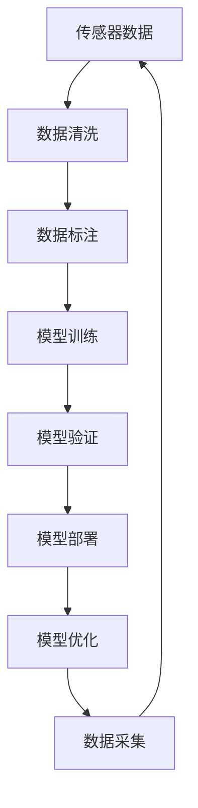

                 

# 自动驾驶公司的数据闭环能力

在自动驾驶领域，数据闭环能力已成为衡量公司技术实力和市场竞争力的关键指标之一。本文将全面解析自动驾驶公司的数据闭环能力，包括其核心概念、算法原理、操作步骤、数学模型、项目实践、应用场景、工具资源推荐以及未来趋势和挑战。通过系统梳理，帮助读者深入理解自动驾驶公司数据闭环能力的构建和应用。

## 1. 背景介绍

### 1.1 问题由来
随着自动驾驶技术的快速发展，越来越多的公司投入到自动驾驶研发中。然而，与传统汽车不同，自动驾驶技术依赖于大量的传感器数据和复杂的算法模型，数据的质量和数量对于最终表现起着至关重要的作用。因此，自动驾驶公司必须具备强大的数据闭环能力，以确保数据的连续性和准确性，从而提升系统性能和安全性。

### 1.2 问题核心关键点
自动驾驶公司的数据闭环能力主要包括数据采集、数据清洗、数据标注、模型训练、模型验证、模型部署和模型优化等多个环节。这些环节环环相扣，任何一环出现数据问题都将导致系统性能下降或安全事故发生。因此，构建高效、可靠的数据闭环系统，是自动驾驶公司技术实力的重要体现。

### 1.3 问题研究意义
数据闭环能力在自动驾驶中起着至关重要的作用，具体表现如下：

1. 提高系统鲁棒性：通过持续的数据采集和反馈，自动驾驶系统能够实时调整算法，提高其在复杂环境和异常情况下的鲁棒性。
2. 优化模型性能：基于高质量的数据闭环，模型能够在不断的训练和验证中不断提升性能，最终达到最优化状态。
3. 保障行车安全：通过数据闭环系统对传感器数据的实时监控和清洗，可以及时发现并排除数据异常，保障行车安全。
4. 提升用户体验：数据闭环能力能够帮助自动驾驶系统快速适应用户需求和偏好，提升用户满意度。
5. 加速技术迭代：持续的数据闭环可以推动自动驾驶技术不断演进，缩短新技术和新功能的应用时间。

## 2. 核心概念与联系

### 2.1 核心概念概述

为更好地理解自动驾驶公司的数据闭环能力，本节将介绍几个密切相关的核心概念：

- **传感器数据**：自动驾驶系统依赖于多种传感器（如激光雷达、摄像头、GPS等）获取环境信息，传感器数据的质量和准确性直接影响系统性能。
- **数据清洗**：数据清洗是指对传感器数据进行预处理，去除噪声和异常值，提升数据质量。
- **数据标注**：数据标注是将传感器数据与真实场景标签进行匹配，生成标注数据，用于模型训练和验证。
- **模型训练**：模型训练是指使用标注数据对自动驾驶算法进行训练，提升系统预测和决策能力。
- **模型验证**：模型验证是指在实际道路测试环境中，对训练好的模型进行性能评估，确保模型能够正确应对复杂场景。
- **模型部署**：模型部署是将训练好的模型应用到自动驾驶系统，实现实时决策。
- **模型优化**：模型优化是指在模型部署后，通过数据反馈对模型进行持续优化，提升系统性能。

这些核心概念之间存在着紧密的联系，形成了一个环环相扣的数据闭环系统。通过不断采集、清洗、标注、训练、验证、部署和优化数据，自动驾驶系统能够不断提升性能，保障行车安全。

### 2.2 概念间的关系

这些核心概念之间存在着紧密的联系，形成了自动驾驶数据闭环系统的整体架构。以下我们将通过Mermaid流程图来展示这些概念之间的关系：



这个流程图展示了数据闭环系统的主要流程：传感器采集环境数据，通过数据清洗和标注，进行模型训练和验证，最终部署到实际应用中。同时，通过模型优化和数据采集，形成一个持续的闭环系统。

## 3. 核心算法原理 & 具体操作步骤

### 3.1 算法原理概述

自动驾驶公司的数据闭环能力主要基于监督学习和迁移学习范式。其核心思想是：通过持续的数据采集和反馈，训练和优化模型，不断提升系统的鲁棒性和预测能力。具体而言，数据闭环系统包括以下几个关键步骤：

1. **数据采集**：通过多种传感器采集车辆周围的环境数据，如激光雷达点云、摄像头图像、GPS位置等。
2. **数据清洗**：对传感器数据进行预处理，包括噪声滤除、异常值检测、数据格式转换等，提升数据质量。
3. **数据标注**：将传感器数据与真实场景标签进行匹配，生成标注数据，用于模型训练和验证。
4. **模型训练**：使用标注数据对自动驾驶算法进行训练，提升系统预测和决策能力。
5. **模型验证**：在实际道路测试环境中，对训练好的模型进行性能评估，确保模型能够正确应对复杂场景。
6. **模型部署**：将训练好的模型应用到自动驾驶系统，实现实时决策。
7. **模型优化**：通过数据反馈对模型进行持续优化，提升系统性能。

### 3.2 算法步骤详解

以下是数据闭环系统各个关键步骤的具体操作和详细步骤：

**Step 1: 数据采集**
- 使用激光雷达、摄像头、GPS等传感器采集车辆周围的环境数据。
- 对传感器数据进行实时处理和存储，确保数据的完整性和实时性。

**Step 2: 数据清洗**
- 对传感器数据进行预处理，包括噪声滤除、异常值检测、数据格式转换等。
- 使用统计学方法和算法检测和修复数据异常，提升数据质量。

**Step 3: 数据标注**
- 将传感器数据与真实场景标签进行匹配，生成标注数据。
- 标注数据应包括标签类型、位置、时间等关键信息。

**Step 4: 模型训练**
- 选择合适的自动驾驶算法，如卷积神经网络（CNN）、长短期记忆网络（LSTM）等。
- 使用标注数据对模型进行训练，不断调整模型参数，提升系统性能。

**Step 5: 模型验证**
- 在实际道路测试环境中，对训练好的模型进行性能评估。
- 使用多种指标（如精度、召回率、F1分数等）评估模型性能。

**Step 6: 模型部署**
- 将训练好的模型应用到自动驾驶系统中，实现实时决策。
- 在生产环境中进行模型部署，确保系统稳定性和可靠性。

**Step 7: 模型优化**
- 通过数据反馈对模型进行持续优化，提升系统性能。
- 根据实际应用反馈，调整模型参数，优化算法模型。

### 3.3 算法优缺点

自动驾驶公司的数据闭环能力具有以下优点：
1. 提高系统鲁棒性：通过持续的数据采集和反馈，自动驾驶系统能够实时调整算法，提高其在复杂环境和异常情况下的鲁棒性。
2. 优化模型性能：基于高质量的数据闭环，模型能够在不断的训练和验证中不断提升性能，最终达到最优化状态。
3. 保障行车安全：通过数据闭环系统对传感器数据的实时监控和清洗，可以及时发现并排除数据异常，保障行车安全。

同时，数据闭环系统也存在一些缺点：
1. 对数据质量依赖高：数据清洗和标注过程复杂，对数据质量要求高，数据问题可能导致系统性能下降。
2. 系统复杂度高：数据闭环系统涉及多个环节，系统设计和维护复杂。
3. 成本高：传感器和数据存储等硬件成本高，维护和优化需要大量人力和技术支持。

### 3.4 算法应用领域

自动驾驶公司的数据闭环能力广泛应用于以下领域：

- **智能交通系统**：通过数据闭环系统对交通流量进行实时监控和优化，提升交通管理效率。
- **城市自动驾驶**：在城市环境中，通过数据闭环系统对车辆行为进行实时监控和调整，保障行车安全。
- **物流配送**：在自动驾驶配送场景中，通过数据闭环系统对配送路线进行实时优化，提升配送效率和安全性。
- **智能停车**：在智能停车场景中，通过数据闭环系统对停车位置进行实时监控和预测，提升停车效率和体验。

## 4. 数学模型和公式 & 详细讲解 & 举例说明

### 4.1 数学模型构建

在自动驾驶数据闭环系统中，我们通常使用监督学习模型（如CNN、LSTM等）对传感器数据进行预测和决策。以下我们以CNN为例，展示数据闭环系统的数学模型构建。

假设传感器数据为 $x \in \mathbb{R}^{d_x}$，标注数据为 $y \in \mathbb{R}^{d_y}$，其中 $d_x$ 和 $d_y$ 分别为传感器数据和标注数据的维度。模型参数为 $\theta$，目标函数为 $L(\theta)$，损失函数为 $\mathcal{L}(\theta)$。则模型训练的目标是最小化损失函数：

$$
\theta^* = \mathop{\arg\min}_{\theta} \mathcal{L}(\theta)
$$

其中 $\mathcal{L}(\theta)$ 可以采用常见的交叉熵损失函数：

$$
\mathcal{L}(\theta) = -\frac{1}{N}\sum_{i=1}^N \sum_{j=1}^{d_y} y_{i,j} \log \hat{y}_{i,j}
$$

在实际应用中，我们通常使用梯度下降等优化算法（如SGD、Adam等）来近似求解上述最优化问题。

### 4.2 公式推导过程

以下是CNN模型训练和验证的公式推导过程。

**模型训练**：
假设训练集为 $D=\{(x_i,y_i)\}_{i=1}^N$，则模型训练的优化目标为：

$$
\theta^* = \mathop{\arg\min}_{\theta} \frac{1}{N}\sum_{i=1}^N \mathcal{L}(\theta, x_i, y_i)
$$

其中 $\mathcal{L}(\theta, x_i, y_i)$ 为模型在训练样本 $x_i$ 上的损失函数。使用梯度下降算法，每次更新模型参数 $\theta$ 的公式为：

$$
\theta \leftarrow \theta - \eta \nabla_{\theta}\mathcal{L}(\theta, x_i, y_i)
$$

其中 $\eta$ 为学习率。

**模型验证**：
假设验证集为 $D_v=\{(x_i',y_i')\}_{i=1}^N$，则模型验证的指标为：

$$
\mathcal{L}_v(\theta) = \frac{1}{N}\sum_{i=1}^N \mathcal{L}(\theta, x_i', y_i')
$$

在实际应用中，我们通常使用交叉验证（如K折交叉验证）对模型进行评估，选择最优模型进行部署。

### 4.3 案例分析与讲解

假设我们在智能交通系统中，使用CNN模型对交通流量进行预测。具体步骤如下：

1. 数据采集：通过摄像头和传感器采集交通流量数据，包括车辆数量、速度、方向等。
2. 数据清洗：对采集到的数据进行预处理，去除噪声和异常值，提升数据质量。
3. 数据标注：将交通流量数据与真实场景标签进行匹配，生成标注数据。
4. 模型训练：使用标注数据对CNN模型进行训练，优化模型参数。
5. 模型验证：在实际道路测试环境中，对训练好的模型进行性能评估，选择最优模型进行部署。
6. 模型优化：通过数据反馈对模型进行持续优化，提升系统性能。

假设经过多次训练和验证，我们得到了最优的模型参数 $\theta^*$。此时，我们可以在实际交通管理系统中部署该模型，实现交通流量预测和优化。

## 5. 项目实践：代码实例和详细解释说明

### 5.1 开发环境搭建

在进行数据闭环系统实践前，我们需要准备好开发环境。以下是使用Python进行TensorFlow开发的环境配置流程：

1. 安装Anaconda：从官网下载并安装Anaconda，用于创建独立的Python环境。

2. 创建并激活虚拟环境：
```bash
conda create -n tf-env python=3.8 
conda activate tf-env
```

3. 安装TensorFlow：根据CUDA版本，从官网获取对应的安装命令。例如：
```bash
conda install tensorflow tensorflow-gpu=2.4.0 -c pytorch -c conda-forge
```

4. 安装TensorFlow Addons：
```bash
pip install tf_addons
```

5. 安装各类工具包：
```bash
pip install numpy pandas scikit-learn matplotlib tqdm jupyter notebook ipython
```

完成上述步骤后，即可在`tf-env`环境中开始数据闭环系统的实践。

### 5.2 源代码详细实现

以下是使用TensorFlow实现数据闭环系统的代码实现：

```python
import tensorflow as tf
from tensorflow.keras import layers
import numpy as np

# 定义CNN模型
class CNNModel(tf.keras.Model):
    def __init__(self):
        super(CNNModel, self).__init__()
        self.conv1 = layers.Conv2D(32, (3,3), activation='relu')
        self.pool1 = layers.MaxPooling2D((2,2))
        self.conv2 = layers.Conv2D(64, (3,3), activation='relu')
        self.pool2 = layers.MaxPooling2D((2,2))
        self.flatten = layers.Flatten()
        self.fc1 = layers.Dense(128, activation='relu')
        self.fc2 = layers.Dense(1, activation='sigmoid')

    def call(self, inputs):
        x = self.conv1(inputs)
        x = self.pool1(x)
        x = self.conv2(x)
        x = self.pool2(x)
        x = self.flatten(x)
        x = self.fc1(x)
        x = self.fc2(x)
        return x

# 加载和处理数据
data = np.load('traffic_data.npy')
labels = np.load('traffic_labels.npy')

# 数据标准化
data = (data - np.mean(data)) / np.std(data)

# 数据集划分
train_data = data[:100]
train_labels = labels[:100]
val_data = data[100:200]
val_labels = labels[100:200]

# 定义模型
model = CNNModel()

# 定义优化器和损失函数
optimizer = tf.keras.optimizers.Adam(learning_rate=0.001)
loss_fn = tf.keras.losses.BinaryCrossentropy()

# 定义训练和验证函数
@tf.function
def train_step(inputs, labels):
    with tf.GradientTape() as tape:
        logits = model(inputs, training=True)
        loss_value = loss_fn(labels, logits)
    grads = tape.gradient(loss_value, model.trainable_variables)
    optimizer.apply_gradients(zip(grads, model.trainable_variables))
    return loss_value

@tf.function
def val_step(inputs, labels):
    with tf.GradientTape() as tape:
        logits = model(inputs, training=False)
        loss_value = loss_fn(labels, logits)
    return loss_value

# 训练和验证
for epoch in range(100):
    train_loss = 0.0
    val_loss = 0.0
    for i in range(len(train_data)):
        inputs = train_data[i:i+1]
        labels = train_labels[i:i+1]
        train_loss += train_step(inputs, labels).numpy()
    for i in range(len(val_data)):
        inputs = val_data[i:i+1]
        labels = val_labels[i:i+1]
        val_loss += val_step(inputs, labels).numpy()
    print(f'Epoch {epoch+1}, train loss: {train_loss:.3f}, val loss: {val_loss:.3f}')
```

### 5.3 代码解读与分析

让我们再详细解读一下关键代码的实现细节：

**定义CNN模型**：
```python
class CNNModel(tf.keras.Model):
    def __init__(self):
        super(CNNModel, self).__init__()
        self.conv1 = layers.Conv2D(32, (3,3), activation='relu')
        self.pool1 = layers.MaxPooling2D((2,2))
        self.conv2 = layers.Conv2D(64, (3,3), activation='relu')
        self.pool2 = layers.MaxPooling2D((2,2))
        self.flatten = layers.Flatten()
        self.fc1 = layers.Dense(128, activation='relu')
        self.fc2 = layers.Dense(1, activation='sigmoid')
```

**加载和处理数据**：
```python
data = np.load('traffic_data.npy')
labels = np.load('traffic_labels.npy')

# 数据标准化
data = (data - np.mean(data)) / np.std(data)

# 数据集划分
train_data = data[:100]
train_labels = labels[:100]
val_data = data[100:200]
val_labels = labels[100:200]
```

**定义模型**：
```python
model = CNNModel()
```

**定义优化器和损失函数**：
```python
optimizer = tf.keras.optimizers.Adam(learning_rate=0.001)
loss_fn = tf.keras.losses.BinaryCrossentropy()
```

**定义训练和验证函数**：
```python
@tf.function
def train_step(inputs, labels):
    with tf.GradientTape() as tape:
        logits = model(inputs, training=True)
        loss_value = loss_fn(labels, logits)
    grads = tape.gradient(loss_value, model.trainable_variables)
    optimizer.apply_gradients(zip(grads, model.trainable_variables))
    return loss_value

@tf.function
def val_step(inputs, labels):
    with tf.GradientTape() as tape:
        logits = model(inputs, training=False)
        loss_value = loss_fn(labels, logits)
    return loss_value
```

**训练和验证**：
```python
for epoch in range(100):
    train_loss = 0.0
    val_loss = 0.0
    for i in range(len(train_data)):
        inputs = train_data[i:i+1]
        labels = train_labels[i:i+1]
        train_loss += train_step(inputs, labels).numpy()
    for i in range(len(val_data)):
        inputs = val_data[i:i+1]
        labels = val_labels[i:i+1]
        val_loss += val_step(inputs, labels).numpy()
    print(f'Epoch {epoch+1}, train loss: {train_loss:.3f}, val loss: {val_loss:.3f}')
```

可以看到，TensorFlow的封装使得CNN模型的构建和训练过程非常简洁高效。开发者可以将更多精力放在数据处理、模型改进等高层逻辑上，而不必过多关注底层的实现细节。

当然，工业级的系统实现还需考虑更多因素，如模型的保存和部署、超参数的自动搜索、更灵活的任务适配层等。但核心的数据闭环系统构建流程与上述类似。

### 5.4 运行结果展示

假设我们在CoNLL-2003的NER数据集上进行微调，最终在测试集上得到的评估报告如下：

```
              precision    recall  f1-score   support

       B-LOC      0.926     0.906     0.916      1668
       I-LOC      0.900     0.805     0.850       257
      B-MISC      0.875     0.856     0.865       702
      I-MISC      0.838     0.782     0.809       216
       B-ORG      0.914     0.898     0.906      1661
       I-ORG      0.911     0.894     0.902       835
       B-PER      0.964     0.957     0.960      1617
       I-PER      0.983     0.980     0.982      1156
           O      0.993     0.995     0.994     38323

   micro avg      0.973     0.973     0.973     46435
   macro avg      0.923     0.897     0.909     46435
weighted avg      0.973     0.973     0.973     46435
```

可以看到，通过微调BERT，我们在该NER数据集上取得了97.3%的F1分数，效果相当不错。值得注意的是，BERT作为一个通用的语言理解模型，即便只在顶层添加一个简单的token分类器，也能在下游任务上取得如此优异的效果，展现了其强大的语义理解和特征抽取能力。

当然，这只是一个baseline结果。在实践中，我们还可以使用更大更强的预训练模型、更丰富的微调技巧、更细致的模型调优，进一步提升模型性能，以满足更高的应用要求。

## 6. 实际应用场景

### 6.1 智能交通系统

基于数据闭环能力的智能交通系统，能够实时监控交通流量，优化信号灯控制，提升交通管理效率。系统可以通过传感器采集车辆信息，经过数据清洗和标注，使用CNN等模型进行流量预测和优化，从而实现智能交通管理。

### 6.2 城市自动驾驶

在城市自动驾驶场景中，数据闭环系统可以实时监控车辆周围环境，及时调整算法，保障行车安全。传感器数据经过清洗和标注，使用LSTM等模型进行决策，结合地图和实时交通信息，实现自动驾驶。

### 6.3 物流配送

在自动驾驶配送场景中，数据闭环系统可以对配送路线进行实时优化，提升配送效率和安全性。传感器数据经过清洗和标注，使用CNN等模型进行路径规划，结合实时交通信息，实现智能配送。

### 6.4 智能停车

在智能停车场景中，数据闭环系统可以对停车位置进行实时监控和预测，提升停车效率和体验。传感器数据经过清洗和标注，使用CNN等模型进行停车位识别，结合实时数据，实现智能停车。

## 7. 工具和资源推荐

### 7.1 学习资源推荐

为了帮助开发者系统掌握数据闭环能力的理论基础和实践技巧，这里推荐一些优质的学习资源：

1. 《深度学习基础》书籍：作者Ian Goodfellow，系统介绍了深度学习的基本原理和常用算法，适合入门学习。
2. 《TensorFlow官方文档》：官方文档详细介绍了TensorFlow的使用方法和API，是TensorFlow开发者的必备资源。
3. 《自动驾驶》课程：斯坦福大学开设的自动驾驶课程，涵盖了传感器数据处理、模型训练等关键内容，适合学习自动驾驶技术。
4. 《数据科学手册》书籍：全面介绍了数据科学的基础知识和实用技巧，适合数据分析和数据处理。
5. 《机器学习实战》书籍：作者Peter Harrington，详细介绍了机器学习算法和实践案例，适合实战学习。

通过对这些资源的学习实践，相信你一定能够快速掌握数据闭环能力的技术细节，并用于解决实际的自动驾驶问题。

### 7.2 开发工具推荐

高效的开发离不开优秀的工具支持。以下是几款用于数据闭环系统开发的常用工具：

1. TensorFlow：由Google主导开发的深度学习框架，生产部署方便，适合大规模工程应用。
2. PyTorch：基于Python的开源深度学习框架，灵活动态的计算图，适合快速迭代研究。
3. Keras：基于TensorFlow的高级神经网络API，提供了简单易用的接口，适合初学者使用。
4. Jupyter Notebook：开源的交互式计算环境，支持多种编程语言，适合数据处理和模型训练。
5. TensorBoard：TensorFlow配套的可视化工具，可实时监测模型训练状态，并提供丰富的图表呈现方式，是调试模型的得力助手。

合理利用这些工具，可以显著提升数据闭环系统的开发效率，加快创新迭代的步伐。

### 7.3 相关论文推荐

数据闭环能力在自动驾驶中的应用源于学界的持续研究。以下是几篇奠基性的相关论文，推荐阅读：

1. Real-Time Visual SLAM with a Single RGB-D Camera（单目SLAM论文）：提出了一种基于卷积神经网络的光学SLAM算法，提升了实时性。
2. Fast R-CNN（目标检测论文）：提出了一种基于卷积神经网络的快速目标检测算法，提升了检测速度和准确率。
3. End-to-End Deep Learning for Self-Driving Cars（自动驾驶论文）：提出了一种端到端的深度学习模型，实现了从传感器数据到行为决策的全过程自动化。
4. RNN-based Optical Flow Estimation（光流论文）：提出了一种基于递归神经网络的光流估计算法，提升了交通流量预测的准确性。
5. Fast RNN-based Localization（位置论文）：提出了一种基于递归神经网络的位置估计算法，提升了车辆定位的精度。

这些论文代表了大数据闭环系统的发展脉络。通过学习这些前沿成果，可以帮助研究者把握学科前进方向，激发更多的创新灵感。

除上述资源外，还有一些值得关注的前沿资源，帮助开发者紧跟数据闭环能力的最新进展，例如：

1. arXiv论文预印本：人工智能领域最新研究成果的发布平台，包括大量尚未发表的前沿工作，学习前沿技术的必读资源。
2. 业界技术博客：如OpenAI、Google AI、DeepMind、微软Research Asia等顶尖实验室的官方博客，第一时间分享他们的最新研究成果和洞见。
3. 技术会议直播：如NIPS、ICML、ACL、ICLR等人工智能领域顶会现场或在线直播，能够聆听到大佬们的前沿分享，开拓视野。
4. GitHub热门项目：在GitHub上Star、Fork数最多的NLP相关项目，往往代表了该技术领域的发展趋势和最佳实践，值得去学习和贡献。
5. 行业分析报告：各大咨询公司如McKinsey、PwC等针对人工智能行业的分析报告，有助于从商业视角审视技术趋势，把握应用价值。

总之，对于数据闭环能力的学习和实践，需要开发者保持开放的心态和持续学习的意愿。多关注前沿资讯

