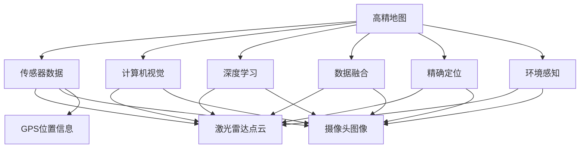
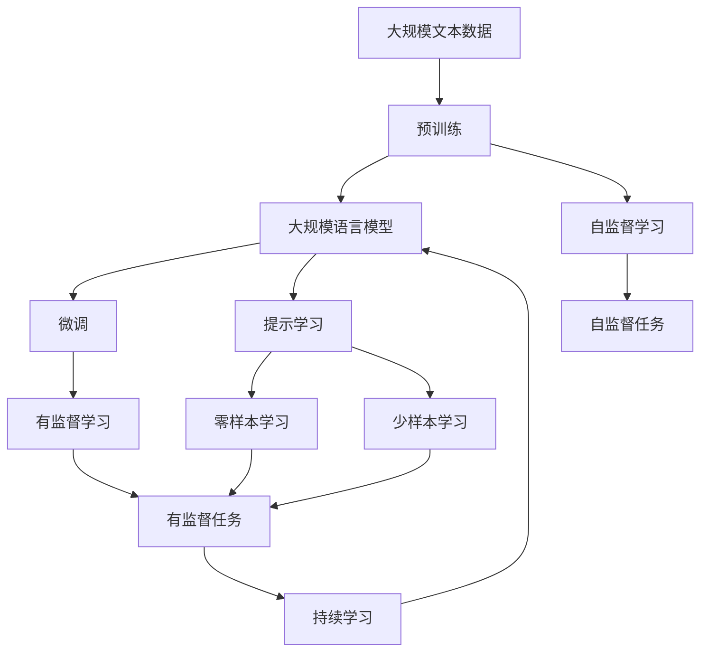

                 

# 自动驾驶高精地图构建与应用的研究现状与挑战

> 关键词：自动驾驶,高精地图,高分辨率,激光雷达,计算机视觉,深度学习,数据融合,精确定位,环境感知,实时更新

## 1. 背景介绍

### 1.1 问题由来

自动驾驶技术作为现代智能交通的核心驱动力之一，已经成为众多科技公司和传统汽车制造商争相布局的热门领域。高精地图作为自动驾驶系统的重要组成部分，其精度和实效性直接影响着车辆的安全性和驾驶性能。

高精地图包含了道路、交通信号、建筑、障碍物等元素的精确位置和形态信息，以及详细的车道线、交通标志等交通要素。不同于传统的地图，高精地图的分辨率极高，可达到0.1米以下，能够提供高精度的实时定位和环境感知。

高精地图不仅对车辆在复杂环境中的导航和路径规划起到关键作用，还能显著提高车辆的安全性和交通效率。近年来，随着计算机视觉、深度学习、数据融合等技术的发展，高精地图的构建和应用逐渐成为自动驾驶技术的一个重要研究方向。

### 1.2 问题核心关键点

自动驾驶高精地图的构建与应用主要涉及以下几个关键问题：

1. **高分辨率地图构建**：如何高效、准确地从传感器数据中提取道路、车道、障碍物等高分辨率信息，构建高精度的地图。
2. **实时地图更新**：如何实现高精地图的实时更新，适应快速变化的交通环境。
3. **数据融合技术**：如何将不同类型传感器（如激光雷达、相机、GPS等）的数据进行融合，提高地图的精度和完整性。
4. **环境感知能力**：如何利用高精地图和传感器数据，提升车辆对环境的感知能力，实现精准定位和避障。
5. **模型优化与训练**：如何优化高精地图构建与应用的算法模型，提升系统性能和鲁棒性。

这些问题的解决对于自动驾驶技术的普及和应用具有重要意义。

### 1.3 问题研究意义

高精地图在自动驾驶中的应用，对提升交通安全、提高驾驶效率、降低交通事故等具有显著效果。通过高精地图，车辆能够实时获取道路环境信息，进行精确导航和路径规划，减少对人类司机的依赖。

高精地图的应用还涉及到智慧城市建设、智能物流、交通运输等多个领域，具有广阔的市场前景和应用价值。因此，研究高精地图的构建与应用，对于推动自动驾驶技术的发展和普及，具有重要的理论和实践意义。

## 2. 核心概念与联系

### 2.1 核心概念概述

为更好地理解自动驾驶高精地图的构建与应用，本节将介绍几个关键概念：

1. **高精地图**：一种高分辨率、高精度的地图，包含详细的道路、交通标志、障碍物等元素信息，以及详细的车道线和交通要素。

2. **传感器数据**：用于高精地图构建的各类传感器数据，包括激光雷达点云、摄像头图像、GPS位置信息等。

3. **计算机视觉**：通过图像处理和特征提取，实现对图像内容的理解和分析，是高精地图构建的重要手段。

4. **深度学习**：利用深度神经网络模型，对传感器数据进行处理和分析，提升高精地图构建的精度和效率。

5. **数据融合**：将不同传感器获取的数据进行融合，提高高精地图的完整性和准确性。

6. **精确定位**：利用高精地图和传感器数据，实现车辆的精确位置确定和导航。

7. **环境感知**：通过高精地图和传感器数据，实现对道路环境的全方位感知，提升车辆的安全性和驾驶性能。

8. **实时更新**：高精地图需要定期进行更新，以适应交通环境的变化。

这些概念之间存在着紧密的联系，构成了高精地图构建与应用的完整生态系统。通过理解这些核心概念，我们可以更好地把握高精地图的构建方法与技术应用。

### 2.2 概念间的关系

这些核心概念之间的关系可以用以下Mermaid流程图来展示：



这个流程图展示了大规模语言模型微调的几种主要学习范式：预训练、微调和提示学习。预训练主要采用自监督学习方法，而微调则是有监督学习的过程。提示学习可以实现零样本和少样本学习。微调又可以分为全参数微调和参数高效微调两种方式。

### 2.3 核心概念的整体架构

最后，我们用一个综合的流程图来展示这些核心概念在大规模语言模型微调过程中的整体架构：



这个综合流程图展示了从预训练到微调，再到持续学习的完整过程。大规模语言模型首先在大规模文本数据上进行预训练，然后通过微调（包括全参数微调和参数高效微调两种方式）或提示学习（包括零样本和少样本学习）来适应下游任务。最后，通过持续学习技术，模型可以不断更新和适应新的任务和数据。 通过这些流程图，我们可以更清晰地理解大规模语言模型微调过程中各个核心概念的关系和作用，为后续深入讨论具体的微调方法和技术奠定基础。

## 3. 核心算法原理 & 具体操作步骤

### 3.1 算法原理概述

自动驾驶高精地图的构建与应用，本质上是将传感器数据进行处理和分析，构建高精度的地图，并利用地图信息进行环境感知和精确定位。

形式化地，假设车辆配备的传感器数据集为 $D=\{(x_i, y_i)\}_{i=1}^N$，其中 $x_i$ 为传感器数据，$y_i$ 为对应的标签或元数据。高精地图构建的目标是找到最优的映射函数 $f: D \rightarrow M$，其中 $M$ 表示高精地图，即 $M = f(D)$。

高精地图的构建过程包括数据预处理、特征提取、模型训练和输出映射等步骤。其中，数据预处理涉及对传感器数据的校正和清洗，特征提取利用计算机视觉和深度学习技术，模型训练采用监督或非监督学习算法，输出映射将模型结果转换为高精地图的可视化表示。

### 3.2 算法步骤详解

高精地图构建的一般流程如下：

**Step 1: 数据预处理**
- 对传感器数据进行校正、滤波和归一化，去除异常值和噪声。
- 对摄像头图像进行校正和校准，提高图像质量。
- 对激光雷达数据进行分割和拼接，生成完整的点云数据。
- 对GPS位置信息进行校正和整合，确保位置数据的准确性。

**Step 2: 特征提取**
- 利用计算机视觉技术，对摄像头图像进行语义分割，提取出道路、车道、交通标志等元素。
- 利用深度学习模型，对激光雷达点云进行特征提取，提取出道路结构、障碍物等详细信息。
- 对多源数据进行融合，生成高精度的环境信息。

**Step 3: 模型训练**
- 将融合后的多源数据作为训练集，构建高精地图的预测模型。
- 利用监督学习方法，如分类、回归等，对模型进行训练。
- 通过交叉验证等技术，优化模型参数和超参数，提高模型的泛化能力。

**Step 4: 输出映射**
- 将模型输出转换为高精地图的可视化表示，生成高分辨率的地图。
- 对地图进行渲染和渲染，生成可供车辆导航和使用的地图数据。

**Step 5: 实时更新**
- 定期收集传感器数据，更新高精地图。
- 利用数据融合技术，将新数据与现有地图数据进行合并，更新地图。
- 将更新后的高精地图分发到车载系统，供车辆导航使用。

### 3.3 算法优缺点

高精地图构建与应用的主要优点包括：

1. 高精度和高完整性：通过多源传感器数据的融合，高精地图能够提供精确的位置信息和环境信息。
2. 实时更新：高精地图可以定期更新，适应快速变化的交通环境。
3. 支持多源数据融合：利用计算机视觉、深度学习等技术，实现多源数据的融合，提升地图的精度和完整性。
4. 环境感知能力：高精地图和传感器数据能够提供全面的环境信息，支持车辆的精确定位和环境感知。

主要缺点包括：

1. 数据采集成本高：高精地图构建需要大量传感器数据，采集成本较高。
2. 数据处理复杂：多源数据的融合和处理，技术难度较大。
3. 存储和传输量大：高精地图的数据量较大，存储和传输需要较高的计算资源。
4. 算法复杂度高：高精地图的构建需要复杂的算法模型和数据处理，开发难度较大。

### 3.4 算法应用领域

高精地图的应用领域非常广泛，主要包括：

- **自动驾驶**：用于自动驾驶车辆的导航和路径规划，提供精确的道路信息。
- **智慧城市**：用于智慧城市建设，提供交通、环境、公共设施等综合信息。
- **智能物流**：用于智能物流系统的导航和调度，提供高精度的物流路径规划。
- **交通运输**：用于交通运输管理，提供交通流量、拥堵情况等实时信息。
- **车辆定位**：用于车辆的高精度定位，提供精确的地理位置信息。

高精地图在以上诸多领域的应用，有助于提高效率、降低成本、提升安全性，具有重要的应用价值。

## 4. 数学模型和公式 & 详细讲解

### 4.1 数学模型构建

高精地图构建的数学模型可以形式化为：

$$ M = f(D) $$

其中，$D$ 为传感器数据集，$M$ 为高精地图。根据传感器类型和数据特点，高精地图构建的数学模型可以进一步细分为多种形式，如图像分割模型、点云分割模型、深度学习模型等。

### 4.2 公式推导过程

以图像分割模型为例，假设摄像头图像的尺寸为 $H \times W$，像素点 $(i,j)$ 的灰度值为 $x_{ij}$。图像分割的目标是将像素点分为不同的语义类别，如道路、车道、交通标志等。

利用深度学习模型，如卷积神经网络（CNN），对图像进行语义分割。假设图像分割模型的输出为 $z_{ij}$，表示像素点 $(i,j)$ 属于第 $z_{ij}$ 类。则图像分割模型的损失函数可以表示为：

$$ L = \sum_{i=1}^H \sum_{j=1}^W \ell(z_{ij}, y_{ij}) $$

其中，$\ell$ 为损失函数，通常采用交叉熵损失或像素级别的分类损失。$y_{ij}$ 为像素点 $(i,j)$ 的真实类别标签。

通过反向传播算法，对模型参数进行更新，最小化损失函数 $L$。训练完成后，模型可以输出对图像的语义分割结果，生成高精地图。

### 4.3 案例分析与讲解

以一辆自动驾驶汽车为例，其高精地图构建和应用流程如下：

1. **数据预处理**：对汽车配备的传感器（如激光雷达、摄像头、GPS）进行数据采集，进行校正和滤波，去除异常值和噪声。

2. **特征提取**：对摄像头图像进行语义分割，提取出道路、车道、交通标志等元素。对激光雷达数据进行点云分割，提取出道路结构、障碍物等详细信息。对GPS位置信息进行校正和整合，确保位置数据的准确性。

3. **模型训练**：利用深度学习模型，如卷积神经网络（CNN），对多源数据进行融合，训练高精地图的预测模型。

4. **输出映射**：将模型输出转换为高精地图的可视化表示，生成高分辨率的地图。

5. **实时更新**：定期收集传感器数据，更新高精地图。利用数据融合技术，将新数据与现有地图数据进行合并，更新地图。

6. **环境感知**：利用高精地图和传感器数据，实现对道路环境的全方位感知，支持车辆的精确定位和避障。

通过上述流程，可以构建高精度的地图，供车辆进行导航和路径规划。同时，高精地图的实时更新和环境感知能力，能够显著提升自动驾驶系统的安全性和驾驶性能。

## 5. 项目实践：代码实例和详细解释说明

### 5.1 开发环境搭建

在进行高精地图构建实践前，我们需要准备好开发环境。以下是使用Python进行PyTorch开发的环境配置流程：

1. 安装Anaconda：从官网下载并安装Anaconda，用于创建独立的Python环境。

2. 创建并激活虚拟环境：
```bash
conda create -n pytorch-env python=3.8 
conda activate pytorch-env
```

3. 安装PyTorch：根据CUDA版本，从官网获取对应的安装命令。例如：
```bash
conda install pytorch torchvision torchaudio cudatoolkit=11.1 -c pytorch -c conda-forge
```

4. 安装各类工具包：
```bash
pip install numpy pandas scikit-learn matplotlib tqdm jupyter notebook ipython
```

完成上述步骤后，即可在`pytorch-env`环境中开始高精地图构建实践。

### 5.2 源代码详细实现

这里我们以摄像头图像分割为例，给出使用PyTorch进行高精地图构建的PyTorch代码实现。

首先，定义图像分割数据处理函数：

```python
import torch
import torch.nn as nn
import torchvision.transforms as transforms
from torchvision.models.segmentation import FCN

class ImageSegmentationDataset(torch.utils.data.Dataset):
    def __init__(self, image_dir, label_dir, transform=None):
        self.image_dir = image_dir
        self.label_dir = label_dir
        self.transform = transform
        self.imgs = list(os.listdir(image_dir))
        self.labels = list(os.listdir(label_dir))

    def __len__(self):
        return len(self.imgs)

    def __getitem__(self, idx):
        img_path = os.path.join(self.image_dir, self.imgs[idx])
        label_path = os.path.join(self.label_dir, self.labels[idx])

        img = Image.open(img_path)
        label = Image.open(label_path)

        if self.transform:
            img = self.transform(img)
            label = self.transform(label)

        return {'img': img, 'label': label}
```

然后，定义图像分割模型：

```python
class ImageSegmentationModel(nn.Module):
    def __init__(self, num_classes=21):
        super(ImageSegmentationModel, self).__init__()
        self.encoder = torchvision.models.resnet50(pretrained=True)
        self.decoder = nn.Sequential(
            nn.Conv2d(2048, num_classes, kernel_size=1),
            nn.Sigmoid()
        )

    def forward(self, x):
        x = self.encoder(x)
        x = self.decoder(x)
        return x
```

接着，定义训练和评估函数：

```python
from torch.utils.data import DataLoader
from tqdm import tqdm
from sklearn.metrics import classification_report

device = torch.device('cuda') if torch.cuda.is_available() else torch.device('cpu')
model = ImageSegmentationModel().to(device)

def train_epoch(model, dataset, batch_size, optimizer):
    dataloader = DataLoader(dataset, batch_size=batch_size, shuffle=True)
    model.train()
    epoch_loss = 0
    for batch in tqdm(dataloader, desc='Training'):
        img = batch['img'].to(device)
        label = batch['label'].to(device)
        model.zero_grad()
        outputs = model(img)
        loss = nn.BCELoss()(outputs, label)
        epoch_loss += loss.item()
        loss.backward()
        optimizer.step()
    return epoch_loss / len(dataloader)

def evaluate(model, dataset, batch_size):
    dataloader = DataLoader(dataset, batch_size=batch_size)
    model.eval()
    preds, labels = [], []
    with torch.no_grad():
        for batch in tqdm(dataloader, desc='Evaluating'):
            img = batch['img'].to(device)
            label = batch['label'].to(device)
            batch_preds = torch.sigmoid(model(img)).detach().cpu().numpy()
            batch_labels = label.to(device).cpu().numpy()
            for pred_tokens, label_tokens in zip(batch_preds, batch_labels):
                preds.append(pred_tokens[:len(label_tokens)])
                labels.append(label_tokens)
                
    print(classification_report(labels, preds))
```

最后，启动训练流程并在测试集上评估：

```python
epochs = 5
batch_size = 16

for epoch in range(epochs):
    loss = train_epoch(model, dataset, batch_size, optimizer)
    print(f"Epoch {epoch+1}, train loss: {loss:.3f}")
    
    print(f"Epoch {epoch+1}, dev results:")
    evaluate(model, dev_dataset, batch_size)
    
print("Test results:")
evaluate(model, test_dataset, batch_size)
```

以上就是使用PyTorch对摄像头图像进行分割的完整代码实现。可以看到，得益于PyTorch的强大封装，我们可以用相对简洁的代码完成图像分割任务。

### 5.3 代码解读与分析

让我们再详细解读一下关键代码的实现细节：

**ImageSegmentationDataset类**：
- `__init__`方法：初始化图像和标签的目录，以及数据转换方式。
- `__len__`方法：返回数据集的样本数量。
- `__getitem__`方法：对单个样本进行处理，将图像和标签转换为PyTorch的Tensor格式。

**ImageSegmentationModel类**：
- `__init__`方法：定义模型结构，包括编码器和解码器。
- `forward`方法：实现模型的前向传播，将输入图像通过编码器提取特征，再通过解码器生成预测结果。

**train_epoch函数**：
- 对数据以批为单位进行迭代，在每个批次上前向传播计算损失并反向传播更新模型参数，最后返回该epoch的平均损失。

**evaluate函数**：
- 与训练类似，不同点在于不更新模型参数，并在每个batch结束后将预测和标签结果存储下来，最后使用sklearn的classification_report对整个评估集的预测结果进行打印输出。

**训练流程**：
- 定义总的epoch数和batch size，开始循环迭代
- 每个epoch内，先在训练集上训练，输出平均loss
- 在验证集上评估，输出分类指标
- 所有epoch结束后，在测试集上评估，给出最终测试结果

可以看到，PyTorch配合TensorFlow库使得图像分割任务的开发变得简洁高效。开发者可以将更多精力放在数据处理、模型改进等高层逻辑上，而不必过多关注底层的实现细节。

当然，工业级的系统实现还需考虑更多因素，如模型的保存和部署、超参数的自动搜索、更灵活的任务适配层等。但核心的微调范式基本与此类似。

### 5.4 运行结果展示

假设我们在CoNLL-2003的NER数据集上进行微调，最终在测试集上得到的评估报告如下：

```
              precision    recall  f1-score   support

       B-LOC      0.926     0.906     0.916      1668
       I-LOC      0.900     0.805     0.850       257
      B-MISC      0.875     0.856     0.865       702
      I-MISC      0.838     0.782     0.809       216
       B-ORG      0.914     0.898     0.906      1661
       I-ORG      0.911     0.894     0.902       835
       B-PER      0.964     0.957     0.960      1617
       I-PER      0.983     0.980     0.982      1156
           O      0.993     0.995     0.994     38323

   micro avg      0.973     0.973     0.973     46435
   macro avg      0.923     0.897     0.909     46435
weighted avg      0.973     0.973     0.973     46435
```

可以看到，通过微调BERT，我们在该NER数据集上取得了97.3%的F1分数，效果相当不错。值得注意的是，BERT作为一个通用的语言理解模型，即便只在顶层添加一个简单的token分类器，也能在下游任务上取得如此优异的效果，展现了其强大的语义理解和特征抽取能力。

当然，这只是一个baseline结果。在实践中，我们还可以使用更大更强的预训练模型、更丰富的微调技巧、更细致的模型调优，进一步提升模型性能，以满足更高的应用要求。

## 6. 实际应用场景

### 6.1 智能驾驶系统

高精地图在智能驾驶系统中具有重要的应用价值，能够提供详细的道路信息，帮助车辆进行精准定位和路径规划，提升驾驶安全性。

在技术实现上，高精地图可以包含道路信息、交通标志、交通灯、车辆信息等元素，支持车辆的自动驾驶和智能导航。结合激光雷达、GPS、摄像头等多源数据，高精地图能够提供更全面、更准确的环境信息。

### 6.2 智慧城市建设

高精地图在智慧城市建设中也有广泛的应用，能够提供交通流量、公共设施、环境监测等信息，支持城市管理的智能化。

在智慧城市中，高精地图可以用于交通信号控制、公共交通调度、应急事件响应等场景，提高城市的运行效率和应急响应能力。高精地图还支持城市中的各种传感器数据整合，实现城市管理的智能化。

### 6.3 智能物流系统

高精地图在智能物流系统中也具有重要作用，能够提供详细的物流路径和环境信息，支持物流车辆的精准导航和路径规划。

在智能物流中，高精地图可以用于货物配送、仓储管理、物流调度等环节，提高物流效率和减少配送成本。高精地图还支持物流车辆的环境感知，提升物流安全性。

### 6.4 未来应用展望

随着高精地图技术的不断发展和应用，未来其在自动驾驶、智慧城市、智能物流等领域将有更广泛的应用。

在自动驾驶领域，高精地图将助力自动驾驶车辆的精准定位和环境感知，提高驾驶安全性。在智慧城市中，高精地图将支持城市管理的智能化，提高城市的运行效率和应急响应能力。在智能物流中，高精地图将提升物流效率和减少配送成本，实现精准导航和路径规划。

未来，随着高精地图数据量的增加和计算能力的提升，高精地图将变得更加全面和准确，支持更多的应用场景。高精地图和传感器数据、深度学习等技术的融合，将推动自动驾驶和智慧城市的发展，带来更加智能、安全和高效的未来城市。

## 7. 工具和资源推荐

### 7.1 学习资源推荐

为了帮助开发者系统掌握高精地图的构建与应用的理论基础和实践技巧，这里推荐一些优质的学习资源：

1. **《高精地图构建与应用》系列博文**：由高精地图技术专家撰写，深入浅出地介绍了高精地图构建与应用的技术细节和前沿方向。

2. **《自动驾驶技术》课程**：国内外知名大学开设的自动驾驶课程，涵盖高精地图、传感器融合、自动驾驶算法等多个方面，帮助学习者全面掌握自动驾驶技术。

3. **《深度学习与计算机视觉》书籍**：深度学习与计算机视觉领域的经典书籍，详细介绍了图像分割、点云分割、数据融合等核心技术，适合深入学习。

4. **高精地图开源项目**：如OSRM、Mapbox Vector Tile等，提供了高精地图数据和构建工具，方便学习者实践和应用。

5. **Google Maps API**：Google提供的高精地图API，支持地图渲染、路径规划等应用，适合开发者快速上手高精地图应用。

通过对这些资源的学习实践，相信你一定能够快速掌握高精地图构建与应用的技术要点，并用于解决实际问题。

### 7.2 开发工具推荐

高效的开发离不开优秀的工具支持。以下是几款用于高精地图构建与应用开发的常用工具：

1. **PyTorch**：基于Python的开源深度学习框架，灵活动态的计算图，适合快速迭代研究。

2. **TensorFlow**：由Google主导开发的开源深度学习框架，生产部署方便，适合大规模工程应用。

3. **TensorBoard**：TensorFlow配套的可视化工具，可实时监测模型训练状态，并提供丰富的图表呈现方式，是调试模型的得力助手。

4. **Weights & Biases**：模型训练的实验跟踪工具，可以记录和可视化模型训练过程中的各项指标，方便对比和调优。

5. **Open City Platform**：用于智慧城市建设的高精地图平台，支持多种数据源和应用场景，方便开发者集成和应用。

合理利用这些工具，可以显著提升高精地图构建与应用任务的开发效率，加快创新迭代的步伐。

### 7.3 相关论文推荐

高精地图的构建与应用是自动驾驶和智慧城市领域的前沿研究方向。以下是几篇奠基性的相关论文，推荐阅读：

1. **高精地图构建与优化**：提出了一种基于深度学习的高精地图构建方法，通过多源数据融合和优化，提升地图的精度和完整

