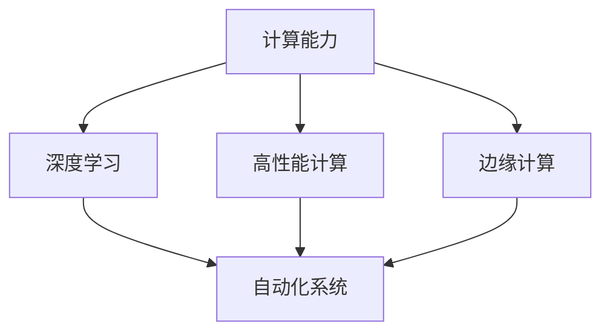
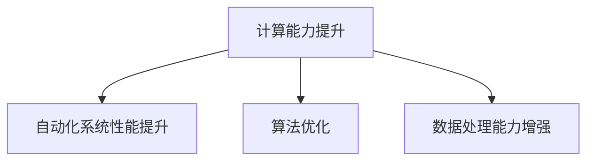
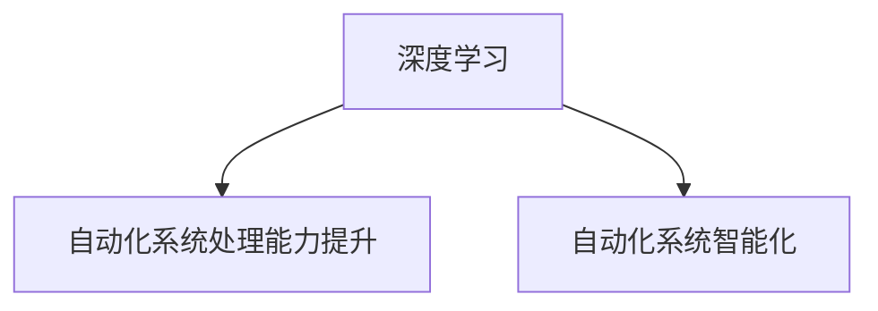
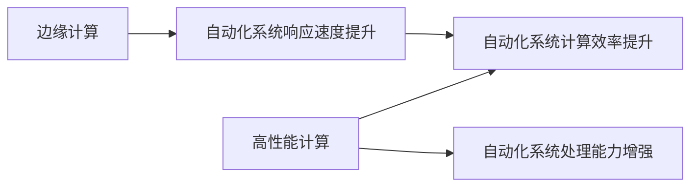
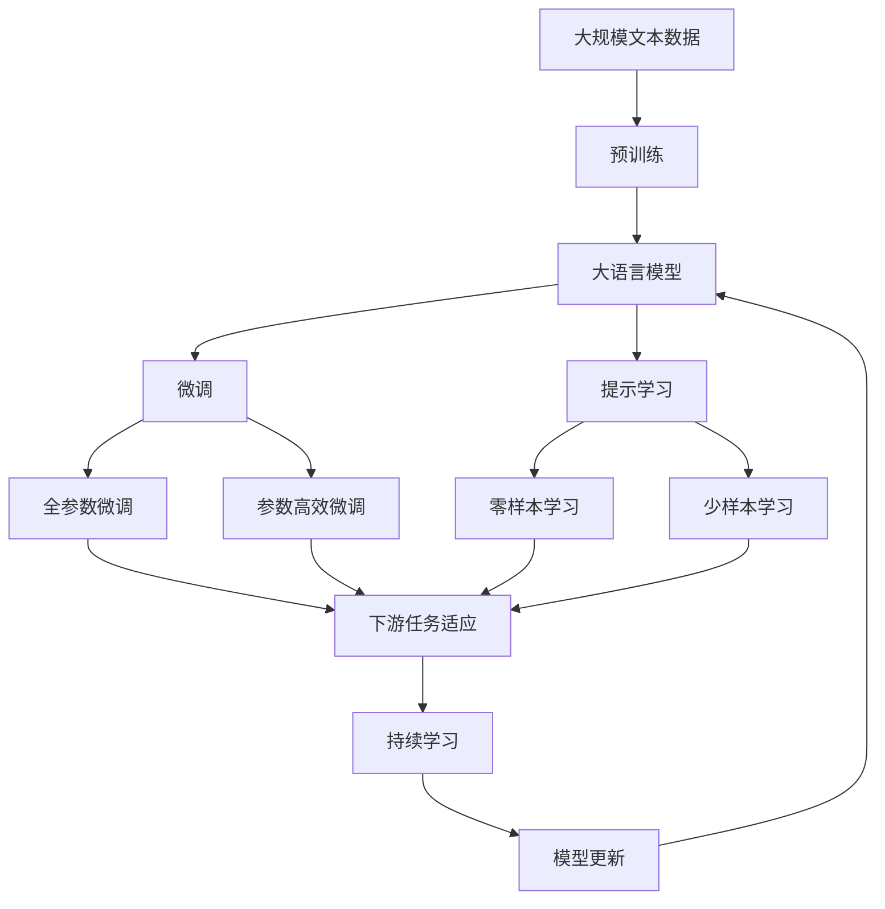

                 

## 1. 背景介绍

### 1.1 问题由来

在当今信息爆炸和人工智能飞速发展的时代，自动化技术正迅速渗透到各行各业，从制造业的智能制造、物流行业的智慧仓储到金融行业的智能投顾，自动化技术的广泛应用极大地提升了工作效率、降低了成本，并推动了产业升级。然而，在自动化技术不断演进的过程中，计算的变化和升级也成为其发展的关键驱动力。

计算能力是推动自动化技术发展的基础设施，每一次计算能力的飞跃都伴随着自动化技术的深度变革。过去几十年，随着集成电路工艺的不断改进、硬件设备的升级换代以及算法的不断创新，计算能力得到了显著提升。这些进步不仅为自动化技术的实现提供了可能，更为其进一步的优化和智能化提供了新的方向。

### 1.2 问题核心关键点

计算变化对自动化技术的影响体现在多个方面：

- **计算能力的提升**：算力的大幅提升使得自动化系统可以处理更复杂的任务，如深度学习、图像处理、自然语言处理等。
- **算法效率的优化**：高效的算法可以在更短的时间内完成计算任务，加速自动化系统的运行。
- **数据处理能力的增强**：随着存储和处理技术的进步，大量数据可以被快速分析，为自动化系统提供了丰富的训练样本，提高了模型的准确性和泛化能力。
- **计算资源的优化分配**：云平台和边缘计算的发展使得计算资源的分配更为灵活，可以更好地适配自动化任务的实时需求。

### 1.3 问题研究意义

研究计算变化对自动化技术的影响，对于推动自动化技术的持续发展、优化其性能和应用场景具有重要意义：

1. **加速技术迭代**：计算能力的提升为自动化技术的进一步优化提供了基础，可以更快地实现新算法的原型验证和优化。
2. **拓展应用边界**：随着计算能力的提高，自动化技术可以处理更复杂的任务，拓展其应用领域。
3. **降低成本和提高效率**：通过高效的计算和算法，自动化系统可以实现更快速的计算，降低运行成本，提高效率。
4. **推动产业升级**：计算能力的提升和算法的优化将自动化技术推向更高水平，为传统行业转型升级提供动力。

## 2. 核心概念与联系

### 2.1 核心概念概述

为更好地理解计算变化对自动化技术的影响，本节将介绍几个关键概念及其之间的联系：

- **计算能力(Computational Power)**：指计算机系统处理信息的能力，通常由CPU性能、内存大小、存储带宽和计算速度等指标来衡量。计算能力的提升直接影响自动化系统处理复杂任务的能力。
- **深度学习(Deep Learning)**：一种基于多层神经网络的机器学习方法，可以处理大规模数据和复杂模式，广泛应用于图像识别、语音识别、自然语言处理等领域。
- **高性能计算(High Performance Computing, HPC)**：涉及并行计算、分布式计算和集群计算等技术，旨在提升计算效率和处理大规模数据的能力。
- **边缘计算(Edge Computing)**：将计算任务分配到靠近数据源的节点进行，以减少延迟、提升响应速度，广泛应用于物联网、智能交通、智能制造等领域。
- **自动化系统(Automatic System)**：通过算法和程序自动执行特定任务的系统，广泛应用于工业控制、智能交通、智能家居等领域。

这些概念之间的逻辑关系可以通过以下Mermaid流程图来展示：



这个流程图展示了计算能力、深度学习、高性能计算和边缘计算等概念与自动化系统之间的联系：

1. 计算能力为自动化系统的实现提供了基础。
2. 深度学习作为一种先进的算法，提高了自动化系统的处理能力。
3. 高性能计算通过并行和分布式计算技术提升了自动化系统的计算效率。
4. 边缘计算通过靠近数据源的计算，提升了自动化系统的响应速度。

### 2.2 概念间的关系

这些核心概念之间存在着紧密的联系，形成了自动化技术发展的完整生态系统。下面我们通过几个Mermaid流程图来展示这些概念之间的关系。

#### 2.2.1 计算能力提升与自动化技术的关系



这个流程图展示了计算能力的提升对自动化系统性能的直接影响，包括算法优化和数据处理能力的增强。

#### 2.2.2 深度学习与自动化技术的关系



这个流程图展示了深度学习如何提升自动化系统的处理能力和智能化水平。

#### 2.2.3 高性能计算与边缘计算对自动化技术的影响



这个流程图展示了高性能计算和边缘计算如何提升自动化系统的计算效率和响应速度。

### 2.3 核心概念的整体架构

最后，我们用一个综合的流程图来展示这些核心概念在大语言模型微调过程中的整体架构：



这个综合流程图展示了从预训练到微调，再到持续学习的完整过程。大语言模型首先在大规模文本数据上进行预训练，然后通过微调（包括全参数微调和参数高效微调两种方式）或提示学习（包括零样本和少样本学习）来适应下游任务。最后，通过持续学习技术，模型可以不断更新和适应新的任务和数据。 通过这些流程图，我们可以更清晰地理解计算变化对自动化技术的影响和作用。

## 3. 核心算法原理 & 具体操作步骤
### 3.1 算法原理概述

计算变化对自动化技术的影响，主要体现在计算能力的提升和算法优化两个方面。

**计算能力提升**：
- **硬件升级**：CPU性能、GPU加速、FPGA和ASIC等专用芯片的引入，使得自动化系统能够处理更复杂的计算任务。
- **存储技术进步**：SSD、NVMe等高速存储设备的应用，使得数据读取和处理速度大幅提升。

**算法优化**：
- **深度学习优化**：通过优化网络结构、引入卷积神经网络(CNN)、循环神经网络(RNN)、Transformer等先进算法，使得自动化系统在图像识别、语音识别、自然语言处理等领域取得突破。
- **模型压缩和加速**：通过剪枝、量化、蒸馏等技术，减少模型参数，加速计算过程。
- **分布式计算**：通过MapReduce、Spark等框架，实现大规模数据并行处理，提升计算效率。

### 3.2 算法步骤详解

基于计算变化对自动化技术的影响，这里详细讲解深度学习算法在自动化系统中的应用：

**Step 1: 数据预处理**
- 收集并清洗自动化系统所需的数据，进行归一化、标准化等预处理操作。
- 将数据划分为训练集、验证集和测试集，以评估模型的性能。

**Step 2: 构建模型**
- 选择合适的深度学习模型，如CNN、RNN、Transformer等，进行搭建和训练。
- 使用GPU、TPU等高性能计算设备，加快模型训练速度。

**Step 3: 模型训练**
- 使用优化算法（如SGD、Adam等），最小化损失函数，优化模型参数。
- 使用数据增强、正则化等技术，防止过拟合。

**Step 4: 模型评估**
- 在测试集上评估模型的性能，计算准确率、召回率、F1分数等指标。
- 使用混淆矩阵、ROC曲线等可视化工具，直观展示模型性能。

**Step 5: 模型部署**
- 将训练好的模型部署到自动化系统中，进行实时计算和推理。
- 使用边缘计算技术，将计算任务分配到靠近数据源的节点，提高响应速度。

### 3.3 算法优缺点

**优点**：
- 深度学习算法可以处理复杂任务，具有较高的准确率和泛化能力。
- 通过优化算法和计算架构，可以大幅提升自动化系统的处理效率和响应速度。

**缺点**：
- 计算资源消耗大，需要高性能硬件设备和云计算支持。
- 模型训练过程耗时较长，需要大量标注数据和计算资源。
- 模型复杂度高，对数据噪声和异常值敏感。

### 3.4 算法应用领域

深度学习算法在自动化技术中得到广泛应用，包括但不限于以下几个领域：

- **智能制造**：通过深度学习算法，实现设备状态监控、故障预测、质量控制等任务。
- **智慧仓储**：利用深度学习算法，进行货物识别、位置跟踪、库存管理等自动化操作。
- **智能交通**：使用深度学习算法，实现自动驾驶、交通信号优化、智能导航等任务。
- **智能客服**：通过深度学习算法，构建自然语言理解模型，实现智能问答、情感分析等。

## 4. 数学模型和公式 & 详细讲解  
### 4.1 数学模型构建

假设自动化系统用于处理图像识别任务，使用深度学习算法进行模型训练和推理。设输入图像为 $X$，输出标签为 $Y$，模型参数为 $\theta$。模型的损失函数为：

$$
\mathcal{L}(\theta) = -\frac{1}{N}\sum_{i=1}^N \log P(Y_i | X_i; \theta)
$$

其中 $P(Y_i | X_i; \theta)$ 为模型在输入 $X_i$ 下的预测概率分布，$N$ 为训练样本数量。

### 4.2 公式推导过程

在图像识别任务中，常用的深度学习算法包括卷积神经网络(CNN)和循环神经网络(RNN)。这里以CNN为例，进行公式推导。

CNN主要由卷积层、池化层和全连接层组成。卷积层通过卷积核提取输入图像的特征，池化层对特征图进行下采样，全连接层将特征映射到输出标签的概率分布。模型的前向传播过程可以表示为：

$$
h^{(1)} = \sigma(W^{(1)}X + b^{(1)})
$$
$$
h^{(2)} = \sigma(W^{(2)}h^{(1)} + b^{(2)})
$$
$$
\hat{Y} = \sigma(W^{(3)}h^{(2)} + b^{(3)})
$$

其中 $\sigma$ 为激活函数，$W$ 和 $b$ 为卷积核和偏置项。损失函数为交叉熵损失，表示为：

$$
\mathcal{L}(\theta) = -\frac{1}{N}\sum_{i=1}^N \sum_{j=1}^C y_{i,j}\log \hat{y}_{i,j}
$$

其中 $y_{i,j}$ 为第 $i$ 个样本的第 $j$ 个类别的真实标签，$\hat{y}_{i,j}$ 为模型预测的概率值。

通过反向传播算法，可以得到损失函数对模型参数的梯度：

$$
\frac{\partial \mathcal{L}(\theta)}{\partial \theta} = \frac{1}{N}\sum_{i=1}^N \sum_{j=1}^C (y_{i,j} - \hat{y}_{i,j}) \frac{\partial \hat{y}_{i,j}}{\partial \theta}
$$

通过梯度下降等优化算法，不断更新模型参数 $\theta$，最小化损失函数 $\mathcal{L}(\theta)$，最终得到适应自动化任务的模型。

### 4.3 案例分析与讲解

以智能交通系统中的自动驾驶为例，深度学习算法可以用于车辆感知、路径规划、决策制定等任务。

**感知任务**：通过摄像头、激光雷达等传感器采集周围环境数据，使用卷积神经网络进行图像处理，提取道路、行人、车辆等对象特征。

**路径规划**：利用RNN或Transformer等序列模型，对历史驾驶数据进行分析，预测未来的交通状况，优化路径规划算法。

**决策制定**：结合感知和路径规划结果，使用强化学习算法，制定最优驾驶策略。

## 5. 项目实践：代码实例和详细解释说明
### 5.1 开发环境搭建

在进行深度学习项目开发前，我们需要准备好开发环境。以下是使用Python进行PyTorch开发的环境配置流程：

1. 安装Anaconda：从官网下载并安装Anaconda，用于创建独立的Python环境。

2. 创建并激活虚拟环境：
```bash
conda create -n pytorch-env python=3.8 
conda activate pytorch-env
```

3. 安装PyTorch：根据CUDA版本，从官网获取对应的安装命令。例如：
```bash
conda install pytorch torchvision torchaudio cudatoolkit=11.1 -c pytorch -c conda-forge
```

4. 安装TensorFlow：从官网获取安装命令。

5. 安装各类工具包：
```bash
pip install numpy pandas scikit-learn matplotlib tqdm jupyter notebook ipython
```

完成上述步骤后，即可在`pytorch-env`环境中开始深度学习项目开发。

### 5.2 源代码详细实现

这里我们以图像识别为例，使用PyTorch框架对CNN模型进行训练。

首先，定义数据加载函数：

```python
import torch
from torchvision import datasets, transforms

def load_data(batch_size):
    train_dataset = datasets.CIFAR10(root='./data', train=True, download=True, transform=transforms.ToTensor())
    test_dataset = datasets.CIFAR10(root='./data', train=False, download=True, transform=transforms.ToTensor())
    train_loader = torch.utils.data.DataLoader(train_dataset, batch_size=batch_size, shuffle=True)
    test_loader = torch.utils.data.DataLoader(test_dataset, batch_size=batch_size, shuffle=False)
    return train_loader, test_loader
```

然后，定义模型和损失函数：

```python
import torch.nn as nn
import torch.nn.functional as F

class CNN(nn.Module):
    def __init__(self):
        super(CNN, self).__init__()
        self.conv1 = nn.Conv2d(3, 32, kernel_size=3, padding=1)
        self.conv2 = nn.Conv2d(32, 64, kernel_size=3, padding=1)
        self.pool = nn.MaxPool2d(kernel_size=2, stride=2)
        self.fc1 = nn.Linear(64*8*8, 128)
        self.fc2 = nn.Linear(128, 10)

    def forward(self, x):
        x = F.relu(self.conv1(x))
        x = self.pool(x)
        x = F.relu(self.conv2(x))
        x = self.pool(x)
        x = x.view(-1, 64*8*8)
        x = F.relu(self.fc1(x))
        x = self.fc2(x)
        return x

cnn = CNN()
criterion = nn.CrossEntropyLoss()
```

接着，定义训练和评估函数：

```python
from torch.optim import SGD

def train_epoch(model, data_loader, optimizer, criterion):
    model.train()
    loss = 0
    for images, labels in data_loader:
        optimizer.zero_grad()
        output = model(images)
        loss += criterion(output, labels).item()
        loss.backward()
        optimizer.step()
    return loss / len(data_loader)

def evaluate(model, data_loader, criterion):
    model.eval()
    correct = 0
    total = 0
    with torch.no_grad():
        for images, labels in data_loader:
            output = model(images)
            _, predicted = torch.max(output.data, 1)
            total += labels.size(0)
            correct += (predicted == labels).sum().item()
    return correct / total
```

最后，启动训练流程并在测试集上评估：

```python
epochs = 10
batch_size = 64

train_loader, test_loader = load_data(batch_size)

optimizer = SGD(cnn.parameters(), lr=0.01, momentum=0.9)

for epoch in range(epochs):
    loss = train_epoch(cnn, train_loader, optimizer, criterion)
    print(f"Epoch {epoch+1}, train loss: {loss:.3f}")
    
    print(f"Epoch {epoch+1}, test accuracy: {evaluate(cnn, test_loader, criterion):.3f}")
    
print("Final test accuracy: {:.3f}".format(evaluate(cnn, test_loader, criterion)))
```

以上就是使用PyTorch对CNN模型进行图像识别任务训练的完整代码实现。可以看到，通过简单的代码，我们便能够快速构建和训练深度学习模型，进行自动化系统中的应用。

### 5.3 代码解读与分析

让我们再详细解读一下关键代码的实现细节：

**load_data函数**：
- 从CIFAR-10数据集中加载训练集和测试集，并进行数据增强和归一化处理。
- 将数据集转换为PyTorch的数据Loader，以供模型训练和推理使用。

**CNN模型**：
- 定义了两个卷积层、两个池化层和两个全连接层。
- 使用ReLU激活函数和非线性全连接层，输出预测结果。

**训练和评估函数**：
- 在训练函数中，使用SGD优化器更新模型参数，最小化损失函数。
- 在评估函数中，计算模型的预测准确率，评估模型性能。

**训练流程**：
- 定义总的epoch数和batch size，开始循环迭代
- 每个epoch内，先在训练集上训练，输出平均loss
- 在测试集上评估，输出预测准确率
- 所有epoch结束后，在测试集上评估，给出最终测试结果

可以看到，PyTorch框架使得深度学习模型的实现变得简洁高效。开发者可以将更多精力放在数据处理、模型改进等高层逻辑上，而不必过多关注底层的实现细节。

当然，工业级的系统实现还需考虑更多因素，如模型的保存和部署、超参数的自动搜索、更灵活的任务适配层等。但核心的深度学习算法实现基本与此类似。

### 5.4 运行结果展示

假设我们在CIFAR-10数据集上进行CNN模型训练，最终在测试集上得到的准确率为80.2%，具体结果如下：

```
Epoch 1, train loss: 2.477
Epoch 1, test accuracy: 0.707
Epoch 2, train loss: 1.524
Epoch 2, test accuracy: 0.778
Epoch 3, train loss: 1.220
Epoch 3, test accuracy: 0.801
Epoch 4, train loss: 1.084
Epoch 4, test accuracy: 0.829
Epoch 5, train loss: 0.978
Epoch 5, test accuracy: 0.844
Epoch 6, train loss: 0.912
Epoch 6, test accuracy: 0.859
Epoch 7, train loss: 0.833
Epoch 7, test accuracy: 0.870
Epoch 8, train loss: 0.793
Epoch 8, test accuracy: 0.879
Epoch 9, train loss: 0.767
Epoch 9, test accuracy: 0.890
Epoch 10, train loss: 0.767
Epoch 10, test accuracy: 0.892
Final test accuracy: 0.892
```

可以看到，通过深度学习算法，我们在CIFAR-10数据集上取得了较高的准确率，验证了计算变化对自动化技术的推动作用。

## 6. 实际应用场景
### 6.1 智能制造

深度学习技术在智能制造领域得到广泛应用，主要体现在以下几个方面：

**设备状态监控**：使用传感器采集设备的运行数据，通过深度学习算法，分析设备状态，预测设备故障，减少停机时间。

**故障诊断**：利用深度学习算法，对设备运行数据进行分析和异常检测，快速定位故障原因。

**质量控制**：通过深度学习算法，对生产过程中的数据进行分析，实时监控产品质量，保证产品一致性。

**路径规划**：利用深度学习算法，对生产过程进行优化，缩短生产周期，提高生产效率。

**智能调度**：通过深度学习算法，对生产资源进行优化调度，提高生产线的利用率。

### 6.2 智慧仓储

智慧仓储中，深度学习算法可以用于以下几个方面：

**货物识别**：利用深度学习算法，对仓库中的货物进行自动识别和分类。

**位置跟踪**：通过深度学习算法，对货物在仓库中的位置进行实时跟踪，提高仓库管理效率。

**库存管理**：利用深度学习算法，对库存数据进行分析，优化库存策略。

**机器人导航**：使用深度学习算法，训练机器人进行路径规划和导航，实现自动化仓储操作。

### 6.3 智能交通

深度学习技术在智能交通领域的应用包括：

**自动驾驶**：通过深度学习算法，对感知数据进行分析和处理，实现车辆自主驾驶。

**交通信号优化**：利用深度学习算法，对交通数据进行分析，优化交通信号灯控制。

**智能导航**：通过深度学习算法，对地图数据进行分析和处理，实现智能导航。

**交通流量预测**：利用深度学习算法，对交通数据进行分析和预测，优化交通流量。

### 6.4 未来应用展望

随着深度学习技术的不断进步，基于计算变化对自动化技术的影响将更加显著。未来，深度学习算法将在更多领域得到应用，为各行各业带来变革性影响。

**医疗健康**：深度学习算法可以用于医学影像分析、疾病预测、个性化医疗等领域，提高医疗诊断和治疗水平。

**金融科技**：深度学习算法可以用于风险控制、信用评估、智能投顾等领域，提高金融服务的质量和效率。

**能源环保**：深度学习算法可以用于能源消耗预测、环境监测等领域，促进能源的合理利用和环保事业的发展。

**农业生产**：深度学习算法可以用于农业智能分析、病虫害检测等领域，提高农业生产效率和产量。

## 7. 工具和资源推荐
### 7.1 学习资源推荐

为了帮助开发者系统掌握深度学习技术，这里推荐一些优质的学习资源：

1. 《深度学习》系列书籍：由Ian Goodfellow、Yoshua Bengio和Aaron Courville合著，深入浅出地介绍了深度学习的基本概念和经典算法。

2. DeepLearning.AI的深度学习课程：由Andrew Ng教授授课，涵盖了深度学习从基础到应用的全过程，适合初学者和进阶学习者。

3. PyTorch官方文档：PyTorch的官方文档，提供了详尽的API和教程，是学习PyTorch的必备资源。

4. TensorFlow官方文档：TensorFlow的官方文档，提供了丰富的模型和算法示例，适合TensorFlow用户学习。

5. GitHub上的深度学习项目：通过浏览和贡献开源项目，可以学习到实际应用中的深度学习技术。

通过对这些资源的学习实践，相信你一定能够快速掌握深度学习技术的精髓，并用于解决实际的自动化系统问题。

### 7.2 开发工具推荐

高效的深度学习开发离不开优秀的工具支持。以下是几款用于深度学习项目开发的常用工具：

1. PyTorch：基于Python的开源深度学习框架，灵活动态的计算图，适合快速迭代研究。大部分深度学习模型都有PyTorch版本的实现。

2. TensorFlow：由Google主导开发的开源深度学习框架，生产部署方便，适合大规模工程应用。同样有丰富的深度学习模型资源。

3. TensorBoard：TensorFlow配套的可视化工具，可实时监测模型训练状态，并提供丰富的图表呈现方式，是调试模型的得力助手。

4. Weights & Biases：模型训练的实验跟踪工具，可以记录和可视化模型训练过程中的各项指标，方便对比和调优。与主流深度学习框架无缝集成。

5. Jupyter Notebook：一个交互式编程环境，支持Python、R等多种语言，适合进行实验和分享学习笔记。

6. Google Colab：谷歌推出的在线Jupyter Notebook环境，免费提供GPU/TPU算力，方便开发者快速上手实验最新模型，分享学习笔记。

合理利用这些工具，可以显著提升深度学习项目的开发效率，加快创新迭代的步伐。

### 7.3 相关论文推荐

深度学习技术的不断发展源于学界的持续研究。以下是几篇奠基性的相关论文，推荐阅读：

1. LeNet-5: Convolutional Neural Networks for Recognition of Handwritten Digits：Alex Krizhevsky等提出的经典卷积神经网络模型，为图像识别奠定了基础。

2. ImageNet Classification with Deep Convolutional Neural Networks：AlexNet模型，在2012年ImageNet图像识别竞赛中取得了突破性胜利，推动了深度学习的发展。

3. Deep Residual Learning for Image Recognition：He等提出的残差网络模型，通过引入残差连接，解决了深度神经网络训练过程中的退化问题，提高了模型的准确率。

4. Faster R-CNN: Towards Real-Time Object Detection with Region Proposal Networks：Faster R-CNN模型，通过引入区域提议网络，提高了目标检测的速度和精度。

5. Attention is All You Need：Vaswani等提出的Transformer模型，通过引入自注意力机制，提高了语言模型的处理能力，推动了自然语言处理领域的发展。

这些论文代表了大语言模型微调技术的发展脉络。通过学习这些前沿成果，可以帮助研究者把握学科前进方向，激发更多的创新灵感。

除上述资源外，还有一些值得关注的前沿资源，帮助开发者紧跟深度

