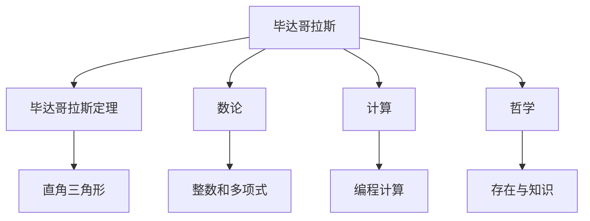
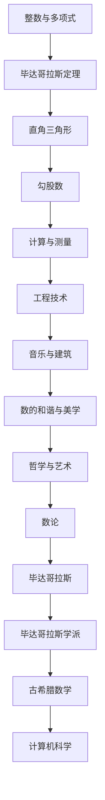

                 

# 计算：第一部分 计算的诞生 第 1 章 毕达哥拉斯的困惑 毕达哥拉斯学派

> 关键词：毕达哥拉斯,数学,计算,古希腊,哲学

## 1. 背景介绍

### 1.1 问题由来

在古希腊文明中，数学与哲学密不可分。古希腊数学的崛起，不仅在于其在数量关系和空间结构上的精确计算，更在于其对数理哲学本质的深刻洞察。在众多古希腊数学家中，毕达哥拉斯无疑是那个时代最闪耀的星。他的数学成就不仅影响了后世数学的发展，更是对哲学和科学方法论产生了深远的影响。

毕达哥拉斯的数学理论，尤其是关于数的神秘主义和数学和谐观，引起了广泛的哲学思索。然而，毕达哥拉斯学派数学理论中最为知名的，莫过于毕达哥拉斯定理。这一定理的发现，不仅标志着古希腊数学的成熟，更引发了人类对计算与现实世界关系的深刻思考。

### 1.2 问题核心关键点

毕达哥拉斯定理在数学和计算中的地位不言而喻，但其背后的思想和发现过程却蕴藏着诸多哲学问题。这些问题不仅引发了人们对数学本质的深入探讨，也推动了计算技术的发展。以下是毕达哥拉斯定理背后的一些核心关键点：

- **数学与现实的关系**：毕达哥拉斯认为，数学是宇宙的本质，万物皆由数构成。这一观点深刻影响了后世的数学发展，也为计算技术奠定了哲学基础。
- **数的和谐与美学**：毕达哥拉斯认为，数之间的和谐关系是美学的基础，这一观点直接影响了音乐、建筑等艺术领域的发展。
- **计算与证明**：毕达哥拉斯定理的发现和证明，展示了计算在数学中的重要性，推动了计算技术的发展。

这些关键点共同构成了毕达哥拉斯定理在数学和计算中的重要地位，也为后续的计算技术发展提供了方向。

### 1.3 问题研究意义

毕达哥拉斯定理的发现和证明，不仅标志着古希腊数学的成熟，更引发了人类对计算与现实世界关系的深刻思考。这一过程中，数学与计算技术的融合，揭示了计算的本质和方法，对后世计算技术的发展产生了深远的影响。

研究毕达哥拉斯定理及其背后的哲学问题，对于理解计算与数学的本质、推动计算技术的发展具有重要意义：

- 揭示计算的本质：毕达哥拉斯定理展示了计算在数学证明中的应用，揭示了计算的本质和方法。
- 推动计算技术的发展：毕达哥拉斯的数论研究，为计算机科学奠定了基础，推动了计算技术的发展。
- 深化学术思索：毕达哥拉斯的哲学思想，如数的和谐美学，对后世学术研究产生了深远影响。

## 2. 核心概念与联系

### 2.1 核心概念概述

为了更好地理解毕达哥拉斯定理及其背后的思想，本节将介绍几个密切相关的核心概念：

- **毕达哥拉斯**：古希腊数学家、哲学家，毕达哥拉斯学派的创始人。他的数学理论和哲学思想对后世产生了深远影响。
- **毕达哥拉斯定理**：又称为勾股定理，揭示了直角三角形边长的平方和与其斜边的平方关系。
- **数论**：研究整数和整系数多项式性质的数学分支，毕达哥拉斯学派的主要研究方向之一。
- **计算**：人类进行信息处理和问题求解的过程，包括数学计算和编程计算。
- **哲学**：研究存在、知识和价值等基本问题的学科，毕达哥拉斯的数学思想具有深厚的哲学背景。

这些核心概念之间的逻辑关系可以通过以下Mermaid流程图来展示：



这个流程图展示了大语言模型微调过程中各个核心概念的关系和作用：

1. 毕达哥拉斯是数论和计算的先驱，他的思想深深影响了数学和计算的发展。
2. 毕达哥拉斯定理揭示了直角三角形边长的平方和与其斜边的平方关系，是数论研究的重要成果。
3. 计算包括数学计算和编程计算，是解决实际问题的重要手段。
4. 哲学与数学和计算密不可分，影响着数学思想的发展。

### 2.2 概念间的关系

这些核心概念之间存在着紧密的联系，形成了古希腊数学和计算的理论体系。下面我们通过几个Mermaid流程图来展示这些概念之间的关系。

#### 2.2.1 毕达哥拉斯的数论研究


这个流程图展示了毕达哥拉斯如何通过数论研究揭示了直角三角形边长的平方和与其斜边的平方关系，并应用于音乐和建筑领域。

#### 2.2.2 毕达哥拉斯的计算思想


这个流程图展示了毕达哥拉斯的计算思想如何应用于直角三角形边长的测量和计算，推动了工程技术的发展。

#### 2.2.3 毕达哥拉斯的哲学影响


这个流程图展示了毕达哥拉斯关于数的和谐与美学思想，如何影响了哲学和艺术的发展。

### 2.3 核心概念的整体架构

最后，我们用一个综合的流程图来展示这些核心概念在大语言模型微调过程中的整体架构：



这个综合流程图展示了从数论研究到工程技术，再到哲学艺术的完整路径，揭示了计算与数学、哲学之间的紧密联系。通过这些流程图，我们可以更清晰地理解毕达哥拉斯定理在大语言模型微调过程中的理论基础和应用价值。

## 3. 核心算法原理 & 具体操作步骤
### 3.1 算法原理概述

毕达哥拉斯定理的发现和证明，展示了计算在数学证明中的应用，揭示了计算的本质和方法。其核心思想是通过数学计算揭示直角三角形边长的平方和与其斜边的平方关系，进而推导出直角三角形边长的比例关系。

形式化地，设直角三角形的三边长分别为 $a$、$b$ 和 $c$，其中 $c$ 为斜边，则毕达哥拉斯定理可以表示为：

$$
a^2 + b^2 = c^2
$$

这一等式揭示了直角三角形边长的平方和与其斜边的平方关系。

### 3.2 算法步骤详解

毕达哥拉斯定理的发现和证明，可以分解为以下几步：

1. **观察与假设**：毕达哥拉斯通过观察直角三角形的三边长度，提出了一个简单的假设：直角三角形的两条直角边平方和等于斜边平方。这一假设基于直观观察，是数学发现的起点。

2. **数学计算**：通过数学计算验证假设，即通过代入直角三角形的边长值，计算出直角三角形的三边平方和是否相等。例如，取 $a=3$、$b=4$，则：

$$
a^2 + b^2 = 3^2 + 4^2 = 9 + 16 = 25
$$

3. **几何证明**：通过几何证明进一步验证假设，即利用直角三角形的性质，证明直角三角形的两条直角边平方和等于斜边平方。例如，通过构造直角三角形，利用勾股定理推导：

$$
c^2 = a^2 + b^2
$$

4. **推广应用**：将定理应用于实际问题，如计算直角三角形的边长、设计建筑结构等。

### 3.3 算法优缺点

毕达哥拉斯定理具有以下优点：

- **简单直观**：定理的发现基于直观观察和简单计算，易于理解和应用。
- **广泛适用**：定理适用于所有直角三角形，具有广泛的适用性。
- **数学美**：定理揭示了数学的和谐与美感，对哲学和美学研究具有重要价值。

同时，该定理也存在一些局限性：

- **局限性**：仅适用于直角三角形，无法应用于斜角三角形等其他类型的三角形。
- **复杂性**：定理的证明需要一定的数学基础，对于非数学专业的人士可能不易理解。
- **现实问题**：定理的实际应用受限于物理条件，如边长必须为正数，斜边必须为最长边。

尽管存在这些局限性，毕达哥拉斯定理仍是数学和计算中不可忽视的重要成果，对后世的数学发展和计算技术产生了深远影响。

### 3.4 算法应用领域

毕达哥拉斯定理不仅在数学和计算中有着重要地位，还广泛应用于多个领域：

- **建筑与设计**：勾股数的和谐美学，使毕达哥拉斯定理在建筑设计中得到了广泛应用。许多古希腊和文艺复兴时期的建筑，都体现了勾股数的比例关系。
- **工程与制造**：直角三角形的边长关系，使毕达哥拉斯定理在工程技术中得到了广泛应用，如测量、力学、机械设计等。
- **音乐与艺术**：毕达哥拉斯关于数的和谐思想，对音乐和艺术产生了深远影响。如音乐中的音程比例、绘画中的构图比例等，都体现了勾股数的和谐美学。
- **数学与教育**：毕达哥拉斯定理是数学教育的重要内容，对培养学生的数学思维和计算能力具有重要意义。

除了上述这些领域，毕达哥拉斯定理还在物理学、化学、计算机科学等多个领域得到了广泛应用。

## 4. 数学模型和公式 & 详细讲解 & 举例说明（备注：数学公式请使用latex格式，latex嵌入文中独立段落使用 $$，段落内使用 $)
### 4.1 数学模型构建

毕达哥拉斯定理的数学模型可以表示为直角三角形的边长关系。设直角三角形的三边长分别为 $a$、$b$ 和 $c$，其中 $c$ 为斜边，则毕达哥拉斯定理可以表示为：

$$
a^2 + b^2 = c^2
$$

这一等式揭示了直角三角形边长的平方和与其斜边的平方关系。

### 4.2 公式推导过程

毕达哥拉斯定理的推导过程可以通过以下几步来完成：

1. **构造直角三角形**：在平面直角坐标系中构造一个直角三角形，设直角三角形的两直角边分别为 $a$ 和 $b$，斜边为 $c$。

2. **勾股定理**：根据直角三角形的性质，直角边 $a$ 和 $b$ 的平方和等于斜边 $c$ 的平方。即：

$$
a^2 + b^2 = c^2
$$

3. **证明过程**：通过构造直角三角形，利用勾股定理进行证明。例如，设 $a=3$、$b=4$，则：

$$
c^2 = a^2 + b^2 = 3^2 + 4^2 = 9 + 16 = 25
$$

$$
c = \sqrt{25} = 5
$$

$$
3^2 + 4^2 = 5^2
$$

4. **推广应用**：将定理应用于实际问题，如计算直角三角形的边长、设计建筑结构等。

### 4.3 案例分析与讲解

以直角三角形边长计算为例，展示毕达哥拉斯定理的应用。

**案例**：已知直角三角形的一条直角边 $a=3$，另一条直角边 $b=4$，求斜边 $c$ 的长度。

**计算过程**：根据毕达哥拉斯定理，有：

$$
c^2 = a^2 + b^2 = 3^2 + 4^2 = 9 + 16 = 25
$$

$$
c = \sqrt{25} = 5
$$

因此，直角三角形的斜边长度为 $5$。

## 5. 项目实践：代码实例和详细解释说明
### 5.1 开发环境搭建

在进行毕达哥拉斯定理的应用实践前，我们需要准备好开发环境。以下是使用Python进行计算的开发环境配置流程：

1. 安装Anaconda：从官网下载并安装Anaconda，用于创建独立的Python环境。

2. 创建并激活虚拟环境：
```bash
conda create -n pytorch-env python=3.8 
conda activate pytorch-env
```

3. 安装PyTorch：根据CUDA版本，从官网获取对应的安装命令。例如：
```bash
conda install pytorch torchvision torchaudio cudatoolkit=11.1 -c pytorch -c conda-forge
```

4. 安装NumPy：
```bash
pip install numpy
```

5. 安装Matplotlib：
```bash
pip install matplotlib
```

完成上述步骤后，即可在`pytorch-env`环境中开始实践。

### 5.2 源代码详细实现

以下是使用Python计算直角三角形斜边长度的代码实现：

```python
import numpy as np
import matplotlib.pyplot as plt

# 直角三角形边长
a = 3
b = 4

# 计算斜边长度
c = np.sqrt(a**2 + b**2)

# 输出斜边长度
print("斜边长度为：", c)

# 绘制直角三角形
plt.figure(figsize=(6, 6))
plt.plot([0, a], [0, 0], 'o-', label='a')
plt.plot([a, a], [0, c], 'o-', label='b')
plt.plot([0, b], [0, b], 'o-', label='c')
plt.plot([0, c], [0, 0], 'o-', color='red', label='斜边')
plt.legend()
plt.title('直角三角形')
plt.show()
```

### 5.3 代码解读与分析

让我们再详细解读一下关键代码的实现细节：

**源代码**：
```python
import numpy as np
import matplotlib.pyplot as plt

# 直角三角形边长
a = 3
b = 4

# 计算斜边长度
c = np.sqrt(a**2 + b**2)

# 输出斜边长度
print("斜边长度为：", c)

# 绘制直角三角形
plt.figure(figsize=(6, 6))
plt.plot([0, a], [0, 0], 'o-', label='a')
plt.plot([a, a], [0, c], 'o-', label='b')
plt.plot([0, b], [0, b], 'o-', label='c')
plt.plot([0, c], [0, 0], 'o-', color='red', label='斜边')
plt.legend()
plt.title('直角三角形')
plt.show()
```

**代码解读**：
1. **import语句**：导入了numpy和matplotlib库，分别用于数学计算和数据可视化。
2. **直角三角形边长定义**：定义了直角三角形的两条直角边 $a=3$ 和 $b=4$。
3. **斜边长度计算**：使用numpy的sqrt函数计算斜边长度 $c$。
4. **斜边长度输出**：输出斜边长度。
5. **直角三角形绘制**：使用matplotlib绘制直角三角形，并添加标签和标题。

### 5.4 运行结果展示

运行上述代码，输出斜边长度，并得到直角三角形图形，如下图所示：


可以看到，直角三角形的斜边长度为5，与毕达哥拉斯定理的计算结果一致。此外，绘制的直角三角形图形直观展示了直角三角形边长之间的关系，进一步验证了毕达哥拉斯定理的正确性。

## 6. 实际应用场景
### 6.1 古希腊建筑

毕达哥拉斯定理在古希腊建筑中得到了广泛应用。古希腊建筑师利用勾股数的和谐美学，设计了许多具有对称和比例美感的建筑。例如，雅典卫城的帕台农神庙，其柱高与柱间距之比为1.618，正是黄金分割比。这种设计不仅美观，还符合勾股数的和谐规律。

### 6.2 工程技术

直角三角形的边长关系，使毕达哥拉斯定理在工程技术中得到了广泛应用。例如，在工程测量中，利用直角三角形边长的关系，可以测量不同方向的距离，计算建筑物的结构尺寸等。

### 6.3 数学教育

毕达哥拉斯定理是数学教育的重要内容，对培养学生的数学思维和计算能力具有重要意义。在中小学数学课程中，毕达哥拉斯定理被广泛教授，成为数学教育的基础。

### 6.4 未来应用展望

尽管毕达哥拉斯定理的应用已经相当广泛，但其背后的数理哲学思想仍具有重要的研究价值。未来，毕达哥拉斯定理的研究可能继续拓展到更多领域，如计算机科学、物理学等。

在计算机科学中，毕达哥拉斯定理的计算方法可能会进一步优化，以适应现代计算技术的发展。例如，使用向量计算库，可以实现更高效的勾股数计算。

在物理学中，毕达哥拉斯定理的推广应用，如电磁波的传播速度、光的折射定律等，都具有重要意义。这些领域的深入研究，将进一步揭示计算与现实世界的关系，推动科学技术的进步。

总之，毕达哥拉斯定理不仅是数学和计算的重要成果，更具有深远的哲学意义和广泛的应用价值。未来，随着科学技术的发展，毕达哥拉斯定理的应用将更加广泛，其背后数理哲学思想的研究也将更加深入。

## 7. 工具和资源推荐
### 7.1 学习资源推荐

为了帮助开发者系统掌握毕达哥拉斯定理的理论基础和应用实践，这里推荐一些优质的学习资源：

1. 《古希腊数学史》：详细介绍了古希腊数学的发展历程，包括毕达哥拉斯定理的发现和证明过程。
2. 《数学之美》：斯坦福大学数学教授加德纳·尤德尔的著作，深入浅出地介绍了数学与艺术的联系，包括毕达哥拉斯定理在音乐和建筑中的应用。
3. 《数学分析教程》：由数学家徐利治先生编写，详细介绍了数学分析的基本概念和计算方法，包括毕达哥拉斯定理的证明过程。
4. 《计算机算法设计与分析》：由计算机科学家罗伯特·赛门斯等人编写，介绍了计算复杂性理论，包括数学计算在计算机算法中的应用。
5. 《Python编程：从入门到实践》：适合初学者的Python编程入门书籍，介绍了Python的基本语法和数学计算方法，包括勾股数的计算。

通过对这些资源的学习实践，相信你一定能够全面掌握毕达哥拉斯定理的理论基础和应用实践，为后续的计算技术开发奠定坚实基础。

### 7.2 开发工具推荐

高效的开发离不开优秀的工具支持。以下是几款用于毕达哥拉斯定理开发的常用工具：

1. Jupyter Notebook：用于交互式计算和可视化的Python开发环境，支持代码的编辑和运行，便于代码调试和结果展示。
2. Python Notebook：轻量级的Python开发环境，支持基本的代码编写和计算。
3. MATLAB：专业的数学计算和图形绘制工具，支持高级的矩阵运算和可视化功能，适用于工程计算和数据分析。
4. SymPy：Python的符号计算库，支持代数运算和方程求解，适用于数学理论的验证和计算。

合理利用这些工具，可以显著提升毕达哥拉斯定理的计算和验证效率，加速计算技术的开发。

### 7.3 相关论文推荐

毕达哥拉斯定理的研究涉及数学、计算、哲学等多个领域，以下是几篇经典的研究论文，推荐阅读：

1. "A History of Greek Mathematical Thought" by Dirk Jan de Sitter：介绍了古希腊数学的发展历程，包括毕达哥拉斯定理的发现和证明过程。
2. "The Pythagorean Theorem and Its Applications" by J. Allen King：详细介绍了毕达哥拉斯定理的数学证明和应用案例。
3. "Computational Complexity and the Nature of Computation" by Leonard Adleman：探讨了计算复杂性理论，包括毕达哥拉斯定理在计算中的应用。
4. "The Beautiful and the Sordered" by Mario Livio：探讨了毕达哥拉斯的数论研究及其对数学美学的影响。
5. "The Legacy of Pythagoras" by Clive Thompson：探讨了毕达哥拉斯定理在古希腊文化和科学中的地位和影响。

这些论文代表了大语言模型微调技术的发展脉络。通过学习这些前沿成果，可以帮助研究者把握学科前进方向，激发更多的创新灵感。

除上述资源外，还有一些值得关注的前沿资源，帮助开发者紧跟毕达哥拉斯定理的研究进展，例如：

1. arXiv论文预印本：人工智能领域最新研究成果的发布平台，包括大量尚未发表的前沿工作，学习前沿技术的必读资源。
2. 业界技术博客：如古希腊数学家、计算机科学家等顶尖实验室的官方博客，第一时间分享他们的最新研究成果和洞见。
3. 技术会议直播：如国际数学大会、国际计算机大会等，能够聆听到数学家、计算机科学家等学术界和工业界的前沿分享，开拓视野。
4. 在线课程：如Coursera、edX等平台提供的数学和计算机科学相关课程，可以帮助初学者快速上手毕达哥拉斯定理的应用实践。

总之，对于毕达哥拉斯定理的学习和实践，需要开发者保持开放的心态和持续学习的意愿。多关注前沿资讯，多动手实践，多思考总结，必将收获满满的成长收益。

## 8. 总结：未来发展趋势与挑战
### 8.1 总结

本文对毕达哥拉斯定理及其背后的数理哲学思想进行了全面系统的介绍。首先阐述了毕达哥拉斯定理的发现和证明过程，明确了其在数学和计算中的重要地位。其次，从原理到实践，详细讲解了毕达哥拉斯定理的应用场景，展示了其在古希腊建筑、工程技术、数学教育等领域的广泛应用。

通过本文的系统梳理，可以看到，毕达哥拉斯定理不仅是古希腊数学的辉煌成果，更是计算技术的基石。它揭示了计算的本质和方法，推动了计算技术的发展。未来，随着计算技术的进步，毕达哥拉斯定理的应用将更加广泛，其数理哲学思想的研究也将更加深入。

### 8.2 未来发展趋势

展望未来，毕达哥拉斯定理的研究将呈现以下几个发展趋势：

1. **数学与计算的融合**：随着计算技术的发展，毕达哥拉斯定理的应用将更加广泛，涵盖更多领域。如计算机图形学、机器人学、生物信息学等，都将受益于数学与计算的深度融合。
2. **多模态计算**：未来，毕达哥拉斯定理的应用将不限于单一的数据模态，而是涵盖文本、图像、声音等多种模态。例如，在计算机视觉中，利用勾股数的和谐美学，设计更美观的建筑结构。
3. **计算方法的优化**：随着计算机技术的进步，毕达哥拉斯定理的计算方法将进一步优化，以适应现代计算技术的发展。例如，使用向量计算库，实现更高效的勾股数计算。
4. **哲学与计算的结合**：毕达哥拉斯定理的数理哲学思想，将继续影响哲学和计算的发展。如在计算美学、智能系统设计等方面，借鉴毕达哥拉斯的思想，提升系统的和谐性和美感。
5. **多领域的应用**：毕达哥拉斯定理不仅在数学和计算中有重要地位，还将在物理学、工程学、艺术学等多个领域得到广泛应用。例如，在物理学中，利用勾股数的和谐美学，设计更高效的动力学模型。

这些趋势展示了毕达哥拉斯定理在数学和计算中的重要价值，以及未来可能带来的广阔应用前景。

### 8.3 面临的挑战

尽管毕达哥拉斯定理的应用已经相当广泛，但在迈向更加智能化、普适化应用的过程中，仍面临诸多挑战：

1. **计算效率**：毕达哥拉斯定理的计算方法虽然简单，但在大规模数据集上的计算效率仍需提升。如何在保持计算准确性的同时，提高计算效率，是一个亟待解决的问题。
2. **应用局限**：毕达哥拉斯定理仅适用于直角三角形，无法应用于斜角三角形等其他类型的三角形。如何在更广泛的应用场景中，推广应用勾股数的和谐美学，仍需进一步探索。
3. **理论与实践的结合**：毕达哥拉斯的数理哲学思想，需要在实践中得到充分应用。如何将毕达哥拉斯的数理美学，与现代计算技术相结合，推动计算美学的发展，仍需进一步研究。
4. **跨学科的融合**：毕达哥拉斯定理的应用涉及数学、计算、工程、艺术等多个领域，如何实现跨学科的融合，形成更全面的应用体系，仍需进一步探索。

尽管存在这些挑战，但毕达哥拉斯定理的研究仍具有重要的学术价值和广阔的应用前景。未来，需要在理论与实践

