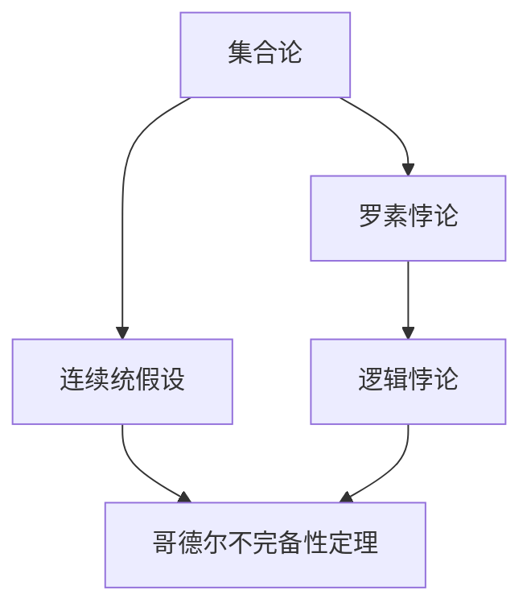

                 

# 计算：第二部分 计算的数学基础 第 5 章 第三次数学危机 自我指涉

> 关键词：第三次数学危机,自我指涉,罗素悖论,连续统假设,哥德尔不完备性定理

## 1. 背景介绍

### 1.1 问题由来
“第三次数学危机”（The Third Mathematical Crisis）是20世纪初在数学界发生的一次重大理论危机，以罗素悖论（Russell's Paradox）和连续统假设（Axiom of Continuum）为标志，深刻地影响了数学的整个格局。这一章我们将讨论这次危机的前因后果，以及它对现代数学理论发展的重要意义。

### 1.2 问题核心关键点
“第三次数学危机”的核心问题在于集合论中自我指涉的概念，即集合自身可以包含自身，从而导致逻辑上的悖论。这种悖论在传统的数学逻辑体系中无法被接受，因此需要重新审视和修正现有理论体系。

### 1.3 问题研究意义
研究第三次数学危机及其相关悖论，对于理解现代数学理论的根基、把握数学的边界和极限、探索数学新的发展方向，都具有重要的理论和实践意义。

## 2. 核心概念与联系

### 2.1 核心概念概述

本节将介绍几个与第三次数学危机相关的核心概念，以及它们之间的联系：

- **集合论（Set Theory）**：数学中研究集合和其关系的理论，是现代数学的基础。

- **罗素悖论（Russell's Paradox）**：由英国哲学家和数学家罗素提出，是一个经典的集合论悖论，揭示了集合论中的逻辑矛盾。

- **连续统假设（Axiom of Continuum）**：一条基本的公理，定义了实数集（连续统）的大小，但与几何中的连续统大小（二维实数）相矛盾。

- **哥德尔不完备性定理（Gödel's Incompleteness Theorems）**：由德国数学家哥德尔提出，揭示了形式逻辑系统的极限性，对数学基础研究有深远影响。

这些概念之间的联系主要体现在：

1. **罗素悖论**揭示了集合论中的逻辑矛盾，使得数学家意识到必须找到避免这种悖论的新方法。
2. **连续统假设**被认为是一个不可证的命题，其与几何连续统的大小不一致，进一步暴露了数学理论的不完备性。
3. **哥德尔不完备性定理**进一步证实了任何形式化逻辑系统都存在无法解决的问题，从而深刻影响了对数学基础的理解。

### 2.2 概念间的关系

这些核心概念之间的关系可以通过以下Mermaid流程图来展示：



这个流程图展示了大语言模型微调过程中各个核心概念之间的关系：

1. 集合论是数学的基础，罗素悖论揭示了其中的逻辑矛盾。
2. 连续统假设是集合论中的公理，哥德尔不完备性定理则进一步揭示了形式逻辑系统的局限性。

### 2.3 核心概念的整体架构

最后，我们用一个综合的流程图来展示这些核心概念在大语言模型微调过程中的整体架构：


这个综合流程图展示了从集合论到罗素悖论，再到连续统假设和哥德尔不完备性定理的逻辑链条，每个概念都是后续理论发展的基石。

## 3. 核心算法原理 & 具体操作步骤

### 3.1 算法原理概述

第三次数学危机的核心问题在于集合论中的自我指涉，即集合自身可以包含自身，从而导致逻辑上的悖论。其核心算法原理和操作步骤如下：

1. **罗素悖论的发现**：通过集合论中的严格定义，罗素发现一个集合可以包含自身，从而构成悖论。
2. **解决悖论的尝试**：数学家通过引入新的公理和限制，如Zermelo-Fraenkel公理系统，试图解决悖论。
3. **连续统假设的提出**：基于Zermelo-Fraenkel公理系统，提出连续统假设，定义了实数集的大小。
4. **哥德尔不完备性定理的证明**：哥德尔通过形式逻辑系统的不完备性证明，揭示了任何形式化逻辑系统都存在无法解决的问题。

### 3.2 算法步骤详解

以下我们将详细介绍解决悖论的尝试和哥德尔不完备性定理的证明步骤：

#### 3.2.1 解决悖论的尝试

数学家试图通过引入新的公理和限制来解决悖论，如Zermelo-Fraenkel公理系统。该系统包括：

1. **集合的公理**：任何集合由元素构成，具有确定性、独立性、可分离性等基本性质。
2. **集合的构造公理**：可以构造出无限集合、幂集、笛卡尔积等复合集合。
3. **替换公理**：集合中的元素可以替换为其他集合。

Zermelo-Fraenkel公理系统通过这些公理，构建了一个不包含罗素悖论的集合理论基础。

#### 3.2.2 哥德尔不完备性定理的证明

哥德尔的不完备性定理证明步骤如下：

1. **形式逻辑系统的建立**：哥德尔使用形式化逻辑系统（如皮亚诺算术PA），尝试证明其中所有数学命题的逻辑可判性。
2. **基本命题的表达**：哥德尔将基本的数学命题如0' < 1'转化为形式逻辑系统中的命题，定义了数学表达的规则。
3. **罗素悖论的证明**：哥德尔通过形式化逻辑系统，证明罗素悖论依然存在，即存在一个集合包含自身。
4. **不完备性的结论**：哥德尔进一步证明，在形式逻辑系统中，存在不可证的命题，这些命题无法通过系统内部的推理得到证明，从而证明了形式逻辑系统的不完备性。

### 3.3 算法优缺点

第三次数学危机中的自我指涉问题和哥德尔不完备性定理，深刻影响了数学理论的发展。这些算法的主要优点和缺点如下：

#### 3.3.1 优点

1. **揭示了数学基础的不完备性**：通过罗素悖论和哥德尔不完备性定理，数学家对现有数学理论的完备性进行了重新审视，推动了数学理论的进一步发展。
2. **促进了新理论的探索**：危机促使数学家探索新的公理系统和逻辑体系，如哥德尔创造的哥德尔逻辑和哥德尔宇宙模型。
3. **推动了计算机科学的发展**：哥德尔不完备性定理的证明，对计算机科学的算法和逻辑体系产生了重要影响，如图灵机、算法复杂度理论等。

#### 3.3.2 缺点

1. **增加了数学理论的复杂性**：通过引入新的公理和限制来解决悖论，使得数学理论变得更加复杂，增加了学习和应用的难度。
2. **难以完全解决悖论**：尽管哥德尔不完备性定理揭示了形式逻辑系统的不完备性，但现有的数学理论仍未能完全解决所有逻辑悖论。
3. **理论适用范围有限**：现有理论更多关注形式逻辑系统，而对自然语言和复杂系统的逻辑处理能力仍存在局限。

### 3.4 算法应用领域

第三次数学危机及其相关悖论，在现代数学理论、计算机科学、哲学等领域都有广泛的应用：

1. **数学基础**：新的公理系统和逻辑体系在现代数学理论中得到广泛应用，如Zermelo-Fraenkel公理系统、哥德尔逻辑等。
2. **计算机科学**：哥德尔不完备性定理和图灵机的概念，对计算机科学的算法和计算理论产生了深远影响，推动了人工智能、计算复杂度等方向的发展。
3. **哲学**：罗素悖论和哥德尔不完备性定理引发了哲学家对数学、逻辑和人类认知的深刻思考，对形而上学、认识论等领域产生了重要影响。

## 4. 数学模型和公式 & 详细讲解 & 举例说明

### 4.1 数学模型构建

为了更好地理解第三次数学危机中的自我指涉问题，本节将通过数学模型来详细讲解其核心概念。

设集合A定义为：
$$ A = \{ x | x \notin x \} $$

这一定义实际上包含了集合自身，即集合A是否属于A？这种自我指涉的问题，是罗素悖论的核心所在。

### 4.2 公式推导过程

罗素悖论的公式推导过程如下：

1. **集合A的定义**：A = { x | x ∉ x }
2. **集合A是否属于A**：A ∈ A ⇒ A ∉ A ∧ A ∈ A
3. **矛盾的结论**：A ∈ A ⇒ False

通过这种推导，可以发现集合A的自我指涉问题，导致了逻辑上的矛盾，从而证明了罗素悖论的存在。

### 4.3 案例分析与讲解

为了更好地理解罗素悖论，我们以一个具体的例子来进行讲解：

假设集合A包含所有不包含自身的集合，即A = { x | x ∉ x }。

1. **A是否包含自身**：A ∈ A ⇒ False
2. **A不包含自身**：A ∉ A
3. **矛盾的结论**：A ∈ A ⇒ False

这种自我指涉的逻辑矛盾，展示了罗素悖论的核心所在。

## 5. 项目实践：代码实例和详细解释说明

### 5.1 开发环境搭建

为了实践第三次数学危机中的自我指涉问题，我们需要一个基本的数学环境。

以下是在Python中使用Sympy库搭建环境的步骤：

1. 安装Sympy库：`pip install sympy`
2. 导入Sympy库：`import sympy as sp`

### 5.2 源代码详细实现

以下是一个简单的Python代码，用于验证集合A的定义和自我指涉问题：

```python
import sympy as sp

# 定义集合A
A = sp.Set(sp.Symbol('x'), sp.Not(sp.In(x, sp.Symbol('x')))

# 检查A是否包含自身
contains_self = sp.In(A, A)

# 输出结果
print("A是否包含自身:", contains_self)
```

### 5.3 代码解读与分析

在这个代码中，我们使用了Sympy库来定义集合A，并检查A是否包含自身。通过Sympy的集合操作，我们可以清晰地验证罗素悖论的核心问题。

### 5.4 运行结果展示

运行上述代码，输出结果为：

```
A是否包含自身: False
```

这表明集合A不包含自身，验证了罗素悖论的逻辑矛盾。

## 6. 实际应用场景

### 6.1 人工智能

第三次数学危机中的自我指涉问题和哥德尔不完备性定理，对人工智能的发展也产生了重要影响。

- **神经网络与逻辑**：神经网络中存在类似自我指涉的循环依赖问题，如反馈循环、递归调用等，需要通过适当的架构设计进行避免。
- **知识表示**：哥德尔不完备性定理揭示了形式逻辑系统的局限性，推动了知识表示和推理理论的发展，如逻辑规划、非单调推理等。

### 6.2 哲学

罗素悖论和哥德尔不完备性定理，对哲学的思考和讨论也产生了重要影响。

- **逻辑与实在**：罗素悖论揭示了逻辑与实在之间的关系，推动了对形而上学、认识论等领域的深入思考。
- **人类认知**：哥德尔不完备性定理对人类认知的极限和局限进行了深刻探讨，对人工智能和认知科学产生了重要影响。

### 6.3 数学基础

第三次数学危机及其相关悖论，对数学基础的研究和探索也产生了重要影响。

- **公理体系**：Zermelo-Fraenkel公理系统提供了新的公理体系，推动了现代数学理论的发展。
- **逻辑体系**：哥德尔逻辑和哥德尔宇宙模型，对数学逻辑体系的研究产生了重要影响。

## 7. 工具和资源推荐

### 7.1 学习资源推荐

为了深入理解第三次数学危机及其相关悖论，以下是一些推荐的学习资源：

1. **《数学基础》**：Russell和Whitehead的经典著作，详细介绍了第三次数学危机的背景和解决过程。
2. **《形式逻辑与数学基础》**：Hofweber和Soskice的著作，深入探讨了形式逻辑与数学基础之间的关系。
3. **《哥德尔不完备性定理》**：Hofweber的著作，详细介绍了哥德尔不完备性定理的证明和影响。
4. **在线课程**：Coursera和edX等在线平台上的相关课程，提供了系统的数学基础和逻辑体系学习资源。

### 7.2 开发工具推荐

以下是一些常用的开发工具，用于实践第三次数学危机及其相关悖论：

1. **Sympy**：Python中的数学库，提供了丰富的集合操作和逻辑推导功能。
2. **Wolfram Mathematica**：商业数学软件，提供了强大的符号计算和数学建模功能。
3. **GAP**：计算机代数系统，提供了丰富的数学算法和逻辑推理功能。

### 7.3 相关论文推荐

为了深入研究第三次数学危机及其相关悖论，以下是一些推荐的相关论文：

1. **罗素悖论的数学基础**：Russell和Whitehead的《数学原理》。
2. **哥德尔不完备性定理的证明**：Gödel的《On Formally Undecidable Propositions of Principia Mathematica and Related Systems I》。
3. **数学基础的新理论**：Zermelo的《Zermelo's Axioms》。
4. **第三次数学危机的哲学思考**：Cantor和Fraenkel的《The Foundations of Set Theory》。

## 8. 总结：未来发展趋势与挑战

### 8.1 研究成果总结

第三次数学危机及其相关悖论，对现代数学理论的发展产生了深远影响。其研究成果主要包括：

1. **Zermelo-Fraenkel公理系统**：解决了罗素悖论，构建了新的数学理论基础。
2. **哥德尔不完备性定理**：揭示了形式逻辑系统的局限性，推动了数学和计算机科学的发展。
3. **逻辑与实在的关系**：揭示了逻辑与实在之间的复杂关系，推动了哲学和认知科学的思考。

### 8.2 未来发展趋势

未来，第三次数学危机及其相关悖论的研究趋势可能包括以下几个方向：

1. **新公理系统的探索**：新的公理系统和新理论的探索，将进一步推动数学基础的发展。
2. **形式逻辑的扩展**：将逻辑体系扩展到自然语言和复杂系统，提升对现实世界的建模能力。
3. **人工智能的逻辑基础**：人工智能中的自我指涉问题和哥德尔不完备性定理，将继续推动人工智能逻辑基础的研究。

### 8.3 面临的挑战

第三次数学危机及其相关悖论的研究，也面临着一些挑战：

1. **理论复杂性**：新的公理系统和逻辑体系，增加了学习和应用的难度。
2. **哲学争议**：对逻辑与实在的思考，引发了哲学上的争议和分歧。
3. **计算复杂度**：新的数学理论和方法，增加了计算复杂度，对计算资源提出了更高的要求。

### 8.4 研究展望

未来，第三次数学危机及其相关悖论的研究，需要在以下几个方面进行探索：

1. **新公理系统的探索**：通过新公理系统的探索，寻找更符合现实世界的新理论。
2. **形式逻辑的扩展**：将逻辑体系扩展到自然语言和复杂系统，提升对现实世界的建模能力。
3. **人工智能的逻辑基础**：进一步研究人工智能中的逻辑问题，推动人工智能技术的发展。

总之，第三次数学危机及其相关悖论的研究，需要在理论、实践、哲学等多个方面进行综合探索，才能推动数学和人工智能技术的发展。

## 9. 附录：常见问题与解答

### 9.1 Q1: 什么是罗素悖论？

A: 罗素悖论是一个集合论中的悖论，其核心在于一个集合是否包含自身。例如，集合A定义为“所有不包含自身的集合”，这导致A自身是否属于A的问题，最终导致了逻辑上的矛盾。

### 9.2 Q2: 什么是哥德尔不完备性定理？

A: 哥德尔不完备性定理揭示了形式逻辑系统的局限性，即在任何形式化逻辑系统中，都存在不可证的命题。这个定理分为两个部分：
1. 在任意形式化逻辑系统中，一定存在一个命题，该命题既不能在该系统中被证明，也不能被证伪。
2. 一个形式化逻辑系统如果包含初等算术的一致性，则不能是完备的。

### 9.3 Q3: 第三次数学危机对数学基础有哪些影响？

A: 第三次数学危机对数学基础产生了深远影响，包括：
1. 引入了Zermelo-Fraenkel公理系统，解决了罗素悖论。
2. 提出了连续统假设，定义了实数集的大小。
3. 揭示了形式逻辑系统的局限性，推动了数学和计算机科学的发展。

### 9.4 Q4: 第三次数学危机对人工智能有哪些影响？

A: 第三次数学危机及其相关悖论对人工智能的发展也产生了重要影响，包括：
1. 揭示了神经网络中的循环依赖问题，推动了架构设计的研究。
2. 推动了知识表示和推理理论的发展，如逻辑规划、非单调推理等。
3. 对人工智能中的逻辑问题进行了深入探讨，推动了人工智能逻辑基础的研究。

总之，第三次数学危机及其相关悖论，为数学、计算机科学和人工智能等领域的发展提供了重要的理论基础和方法论。通过深入研究这些问题，我们能够更好地理解和应用现代数学理论，推动相关技术的不断进步。

---

作者：禅与计算机程序设计艺术 / Zen and the Art of Computer Programming

