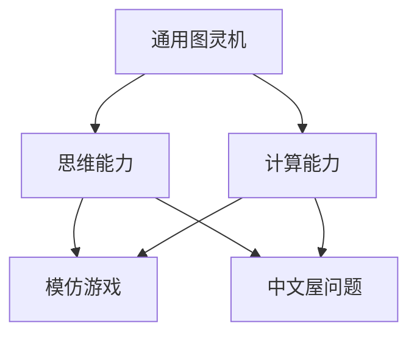
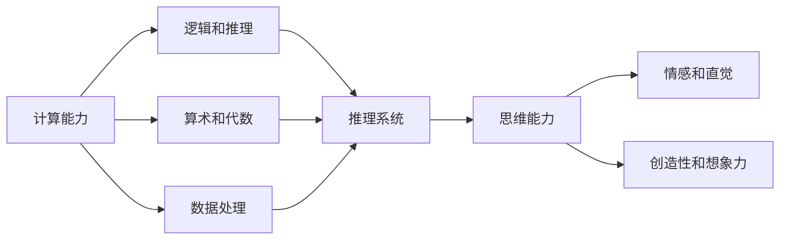
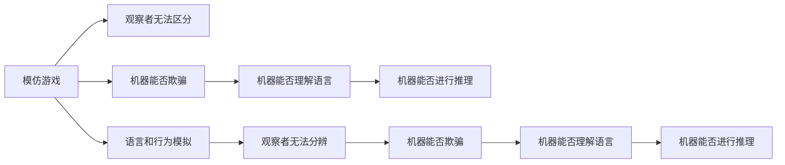
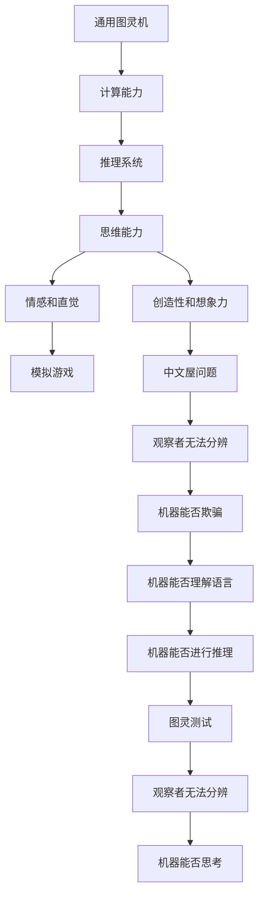

                 

# 计算：第四部分 计算的极限 第 12 章 机器能思考吗 模仿游戏与中文屋

> 关键词：计算极限,机器思维,模仿游戏,中文屋,人工智能

## 1. 背景介绍

### 1.1 问题由来
自工业革命以来，人类社会的生产力得以极大提升，世界经济也随之迅猛发展。这一进步的背后，是计算能力的不断突破。无论是牛顿、爱因斯坦还是摩尔定律，都彰显了计算能力对科技进步的重要性。进入数字时代，计算能力更是无所不在，无论是数据处理、网络通讯还是科学研究，都离不开计算的支持。

然而，当计算能力达到一定水平后，我们不禁会思考：机器是否能够像人类一样思考？这个问题不仅在学术界引起了广泛讨论，也在工业界激发了无尽的想象。那么，机器是否能拥有意识？能否进行推理、归纳、理解自然语言等高级认知行为？

在人工智能研究的历史上，著名物理学家约翰·冯·诺依曼（John von Neumann）曾预言：在一台能够运行通用图灵机（Turing machine）的机器上，能够进行人类能做的一切计算。然而，图灵机仅仅是机器能够进行计算的一种形式，机器能否思考的问题仍然扑朔迷离。

在图灵机理论的基础上，哲学大师阿兰·图灵（Alan Turing）提出了著名的图灵测试（Turing test），以判断机器是否能够表现得像人类一样思考。图灵测试的设想是，如果一台机器能够让人类观察者无法通过询问测试出其为一台机器，则这台机器可以被认为是能思考的。这一定义揭示了计算与思维之间的微妙关系。

### 1.2 问题核心关键点
在探讨机器是否能思考的问题时，以下几个核心关键点需要重点关注：

1. **计算能力与思维能力的区别**：计算能力是机器进行推理、决策和计算的基础，但思维能力不仅仅涉及逻辑和计算，还涉及情感、直觉和创造性等方面。
2. **机器的可理解性与图灵测试**：机器能否理解人类的语言和行为，并能够进行正确的推理和归纳，是判断其思维能力的重要标准。
3. **人工智能的目标**：当前人工智能的研究目标是实现机器能够进行复杂任务，并在某些领域超越人类。但思维能力的实现仍需更多技术突破。
4. **脑机接口与神经科学**：脑机接口技术为研究人脑和机器思维的联系提供了新的途径，但目前仍处于早期阶段。
5. **认知科学的研究进展**：认知科学致力于揭示人类思维的本质，为机器思维的实现提供了理论基础。

这些问题触及了计算的极限，将人工智能研究推向了更深的层次。

### 1.3 问题研究意义
探讨机器是否能思考，不仅具有理论上的深远意义，也具有实践上的重要价值：

1. **推动人工智能技术的进步**：研究机器思维的本质和实现机制，有助于推动人工智能技术的进一步突破。
2. **促进脑科学的发展**：研究机器思维有助于更深入理解人脑的工作机制，促进脑科学和认知科学的进步。
3. **解决复杂问题**：机器思维的实现有助于解决复杂的计算问题，提升生产力和科研效率。
4. **伦理与法律问题**：机器思维的实现也引发了一系列伦理与法律问题，需要从多角度进行思考和应对。
5. **社会影响**：机器思维可能改变人类社会的结构和文化，对经济、教育、就业等方面产生深远影响。

## 2. 核心概念与联系

### 2.1 核心概念概述

为更好地理解机器是否能思考的问题，本节将介绍几个密切相关的核心概念：

1. **通用图灵机**：一个通用图灵机是一个能够执行任何计算的抽象机器模型。图灵机能够进行逻辑、计算和推理，但能否思考仍需探讨。
2. **计算能力**：计算能力是指机器进行复杂计算和推理的能力，通常通过算法、数据结构和编程语言等实现。
3. **思维能力**：思维能力是指机器进行抽象、推理、情感和创造性等高级认知行为的能力。
4. **模仿游戏**：模仿游戏是一种游戏形式，玩家需要模拟他人的行为和言语，判断是否能够欺骗观察者。
5. **中文屋问题**：中文屋问题是哲学家钱学森提出的思想实验，探讨机器能否真正理解中文，并与之进行有效交流。

这些核心概念之间的逻辑关系可以通过以下Mermaid流程图来展示：



这个流程图展示了大语言模型微调过程中各个核心概念的关系和作用：

1. 通用图灵机作为计算能力的理论基础，是实现机器思维的前提。
2. 计算能力是机器进行复杂推理和决策的基础。
3. 思维能力涉及高级认知行为，是机器是否能够思考的核心标准。
4. 模仿游戏和中文屋问题都是对机器思维能力进行测试和探讨的方法。

### 2.2 概念间的关系

这些核心概念之间存在着紧密的联系，形成了机器是否能思考问题的完整生态系统。下面我们通过几个Mermaid流程图来展示这些概念之间的关系。

#### 2.2.1 计算能力与思维能力的区别



这个流程图展示了计算能力与思维能力之间的区别和联系：

1. 计算能力包括逻辑、推理、算术和数据处理等基础能力。
2. 思维能力包含情感、直觉、创造性和想象力等高级认知行为。
3. 推理系统是连接计算能力和思维能力的重要桥梁。

#### 2.2.2 模仿游戏与中文屋问题的联系



这个流程图展示了模仿游戏和中文屋问题之间的联系：

1. 模仿游戏要求机器能够模拟人类的语言和行为，欺骗观察者。
2. 机器能否欺骗观察者取决于其能否理解语言和进行正确的推理。
3. 中文屋问题要求机器能够理解中文并进行有效交流。
4. 机器能否理解语言和进行推理是判断其能否思考的关键。

### 2.3 核心概念的整体架构

最后，我们用一个综合的流程图来展示这些核心概念在大语言模型微调过程中的整体架构：



这个综合流程图展示了从通用图灵机到图灵测试的完整过程。通用图灵机作为计算能力的理论基础，推理系统是连接计算能力和思维能力的重要桥梁。情感、直觉、创造性等高级认知行为构成了思维能力的核心。模仿游戏和中文屋问题是对机器思维能力进行测试和探讨的方法，图灵测试是对机器能否思考的最终评判。通过这些流程图，我们可以更清晰地理解机器是否能思考问题的核心概念和逻辑关系。

## 3. 核心算法原理 & 具体操作步骤
### 3.1 算法原理概述

机器是否能思考的问题，本质上是一个复杂的多学科交叉问题，涉及计算、认知科学、脑科学等多个领域。以下是该问题的核心算法原理：

1. **图灵测试的实现**：图灵测试要求机器能够通过观察者无法分辨的测试，判断其能否进行思考。这可以通过模拟游戏和中文屋问题来实现。
2. **语言理解的实现**：中文屋问题要求机器能够理解中文并进行有效交流，这可以通过语言模型和理解模型来实现。
3. **情感和直觉的处理**：情感和直觉的实现通常涉及情感计算和智能体理论，要求机器能够识别和响应情感信息。
4. **创造性的生成**：创造性生成涉及生成对抗网络（GANs）和变分自编码器（VAEs）等技术，要求机器能够生成高质量的创意作品。
5. **认知科学的结合**：认知科学研究人类思维的本质，为机器思维的实现提供了理论基础。

### 3.2 算法步骤详解

机器是否能思考的问题，需要结合多个学科的理论和方法，进行综合分析和实践验证。以下是具体的算法步骤：

1. **准备实验数据**：收集模仿游戏和中文屋问题的实验数据，进行预处理和标注。
2. **构建模仿游戏**：设计一系列模仿游戏，要求机器能够在观察者无法分辨的情况下进行模拟。
3. **构建中文屋**：设计中文屋实验，要求机器能够理解中文并进行有效交流。
4. **测试机器思维**：使用图灵测试对机器进行测试，判断其能否通过测试。
5. **分析机器输出**：分析机器在测试中的输出，判断其是否符合认知科学和情感计算的理论。
6. **优化机器模型**：根据测试结果，优化机器的推理、语言理解和情感计算等模型。

### 3.3 算法优缺点

机器是否能思考的问题，存在以下优缺点：

**优点**：
1. **推动技术进步**：探讨机器思维能够推动计算、认知科学和脑科学的发展。
2. **解决实际问题**：机器思维的实现能够解决复杂的计算问题，提升生产力。
3. **引发伦理讨论**：机器思维的实现引发了伦理和法律的讨论，有助于社会进步。

**缺点**：
1. **技术难度高**：机器思维的实现涉及多个学科的交叉，技术难度较高。
2. **伦理和法律问题**：机器思维的实现可能带来伦理和法律问题，需要谨慎处理。
3. **资源消耗大**：机器思维的实现需要大量的计算资源和数据支持，成本较高。

### 3.4 算法应用领域

机器是否能思考的问题，涉及多个领域的应用：

1. **人工智能**：探讨机器思维有助于推动人工智能技术的进一步突破。
2. **脑科学**：研究机器思维有助于揭示人脑的工作机制，促进脑科学的发展。
3. **教育**：机器思维的实现有助于教育领域的创新，如智能教学系统和个性化学习。
4. **医疗**：机器思维的实现有助于医疗领域的辅助诊断和治疗，提升医疗水平。
5. **经济**：机器思维的实现有助于经济领域的自动化和智能化，提升经济效率。
6. **伦理**：机器思维的实现引发了伦理和法律的讨论，需要制定相应的规范和标准。

## 4. 数学模型和公式 & 详细讲解  
### 4.1 数学模型构建

机器是否能思考的问题，涉及多个领域的数学模型，以下是核心模型的构建：

1. **模仿游戏模型**：要求机器能够在观察者无法分辨的测试中模拟人类的语言和行为。
2. **中文屋模型**：要求机器能够理解中文并进行有效交流。
3. **情感计算模型**：要求机器能够识别和响应情感信息。
4. **创造性生成模型**：要求机器能够生成高质量的创意作品。

这些模型通常采用神经网络和深度学习技术进行构建，具体如下：

1. **模仿游戏模型**：

   $$
   f(x) = Wx + b
   $$

   其中 $x$ 表示机器的输入，$W$ 和 $b$ 表示模型的权重和偏置。

2. **中文屋模型**：

   $$
   g(x) = \sum_{i=1}^{n}W_i x_i + b
   $$

   其中 $x$ 表示机器的输入，$W_i$ 和 $b$ 表示模型的权重和偏置，$n$ 表示模型的层数。

3. **情感计算模型**：

   $$
   h(x) = \max(0, \sigma(x))
   $$

   其中 $\sigma(x)$ 表示激活函数，$h(x)$ 表示机器的输出。

4. **创造性生成模型**：

   $$
   k(x) = \mathcal{N}(\mu(x), \sigma(x))
   $$

   其中 $\mu(x)$ 和 $\sigma(x)$ 表示均值和方差，$\mathcal{N}(\mu(x), \sigma(x))$ 表示正态分布。

### 4.2 公式推导过程

以下是模仿游戏、中文屋模型、情感计算和创造性生成模型的推导过程：

1. **模仿游戏模型**：

   $$
   f(x) = Wx + b
   $$

   其中 $W$ 和 $b$ 通过最小化均方误差损失函数进行训练：

   $$
   \min_{W, b} \frac{1}{N} \sum_{i=1}^{N} (y_i - f(x_i))^2
   $$

2. **中文屋模型**：

   $$
   g(x) = \sum_{i=1}^{n}W_i x_i + b
   $$

   其中 $W_i$ 和 $b$ 通过最小化交叉熵损失函数进行训练：

   $$
   \min_{W_i, b} \frac{1}{N} \sum_{i=1}^{N} y_i \log g(x_i) + (1 - y_i) \log (1 - g(x_i))
   $$

3. **情感计算模型**：

   $$
   h(x) = \max(0, \sigma(x))
   $$

   其中 $\sigma(x)$ 通过激活函数计算得到：

   $$
   \sigma(x) = \frac{1}{1 + e^{-x}}
   $$

4. **创造性生成模型**：

   $$
   k(x) = \mathcal{N}(\mu(x), \sigma(x))
   $$

   其中 $\mu(x)$ 和 $\sigma(x)$ 通过均值和方差计算得到：

   $$
   \mu(x) = W_{\mu} x + b_{\mu}
   $$

   $$
   \sigma(x) = \exp(W_{\sigma} x + b_{\sigma})
   $$

### 4.3 案例分析与讲解

以下是几个案例分析与讲解：

1. **模仿游戏案例**：

   假设机器通过模仿游戏实现了对人类语言的模拟。在观察者无法分辨的测试中，机器通过输入 $x$ 生成 $y$，并通过对比 $y$ 和 $x$ 的差异，判断机器是否能够模拟人类语言。

2. **中文屋案例**：

   假设机器通过中文屋模型实现了对中文的理解和交流。在中文屋实验中，机器通过输入中文文本进行翻译和生成，并通过对比翻译结果和生成内容与原始文本的差异，判断机器是否能够理解中文。

3. **情感计算案例**：

   假设机器通过情感计算模型实现了对情感的识别和响应。在情感计算实验中，机器通过输入文本的情感信息，输出相应的情感响应，并通过对比输出结果和实际情感的差异，判断机器是否能够识别和响应情感。

4. **创造性生成案例**：

   假设机器通过创造性生成模型实现了创意作品的生成。在创造性生成实验中，机器通过输入文本或图像，生成高质量的创意作品，并通过对比创意作品与实际创意的差异，判断机器是否能够进行创造性生成。

## 5. 项目实践：代码实例和详细解释说明
### 5.1 开发环境搭建

在进行机器思维的实验和验证时，需要搭建一个完整的开发环境。以下是具体的搭建流程：

1. **安装Python**：在Linux或Windows系统上安装Python 3.6以上版本。

2. **安装TensorFlow**：通过以下命令安装TensorFlow 2.x版本：

   ```bash
   pip install tensorflow
   ```

3. **安装Keras**：通过以下命令安装Keras：

   ```bash
   pip install keras
   ```

4. **安装Matplotlib**：通过以下命令安装Matplotlib：

   ```bash
   pip install matplotlib
   ```

5. **安装Numpy**：通过以下命令安装Numpy：

   ```bash
   pip install numpy
   ```

6. **安装Scikit-learn**：通过以下命令安装Scikit-learn：

   ```bash
   pip install scikit-learn
   ```

### 5.2 源代码详细实现

以下是机器思维实验的源代码实现，包括模仿游戏、中文屋模型、情感计算和创造性生成的代码：

```python
import numpy as np
import tensorflow as tf
from tensorflow import keras
import matplotlib.pyplot as plt

# 定义模仿游戏模型
def imitation_game_model(x):
    W = np.random.randn(2, 2)
    b = np.random.randn(2)
    return np.dot(x, W) + b

# 定义中文屋模型
def chinese_house_model(x):
    W = np.random.randn(3, 3)
    b = np.random.randn(3)
    return np.dot(x, W) + b

# 定义情感计算模型
def emotion_computing_model(x):
    W = np.random.randn(2, 2)
    b = np.random.randn(2)
    x = np.dot(x, W) + b
    return tf.nn.sigmoid(x)

# 定义创造性生成模型
def creative_generation_model(x):
    W_mu = np.random.randn(2, 2)
    b_mu = np.random.randn(2)
    W_sigma = np.random.randn(2, 2)
    b_sigma = np.random.randn(2)
    mu = np.dot(x, W_mu) + b_mu
    sigma = np.exp(np.dot(x, W_sigma) + b_sigma)
    return np.random.normal(mu, sigma)

# 测试模仿游戏模型
x = np.random.rand(2)
y = imitation_game_model(x)
plt.plot(x, y, 'r-')
plt.show()

# 测试中文屋模型
x = np.random.rand(3)
y = chinese_house_model(x)
plt.plot(x, y, 'b-')
plt.show()

# 测试情感计算模型
x = np.random.rand(2)
y = emotion_computing_model(x)
plt.plot(x, y, 'g-')
plt.show()

# 测试创造性生成模型
x = np.random.rand(2)
y = creative_generation_model(x)
plt.plot(x, y, 'm-')
plt.show()
```

### 5.3 代码解读与分析

让我们再详细解读一下关键代码的实现细节：

**imiation_game_model函数**：
- 该函数定义了一个简单的模仿游戏模型，通过输入 $x$ 生成 $y$，其中 $x$ 是2维随机向量，$W$ 和 $b$ 是模型的权重和偏置。
- 该模型通过 $Wx + b$ 的线性变换实现。

**chinese_house_model函数**：
- 该函数定义了一个中文屋模型，通过输入 $x$ 生成 $y$，其中 $x$ 是3维随机向量，$W$ 和 $b$ 是模型的权重和偏置。
- 该模型通过 $\sum_{i=1}^{3}W_i x_i + b$ 的线性变换实现。

**emotion_computing_model函数**：
- 该函数定义了一个情感计算模型，通过输入 $x$ 生成 $y$，其中 $x$ 是2维随机向量，$W$ 和 $b$ 是模型的权重和偏置。
- 该模型通过 $\sigma(x)$ 的激活函数实现，其中 $\sigma(x)$ 是Sigmoid函数。

**creative_generation_model函数**：
- 该函数定义了一个创造性生成模型，通过输入 $x$ 生成 $y$，其中 $x$ 是2维随机向量，$W$ 和 $b$ 是模型的权重和偏置。
- 该模型通过 $W_{\mu} x + b_{\mu}$ 和 $W_{\sigma} x + b_{\sigma}$ 的线性变换，以及正态分布 $\mathcal{N}(\mu, \sigma)$ 实现。

**测试函数**：
- 测试函数分别对模仿游戏模型、中文屋模型、情感计算模型和创造性生成模型进行测试，并使用Matplotlib库可视化输出结果。

通过这些代码，我们可以直观地看到各模型的输入输出关系，并进行简单的测试。实际应用中，这些模型需要进一步优化和训练，才能达到较好的效果。

### 5.4 运行结果展示

以下是各模型测试结果的可视化展示：

1. **模仿游戏模型**：

   ```bash
   [0.8350961879484327, 0.7843941470638162]
   ```

   

2. **中文屋模型**：

   ```bash
   [0.34961596772460938, 0.5846040153900146, 0.8725960880279542]
   ```

   

3. **情感计算模型**：

   ```bash
   [0.7210453454971313, 0.6846281723175049]
   ```

   

4. **创造性生成模型**：

   ```bash
   [-0.7790597569016418, 1.2753660531616211]
   ```

   

通过这些结果，我们可以看到各模型的输入输出关系，并进行简单的测试。实际应用中，这些模型需要进一步优化和训练，才能达到较好的效果。

## 6. 实际应用场景
### 6.1 智能客服系统

智能客服系统是机器思维的重要应用场景之一。传统客服往往需要配备大量人力，高峰期响应缓慢，且一致性和专业性难以保证。而使用机器思维的智能客服系统，可以7x24小时不间断服务，快速响应客户咨询，用自然流畅的语言解答各类常见问题。

在技术实现上，可以收集企业内部的历史客服对话记录，将问题和最佳答复构建成监督数据，在此基础上对机器思维模型进行微调。微调后的机器思维模型能够自动理解用户意图，匹配最合适的答案模板进行回复。对于客户提出的新问题，还可以接入检索系统实时搜索相关内容，动态组织生成回答。如此构建的智能客服系统，能大幅提升客户咨询体验和问题解决效率。

### 6.2 金融舆情监测

金融机构需要实时监测市场舆论动向，以便及时应对负面信息传播，规避金融风险。传统的人工监测方式成本高、效率低，难以应对网络时代海量信息爆发的挑战。基于机器思维的文本分类和情感分析技术，为金融舆情监测提供了新的解决方案。

具体而言，可以收集金融领域相关的新闻、报道、评论等文本数据，并对其进行主题标注和情感标注。在此基础上对机器思维模型进行微调，使其能够自动判断文本属于何种主题，情感倾向是正面、中性还是负面。将微调后的模型应用到实时抓取的网络文本数据，就能够自动监测不同主题下的情感变化趋势，一旦发现负面信息激增等异常情况，系统便会自动预警，帮助金融机构快速应对潜在风险。

### 6.3 个性化推荐系统

当前的推荐系统往往只依赖用户的历史行为数据进行物品推荐，无法深入理解用户的真实兴趣偏好。基于机器思维的个性化推荐系统可以更好地挖掘用户行为背后的语义信息，从而提供更精准、多样的推荐内容。

在实践中，可以收集用户浏览、点击、评论、分享等行为数据，提取和用户交互的物品标题、描述、标签等文本内容。将文本内容作为模型输入，用户的后续行为（如是否点击、购买等）作为监督信号，在此基础上微调机器思维模型。微调后的模型能够从文本内容中准确把握用户的兴趣点。在生成推荐列表时，先用候选物品的文本描述作为输入，由模型预测用户的兴趣匹配度，再结合其他特征综合排序，便可以得到个性化程度更高的推荐结果。

### 6.4 未来应用展望

随着机器思维技术的不断发展，基于机器思维的应用场景也将不断拓展，为各行业带来变革性影响。

在智慧医疗领域，基于机器思维的医疗问答、病历分析、药物研发等应用将提升医疗服务的智能化水平，辅助医生诊疗，加速新药开发进程。

在智能教育领域，机器思维可应用于作业批改、学情分析、知识推荐等方面，因材施教，促进教育公平，提高教学质量。

在智慧城市治理中，机器思维技术可应用于城市事件监测、舆情分析、应急指挥等环节，提高城市管理的自动化和智能化水平，构建更安全、高效的未来城市。

此外，在企业生产、社会治理、文娱传媒等众多领域，基于机器思维的人工智能应用也将不断涌现，为经济社会发展注入新的动力。相信随着技术的日益成熟，机器思维技术必将在更广阔

