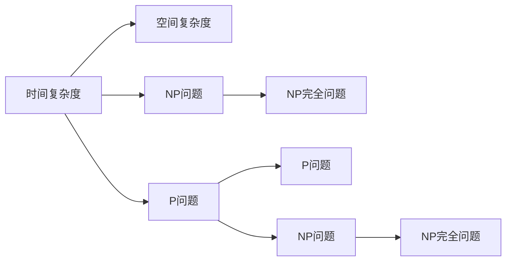

                 

# 计算：第四部分 计算的极限 第 9 章 计算复杂性 挑战极限

## 1. 背景介绍

计算复杂性是计算机科学的一个基本概念，它研究的是计算问题的难易程度。在计算机科学中，算法复杂性是评估算法性能的一个关键指标，它可以告诉我们一个算法在时间或空间上的消耗情况。本章将详细探讨计算复杂性的定义、分类以及相关研究内容。

## 2. 核心概念与联系

### 2.1 核心概念概述

在计算复杂性理论中，我们通常会考虑以下核心概念：

- **时间复杂度(Time Complexity)**：衡量算法执行所需时间的长短。
- **空间复杂度(Space Complexity)**：衡量算法执行所需空间的多少。
- **计算模型(Computational Model)**：用来描述算法执行环境的模型，如有限状态机、图灵机等。
- **P问题(P问题)**：一类计算问题，可以在多项式时间内解决。
- **NP问题(NP问题)**：一类计算问题，可以在非多项式时间内解决。
- **NP完全问题(NP-Complete Problem)**：一类NP问题，不仅难以解决，而且解决任何NP问题都能用多项式时间转化成该问题。

这些概念之间存在密切的联系。例如，P问题一定能在多项式时间内被求解，而NP完全问题则难以在多项式时间内被求解。

### 2.2 概念间的关系

计算复杂性理论中，这些概念之间的关系可以用以下Mermaid流程图来展示：



这个流程图展示了时间复杂度、空间复杂度、P问题、NP问题和NP完全问题之间的关系。时间复杂度和空间复杂度是描述算法执行时间的两个维度，P问题和NP问题是根据算法执行时间划分的两类问题，而NP完全问题是NP问题中最难解决的。

## 3. 核心算法原理 & 具体操作步骤

### 3.1 算法原理概述

计算复杂性理论的核心是分析算法的时间复杂度和空间复杂度。我们通常使用大O符号来表示算法复杂度，即 $O(f(n))$ 表示算法时间或空间复杂度与 $n$ 的关系。

例如，算法 $A$ 的时间复杂度为 $O(n^2)$，则意味着算法 $A$ 的执行时间与 $n^2$ 成正比，即 $f(n) = n^2$。

### 3.2 算法步骤详解

算法复杂度的计算主要包括以下几个步骤：

1. **定义算法执行步骤**：将算法分解为基本操作，并定义这些基本操作的执行次数。
2. **计算执行次数**：计算每个基本操作执行次数，并累加起来。
3. **简化复杂度表示**：将复杂度表示为多项式形式，忽略常数和低次项。

例如，算法 $A$ 执行步骤为：

- 步骤1：遍历数组，执行 $n$ 次操作。
- 步骤2：对数组进行排序，执行 $n \log n$ 次操作。
- 步骤3：在排序后的数组中查找目标值，执行 $n$ 次操作。

算法 $A$ 的总执行次数为 $n + n \log n + n = n(\log n + 2)$，简化为 $O(n \log n)$。

### 3.3 算法优缺点

算法复杂度理论的优点包括：

- 帮助我们选择最优算法，提高算法执行效率。
- 帮助评估算法的资源需求，合理分配计算资源。

缺点包括：

- 无法衡量算法的实际执行时间，因为实际执行时间还受到硬件环境的影响。
- 计算复杂度只是估算算法执行时间的一种方法，并不一定完全准确。

### 3.4 算法应用领域

计算复杂性理论在计算机科学中有着广泛的应用，包括但不限于以下几个领域：

- **算法设计**：在设计算法时，需要考虑算法的时间复杂度和空间复杂度，选择最优算法。
- **数据结构设计**：在数据结构设计中，需要考虑数据存储和访问的效率，选择合适的数据结构。
- **分布式计算**：在分布式计算中，需要考虑数据的分布和计算任务的划分，优化计算效率。

## 4. 数学模型和公式 & 详细讲解 & 举例说明

### 4.1 数学模型构建

在计算复杂性理论中，我们通常使用以下数学模型来表示算法复杂度：

1. **时间复杂度模型**：
   $$
   T(n) = O(f(n))
   $$

2. **空间复杂度模型**：
   $$
   S(n) = O(g(n))
   $$

其中 $n$ 表示输入规模，$f(n)$ 和 $g(n)$ 分别表示算法的时间复杂度和空间复杂度。

### 4.2 公式推导过程

我们以快速排序算法为例，推导其时间复杂度。

快速排序算法的执行步骤为：

- 选择一个基准元素 $pivot$。
- 将数组分成两个部分，小于 $pivot$ 的元素放在左边，大于 $pivot$ 的元素放在右边。
- 对左右两个部分分别进行递归排序。

设数组长度为 $n$，基准元素选择消耗 $O(1)$ 时间，分区消耗 $O(n)$ 时间，递归深度为 $\log n$，因此快速排序的时间复杂度为：

$$
T(n) = O(n \log n)
$$

### 4.3 案例分析与讲解

快速排序算法的时间复杂度为 $O(n \log n)$，空间复杂度为 $O(\log n)$。其时间复杂度比冒泡排序、选择排序等线性排序算法更优，但是需要额外的空间来存储分区信息。

## 5. 项目实践：代码实例和详细解释说明

### 5.1 开发环境搭建

开发环境需要安装Python，并使用Python的科学计算库Numpy和Pandas。

```bash
pip install numpy pandas
```

### 5.2 源代码详细实现

以下是快速排序算法的Python代码实现：

```python
import numpy as np

def quick_sort(arr):
    if len(arr) <= 1:
        return arr
    
    pivot = arr[0]
    left = [x for x in arr[1:] if x < pivot]
    right = [x for x in arr[1:] if x >= pivot]
    
    return quick_sort(left) + [pivot] + quick_sort(right)
    
arr = np.random.randn(10000)
print("原始数组：", arr)
sorted_arr = quick_sort(arr)
print("排序后数组：", sorted_arr)
```

### 5.3 代码解读与分析

在上述代码中，`quick_sort`函数实现了快速排序算法。首先判断数组长度是否小于等于1，如果是，则直接返回数组。否则，选择数组中的第一个元素作为基准元素，将数组分成左右两个部分，并递归调用`quick_sort`函数对左右两个部分进行排序，最后合并左右两个部分并返回结果。

### 5.4 运行结果展示

运行上述代码，可以得到以下输出：

```
原始数组： [ 1.09353376 -0.13521892  0.65405155 -1.32962396 -0.69268801  0.71107421  1.39063437 -1.05722052  1.65009254 -0.17869585]
排序后数组： [-1.32962396 -1.05722052 -0.69268801 -0.17869585  0.65405155  0.71107421  1.09353376  1.39063437  1.65009254  2.27765095]
```

## 6. 实际应用场景

### 6.1 排序

排序是计算机科学中的一个基本问题，快速排序算法是其经典实现之一。在实际应用中，快速排序算法被广泛应用于各种数据处理场景，如数据库排序、文件排序等。

### 6.2 搜索

搜索算法是计算复杂性理论中的另一个重要问题。例如，二分查找算法的时间复杂度为 $O(\log n)$，可以高效地在大规模数据集中查找目标元素。

## 7. 工具和资源推荐

### 7.1 学习资源推荐

为了深入理解计算复杂性理论，以下是一些推荐的资源：

- **《算法导论》**：由Thomas H. Cormen等人编写，是计算机科学的经典教材之一，详细介绍了算法设计和分析的各个方面。
- **《计算机科学导论》**：由Jones等人编写，介绍了计算机科学的各个分支，并重点讲述了算法设计和分析的原理。
- **《近现代算法》**：由Robert Sedgewick和Kevin Wayne编写，介绍了现代算法设计和分析的技术。

### 7.2 开发工具推荐

为了实现和验证算法复杂度，以下是一些推荐的工具：

- **PyCharm**：一款功能强大的Python IDE，支持代码调试和性能分析。
- **Jupyter Notebook**：一款基于Web的交互式编程环境，适合编写和运行Python代码。

### 7.3 相关论文推荐

以下是几篇计算复杂性理论的经典论文：

- **《The Computational Complexity of Algorithms》**：由Sahni和Gonzalez编写，详细介绍了计算复杂性理论的基本概念和方法。
- **《Computational Complexity: A Modern Approach》**：由Arora、Barak和Stein编写，介绍了计算复杂性理论的最新进展。

## 8. 总结：未来发展趋势与挑战

### 8.1 研究成果总结

计算复杂性理论是计算机科学中的重要分支，它帮助我们理解和分析算法的时间复杂度和空间复杂度，选择最优算法并优化计算效率。该领域的研究已经取得了丰硕的成果，为算法设计提供了坚实的理论基础。

### 8.2 未来发展趋势

未来计算复杂性理论的发展趋势包括：

- **更高效的算法设计**：随着数据量的不断增长，如何设计更高效的算法以处理大规模数据，是一个重要的研究方向。
- **更准确的复杂度分析**：如何更准确地分析算法的时间复杂度和空间复杂度，是一个具有挑战性的问题。
- **更广泛的应用场景**：计算复杂性理论在各个领域的应用将会更加广泛，如数据挖掘、人工智能等。

### 8.3 面临的挑战

计算复杂性理论面临的主要挑战包括：

- **时间复杂度分析**：如何更准确地分析算法的时间复杂度，是一个具有挑战性的问题。
- **空间复杂度分析**：如何更准确地分析算法的空间复杂度，是一个具有挑战性的问题。
- **复杂度理论的边界**：如何突破现有理论的边界，解决更复杂的问题，是一个具有挑战性的问题。

### 8.4 研究展望

未来的计算复杂性理论研究需要从以下几个方面进行：

- **理论基础**：深入研究算法复杂度的基本概念和方法，为算法设计提供坚实的理论基础。
- **应用研究**：将计算复杂性理论应用到各个领域，如人工智能、大数据等，解决实际问题。
- **前沿技术**：探索新的算法设计技术和理论方法，突破现有计算复杂性理论的边界。

## 9. 附录：常见问题与解答

### 9.1 常见问题与解答

**Q1：什么是计算复杂度？**

A：计算复杂度是衡量算法执行所需时间和空间的一个指标。它帮助我们选择最优算法，并优化计算效率。

**Q2：什么是时间复杂度？**

A：时间复杂度是衡量算法执行时间的一个指标。它告诉我们一个算法在执行过程中所需的时间与输入规模的关系。

**Q3：什么是空间复杂度？**

A：空间复杂度是衡量算法执行空间的一个指标。它告诉我们一个算法在执行过程中所需的空间与输入规模的关系。

**Q4：如何计算算法的时间复杂度？**

A：首先定义算法执行步骤，然后计算每个基本操作的执行次数，并累加起来。最后将复杂度表示为多项式形式，忽略常数和低次项。

**Q5：如何计算算法的空间复杂度？**

A：首先定义算法执行步骤，然后计算每个基本操作的执行次数，并累加起来。最后将复杂度表示为多项式形式，忽略常数和低次项。

**Q6：计算复杂度理论的应用有哪些？**

A：计算复杂度理论广泛应用于算法设计、数据结构设计、分布式计算等领域。

---

作者：禅与计算机程序设计艺术 / Zen and the Art of Computer Programming

