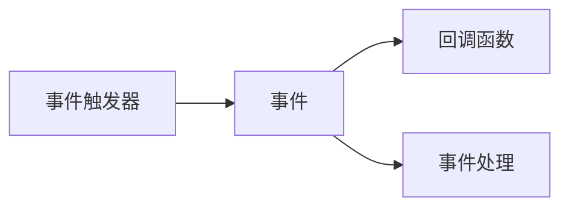

                 

# 【LangChain编程：从入门到实践】回调机制

在构建智能交互系统、尤其是开发基于聊天机器人的应用时，回调机制是一个至关重要的组成部分。本文将详细探讨回调机制的原理、实现方式及其在实际项目中的具体应用。从理解基础概念到实践中的关键细节，我们将一步步引领读者深入回调机制的世界，并展示其如何为开发高效的交互应用提供强有力的支撑。

## 1. 背景介绍

回调机制在自然语言处理（NLP）和人工智能（AI）中扮演着重要角色，尤其在开发对话系统和智能代理时。通过回调，程序能够在特定事件发生时执行预定义的动作或响应，极大地提升了系统的交互性和响应速度。然而，理解回调机制的原理和应用却并不容易，尤其对于初学者而言。因此，本文旨在全面介绍回调机制，帮助开发者快速入门并有效应用回调技术，以构建更高质量和互动性更强的智能应用。

## 2. 核心概念与联系

### 2.1 核心概念概述

回调（Callback）通常是指在事件触发时，程序通过特定函数或方法响应这一事件。在编程中，回调机制允许函数在执行期间暂停，并在特定条件满足时恢复执行，从而提供了一种灵活、可扩展的编程方式。

在聊天机器人的开发中，回调机制可以处理用户输入、系统状态变化等事件，使得系统能够动态调整其行为和策略，更好地满足用户需求。例如，当用户询问天气信息时，系统可以通过回调机制调用天气查询API，并动态更新对话内容。

### 2.2 核心概念间的关系

回调机制的核心概念主要包括事件触发、事件处理、事件触发器和回调函数等。下面使用Mermaid流程图来展示这些概念之间的联系：



其中：

- A：事件触发器，负责检测特定事件的发生。
- B：事件，由事件触发器检测到的特定行为或状态变化。
- C：回调函数，在事件发生时执行的特定操作或逻辑。
- D：事件处理，对事件进行的具体操作或响应。

这个简单的流程图示意了事件触发器如何检测到事件，并调用回调函数来处理这些事件，最终实现特定的系统行为或响应。

## 3. 核心算法原理 & 具体操作步骤

### 3.1 算法原理概述

回调机制的核心算法原理涉及事件触发、事件处理和回调函数等基本概念。当一个事件发生时，事件触发器会检测到这一事件，并根据预定义的回调函数来处理事件。事件处理过程通常包括以下步骤：

1. **事件检测**：检测到特定事件的发生。
2. **回调函数调用**：根据事件类型调用相应的回调函数。
3. **事件处理**：回调函数执行特定操作或逻辑，处理事件。

这一过程可以用流程图表示如下：


### 3.2 算法步骤详解

实现回调机制的步骤通常包括以下几个方面：

1. **定义事件触发器**：实现一个能够检测特定事件发生的方法或类，通常使用定时器、消息队列等机制。
2. **定义回调函数**：编写特定的事件处理函数，这些函数在事件发生时被调用。
3. **绑定事件和回调函数**：将特定事件与对应的回调函数进行绑定。
4. **事件触发与处理**：事件发生时，触发器检测到事件并调用相应的回调函数来处理。

### 3.3 算法优缺点

回调机制的优点包括：

- **灵活性**：通过回调函数，程序可以在不同条件下执行不同逻辑，提高了系统的灵活性和可扩展性。
- **响应性**：事件驱动的回调机制使得系统能够及时响应各种突发事件，提升用户体验。
- **可扩展性**：新的事件和回调函数可以动态添加，扩展系统的功能。

然而，回调机制也存在一些缺点：

- **复杂性**：回调机制增加了代码的复杂性，需要开发者对事件和回调有深入理解。
- **潜在的问题**：回调函数在执行过程中可能出现阻塞，导致系统响应变慢或死锁。
- **维护成本**：随着系统复杂性的增加，维护和调试回调机制的成本也随之增加。

### 3.4 算法应用领域

回调机制在NLP和AI领域有着广泛的应用，具体包括：

- **对话系统**：用于处理用户的输入和响应，提升对话流畅性和自然性。
- **智能推荐系统**：根据用户的交互行为，动态调整推荐策略。
- **自然语言处理**：处理文本分类、情感分析等任务，提升处理效率和准确性。
- **机器学习**：用于训练过程中事件监测，及时调整学习策略。

## 4. 数学模型和公式 & 详细讲解 & 举例说明

### 4.1 数学模型构建

为了更好地理解回调机制，我们以简单的对话系统为例，构建一个数学模型。假设我们有一个基本的对话系统，它包含一个回调函数 `on_message`，用于处理用户输入。

### 4.2 公式推导过程

1. **事件检测模型**：事件触发器检测到用户输入时，触发事件 `message`，并调用 `on_message` 回调函数。

   $$
   \text{Event Detection} = \begin{cases} 
   \text{True}, & \text{当检测到用户输入} \\
   \text{False}, & \text{其他情况}
   \end{cases}
   $$

2. **回调函数调用模型**：当事件发生时，调用 `on_message` 函数来处理。

   $$
   \text{Callback Function Call} = \begin{cases} 
   \text{on\_message}, & \text{当事件发生} \\
   \text{无操作}, & \text{其他情况}
   \end{cases}
   $$

3. **事件处理模型**：`on_message` 函数根据用户输入执行特定逻辑，返回响应。

   $$
   \text{Event Handling} = \begin{cases} 
   \text{处理用户输入}, & \text{当调用 `on\_message`} \\
   \text{无操作}, & \text{其他情况}
   \end{cases}
   $$

### 4.3 案例分析与讲解

假设我们有一个简单的聊天机器人，用户可以输入“天气”、“新闻”等指令。当用户输入“天气”时，回调函数将调用天气查询API，并将查询结果返回给用户。

**示例代码**：

```python
class ChatBot:
    def __init__(self):
        self._bot = None
    
    def initialize_bot(self, bot):
        self._bot = bot
    
    def on_message(self, message):
        if message.lower() == "天气":
            response = self._bot.query_weather()
        elif message.lower() == "新闻":
            response = self._bot.get_news()
        else:
            response = "我不明白，请重试。"
        return response
```

在上述代码中，`on_message` 函数根据用户输入的指令调用不同的查询方法，并返回相应的响应。这样，即使 bot 对象不直接处理用户输入，也能通过回调机制实现灵活的交互逻辑。

## 5. 项目实践：代码实例和详细解释说明

### 5.1 开发环境搭建

在实际项目中，我们通常使用 Python 和相关的 NLP 库来开发对话系统和智能代理。为了确保代码的可靠性，我们建议使用虚拟环境（如 Anaconda）进行开发。

### 5.2 源代码详细实现

下面展示一个简单的聊天机器人的回调机制示例代码：

```python
from flask import Flask, request, jsonify

app = Flask(__name__)

class ChatBot:
    def __init__(self):
        self._bot = None
    
    def initialize_bot(self, bot):
        self._bot = bot
    
    def on_message(self, message):
        if message.lower() == "天气":
            response = self._bot.query_weather()
        elif message.lower() == "新闻":
            response = self._bot.get_news()
        else:
            response = "我不明白，请重试。"
        return response

bot = ChatBot()
bot.initialize_bot(WeatherBot())

@app.route('/chat', methods=['POST'])
def chat():
    message = request.form.get('message')
    response = bot.on_message(message)
    return jsonify({'response': response})

if __name__ == '__main__':
    app.run()
```

### 5.3 代码解读与分析

上述代码中，我们使用了 Flask 框架来搭建一个简单的聊天机器人服务。当用户发送 POST 请求时，服务接收输入的消息，并调用 `on_message` 函数来处理。

**关键点分析**：

- **Flask 框架**：使用 Flask 框架可以快速搭建一个 HTTP 服务器，处理用户请求和响应。
- **回调函数**：`on_message` 函数作为回调函数，在用户发送消息时被调用。
- **动态逻辑处理**：通过 `if-else` 条件语句，根据用户输入的指令调用不同的查询方法，实现动态逻辑处理。

### 5.4 运行结果展示

假设我们定义了一个 `WeatherBot` 类，该类实现了 `query_weather` 方法来查询天气信息：

```python
class WeatherBot:
    def query_weather(self):
        # 调用天气查询API
        return "今天的天气是晴天，温度28度。"
```

当我们向聊天机器人发送 `天气` 指令时，应该能够收到查询天气的响应。

## 6. 实际应用场景

### 6.1 智能客服系统

回调机制在智能客服系统中有着广泛的应用。当用户提交问题时，系统可以通过回调机制调用相应的知识库查询，提供自动化的客服回答。此外，当系统无法处理用户问题时，可以触发人工客服介入，实现无缝衔接。

### 6.2 金融智能投顾

在金融领域，智能投顾系统可以通过回调机制实时监测市场动态，自动调整投资策略。例如，当市场发生重大变化时，系统可以自动调整资产配置，减少风险。

### 6.3 个性化推荐系统

回调机制在个性化推荐系统中也发挥着重要作用。当用户提供反馈或点击某个商品时，系统可以动态调整推荐算法，提升推荐精准度。

## 7. 工具和资源推荐

### 7.1 学习资源推荐

为了帮助开发者快速掌握回调机制，我们推荐以下学习资源：

- **官方文档**：Flask 和 Django 等框架的官方文档，详细介绍了框架的使用方法，包括回调机制。
- **在线课程**：如 Udacity 的 Flask Web Development 课程，提供详细的回调机制实现示例。
- **书籍**：《Python Web Development with Flask》一书，系统讲解了 Flask 框架的应用，包括回调机制。

### 7.2 开发工具推荐

回调机制的开发通常依赖于相应的框架和工具，以下是一些常用的开发工具：

- **Flask**：Python Web 开发框架，提供了简单易用的回调机制实现。
- **Django**：另一款 Python Web 开发框架，提供了丰富的回调机制应用示例。
- **Redis**：内存数据结构存储系统，可以用于事件队列和消息队列的实现。

### 7.3 相关论文推荐

回调机制的研究涉及事件驱动编程、异步编程等领域，以下是一些推荐的相关论文：

- "Asynchronous Programming in JavaScript"：介绍异步编程的基本概念和回调机制的应用。
- "Reactive Programming in Java"：介绍 Java 语言中的回调机制和事件驱动编程。

## 8. 总结：未来发展趋势与挑战

### 8.1 研究成果总结

回调机制作为 NLP 和 AI 中重要的编程模式，已经广泛应用于各种智能应用中。其灵活性和响应性使得系统能够动态调整行为，更好地满足用户需求。

### 8.2 未来发展趋势

未来，回调机制将继续发展，以下趋势值得关注：

- **事件驱动编程**：随着事件驱动编程模式的兴起，回调机制将进一步普及。
- **异步编程**：异步编程模式下的回调机制将带来更高的系统性能和响应速度。
- **微服务架构**：在微服务架构中，回调机制将用于不同服务之间的通信和协调。

### 8.3 面临的挑战

尽管回调机制有着广泛的应用，但其也面临一些挑战：

- **代码复杂性**：回调机制增加了代码的复杂性，需要开发者对事件和回调有深入理解。
- **性能瓶颈**：在处理大量事件时，回调机制可能带来性能瓶颈，需要优化。
- **维护成本**：随着系统复杂性的增加，维护和调试回调机制的成本也随之增加。

### 8.4 研究展望

未来的研究需要在以下几个方面寻求新的突破：

- **异步回调**：引入异步编程模型，提高回调机制的响应速度。
- **事件队列**：使用事件队列技术，优化回调机制的性能和可维护性。
- **可视化工具**：开发可视化工具，帮助开发者更好地理解和调试回调机制。

总之，回调机制在 NLP 和 AI 中的应用前景广阔，其灵活性和响应性为智能应用提供了强有力的支撑。尽管存在一些挑战，但通过持续的研究和优化，回调机制必将不断进步，推动人工智能技术的快速发展。

## 9. 附录：常见问题与解答

**Q1: 回调机制与事件驱动编程有何区别？**

A: 回调机制是事件驱动编程中的一部分，通常用于处理事件的发生。事件驱动编程注重事件的产生和处理，而回调机制则关注事件触发时的具体操作。

**Q2: 如何处理回调函数执行过程中可能出现的阻塞？**

A: 可以使用异步回调或事件队列等技术来处理回调函数执行过程中可能出现的阻塞，避免阻塞系统响应。

**Q3: 如何优化回调机制的性能？**

A: 使用事件队列和异步编程技术，可以显著提升回调机制的性能。同时，合理设计事件触发器和回调函数，也可以减少不必要的计算开销。

---

作者：禅与计算机程序设计艺术 / Zen and the Art of Computer Programming

