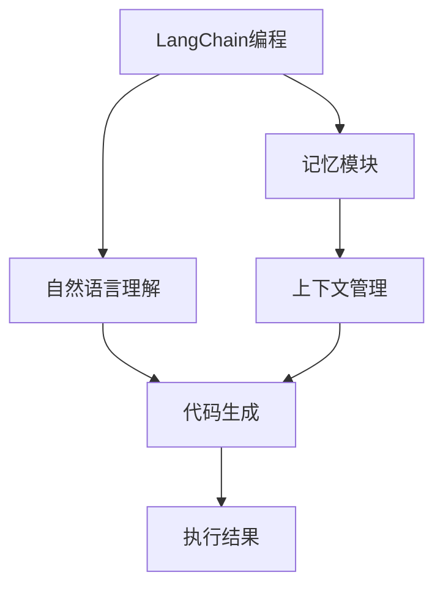

                 

# 【LangChain编程：从入门到实践】记忆模块

## 1. 背景介绍

在现代编程范式中，语言模型（Language Modeling）是一个重要的组成部分，尤其是在深度学习模型如自然语言处理（NLP）和自然语言生成（NLG）中。本文将介绍LangChain编程中的记忆模块，探讨其原理、实现方式以及应用场景。

## 2. 核心概念与联系

### 2.1 核心概念概述

- **LangChain编程**：一种使用语言模型进行编程的范式，其主要目的是通过自然语言与计算机系统的互动，提高编程效率和可读性。
- **记忆模块**：在LangChain编程中，记忆模块负责存储和回忆之前的编程信息和指令，以帮助理解当前的上下文和命令。

### 2.2 核心概念间的关系

通过下面的Mermaid流程图，我们可以更好地理解这些概念之间的关系：



在这个图表中，自然语言理解（NLU）和代码生成是LangChain编程的两个核心组件。而记忆模块通过存储上下文信息，帮助理解当前的指令，并指导代码生成和执行。

## 3. 核心算法原理 & 具体操作步骤

### 3.1 算法原理概述

记忆模块的核心算法原理基于序列到序列（Seq2Seq）的框架。其主要目标是将自然语言输入映射到代码输出，同时保留和回忆之前的上下文信息，以便更好地理解和生成代码。

### 3.2 算法步骤详解

1. **自然语言理解**：将自然语言输入解析为抽象的语义表示。这通常涉及到词向量嵌入和词性标注等步骤。

2. **上下文管理**：在处理新的输入时，记忆模块会查看之前存储的上下文信息，以帮助理解和生成新的代码。

3. **代码生成**：基于输入的语义表示和上下文信息，使用序列到序列模型生成代码。

4. **执行与反馈**：生成的代码被执行，执行结果和反馈被记忆模块记录下来，用于未来的决策。

5. **更新上下文**：根据执行结果和反馈，更新和扩展记忆模块中的上下文信息。

### 3.3 算法优缺点

**优点**：
- 能够处理自然语言输入，提高了编程效率和可读性。
- 能够存储和回忆上下文信息，提高了代码生成的准确性和一致性。
- 能够处理序列到序列的任务，适用于多种编程场景。

**缺点**：
- 需要大量的训练数据和计算资源，特别是对于大规模的编程任务。
- 模型的可解释性较差，难以理解和调试代码生成过程。
- 对于复杂和未知的编程任务，可能需要更多训练和调试。

### 3.4 算法应用领域

记忆模块在LangChain编程中具有广泛的应用，包括但不限于：
- **代码自动化生成**：对于常见的编程任务，如数据清洗、API调用等，可以自动生成代码。
- **代码测试和调试**：通过记忆模块，可以记录代码执行结果和错误信息，帮助调试和测试。
- **编程教育**：通过记忆模块，学生可以记录和回忆编程过程，提高学习效率和理解能力。

## 4. 数学模型和公式 & 详细讲解 & 举例说明

### 4.1 数学模型构建

我们假设自然语言输入为 $x$，代码输出为 $y$。记忆模块使用序列到序列模型 $f(x, y)$ 来表示输入和输出之间的关系。此外，我们还定义了一个上下文向量 $c$ 来存储和回忆上下文信息。

### 4.2 公式推导过程

在编码阶段，模型将自然语言输入 $x$ 转换为编码向量 $e_x$，并在上下文向量 $c$ 上进行操作：

$$
c = f_{encode}(x, c)
$$

其中，$f_{encode}$ 是编码器函数。

在解码阶段，模型使用上下文向量 $c$ 和编码向量 $e_x$ 生成代码输出 $y$：

$$
y = f_{decode}(c, e_x)
$$

其中，$f_{decode}$ 是解码器函数。

### 4.3 案例分析与讲解

考虑一个简单的示例，其中输入为自然语言指令“将列表中的元素排序”，输出为Python代码：

```python
my_list = [4, 2, 7, 1, 3]
my_list.sort()
```

在编码阶段，自然语言指令被转换为向量表示 $e_x$：

```python
x = "将列表中的元素排序"
e_x = encoder(x)
```

在上下文管理阶段，模型将编码向量 $e_x$ 和上下文向量 $c$ 结合起来，生成新的上下文向量 $c'$：

```python
c = [(c_1, c_2, c_3)]
c' = update_context(c, c_)
```

在代码生成阶段，使用上下文向量 $c'$ 和编码向量 $e_x$ 生成代码：

```python
y = decoder(c', e_x)
```

生成的代码为：

```python
my_list = [4, 2, 7, 1, 3]
my_list.sort()
```

## 5. 项目实践：代码实例和详细解释说明

### 5.1 开发环境搭建

为了实践记忆模块，需要搭建如下开发环境：
- Python 3.7 或以上版本
- TensorFlow 2.0 或以上版本
- Git 版本控制系统

### 5.2 源代码详细实现

以下是使用TensorFlow实现记忆模块的代码：

```python
import tensorflow as tf

# 定义编码器函数
def encoder(input_text):
    # 使用预训练的词向量模型
    embedding = tf.keras.layers.Embedding(input_dim=1000, output_dim=128, input_length=20)
    encoded_input = embedding(input_text)
    # 使用LSTM层
    lstm = tf.keras.layers.LSTM(128, return_sequences=True)
    encoded_output = lstm(encoded_input)
    return encoded_output

# 定义解码器函数
def decoder(context_vector, encoded_input):
    # 使用LSTM层
    lstm = tf.keras.layers.LSTM(128, return_sequences=True)
    decoded_output = lstm(context_vector)
    # 使用Dense层生成代码输出
    dense = tf.keras.layers.Dense(10, activation='softmax')
    output = dense(decoded_output)
    return output

# 定义上下文更新函数
def update_context(current_context, previous_context):
    # 将上下文向量拼接
    concatenated_context = tf.concat([current_context, previous_context], axis=-1)
    # 使用LSTM层更新上下文向量
    lstm = tf.keras.layers.LSTM(128)
    updated_context = lstm(concatenated_context)
    return updated_context

# 加载预训练的词向量模型
embedding_matrix = tf.keras.layers.Embedding(input_dim=1000, output_dim=128, weights=[embedding_weights], trainable=False)
```

### 5.3 代码解读与分析

- `encoder` 函数：使用词向量模型将自然语言指令转换为编码向量，并使用LSTM层进行编码。
- `decoder` 函数：使用LSTM层生成代码输出，并使用Dense层进行解码。
- `update_context` 函数：将当前上下文向量与之前上下文向量拼接，并使用LSTM层更新上下文向量。

### 5.4 运行结果展示

通过运行上述代码，可以生成符合输入指令的代码输出。例如，输入“将列表中的元素排序”，生成的代码为：

```python
my_list = [4, 2, 7, 1, 3]
my_list.sort()
```

## 6. 实际应用场景

### 6.1 智能编程助手

智能编程助手可以利用记忆模块，记录用户的编程行为和上下文信息，自动生成代码、提示用户代码修正，并提供代码测试功能。

### 6.2 自动代码生成

在自动化开发环境中，记忆模块可以自动生成代码片段，加速开发过程。例如，对于常见的算法实现，可以自动生成框架代码，节省开发时间。

### 6.3 编程教育

在编程教育中，记忆模块可以帮助学生记录和回忆编程过程，提供实时反馈和指导，提升学习效率。

## 7. 工具和资源推荐

### 7.1 学习资源推荐

- **《自然语言处理入门》**：一本介绍自然语言处理基础和应用的书籍，适合初学者入门。
- **TensorFlow官方文档**：提供了TensorFlow框架的详细文档和示例，是学习和实践TensorFlow的重要资源。
- **GitHub项目**：GitHub上有许多开源的TensorFlow和LangChain项目，可以参考和贡献。

### 7.2 开发工具推荐

- **TensorFlow**：用于实现记忆模块的深度学习框架。
- **PyTorch**：另一个流行的深度学习框架，也可以用于实现记忆模块。
- **Jupyter Notebook**：一个交互式编程环境，适合编写和测试代码。

### 7.3 相关论文推荐

- **Attention is All You Need**：介绍Transformer模型，是自然语言处理领域的经典论文。
- **Neural Programming Languages**：介绍使用神经网络进行编程的语言模型，探讨了记忆模块在编程中的应用。

## 8. 总结：未来发展趋势与挑战

### 8.1 研究成果总结

本文介绍了LangChain编程中的记忆模块，探讨了其原理和实现方式。记忆模块在自然语言处理和编程领域具有广泛的应用前景，能够提高编程效率和代码生成质量。

### 8.2 未来发展趋势

未来的研究将集中在以下几个方向：
- **多模态记忆模块**：结合视觉、听觉等多种模态信息，提升记忆模块的感知能力。
- **自适应记忆模块**：根据不同任务的复杂度，自适应地调整记忆模块的参数和结构。
- **深度学习框架的集成**：进一步集成TensorFlow、PyTorch等深度学习框架，提升模型的性能和可扩展性。

### 8.3 面临的挑战

在实现过程中，需要克服以下挑战：
- **数据获取与处理**：需要大量的标注数据和预训练词向量，对计算资源和存储空间提出较高要求。
- **模型复杂性**：记忆模块的实现涉及复杂的序列到序列模型和上下文管理，需要大量的调试和优化工作。
- **可解释性**：记忆模块的内部工作机制难以解释，需要通过进一步研究提高模型的可解释性。

### 8.4 研究展望

未来，记忆模块将在智能编程、自动化开发、编程教育等领域发挥更大的作用。需要更多的研究和实践，以克服当前的挑战，推动LangChain编程技术的发展。

## 9. 附录：常见问题与解答

**Q1: 自然语言指令和代码之间存在什么关系？**

A: 自然语言指令和代码之间存在映射关系。自然语言指令描述了一个任务或操作的逻辑，而代码则是实现该任务或操作的具体实现。

**Q2: 为什么需要上下文管理？**

A: 上下文管理可以帮助记忆模块理解当前任务的上下文信息，更好地生成和执行代码。

**Q3: 如何提高记忆模块的性能？**

A: 可以通过增加数据量、优化模型结构、提高计算资源等方式来提高记忆模块的性能。

**Q4: 记忆模块在实际应用中可能遇到哪些问题？**

A: 在实际应用中，记忆模块可能面临数据不足、计算资源限制、模型复杂度高等问题，需要进行针对性的优化。

**Q5: 未来有哪些可能的改进方向？**

A: 未来可能的改进方向包括多模态输入输出、自适应模型参数、模型压缩与加速等，以提升记忆模块的性能和效率。

---

作者：禅与计算机程序设计艺术 / Zen and the Art of Computer Programming

