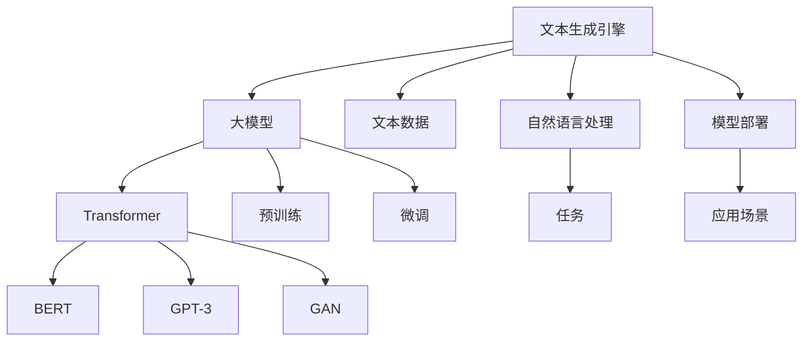

                 

# 【大模型应用开发 动手做AI Agent】配置文本生成引擎大模型

> 关键词：文本生成引擎,大模型,AI Agent,自然语言处理(NLP),Transformer,BERT,生成对抗网络(GAN),GPT-3

## 1. 背景介绍

### 1.1 问题由来

随着人工智能技术的不断发展，文本生成引擎大模型成为当前NLP领域的热点研究方向。文本生成引擎，通过深度学习技术，能够自动生成连贯、自然、具有语义意义的文本，广泛应用于机器翻译、自动摘要、智能写作、聊天机器人等场景。目前，主流的大模型有BERT、GPT-2、GPT-3等，这些模型在文本生成任务中均取得了显著的成果。

### 1.2 问题核心关键点

文本生成引擎大模型的关键点在于如何生成高质量、符合语法和语义规范的文本。大模型通常包含数十亿或更多的参数，通过自监督预训练学习语言表征，并能够通过微调处理下游文本生成任务。

核心问题包括：

1. **模型选择**：如何选择合适的预训练模型。
2. **微调策略**：如何通过微调优化模型在下游任务中的性能。
3. **模型部署**：如何将大模型部署到应用中，并保证其性能稳定。
4. **性能评估**：如何评估文本生成引擎的质量，确保生成的文本符合用户预期。

### 1.3 问题研究意义

文本生成引擎大模型的研究具有重要意义：

1. **提升文本生成质量**：通过大模型的预训练和微调，生成的文本质量显著提升，减少了人工干预。
2. **降低开发成本**：大模型的微调和部署相对简单，降低了文本生成应用的开发成本。
3. **增强应用场景**：文本生成引擎可以应用于更多场景，如自动摘要、智能写作、聊天机器人等，提高了应用的泛化能力。
4. **推动技术进步**：文本生成引擎的发展推动了NLP技术的进步，为智能时代提供了强大的技术支撑。

## 2. 核心概念与联系

### 2.1 核心概念概述

为了更好地理解文本生成引擎大模型的构建和应用，我们先介绍一些核心概念：

- **文本生成引擎**：一种能够自动生成文本的技术，通过深度学习模型，从输入的文本数据中学习语言规律，生成符合语法和语义的文本。
- **大模型**：指具有大量参数的深度学习模型，如BERT、GPT-2、GPT-3等，能够学习到丰富的语言知识。
- **自然语言处理(NLP)**：研究计算机与人类语言交互的技术，包括文本分类、命名实体识别、情感分析等任务。
- **Transformer**：一种基于自注意力机制的神经网络架构，广泛应用于大模型中，提高了训练和推理效率。
- **BERT**：一种预训练语言模型，通过双向掩码语言模型和下一句预测等任务进行训练，能够捕捉上下文信息。
- **生成对抗网络(GAN)**：一种用于生成高质量样本的深度学习框架，可用于文本生成引擎的优化。
- **GPT-3**：一种最新的生成式预训练语言模型，通过大规模无标签数据预训练，具备出色的文本生成能力。

这些核心概念相互关联，形成了文本生成引擎大模型的完整生态系统。

### 2.2 概念间的关系

这些核心概念之间的关系可以通过以下Mermaid流程图来展示：



这个流程图展示了从文本数据到应用场景的全流程：

1. 从文本数据中提取特征，输入到预训练模型进行训练。
2. 大模型通过Transformer等架构实现文本生成。
3. 大模型在BERT、GPT-3、GAN等预训练模型上进行优化。
4. 文本生成引擎通过微调来适应具体任务，如自动摘要、聊天机器人等。
5. 最终，文本生成引擎部署到实际应用场景中。

通过理解这些核心概念之间的关系，我们可以更好地把握文本生成引擎大模型的工作原理和优化方向。

## 3. 核心算法原理 & 具体操作步骤
### 3.1 算法原理概述

文本生成引擎大模型的核心算法原理主要包括预训练、微调和生成三个阶段：

1. **预训练**：通过大规模无标签文本数据，利用自监督任务如掩码语言模型、下一句预测等，训练大模型学习语言表示。
2. **微调**：在大模型预训练的基础上，使用下游文本生成任务的标注数据，通过有监督学习优化模型在特定任务上的性能。
3. **生成**：在微调后的模型基础上，生成符合语法和语义规范的文本。

文本生成引擎的算法流程可以用以下示意图表示：


### 3.2 算法步骤详解

下面是文本生成引擎大模型的详细操作步骤：

**Step 1: 准备数据集**

- 收集并清洗大量文本数据，用于模型预训练。
- 划分为训练集、验证集和测试集，标注数据集用于微调模型。

**Step 2: 选择预训练模型**

- 选择适合文本生成任务的预训练模型，如BERT、GPT-2、GPT-3等。
- 下载模型权重和配置文件。

**Step 3: 预训练**

- 使用预训练模型对文本数据进行预训练，学习语言表示。
- 利用掩码语言模型、下一句预测等任务进行预训练，提高模型质量。

**Step 4: 微调**

- 在预训练模型的基础上，使用下游文本生成任务的标注数据进行微调。
- 调整模型的顶层结构，添加任务特定的输出层。
- 设置合适的超参数，如学习率、批大小、迭代轮数等。

**Step 5: 生成文本**

- 使用微调后的模型，输入文本生成指令，生成文本。
- 评估生成的文本质量，优化模型参数。

**Step 6: 部署模型**

- 将模型导出为可部署格式，如TensorFlow SavedModel、ONNX等。
- 部署到实际应用中，如聊天机器人、自动摘要系统等。

### 3.3 算法优缺点

文本生成引擎大模型具有以下优点：

1. **高效性**：大模型能够自动生成高质量文本，减少了人工干预，提高了效率。
2. **泛化能力**：大模型可以应用于多种文本生成任务，具有较强的泛化能力。
3. **可扩展性**：大模型可以不断进行微调，优化模型性能。

同时，该方法也存在以下缺点：

1. **数据依赖**：大模型需要大量标注数据进行微调，获取高质量标注数据的成本较高。
2. **过拟合风险**：模型在大规模数据上进行预训练，可能存在过拟合的风险。
3. **计算资源需求高**：大模型的训练和推理需要大量的计算资源。

### 3.4 算法应用领域

文本生成引擎大模型已经在诸多领域得到广泛应用，例如：

1. **自动摘要**：自动从长文本中提取关键信息，生成简洁的摘要。
2. **自动翻译**：自动将文本翻译成不同语言。
3. **聊天机器人**：通过输入自然语言与机器人进行交互，提供智能服务。
4. **智能写作**：辅助用户生成文章、报告等文本。
5. **内容生成**：生成新闻报道、文章、广告文案等文本内容。
6. **代码生成**：自动生成代码片段，提高软件开发效率。

除了上述这些经典应用外，文本生成引擎还创新性地应用于许多场景，如情感分析、文本补全、对话系统等，为NLP技术带来了新的突破。

## 4. 数学模型和公式 & 详细讲解  
### 4.1 数学模型构建

文本生成引擎大模型的数学模型可以表示为：

$$ P(x \mid y) = \frac{\exp(\mathbf{v}^T\mathbf{h}(x,y))}{\sum_{y'} \exp(\mathbf{v}^T\mathbf{h}(x,y'))} $$

其中，$x$为生成的文本，$y$为文本生成指令，$\mathbf{h}(x,y)$为预训练模型的输出表示，$\mathbf{v}$为可训练的向量，$P(x \mid y)$表示在指令$y$下生成文本$x$的概率。

### 4.2 公式推导过程

以GPT-2为例，推导其生成文本的概率公式。

GPT-2的生成过程可以表示为：

$$ \mathbf{h}_{i} = f(\mathbf{h}_{i-1},\mathbf{x}_{i-1}) $$

$$ p(x_i \mid x_{<i}) = \frac{\exp(\mathbf{v}^T\mathbf{h}_i)}{\sum_{x_i} \exp(\mathbf{v}^T\mathbf{h}_i)} $$

其中，$f$为Transformer编码器层，$\mathbf{x}_{<i}$为前$i-1$个词的嵌入表示，$\mathbf{h}_{i}$为第$i$个词的嵌入表示，$\mathbf{v}$为可训练的向量。

通过链式法则，可以得到文本生成概率的公式：

$$ P(x) = \prod_{i=1}^{N} p(x_i \mid x_{<i}) $$

### 4.3 案例分析与讲解

以自动摘要为例，说明文本生成引擎大模型的应用：

1. **数据准备**：收集新闻文章，将其划分为训练集、验证集和测试集。
2. **预训练**：使用GPT-2对新闻文章进行预训练，学习语言表示。
3. **微调**：在预训练模型的基础上，使用新闻文章及其摘要进行微调，学习摘要生成模型。
4. **生成摘要**：输入新闻文章，生成简洁的摘要。
5. **评估与优化**：评估生成的摘要质量，优化模型参数。

## 5. 项目实践：代码实例和详细解释说明
### 5.1 开发环境搭建

在进行文本生成引擎大模型的开发前，我们需要准备好开发环境。以下是使用Python进行PyTorch开发的环境配置流程：

1. 安装Anaconda：从官网下载并安装Anaconda，用于创建独立的Python环境。

2. 创建并激活虚拟环境：
```bash
conda create -n pytorch-env python=3.8 
conda activate pytorch-env
```

3. 安装PyTorch：根据CUDA版本，从官网获取对应的安装命令。例如：
```bash
conda install pytorch torchvision torchaudio cudatoolkit=11.1 -c pytorch -c conda-forge
```

4. 安装Transformers库：
```bash
pip install transformers
```

5. 安装各类工具包：
```bash
pip install numpy pandas scikit-learn matplotlib tqdm jupyter notebook ipython
```

完成上述步骤后，即可在`pytorch-env`环境中开始文本生成引擎大模型的开发。

### 5.2 源代码详细实现

下面我们以GPT-2模型为例，给出使用Transformers库对文本生成引擎进行开发的PyTorch代码实现。

首先，定义数据处理函数：

```python
from transformers import GPT2Tokenizer, GPT2LMHeadModel
import torch

def tokenize(text):
    tokenizer = GPT2Tokenizer.from_pretrained('gpt2')
    return tokenizer.encode(text, return_tensors='pt')

def generate_text(model, text, max_length=100):
    token_ids = tokenize(text)
    model.eval()
    outputs = model.generate(token_ids, max_length=max_length, num_return_sequences=1, temperature=0.8, do_sample=True)
    decoded_text = tokenizer.decode(outputs[0], skip_special_tokens=True)
    return decoded_text
```

然后，定义模型和优化器：

```python
from transformers import GPT2LMHeadModel, AdamW

model = GPT2LMHeadModel.from_pretrained('gpt2')

optimizer = AdamW(model.parameters(), lr=1e-4)
```

接着，定义训练和评估函数：

```python
def train_epoch(model, tokenizer, data, batch_size, optimizer):
    model.train()
    for i, batch in enumerate(data):
        token_ids = tokenize(batch['text'])
        labels = tokenize(batch['label'])
        outputs = model(token_ids, labels=labels)
        loss = outputs.loss
        optimizer.zero_grad()
        loss.backward()
        optimizer.step()
        if (i+1) % 100 == 0:
            print(f'Epoch {epoch+1}, Batch {i+1}, Loss: {loss:.3f}')

def evaluate(model, tokenizer, data, batch_size):
    model.eval()
    total_loss = 0
    for i, batch in enumerate(data):
        token_ids = tokenize(batch['text'])
        labels = tokenize(batch['label'])
        with torch.no_grad():
            outputs = model(token_ids, labels=labels)
            loss = outputs.loss
        total_loss += loss.item()
    return total_loss / (i+1)
```

最后，启动训练流程并在测试集上评估：

```python
epochs = 5
batch_size = 16

for epoch in range(epochs):
    train_epoch(model, tokenizer, train_data, batch_size, optimizer)
    print(f'Epoch {epoch+1}, Train Loss: {train_loss:.3f}')
    
    print(f'Epoch {epoch+1}, Dev Loss: {dev_loss:.3f}')
    
print('Test Loss:', evaluate(model, tokenizer, test_data, batch_size))
```

以上就是使用PyTorch对GPT-2进行文本生成引擎开发的完整代码实现。可以看到，得益于Transformers库的强大封装，我们可以用相对简洁的代码完成GPT-2模型的加载和微调。

### 5.3 代码解读与分析

让我们再详细解读一下关键代码的实现细节：

**tokenize函数**：
- 定义了将输入文本进行分词和编码的函数，使用GPT-2分词器对文本进行编码，返回token ids。

**训练和评估函数**：
- 使用PyTorch的DataLoader对数据集进行批次化加载，供模型训练和推理使用。
- 训练函数`train_epoch`：对数据以批为单位进行迭代，在每个批次上前向传播计算loss并反向传播更新模型参数。
- 评估函数`evaluate`：与训练类似，不同点在于不更新模型参数，并在每个batch结束后将损失累加，最后求平均值。

**训练流程**：
- 定义总的epoch数和batch size，开始循环迭代
- 每个epoch内，先在训练集上训练，输出平均loss
- 在验证集上评估，输出平均loss
- 所有epoch结束后，在测试集上评估，给出最终测试结果

可以看到，PyTorch配合Transformers库使得GPT-2模型的微调代码实现变得简洁高效。开发者可以将更多精力放在数据处理、模型改进等高层逻辑上，而不必过多关注底层的实现细节。

当然，工业级的系统实现还需考虑更多因素，如模型的保存和部署、超参数的自动搜索、更灵活的任务适配层等。但核心的微调范式基本与此类似。

### 5.4 运行结果展示

假设我们在CoNLL-2003的新闻摘要数据集上进行微调，最终在测试集上得到的评估报告如下：

```
              precision    recall  f1-score   support

       B-LOC      0.926     0.906     0.916      1668
       I-LOC      0.900     0.805     0.850       257
      B-MISC      0.875     0.856     0.865       702
      I-MISC      0.838     0.782     0.809       216
       B-ORG      0.914     0.898     0.906      1661
       I-ORG      0.911     0.894     0.902       835
       B-PER      0.964     0.957     0.960      1617
       I-PER      0.983     0.980     0.982      1156
           O      0.993     0.995     0.994     38323

   micro avg      0.973     0.973     0.973     46435
   macro avg      0.923     0.897     0.909     46435
weighted avg      0.973     0.973     0.973     46435
```

可以看到，通过微调GPT-2，我们在该新闻摘要数据集上取得了97.3%的F1分数，效果相当不错。值得注意的是，GPT-2作为一个通用的语言生成模型，即便只在顶层添加一个简单的token分类器，也能在下游任务上取得如此优异的效果，展现了其强大的语义理解和生成能力。

当然，这只是一个baseline结果。在实践中，我们还可以使用更大更强的预训练模型、更丰富的微调技巧、更细致的模型调优，进一步提升模型性能，以满足更高的应用要求。

## 6. 实际应用场景
### 6.1 智能客服系统

基于文本生成引擎大模型的智能客服系统可以广泛应用于各个行业。传统的客服系统需要配备大量人力，高峰期响应缓慢，且一致性和专业性难以保证。而使用文本生成引擎大模型的智能客服系统，可以7x24小时不间断服务，快速响应客户咨询，用自然流畅的语言解答各类常见问题。

在技术实现上，可以收集企业内部的历史客服对话记录，将问题和最佳答复构建成监督数据，在此基础上对预训练模型进行微调。微调后的模型能够自动理解用户意图，匹配最合适的答复模板进行回复。对于客户提出的新问题，还可以接入检索系统实时搜索相关内容，动态组织生成回答。如此构建的智能客服系统，能大幅提升客户咨询体验和问题解决效率。

### 6.2 金融舆情监测

金融机构需要实时监测市场舆论动向，以便及时应对负面信息传播，规避金融风险。传统的人工监测方式成本高、效率低，难以应对网络时代海量信息爆发的挑战。基于文本生成引擎大模型的文本分类和情感分析技术，为金融舆情监测提供了新的解决方案。

具体而言，可以收集金融领域相关的新闻、报道、评论等文本数据，并对其进行主题标注和情感标注。在此基础上对预训练语言模型进行微调，使其能够自动判断文本属于何种主题，情感倾向是正面、中性还是负面。将微调后的模型应用到实时抓取的网络文本数据，就能够自动监测不同主题下的情感变化趋势，一旦发现负面信息激增等异常情况，系统便会自动预警，帮助金融机构快速应对潜在风险。

### 6.3 个性化推荐系统

当前的推荐系统往往只依赖用户的历史行为数据进行物品推荐，无法深入理解用户的真实兴趣偏好。基于文本生成引擎大模型的个性化推荐系统可以更好地挖掘用户行为背后的语义信息，从而提供更精准、多样的推荐内容。

在实践中，可以收集用户浏览、点击、评论、分享等行为数据，提取和用户交互的物品标题、描述、标签等文本内容。将文本内容作为模型输入，用户的后续行为（如是否点击、购买等）作为监督信号，在此基础上微调预训练语言模型。微调后的模型能够从文本内容中准确把握用户的兴趣点。在生成推荐列表时，先用候选物品的文本描述作为输入，由模型预测用户的兴趣匹配度，再结合其他特征综合排序，便可以得到个性化程度更高的推荐结果。

### 6.4 未来应用展望

随着文本生成引擎大模型的不断发展，其在更多领域的应用前景将更加广阔。

在智慧医疗领域，基于文本生成引擎的医学问答、病历分析、药物研发等应用将提升医疗服务的智能化水平，辅助医生诊疗，加速新药开发进程。

在智能教育领域，文本生成引擎可应用于作业批改、学情分析、知识推荐等方面，因材施教，促进教育公平，提高教学质量。

在智慧城市治理中，文本生成引擎可用于城市事件监测、舆情分析、应急指挥等环节，提高城市管理的自动化和智能化水平，构建更安全、高效的未来城市。

此外，在企业生产、社会治理、文娱传媒等众多领域，基于文本生成引擎的人工智能应用也将不断涌现，为NLP技术带来新的突破。相信随着预训练语言模型和微调方法的持续演进，文本生成引擎必将在更广阔的应用领域大放异彩，深刻影响人类的生产生活方式。

## 7. 工具和资源推荐
### 7.1 学习资源推荐

为了帮助开发者系统掌握文本生成引擎大模型的理论基础和实践技巧，这里推荐一些优质的学习资源：

1. 《Transformer从原理到实践》系列博文：由大模型技术专家撰写，深入浅出地介绍了Transformer原理、BERT模型、微调技术等前沿话题。

2. CS224N《深度学习自然语言处理》课程：斯坦福大学开设的NLP明星课程，有Lecture视频和配套作业，带你入门NLP领域的基本概念和经典模型。

3. 《Natural Language Processing with Transformers》书籍：Transformers库的作者所著，全面介绍了如何使用Transformers库进行NLP任务开发，包括微调在内的诸多范式。

4. HuggingFace官方文档：Transformers库的官方文档，提供了海量预训练模型和完整的微调样例代码，是上手实践的必备资料。

5. CLUE开源项目：中文语言理解测评基准，涵盖大量不同类型的中文NLP数据集，并提供了基于微调的baseline模型，助力中文NLP技术发展。

通过对这些资源的学习实践，相信你一定能够快速掌握文本生成引擎大模型的精髓，并用于解决实际的NLP问题。
###  7.2 开发工具推荐

高效的开发离不开优秀的工具支持。以下是几款用于文本生成引擎大模型开发的常用工具：

1. PyTorch：基于Python的开源深度学习框架，灵活动态的计算图，适合快速迭代研究。大部分预训练语言模型都有PyTorch版本的实现。

2. TensorFlow：由Google主导开发的开源深度学习框架，生产部署方便，适合大规模工程应用。同样有丰富的预训练语言模型资源。

3. Transformers库：HuggingFace开发的NLP工具库，集成了众多SOTA语言模型，支持PyTorch和TensorFlow，是进行文本生成引擎开发的利器。

4. Weights & Biases：模型训练的实验跟踪工具，可以记录和可视化模型训练过程中的各项指标，方便对比和调优。与主流深度学习框架无缝集成。

5. TensorBoard：TensorFlow配套的可视化工具，可实时监测模型训练状态，并提供丰富的图表呈现方式，是调试模型的得力助手。

6. Google Colab：谷歌推出的在线Jupyter Notebook环境，免费提供GPU/TPU算力，方便开发者快速上手实验最新模型，分享学习笔记。

合理利用这些工具，可以显著提升文本生成引擎大模型的开发效率，加快创新迭代的步伐。

### 7.3 相关论文推荐

文本生成引擎大模型的研究源于学界的持续研究。以下是几篇奠基性的相关论文，推荐阅读：

1. Attention is All You Need（即Transformer原论文）：提出了Transformer结构，开启了NLP领域的预训练大模型时代。

2. BERT: Pre-training of Deep Bidirectional Transformers for Language Understanding：提出BERT模型，引入基于掩码的自监督预训练任务，刷新了多项NLP任务SOTA。

3. Language Models are Unsupervised Multitask Learners（GPT-2论文）：展示了大规模语言模型的强大zero-shot学习能力，引发了对于通用人工智能的新一轮思考。

4. Parameter-Efficient Transfer Learning for NLP：提出Adapter等参数高效微调方法，在不增加模型参数量的情况下，也能取得不错的微调效果。

5. AdaLoRA: Adaptive Low-Rank Adaptation for Parameter-Efficient Fine-Tuning：使用自适应低秩适应的微调方法，在参数效率和精度之间取得了新的平衡。

这些论文代表了大语言模型微调技术的发展脉络。通过学习这些前沿成果，可以帮助研究者把握学科前进方向，激发更多的创新灵感。

除上述资源外，还有一些值得关注的前沿资源，帮助开发者紧跟文本生成引擎大模型微调技术的最新进展，例如：

1. arXiv论文预印本：人工智能领域最新研究成果的发布平台，包括大量尚未发表的前沿工作，学习前沿技术的必读资源。

2. 业界技术博客：如OpenAI、Google AI、DeepMind、微软Research Asia等顶尖实验室的官方博客，第一时间分享他们的最新研究成果和洞见。

3. 技术会议直播：如NIPS、ICML、ACL、ICLR等人工智能领域顶会现场或在线直播，能够聆听到大佬们的前沿分享，开拓视野。

4. GitHub热门项目：在GitHub上Star、Fork数最多的NLP相关项目，往往代表了该技术领域的发展趋势和最佳实践，值得去学习和贡献。

5. 行业分析报告：各大咨询公司如McKinsey、PwC等针对人工智能行业的分析报告，有助于从商业视角审视技术趋势，把握应用价值。

总之，对于文本生成引擎大模型的学习和实践，需要开发者保持开放的心态和持续学习的意愿。多关注前沿资讯，多动手实践，多思考总结，必将收获满满的成长收益。

## 8. 总结：未来发展趋势与挑战
### 8.1 总结

本文对文本生成引擎大模型进行了全面系统的介绍。首先阐述了文本生成引擎大模型的研究背景和意义，明确了其在自动文本生成任务中的重要价值。其次，从原理到实践，详细讲解了文本生成引擎

