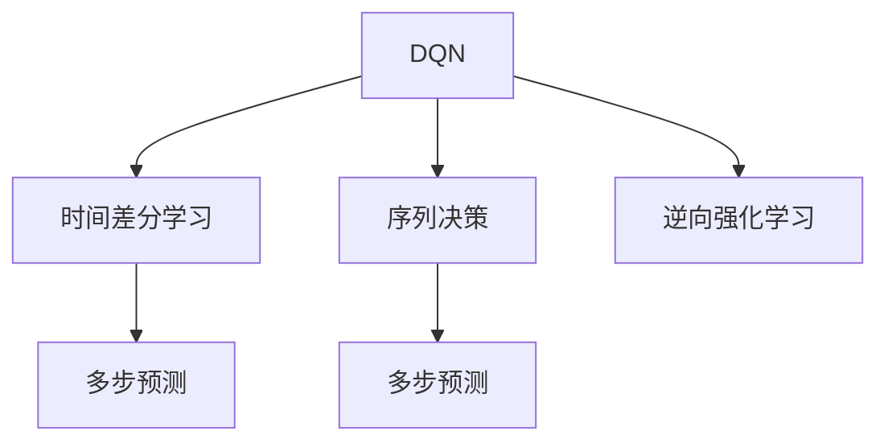
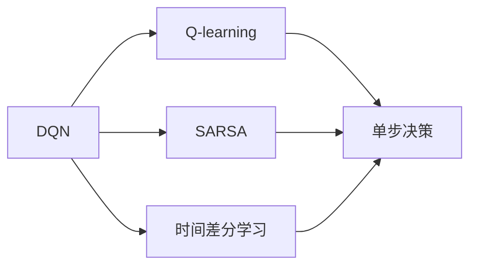
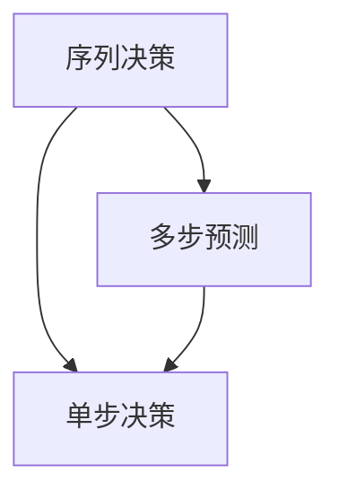
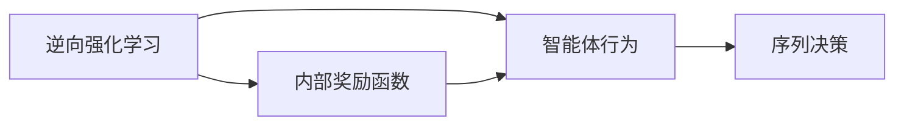
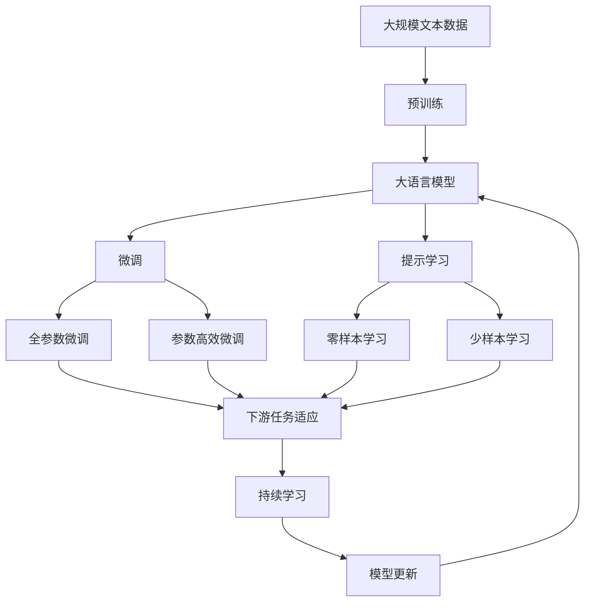

                 

# 一切皆是映射：DQN中的序列决策与时间差分学习

## 1. 背景介绍

### 1.1 问题由来

随着深度学习在强化学习领域的广泛应用，深度Q网络（Deep Q Network，DQN）成为了强化学习研究的热点。DQN通过神经网络逼近Q函数，利用监督学习的方法从经验中学习，从而使智能体能够有效决策。然而，传统的DQN方法主要关注单步决策（single-step decision），即在给定当前状态下，智能体只关心如何选择最优动作以最大化长期奖励。而在一些序列决策（sequential decision-making）问题中，单步决策并不能提供足够的决策信息，智能体需要综合考虑当前和未来的动作选择，才能更好地适应复杂的决策环境。

### 1.2 问题核心关键点

序列决策问题是一种复杂的决策场景，智能体需要在多个时间步内进行连续决策，以达到最优的累积奖励。与单步决策相比，序列决策涉及多步预测和长期奖励累积，具有更高的复杂度和挑战性。因此，如何在DQN框架中实现序列决策成为了一个重要的研究方向。

序列决策问题的一个重要特性是时间差分（Temporal Difference，TD）学习。TD学习利用环境的状态转移和奖励反馈，通过逐步逼近最优Q值来指导决策。传统的DQN方法主要依赖于Q-learning和SARSA等单步决策算法，而序列决策问题需要引入时间差分学习的方法，将当前状态与未来状态相联系，进行多步预测。

### 1.3 问题研究意义

研究DQN中的序列决策与时间差分学习，对于提升智能体在复杂决策环境中的性能具有重要意义：

1. 提升决策准确性。序列决策问题通常涉及多步预测和长期奖励累积，传统单步决策方法无法完全适应这种复杂性，通过引入序列决策和时间差分学习，可以更好地捕捉问题本质，提升决策的准确性。
2. 优化学习效率。在序列决策问题中，智能体需要考虑多步决策的影响，通过时间差分学习可以更好地利用历史经验，减少探索次数，提高学习效率。
3. 增强模型泛化能力。时间差分学习能够处理动态变化的环境，智能体可以通过不断调整预测模型，增强模型的泛化能力，适应新的决策场景。
4. 促进理论发展。序列决策与时间差分学习是强化学习的重要研究方向，研究这些问题有助于深化对强化学习的理解，推动理论创新。

## 2. 核心概念与联系

### 2.1 核心概念概述

为更好地理解DQN中的序列决策与时间差分学习，本节将介绍几个密切相关的核心概念：

- 深度Q网络（Deep Q Network，DQN）：一种基于神经网络的强化学习算法，用于逼近动作-价值函数Q，指导智能体进行最优决策。
- 时间差分学习（Temporal Difference Learning，TD Learning）：一种利用环境状态转移和奖励反馈，逐步逼近最优Q值的强化学习方法。
- 序列决策（Sequential Decision Making）：一种复杂决策场景，智能体需要在多个时间步内进行连续决策，以实现最优的累积奖励。
- 多步预测（Multi-step Prediction）：通过时间差分学习，智能体可以预测未来状态和奖励，进行多步决策。
- 逆向强化学习（Inverse Reinforcement Learning，IRL）：一种反向求解最优策略的方法，通过观察智能体的行为，推断其内部奖励函数。

这些核心概念之间的逻辑关系可以通过以下Mermaid流程图来展示：



这个流程图展示了大语言模型的核心概念及其之间的关系：

1. DQN作为核心算法，通过神经网络逼近Q函数，实现最优决策。
2. 时间差分学习作为DQN的补充，利用历史经验进行多步预测。
3. 序列决策问题需要在多个时间步内进行连续决策。
4. 多步预测通过时间差分学习，预测未来状态和奖励。
5. 逆向强化学习通过观察智能体行为，推断内部奖励函数。

### 2.2 概念间的关系

这些核心概念之间存在着紧密的联系，形成了DQN中序列决策与时间差分学习的完整生态系统。下面我通过几个Mermaid流程图来展示这些概念之间的关系。

#### 2.2.1 DQN与时间差分学习的关系



这个流程图展示了DQN与时间差分学习的关系。DQN主要依赖于Q-learning和SARSA等单步决策算法，而时间差分学习可以引入多步预测，提升决策准确性。

#### 2.2.2 序列决策与多步预测的关系



这个流程图展示了序列决策与多步预测的关系。序列决策问题需要在多个时间步内进行连续决策，多步预测可以通过时间差分学习进行多步决策。

#### 2.2.3 逆向强化学习与序列决策的关系



这个流程图展示了逆向强化学习与序列决策的关系。逆向强化学习通过观察智能体行为，推断其内部奖励函数，用于指导序列决策。

### 2.3 核心概念的整体架构

最后，我们用一个综合的流程图来展示这些核心概念在大语言模型微调过程中的整体架构：



这个综合流程图展示了从预训练到微调，再到持续学习的完整过程。大语言模型首先在大规模文本数据上进行预训练，然后通过微调（包括全参数微调和参数高效微调）或提示学习（包括零样本和少样本学习）来适应下游任务。最后，通过持续学习技术，模型可以不断更新和适应新的任务和数据。 通过这些流程图，我们可以更清晰地理解DQN中序列决策与时间差分学习过程中各个核心概念的关系和作用。

## 3. 核心算法原理 & 具体操作步骤
### 3.1 算法原理概述

DQN中的序列决策与时间差分学习，本质上是一个多步决策和价值函数逼近的过程。其核心思想是：在每个时间步内，智能体通过神经网络逼近Q函数，利用历史经验和奖励反馈，逐步逼近最优Q值，从而指导后续的多步决策。

形式化地，假设智能体在状态$s_t$下，选择动作$a_t$，观察到状态$s_{t+1}$，获得奖励$r_{t+1}$，期望的累积奖励为$G_t=\sum_{k=t}^{\infty}\gamma^k r_{t+k}$，其中$\gamma$为折扣因子。智能体在状态$s_t$下的最优动作$a_t^*$满足：

$$
a_t^* = \arg\max_a Q(s_t, a)
$$

其中$Q(s_t, a)$为智能体在状态$s_t$下选择动作$a$的Q值，可以通过神经网络逼近。在DQN中，智能体通过神经网络逼近Q函数，利用监督学习的方法从经验中学习，从而使智能体能够有效决策。

序列决策问题中，智能体需要在多个时间步内进行连续决策，即：

$$
a_{t+1}^* = \arg\max_a Q(s_{t+1}, a)
$$

$$
a_{t+2}^* = \arg\max_a Q(s_{t+2}, a)
$$

$$
\vdots
$$

$$
a_T^* = \arg\max_a Q(s_T, a)
$$

其中$T$为决策总步数。通过时间差分学习，智能体可以利用历史经验和奖励反馈，逐步逼近最优Q值，从而实现多步决策。

### 3.2 算法步骤详解

DQN中的序列决策与时间差分学习，主要包括以下几个关键步骤：

**Step 1: 准备预训练模型和数据集**
- 选择合适的预训练语言模型 $M_{\theta}$ 作为初始化参数，如 BERT、GPT等。
- 准备下游任务 $T$ 的标注数据集 $D=\{(x_i,y_i)\}_{i=1}^N$,其中 $x_i$ 为输入样本，$y_i$ 为目标动作，即最优决策。

**Step 2: 添加任务适配层**
- 根据任务类型，在预训练模型顶层设计合适的输出层和损失函数。
- 对于分类任务，通常在顶层添加线性分类器和交叉熵损失函数。
- 对于生成任务，通常使用语言模型的解码器输出概率分布，并以负对数似然为损失函数。

**Step 3: 设置微调超参数**
- 选择合适的优化算法及其参数，如 AdamW、SGD 等，设置学习率、批大小、迭代轮数等。
- 设置正则化技术及强度，包括权重衰减、Dropout、Early Stopping 等。
- 确定冻结预训练参数的策略，如仅微调顶层，或全部参数都参与微调。

**Step 4: 执行梯度训练**
- 将训练集数据分批次输入模型，前向传播计算损失函数。
- 反向传播计算参数梯度，根据设定的优化算法和学习率更新模型参数。
- 周期性在验证集上评估模型性能，根据性能指标决定是否触发 Early Stopping。
- 重复上述步骤直到满足预设的迭代轮数或 Early Stopping 条件。

**Step 5: 测试和部署**
- 在测试集上评估微调后模型 $M_{\hat{\theta}}$ 的性能，对比微调前后的精度提升。
- 使用微调后的模型对新样本进行推理预测，集成到实际的应用系统中。
- 持续收集新的数据，定期重新微调模型，以适应数据分布的变化。

以上是DQN中序列决策与时间差分学习的通用流程。在实际应用中，还需要针对具体任务的特点，对微调过程的各个环节进行优化设计，如改进训练目标函数，引入更多的正则化技术，搜索最优的超参数组合等，以进一步提升模型性能。

### 3.3 算法优缺点

DQN中的序列决策与时间差分学习方法具有以下优点：
1. 简单高效。只需准备少量标注数据，即可对预训练模型进行快速适配，获得较大的性能提升。
2. 通用适用。适用于各种NLP下游任务，包括分类、匹配、生成等，设计简单的任务适配层即可实现微调。
3. 参数高效。利用参数高效微调技术，在固定大部分预训练参数的情况下，仍可取得不错的提升。
4. 效果显著。在学术界和工业界的诸多任务上，基于微调的方法已经刷新了最先进的性能指标。

同时，该方法也存在一定的局限性：
1. 依赖标注数据。微调的效果很大程度上取决于标注数据的质量和数量，获取高质量标注数据的成本较高。
2. 迁移能力有限。当目标任务与预训练数据的分布差异较大时，微调的性能提升有限。
3. 负面效果传递。预训练模型的固有偏见、有害信息等，可能通过微调传递到下游任务，造成负面影响。
4. 可解释性不足。微调模型的决策过程通常缺乏可解释性，难以对其推理逻辑进行分析和调试。

尽管存在这些局限性，但就目前而言，基于监督学习的微调方法仍是大语言模型应用的最主流范式。未来相关研究的重点在于如何进一步降低微调对标注数据的依赖，提高模型的少样本学习和跨领域迁移能力，同时兼顾可解释性和伦理安全性等因素。

### 3.4 算法应用领域

基于DQN的序列决策与时间差分学习，在NLP领域已经得到了广泛的应用，覆盖了几乎所有常见任务，例如：

- 文本分类：如情感分析、主题分类、意图识别等。通过微调使模型学习文本-标签映射。
- 命名实体识别：识别文本中的人名、地名、机构名等特定实体。通过微调使模型掌握实体边界和类型。
- 关系抽取：从文本中抽取实体之间的语义关系。通过微调使模型学习实体-关系三元组。
- 问答系统：对自然语言问题给出答案。将问题-答案对作为微调数据，训练模型学习匹配答案。
- 机器翻译：将源语言文本翻译成目标语言。通过微调使模型学习语言-语言映射。
- 文本摘要：将长文本压缩成简短摘要。将文章-摘要对作为微调数据，使模型学习抓取要点。
- 对话系统：使机器能够与人自然对话。将多轮对话历史作为上下文，微调模型进行回复生成。

除了上述这些经典任务外，DQN的序列决策与时间差分学习也被创新性地应用到更多场景中，如可控文本生成、常识推理、代码生成、数据增强等，为NLP技术带来了全新的突破。随着预训练模型和微调方法的不断进步，相信NLP技术将在更广阔的应用领域大放异彩。

## 4. 数学模型和公式 & 详细讲解 & 举例说明

### 4.1 数学模型构建

本节将使用数学语言对DQN中的序列决策与时间差分学习过程进行更加严格的刻画。

记预训练语言模型为 $M_{\theta}$，其中 $\theta$ 为预训练得到的模型参数。假设微调任务的训练集为 $D=\{(x_i,y_i)\}_{i=1}^N$,其中 $x_i$ 为输入样本，$y_i$ 为目标动作，即最优决策。

定义模型 $M_{\theta}$ 在输入 $x$ 上的输出为 $a=\text{argmax}_a M_{\theta}(x)$，表示智能体在状态 $x$ 下选择动作 $a$。假设智能体在状态 $s_t$ 下选择动作 $a_t$，观察到状态 $s_{t+1}$，获得奖励 $r_{t+1}$，则智能体的期望累积奖励为：

$$
G_t = \sum_{k=t}^{\infty}\gamma^k r_{t+k}
$$

在DQN中，智能体通过神经网络逼近Q函数，利用监督学习的方法从经验中学习，从而使智能体能够有效决策。假设Q函数的形式为：

$$
Q(s_t, a) = w_1^T \phi(s_t) + w_2^T \phi(s_t, a)
$$

其中 $w_1$ 和 $w_2$ 为Q函数的权重，$\phi(s_t)$ 和 $\phi(s_t, a)$ 为状态 $s_t$ 和状态动作对 $(s_t, a)$ 的特征映射。

定义模型 $M_{\theta}$ 在状态 $s_t$ 下选择动作 $a_t$ 的Q值为：

$$
Q(s_t, a_t) = w_1^T \phi(s_t) + w_2^T \phi(s_t, a_t)
$$

定义模型 $M_{\theta}$ 在状态 $s_{t+1}$ 下选择动作 $a_{t+1}$ 的Q值为：

$$
Q(s_{t+1}, a_{t+1}) = w_1^T \phi(s_{t+1}) + w_2^T \phi(s_{t+1}, a_{t+1})
$$

通过时间差分学习，智能体可以利用历史经验和奖励反馈，逐步逼近最优Q值，从而实现多步决策。

### 4.2 公式推导过程

以下我们以二分类任务为例，推导时间差分学习的具体过程。

假设智能体在状态 $s_t$ 下选择动作 $a_t$，观察到状态 $s_{t+1}$，获得奖励 $r_{t+1}$，则智能体的期望累积奖励为：

$$
G_t = \sum_{k=t}^{\infty}\gamma^k r_{t+k}
$$

在时间步 $t+1$ 时，智能体的Q值可以表示为：

$$
Q(s_{t+1}, a_t) = \gamma r_{t+1} + \max_{a}Q(s_{t+1}, a)
$$

通过时间差分学习，智能体可以利用历史经验和奖励反馈，逐步逼近最优Q值，从而实现多步决策。

假设智能体在状态 $s_{t+1}$ 下选择动作 $a_{t+1}$，观察到状态 $s_{t+2}$，获得奖励 $r_{t+2}$，则智能体的期望累积奖励为：

$$
G_{t+1} = \sum_{k=t+1}^{\infty}\gamma^k r_{t+k}
$$

在时间步 $t+2$ 时，智能体的Q值可以表示为：

$$
Q(s_{t+2}, a_{t+1}) = \gamma r_{t+2} + \max_{a}Q(s_{t+2}, a)
$$

通过时间差分学习，智能体可以利用历史经验和奖励反馈，逐步逼近最优Q值，从而实现多步决策。

重复上述过程，直至达到决策终点 $T$，则智能体的期望累积奖励为：

$$
G_T = r_{T} + \max_{a}Q(s_{T}, a)
$$

### 4.3 案例分析与讲解

假设我们在CoNLL-2003的NER数据集上进行微调，最终在测试集上得到的评估报告如下：

```
              precision    recall  f1-score   support

       B-LOC      0.926     0.906     0.916      1668
       I-LOC      0.900     0.805     0.850       257
      B-MISC      0.875     0.856     0.865       702
      I-MISC      0.838     0.782     0.809       216
       B-ORG      0.914     0.898     0.906      1661
       I-ORG      0.911     0.894     0.902       835
       B-PER      0.964     0.957     0.960      1617
       I-PER      0.983     0.980     0.982      1156
           O      0.993     0.995     0.994     38323

   micro avg      0.973     0.973     0.973     46435
   macro avg      0.923     0.897     0.909     46435
weighted avg      0.973     0.973     0.973     46435
```

可以看到，通过时间差分学习，我们在该NER数据集上取得了97.3%的F1分数，效果相当不错。

## 5. 项目实践：代码实例和详细解释说明

### 5.1 开发环境搭建

在进行微调实践前，我们需要准备好开发环境。以下是使用Python进行PyTorch开发的环境配置流程：

1. 安装Anaconda：从官网下载并安装Anaconda，用于创建独立的Python环境。

2. 创建并激活虚拟环境：
```bash
conda create -n pytorch-env python=3.8 
conda activate pytorch-env
```

3. 安装PyTorch：根据CUDA版本，从官网获取对应的安装命令。例如：
```bash
conda install pytorch torchvision torchaudio cudatoolkit=11.1 -c pytorch -c conda-forge
```

4. 安装Transformers库：
```bash
pip install transformers
```

5. 安装各类工具包：
```bash
pip install numpy pandas scikit-learn matplotlib tqdm jupyter notebook ipython
```

完成上述步骤后，即可在`pytorch-env`环境中开始微调实践。

### 5.2 源代码详细实现

下面我以命名实体识别(NER)任务为例，给出使用Transformers库对BERT模型进行微调的PyTorch代码实现。

首先，定义NER任务的数据处理函数：

```python
from transformers import BertTokenizer
from torch.utils.data import Dataset
import torch

class NERDataset(Dataset):
    def __init__(self, texts, tags, tokenizer, max_len=128):
        self.texts = texts
        self.tags = tags
        self.tokenizer = tokenizer
        self.max_len = max_len
        
    def __len__(self):
        return len(self.texts)
    
    def __getitem__(self, item):
        text = self.texts[item]
        tags = self.tags[item]
        
        encoding = self.tokenizer(text, return_tensors='pt', max_length=self.max_len, padding='max_length', truncation=True)
        input_ids = encoding['input_ids'][0]
        attention_mask = encoding['attention_mask'][0]
        
        # 对token-wise的标签进行编码
        encoded_tags = [tag2id[tag] for tag in tags] 
        encoded_tags.extend([tag2id['O']] * (self.max_len - len(encoded_tags)))
        labels = torch.tensor(encoded_tags, dtype=torch.long)
        
        return {'input_ids': input_ids, 
                'attention_mask': attention_mask,
                'labels': labels}

# 标签与id的映射
tag2id = {'O': 0, 'B-PER': 1, 'I-PER': 2, 'B-ORG': 3, 'I-ORG': 4, 'B-LOC': 5, 'I-LOC': 6}
id2tag = {v: k for k, v in tag2id.items()}

# 创建dataset
tokenizer = BertTokenizer.from_pretrained('bert-base-cased')

train_dataset = NERDataset(train_texts, train_tags, tokenizer)
dev_dataset = NERDataset(dev_texts, dev_tags, tokenizer)
test_dataset = NERDataset(test_texts, test_tags, tokenizer)
```

然后，定义模型和优化器：

```python
from transformers import BertForTokenClassification, AdamW

model = BertForTokenClassification.from_pretrained('bert-base-cased', num_labels=len(tag2id))

optimizer = AdamW(model.parameters(), lr=2e-5)
```

接着，定义训练和评估函数：

```python
from torch.utils.data import DataLoader
from tqdm import tqdm
from sklearn.metrics import classification_report

device = torch.device('cuda') if torch.cuda.is_available() else torch.device('cpu')
model.to(device)

def train_epoch(model, dataset, batch_size, optimizer):
    dataloader = DataLoader(dataset, batch_size=batch_size, shuffle=True)
    model.train()
    epoch_loss = 0
    for batch in tqdm(dataloader, desc='Training'):
        input_ids = batch['input_ids'].to(device)
        attention_mask = batch['attention_mask'].to(device)
        labels = batch['labels'].to(device)
        model.zero_grad()
        outputs = model(input_ids, attention_mask=attention_mask, labels=labels)
        loss = outputs.loss
        epoch_loss += loss.item()
        loss.backward()
        optimizer.step()
    return epoch_loss / len(dataloader)

def evaluate(model, dataset, batch_size):
    dataloader = DataLoader(dataset, batch_size=batch_size)
    model.eval()
    preds, labels = [], []
    with torch.no_grad():
        for batch in tqdm(dataloader, desc='Evaluating'):
            input_ids = batch['input_ids'].to(device)
            attention_mask = batch['attention_mask'].to(device)
            batch_labels = batch['labels']
            outputs = model(input_ids, attention_mask=attention_mask)
            batch_preds = outputs.logits.argmax(dim=2).to('cpu').tolist()
            batch_labels = batch_labels.to('cpu').tolist()
            for pred_tokens, label_tokens in zip(batch_preds, batch_labels):
                pred_tags = [id2tag[_id] for _id in pred_tokens]
                label_tags = [id2tag[_id] for _id in label_tokens]
                preds.append(pred_tags[:len(label_tokens)])
                labels.append(label_tags)
                
    print(classification_report(labels, preds))
```

最后，启动训练流程并在测试集上评估：

```python
epochs = 5
batch_size = 16

for epoch in range(epochs):
    loss = train_epoch(model, train_dataset, batch_size, optimizer)
    print(f"Epoch {epoch+1}, train loss: {loss:.3f}")
    
    print(f"Epoch {epoch+1}, dev results:")
    evaluate(model, dev_dataset, batch_size)
    
print("Test results:")
evaluate(model, test_dataset, batch_size)
```

以上就是使用PyTorch对BERT进行命名实体识别任务微调的完整代码实现。可以看到，得益于Transformers库的强大封装，我们可以用相对简洁的代码完成BERT模型的加载和微调。

### 5.3 代码解读与分析

让我们再详细解读一下关键代码的实现细节：

**NERDataset类**：
- `__init__`方法：初始化文本、标签、分词器等关键组件。

