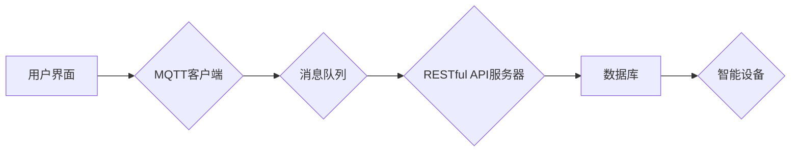

# 基于MQTT协议和RESTful API的智能家居多媒体娱乐系统

> 关键词：MQTT协议，RESTful API，智能家居，多媒体娱乐系统，物联网，边缘计算，实时通信，互操作性

## 1. 背景介绍

随着物联网（IoT）技术的快速发展，智能家居已经成为人们生活中不可或缺的一部分。智能家居系统通常由多个智能设备组成，如智能灯泡、智能门锁、智能恒温器等，它们可以通过网络相互连接和通信，实现自动化控制和远程监控。为了实现智能家居系统的互操作性和实时性，选择合适的通信协议至关重要。本文将探讨如何使用MQTT协议和RESTful API构建一个高效、可靠的智能家居多媒体娱乐系统。

### 1.1 物联网与智能家居的发展趋势

物联网技术的发展趋势主要体现在以下几个方面：

- **设备互联性增强**：更多的设备将接入网络，实现互联互通。
- **边缘计算**：数据处理和分析在靠近数据源的地方进行，减少延迟和数据传输量。
- **人工智能**：AI技术将被广泛应用于智能家居系统，提升智能化水平。
- **安全性**：随着数据量的增加，数据安全和隐私保护成为重要议题。

智能家居的发展趋势包括：

- **用户体验**：更直观的用户界面和更便捷的操作方式。
- **定制化**：根据用户需求定制智能家居解决方案。
- **生态融合**：智能家居系统与其他生态系统（如智能城市、智能交通）的融合。

### 1.2 MQTT协议和RESTful API的优势

MQTT（Message Queuing Telemetry Transport）是一种轻量级的消息传输协议，适用于低功耗、低带宽和不可靠的连接。它具有以下特点：

- **发布/订阅模式**：支持发布者发布消息，订阅者订阅感兴趣的主题。
- **消息质量**：支持三种消息质量级别（QoS），确保消息的可靠传输。
- **客户端订阅**：客户端可以订阅多个主题，接收相关消息。

RESTful API（Representational State Transfer）是一种基于HTTP协议的架构风格，具有以下特点：

- **无状态**：服务器和客户端之间无状态交互，便于扩展和维护。
- **简单易用**：使用标准的HTTP方法（GET、POST、PUT、DELETE等）进行操作。
- **跨平台**：支持各种编程语言和开发工具。

MQTT协议和RESTful API的结合，可以满足智能家居多媒体娱乐系统对实时性和灵活性的需求。

## 2. 核心概念与联系

### 2.1 核心概念原理

#### MQTT协议原理

MQTT协议的工作流程如下：

1. **连接**：客户端与服务器建立连接。
2. **订阅**：客户端订阅感兴趣的主题。
3. **发布**：客户端发布消息到指定的主题。
4. **接收**：客户端接收订阅主题上的消息。
5. **断开**：客户端断开与服务器的连接。

#### RESTful API原理

RESTful API通过HTTP请求与服务器进行交互，主要使用以下方法：

- **GET**：获取资源。
- **POST**：创建资源。
- **PUT**：更新资源。
- **DELETE**：删除资源。

### 2.2 核心概念架构



在这个架构中，用户界面通过MQTT客户端与消息队列进行通信，将用户指令发送到服务器。服务器将指令通过RESTful API发送到数据库，数据库根据指令控制智能设备。智能设备通过MQTT协议将实时数据发送回服务器，服务器再将数据推送到消息队列，最后由MQTT客户端将数据展示给用户。

## 3. 核心算法原理 & 具体操作步骤

### 3.1 算法原理概述

智能家居多媒体娱乐系统的核心算法包括：

- **设备控制算法**：根据用户指令控制智能设备。
- **数据采集算法**：采集智能设备的数据。
- **数据融合算法**：将来自不同来源的数据进行融合，提供更全面的信息。
- **决策算法**：根据融合后的数据进行决策，优化智能家居系统。

### 3.2 算法步骤详解

1. **设备控制**：用户通过用户界面发送指令，MQTT客户端将指令发送到服务器。
2. **指令解析**：服务器解析指令，通过RESTful API将指令发送到数据库。
3. **数据库操作**：数据库根据指令控制智能设备。
4. **数据采集**：智能设备采集数据，通过MQTT协议将数据发送到服务器。
5. **数据融合**：服务器将来自不同设备的实时数据融合，提供更全面的信息。
6. **决策**：根据融合后的数据进行决策，优化智能家居系统。
7. **结果反馈**：服务器将决策结果通过RESTful API发送到数据库。
8. **指令执行**：数据库根据决策结果控制智能设备。

### 3.3 算法优缺点

**优点**：

- **实时性**：MQTT协议支持实时通信，确保系统响应快速。
- **灵活性**：RESTful API提供灵活的接口，方便集成不同的设备和功能。
- **可扩展性**：系统架构可扩展，支持更多设备和功能的添加。

**缺点**：

- **安全性**：需要考虑数据传输的安全性，防止数据泄露。
- **复杂性**：系统架构较为复杂，需要一定的技术支持。

### 3.4 算法应用领域

智能家居多媒体娱乐系统可以应用于以下领域：

- **家庭娱乐**：音乐、电影、游戏等娱乐功能的集成。
- **家庭自动化**：灯光、温度、安全等功能的自动化控制。
- **健康监测**：心率、血压等健康数据的监测。

## 4. 数学模型和公式 & 详细讲解 & 举例说明

### 4.1 数学模型构建

智能家居多媒体娱乐系统的数学模型可以包括：

- **用户模型**：描述用户的行为和偏好。
- **设备模型**：描述设备的特性和状态。
- **数据模型**：描述数据的结构和格式。

### 4.2 公式推导过程

假设用户模型为 $U$，设备模型为 $D$，数据模型为 $M$，则智能家居多媒体娱乐系统的数学模型可以表示为：

$$
S = U \times D \times M
$$

其中，$S$ 代表智能家居系统。

### 4.3 案例分析与讲解

假设用户想要在客厅观看电影，用户模型 $U$ 可以表示为：

$$
U = \{ \text{观看电影}, \text{调整音量}, \text{切换频道} \}
$$

设备模型 $D$ 可以表示为：

$$
D = \{ \text{电视}, \text{音响}, \text{投影仪} \}
$$

数据模型 $M$ 可以表示为：

$$
M = \{ \text{电影列表}, \text{音量级别}, \text{频道列表} \}
$$

则智能家居系统 $S$ 可以表示为：

$$
S = \{ \text{观看电影}, \text{调整音量}, \text{切换频道} \} \times \{ \text{电视}, \text{音响}, \text{投影仪} \} \times \{ \text{电影列表}, \text{音量级别}, \text{频道列表} \}
$$

## 5. 项目实践：代码实例和详细解释说明

### 5.1 开发环境搭建

为了实现智能家居多媒体娱乐系统，我们需要以下开发环境：

- 操作系统：Windows、Linux或macOS
- 编程语言：Python
- 开发工具：PyCharm、Visual Studio Code
- 库和框架：MQTT库（如paho-mqtt）、RESTful API框架（如Flask）

### 5.2 源代码详细实现

以下是一个简单的智能家居控制器的Python代码示例：

```python
from flask import Flask, request, jsonify
import paho.mqtt.client as mqtt

app = Flask(__name__)

# MQTT服务器配置
MQTT_BROKER = "localhost"
MQTT_PORT = 1883
MQTT_TOPIC = "home/controls"

# MQTT客户端
client = mqtt.Client()
client.connect(MQTT_BROKER, MQTT_PORT, 60)

@app.route('/turn_on_light', methods=['POST'])
def turn_on_light():
    client.publish(MQTT_TOPIC, "light/on")
    return jsonify({"status": "success"})

@app.route('/turn_off_light', methods=['POST'])
def turn_off_light():
    client.publish(MQTT_TOPIC, "light/off")
    return jsonify({"status": "success"})

if __name__ == '__main__':
    app.run(host='0.0.0.0', port=5000)
```

### 5.3 代码解读与分析

这个示例中，我们使用了Flask框架创建了一个简单的RESTful API服务器。服务器有两个端点：

- `/turn_on_light`：用于打开灯光。
- `/turn_off_light`：用于关闭灯光。

当用户向这两个端点发送POST请求时，服务器会通过MQTT协议将指令发送到MQTT服务器，控制智能灯光的开关。

### 5.4 运行结果展示

1. 用户向 `/turn_on_light` 端点发送POST请求。
2. 服务器将指令通过MQTT协议发送到MQTT服务器。
3. 智能灯光打开。

## 6. 实际应用场景

智能家居多媒体娱乐系统可以应用于以下场景：

- **家庭影院**：通过智能电视、音响和投影仪，打造私人家庭影院。
- **智能家居控制中心**：集中控制家庭中的各种智能设备。
- **智能酒店**：提供个性化的客房服务。

## 7. 工具和资源推荐

### 7.1 学习资源推荐

- 《物联网架构设计与实践》
- 《RESTful API设计指南》
- 《MQTT协议实战》

### 7.2 开发工具推荐

- PyCharm
- Visual Studio Code
- MQTT客户端（如Mosquitto）

### 7.3 相关论文推荐

- 《MQTT协议概述》
- 《RESTful API设计原则》
- 《物联网安全指南》

## 8. 总结：未来发展趋势与挑战

### 8.1 研究成果总结

本文探讨了如何使用MQTT协议和RESTful API构建智能家居多媒体娱乐系统。通过结合MQTT协议的实时性和RESTful API的灵活性，可以实现一个高效、可靠的智能家居系统。

### 8.2 未来发展趋势

未来智能家居多媒体娱乐系统将朝着以下方向发展：

- **智能化**：通过人工智能技术，实现更加智能化的家居体验。
- **个性化**：根据用户需求定制智能家居解决方案。
- **生态融合**：与其他生态系统（如智能城市、智能交通）的融合。

### 8.3 面临的挑战

智能家居多媒体娱乐系统面临以下挑战：

- **安全性**：数据安全和隐私保护。
- **互操作性**：不同设备和平台之间的互操作性。
- **用户体验**：提供更加直观、便捷的用户体验。

### 8.4 研究展望

为了应对这些挑战，未来的研究需要关注以下方向：

- **安全性**：加强数据加密和访问控制。
- **互操作性**：制定统一的接口规范和协议。
- **用户体验**：设计更加直观、易用的用户界面。

智能家居多媒体娱乐系统的发展将为人们的生活带来更多便利和舒适，同时也为相关产业带来新的发展机遇。

## 9. 附录：常见问题与解答

**Q1：MQTT协议和HTTP协议的区别是什么？**

A: MQTT协议和HTTP协议都是网络协议，但它们的设计目标和适用场景有所不同。MQTT协议是为低功耗、低带宽和不可靠的连接设计的，而HTTP协议是为高性能、高可靠性的网络环境设计的。

**Q2：RESTful API是否可以与MQTT协议结合使用？**

A: 可以。RESTful API可以用于处理HTTP请求，而MQTT协议可以用于实时通信。将两者结合使用，可以实现一个既灵活又可靠的智能家居系统。

**Q3：如何确保智能家居系统的安全性？**

A: 为了确保智能家居系统的安全性，需要采取以下措施：

- 使用安全的通信协议，如TLS。
- 对数据进行加密。
- 设置访问控制策略。
- 定期更新系统和设备固件。

**Q4：如何提高智能家居系统的互操作性？**

A: 为了提高智能家居系统的互操作性，需要：

- 制定统一的接口规范和协议。
- 鼓励使用标准的设备和平台。
- 提供统一的认证和授权机制。

**Q5：智能家居系统的用户体验如何提升？**

A: 为了提升智能家居系统的用户体验，需要：

- 设计直观、易用的用户界面。
- 提供个性化的服务。
- 提供便捷的设置和配置方式。

作者：禅与计算机程序设计艺术 / Zen and the Art of Computer Programming