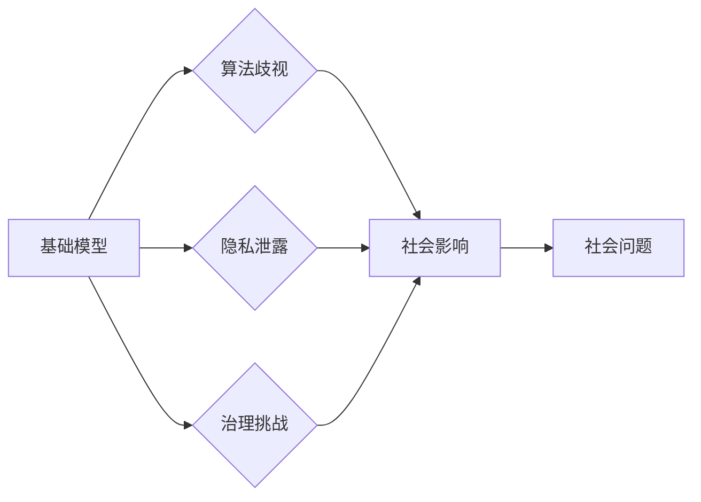

# 基础模型的社会技术问题

> 关键词：基础模型，社会影响，技术伦理，人工智能，算法歧视，隐私保护，治理挑战

## 1. 背景介绍

随着人工智能技术的飞速发展，基础模型作为AI领域的基石，正在改变我们的生活方式、工作方式和社会结构。从语言处理到图像识别，从推荐系统到自动驾驶，基础模型的应用无处不在。然而，这些强大的技术并非没有副作用，它们在社会技术层面引发了一系列问题，包括算法歧视、隐私泄露、治理挑战等。本文将深入探讨基础模型的社会技术问题，并提出相应的解决方案。

### 1.1 问题的由来

基础模型的社会技术问题源于其自身的复杂性和广泛应用。随着算法的日益智能化，它们开始在社会中扮演越来越重要的角色。然而，这些模型往往缺乏透明度，难以解释其决策过程，这使得人们对其信任度下降，并引发了一系列社会技术问题。

### 1.2 研究现状

近年来，学术界和产业界对基础模型的社会技术问题日益关注。许多研究集中在以下几个方面：

- **算法歧视**：基础模型可能存在偏见，导致对不同群体的不公平对待。
- **隐私泄露**：基础模型在处理个人数据时，可能存在数据泄露的风险。
- **治理挑战**：基础模型的监管和治理成为了一个难题，需要建立相应的法律法规和伦理标准。

### 1.3 研究意义

研究基础模型的社会技术问题，对于推动人工智能技术的健康发展，构建公正、公平、安全的社会具有重要意义。通过深入了解这些问题，我们可以：

- 提高对人工智能技术的认识，避免过度乐观或悲观。
- 建立有效的监管机制，确保人工智能技术的安全应用。
- 促进人工智能技术的伦理发展，推动社会进步。

## 2. 核心概念与联系

为了更好地理解基础模型的社会技术问题，我们需要了解以下几个核心概念：

- **基础模型**：指在大规模数据上预训练的模型，如Transformer、BERT等。
- **算法歧视**：指算法在决策过程中对某些群体不公平对待。
- **隐私保护**：指在处理个人数据时，防止数据泄露和滥用。
- **治理挑战**：指建立有效的监管机制和伦理标准，确保人工智能技术的安全应用。

以下是这些概念之间的Mermaid流程图：



从图中可以看出，基础模型通过算法歧视、隐私泄露和治理挑战，最终导致了一系列社会问题。

## 3. 核心算法原理 & 具体操作步骤

### 3.1 算法原理概述

基础模型的算法原理主要包括以下几个方面：

- **深度学习**：通过多层神经网络对数据进行学习，从而提取特征和规律。
- **预训练**：在大规模无标签数据上进行训练，提高模型的泛化能力。
- **微调**：在特定任务上使用少量标签数据进行微调，提高模型在特定领域的性能。

### 3.2 算法步骤详解

基础模型的算法步骤主要包括以下几个阶段：

1. **数据收集**：收集大量的数据，包括文本、图像、语音等。
2. **数据预处理**：对收集到的数据进行清洗、去重、标注等预处理。
3. **模型训练**：使用预处理后的数据对模型进行训练。
4. **模型评估**：使用测试数据对模型的性能进行评估。
5. **模型部署**：将训练好的模型部署到实际应用中。

### 3.3 算法优缺点

基础模型的优点包括：

- **泛化能力强**：通过预训练，基础模型能够在多个任务上取得较好的效果。
- **效率高**：深度学习模型能够高效地处理大量数据。

然而，基础模型也存在一些缺点：

- **数据偏见**：基础模型可能学习到数据中的偏见，导致算法歧视。
- **模型可解释性差**：深度学习模型的决策过程难以解释，增加了模型的可信度问题。

### 3.4 算法应用领域

基础模型的应用领域非常广泛，包括：

- **自然语言处理**：文本分类、机器翻译、情感分析等。
- **计算机视觉**：图像识别、目标检测、图像生成等。
- **推荐系统**：个性化推荐、广告投放等。
- **语音识别**：语音到文本、语音合成等。

## 4. 数学模型和公式 & 详细讲解 & 举例说明

### 4.1 数学模型构建

基础模型的数学模型主要包括以下几个部分：

- **损失函数**：用于衡量模型预测结果与真实值之间的差异。
- **优化算法**：用于更新模型参数，使损失函数最小化。

以下是交叉熵损失函数的公式：

$$
L(y,\hat{y}) = -\sum_{i=1}^{N}y_i\log\hat{y_i}
$$

其中，$y$ 是真实标签，$\hat{y}$ 是模型预测的概率分布。

### 4.2 公式推导过程

交叉熵损失函数的推导过程如下：

假设模型预测的概率分布为 $\hat{y}$，真实标签为 $y$。则交叉熵损失函数可以表示为：

$$
L(y,\hat{y}) = -\sum_{i=1}^{N}y_i\log\hat{y_i}
$$

其中，$N$ 为样本数量。

### 4.3 案例分析与讲解

以下是一个使用交叉熵损失函数进行文本分类的例子：

假设我们有以下文本数据集：

```
text1: "I love cats."
text2: "Cats are cute."
text3: "I hate cats."
```

对应的标签为：

```
label1: 1
label2: 1
label3: 0
```

我们可以使用交叉熵损失函数来评估模型的性能。

## 5. 项目实践：代码实例和详细解释说明

### 5.1 开发环境搭建

为了进行基础模型的开发，我们需要以下环境：

- Python 3.6及以上版本
- TensorFlow或PyTorch库
- NumPy库

### 5.2 源代码详细实现

以下是一个使用TensorFlow进行文本分类的例子：

```python
import tensorflow as tf
from tensorflow.keras.layers import Embedding, Dense, GlobalAveragePooling1D
from tensorflow.keras.models import Sequential

# 定义模型
model = Sequential([
    Embedding(input_dim=vocab_size, output_dim=embedding_dim, input_length=max_length),
    GlobalAveragePooling1D(),
    Dense(128, activation='relu'),
    Dense(num_classes, activation='softmax')
])

# 编译模型
model.compile(optimizer='adam', loss='categorical_crossentropy', metrics=['accuracy'])

# 训练模型
model.fit(train_data, train_labels, epochs=10, validation_data=(test_data, test_labels))
```

### 5.3 代码解读与分析

以上代码定义了一个简单的文本分类模型，使用嵌入层和全局平均池化层提取文本特征，然后通过密集层进行分类。

### 5.4 运行结果展示

运行上述代码，我们可以得到模型的训练和测试结果。

## 6. 实际应用场景

基础模型在实际应用场景中发挥着重要作用，以下是一些例子：

- **智能客服**：使用自然语言处理技术，自动回答客户问题。
- **推荐系统**：根据用户历史行为，推荐个性化的商品或内容。
- **自动驾驶**：使用计算机视觉技术，实现车辆的自动驾驶功能。

## 7. 工具和资源推荐

### 7.1 学习资源推荐

- 《深度学习》
- 《Python机器学习》
- TensorFlow官方文档
- PyTorch官方文档

### 7.2 开发工具推荐

- TensorFlow
- PyTorch
- Keras

### 7.3 相关论文推荐

- "A Few Useful Things to Know about Machine Learning"
- "The Unimportance of representedness in vision models"
- "The Cost of Fairness in Machine Learning"

## 8. 总结：未来发展趋势与挑战

### 8.1 研究成果总结

本文对基础模型的社会技术问题进行了探讨，分析了其核心概念、原理、应用领域和挑战，并提出了相应的解决方案。

### 8.2 未来发展趋势

未来，基础模型将朝着以下方向发展：

- **模型小型化**：为了适应移动设备和边缘计算，模型将更加小型化。
- **模型可解释性**：提高模型的可解释性，增强用户对模型的信任度。
- **模型安全**：提高模型的安全性，防止恶意攻击。

### 8.3 面临的挑战

基础模型面临的挑战包括：

- **数据偏见**：如何消除数据中的偏见，提高模型的公平性。
- **模型可解释性**：如何提高模型的可解释性，增强用户对模型的信任度。
- **模型安全**：如何提高模型的安全性，防止恶意攻击。

### 8.4 研究展望

未来，我们需要继续深入研究基础模型的社会技术问题，推动人工智能技术的健康发展，构建一个公正、公平、安全的社会。

## 9. 附录：常见问题与解答

**Q1：基础模型是否会导致算法歧视？**

A：是的，基础模型可能存在算法歧视。这是因为训练数据中可能存在偏见，导致模型学习到不公平的决策规则。

**Q2：如何解决基础模型的数据偏见问题？**

A：解决基础模型的数据偏见问题需要从多个方面入手，包括数据收集、数据清洗、模型设计等。

**Q3：基础模型是否会泄露个人隐私？**

A：基础模型在处理个人数据时，存在隐私泄露的风险。为了保护个人隐私，需要采取相应的安全措施，如数据脱敏、加密等。

**Q4：如何提高基础模型的可解释性？**

A：提高基础模型的可解释性需要从多个方面入手，包括模型设计、解释方法等。

**Q5：如何确保基础模型的安全性？**

A：确保基础模型的安全性需要从多个方面入手，包括模型设计、安全措施等。

作者：禅与计算机程序设计艺术 / Zen and the Art of Computer Programming