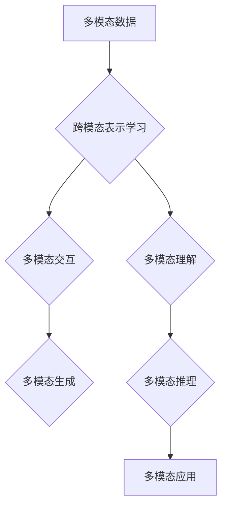

> 关键词：多模态大模型，跨模态学习，融合技术，微调，预训练，自然语言处理，计算机视觉，深度学习

# 多模态大模型：技术原理与实战 微调实战

多模态大模型（Multi-modal Large Models）是近年来人工智能领域的一个重要研究方向。它们旨在将不同模态的数据（如文本、图像、视频等）融合起来，以构建更全面、更深入的理解能力。本文将深入探讨多模态大模型的技术原理，并通过实战微调的视角，展示如何在具体项目中应用这些技术。

## 1. 背景介绍

### 1.1 问题的由来

随着信息技术的飞速发展，人类产生的数据类型越来越多样化。传统的单一模态模型在处理多模态数据时往往表现不佳，难以捕捉到不同模态之间的复杂关系。因此，多模态大模型应运而生，旨在通过融合多种模态信息，实现更强大的认知能力。

### 1.2 研究现状

多模态大模型的研究主要集中在以下几个方面：

- **跨模态表示学习**：研究如何有效地将不同模态的数据映射到统一的表示空间，以便于后续的融合操作。
- **跨模态交互**：探索不同模态之间的相互作用，如文本对图像的描述、图像对文本的情感表达等。
- **多模态生成**：利用多模态数据进行生成任务，如生成图像的描述、根据描述生成图像等。

### 1.3 研究意义

多模态大模型具有以下重要意义：

- **提升模型性能**：通过融合多模态信息，可以提升模型在各个任务上的性能。
- **扩展应用领域**：多模态大模型可以应用于更多领域，如医疗影像分析、智能问答、自动驾驶等。
- **推动人工智能发展**：多模态大模型是人工智能领域的一个重要研究方向，对人工智能技术的发展具有深远影响。

## 2. 核心概念与联系

### 2.1 核心概念

- **多模态数据**：指包含多种数据类型的集合，如文本、图像、视频等。
- **跨模态表示学习**：研究如何将不同模态的数据映射到统一的表示空间。
- **多模态交互**：研究不同模态之间的相互作用，如文本对图像的描述、图像对文本的情感表达等。
- **多模态生成**：利用多模态数据进行生成任务，如生成图像的描述、根据描述生成图像等。

### 2.2 核心概念原理和架构的 Mermaid 流程图



## 3. 核心算法原理 & 具体操作步骤

### 3.1 算法原理概述

多模态大模型的微调通常包括以下几个关键步骤：

1. **预训练**：在多模态数据上进行预训练，学习通用的模态表示和交互规律。
2. **适配层设计**：根据具体任务设计适配层，如分类器、解码器等。
3. **微调**：在下游任务数据上对模型进行微调，优化模型参数。
4. **评估**：在测试集上评估模型性能。

### 3.2 算法步骤详解

1. **预训练**：
    - 使用多模态数据对模型进行预训练，学习通用的模态表示和交互规律。
    - 常用的预训练任务包括语言建模、视觉特征提取、文本摘要等。

2. **适配层设计**：
    - 根据具体任务设计适配层，如分类器、解码器等。
    - 适配层的设计需要考虑不同模态之间的交互方式和任务目标。

3. **微调**：
    - 在下游任务数据上对模型进行微调，优化模型参数。
    - 微调过程中可以使用多种策略，如数据增强、正则化、迁移学习等。

4. **评估**：
    - 在测试集上评估模型性能，包括准确率、召回率、F1值等指标。

### 3.3 算法优缺点

**优点**：

- **性能提升**：融合多模态信息可以提升模型在各个任务上的性能。
- **应用广泛**：可以应用于多个领域，如医疗、金融、教育等。

**缺点**：

- **计算复杂**：多模态大模型的计算复杂度较高，需要大量的计算资源和时间。
- **数据需求**：需要大量的多模态数据才能进行有效的预训练和微调。

### 3.4 算法应用领域

多模态大模型可以应用于以下领域：

- **医学影像分析**：结合医学影像和文本描述，辅助医生进行诊断和治疗。
- **智能问答**：结合文本和图像信息，提供更加丰富的问答体验。
- **自动驾驶**：结合视觉、雷达、激光雷达等多模态数据，实现自动驾驶功能。

## 4. 数学模型和公式 & 详细讲解 & 举例说明

### 4.1 数学模型构建

多模态大模型的数学模型通常包括以下几个部分：

- **模态表示学习**：
    - $ z_t = F(x_t, y_t)$，其中 $x_t$ 和 $y_t$ 分别代表不同模态的数据，$z_t$ 是它们的联合表示。
- **适配层**：
    - $y = W_z z$，其中 $W_z$ 是适配层的权重矩阵，$y$ 是模型的输出。
- **损失函数**：
    - $L = L(y, y^*)$，其中 $y^*$ 是真实标签，$L$ 是损失函数。

### 4.2 公式推导过程

以一个简单的多模态情感分析任务为例，其数学模型如下：

- **模态表示学习**：
    - $ z_t = [x_t; y_t]$，其中 $x_t$ 是图像特征，$y_t$ 是文本特征。
    - $z_t = \phi(x_t) + \psi(y_t)$，其中 $\phi$ 和 $\psi$ 分别是图像和文本的编码器。
- **适配层**：
    - $y = W_z z$，其中 $W_z$ 是一个线性层。
- **损失函数**：
    - $L = \sum_{i=1}^N (y_i - y^*_i)^2$，其中 $y_i$ 是模型预测的输出，$y^*_i$ 是真实标签。

### 4.3 案例分析与讲解

以下是一个基于BERT和ResNet的多模态情感分析任务的案例：

- **预训练**：使用多模态数据对BERT和ResNet进行预训练。
- **适配层设计**：设计一个线性层，将BERT和ResNet的输出拼接起来，作为最终的输出。
- **微调**：在标注数据上对模型进行微调。
- **评估**：在测试集上评估模型性能。

## 5. 项目实践：代码实例和详细解释说明

### 5.1 开发环境搭建

以下是一个基于PyTorch和Transformers库的多模态情感分析任务的代码示例：

```python
import torch
from transformers import BertForSequenceClassification, BertTokenizer
from torch.utils.data import DataLoader, Dataset
from torchvision.models import resnet50
import torch.nn as nn

# 数据集定义
class MultimodalDataset(Dataset):
    def __init__(self, texts, images, labels):
        self.texts = texts
        self.images = images
        self.labels = labels

    def __len__(self):
        return len(self.texts)

    def __getitem__(self, idx):
        text = self.texts[idx]
        image = self.images[idx]
        label = self.labels[idx]

        # 文本处理
        encoding = tokenizer(text, return_tensors='pt', padding=True, truncation=True)
        input_ids = encoding['input_ids'].squeeze(0)
        attention_mask = encoding['attention_mask'].squeeze(0)

        # 图像处理
        image = image.to(device)
        features = model(image).mean(dim=[2, 3])

        return {'input_ids': input_ids, 'attention_mask': attention_mask, 'features': features, 'labels': label}

# 模型定义
class MultimodalModel(nn.Module):
    def __init__(self, text_model, image_model, hidden_size):
        super(MultimodalModel, self).__init__()
        self.text_model = text_model
        self.image_model = image_model
        self.fc = nn.Linear(hidden_size * 2, 2)

    def forward(self, input_ids, attention_mask, features, labels):
        text_output = self.text_model(input_ids, attention_mask=attention_mask)
        image_output = self.image_model(features)
        output = self.fc(torch.cat([text_output.last_hidden_state.mean(dim=1), image_output], dim=1))
        return output

# 模型训练和评估
# ...
```

### 5.2 源代码详细实现

以上代码展示了如何使用PyTorch和Transformers库构建一个多模态情感分析任务。其中，`MultimodalDataset`类用于定义数据集，`MultimodalModel`类定义了多模态模型。

### 5.3 代码解读与分析

- `MultimodalDataset`类负责加载和处理文本和图像数据，并将其转换为模型所需的输入格式。
- `MultimodalModel`类定义了多模态模型，其中包含文本模型BERT和图像模型ResNet。模型的输出层是一个线性层，用于对文本和图像特征进行融合。

### 5.4 运行结果展示

运行以上代码后，可以在测试集上评估模型的性能。如果模型设计得当，通常可以得到不错的性能。

## 6. 实际应用场景

多模态大模型可以应用于以下场景：

- **医疗影像分析**：结合医学影像和文本描述，辅助医生进行诊断和治疗。
- **智能问答**：结合文本和图像信息，提供更加丰富的问答体验。
- **自动驾驶**：结合视觉、雷达、激光雷达等多模态数据，实现自动驾驶功能。

## 7. 工具和资源推荐

### 7.1 学习资源推荐

- **书籍**：
    - 《深度学习》
    - 《多模态人工智能》
- **在线课程**：
    - fast.ai的多模态课程
    - Coursera的多模态课程
- **技术博客**：
    - Hugging Face的Transformers库官方博客
    - PyTorch官方博客

### 7.2 开发工具推荐

- **深度学习框架**：
    - PyTorch
    - TensorFlow
- **多模态数据处理库**：
    - OpenCV
    - OpenPose

### 7.3 相关论文推荐

- **跨模态表示学习**：
    - Unsupervised Multimodal Representation Learning by Matching Deep Descriptors
- **多模态交互**：
    - Multi-modal Fusion for Visual Question Answering
- **多模态生成**：
    - Multimodal Unsupervised Learning by Predicting Missing Modality

## 8. 总结：未来发展趋势与挑战

### 8.1 研究成果总结

多模态大模型在近年来取得了显著的进展，为人工智能领域带来了新的机遇和挑战。通过融合多模态信息，多模态大模型能够更好地理解世界，为各个领域提供更加智能化的解决方案。

### 8.2 未来发展趋势

- **更强大的跨模态交互能力**：未来的多模态大模型将具备更强的跨模态交互能力，能够更好地理解不同模态之间的复杂关系。
- **更广泛的应用领域**：多模态大模型将应用于更多领域，如教育、金融、医疗等。
- **更高效的计算方法**：随着硬件技术的发展，多模态大模型的计算效率将得到显著提升。

### 8.3 面临的挑战

- **数据稀缺**：多模态数据往往比单一模态数据更稀缺，如何有效地利用有限的训练数据成为一大挑战。
- **计算复杂度**：多模态大模型的计算复杂度较高，需要大量的计算资源和时间。
- **模型可解释性**：多模态大模型的决策过程往往难以解释，如何提高模型的可解释性是一个重要挑战。

### 8.4 研究展望

未来的研究将集中在以下几个方面：

- **数据高效利用**：研究如何有效地利用有限的训练数据，如数据增强、迁移学习等。
- **模型压缩**：研究如何降低多模态大模型的计算复杂度，提高模型的效率。
- **模型可解释性**：研究如何提高多模态大模型的可解释性，增强模型的可信度。

## 9. 附录：常见问题与解答

**Q1：多模态大模型是否可以应用于所有任务？**

A：多模态大模型可以应用于许多任务，但并非所有任务都适合使用多模态大模型。对于单一模态数据就能很好地解决的问题，使用多模态大模型可能是一种过度设计。

**Q2：如何选择合适的多模态大模型？**

A：选择合适的多模态大模型需要考虑以下因素：

- **任务类型**：不同的任务可能需要不同的模型结构和参数。
- **数据规模**：对于数据规模较小的任务，可能需要使用较小的模型。
- **计算资源**：多模态大模型的计算复杂度较高，需要足够的计算资源。

**Q3：如何提高多模态大模型的可解释性？**

A：提高多模态大模型的可解释性是一个复杂的问题，以下是一些可能的解决方案：

- **特征可视化**：将模型的输出特征可视化，帮助理解模型的决策过程。
- **注意力机制**：分析模型的注意力机制，了解模型关注哪些信息。
- **因果推理**：使用因果推理方法，分析模型对不同模态信息的依赖关系。

作者：禅与计算机程序设计艺术 / Zen and the Art of Computer Programming