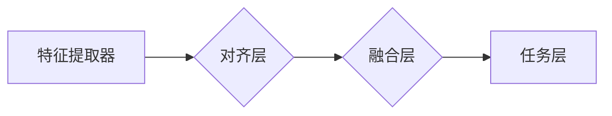

> 多模态大模型, 提示学习, 指令微调, 图像-文本对齐, 跨模态学习, 意图理解, 可解释性, 应用实践

# 多模态大模型：技术原理与实战 提示学习与指令微调

多模态大模型是近年来人工智能领域的一个重要研究方向，它融合了多种模态的信息，如文本、图像、音频等，以实现对复杂任务的理解和生成。本文将深入探讨多模态大模型的技术原理，并结合实战案例，介绍提示学习与指令微调的应用方法。

## 1. 背景介绍

随着深度学习技术的快速发展，多模态大模型在图像识别、自然语言处理、语音识别等领域取得了显著的成果。多模态大模型能够同时处理来自不同模态的数据，从而更好地理解复杂场景和任务。然而，多模态大模型的设计与训练面临着诸多挑战，如模态之间的对齐、跨模态特征提取、意图理解等。

## 2. 核心概念与联系

### 2.1 多模态大模型

多模态大模型是指能够同时处理两种或多种模态数据的深度学习模型。常见的多模态数据包括图像、文本、音频、视频等。多模态大模型通常由以下几部分组成：

- **特征提取器**：用于从不同模态的数据中提取特征。
- **对齐层**：用于对齐不同模态的特征。
- **融合层**：用于融合不同模态的特征。
- **任务层**：用于执行特定的任务，如分类、回归、生成等。

以下是多模态大模型的Mermaid流程图：



### 2.2 提示学习

提示学习（Prompt Learning）是一种通过向大模型提供提示（Prompt）来引导模型生成期望输出的方法。提示可以是文本、图像或音频等任何模态的数据。

### 2.3 指令微调

指令微调（Instruction Tuning）是一种通过向预训练模型提供具体的指令来调整模型行为的方法。指令可以是文本形式的任务描述，如“将以下文本翻译成法语”。

### 2.4 跨模态学习

跨模态学习是指在不同模态之间建立联系，以提取和利用有用的信息。跨模态学习通常涉及以下步骤：

1. 特征提取：从不同模态的数据中提取特征。
2. 对齐：将不同模态的特征对齐到同一空间。
3. 融合：融合不同模态的特征。
4. 应用：将融合后的特征应用于下游任务。

## 3. 核心算法原理 & 具体操作步骤

### 3.1 算法原理概述

多模态大模型的算法原理主要包括以下步骤：

1. 特征提取：使用卷积神经网络（CNN）从图像中提取特征，使用循环神经网络（RNN）或Transformer从文本中提取特征。
2. 对齐：使用特征对齐技术，如自编码器、多任务学习等，将不同模态的特征对齐到同一空间。
3. 融合：使用注意力机制、图神经网络等融合不同模态的特征。
4. 任务层：根据具体任务，如分类、回归、生成等，使用合适的神经网络结构进行预测或生成。

### 3.2 算法步骤详解

1. **数据预处理**：对多模态数据进行预处理，如图像缩放、文本分词等。
2. **特征提取**：使用CNN提取图像特征，使用RNN或Transformer提取文本特征。
3. **对齐**：使用自编码器或多任务学习将不同模态的特征对齐到同一空间。
4. **融合**：使用注意力机制或图神经网络融合不同模态的特征。
5. **任务层**：使用适当的神经网络结构进行预测或生成。

### 3.3 算法优缺点

**优点**：

- 能够同时处理多种模态的数据，更好地理解复杂场景。
- 能够提取更丰富的特征，提高模型的性能。
- 能够解决单模态任务中难以解决的问题。

**缺点**：

- 模型复杂度高，训练成本高。
- 模型可解释性差。

### 3.4 算法应用领域

多模态大模型的应用领域包括：

- 图像识别：如人脸识别、物体识别、场景理解等。
- 自然语言处理：如文本分类、情感分析、机器翻译等。
- 语音识别：如语音合成、语音识别、语音翻译等。
- 视频分析：如动作识别、事件检测、视频分类等。

## 4. 数学模型和公式 & 详细讲解 & 举例说明

### 4.1 数学模型构建

多模态大模型的数学模型主要包括以下部分：

- **特征提取器**：$F(\cdot)$
- **对齐层**：$G(\cdot)$
- **融合层**：$H(\cdot)$
- **任务层**：$T(\cdot)$

其中，$x$ 表示输入数据，$y$ 表示输出数据。

### 4.2 公式推导过程

假设输入数据为 $x = (x_1, x_2, \ldots, x_m)$，其中 $m$ 表示模态数量。则多模态大模型的输出为：

$$
y = T(H(G(F(x_1), F(x_2), \ldots, F(x_m)))
$$

### 4.3 案例分析与讲解

以下是一个简单的多模态情感分析案例：

- **输入**：图像和文本
- **任务**：判断情感是正面、负面还是中性

我们可以使用以下步骤进行微调：

1. 使用预训练的CNN提取图像特征。
2. 使用预训练的RNN或Transformer提取文本特征。
3. 使用多任务学习对齐图像和文本特征。
4. 使用注意力机制融合对齐后的特征。
5. 使用简单的分类器进行情感分析。

## 5. 项目实践：代码实例和详细解释说明

### 5.1 开发环境搭建

1. 安装Python和TensorFlow。
2. 安装TensorFlow的Keras API。
3. 安装OpenCV和Pillow用于图像处理。

### 5.2 源代码详细实现

以下是一个简单的多模态情感分析代码示例：

```python
import tensorflow as tf
from tensorflow.keras.models import Model
from tensorflow.keras.layers import Input, Conv2D, MaxPooling2D, Flatten, Dense, concatenate, LSTM, Embedding, Bidirectional

# 图像特征提取
image_input = Input(shape=(224, 224, 3))
image_features = Conv2D(32, (3, 3), activation='relu')(image_input)
image_features = MaxPooling2D((2, 2))(image_features)
image_features = Flatten()(image_features)

# 文本特征提取
text_input = Input(shape=(None,))
text_features = Embedding(input_dim=vocab_size, output_dim=128)(text_input)
text_features = Bidirectional(LSTM(128))(text_features)
text_features = Flatten()(text_features)

# 融合特征
merged_features = concatenate([image_features, text_features])

# 任务层
output = Dense(3, activation='softmax')(merged_features)

# 创建模型
model = Model(inputs=[image_input, text_input], outputs=output)

# 编译模型
model.compile(optimizer='adam', loss='categorical_crossentropy', metrics=['accuracy'])

# 拟合模型
model.fit([image_data, text_data], labels, epochs=10, batch_size=32)
```

### 5.3 代码解读与分析

以上代码实现了一个简单的多模态情感分析模型。首先，使用卷积神经网络从图像中提取特征，使用循环神经网络从文本中提取特征。然后，将提取的特征融合，并使用简单的分类器进行情感分析。

### 5.4 运行结果展示

假设我们有以下数据：

- 图像数据：图片路径列表
- 文本数据：文本列表
- 标签：情感标签列表

我们可以使用以下代码运行模型：

```python
# 加载模型
model = load_model('multimodal_model.h5')

# 预测
predictions = model.predict([image_data, text_data])
```

## 6. 实际应用场景

多模态大模型在以下领域有广泛的应用：

- **智能问答系统**：结合文本和图像，提供更加丰富的问答体验。
- **图像搜索**：结合文本和图像，提供更加精准的搜索结果。
- **虚拟助手**：结合文本和语音，提供更加人性化的交互体验。
- **自动驾驶**：结合图像和文本，提高自动驾驶系统的安全性和可靠性。

## 7. 工具和资源推荐

### 7.1 学习资源推荐

- 《深度学习》
- 《计算机视觉：算法与应用》
- 《自然语言处理综合教程》
- 《TensorFlow 2.0 深度学习实战》

### 7.2 开发工具推荐

- TensorFlow
- PyTorch
- OpenCV
- Pillow

### 7.3 相关论文推荐

- `"Multimodal Deep Learning: A Survey"` by Yichen Wei et al.
- `"A Review of Multi-modal Fusion Techniques in Deep Learning for Image Classification"` by Shiyu Chang et al.
- `"Bridging the Gap Between Natural Language Understanding and Image Understanding"` by Fei-Fei Li et al.

## 8. 总结：未来发展趋势与挑战

### 8.1 研究成果总结

多模态大模型在近年来取得了显著的成果，能够同时处理多种模态的数据，更好地理解复杂场景和任务。然而，多模态大模型的设计与训练仍然面临着诸多挑战。

### 8.2 未来发展趋势

未来，多模态大模型的发展趋势主要包括：

- 模型规模将更大，能够处理更加复杂的任务。
- 模型将更加轻量，更适合移动设备和嵌入式系统。
- 模型将更加可解释，易于理解和调试。
- 模型将更加安全，避免恶意攻击。

### 8.3 面临的挑战

多模态大模型面临的挑战主要包括：

- 模型复杂度高，训练成本高。
- 模型可解释性差。
- 模型容易受到对抗样本的攻击。

### 8.4 研究展望

未来，多模态大模型的研究将主要集中在以下方面：

- 模型轻量化。
- 模型可解释性。
- 模型安全性。
- 模型泛化能力。

## 9. 附录：常见问题与解答

**Q1：什么是多模态大模型？**

A1：多模态大模型是指能够同时处理两种或多种模态数据的深度学习模型。

**Q2：多模态大模型有哪些应用场景？**

A2：多模态大模型的应用场景包括智能问答系统、图像搜索、虚拟助手、自动驾驶等。

**Q3：多模态大模型有哪些挑战？**

A3：多模态大模型的挑战主要包括模型复杂度高、可解释性差、易受对抗样本攻击等。

**Q4：如何选择合适的多模态大模型？**

A4：选择合适的多模态大模型需要考虑任务需求、数据规模、计算资源等因素。

作者：禅与计算机程序设计艺术 / Zen and the Art of Computer Programming