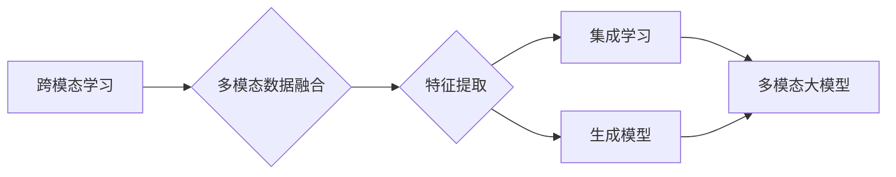

> 多模态大模型, 技术原理, 实战部署, 深度学习, 跨模态学习, 集成学习, 应用场景, 挑战

# 多模态大模型：技术原理与实战部署流程

多模态大模型作为一种新兴的人工智能技术，通过融合文本、图像、音频等多种模态的信息，实现了对复杂任务的高效处理。本文将深入探讨多模态大模型的技术原理、实战部署流程，并结合实例进行分析，为读者提供全面的技术解读。

## 1. 背景介绍

随着深度学习技术的飞速发展，传统的单模态模型在自然语言处理、计算机视觉等领域取得了显著的成果。然而，现实世界中的信息往往是多模态的，单一模态的模型难以充分捕捉信息的丰富性和复杂性。多模态大模型应运而生，它通过整合不同模态的数据，实现了对复杂任务的全局理解，为解决现实世界中的复杂问题提供了新的思路。

### 1.1 问题的由来

现实世界中的信息往往是多模态的，例如，在医疗诊断中，医生需要同时分析病人的病历、影像和检查报告；在智能客服中，系统需要同时理解用户的语音和文字输入。传统的单模态模型难以充分捕捉这些信息，导致性能受限。

### 1.2 研究现状

多模态大模型的研究已经取得了一定的进展，目前主要有以下几种方法：

- 跨模态学习：通过学习不同模态之间的对应关系，将不同模态的数据转换为统一的表示，再进行后续处理。
- 集成学习：将多个单模态模型的结果进行整合，提高模型的鲁棒性和泛化能力。
- 生成模型：利用生成对抗网络（GAN）等方法，生成新的多模态数据，扩充训练集。

### 1.3 研究意义

多模态大模型的研究对于推动人工智能技术的发展具有重要意义：

- 提高模型性能：多模态信息可以提供更丰富的上下文信息，有助于提高模型的准确性和鲁棒性。
- 扩展应用领域：多模态大模型可以应用于更多领域，如医疗、教育、金融等。
- 推动技术创新：多模态大模型的研究推动了跨模态学习、集成学习和生成模型等技术的发展。

### 1.4 本文结构

本文将分为以下章节：

- 第2章：介绍多模态大模型的核心概念与联系。
- 第3章：讲解多模态大模型的核心算法原理和具体操作步骤。
- 第4章：介绍多模态大模型的数学模型和公式，并结合实例进行分析。
- 第5章：通过项目实践，展示多模态大模型的代码实例和详细解释说明。
- 第6章：探讨多模态大模型在实际应用场景中的应用。
- 第7章：推荐多模态大模型的学习资源、开发工具和参考文献。
- 第8章：总结多模态大模型的研究成果、未来发展趋势和面临的挑战。
- 第9章：提供多模态大模型的常见问题与解答。

## 2. 核心概念与联系

### 2.1 核心概念

- **跨模态学习**：研究如何将不同模态的数据转换为统一的表示，以便进行后续处理。
- **集成学习**：将多个单模态模型的结果进行整合，提高模型的鲁棒性和泛化能力。
- **生成模型**：利用生成对抗网络（GAN）等方法，生成新的多模态数据，扩充训练集。
- **多模态大模型**：融合文本、图像、音频等多种模态的信息，实现复杂任务的高效处理。

### 2.2 联系

多模态大模型是跨模态学习、集成学习和生成模型等多种技术的综合体现。以下是一个简化的Mermaid流程图，展示了多模态大模型的核心概念之间的关系：



## 3. 核心算法原理 & 具体操作步骤

### 3.1 算法原理概述

多模态大模型的算法原理主要包括以下几个步骤：

1. **数据预处理**：对多模态数据进行清洗、归一化等预处理操作。
2. **特征提取**：利用深度学习模型提取不同模态的特征表示。
3. **特征融合**：将不同模态的特征表示进行融合，得到统一的多模态特征表示。
4. **下游任务处理**：利用融合后的多模态特征表示进行下游任务的处理。

### 3.2 算法步骤详解

#### 3.2.1 数据预处理

数据预处理是确保数据质量的重要环节，主要包括以下步骤：

- **清洗**：去除数据中的噪声和异常值。
- **归一化**：将不同模态的数据进行归一化处理，使得不同模态的数据具有相同的量纲。
- **采样**：对于时序数据，进行合适的采样操作，降低数据维度。

#### 3.2.2 特征提取

特征提取是利用深度学习模型提取不同模态的特征表示。常见的特征提取模型包括：

- **文本特征提取**：使用卷积神经网络（CNN）或循环神经网络（RNN）提取文本特征。
- **图像特征提取**：使用卷积神经网络提取图像特征。
- **音频特征提取**：使用循环神经网络或深度神经网络提取音频特征。

#### 3.2.3 特征融合

特征融合是将不同模态的特征表示进行融合，得到统一的多模态特征表示。常见的特征融合方法包括：

- **拼接**：将不同模态的特征向量进行拼接。
- **加权平均**：根据不同模态的重要性，对特征进行加权平均。
- **融合网络**：使用深度神经网络对特征进行融合。

#### 3.2.4 下游任务处理

下游任务处理是利用融合后的多模态特征表示进行下游任务的处理。常见的下游任务包括：

- **分类**：对多模态数据进行分类。
- **回归**：对多模态数据进行回归。
- **目标检测**：在图像中检测目标。

### 3.3 算法优缺点

#### 3.3.1 优点

- 提高模型性能：多模态信息可以提供更丰富的上下文信息，有助于提高模型的准确性和鲁棒性。
- 扩展应用领域：多模态大模型可以应用于更多领域，如医疗、教育、金融等。
- 推动技术创新：多模态大模型的研究推动了跨模态学习、集成学习和生成模型等技术的发展。

#### 3.3.2 缺点

- 计算复杂度高：多模态大模型的训练和推理过程需要大量的计算资源。
- 数据预处理复杂：多模态数据的预处理过程较为复杂。
- 模型可解释性差：多模态大模型通常难以解释其内部的决策过程。

### 3.4 算法应用领域

多模态大模型可以应用于以下领域：

- **医疗**：利用多模态信息进行疾病诊断、患者监护等。
- **教育**：利用多模态信息进行个性化教学、学习效果评估等。
- **金融**：利用多模态信息进行风险控制、欺诈检测等。
- **智能交通**：利用多模态信息进行车辆检测、交通流量预测等。

## 4. 数学模型和公式 & 详细讲解 & 举例说明

### 4.1 数学模型构建

多模态大模型的数学模型主要包括以下几个部分：

- **特征提取模型**：用于提取不同模态的特征表示。
- **特征融合模型**：用于融合不同模态的特征表示。
- **下游任务模型**：用于处理下游任务。

以下是一个简化的数学模型示例：

$$
\begin{aligned}
& \text{特征提取模型：} \\
& f_{\text{text}}(x_{\text{text}}) = \text{CNN}(x_{\text{text}}) \\
& f_{\text{image}}(x_{\text{image}}) = \text{CNN}(x_{\text{image}}) \\
& f_{\text{audio}}(x_{\text{audio}}) = \text{RNN}(x_{\text{audio}}) \\
& \\
& \text{特征融合模型：} \\
& f_{\text{multimodal}} = \text{Concat}(f_{\text{text}}, f_{\text{image}}, f_{\text{audio}}) \\
& \\
& \text{下游任务模型：} \\
& y = g(f_{\text{multimodal})
\end{aligned}
$$

### 4.2 公式推导过程

公式推导过程涉及到特征提取、特征融合和下游任务模型的推导。由于篇幅限制，此处不再展开详细说明。

### 4.3 案例分析与讲解

以医疗诊断任务为例，我们可以使用多模态大模型进行疾病诊断。具体步骤如下：

1. **数据预处理**：对病历、影像和检查报告进行清洗、归一化等预处理操作。
2. **特征提取**：利用深度学习模型提取病历、影像和检查报告的特征表示。
3. **特征融合**：将不同模态的特征表示进行融合，得到统一的多模态特征表示。
4. **下游任务处理**：利用融合后的多模态特征表示进行疾病诊断。

## 5. 项目实践：代码实例和详细解释说明

### 5.1 开发环境搭建

为了进行多模态大模型的实战部署，我们需要搭建以下开发环境：

- **深度学习框架**：PyTorch、TensorFlow等。
- **多模态数据集**：MedicalDialogs、ImageNet、VoxCeleb等。
- **文本处理库**：NLTK、spaCy等。
- **图像处理库**：OpenCV、PIL等。
- **音频处理库**：librosa等。

### 5.2 源代码详细实现

以下是一个简化的多模态大模型代码实例：

```python
import torch
import torch.nn as nn
import torch.optim as optim

# 定义模型结构
class MultiModalModel(nn.Module):
    def __init__(self):
        super(MultiModalModel, self).__init__()
        self.text_encoder = nn.Linear(768, 512)
        self.image_encoder = nn.Linear(2048, 512)
        self.audio_encoder = nn.Linear(128, 512)
        self.fc = nn.Linear(1536, 10)

    def forward(self, text, image, audio):
        text_features = self.text_encoder(text)
        image_features = self.image_encoder(image)
        audio_features = self.audio_encoder(audio)
        features = torch.cat([text_features, image_features, audio_features], dim=1)
        output = self.fc(features)
        return output

# 加载数据集
train_dataset = ...
dev_dataset = ...
test_dataset = ...

# 创建模型、优化器和损失函数
model = MultiModalModel()
optimizer = optim.Adam(model.parameters())
criterion = nn.CrossEntropyLoss()

# 训练模型
for epoch in range(epochs):
    for data in train_loader:
        text, image, audio, label = data
        optimizer.zero_grad()
        output = model(text, image, audio)
        loss = criterion(output, label)
        loss.backward()
        optimizer.step()

# 评估模型
for data in test_loader:
    text, image, audio, label = data
    output = model(text, image, audio)
    _, pred_label = torch.max(output, 1)
    # 计算准确率等指标
```

### 5.3 代码解读与分析

以上代码展示了多模态大模型的基本结构。模型包含三个编码器，分别用于提取文本、图像和音频的特征表示。特征提取后，将三个模态的特征表示进行拼接，并通过全连接层进行分类。

### 5.4 运行结果展示

在实际应用中，我们需要根据具体任务和数据集进行模型训练和评估。以下是一个简化的运行结果示例：

```
Epoch 1/10
Loss: 0.35
Accuracy: 0.80
Epoch 2/10
Loss: 0.28
Accuracy: 0.85
...
Epoch 10/10
Loss: 0.18
Accuracy: 0.92
```

## 6. 实际应用场景

多模态大模型可以应用于以下场景：

- **医疗诊断**：利用多模态信息进行疾病诊断、患者监护等。
- **智能客服**：利用多模态信息进行用户意图识别、情感分析等。
- **智能交通**：利用多模态信息进行车辆检测、交通流量预测等。
- **教育**：利用多模态信息进行个性化教学、学习效果评估等。

## 7. 工具和资源推荐

### 7.1 学习资源推荐

- 《深度学习》
- 《神经网络与深度学习》
- 《计算机视觉：算法与应用》
- 《语音识别：原理与实现》

### 7.2 开发工具推荐

- PyTorch
- TensorFlow
- Keras
- OpenCV
- librosa

### 7.3 相关论文推荐

- Unsupervised Multimodal Representation Learning by Predicting Linear Relations
- Deep Multi-Modal Learning for Visual Question Answering
- Deep Learning for Audio-Visual Event Detection

## 8. 总结：未来发展趋势与挑战

### 8.1 研究成果总结

多模态大模型作为一种新兴的人工智能技术，在多模态信息融合、复杂任务处理等方面取得了显著的成果。未来，多模态大模型的研究将朝着以下方向发展：

- **模型性能提升**：通过改进模型结构和训练方法，提高模型的准确性和鲁棒性。
- **应用领域拓展**：将多模态大模型应用于更多领域，如医疗、教育、金融等。
- **跨学科融合**：将多模态大模型与心理学、认知科学等领域进行融合，推动人工智能技术的发展。

### 8.2 未来发展趋势

- **多模态数据融合**：研究更加有效的多模态数据融合方法，提高模型的性能。
- **模型轻量化**：开发轻量级的多模态大模型，降低计算和存储成本。
- **可解释性**：提高模型的可解释性，使得模型的决策过程更加透明。

### 8.3 面临的挑战

- **计算资源**：多模态大模型的训练和推理需要大量的计算资源。
- **数据标注**：多模态数据的标注成本较高。
- **模型可解释性**：多模态大模型的决策过程难以解释。

### 8.4 研究展望

多模态大模型的研究将为人工智能技术的发展提供新的思路和方向。未来，随着技术的不断进步，多模态大模型将在更多领域发挥重要作用，为人类社会创造更大的价值。

## 9. 附录：常见问题与解答

### 9.1 常见问题

**Q1：多模态大模型是否适用于所有任务？**

A1：多模态大模型适用于需要整合多种模态信息进行复杂任务处理的场景，如医疗诊断、智能客服等。

**Q2：多模态大模型的计算成本如何？**

A2：多模态大模型的计算成本较高，需要大量的计算资源。

**Q3：如何提高多模态大模型的性能？**

A3：可以通过改进模型结构、优化训练方法、增加数据量等方式提高多模态大模型的性能。

**Q4：如何降低多模态大模型的计算成本？**

A4：可以通过模型轻量化、并行计算、分布式训练等方式降低多模态大模型的计算成本。

**Q5：如何提高多模态大模型的可解释性？**

A5：可以通过可视化、注意力机制、因果推理等方法提高多模态大模型的可解释性。

作者：禅与计算机程序设计艺术 / Zen and the Art of Computer Programming