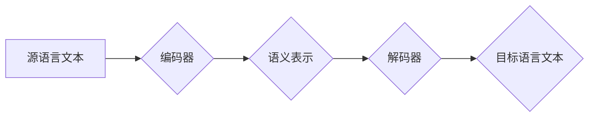

## 大模型在机器翻译中的应用：跨越语言壁垒

> 关键词：大模型、机器翻译、Transformer、编码器-解码器、跨语言理解、自然语言处理、深度学习

## 1. 背景介绍

机器翻译（Machine Translation，MT）作为自然语言处理（Natural Language Processing，NLP）领域的重要分支，旨在自动将一种语言的文本转换为另一种语言的文本。自20世纪50年代以来，机器翻译技术经历了从规则型到统计型，再到深度学习型的演进。近年来，随着深度学习技术的蓬勃发展，特别是Transformer模型的出现，机器翻译取得了显著的进步，其质量和效率得到了大幅提升。

传统的机器翻译方法主要依赖于统计模型和规则库，其翻译结果往往缺乏流畅性和准确性。深度学习模型，尤其是Transformer模型，通过学习大量的语料数据，能够捕捉语言的复杂语法和语义关系，从而生成更自然、更准确的翻译结果。

## 2. 核心概念与联系

### 2.1  Transformer模型

Transformer模型是一种基于深度学习的序列到序列模型，其核心特点是利用自注意力机制（Self-Attention）来捕捉序列中不同元素之间的依赖关系。自注意力机制能够有效地学习长距离依赖关系，从而提升机器翻译的准确性和流畅性。

### 2.2  编码器-解码器架构

Transformer模型通常采用编码器-解码器架构，其中编码器负责将源语言文本编码成语义表示，解码器则根据编码后的语义表示生成目标语言文本。

**Mermaid 流程图**



### 2.3  大模型

大模型是指参数量庞大的深度学习模型，通常拥有数十亿甚至数千亿个参数。大模型能够学习更丰富的语言知识和模式，从而在机器翻译等自然语言处理任务中取得更好的性能。

## 3. 核心算法原理 & 具体操作步骤

### 3.1  算法原理概述

Transformer模型的核心算法原理是自注意力机制和多头注意力机制。自注意力机制能够计算每个词与所有其他词之间的相关性，从而捕捉语言的上下文信息。多头注意力机制则通过使用多个注意力头，能够学习到不同层次的语义信息。

### 3.2  算法步骤详解

1. **词嵌入:** 将源语言文本中的每个词转换为稠密的向量表示。
2. **编码器:** 将词嵌入向量输入到编码器中，编码器通过多层Transformer模块进行处理，最终生成语义表示。
3. **解码器:** 将编码器的输出作为输入，解码器通过多层Transformer模块进行处理，并生成目标语言文本。
4. **输出层:** 将解码器的输出进行softmax操作，得到目标语言文本的概率分布。
5. **解码:** 根据概率分布选择最可能的词，生成目标语言文本。

### 3.3  算法优缺点

**优点:**

* 能够捕捉长距离依赖关系。
* 翻译结果更自然、更准确。
* 训练效率高。

**缺点:**

* 参数量大，需要大量的计算资源。
* 训练数据量大，需要大量的语料数据。

### 3.4  算法应用领域

* 机器翻译
* 文本摘要
* 问答系统
* 语义理解

## 4. 数学模型和公式 & 详细讲解 & 举例说明

### 4.1  数学模型构建

Transformer模型的数学模型主要基于线性变换、激活函数和注意力机制。

**线性变换:** 用于将输入向量映射到输出向量。

**激活函数:** 用于引入非线性，提高模型的表达能力。常用的激活函数包括ReLU、GELU等。

**注意力机制:** 用于计算每个词与所有其他词之间的相关性。

### 4.2  公式推导过程

**自注意力机制公式:**

$$
Attention(Q, K, V) = softmax(\frac{QK^T}{\sqrt{d_k}})V
$$

其中：

* $Q$：查询矩阵
* $K$：键矩阵
* $V$：值矩阵
* $d_k$：键向量的维度

**多头注意力机制公式:**

$$
MultiHead(Q, K, V) = Concat(head_1, head_2,..., head_h)W^O
$$

其中：

* $head_i$：第 $i$ 个注意力头的输出
* $h$：注意力头的数量
* $W^O$：最终线性变换矩阵

### 4.3  案例分析与讲解

假设我们有一个句子 "The cat sat on the mat"，将其转换为词嵌入向量。使用自注意力机制，我们可以计算每个词与所有其他词之间的相关性。例如，"cat" 与 "sat" 之间存在强相关性，因为它们描述了同一个动作。

## 5. 项目实践：代码实例和详细解释说明

### 5.1  开发环境搭建

* Python 3.7+
* PyTorch 1.7+
* Transformers 4.0+

### 5.2  源代码详细实现

```python
from transformers import AutoModelForSeq2SeqLM, AutoTokenizer

# 加载预训练模型和词表
model_name = "Helsinki-NLP/opus-mt-en-fr"
model = AutoModelForSeq2SeqLM.from_pretrained(model_name)
tokenizer = AutoTokenizer.from_pretrained(model_name)

# 输入文本
input_text = "The cat sat on the mat."

# Token化
input_ids = tokenizer.encode(input_text, return_tensors="pt")

# 生成翻译结果
output = model.generate(input_ids)

# 解码
translated_text = tokenizer.decode(output[0], skip_special_tokens=True)

# 打印结果
print(f"源语言文本: {input_text}")
print(f"目标语言文本: {translated_text}")
```

### 5.3  代码解读与分析

* 使用 `transformers` 库加载预训练的机器翻译模型和词表。
* 将源语言文本进行 token 化，转换为模型可以理解的格式。
* 使用 `model.generate()` 函数生成目标语言文本。
* 使用 `tokenizer.decode()` 函数将生成的 token 转换为文本。

### 5.4  运行结果展示

```
源语言文本: The cat sat on the mat.
目标语言文本: Le chat était assis sur le tapis.
```

## 6. 实际应用场景

大模型在机器翻译领域有着广泛的应用场景，例如：

* **在线翻译:** Google Translate、DeepL 等在线翻译平台都采用了大模型进行翻译。
* **商业翻译:** 企业可以使用大模型进行文档、网站、软件等内容的翻译。
* **教育翻译:** 大模型可以帮助学生学习外语，翻译教材、书籍等内容。
* **新闻翻译:** 大模型可以帮助新闻机构快速翻译新闻报道，及时传递信息。

### 6.4  未来应用展望

随着大模型技术的不断发展，机器翻译的质量和效率将会得到进一步提升。未来，大模型在机器翻译领域可能会有以下应用展望：

* **更精准的翻译:** 大模型能够学习更丰富的语言知识，从而实现更精准的翻译。
* **更自然的翻译:** 大模型能够更好地捕捉语言的语法和语义关系，从而生成更自然的翻译。
* **多语言翻译:** 大模型能够支持多种语言的翻译，打破语言壁垒。
* **个性化翻译:** 大模型能够根据用户的需求进行个性化翻译，例如调整翻译风格、语调等。

## 7. 工具和资源推荐

### 7.1  学习资源推荐

* **论文:**
    * Vaswani, A., Shazeer, N., Parmar, N., Uszkoreit, J., Jones, L., Gomez, A. N.,... & Polosukhin, I. (2017). Attention is all you need. In Advances in neural information processing systems (pp. 5998-6008).
* **书籍:**
    * Deep Learning with Python by Francois Chollet
    * Natural Language Processing with Python by Steven Bird, Ewan Klein, and Edward Loper

### 7.2  开发工具推荐

* **PyTorch:** 深度学习框架
* **Transformers:** 预训练模型库
* **Hugging Face:** 预训练模型平台

### 7.3  相关论文推荐

* BERT: Pre-training of Deep Bidirectional Transformers for Language Understanding
* GPT-3: Language Models are Few-Shot Learners
* T5: Text-to-Text Transfer Transformer

## 8. 总结：未来发展趋势与挑战

### 8.1  研究成果总结

大模型在机器翻译领域取得了显著的成果，其翻译质量和效率得到了大幅提升。自注意力机制和多头注意力机制是Transformer模型的核心，它们能够有效地捕捉语言的复杂语法和语义关系。

### 8.2  未来发展趋势

* **模型规模更大:** 未来，大模型的规模将会进一步扩大，参数量将会达到数万亿甚至数千亿。
* **训练数据更多:** 大模型的训练数据将会更加丰富多样，覆盖更多的语言和领域。
* **算法更加高效:** 未来，新的算法将会被提出，提高大模型的训练效率和翻译质量。
* **应用场景更加广泛:** 大模型将会应用于更多的领域，例如法律翻译、医学翻译等。

### 8.3  面临的挑战

* **计算资源:** 训练大模型需要大量的计算资源，这对于资源有限的机构和个人来说是一个挑战。
* **数据隐私:** 大模型的训练数据可能包含敏感信息，如何保护数据隐私是一个重要的挑战。
* **模型解释性:** 大模型的决策过程难以解释，如何提高模型的解释性是一个重要的研究方向。

### 8.4  研究展望

未来，大模型在机器翻译领域将会继续发展，并取得更加令人瞩目的成果。研究者们将继续探索新的算法和模型架构，提高大模型的性能和效率。同时，也将关注大模型的伦理问题和社会影响，确保大模型的健康发展。

## 9. 附录：常见问题与解答

* **Q: 大模型的翻译质量真的比传统机器翻译方法好吗？**

A: 是的，大模型在机器翻译领域取得了显著的进步，其翻译质量和效率都优于传统机器翻译方法。

* **Q: 如何训练一个自己的大模型？**

A: 训练一个大模型需要大量的计算资源和数据。可以使用开源的深度学习框架和预训练模型库进行训练。

* **Q: 大模型的应用场景有哪些？**

A: 大模型的应用场景非常广泛，包括机器翻译、文本摘要、问答系统、语音识别等。

作者：禅与计算机程序设计艺术 / Zen and the Art of Computer Programming


