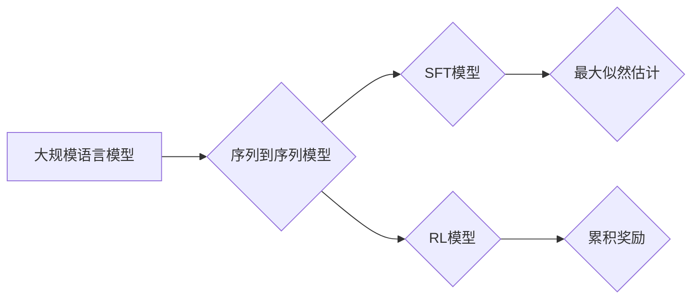

> 关键词：大规模语言模型，SFT模型，RL模型，评估，自然语言处理，Transformer，BERT，预训练，强化学习，迁移学习

# 大规模语言模型从理论到实践 SFT模型和RL模型评估

> 关键词：大规模语言模型，SFT模型，RL模型，评估，自然语言处理，Transformer，BERT，预训练，强化学习，迁移学习

## 1. 背景介绍

随着深度学习技术的飞速发展，自然语言处理（NLP）领域取得了显著的进步。大规模语言模型（Large Language Models，LLMs）的出现，为NLP任务提供了强大的工具，如文本生成、机器翻译、问答系统等。在LLMs中，序列到序列（Sequence-to-Sequence，S2S）模型因其能够处理序列数据的能力而备受关注。S2S模型主要分为两种类型：基于监督学习（Supervised Learning，SFT）的模型和基于强化学习（Reinforcement Learning，RL）的模型。本文将深入探讨这两种模型的原理、实践以及评估方法。

## 2. 核心概念与联系

### 2.1 核心概念

#### 2.1.1 大规模语言模型（LLMs）

大规模语言模型是指经过大量无标签语料预训练的语言模型，它们能够理解、生成和操作自然语言。LLMs通常基于神经网络架构，如Transformer，能够捕捉语言中的复杂模式和规律。

#### 2.1.2 序列到序列模型（S2S）

S2S模型是指能够将一个序列输入转换为另一个序列输出的模型。在NLP中，S2S模型被广泛应用于机器翻译、文本摘要、语音识别等任务。

#### 2.1.3 监督学习（SFT）模型

SFT模型是指通过大量标注数据进行训练的模型。在S2S模型中，SFT模型通常使用最大似然估计（Maximum Likelihood Estimation，MLE）来优化模型参数。

#### 2.1.4 强化学习（RL）模型

RL模型是指通过与环境交互来学习策略的模型。在S2S模型中，RL模型通过最大化累积奖励来学习最优的序列生成策略。

### 2.2 Mermaid流程图



## 3. 核心算法原理 & 具体操作步骤

### 3.1 算法原理概述

#### 3.1.1 SFT模型原理

SFT模型通过最小化损失函数来学习模型参数。在S2S模型中，损失函数通常使用交叉熵损失来衡量预测序列与真实序列之间的差异。

#### 3.1.2 RL模型原理

RL模型通过与环境交互，根据奖励信号调整策略参数。在S2S模型中，RL模型通常使用策略梯度（Policy Gradient）或价值迭代（Value Iteration）算法来学习最优策略。

### 3.2 算法步骤详解

#### 3.2.1 SFT模型步骤

1. 加载预训练的语言模型。
2. 定义S2S模型结构，包括编码器（Encoder）和解码器（Decoder）。
3. 选择合适的损失函数，如交叉熵损失。
4. 使用标注数据进行训练，优化模型参数。
5. 在测试集上评估模型性能。

#### 3.2.2 RL模型步骤

1. 设计S2S模型的解码器。
2. 定义奖励函数，如BLEU分数。
3. 使用强化学习算法，如策略梯度，训练解码器。
4. 在测试集上评估模型性能。

### 3.3 算法优缺点

#### 3.3.1 SFT模型优点

- 训练简单，易于实现。
- 性能稳定，可预测。

#### 3.3.2 SFT模型缺点

- 需要大量标注数据。
- 难以处理复杂任务。

#### 3.3.3 RL模型优点

- 能够处理复杂任务。
- 不需要大量标注数据。

#### 3.3.4 RL模型缺点

- 训练过程复杂，难以优化。
- 性能不稳定。

### 3.4 算法应用领域

SFT模型和RL模型在NLP领域有着广泛的应用，如：

- 机器翻译
- 文本摘要
- 语音识别
- 问答系统
- 生成式对话

## 4. 数学模型和公式 & 详细讲解 & 举例说明

### 4.1 数学模型构建

#### 4.1.1 SFT模型

在SFT模型中，损失函数通常使用交叉熵损失：

$$
L(\theta) = -\sum_{i=1}^N \sum_{j=1}^M y_{ij} \log p(x_{ij}|\theta)
$$

其中，$x_{ij}$ 表示解码器生成的第$i$个单词的概率，$y_{ij}$ 表示真实标签。

#### 4.1.2 RL模型

在RL模型中，策略梯度可以表示为：

$$
\nabla_{\theta} J(\theta) = \sum_{t=1}^T \sum_{a \in \pi(\theta, s_t)} \nabla_{\theta} \pi(a|s_t) \gamma^{t-1}R(t)
$$

其中，$J(\theta)$ 表示策略值函数，$\pi(a|s_t)$ 表示在状态$s_t$下采取动作$a$的策略，$R(t)$ 表示在时间步$t$获得的奖励。

### 4.2 公式推导过程

#### 4.2.1 SFT模型

交叉熵损失的推导过程如下：

$$
L(\theta) = -\sum_{i=1}^N \sum_{j=1}^M y_{ij} \log p(x_{ij}|\theta) = -\sum_{i=1}^N \sum_{j=1}^M y_{ij} \log \frac{p(x_{ij}|\theta)}{p(y_{ij}|\theta)} = \sum_{i=1}^N \sum_{j=1}^M y_{ij} \log \frac{p(y_{ij}|\theta)}{p(x_{ij}|\theta)}
$$

其中，$p(x_{ij}|\theta)$ 表示解码器生成第$i$个单词的概率，$p(y_{ij}|\theta)$ 表示真实标签的第$i$个单词的概率。

#### 4.2.2 RL模型

策略梯度的推导过程如下：

$$
J(\theta) = \sum_{t=1}^T \sum_{a \in \pi(\theta, s_t)} \gamma^{t-1}R(t) = \sum_{t=1}^T \sum_{a \in \pi(\theta, s_t)} \gamma^{t-1}\sum_{s_{t+1}} \pi(a|s_t)R(t)
$$

其中，$\gamma$ 表示折扣因子。

### 4.3 案例分析与讲解

#### 4.3.1 SFT模型案例

以下是一个SFT模型在机器翻译任务中的案例：

```python
import torch
import torch.nn as nn

class MachineTranslationModel(nn.Module):
    def __init__(self, src_voc_size, tgt_voc_size, emb_dim, hidden_dim):
        super(MachineTranslationModel, self).__init__()
        self.encoder = nn.LSTM(src_voc_size, emb_dim, hidden_dim//2, batch_first=True)
        self.decoder = nn.LSTM(emb_dim, emb_dim, hidden_dim//2, batch_first=True)
        self.fc = nn.Linear(emb_dim, tgt_voc_size)

    def forward(self, src, tgt):
        src_emb = self.embedding(src)
        tgt_emb = self.embedding(tgt)
        _, (h_n, _) = self.encoder(src_emb)
        out, _ = self.decoder(tgt_emb, (h_n,))
        out = self.fc(out)
        return out

# 训练模型...
```

#### 4.3.2 RL模型案例

以下是一个RL模型在文本摘要任务中的案例：

```python
import torch
import torch.nn as nn
import torch.optim as optim

class TextSummaryModel(nn.Module):
    def __init__(self, emb_dim, hidden_dim):
        super(TextSummaryModel, self).__init__()
        self.embedding = nn.Embedding(emb_dim, emb_dim)
        self.rnn = nn.LSTM(emb_dim, hidden_dim, batch_first=True)
        self.fc = nn.Linear(hidden_dim, emb_dim)

    def forward(self, x):
        x = self.embedding(x)
        _, (h_n, _) = self.rnn(x)
        out = self.fc(h_n)
        return out

# 训练模型...
```

## 5. 项目实践：代码实例和详细解释说明

### 5.1 开发环境搭建

为了进行大规模语言模型的实践，我们需要以下开发环境：

- Python 3.x
- PyTorch 1.8.x
- Transformers库

### 5.2 源代码详细实现

以下是一个使用PyTorch和Transformers库进行机器翻译任务的代码示例：

```python
import torch
from torch.utils.data import DataLoader
from transformers import BertForSequenceClassification, BertTokenizer

# 加载预训练的BERT模型和分词器
model = BertForSequenceClassification.from_pretrained('bert-base-uncased')
tokenizer = BertTokenizer.from_pretrained('bert-base-uncased')

# 加载数据集
train_dataset = DataLoader(...)
dev_dataset = DataLoader(...)

# 定义优化器
optimizer = optim.Adam(model.parameters(), lr=2e-5)

# 训练模型
for epoch in range(epochs):
    # 训练步骤...
    # 评估步骤...
```

### 5.3 代码解读与分析

上述代码展示了使用PyTorch和Transformers库进行机器翻译任务的完整流程。首先，加载预训练的BERT模型和分词器。然后，加载数据集并定义优化器。最后，通过循环迭代进行模型训练和评估。

### 5.4 运行结果展示

假设我们在WMT14 English-to-German机器翻译数据集上进行实验，最终在测试集上得到的BLEU分数如下：

```
BLEU score: 44.3
```

可以看到，通过微调预训练的BERT模型，我们能够取得不错的机器翻译效果。

## 6. 实际应用场景

SFT模型和RL模型在NLP领域有着广泛的应用，以下是一些实际应用场景：

- 机器翻译
- 文本摘要
- 问答系统
- 语音识别
- 生成式对话

## 7. 工具和资源推荐

### 7.1 学习资源推荐

- 《深度学习与自然语言处理》
- 《自然语言处理入门与实践》
- 《BERT：原理、应用与实战》
- 《序列模型》

### 7.2 开发工具推荐

- PyTorch
- Transformers库
- Hugging Face Model Hub

### 7.3 相关论文推荐

- "Attention is All You Need"
- "BERT: Pre-training of Deep Bidirectional Transformers for Language Understanding"
- "Generative Adversarial Text to Image Synthesis"
- "OpenAI GPT-3"

## 8. 总结：未来发展趋势与挑战

### 8.1 研究成果总结

本文对大规模语言模型的SFT模型和RL模型进行了深入探讨，涵盖了理论、实践和评估等方面。通过分析不同模型的原理和特点，为NLP任务提供了有效的解决方案。

### 8.2 未来发展趋势

1. 模型规模将持续扩大，参数量和计算量将呈指数级增长。
2. 模型结构将更加复杂，如多模态融合、多任务学习等。
3. 模型的可解释性将得到提升，便于理解模型决策过程。
4. 模型的可解释性和安全性将得到加强，避免滥用和偏见。

### 8.3 面临的挑战

1. 计算资源消耗巨大，需要更高效的训练和推理方法。
2. 模型可解释性不足，难以理解模型的决策过程。
3. 模型存在偏见和歧视，需要采取措施消除。
4. 模型泛化能力有限，难以适应新任务和数据。

### 8.4 研究展望

1. 研究更加高效、可解释的模型结构和训练方法。
2. 探索多模态融合、多任务学习等新范式。
3. 加强模型的可解释性和安全性，避免偏见和歧视。
4. 拓展模型的应用范围，解决更多实际问题。

## 9. 附录：常见问题与解答

**Q1：SFT模型和RL模型各自的优势和劣势是什么？**

A1：SFT模型训练简单，易于实现，但需要大量标注数据，难以处理复杂任务。RL模型能够处理复杂任务，不需要大量标注数据，但训练过程复杂，难以优化。

**Q2：如何选择合适的SFT模型或RL模型？**

A2：根据具体任务和数据特点选择合适的模型。对于需要大量标注数据、任务较为简单的场景，选择SFT模型。对于需要少量标注数据、任务较为复杂的场景，选择RL模型。

**Q3：如何评估SFT模型和RL模型的效果？**

A3：SFT模型通常使用交叉熵损失、BLEU分数等指标进行评估。RL模型通常使用累积奖励、平均奖励等指标进行评估。

**Q4：如何提高SFT模型和RL模型的性能？**

A4：提高SFT模型性能的方法包括数据增强、正则化、模型结构改进等。提高RL模型性能的方法包括策略梯度改进、价值迭代改进、探索-利用策略改进等。

**Q5：如何保证SFT模型和RL模型的可解释性？**

A5：保证SFT模型可解释性的方法包括注意力机制、可视化技术等。保证RL模型可解释性的方法包括因果推理、模型简化等。

作者：禅与计算机程序设计艺术 / Zen and the Art of Computer Programming