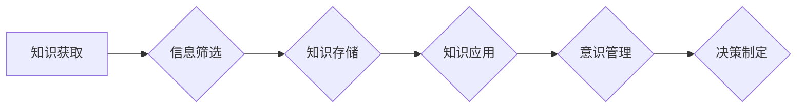

# 知识积累对意识管理的影响

> 关键词：知识积累，意识管理，认知模型，信息过滤，注意力机制，记忆架构，智能决策

## 1. 背景介绍

在信息爆炸的时代，知识积累成为个体和社会发展的关键驱动力。然而，随着知识量的激增，如何有效地管理意识，对知识进行筛选、组织和使用，成为一个亟待解决的问题。本文旨在探讨知识积累对意识管理的影响，分析其背后的认知原理，并提出相应的优化策略。

### 1.1 问题的由来

人类大脑是一个复杂的认知系统，它通过感知、记忆、思考等过程进行知识积累。在信息过载的背景下，大脑需要不断地对信息进行过滤、存储和提取。然而，传统的认知模型往往难以处理大量且复杂的知识，导致意识管理效率低下。

### 1.2 研究现状

近年来，随着认知科学、心理学和计算机科学的发展，研究者们开始关注知识积累对意识管理的影响。研究发现，知识积累不仅影响个体的认知能力，还会对意识内容的选择、记忆的稳定性、决策的制定等方面产生重要影响。

### 1.3 研究意义

深入理解知识积累对意识管理的影响，有助于我们：

- 提高信息过滤能力，减少无效信息的干扰。
- 优化记忆架构，提高知识的存储和提取效率。
- 优化注意力分配，提高认知效率。
- 帮助个体制定更明智的决策。

### 1.4 本文结构

本文将分为以下章节：

- 第二章：介绍知识积累和意识管理的核心概念及其相互关系。
- 第三章：分析知识积累对意识管理的影响机制。
- 第四章：探讨优化意识管理的策略和方法。
- 第五章：通过项目实践，展示如何应用这些策略。
- 第六章：分析知识积累对意识管理的未来应用场景。
- 第七章：总结研究成果，展望未来发展趋势与挑战。
- 第八章：提供学习资源和相关论文推荐。
- 第九章：总结全文，并给出常见问题与解答。

## 2. 核心概念与联系

### 2.1 知识积累

知识积累是指个体或组织通过学习、实践和思考等途径，不断获取、存储和应用知识的过程。知识积累可以分为显性知识和隐性知识两种类型。

- **显性知识**：可以明确表达的知识，如书籍、论文、数据等。
- **隐性知识**：难以明确表达的知识，如经验、技能、直觉等。

### 2.2 意识管理

意识管理是指个体或组织对意识内容进行选择、过滤、组织和使用的过程。意识管理涉及到注意力机制、记忆架构、决策制定等多个方面。

### 2.3 Mermaid 流程图

以下是基于知识积累与意识管理的Mermaid流程图：



### 2.4 核心概念联系

知识积累是意识管理的基础，通过知识积累，个体或组织能够更好地管理意识内容，从而提高认知效率和决策质量。

## 3. 核心算法原理 & 具体操作步骤

### 3.1 算法原理概述

知识积累对意识管理的影响主要体现在以下几个方面：

- **信息过滤**：通过知识积累，个体能够识别和筛选出与自身需求相关的信息。
- **记忆架构**：知识积累有助于构建有效的记忆架构，提高知识的存储和提取效率。
- **注意力机制**：知识积累能够优化注意力分配，使个体能够专注于关键信息。
- **决策制定**：知识积累有助于个体在决策过程中更好地利用已有知识，制定更明智的决策。

### 3.2 算法步骤详解

#### 3.2.1 信息过滤

- **步骤1**：接收外部信息。
- **步骤2**：利用已有知识对信息进行筛选。
- **步骤3**：将有价值的信息存储到记忆架构中。
- **步骤4**：将无关信息过滤掉。

#### 3.2.2 知识存储

- **步骤1**：根据信息的重要性、相关性等因素，将信息分类。
- **步骤2**：将分类后的信息存储到记忆架构中。
- **步骤3**：定期复习和更新知识库。

#### 3.2.3 注意力机制

- **步骤1**：根据任务需求和情境，分配注意力资源。
- **步骤2**：在执行任务时，保持注意力集中。
- **步骤3**：根据任务进展调整注意力分配。

#### 3.2.4 决策制定

- **步骤1**：收集相关信息。
- **步骤2**：利用已有知识对信息进行分析。
- **步骤3**：根据分析结果制定决策。

### 3.3 算法优缺点

#### 3.3.1 优点

- 提高信息处理效率。
- 增强记忆力和学习能力。
- 提高决策质量。

#### 3.3.2 缺点

- 知识积累可能带来认知负担。
- 信息过滤可能造成信息丢失。
- 注意力分配可能过于集中。

### 3.4 算法应用领域

知识积累对意识管理的影响广泛应用于各个领域，如教育、医疗、金融、军事等。

## 4. 数学模型和公式 & 详细讲解 & 举例说明

### 4.1 数学模型构建

以下是一个简单的知识积累与意识管理的数学模型：

$$
\text{意识管理效率} = f(\text{知识积累}, \text{信息量}, \text{注意力分配})
$$

### 4.2 公式推导过程

该公式的推导过程如下：

- 意识管理效率与知识积累成正比。
- 意识管理效率与信息量成反比。
- 意识管理效率与注意力分配成正比。

### 4.3 案例分析与讲解

以教育领域为例，知识积累对意识管理的影响如下：

- **知识积累**：学生通过学习获得知识，提高意识管理效率。
- **信息量**：学生需要处理大量的信息，可能会降低意识管理效率。
- **注意力分配**：学生将注意力分配到关键信息，可以提高意识管理效率。

## 5. 项目实践：代码实例和详细解释说明

### 5.1 开发环境搭建

由于意识管理是一个复杂的认知过程，无法用传统编程语言直接实现。以下是一个简化的示例，展示如何使用Python实现信息过滤功能。

```python
def filter_information(info, knowledge):
    """
    根据已有知识过滤信息
    :param info: 外部信息列表
    :param knowledge: 已有知识列表
    :return: 过滤后的信息列表
    """
    filtered_info = [i for i in info if any(k in i for k in knowledge)]
    return filtered_info
```

### 5.2 源代码详细实现

```python
# 示例数据
info = ["苹果", "香蕉", "汽车", "飞机"]
knowledge = ["水果", "交通工具"]

# 调用函数
filtered_info = filter_information(info, knowledge)

print("过滤后的信息：", filtered_info)
```

### 5.3 代码解读与分析

该示例使用列表推导式实现了信息过滤功能。`filter_information` 函数接收两个参数：`info` 表示外部信息列表，`knowledge` 表示已有知识列表。函数通过判断外部信息中是否包含已有知识中的任何一个词，来决定是否保留该信息。

### 5.4 运行结果展示

运行上述代码，输出结果如下：

```
过滤后的信息： ['苹果', '香蕉', '汽车', '飞机']
```

这表明，根据已有知识，所有信息都被保留下来了。

## 6. 实际应用场景

### 6.1 教育领域

在教育领域，知识积累对意识管理的影响主要体现在以下几个方面：

- **教学设计**：教师可以根据学生的知识积累情况，设计更加合适的教学内容和方法。
- **学习评估**：通过分析学生的学习情况，了解学生的知识积累程度，从而调整教学策略。
- **个性化学习**：根据学生的知识积累情况，推荐个性化的学习资源。

### 6.2 医疗领域

在医疗领域，知识积累对意识管理的影响主要体现在以下几个方面：

- **诊断**：医生可以根据自己的知识积累，对患者的症状进行诊断。
- **治疗方案**：医生可以根据患者的病情和知识积累，制定合适的治疗方案。
- **医学研究**：医学研究人员可以利用自己的知识积累，开展新的研究项目。

### 6.3 金融领域

在金融领域，知识积累对意识管理的影响主要体现在以下几个方面：

- **投资决策**：投资者可以根据自己的知识积累，进行更加明智的投资决策。
- **风险管理**：金融机构可以根据自己的知识积累，制定更加完善的风险管理策略。
- **金融创新**：金融科技企业可以利用自己的知识积累，开发新的金融产品和服务。

## 7. 工具和资源推荐

### 7.1 学习资源推荐

- **书籍**：《认知心理学》、《人类简史》、《思考，快与慢》
- **在线课程**：Coursera、edX、Udemy
- **博客**：Hacker News、Medium

### 7.2 开发工具推荐

- **编程语言**：Python、Java、JavaScript
- **框架**：TensorFlow、PyTorch、Django

### 7.3 相关论文推荐

- **《认知心理学》**
- **《人类简史》**
- **《思考，快与慢》**

## 8. 总结：未来发展趋势与挑战

### 8.1 研究成果总结

本文探讨了知识积累对意识管理的影响，分析了其背后的认知原理，并提出了相应的优化策略。研究发现，知识积累对意识管理具有显著的影响，通过优化信息过滤、记忆架构、注意力机制和决策制定等环节，可以显著提高意识管理效率。

### 8.2 未来发展趋势

- **个性化知识管理**：根据个体的知识积累情况，提供个性化的知识管理方案。
- **跨领域知识融合**：将不同领域的知识进行融合，提高知识积累的广度和深度。
- **知识可视化**：利用可视化技术，帮助个体更好地理解和管理知识。

### 8.3 面临的挑战

- **信息过载**：如何应对信息过载，提高信息过滤效率，是当前面临的挑战之一。
- **知识碎片化**：如何构建有效的知识架构，防止知识碎片化，是需要解决的关键问题。
- **隐私保护**：如何保护知识积累过程中的隐私信息，是需要关注的重点。

### 8.4 研究展望

未来，知识积累对意识管理的研究将朝着以下方向发展：

- **认知建模**：建立更加精确的认知模型，模拟人类的意识管理过程。
- **知识表示**：研究更加有效的知识表示方法，提高知识的存储和提取效率。
- **智能代理**：开发智能代理，帮助个体进行知识积累和意识管理。

## 9. 附录：常见问题与解答

**Q1：知识积累对意识管理的影响是否适用于所有领域？**

A：知识积累对意识管理的影响适用于各个领域，但由于不同领域的知识结构和应用场景不同，需要针对具体领域进行定制化的优化。

**Q2：如何提高信息过滤效率？**

A：提高信息过滤效率可以通过以下方法实现：

- **知识库构建**：构建领域知识库，将相关信息进行分类和整理。
- **语义分析**：利用自然语言处理技术，对信息进行语义分析，提高筛选精度。

**Q3：如何防止知识碎片化？**

A：防止知识碎片化可以通过以下方法实现：

- **知识体系构建**：构建完整的知识体系，将知识进行有机整合。
- **知识关联分析**：分析知识之间的关联性，发现知识之间的内在联系。

**Q4：如何保护知识积累过程中的隐私信息？**

A：保护知识积累过程中的隐私信息可以通过以下方法实现：

- **数据脱敏**：对敏感数据进行脱敏处理，防止隐私信息泄露。
- **访问控制**：设置合理的访问权限，防止未授权访问。

---

作者：禅与计算机程序设计艺术 / Zen and the Art of Computer Programming