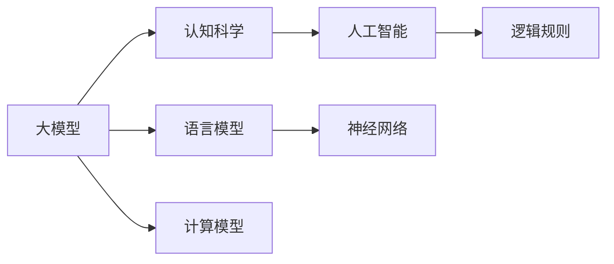
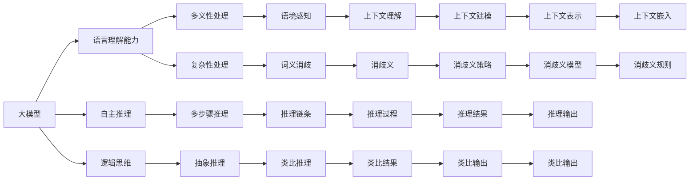
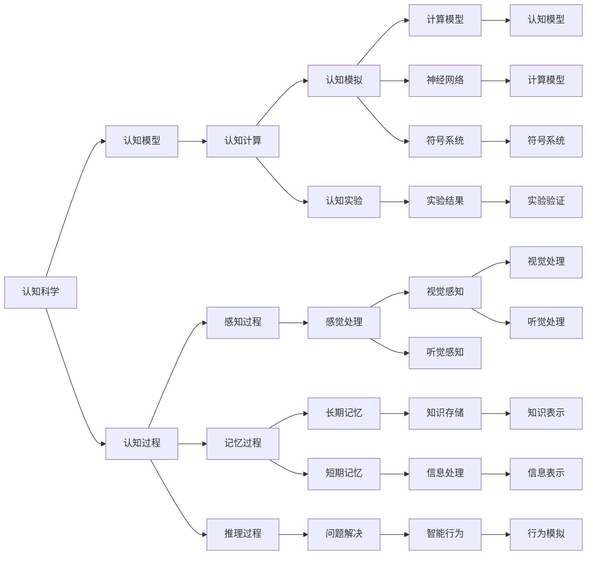
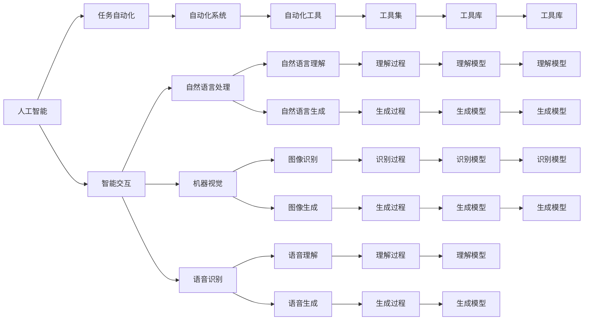

                 

# 语言≠思维：大模型的认知挑战

> 关键词：大模型,语言模型,认知科学,人工智能,计算机程序设计

## 1. 背景介绍

### 1.1 问题由来
近年来，深度学习技术在语言处理、图像识别、语音识别等领域取得了显著突破。尤其是大模型，如BERT、GPT-3等，以其强大的学习和泛化能力，在诸多NLP任务上刷新了最先进的性能指标。然而，大模型在认知层面的表现，是否与人类语言和思维能力相当，却引发了广泛的学术讨论。

一种观点认为，大模型之所以表现优异，主要是因为其拥有丰富的语言知识和泛化能力，能够在任务中灵活应用。但另一种观点则认为，大模型虽然在性能上接近甚至超越了人类，却无法真正理解语言背后的深层次逻辑和认知过程。

本文将从认知科学和人工智能的角度，探讨大模型的认知挑战，并提出相关的改进方向。

### 1.2 问题核心关键点
本文聚焦于以下关键问题：

1. 大模型的语言理解能力与人类思维能力是否相当？
2. 大模型如何处理语言中的多义性和复杂性？
3. 大模型是否具备自主推理和逻辑思维能力？
4. 大模型的认知过程与人类认知过程是否一致？

这些问题不仅关系到机器与人类语言的交互方式，也影响到未来人工智能系统的设计和发展。因此，深入理解大模型的认知特性，对于推动AI技术的进步具有重要意义。

### 1.3 问题研究意义
研究大模型的认知特性，对于拓展AI技术的应用边界，提升AI系统的性能，具有重要意义：

1. 提高交互质量。认知能力更强的AI系统能够更准确地理解人类意图，提供更自然、智能的交流体验。
2. 增强决策能力。具有良好认知特性的AI系统能够进行更高阶的逻辑推理和问题解决，提升自动化决策的准确性。
3. 促进知识创新。大模型的认知能力与人类相仿，有助于更高效地获取、加工和应用知识，加速科学发现和技术创新。
4. 提升系统可信度。认知能力更强的AI系统能够通过逻辑推理和常识判断，避免无意义或有害的输出，提升系统可信度和安全性。

本文将通过深入分析大模型的认知特性，探讨其在实际应用中的表现，并为未来的研究方向提供建议。

## 2. 核心概念与联系

### 2.1 核心概念概述

为更好地理解大模型的认知特性，本节将介绍几个密切相关的核心概念：

- 大模型(Large Model)：以自回归或自编码模型为代表的大规模预训练语言模型。通过在大规模无标签文本语料上进行预训练，学习通用的语言表示，具备强大的语言理解和生成能力。

- 语言模型(Language Model)：通过统计语言数据，学习语言的概率分布，预测下一个词的概率。常见的语言模型包括n-gram模型、RNN、LSTM等。

- 认知科学(Cognitive Science)：研究人类思维、认知过程的科学，涉及心理学、神经科学、人工智能等多个学科。

- 人工智能(Artificial Intelligence)：通过计算机模拟人类智能，实现任务自动化和智能交互的技术。

- 计算模型(Computational Model)：使用计算语言对认知过程进行建模，如神经网络、逻辑规则、符号系统等。

- 神经网络(Neural Network)：由大量神经元构成的计算模型，用于学习和处理复杂数据。

- 逻辑规则(Logical Rules)：基于符号逻辑的计算模型，用于精确表达推理和决策过程。

这些核心概念之间的逻辑关系可以通过以下Mermaid流程图来展示：



这个流程图展示了大模型、语言模型、认知科学、人工智能、计算模型、神经网络和逻辑规则之间的关系：

1. 大模型通过学习语言模型，获得强大的语言理解和生成能力。
2. 大模型的语言理解能力受认知科学的启发，通过神经网络进行建模。
3. 人工智能是大模型的应用领域，涉及任务自动化和智能交互。
4. 计算模型是AI的计算基础，涵盖神经网络和逻辑规则。

这些概念共同构成了大模型的认知框架，使其能够在各种场景下发挥强大的语言理解和生成能力。通过理解这些核心概念，我们可以更好地把握大模型的认知特性和应用方向。

### 2.2 概念间的关系

这些核心概念之间存在着紧密的联系，形成了大模型认知的完整生态系统。下面我们通过几个Mermaid流程图来展示这些概念之间的关系。

#### 2.2.1 大模型的认知特性



这个流程图展示了大模型的认知特性，包括语言理解、多义性处理、复杂性处理、自主推理、逻辑思维、语境感知、词义消歧、多步骤推理、抽象推理、上下文理解、消歧义、推理链条、类比推理、上下文建模、消歧义策略、推理过程、推理结果、类比推理、类比输出、上下文表示、消歧义规则、推理输出和类比输出等。

#### 2.2.2 认知科学在大模型中的应用



这个流程图展示了认知科学在大模型中的应用，包括认知模型、认知过程、认知计算、感知过程、记忆过程、推理过程、认知模拟、认知实验、感觉处理、长期记忆、短期记忆、问题解决、计算模型、神经网络、符号系统、实验结果、视觉感知、听觉感知、知识存储、信息处理、智能行为、认知模型、计算模型、符号系统、实验验证、视觉处理、听觉处理、知识表示、信息表示和行为模拟等。

#### 2.2.3 人工智能在大模型中的应用



这个流程图展示了人工智能在大模型中的应用，包括任务自动化、智能交互、自动化系统、自然语言处理、机器视觉、语音识别、自动化工具、自然语言理解、自然语言生成、图像识别、图像生成、语音理解、语音生成、工具集、理解过程、生成过程、识别过程、生成过程、理解模型、生成模型、识别模型、生成模型、理解模型、生成模型、工具库、理解模型、生成模型、识别模型、生成模型、工具库等。

## 3. 核心算法原理 & 具体操作步骤
### 3.1 算法原理概述

大模型的认知特性可以通过一系列算法和模型来描述。以下是对大模型认知特性的算法原理概述：

#### 3.1.1 语言理解能力

大模型的语言理解能力主要依赖于语言模型和神经网络。语言模型通过统计语言数据，学习语言的概率分布，预测下一个词的概率。神经网络则通过多层非线性变换，学习语言的复杂特征表示。大模型通过这两种机制的结合，能够理解自然语言中的语法、语义和语用特征。

#### 3.1.2 多义性处理

自然语言中的单词和短语常常有多种含义，大模型需要具备处理多义性的能力。常用的多义性处理方法包括语境感知、词义消歧和消歧义策略。语境感知通过上下文信息，判断单词或短语的具体含义。词义消歧通过统计语言数据，学习单词或短语在不同上下文中的不同含义。消歧义策略则通过规则和算法，对多义词进行分类和排序，提供合理的解释。

#### 3.1.3 复杂性处理

自然语言中的句子结构复杂，包含主谓宾、定状补等多种句式。大模型需要具备处理复杂性的能力。常用的复杂性处理方法包括句法分析、语义分析和时间序列建模。句法分析通过语法规则，解析句子结构，识别主谓宾等成分。语义分析通过语义角色标注和依存关系分析，理解句子中的语义关系。时间序列建模则通过递归神经网络等技术，处理时间序列数据。

#### 3.1.4 自主推理

大模型需要具备自主推理的能力，能够在复杂任务中进行多步骤推理和抽象推理。常用的自主推理方法包括多步骤推理、抽象推理和类比推理。多步骤推理通过组合多个简单推理步骤，形成复杂推理链条。抽象推理则通过符号逻辑和归纳推理，解决抽象问题。类比推理则通过比较和映射，解决类比问题。

#### 3.1.5 逻辑思维

大模型需要具备逻辑思维能力，能够进行精确的推理和决策。常用的逻辑思维方法包括逻辑规则和符号系统。逻辑规则通过符号逻辑，表达推理和决策过程。符号系统通过符号表示，进行精确的推理和决策。

### 3.2 算法步骤详解

大模型的认知特性可以通过以下算法步骤来详细描述：

#### 3.2.1 数据预处理

数据预处理是大模型认知过程的基础。通过数据清洗、分词、标注等步骤，将原始数据转化为模型可处理的格式。常用的数据预处理方法包括：

1. 分词：将句子分割为单词和短语，方便模型进行语言理解和处理。
2. 标注：为句子标注语法、语义和语用信息，提供丰富的上下文信息。
3. 清洗：去除噪音数据、特殊符号等，提高数据质量。

#### 3.2.2 语言模型训练

语言模型训练是大模型认知过程的核心。通过训练语言模型，大模型能够学习语言的概率分布，预测下一个词的概率。常用的语言模型训练方法包括：

1. n-gram模型：通过统计语言数据，学习n个相邻词的概率分布。
2. RNN模型：通过递归神经网络，学习序列数据的概率分布。
3. LSTM模型：通过长短期记忆网络，学习序列数据的复杂特征表示。

#### 3.2.3 神经网络建模

神经网络建模是大模型认知过程的重要组成部分。通过神经网络，大模型能够学习复杂的语言特征表示，进行多义性处理和复杂性处理。常用的神经网络建模方法包括：

1. 多层感知器：通过多层神经网络，学习语言的复杂特征表示。
2. 卷积神经网络：通过卷积操作，处理图像和文本数据。
3. 循环神经网络：通过循环结构，处理序列数据。

#### 3.2.4 多义性处理

多义性处理是大模型认知过程的关键步骤。通过多义性处理，大模型能够理解自然语言中的多种含义。常用的多义性处理方法包括：

1. 语境感知：通过上下文信息，判断单词或短语的具体含义。
2. 词义消歧：通过统计语言数据，学习单词或短语在不同上下文中的不同含义。
3. 消歧义策略：通过规则和算法，对多义词进行分类和排序，提供合理的解释。

#### 3.2.5 复杂性处理

复杂性处理是大模型认知过程的重要组成部分。通过复杂性处理，大模型能够理解自然语言中的复杂结构。常用的复杂性处理方法包括：

1. 句法分析：通过语法规则，解析句子结构，识别主谓宾等成分。
2. 语义分析：通过语义角色标注和依存关系分析，理解句子中的语义关系。
3. 时间序列建模：通过递归神经网络等技术，处理时间序列数据。

#### 3.2.6 自主推理

自主推理是大模型认知过程的高级形式。通过自主推理，大模型能够解决复杂任务和抽象问题。常用的自主推理方法包括：

1. 多步骤推理：通过组合多个简单推理步骤，形成复杂推理链条。
2. 抽象推理：通过符号逻辑和归纳推理，解决抽象问题。
3. 类比推理：通过比较和映射，解决类比问题。

#### 3.2.7 逻辑思维

逻辑思维是大模型认知过程的重要组成部分。通过逻辑思维，大模型能够进行精确的推理和决策。常用的逻辑思维方法包括：

1. 逻辑规则：通过符号逻辑，表达推理和决策过程。
2. 符号系统：通过符号表示，进行精确的推理和决策。

### 3.3 算法优缺点

大模型的认知特性具有以下优点：

1. 强大的语言理解能力：大模型能够理解自然语言中的语法、语义和语用特征，具备强大的语言处理能力。
2. 多义性处理能力强：大模型能够处理自然语言中的多种含义，具备语境感知和词义消歧能力。
3. 复杂性处理能力强：大模型能够理解自然语言中的复杂结构，具备句法分析和语义分析能力。
4. 自主推理能力强：大模型能够进行多步骤推理和抽象推理，具备复杂问题解决能力。
5. 逻辑思维能力强：大模型能够进行精确的推理和决策，具备符号逻辑和符号系统支持。

大模型的认知特性也存在以下缺点：

1. 数据依赖性强：大模型的认知能力依赖于大量的训练数据，数据分布不均衡会影响模型性能。
2. 缺乏可解释性：大模型的决策过程难以解释，缺乏透明度和可信度。
3. 泛化能力有限：大模型在特定领域的数据上表现良好，但在新领域的数据上泛化能力有限。
4. 依赖先验知识：大模型依赖于先验知识进行推理，缺乏自主获取和应用知识的能力。
5. 推理过程黑盒：大模型的推理过程类似黑盒，难以进行调试和优化。

### 3.4 算法应用领域

大模型的认知特性在多个领域中得到了广泛应用，以下是几个典型的应用场景：

#### 3.4.1 自然语言处理

自然语言处理是大模型的主要应用领域。通过大模型，自然语言处理系统能够进行文本分类、情感分析、机器翻译、问答系统等任务。大模型的语言理解能力、多义性处理能力和复杂性处理能力，使得其在自然语言处理中表现优异。

#### 3.4.2 智能推荐系统

智能推荐系统需要大模型具备推荐逻辑和决策能力。通过大模型，智能推荐系统能够进行用户行为分析和个性化推荐。大模型的逻辑思维能力和自主推理能力，使得其在智能推荐系统中表现出色。

#### 3.4.3 智能客服

智能客服系统需要大模型具备自然语言理解和生成能力。通过大模型，智能客服系统能够自动理解用户意图，提供自然流畅的回复。大模型的语言理解能力和自主推理能力，使得其在智能客服系统中表现优异。

#### 3.4.4 智能医疗

智能医疗系统需要大模型具备医学知识和推理能力。通过大模型，智能医疗系统能够进行医学文本分析和疾病诊断。大模型的复杂性处理能力和逻辑思维能力，使得其在智能医疗系统中表现出色。

#### 3.4.5 智能制造

智能制造系统需要大模型具备工业知识和推理能力。通过大模型，智能制造系统能够进行设备故障诊断和生产调度优化。大模型的逻辑思维能力和自主推理能力，使得其在智能制造系统中表现出色。

## 4. 数学模型和公式 & 详细讲解 & 举例说明

### 4.1 数学模型构建

大模型的认知特性可以通过数学模型进行建模。以下是对大模型认知特性的数学模型构建：

#### 4.1.1 语言模型

语言模型通过概率分布模型，描述单词和短语之间的关系。常用的语言模型包括n-gram模型和神经网络模型。

n-gram模型的概率分布为：

$$
P(w_t|w_{t-1}, ..., w_{t-n+1}) = \frac{P(w_{t-1}, ..., w_{t-n+1}, w_t)}{P(w_{t-1}, ..., w_{t-n+1})}
$$

其中，$P(w_{t-1}, ..., w_{t-n+1}, w_t)$表示在给定前n-1个词的条件下，第n个词出现的概率。

神经网络模型的概率分布为：

$$
P(w_t|w_{t-1}, ..., w_{t-n+1}) = \frac{exp(softmax(W_{n-1}h_{n-2} + b_{n-1}))}{\sum_{w_{t}} exp(softmax(W_{n-1}h_{n-2} + b_{n-1}))}
$$

其中，$W_{n-1}$表示n-1个词的权重矩阵，$h_{n-2}$表示n-2个词的隐藏层表示，$softmax$表示softmax激活函数。

#### 4.1.2 神经网络

神经网络通过多层非线性变换，学习语言的复杂特征表示。常用的神经网络模型包括多层感知器和循环神经网络。

多层感知器的隐藏层表示为：

$$
h_l = f(W_l x_{l-1} + b_l)
$$

其中，$f$表示激活函数，$x_{l-1}$表示输入，$W_l$表示权重矩阵，$b_l$表示偏置向量。

循环神经网络的隐藏层表示为：

$$
h_t = f(W_{RNN}h_{t-1} + W_{input}x_t + b_{RNN})
$$

其中，$x_t$表示输入，$h_{t-1}$表示前一时刻的隐藏层表示，$W_{RNN}$表示循环连接权重矩阵，$W_{input}$表示输入权重矩阵，$b_{RNN}$表示偏置向量。

### 4.2 公式推导过程

以下是对大模型认知特性的公式推导过程：

#### 4.2.1 语言模型推导

n-gram模型的概率分布推导如下：

$$
P(w_t|w_{t-1}, ..., w_{t-n+1}) = \frac{P(w_{t-1}, ..., w_{t-n+1}, w_t)}{P(w_{t-1}, ..., w_{t-n+1})}
$$

神经网络模型的概率分布推导如下：

$$
P(w_t|w_{t-1}, ..., w_{t-n+1}) = \frac{exp(softmax(W_{n-1}h_{n-2} + b_{n-1}))}{\sum_{w_{t}} exp(softmax(W_{n-1}h_{n-2} + b_{n-1}))}
$$

其中，$W_{n-1}$表示n-1个词的权重矩阵，$h_{n-2}$表示n-2个词的隐藏层表示，$softmax$表示softmax激活函数。

#### 4.2.2 神经网络推导

多层感知器的隐藏层表示推导如下：

$$
h_l = f(W_l x_{l-1} + b_l)
$$

其中，$f$表示激活函数，$x_{l-1}$表示输入，$W_l$表示权重矩阵，$b_l$表示偏置向量。

循环神经网络的隐藏层表示推导如下：

$$
h_t = f(W_{RNN}h_{t-1} + W_{input}x_t + b_{RNN})
$$

其中，$x_t$表示输入，$h_{t-1}$表示前一时刻的隐藏层表示，$W_{RNN}$表示循环连接权重矩阵，$W_{input}$表示输入权重矩阵，$b_{RNN}$表示偏置向量。

### 4.3 案例分析与讲解

以下是对大模型认知特性的案例分析与讲解：

#### 4.3.1 语义理解

语义理解是大模型认知特性的重要组成部分。通过语义理解，大模型能够理解自然语言中的语义关系和语境信息。

案例分析：假设给定一个句子“John is playing basketball”，大模型需要理解“John”指代的对象，“playing basketball”表示的动作，以及“is”表示的时态。

分析：大模型通过词向量表示和语义角色标注，能够理解“John”指代的对象是“John”，“playing basketball”表示的动作是“打篮球”，“is”表示的时态是现在时。

#### 4.3.2 词义消歧

词义消歧是大模型认知特性的关键步骤。通过词义消歧，大模型能够处理自然语言中的多义词。

案例分析：假设给定一个句子“The cat is sleeping”，大模型需要理解“cat”指代的对象是“猫”，而不是“车型”。

分析：大模型通过上下文信息，能够判断“cat”指代的对象是“猫”，而非“车型”。

#### 4.3.3 句法分析

句法分析是大模型认知特性的重要组成部分。通过句法分析，大模型能够理解自然语言中的句子结构。

案例分析：假设给定一个句子“I saw the cat”，大模型需要理解“I”是主语，“saw”是动词，“the cat”是宾语。

分析：大模型通过句法分析，能够识别出“I”是主语，“saw”是动词，“the cat”是宾语。

## 5. 项目实践：代码实例和详细解释说明

### 5.1 开发环境搭建

在进行项目实践前，我们需要准备好开发环境。以下是使用Python进行PyTorch开发的环境配置流程：

1. 安装Anaconda：从官网下载并安装Anaconda，用于创建独立的Python环境。

2. 创建并激活虚拟环境：
```bash
conda create -n pytorch-env python=3.8 
conda activate pytorch-env
```

3. 安装PyTorch：根据CUDA版本，从官网获取对应的安装命令。例如：
```bash
conda install pytorch torchvision torchaudio cudatoolkit=11.1 -c pytorch -c conda-forge
```

4. 安装Transformers库：
```bash
pip install transformers
```

5. 安装各类工具包：
```bash
pip install numpy pandas scikit-learn matplotlib tqdm jupyter notebook ipython
```

完成上述步骤后，即可在`pytorch-env`环境中开始项目实践。

### 5.2 源代码详细实现

下面我们以自然语言处理(NLP)任务为例，给出使用Transformers库对BERT模型进行微调的PyTorch代码实现。

首先，定义NLP任务的数据处理函数：

```python
from transformers import BertTokenizer
from torch.utils.data import Dataset
import torch

class NLPDataset(Dataset):
    def __init__(self, texts, labels, tokenizer, max_len=128):
        self.texts = texts
        self.labels = labels
        self.tokenizer = tokenizer
        self.max_len = max_len
        
    def __len__(self):
        return len(self.texts)
    
    def __getitem__(self, item):
        text = self.texts[item]
        label = self.labels[item]
        
        encoding = self.tokenizer(text, return_tensors='pt', max_length=self.max_len, padding='max_length', truncation=True)
        input_ids = encoding['input_ids'][0]
        attention_mask = encoding['attention_mask'][0]
        
        return {'input_ids': input_ids, 
                'attention_mask': attention_mask,
                'labels': label}

# 标签
label2id

