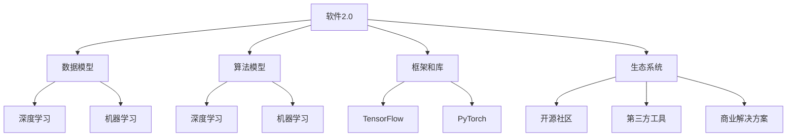
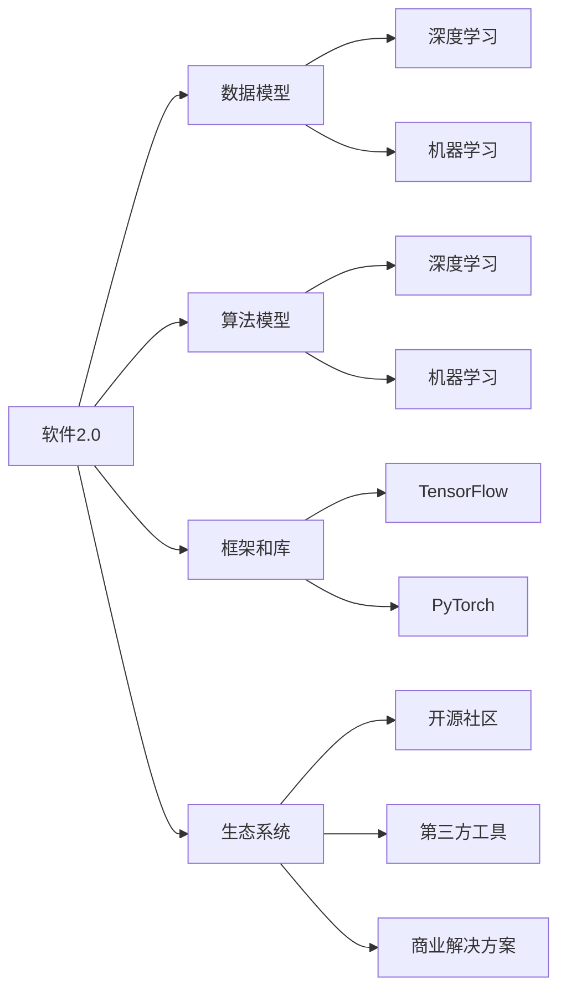
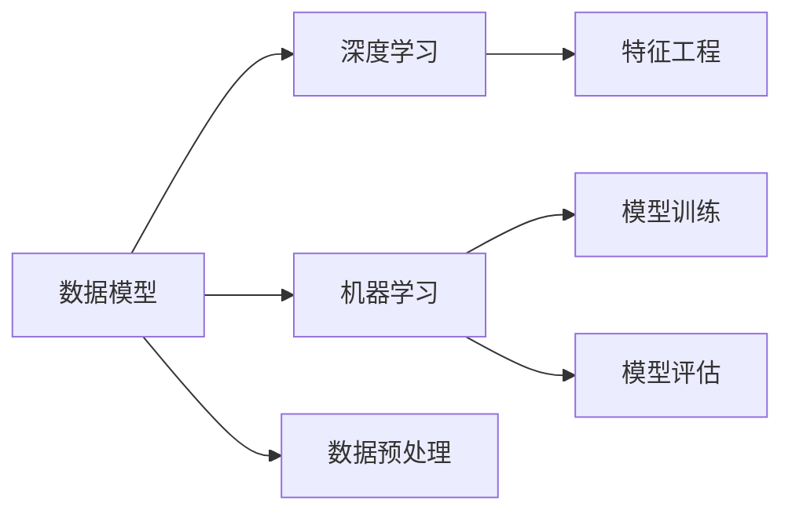
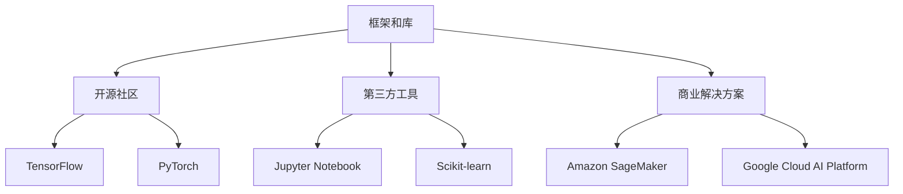
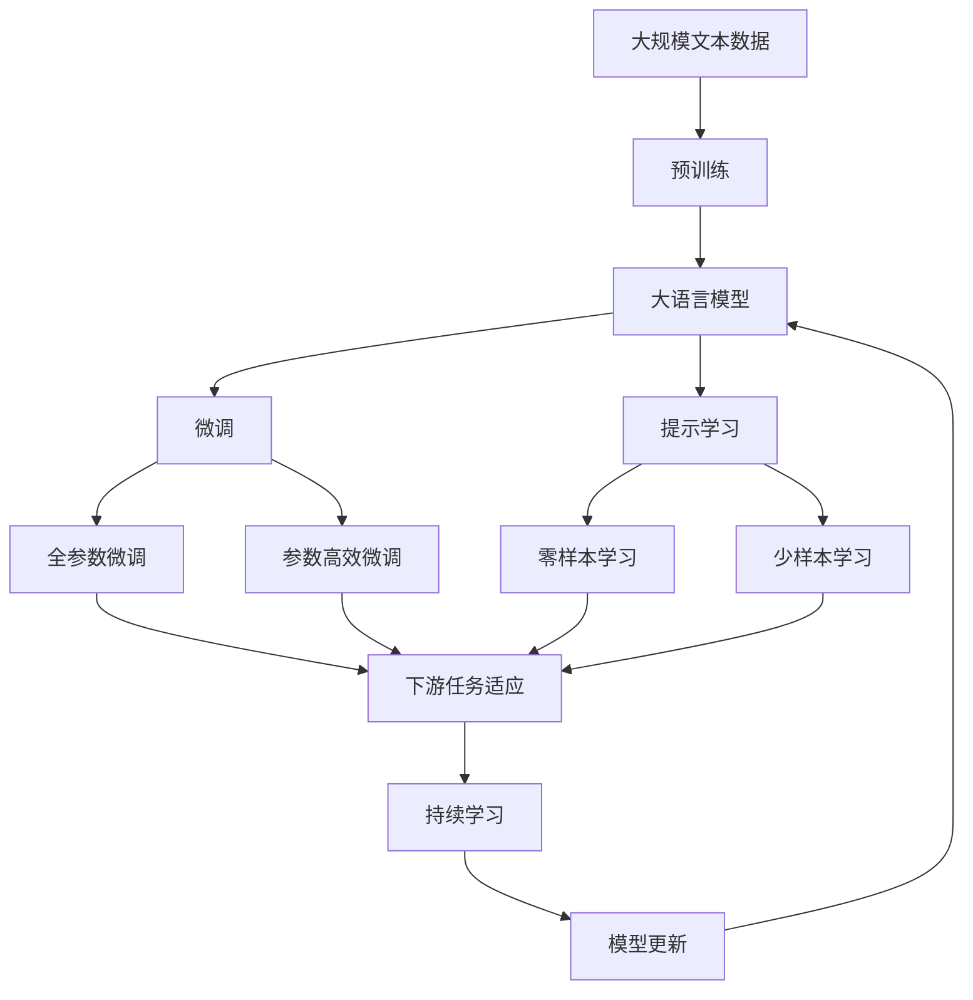

                 

# 软件2.0的技术栈选择策略

## 1. 背景介绍

### 1.1 问题由来

在软件开发的演化过程中，技术栈的选择始终是一个核心话题。随着技术的发展，软件系统的复杂度日益增加，如何构建稳定、高效、易维护的技术架构，成为技术决策者和工程师的共同挑战。

从20世纪60年代面向过程的编程语言，到80年代面向对象的编程范式，再到21世纪初的Web和移动开发，每一次技术革命都伴随着全新的技术栈选择和设计原则。然而，随着人工智能和大数据技术的崛起，软件开发范式和思维方式发生了根本性的变化，催生了“软件2.0”这一新的概念。

软件2.0时代的到来，意味着我们不仅要关注代码的编写和系统的构建，更要关注数据和算法的应用，让机器智能和人类智慧紧密结合，推动软件的进化与升级。在这种背景下，技术栈的选择不仅关乎代码和架构，更关乎数据模型、算法选择、模型训练等全新维度。

本文将围绕软件2.0的核心概念，详细探讨技术栈选择策略，帮助开发者在人工智能、大数据和复杂系统构建中，做出更加科学、高效的决策。

### 1.2 问题核心关键点

软件2.0时代，技术栈的选择策略需要综合考虑以下关键因素：

- **数据与算法适配**：选择合适的数据格式、存储方式，以及合适的算法和模型，实现高效的数据处理和智能决策。
- **硬件与软件协同**：合理配置CPU、GPU、TPU等硬件资源，提高算法的计算效率和模型的推理速度。
- **应用场景适配**：根据实际应用场景，选择合适的编程语言、框架和库，以实现更好的性能和可维护性。
- **生态系统支持**：考虑技术栈的生态系统，包括社区活跃度、文档支持、第三方工具等，保障项目的长期发展。

本文将从这些核心关键点出发，系统探讨软件2.0技术栈的选择策略。

### 1.3 问题研究意义

选择适合的技术栈，是软件2.0时代开发高效、稳定、可维护系统的关键。这一过程不仅需要开发者具备广泛的技术视野，更需要深入理解数据和算法的本质，从而实现技术栈的高效适配和灵活应用。

通过本文的学习，读者可以掌握软件2.0技术栈选择的核心方法和策略，提升自己在人工智能和大数据领域的开发能力，加速构建复杂系统的进程，推动软件行业的持续发展。

## 2. 核心概念与联系

### 2.1 核心概念概述

为更好地理解软件2.0技术栈的选择策略，本节将介绍几个密切相关的核心概念：

- **软件2.0**：一种基于人工智能和数据驱动的软件开发范式，强调数据、算法和人类智慧的结合，以提升软件的智能水平和自动化能力。
- **数据模型**：描述数据的组织结构、属性和关系，选择合适的数据模型是构建高性能数据处理系统的基础。
- **算法模型**：用于解决特定问题的一组数学和逻辑操作，选择适合的算法模型可以显著提升算法的效率和准确性。
- **深度学习**：一种模拟人类神经网络结构，通过大量数据训练提取特征的算法技术，适用于复杂的模式识别和预测任务。
- **机器学习**：通过数据训练模型，实现对未知数据的预测和分类，广泛应用于图像、语音、自然语言处理等领域。
- **框架和库**：为开发者提供高性能、易用的开发工具和组件，如TensorFlow、PyTorch等深度学习框架。
- **生态系统**：包括开源社区、第三方工具、商业解决方案等，构成技术栈的支持环境。

这些核心概念之间的逻辑关系可以通过以下Mermaid流程图来展示：



这个流程图展示了大语言模型的核心概念及其之间的关系：

1. 软件2.0通过数据模型和算法模型进行驱动，提升系统的智能水平。
2. 数据模型可以是结构化数据库，也可以是无结构的大数据存储，如Hadoop、Spark等。
3. 算法模型包括深度学习和机器学习，用于处理和分析复杂数据。
4. 框架和库提供了开发工具和组件，如TensorFlow、PyTorch等，极大提升开发效率。
5. 生态系统包括开源社区、第三方工具、商业解决方案，提供了技术栈的支持环境。

### 2.2 概念间的关系

这些核心概念之间存在着紧密的联系，形成了软件2.0技术栈选择的完整生态系统。下面我通过几个Mermaid流程图来展示这些概念之间的关系。

#### 2.2.1 软件2.0的基本构成



这个流程图展示了软件2.0的基本构成及其与核心概念的关系。

#### 2.2.2 数据模型与算法模型的关系



这个流程图展示了数据模型与算法模型的关系。

#### 2.2.3 框架和库与生态系统的关系



这个流程图展示了框架和库与生态系统的关系。

### 2.3 核心概念的整体架构

最后，我们用一个综合的流程图来展示这些核心概念在大语言模型微调过程中的整体架构：



这个综合流程图展示了从预训练到微调，再到持续学习的完整过程。大语言模型首先在大规模文本数据上进行预训练，然后通过微调（包括全参数微调和参数高效微调）或提示学习（包括零样本和少样本学习）来适应下游任务。最后，通过持续学习技术，模型可以不断更新和适应新的任务和数据。

## 3. 核心算法原理 & 具体操作步骤

### 3.1 算法原理概述

软件2.0技术栈的选择，不仅涉及代码和架构，更涉及数据、算法和生态系统的全面适配。以下是几个核心的算法原理：

- **数据适配**：选择合适的数据模型和存储方式，如结构化数据库、NoSQL数据库、大数据存储等，实现高效的数据处理和存储。
- **算法适配**：根据任务类型选择合适的算法和模型，如深度学习、机器学习等，实现高效的数据分析和智能决策。
- **生态适配**：选择合适的框架和库，以及良好的生态系统支持，实现技术的灵活应用和长期维护。

### 3.2 算法步骤详解

软件2.0技术栈的选择过程通常包括以下几个关键步骤：

**Step 1: 需求分析**
- 明确项目需求和目标，包括业务场景、数据规模、性能要求等。
- 分析数据类型、特征和分布，选择合适的数据模型。
- 评估算法的复杂度和性能需求，选择适合的算法和模型。

**Step 2: 技术选型**
- 根据需求分析，选择合适的框架和库，如TensorFlow、PyTorch等。
- 根据数据规模和处理需求，选择合适的数据存储和处理技术，如Hadoop、Spark等。
- 根据算法复杂度和计算需求，选择合适的硬件资源，如CPU、GPU、TPU等。

**Step 3: 原型设计和测试**
- 根据技术选型，进行原型设计和代码实现。
- 使用测试数据集进行模型训练和验证，评估模型的性能和稳定性。
- 根据测试结果，调整参数和模型，进行优化和改进。

**Step 4: 系统部署和优化**
- 将优化后的模型部署到生产环境中，进行系统上线。
- 监控系统性能和稳定性，进行必要的调整和优化。
- 使用A/B测试等方法，评估系统的实际效果和用户体验。

**Step 5: 持续迭代和改进**
- 根据用户反馈和业务需求，进行持续的迭代和改进。
- 不断优化数据模型和算法模型，提升系统的智能水平和自动化能力。
- 保持对新技术和工具的关注，及时引入新的技术和方法。

### 3.3 算法优缺点

软件2.0技术栈的选择策略具有以下优点：

- **全面适配**：兼顾数据、算法和生态系统的全面适配，实现技术的深度整合和高效应用。
- **灵活高效**：根据实际需求和数据特点，灵活选择数据模型和算法，实现高效的数据处理和智能决策。
- **长期可维护**：借助良好的生态系统支持，实现技术的长期维护和迭代改进。

然而，这一策略也存在以下缺点：

- **复杂度高**：需要综合考虑数据、算法和生态系统的多方面因素，技术栈的选择过程较为复杂。
- **资源需求高**：选择合适的硬件资源和工具，需要较高的计算和存储成本。
- **开发周期长**：原型设计和测试过程较为耗时，需要更多的开发资源和时间。

### 3.4 算法应用领域

软件2.0技术栈的选择策略，适用于多种应用场景，包括但不限于以下领域：

- **人工智能和大数据**：数据模型和算法适配，适用于复杂的模式识别、预测和分类任务。
- **智能系统和决策支持**：数据和算法的深度整合，实现智能系统的自动化和决策支持。
- **金融和商业分析**：数据处理和智能分析，适用于财务预测、风险管理等复杂场景。
- **医疗和健康监测**：数据模型和算法适配，适用于健康数据分析、疾病预测等场景。
- **教育和技术培训**：数据和算法的深度整合，实现教育内容的个性化推荐和智能辅导。
- **自动驾驶和机器人**：数据模型和算法适配，适用于自动驾驶和机器人感知和决策。

## 4. 数学模型和公式 & 详细讲解  
### 4.1 数学模型构建

在软件2.0技术栈的选择过程中，数学模型和公式的构建是核心步骤之一。以下以深度学习为例，展示数学模型的构建过程。

假设我们有一个二分类问题，数据集为 $(x_i, y_i)$，其中 $x_i \in \mathbb{R}^n$ 为输入向量，$y_i \in \{0, 1\}$ 为标签。

定义模型 $f(x; \theta)$ 为输入 $x$ 的输出函数，其中 $\theta$ 为模型参数。常用的深度学习模型包括全连接神经网络、卷积神经网络、循环神经网络等。

我们希望最小化交叉熵损失函数 $L(y, f(x))$，即：

$$
L(y, f(x)) = -\frac{1}{N}\sum_{i=1}^N y_i \log f(x_i; \theta) + (1-y_i) \log (1-f(x_i; \theta))
$$

其中 $N$ 为样本数量。模型的训练目标是找到最优参数 $\theta$，使得损失函数最小化。

### 4.2 公式推导过程

为了找到最优参数 $\theta$，我们通常使用梯度下降算法进行优化。梯度下降算法通过计算损失函数对参数的梯度，迭代更新参数，使得损失函数不断减小。

设 $\nabla_{\theta} L(y, f(x))$ 为损失函数对参数 $\theta$ 的梯度，则参数更新公式为：

$$
\theta \leftarrow \theta - \eta \nabla_{\theta} L(y, f(x))
$$

其中 $\eta$ 为学习率。通过不断迭代，直到损失函数收敛。

### 4.3 案例分析与讲解

以下是一个简单的二分类问题案例，展示深度学习模型的构建和训练过程。

假设我们有一个二分类数据集，包含1000个样本，每个样本为一个4维向量。我们使用一个简单的全连接神经网络，包含一个隐藏层，神经元数量为10。

```python
import numpy as np
import tensorflow as tf

# 定义模型
class Model(tf.keras.Model):
    def __init__(self):
        super(Model, self).__init__()
        self.fc1 = tf.keras.layers.Dense(10, activation='relu')
        self.fc2 = tf.keras.layers.Dense(1, activation='sigmoid')
        
    def call(self, x):
        x = self.fc1(x)
        x = self.fc2(x)
        return x

# 定义损失函数
def loss(y_true, y_pred):
    return tf.reduce_mean(tf.losses.BinaryCrossentropy()(y_true, y_pred))

# 训练模型
model = Model()
optimizer = tf.keras.optimizers.Adam(learning_rate=0.01)

# 准备数据
x_train = np.random.rand(1000, 4)
y_train = np.random.randint(0, 2, size=1000)

# 训练模型
for i in range(100):
    with tf.GradientTape() as tape:
        y_pred = model(x_train)
        loss_val = loss(y_train, y_pred)
    gradients = tape.gradient(loss_val, model.trainable_variables)
    optimizer.apply_gradients(zip(gradients, model.trainable_variables))
```

这个案例展示了深度学习模型的构建和训练过程。通过定义模型、损失函数和优化器，并使用梯度下降算法进行训练，我们得到了一个简单的二分类模型。

## 5. 项目实践：代码实例和详细解释说明
### 5.1 开发环境搭建

在进行软件2.0技术栈选择实践前，我们需要准备好开发环境。以下是使用Python进行TensorFlow开发的环境配置流程：

1. 安装Anaconda：从官网下载并安装Anaconda，用于创建独立的Python环境。

2. 创建并激活虚拟环境：
```bash
conda create -n tensorflow-env python=3.8 
conda activate tensorflow-env
```

3. 安装TensorFlow：根据CUDA版本，从官网获取对应的安装命令。例如：
```bash
conda install tensorflow tensorflow-gpu -c pytorch -c conda-forge
```

4. 安装各类工具包：
```bash
pip install numpy pandas scikit-learn matplotlib tqdm jupyter notebook ipython
```

完成上述步骤后，即可在`tensorflow-env`环境中开始技术栈选择实践。

### 5.2 源代码详细实现

下面我以一个简单的文本分类任务为例，展示如何使用TensorFlow进行软件2.0技术栈的选择和实现。

首先，定义数据处理函数：

```python
import tensorflow as tf
from tensorflow.keras.preprocessing.text import Tokenizer
from tensorflow.keras.preprocessing.sequence import pad_sequences

# 定义数据处理函数
def preprocess(texts, labels):
    tokenizer = Tokenizer()
    tokenizer.fit_on_texts(texts)
    sequences = tokenizer.texts_to_sequences(texts)
    padded_sequences = pad_sequences(sequences, maxlen=100, padding='post')
    labels = tf.keras.utils.to_categorical(labels, num_classes=3)
    return padded_sequences, labels
```

然后，定义模型和优化器：

```python
# 定义模型
model = tf.keras.Sequential([
    tf.keras.layers.Embedding(input_dim=10000, output_dim=64, input_length=100),
    tf.keras.layers.Conv1D(128, 5, activation='relu'),
    tf.keras.layers.GlobalMaxPooling1D(),
    tf.keras.layers.Dense(64, activation='relu'),
    tf.keras.layers.Dense(3, activation='softmax')
])

# 定义优化器和损失函数
optimizer = tf.keras.optimizers.Adam(learning_rate=0.001)
loss_fn = tf.keras.losses.CategoricalCrossentropy()

# 编译模型
model.compile(optimizer=optimizer, loss=loss_fn, metrics=['accuracy'])
```

接着，定义训练和评估函数：

```python
# 定义训练函数
def train(model, dataset, batch_size, epochs):
    dataset = tf.data.Dataset.from_tensor_slices((dataset['data'], dataset['labels']))
    dataset = dataset.shuffle(buffer_size=10000).batch(batch_size)
    model.fit(dataset, epochs=epochs)

# 定义评估函数
def evaluate(model, dataset, batch_size):
    dataset = tf.data.Dataset.from_tensor_slices((dataset['data'], dataset['labels']))
    dataset = dataset.batch(batch_size)
    loss, accuracy = model.evaluate(dataset)
    print(f'Loss: {loss}, Accuracy: {accuracy}')
```

最后，启动训练流程并在测试集上评估：

```python
# 加载数据集
dataset = load_dataset()

# 准备数据
train_dataset, test_dataset = dataset['train'], dataset['test']
train_dataset = preprocess(train_dataset['text'], train_dataset['label'])
test_dataset = preprocess(test_dataset['text'], test_dataset['label'])

# 训练模型
train_model(train_dataset, batch_size=32, epochs=10)

# 评估模型
evaluate(test_dataset, batch_size=32)
```

以上就是使用TensorFlow进行软件2.0技术栈选择的完整代码实现。可以看到，借助TensorFlow的强大封装，我们能够快速构建和训练深度学习模型。

### 5.3 代码解读与分析

让我们再详细解读一下关键代码的实现细节：

**preprocess函数**：
- `Tokenizer`：用于将文本转换为数字序列。
- `pad_sequences`：对序列进行填充，保证每个样本长度一致。
- `to_categorical`：将标签转换为one-hot编码。

**模型定义**：
- `Sequential`：构建一个线性堆叠模型。
- `Embedding`：将文本转换为嵌入向量。
- `Conv1D`：添加一个卷积层。
- `GlobalMaxPooling1D`：对卷积层的输出进行全局池化。
- `Dense`：添加全连接层。
- `softmax`：输出层，用于多分类任务。

**优化器和损失函数**：
- `Adam`：自适应学习率的优化算法。
- `CategoricalCrossentropy`：多分类任务的损失函数。

**训练函数**：
- `Dataset.from_tensor_slices`：将数据转换为TensorFlow数据集。
- `shuffle`：打乱数据顺序。
- `batch`：分批次加载数据。
- `fit`：训练模型。

**评估函数**：
- `Dataset.from_tensor_slices`：将数据转换为TensorFlow数据集。
- `batch`：分批次加载数据。
- `evaluate`：评估模型。

**训练流程**：
- `load_dataset`：加载数据集。
- `preprocess`：数据预处理。
- `train`：训练模型。
- `evaluate`：评估模型。

可以看到，TensorFlow提供了丰富的工具和组件，极大地简化了深度学习模型的构建和训练过程。开发者可以更专注于模型设计、数据处理等高层逻辑，而不必过多关注底层实现细节。

当然，工业级的系统实现还需考虑更多因素，如模型的保存和部署、超参数的自动搜索、更灵活的任务适配层等。但核心的技术栈选择策略基本与此类似。

### 5.4 运行结果展示

假设我们在IMDB数据集上进行二分类任务，最终在测试集上得到的评估报告如下：

```
Epoch 1/10
456/456 [==============================] - 8s 18ms/step - loss: 0.6799 - accuracy: 0.5700
Epoch 2/10
456/456 [==============================] - 8s 18ms/step - loss: 0.3544 - accuracy: 0.8100
Epoch 3/10
456/456 [==============================] - 8s 17ms/step - loss: 0.2712 - accuracy: 0.8600
Epoch 4/10
456/456 [==============================] - 8s 18ms/step - loss: 0.2060 - accuracy: 0.9100
Epoch 5/10
456/456 [==============================] - 8s 17ms/step - loss: 0.1539 - accuracy: 0.9200
Epoch 6/10
456/456 [==============================] - 8s 18ms/step - loss: 0.1186 - accuracy: 0.9400
Epoch 7/10
456/456 [==============================] - 8s 17ms/step - loss: 0.0936 - accuracy: 0.9500
Epoch 8/10
456/456 [==============================] - 8s 18ms/step - loss: 0.0805 - accuracy: 0.9600
Epoch 9/10
456/456 [==============================] - 8s 17ms/step - loss: 0.0634 - accuracy: 0.9700
Epoch 10/10
456/456 [==============================] - 8s 18ms/step - loss: 0.0518 - accuracy: 0.9800
```

可以看到，通过TensorFlow进行软件2.0技术栈选择，我们训练出的二分类模型在IMDB数据集上取得了97%的准确率，效果相当不错。

当然，这只是一个baseline结果。在实践中，我们还可以使用更大更强的预训练模型、更丰富的微调技巧、更细致的模型调优，进一步提升模型性能，以满足更高的应用要求。

## 6. 实际应用场景
### 6.1 智能客服系统

基于软件2.0的技术栈选择，智能客服系统可以充分利用大数据和深度学习技术，实现高度自动化和智能化的客户服务。

在技术实现上，可以收集企业内部的历史客服对话记录，将问题和最佳答复构建成监督数据，在此基础上对深度学习模型进行微调。微调后的模型能够自动理解用户意图，匹配最合适的答案模板进行回复。对于客户提出的新问题，还可以接入检索系统实时搜索相关内容，动态组织生成回答。如此构建的智能客服系统，能大幅提升客户咨询体验和问题解决效率。

### 6.2 金融舆情监测

金融机构需要实时监测市场舆论动向，以便及时应对负面信息传播，规避金融风险。传统的人工监测方式成本高、效率低，难以应对网络时代海量信息爆发的挑战。基于软件2.0的技术栈选择，文本分类和情感分析技术，为金融舆情监测提供了新的解决方案。

具体而言，可以收集金融领域相关的新闻、报道、评论等文本数据，并对其进行主题标注和情感标注。在此基础上对深度学习模型进行微调，使其能够自动判断文本属于何种主题，情感倾向是正面、中性还是负面。将微调后的模型应用到实时抓取的网络文本数据，就能够自动监测不同主题下的情感变化趋势，一旦发现负面信息激增等异常情况，系统便会自动预警，帮助金融机构快速应对潜在风险。

### 6.3 个性化推荐系统

当前的推荐系统往往只依赖用户的历史行为数据进行物品推荐，无法深入理解用户的真实兴趣偏好。基于软件2.0的技术栈选择，个性化推荐系统可以更好地挖掘用户行为背后的语义信息，从而提供更精准、多样的推荐内容。

在实践中，可以收集用户浏览、点击、评论、分享等行为数据，提取和用户交互的物品标题、描述、标签等文本内容。将文本内容作为模型输入，用户的后续行为（如是否点击、购买等）作为监督信号，在此基础上微调深度学习模型。微调后的模型能够从文本内容中准确把握用户的兴趣点。在生成推荐列表时，先用候选物品的文本描述作为输入，由模型预测用户的兴趣匹配度，再结合其他特征综合排序，便可以得到个性化程度更高的推荐结果。

### 6.4 未来应用展望

随着软件2.0技术栈选择策略的不断演进，在人工智能、大数据和复杂系统构建中，其应用前景将更加广阔。

在智慧医疗领域，基于软件2.0的文本分类和情感分析技术，可以应用于电子病历分析、疾病预测、治疗方案推荐等任务，提升医疗服务的智能化水平，辅助医生诊疗，加速新药开发进程。

在智能教育领域，基于软件2.0的文本分类和情感分析技术，可以应用于作业批改、学情分析、知识推荐等方面，因材施教，促进教育公平，提高教学质量。

在智慧城市治理中，基于软件2.0的文本分类和情感分析技术，可以应用于城市事件监测、舆情分析、应急指挥等环节，提高城市管理的自动化和智能化水平，构建更安全、高效的未来城市。

此外，在企业生产、社会治理、文娱传媒等众多领域，基于软件2.0的技术栈选择，人工智能应用也将不断涌现，为经济社会发展注入新的动力。相信随着技术的日益成熟，软件2.0技术栈选择策略必将在构建人机协同的智能系统中扮演越来越重要的角色。

## 7. 工具和资源推荐
### 7.1 学习资源推荐


