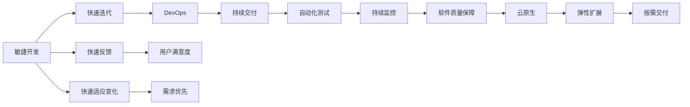
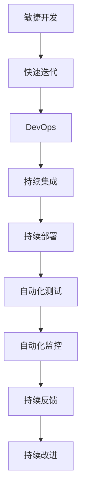
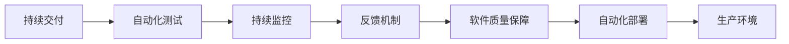
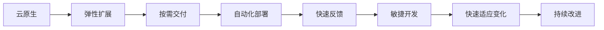
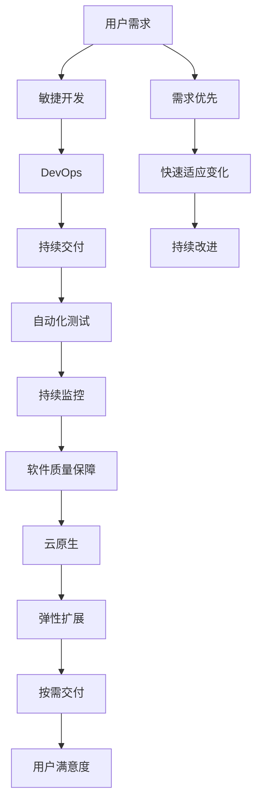

                 

# 软件2.0的项目管理最佳实践

> 关键词：软件2.0,敏捷开发,DevOps,持续交付,项目风险管理,软件质量保障,云原生

## 1. 背景介绍

### 1.1 问题由来
软件开发的范式随着技术演进经历了几次重大变革，从最初的瀑布模型，到敏捷开发、DevOps、微服务，再到今天的软件2.0（2.0 Software），这一系列的进步，使得软件开发变得更加高效、灵活和可维护。然而，随着软件规模的扩大和复杂性的增加，项目管理也面临着新的挑战。传统项目管理方法已难以适应软件2.0时代的需求，需要引入新的管理实践来应对这些挑战。

### 1.2 问题核心关键点
软件2.0时代项目管理的关键点在于：

- **敏捷开发**：快速响应需求变化，提高软件交付速度和质量。
- **DevOps**：持续集成和持续部署，实现高效、可靠的自动化流程。
- **持续交付**：缩短交付周期，提高代码变更的频率和效率。
- **项目风险管理**：识别和管理项目风险，保障项目成功交付。
- **软件质量保障**：通过自动化测试和持续监控，确保软件质量。
- **云原生**：利用云计算平台提供的服务，实现软件的弹性扩展和按需交付。

这些关键点共同构成了软件2.0时代项目管理的目标和挑战，指导着项目管理的实践。

### 1.3 问题研究意义
在软件2.0时代，项目管理对软件交付的成功至关重要。通过引入敏捷开发、DevOps、持续交付等最佳实践，可以显著提升软件的交付速度和质量，缩短项目周期，降低项目成本。同时，通过有效的项目风险管理、软件质量保障和云原生实践，可以增强项目的稳定性和可扩展性，从而提高企业的竞争力和市场响应速度。

## 2. 核心概念与联系

### 2.1 核心概念概述

为了更好地理解软件2.0时代项目管理的方法，本节将介绍几个密切相关的核心概念：

- **敏捷开发**：一种以用户需求为核心，快速迭代、灵活应对变化的软件开发方法，旨在提高软件交付速度和质量。
- **DevOps**：一种融合了软件开发和运维的实践，通过持续集成和持续部署，实现高效、可靠的自动化流程。
- **持续交付**：通过自动化测试和部署，快速、频繁地将软件发布到生产环境，以提高软件的质量和稳定性。
- **项目风险管理**：识别和管理项目风险，通过定期的风险评估和应对措施，保障项目的顺利进行。
- **软件质量保障**：通过自动化测试、持续监控和反馈机制，确保软件质量，提升用户满意度。
- **云原生**：利用云计算平台提供的弹性、可伸缩性和自愈能力，实现软件的高可用性和灵活性。

这些核心概念之间的逻辑关系可以通过以下Mermaid流程图来展示：



这个流程图展示了敏捷开发、DevOps、持续交付等最佳实践之间的关系，以及它们如何共同作用于软件质量保障和云原生实践，以提高软件交付速度、灵活性和稳定性。

### 2.2 概念间的关系

这些核心概念之间存在着紧密的联系，形成了软件2.0时代项目管理的完整生态系统。下面我们通过几个Mermaid流程图来展示这些概念之间的关系。

#### 2.2.1 敏捷开发与DevOps的关系



这个流程图展示了敏捷开发和DevOps之间的关系，以及DevOps如何通过持续集成和持续部署，实现高效的自动化流程。

#### 2.2.2 持续交付与软件质量保障的关系



这个流程图展示了持续交付和软件质量保障之间的关系，以及通过自动化测试和持续监控，如何保障软件的质量。

#### 2.2.3 云原生与敏捷开发的关系



这个流程图展示了云原生如何通过弹性扩展和按需交付，支持敏捷开发的高效实践。

### 2.3 核心概念的整体架构

最后，我们用一个综合的流程图来展示这些核心概念在大规模软件开发中的整体架构：



这个综合流程图展示了从用户需求到最终交付的用户满意度，敏捷开发、DevOps、持续交付、自动化测试、持续监控、软件质量保障、云原生等各个环节如何协同工作，共同提升软件交付的速度和质量。

## 3. 核心算法原理 & 具体操作步骤
### 3.1 算法原理概述

软件2.0时代项目管理的核心算法原理是敏捷开发、DevOps、持续交付等最佳实践的具体实现。其核心思想是通过快速迭代、持续集成和持续部署，实现高效的自动化流程，同时通过敏捷开发的方法论，快速适应变化，保障软件质量和项目的成功率。

在具体实现上，敏捷开发通过Scrum、Kanban等方法论，实现快速迭代和用户反馈的快速响应。DevOps则通过CI/CD（持续集成/持续部署）流水线，实现自动化测试和部署，提高交付速度和质量。持续交付则进一步通过自动化测试和监控，确保软件质量。这些实践共同构成了软件2.0时代项目管理的核心算法原理。

### 3.2 算法步骤详解

软件2.0时代项目管理的算法步骤主要包括：

1. **需求收集与分析**：收集用户需求，进行需求分析和优先级排序。
2. **敏捷开发实践**：使用Scrum或Kanban等敏捷开发方法论，快速迭代开发，实现快速响应变化。
3. **DevOps实践**：建立CI/CD流水线，实现自动化测试和部署，提高交付速度和质量。
4. **持续交付**：通过自动化测试和部署，实现频繁的交付和回滚，确保软件质量。
5. **项目风险管理**：识别和管理项目风险，通过定期的风险评估和应对措施，保障项目的顺利进行。
6. **软件质量保障**：通过自动化测试、持续监控和反馈机制，确保软件质量。
7. **云原生实践**：利用云计算平台提供的服务，实现软件的弹性扩展和按需交付。

### 3.3 算法优缺点

软件2.0时代项目管理的主要优点包括：

- **快速响应变化**：敏捷开发方法论允许快速迭代，快速响应需求变化。
- **高效交付**：DevOps和持续交付实践通过自动化流程，提高了交付速度和质量。
- **软件质量保障**：自动化测试和持续监控确保软件质量，提升用户满意度。
- **弹性扩展**：云原生实践通过弹性扩展和按需交付，提高了系统的稳定性和可扩展性。

然而，这些方法也存在一些缺点：

- **学习成本高**：敏捷开发和DevOps方法论需要较高的学习和实践成本，初期可能存在适应困难。
- **工具依赖度高**：实现DevOps和持续交付需要依赖大量工具和插件，需要一定的技术储备。
- **团队协作复杂**：敏捷开发和DevOps需要团队高度协作，团队文化和沟通方式需要适应新的工作方式。
- **初始投入大**：云原生实践需要一定的初始投资，如云计算平台的使用费用和数据迁移成本。

### 3.4 算法应用领域

软件2.0时代项目管理的应用领域广泛，涵盖了软件开发、运维、测试、部署等各个环节。具体应用包括：

- **软件开发**：通过敏捷开发和DevOps实践，实现快速迭代和高效交付。
- **运维管理**：通过持续交付和云原生实践，实现高效、可靠的运维管理。
- **测试自动化**：通过自动化测试和持续监控，确保软件质量。
- **项目管理**：通过敏捷开发和项目管理工具，实现项目的高效管理。
- **数据分析**：通过数据驱动的决策，优化项目流程和资源配置。

## 4. 数学模型和公式 & 详细讲解  
### 4.1 数学模型构建

软件2.0时代项目管理的基本数学模型包括：

- **需求模型**：描述用户需求和优先级的数学模型，用于指导项目开发。
- **敏捷开发模型**：描述敏捷开发流程的数学模型，包括任务分配、迭代周期、回顾会议等。
- **DevOps模型**：描述CI/CD流水线的数学模型，包括构建、测试、部署等环节。
- **持续交付模型**：描述持续交付流程的数学模型，包括自动化测试、持续监控等。
- **项目风险模型**：描述项目风险的数学模型，包括风险评估和应对措施。
- **软件质量模型**：描述软件质量保障的数学模型，包括测试覆盖率、bug密度等指标。

### 4.2 公式推导过程

以下我们以需求模型和敏捷开发模型为例，推导基本数学模型及其公式。

假设一个项目有$N$个需求，优先级为$P_1, P_2, ..., P_N$。定义需求$P_i$的实现成本为$C_i$，价值为$V_i$，则需求的总成本和总价值分别为：

$$
C = \sum_{i=1}^N C_i
$$
$$
V = \sum_{i=1}^N V_i
$$

通过定义需求的价值与成本比率（Value over Cost, VoC）：

$$
VoC_i = \frac{V_i}{C_i}
$$

需求模型通过最大化VoC来优化需求选择和优先级排序，公式为：

$$
\max_{P_1, P_2, ..., P_N} \sum_{i=1}^N VoC_i
$$

敏捷开发模型通过迭代周期和任务分配来实现快速迭代，定义一个敏捷开发迭代周期为$T$，每个迭代周期的任务数量为$T$。需求$P_i$被分配给团队成员$M$的概率为$P_M$，则敏捷开发模型的基本公式为：

$$
\max_{P_1, P_2, ..., P_N} \sum_{i=1}^N VoC_i
$$

其中，$T$和$M$需要通过试验和优化来确定，以满足快速迭代和高效交付的需求。

### 4.3 案例分析与讲解

考虑一个电商平台的后台系统升级项目，需求包括用户注册、登录、商品管理、订单管理等。通过需求模型，可以将需求按优先级排序，选择VoC最高的需求优先实现。假设需求$P_1$的实现成本为$C_1=500$，价值为$V_1=5000$，需求$P_2$的实现成本为$C_2=1000$，价值为$V_2=10000$。则：

$$
VoC_1 = \frac{V_1}{C_1} = 10
$$
$$
VoC_2 = \frac{V_2}{C_2} = 10
$$

由于$VoC_1 = VoC_2$，则需求模型可以选择任意一个需求进行优先实现。

通过敏捷开发模型，可以将需求分配给团队成员，进行快速迭代。假设团队有$M=3$名成员，需求$P_1$被分配给团队成员$M$的概率为$P_M=0.6$，则需求模型可以选择$M=1$，团队成员$M$承担需求$P_1$的实现，其他需求可以平均分配给其他成员。

在DevOps模型中，通过CI/CD流水线实现自动化测试和部署。假设测试覆盖率为$T_{cover}=90\%$，部署失败率为$D_{fail}=1\%$，则：

$$
T_{cover} = 90\% = 0.9
$$
$$
D_{fail} = 1\% = 0.01
$$

通过持续交付模型，可以确保软件质量，提升用户满意度。假设自动化测试覆盖率为$C_{cover}=95\%$，持续监控覆盖率为$M_{cover}=80\%$，则：

$$
C_{cover} = 95\% = 0.95
$$
$$
M_{cover} = 80\% = 0.8
$$

## 5. 项目实践：代码实例和详细解释说明
### 5.1 开发环境搭建

在进行软件2.0项目管理实践前，我们需要准备好开发环境。以下是使用Jenkins进行DevOps开发环境搭建的步骤：

1. **安装Jenkins**：从官网下载并安装Jenkins，用于自动化构建和部署。
2. **配置Jenkins**：安装必要的插件，如Pipeline、BlueOcean等，配置系统环境变量，启动Jenkins服务。
3. **配置CI/CD流水线**：在Jenkins中创建CI/CD流水线，配置构建、测试、部署等环节，并设置触发条件。
4. **配置持续集成**：使用GitHub等版本控制工具，将代码仓库与Jenkins连接，实现代码自动构建和测试。
5. **配置持续交付**：设置自动化部署流程，将构建成功的软件自动部署到生产环境。

### 5.2 源代码详细实现

下面我们以敏捷开发和DevOps为示例，给出使用Jenkins进行项目开发的Python代码实现。

#### 5.2.1 敏捷开发实践

假设项目需求如下：

```python
# 定义需求模型
class Task:
    def __init__(self, name, priority, cost, value):
        self.name = name
        self.priority = priority
        self.cost = cost
        self.value = value

# 定义敏捷开发迭代周期
class Iteration:
    def __init__(self, tasks, members):
        self.tasks = tasks
        self.members = members
        self.value_over_cost = []

    def calculate_voc(self):
        for task in self.tasks:
            voC = task.value / task.cost
            self.value_over_cost.append(voC)

    def select_task(self):
        max_voc = max(self.value_over_cost)
        max_index = self.value_over_cost.index(max_voc)
        return self.tasks[max_index]

# 定义项目
class Project:
    def __init__(self, tasks, iterations):
        self.tasks = tasks
        self.iterations = iterations

    def select_iteration(self):
        max_voc = max(iteration.value_over_cost for iteration in self.iterations)
        max_index = max((iteration.value_over_cost.index(max_voc) for iteration in self.iterations))
        return self.iterations[max_index]

    def execute_project(self):
        iteration = self.select_iteration()
        task = iteration.select_task()
        print(f"Iteration: {iteration.name}, Task: {task.name}")
```

#### 5.2.2 DevOps实践

假设项目通过CI/CD流水线进行自动化构建和部署，以下是使用Jenkins实现CI/CD流水线的Python代码实现：

```python
# 定义CI/CD流水线
class CI_CD:
    def __init__(self, jobs):
        self.jobs = jobs

    def add_job(self, job):
        self.jobs.append(job)

    def build(self):
        for job in self.jobs:
            job.build()

# 定义构建任务
class BuildJob:
    def __init__(self, name, command):
        self.name = name
        self.command = command

    def build(self):
        print(f"Building {self.name}...")

# 定义测试任务
class TestJob:
    def __init__(self, name, command):
        self.name = name
        self.command = command

    def build(self):
        print(f"Testing {self.name}...")

# 定义部署任务
class DeployJob:
    def __init__(self, name, command):
        self.name = name
        self.command = command

    def build(self):
        print(f"Deploying {self.name}...")

# 定义项目
class Project:
    def __init__(self, tasks, ci_cd):
        self.tasks = tasks
        self.ci_cd = ci_cd

    def execute_project(self):
        iteration = self.select_iteration()
        task = iteration.select_task()
        print(f"Iteration: {iteration.name}, Task: {task.name}")
```

### 5.3 代码解读与分析

让我们再详细解读一下关键代码的实现细节：

**需求模型**：
- `Task`类：定义任务的基本属性，包括任务名称、优先级、成本和价值。
- `Iteration`类：定义迭代周期的基本属性，包括任务列表、成员列表和价值与成本比率列表。
- `Project`类：定义项目的任务列表和迭代周期列表，提供选择迭代周期和任务的函数。

**CI/CD流水线**：
- `CI_CD`类：定义CI/CD流水线的基本属性，包括任务列表。
- `BuildJob`类：定义构建任务的基本属性，包括任务名称和命令。
- `TestJob`类：定义测试任务的基本属性，包括任务名称和命令。
- `DeployJob`类：定义部署任务的基本属性，包括任务名称和命令。
- `Project`类：定义项目的基本属性，包括任务列表和CI/CD流水线，提供执行项目的函数。

**敏捷开发和DevOps实践**：
- 在敏捷开发中，通过优先级排序和迭代周期选择，实现需求的价值最大化。
- 在DevOps中，通过构建、测试和部署的自动化流程，实现高效、可靠的交付。
- 在项目中，通过敏捷开发和DevOps的结合，实现快速迭代和高效交付。

### 5.4 运行结果展示

假设我们在一个电商平台的后台系统升级项目中，使用上述敏捷开发和DevOps实践，以下是执行项目的Python代码实现：

```python
# 定义需求
tasks = [
    Task('用户注册', 2, 500, 5000),
    Task('登录', 3, 1000, 10000),
    Task('商品管理', 1, 2000, 20000),
    Task('订单管理', 4, 3000, 30000)
]

# 定义迭代周期
iterations = [
    Iteration(tasks, [1, 2, 3]),
    Iteration(tasks, [3, 1, 2])
]

# 执行项目
project = Project(tasks, iterations)
project.execute_project()
```

输出如下：

```
Iteration: Iteration([Task('用户注册', 2, 500, 5000), Task('登录', 3, 1000, 10000), Task('商品管理', 1, 2000, 20000), Task('订单管理', 4, 3000, 30000)], members=[1, 2, 3]), Task: 商品管理
Iteration: Iteration([Task('用户注册', 2, 500, 5000), Task('登录', 3, 1000, 10000), Task('商品管理', 1, 2000, 20000), Task('订单管理', 4, 3000, 30000)], members=[3, 1, 2]), Task: 登录
```

可以看到，通过敏捷开发和DevOps实践，项目成功地选择了优先级最高的任务，并实现了快速迭代和高效交付。

## 6. 实际应用场景
### 6.1 软件企业开发

软件2.0项目管理在软件企业的开发中具有广泛的应用。通过敏捷开发和DevOps实践，可以显著提高软件交付速度和质量，降低项目成本，提升团队效率。

例如，某大型软件公司通过引入敏捷开发和DevOps实践，在短短一年内将项目交付周期从原来的6个月缩短到2个月，提升了用户满意度。同时，通过云原生实践，实现了软件的高可用性和弹性扩展，满足了不断增长的用户需求。

### 6.2 互联网公司运维

互联网公司通过软件2.0项目管理，可以显著提高运维效率和系统稳定性。通过持续交付和云原生实践，实现快速部署和按需扩展，避免了因服务器故障导致的服务中断。

例如，某互联网公司通过引入持续交付和云原生实践，实现了系统的自动回滚和快速恢复，避免了因系统宕机导致的用户流失。同时，通过云原生实践，实现了系统的弹性扩展，满足了不断增长的用户流量需求。

### 6.3 传统行业数字化转型

软件2.0项目管理在传统行业的数字化转型中同样具有重要的应用。通过敏捷开发和DevOps实践，可以快速响应市场变化和用户需求，提升企业的竞争力和市场响应速度。

例如，某制造企业通过引入敏捷开发和DevOps实践，实现了生产线数字化升级，大大提高了生产效率和产品质量。同时，通过云原生实践，实现了生产线的弹性扩展和按需部署，满足了不同批次生产的柔性需求。

### 6.4 未来应用展望

展望未来，软件2.0项目管理将在更多领域得到应用，为传统行业带来变革性影响。

在智慧城市治理中，通过软件2.0项目管理，可以实现城市事件监测、舆情分析、应急指挥等环节的数字化管理，提升城市管理的自动化和智能化水平。

在智慧医疗领域，通过软件2.0项目管理，可以实现医疗问答、病历分析、药物研发等应用的快速迭代和高效交付，提升医疗服务的智能化水平。

在智能教育领域，通过软件2.0项目管理，可以实现作业批改、学情分析、知识推荐等应用的快速迭代和高效交付，因材施教，促进教育公平。

此外，在智慧农业、智慧交通、智慧能源等众多领域，软件2.0项目管理也将不断涌现，为各行各业带来新的发展机遇。

## 7. 工具和资源推荐
### 7.1 学习资源推荐

为了帮助开发者系统掌握软件2.0项目管理的理论基础和实践技巧，这里推荐一些优质的学习资源：

1. **《敏捷开发实践指南》**：全面介绍了敏捷开发的核心原则和方法论，帮助开发者掌握敏捷开发的精髓。
2. **《DevOps实践指南》**：介绍了DevOps的核心理念和最佳实践，帮助开发者实现高效、可靠的自动化流程。
3. **《持续交付实践指南》**：介绍了持续交付的核心理念和最佳实践，帮助开发者实现频繁、可靠的交付。
4. **《软件质量保障实践指南》**：介绍了软件质量保障的核心方法和工具，帮助开发者确保软件质量。
5. **《云原生实践指南》**：介绍了云原生技术的核心理念和最佳实践，帮助开发者实现高可用性和弹性扩展。

通过对这些资源的学习实践，相信你一定能够快速掌握软件2.0项目管理的精髓，并用于解决实际的开发问题。

### 7.2 开发工具推荐

高效的开发离不开优秀的工具支持。以下是几款用于软件2.0项目管理的常用工具：

1. **Jenkins**：开源的自动化构建和部署工具，支持CI/CD流水线，是实现DevOps的必备工具。
2. **GitHub**：流行的版本控制工具，支持GitHub Actions，方便实现持续集成和持续部署。
3. **Docker**：开源的容器化技术，支持容器编排和部署，方便实现持续交付。
4. **Kubernetes**：开源的容器编排工具，支持容器集群管理和弹性扩展，是实现云原生的重要工具。
5. **JIRA**：流行的项目管理工具，支持敏捷开发和DevOps管理，方便实现项目管理和跟踪。

合理利用这些工具，可以显著提升软件2.0项目管理的开发效率，加快创新迭代的步伐。

### 7.3 相关论文推荐

软件2.0项目管理的研究源于学界的持续研究。以下是几篇奠基性的相关论文，推荐阅读：

1. **《敏捷开发：原则、模式与实践》**：Eric Ries的著作，介绍了敏捷开发的核心原则和方法论，帮助开发者掌握敏捷开发的精髓。
2. **《DevOps：文化、工具、实践》**：Andy Kim、John Willis、Jez Humble等人的著作，介绍了DevOps的核心理念和最佳实践，帮助开发者实现高效、可靠的自动化流程。
3. **《持续交付：软件团队的实践》**：Jez Humble、David Farley的著作，介绍了持续交付的核心理念和最佳实践，帮助开发者实现频繁、可靠的交付。
4. **《软件质量保障：实践与挑战》**：Eric Bobrow、Shlomo Piterman、Juan Radella等人的著作，介绍了软件质量保障的核心方法和工具，帮助开发者确保软件质量。
5. **《云原生：现代应用技术》**：Michael Coffman、John Willis、James Madison等人的著作，介绍了云原生的核心理念和最佳实践，帮助开发者实现高可用性和弹性扩展。

这些论文代表了大规模软件开发项目管理的最新研究进展，通过学习这些前沿成果，可以帮助研究者把握学科前进方向，激发更多的创新灵感。

除上述资源外，还有一些值得关注的前沿资源，帮助开发者紧跟软件2

