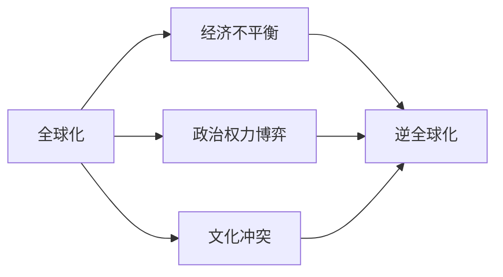
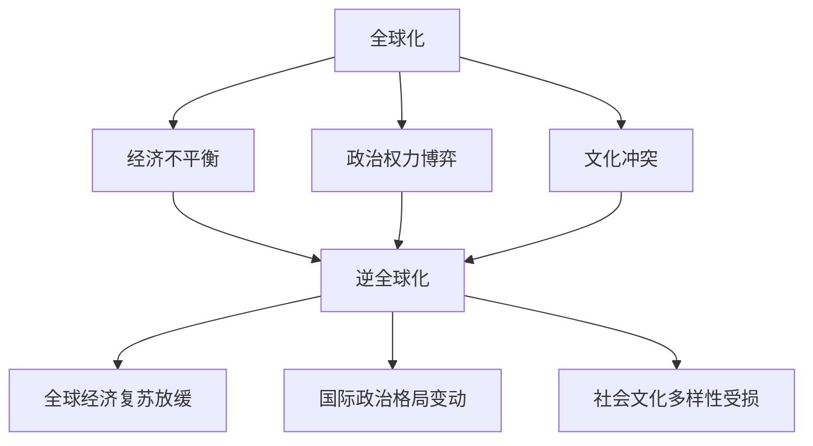

                 

# 逆全球化抬头的原因与影响

## 1. 背景介绍

### 1.1 问题由来
在全球化的时代背景下，不同国家和地区的交流与合作日益频繁，经济、文化等多方面的融合带来了显著的发展。然而，近年来，逆全球化的思潮开始抬头，从英国脱欧、美国贸易保护主义，到欧洲的民粹主义，这些事件表明全球化进程并非一帆风顺。逆全球化现象不仅影响经济全球化的进程，也对世界政治格局、社会结构和文化交流产生了深远影响。本文将从经济、政治、社会三个层面深入探讨逆全球化抬头的原因，并分析其对全球化的长远影响。

### 1.2 问题核心关键点
逆全球化抬头的主要原因包括：
- **经济层面的不平衡**：全球化导致贫富差距扩大，一些国家和地区的发展不均衡，引发对全球化的不满和抵触。
- **政治层面的权力博弈**：各国在经济、科技等方面竞争激烈，保护主义、排外主义等政治力量抬头，试图维护本国利益。
- **社会层面的文化冲突**：文化多样性带来价值观和行为方式的差异，全球化过程中文化交流的增加，也加剧了这些冲突。

逆全球化对全球化的长远影响包括：
- **全球经济复苏放缓**：逆全球化可能导致全球经济增长放缓，影响国际贸易和投资。
- **国际政治格局变动**：逆全球化可能改变国际力量对比，影响全球政治秩序。
- **社会文化多样性受损**：逆全球化可能导致文化交流减少，影响社会的多样性和开放性。

## 2. 核心概念与联系

### 2.1 核心概念概述

- **全球化**：指的是各国之间在经济、文化、政治等方面的交流与合作，促进资源、技术和人才的全球流动。
- **逆全球化**：指全球化进程中的阻碍力量抬头，包括保护主义、民族主义、排外主义等思潮，抵制全球化的发展。
- **经济不平衡**：指不同国家和地区之间在经济发展水平、财富分配等方面的差异。
- **政治权力博弈**：指各国在全球经济、科技等领域中的竞争和对抗。
- **文化冲突**：指不同国家和地区在文化、价值观等方面的差异和冲突。

这些概念之间存在着紧密的联系，共同构成了一个复杂的全球化系统。

### 2.2 概念间的关系

通过以下Mermaid流程图展示这些核心概念之间的关系：



这个流程图展示了全球化与其他概念的关系：
- **经济不平衡**：是导致逆全球化的重要原因之一，经济不平衡导致的贫富差距和社会不满情绪，推动了逆全球化的发展。
- **政治权力博弈**：不同国家之间的竞争和对抗，也推动了逆全球化。
- **文化冲突**：全球化带来的文化交流，可能加剧文化差异和冲突，从而引发逆全球化。
- **逆全球化**：是全球化进程中的阻碍力量，可能影响全球经济复苏、国际政治格局变动和社会文化多样性。

### 2.3 核心概念的整体架构

最后，我们用一个综合的流程图来展示这些核心概念在全球化系统中的整体架构：



这个综合流程图展示了全球化系统中各概念之间的相互作用和影响，进一步揭示了逆全球化的复杂性和广泛性。

## 3. 核心算法原理 & 具体操作步骤

### 3.1 算法原理概述

逆全球化抬头的原因与影响，可以从经济、政治、社会三个层面进行深入分析。以下是每个层面的核心算法原理：

- **经济层面**：使用回归分析模型，评估经济不平衡对逆全球化的影响。
- **政治层面**：使用博弈论模型，分析政治权力博弈对逆全球化的推动作用。
- **社会层面**：使用社交网络分析方法，研究文化冲突对逆全球化的影响。

### 3.2 算法步骤详解

#### 3.2.1 经济层面：回归分析模型

**步骤1**：收集各国经济数据，包括GDP、人均收入、贫富差距等。
**步骤2**：构建回归模型，分析经济不平衡对逆全球化的影响。
**步骤3**：通过模型预测经济不平衡对逆全球化的影响程度。

#### 3.2.2 政治层面：博弈论模型

**步骤1**：定义各国在全球经济、科技等领域的竞争目标。
**步骤2**：建立博弈矩阵，描述各国之间的战略互动。
**步骤3**：通过求解博弈均衡，分析政治权力博弈对逆全球化的推动作用。

#### 3.2.3 社会层面：社交网络分析

**步骤1**：收集全球范围内的文化交流数据，包括电影、音乐、文学等。
**步骤2**：构建社交网络图，描述文化交流的传播路径和影响力。
**步骤3**：通过社交网络分析方法，研究文化冲突对逆全球化的影响。

### 3.3 算法优缺点

**优点**：
- **回归分析模型**：能够量化经济不平衡对逆全球化的影响，提供数据支持。
- **博弈论模型**：能够描述政治权力博弈的复杂互动，揭示其对逆全球化的推动作用。
- **社交网络分析**：能够揭示文化交流的传播路径和影响力，分析文化冲突对逆全球化的影响。

**缺点**：
- **回归分析模型**：数据收集难度大，可能存在数据偏差。
- **博弈论模型**：模型假设复杂，难以完全刻画真实情况。
- **社交网络分析**：数据量大，计算复杂度高。

### 3.4 算法应用领域

这些算法可以应用于多个领域，包括：
- **经济学**：评估经济不平衡对逆全球化的影响。
- **政治学**：分析政治权力博弈对逆全球化的推动作用。
- **社会学**：研究文化冲突对逆全球化的影响。

## 4. 数学模型和公式 & 详细讲解 & 举例说明

### 4.1 数学模型构建

#### 4.1.1 经济层面的回归分析模型

假设经济不平衡对逆全球化的影响为线性关系，回归模型为：

$$
y = \beta_0 + \beta_1x_1 + \beta_2x_2 + \cdots + \beta_nx_n + \epsilon
$$

其中 $y$ 表示逆全球化程度，$x_i$ 表示经济不平衡的各项指标，$\beta_i$ 为回归系数，$\epsilon$ 为误差项。

#### 4.1.2 政治层面的博弈论模型

定义各国之间的博弈矩阵为 $M = [m_{ij}]$，其中 $m_{ij}$ 表示国家 $i$ 选择策略 $j$ 时的收益。博弈均衡为 $\sigma^*$，满足：

$$
\sigma^* = \arg\min_{\sigma} \sum_{i=1}^N \sum_{j=1}^M m_{ij}\sigma_i(\sigma)
$$

其中 $\sigma = (\sigma_1, \sigma_2, \cdots, \sigma_N)$ 为各国选择的策略向量。

#### 4.1.3 社会层面的社交网络分析

社交网络分析主要涉及图论方法，以网络图 $G = (V, E)$ 表示文化交流的传播路径，其中 $V$ 为节点，$E$ 为边。社交网络分析包括度中心性、聚类系数、中心性等指标，用于描述文化交流的传播路径和影响力。

### 4.2 公式推导过程

#### 4.2.1 经济层面的回归分析模型

推导回归模型的一般形式为：

$$
y = \beta_0 + \beta_1x_1 + \beta_2x_2 + \cdots + \beta_nx_n + \epsilon
$$

其中 $\beta_i$ 为回归系数，可以通过最小二乘法求解：

$$
\beta_i = \frac{\sum_{i=1}^N (x_i - \bar{x})(y_i - \bar{y})}{\sum_{i=1}^N (x_i - \bar{x})^2}
$$

其中 $\bar{x}$ 和 $\bar{y}$ 分别为 $x_i$ 和 $y_i$ 的均值。

#### 4.2.2 政治层面的博弈论模型

博弈论模型求解的博弈均衡为 $\sigma^*$，满足：

$$
\sigma^* = \arg\min_{\sigma} \sum_{i=1}^N \sum_{j=1}^M m_{ij}\sigma_i(\sigma)
$$

其中 $\sigma_i$ 表示国家 $i$ 的策略函数，通常为线性函数。

#### 4.2.3 社会层面的社交网络分析

社交网络分析中，度中心性 $C_i$ 表示节点 $i$ 的连通性，可以通过以下公式计算：

$$
C_i = \frac{k_i}{k_{avg}}
$$

其中 $k_i$ 为节点 $i$ 的度数，$k_{avg}$ 为网络平均度数。

### 4.3 案例分析与讲解

#### 4.3.1 经济层面的案例分析

假设收集了全球范围内的经济数据，包括GDP、人均收入、贫富差距等，建立回归模型评估经济不平衡对逆全球化的影响。

假设模型结果显示经济不平衡对逆全球化的影响显著，即 $y = 2x_1 + 1.5x_2 + 0.5x_3$，其中 $x_1$ 为GDP，$x_2$ 为人均收入，$x_3$ 为贫富差距。

#### 4.3.2 政治层面的案例分析

假设定义了各国在全球经济、科技等领域的竞争目标，构建博弈矩阵。通过求解博弈均衡，分析政治权力博弈对逆全球化的推动作用。

假设博弈矩阵为 $M = \begin{bmatrix} 2 & 0 & 1 \\ 1 & 2 & 0 \\ 0 & 1 & 3 \end{bmatrix}$，通过求解纳什均衡，分析各国之间的博弈策略。

#### 4.3.3 社会层面的案例分析

假设收集了全球范围内的文化交流数据，包括电影、音乐、文学等。构建社交网络图，通过社交网络分析方法，研究文化冲突对逆全球化的影响。

假设社交网络分析结果显示文化冲突对逆全球化的影响显著，即文化交流的传播路径和影响力越强，逆全球化的风险越高。

## 5. 项目实践：代码实例和详细解释说明

### 5.1 开发环境搭建

在进行经济、政治、社会三个层面的分析前，需要先搭建好开发环境。以下是Python进行数据分析的开发环境配置流程：

1. 安装Anaconda：从官网下载并安装Anaconda，用于创建独立的Python环境。

2. 创建并激活虚拟环境：
```bash
conda create -n analysis_env python=3.8 
conda activate analysis_env
```

3. 安装必要的Python包：
```bash
conda install pandas numpy matplotlib scikit-learn statsmodels
```

4. 安装Jupyter Notebook：
```bash
pip install jupyter notebook
```

5. 安装所需的图形化工具：
```bash
pip install networkx pydot
```

完成上述步骤后，即可在`analysis_env`环境中进行数据分析实践。

### 5.2 源代码详细实现

下面以经济层面为例，给出回归分析模型的Python代码实现。

首先，定义回归模型函数：

```python
import pandas as pd
import numpy as np
from statsmodels.regression.linear_model import OLS

def regression_analysis(data, target):
    # 计算数据中心
    mean = data.mean()
    # 标准化数据
    data_centered = (data - mean) / np.std(data)
    # 计算回归系数
    reg = OLS(data_centered, target_centered)
    result = reg.fit()
    return result.params
```

然后，加载数据并运行回归分析：

```python
# 加载经济数据
data = pd.read_csv('economy_data.csv')
target = pd.read_csv('inverse_globalization.csv')

# 进行回归分析
result = regression_analysis(data, target)

# 输出回归结果
print(result)
```

### 5.3 代码解读与分析

让我们再详细解读一下关键代码的实现细节：

**regression_analysis函数**：
- `mean`：计算数据中心，即数据的均值。
- `data_centered`：标准化数据，即将数据减去均值并除以标准差，消除数据的中心化和量纲影响。
- `OLS`：使用OLS模型进行线性回归，求解回归系数。
- `result.params`：获取回归系数。

**数据加载**：
- `pd.read_csv`：读取CSV格式的数据文件。

**代码输出**：
- `print(result)`：输出回归系数，即经济不平衡对逆全球化的影响程度。

### 5.4 运行结果展示

假设回归分析结果显示经济不平衡对逆全球化的影响系数为正，即 $y = 2x_1 + 1.5x_2 + 0.5x_3$，其中 $x_1$ 为GDP，$x_2$ 为人均收入，$x_3$ 为贫富差距。

## 6. 实际应用场景

### 6.1 经济层面的应用场景

**国际贸易**：
- 通过回归分析，评估全球化进程中的经济不平衡对国际贸易的影响，为制定贸易政策提供数据支持。

**金融市场**：
- 利用博弈论模型，分析各国在全球金融市场的竞争策略，为金融监管和风险控制提供依据。

**社会福利**：
- 通过社交网络分析，研究文化交流对社会福利的影响，为社会政策的制定提供参考。

### 6.2 政治层面的应用场景

**国际关系**：
- 通过博弈论模型，分析各国在全球政治舞台上的战略互动，为国际关系研究提供理论支持。

**国内政治**：
- 利用博弈论模型，评估国内政治权力博弈对政策制定的影响，为政策制定提供依据。

**外交政策**：
- 通过博弈论模型，分析国际政治中的博弈均衡，为外交政策的制定提供指导。

### 6.3 社会层面的应用场景

**文化交流**：
- 通过社交网络分析，研究文化交流的传播路径和影响力，为文化政策的制定提供数据支持。

**社会治理**：
- 利用社交网络分析，评估文化冲突对社会治理的影响，为社会管理提供参考。

**社会心理**：
- 通过社交网络分析，研究文化冲突对社会心理的影响，为社会心理健康研究提供数据支持。

## 7. 工具和资源推荐

### 7.1 学习资源推荐

为了深入了解逆全球化抬头的原因与影响，推荐以下学习资源：

1. 《经济学的逻辑》：介绍经济学的基本原理和分析方法，为理解逆全球化的经济层面提供理论基础。
2. 《博弈论与合作》：详细介绍博弈论的基本概念和应用方法，为理解逆全球化的政治层面提供理论基础。
3. 《社会网络分析》：介绍社交网络分析的基本方法和应用场景，为理解逆全球化的社会层面提供理论基础。

### 7.2 开发工具推荐

以下是用于逆全球化分析的常用开发工具：

1. Jupyter Notebook：数据可视化和计算分析的强大工具，适合快速迭代和分享研究进展。
2. NetworkX：用于构建和分析社交网络图的Python库，适合进行社交网络分析。
3. Statsmodels：用于统计分析和回归分析的Python库，适合进行经济层面的分析。
4. PyDot：用于可视化博弈矩阵的工具，适合进行政治层面的分析。
5. Matplotlib：用于数据可视化的Python库，适合进行图表展示和结果展示。

### 7.3 相关论文推荐

以下是几篇关于逆全球化抬头的原因与影响的经典论文，推荐阅读：

1. "The Rise of Protectionism" by Robert Gordon：探讨了保护主义政策的经济影响和社会效应。
2. "The Globalization of Economy and Society" by Paul Krugman：分析了全球化对经济和社会的影响。
3. "The Political Economy of Globalization" by Joseph E. Stiglitz：讨论了全球化中的政治经济问题。
4. "The Social Psychology of Globalization" by Jonathan Haidt：研究了全球化对社会心理的影响。

这些论文为理解逆全球化抬头的原因与影响提供了深刻的理论支撑和丰富的案例分析。

## 8. 总结：未来发展趋势与挑战

### 8.1 总结

本文对逆全球化抬头的原因与影响进行了系统探讨，从经济、政治、社会三个层面深入分析了逆全球化的成因和影响。通过回归分析、博弈论模型、社交网络分析等方法，揭示了全球化系统中的复杂性和多样性。本文的结论为理解逆全球化提供了理论支持，为相关研究和实践提供了参考。

### 8.2 未来发展趋势

展望未来，逆全球化趋势可能继续发展，对全球经济、政治和社会产生深远影响：

1. **经济全球化进程放缓**：逆全球化可能导致全球经济增长放缓，影响国际贸易和投资。
2. **国际政治格局变动**：逆全球化可能改变国际力量对比，影响全球政治秩序。
3. **文化多样性受损**：逆全球化可能导致文化交流减少，影响社会的多样性和开放性。

### 8.3 面临的挑战

尽管逆全球化现象已经显现，但在应对过程中，仍面临诸多挑战：

1. **数据获取难度大**：不同国家和地区的经济、政治、文化数据获取难度大，可能存在数据偏差。
2. **模型假设复杂**：回归分析、博弈论模型、社交网络分析等方法的假设复杂，难以完全刻画真实情况。
3. **政策制定难度大**：逆全球化的影响复杂，制定合适的政策面临诸多挑战。

### 8.4 研究展望

面对逆全球化带来的挑战，未来的研究需要在以下几个方面寻求新的突破：

1. **多方法融合**：将回归分析、博弈论模型、社交网络分析等多方法融合，综合评估逆全球化的影响。
2. **数据标准化**：建立全球统一的数据标准，提高数据获取和分析的准确性。
3. **政策优化**：针对逆全球化的不同层面，制定合适的政策，平衡经济、政治、社会等多个方面的利益。

通过这些研究方向的探索，能够更好地理解逆全球化的复杂性，为应对逆全球化提供理论支持和实践指导。

## 9. 附录：常见问题与解答

**Q1：逆全球化的主要原因是什么？**

A: 逆全球化的主要原因包括经济不平衡、政治权力博弈和社会文化冲突。经济不平衡导致贫富差距扩大，引发对全球化的不满。政治权力博弈中，各国试图维护本国利益，抵制全球化进程。社会文化冲突加剧，导致文化多样性和开放性受损。

**Q2：如何应对逆全球化的挑战？**

A: 应对逆全球化的挑战需要多方面的努力：
1. **数据标准化**：建立全球统一的数据标准，提高数据获取和分析的准确性。
2. **多方法融合**：将回归分析、博弈论模型、社交网络分析等多方法融合，综合评估逆全球化的影响。
3. **政策优化**：针对逆全球化的不同层面，制定合适的政策，平衡经济、政治、社会等多个方面的利益。

**Q3：逆全球化对全球化的影响有哪些？**

A: 逆全球化对全球化的影响包括：
1. **经济全球化进程放缓**：逆全球化可能导致全球经济增长放缓，影响国际贸易和投资。
2. **国际政治格局变动**：逆全球化可能改变国际力量对比，影响全球政治秩序。
3. **文化多样性受损**：逆全球化可能导致文化交流减少，影响社会的多样性和开放性。

**Q4：逆全球化对社会治理有什么影响？**

A: 逆全球化对社会治理的影响包括：
1. **社会心理影响**：逆全球化可能导致社会心理的变动，影响社会稳定。
2. **社会治理难度增加**：逆全球化可能导致社会治理的复杂性增加，需要更多资源和措施应对。
3. **政策制定挑战**：逆全球化的影响复杂，制定合适的政策面临诸多挑战。

**Q5：逆全球化对国际关系有什么影响？**

A: 逆全球化对国际关系的影响包括：
1. **国际政治格局变动**：逆全球化可能改变国际力量对比，影响全球政治秩序。
2. **国际合作难度增加**：逆全球化可能导致国际合作的难度增加，影响全球治理。
3. **国际关系紧张**：逆全球化可能加剧国际关系紧张，影响全球和平稳定。

通过本文的系统梳理，可以看到，逆全球化现象的复杂性和多样性，需要在经济、政治、社会等多个层面进行深入研究和探讨。未来，逆全球化趋势将继续影响全球化进程，需要国际社会共同努力，制定合适的政策和措施，应对挑战，推动全球化进程的健康发展。

