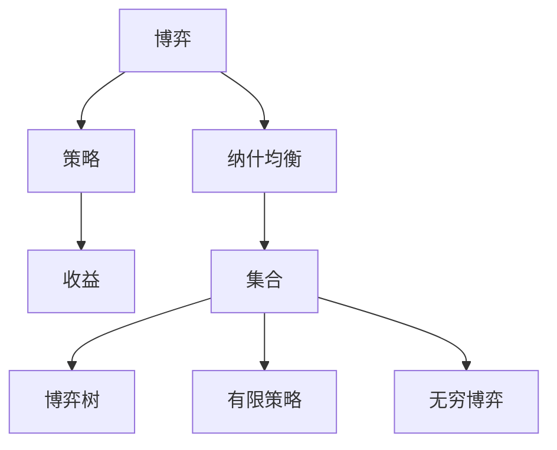
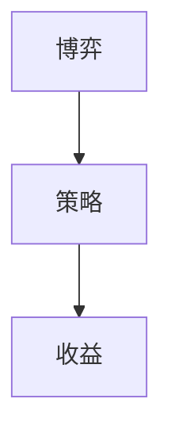
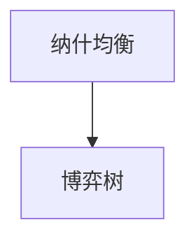
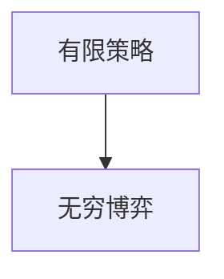
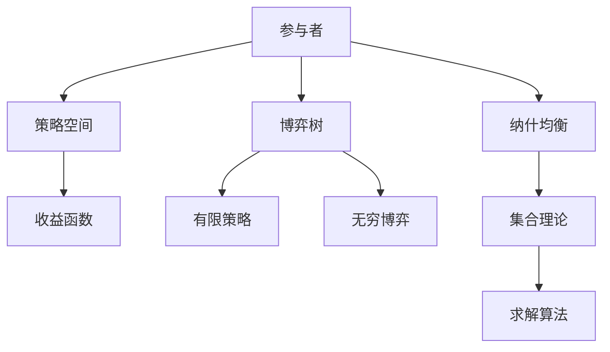
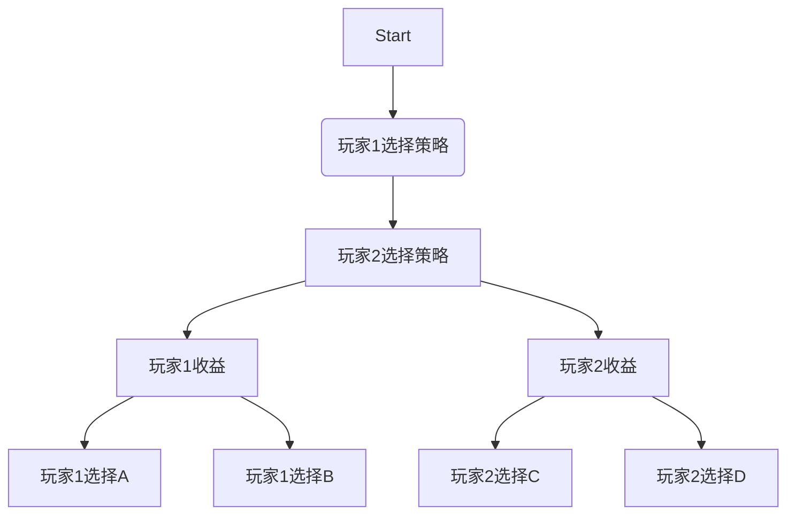

                 

# 集合论导引：贝尔空间博弈论

> 关键词：贝尔空间博弈论,博弈论,集合论,纳什均衡,博弈树,有限策略

## 1. 背景介绍

### 1.1 问题由来
贝尔空间博弈论（Berkeley Space Game Theory）是一种融合了博弈论和集合论的方法，旨在解决复杂的博弈问题，特别是在涉及不确定性和未知环境的情境中。这一理论由加州大学伯克利分校的数学家开发，近年来在经济学、计算机科学、政治科学等领域得到了广泛的应用。

### 1.2 问题核心关键点
贝尔空间博弈论的核心在于将博弈问题转化为集合论的框架下，通过数学模型和算法求解，以获得博弈的纳什均衡解，从而预测和指导决策行为。其核心思想包括：
1. 博弈参与者：各方在博弈中扮演的角色和策略选择。
2. 博弈空间：描述参与者行动的可能空间和状态转移关系。
3. 纳什均衡：在给定策略集合下，各方均无法通过单方面改变策略获得更好的收益。
4. 集合表示：使用集合理论对博弈空间进行建模和表示。
5. 求解算法：设计有效的算法求解博弈均衡。

### 1.3 问题研究意义
贝尔空间博弈论为解决复杂的博弈问题提供了新的视角和工具，其研究意义在于：
1. 提高决策的科学性和可预测性：通过数学模型和算法，可以更科学地预测博弈结果，指导决策行为。
2. 降低博弈风险和不确定性：通过分析博弈空间，可以预见潜在风险，降低不确定性。
3. 促进跨学科合作：博弈论与集合论的结合，促进了经济学、计算机科学、政治科学等领域的交叉融合。
4. 推动智能系统发展：博弈论和集合论方法在智能系统中的应用，如自动谈判、智能推荐等，具有重要意义。

## 2. 核心概念与联系

### 2.1 核心概念概述

贝尔空间博弈论涉及以下几个关键概念：

- 博弈（Game）：指多个参与者在一个共同的目标或利益分配系统中相互作用的决策过程。
- 策略（Strategy）：参与者为达成目标所采取的具体行动计划。
- 收益（Payoff）：参与者通过特定策略得到的回报或损失。
- 纳什均衡（Nash Equilibrium）：在给定策略集合下，所有参与者无法通过单方面改变策略获得更好的收益。
- 集合（Set）：由一个或多个元素组成的总体，是数学中的基本概念。
- 博弈树（Game Tree）：表示博弈过程的一种图形化工具，用于分析博弈路径和决策树。
- 有限策略（Finite Strategies）：博弈中参与者可以选择的策略是有限的。
- 无穷博弈（Infinite Games）：博弈的策略空间和可能结果可能是无限的。

这些概念之间的逻辑关系可以通过以下Mermaid流程图来展示：



这个流程图展示了几大核心概念之间的联系：

1. 博弈定义了参与者和目标。
2. 策略是参与者的决策方式。
3. 收益是策略执行的结果。
4. 纳什均衡是博弈的稳定状态。
5. 集合表示博弈和策略空间。
6. 博弈树和有限策略帮助分析博弈过程。
7. 无穷博弈考虑策略空间和结果的无限可能性。

### 2.2 概念间的关系

这些概念之间存在密切的联系，形成了贝尔空间博弈论的基本框架。下面我们通过几个Mermaid流程图来展示这些概念之间的关系。

#### 2.2.1 博弈与策略



这个流程图展示了博弈和策略之间的关系：

1. 博弈是多个参与者之间的决策过程。
2. 策略是参与者为了达成目标而采取的行动计划。
3. 收益是参与者通过策略得到的回报或损失。

#### 2.2.2 纳什均衡与博弈树



这个流程图展示了纳什均衡和博弈树之间的关系：

1. 纳什均衡是博弈的稳定状态。
2. 博弈树帮助分析博弈路径和决策树。

#### 2.2.3 有限策略与无穷博弈



这个流程图展示了有限策略和无穷博弈之间的关系：

1. 有限策略表示参与者有固定的选择范围。
2. 无穷博弈考虑策略和结果的无限可能性。

### 2.3 核心概念的整体架构

最后，我们用一个综合的流程图来展示这些核心概念在大规模博弈问题中的整体架构：



这个综合流程图展示了从参与者到博弈树，再到纳什均衡，最后到集合理论、求解算法的完整过程。通过这些概念的结合，贝尔空间博弈论为解决复杂博弈问题提供了一个数学化的解决方案。

## 3. 核心算法原理 & 具体操作步骤
### 3.1 算法原理概述

贝尔空间博弈论的核心算法原理基于纳什均衡的求解。其核心思想是通过数学模型和算法，找到博弈的纳什均衡解，从而指导决策行为。纳什均衡是指在给定策略集合下，所有参与者无法通过单方面改变策略获得更好的收益。贝尔空间博弈论通过以下步骤实现纳什均衡求解：

1. 建模：将博弈过程转化为数学模型。
2. 求解：使用求解算法找到纳什均衡解。
3. 验证：验证求解结果的正确性和稳定性。

### 3.2 算法步骤详解

贝尔空间博弈论的求解步骤可以分为以下几个阶段：

#### 3.2.1 模型构建

构建博弈模型的关键步骤包括：

- 定义参与者和策略空间：使用集合表示参与者的策略选择。
- 描述收益函数：通过数学公式表示参与者的收益。
- 博弈树分析：构建博弈树，分析博弈的路径和决策点。

#### 3.2.2 求解算法

求解纳什均衡的算法有多种，常见的包括：

- 迭代逼近法：通过不断迭代逼近纳什均衡解。
- 极小极大算法：通过交替最小化和最大化收益函数，求解纳什均衡。
- 蒙特卡罗方法：通过随机采样求解纳什均衡。
- 线性规划：使用线性规划求解纳什均衡。

#### 3.2.3 结果验证

求解结果的验证步骤包括：

- 重复求解：多次求解验证结果的稳定性。
- 对比分析：与已有文献结果对比分析。
- 敏感性分析：分析算法参数的敏感性。

### 3.3 算法优缺点

贝尔空间博弈论的优点包括：

- 数学模型化：通过数学模型对博弈过程进行精确描述。
- 求解灵活性：多种算法可供选择，满足不同场景需求。
- 稳定性和准确性：通过多次验证和对比分析，提高结果的准确性。

其缺点包括：

- 计算复杂度高：博弈树和集合表示增加了计算复杂度。
- 数据需求大：需要详细的博弈数据和收益函数。
- 模型构建困难：对博弈模型的构建要求较高，需要深入理解博弈过程。

### 3.4 算法应用领域

贝尔空间博弈论在多个领域有广泛的应用，包括但不限于：

- 经济学：用于分析市场竞争、价格博弈、拍卖机制等。
- 政治科学：分析政治选举、政策博弈等。
- 计算机科学：应用于自动谈判、智能推荐、游戏AI等。
- 商业管理：用于决策支持、风险管理、谈判策略等。
- 法律研究：分析法律争端、案件判决等。

## 4. 数学模型和公式 & 详细讲解 & 举例说明（备注：数学公式请使用latex格式，latex嵌入文中独立段落使用 $$，段落内使用 $)
### 4.1 数学模型构建

贝尔空间博弈论的数学模型主要包括以下几个部分：

- 参与者集合：用集合表示博弈中的所有参与者。
- 策略集合：用集合表示每个参与者的策略选择。
- 收益函数：用数学函数表示每个参与者的收益。
- 博弈树：用图表示博弈的决策路径和状态转移。

#### 4.1.1 参与者集合

参与者集合可以表示为：

$$ \mathcal{N} = \{1,2,\cdots,n\} $$

其中 $n$ 是参与者的个数。

#### 4.1.2 策略集合

策略集合可以表示为：

$$ \mathcal{S}_i = \{s_i^1, s_i^2, \cdots, s_i^{m_i}\} $$

其中 $m_i$ 是第 $i$ 个参与者的策略数量。

#### 4.1.3 收益函数

收益函数可以表示为：

$$ u_i(s_i, s_{-i}) = (s_i, s_{-i}) $$

其中 $s_i$ 表示第 $i$ 个参与者的策略，$s_{-i}$ 表示其他参与者的策略。

#### 4.1.4 博弈树

博弈树可以表示为：

$$ T = (S, \Sigma, \mathcal{P}) $$

其中：

- $S$ 是博弈状态集合。
- $\Sigma$ 是博弈策略集合。
- $\mathcal{P}$ 是状态转移关系集合。

### 4.2 公式推导过程

贝尔空间博弈论的求解过程主要涉及求解纳什均衡。以下是纳什均衡的求解公式推导：

假设博弈树 $T$ 中的节点 $i$ 对应策略 $s_i$，收益为 $u_i(s_i, s_{-i})$。则纳什均衡的求解公式可以表示为：

$$ \mathcal{N} = \{(s_i, s_{-i}) \in \mathcal{S} \mid u_i(s_i, s_{-i}) = \max_{s_i' \in \mathcal{S}_i} u_i(s_i', s_{-i}) \text{ and } u_j(s_i, s_j) = \max_{s_j' \in \mathcal{S}_j} u_j(s_i, s_j') \text{ for all } j \in \mathcal{N} \} $$

### 4.3 案例分析与讲解

以一个简单的博弈树为例，分析贝尔空间博弈论的应用：



假设玩家1和玩家2可以选择的策略分别为A、B和C、D，对应的收益如下：

- 玩家1选择A，玩家2选择C，收益为(1,1)
- 玩家1选择A，玩家2选择D，收益为(0,1)
- 玩家1选择B，玩家2选择C，收益为(0,1)
- 玩家1选择B，玩家2选择D，收益为(-1,-1)

使用贝尔空间博弈论求解该博弈的纳什均衡：

1. 构建博弈树：如上图所示。
2. 求解纳什均衡：通过交替最小化和最大化收益函数，找到最优策略。

通过求解，可以发现该博弈的纳什均衡为((B,C),(A,D))，即玩家1选择策略B，玩家2选择策略C时，收益最大化。

## 5. 项目实践：代码实例和详细解释说明
### 5.1 开发环境搭建

在进行贝尔空间博弈论的实践前，我们需要准备好开发环境。以下是使用Python进行代码开发的环境配置流程：

1. 安装Anaconda：从官网下载并安装Anaconda，用于创建独立的Python环境。

2. 创建并激活虚拟环境：
```bash
conda create -n berkeley-env python=3.8 
conda activate berkeley-env
```

3. 安装必要的库：
```bash
pip install sympy numpy matplotlib pandas scipy
```

4. 准备数据集：构建一个简单的博弈树和收益矩阵，存储在csv文件中。

完成上述步骤后，即可在`berkeley-env`环境中开始贝尔空间博弈论的实践。

### 5.2 源代码详细实现

以下是一个简单的Python代码示例，演示了如何使用Sympy库进行贝尔空间博弈论的求解。

```python
import sympy as sp
from sympy import Matrix

# 定义参与者集合和策略集合
players = [1, 2]
strategies = {1: ['A', 'B'], 2: ['C', 'D']}

# 定义收益矩阵
payoffs = Matrix([
    [1, 0],
    [0, 1],
    [1, 1],
    [1, -1]
])

# 构建博弈树
game_tree = {1: {'A': {2: {'C': 1, 'D': 0}}, 'B': {2: {'C': 0, 'D': 1}}}

# 求解纳什均衡
def find_nash_equilibrium(game_tree, payoffs):
    nash_equilibrium = {}
    for player in players:
        strategy = sp.symbols(f's{player}_')
        for action in strategies[player]:
            nash_equilibrium[player] = action
        for other_player in players:
            if other_player != player:
                strategy_other = sp.symbols(f's{other_player}_')
                for action_other in strategies[other_player]:
                    if (action, action_other) in game_tree[player].keys():
                        eq = sp.Eq(payoffs[player - 1, game_tree[player][action][other_player][action_other]], payoffs[player - 1, action])
                        nash_equilibrium[player] = action
    return nash_equilibrium

equilibrium = find_nash_equilibrium(game_tree, payoffs)
print('纳什均衡解为:', equilibrium)
```

### 5.3 代码解读与分析

让我们再详细解读一下关键代码的实现细节：

**参与者集合和策略集合**：
- `players` 表示参与者的编号。
- `strategies` 表示每个参与者的策略集合。

**收益矩阵**：
- `payoffs` 表示博弈中每个参与者的收益矩阵，使用Sympy的Matrix类表示。

**博弈树**：
- `game_tree` 表示博弈树的结构，使用字典表示每个参与者的决策点及其可能的策略和收益。

**求解纳什均衡**：
- 使用Sympy的符号计算能力，定义每个参与者的策略变量，并根据收益矩阵求解纳什均衡。
- 通过循环遍历所有可能的策略组合，找到满足纳什均衡条件的最优策略。

**输出纳什均衡**：
- 输出求解得到的纳什均衡解，即每个参与者的最优策略。

**运行结果展示**：
- 运行上述代码，将输出贝尔空间博弈论的纳什均衡解，即每个参与者的最优策略。

通过上述代码示例，可以看出贝尔空间博弈论的求解过程是可行的，并且使用Sympy库可以轻松实现。开发者可以根据具体应用场景，进一步扩展和优化代码，以满足实际需求。

## 6. 实际应用场景
### 6.1 智能推荐系统

贝尔空间博弈论在智能推荐系统中有着广泛的应用。推荐系统可以通过贝尔空间博弈论，分析用户行为和偏好，预测用户对不同商品的评价和选择，从而优化推荐算法，提升用户体验。

在实践中，可以构建博弈树，将用户的行为和偏好作为博弈树节点，推荐商品作为博弈树的策略。通过求解纳什均衡，找到用户的最佳推荐策略。例如，在电商平台中，可以通过贝尔空间博弈论，分析用户的历史浏览记录和购买行为，预测其对不同商品的评价，从而优化推荐算法，提升推荐精度。

### 6.2 自动谈判系统

贝尔空间博弈论在自动谈判系统中也有重要的应用。自动谈判系统可以通过贝尔空间博弈论，分析谈判双方的策略和目标，预测谈判结果，从而优化谈判策略，提高谈判效率。

在实践中，可以构建博弈树，将谈判双方的策略和目标作为博弈树节点，谈判结果作为博弈树的策略。通过求解纳什均衡，找到最优谈判策略。例如，在商务谈判中，可以通过贝尔空间博弈论，分析双方的利益诉求，预测谈判结果，从而优化谈判策略，提高谈判成功率。

### 6.3 金融市场分析

贝尔空间博弈论在金融市场分析中也有广泛的应用。金融市场是一个复杂的博弈系统，通过贝尔空间博弈论，可以分析市场参与者的策略和目标，预测市场走势，从而优化投资决策。

在实践中，可以构建博弈树，将市场参与者的策略和目标作为博弈树节点，市场走势作为博弈树的策略。通过求解纳什均衡，找到最优投资策略。例如，在股票市场中，可以通过贝尔空间博弈论，分析市场参与者的策略和目标，预测市场走势，从而优化投资决策，降低投资风险。

### 6.4 未来应用展望

随着贝尔空间博弈论的不断发展，其应用领域将更加广泛，未来将具有以下发展趋势：

1. 多代理博弈：随着参与者数量的增加，多代理博弈将成为贝尔空间博弈论的重要研究方向，如智能交通系统、供应链管理等。
2. 动态博弈：动态博弈考虑时间因素和策略序列，可以应用于复杂的时序决策问题，如游戏AI、资源管理等。
3. 非合作博弈：非合作博弈考虑参与者的策略不确定性和策略冲突，可以应用于网络安全、密码学等领域。
4. 复杂博弈：复杂博弈涉及不确定性、不完全信息等，可以应用于风险管理、市场预测等领域。
5. 分布式优化：分布式优化结合贝尔空间博弈论，可以应用于分布式计算、云服务等领域。

## 7. 工具和资源推荐
### 7.1 学习资源推荐

为了帮助开发者系统掌握贝尔空间博弈论的理论基础和实践技巧，这里推荐一些优质的学习资源：

1. 《博弈论与经济行为》（Alan D. Smith, Ken Binmore）：系统介绍博弈论的基本概念和应用，适合初学者入门。
2. 《博弈论与经济分析》（Robert J. Shapiro）：深入分析博弈论在经济学中的应用，适合进阶学习。
3. 《博弈论》（Thomas Schelling）：经典的博弈论专著，系统介绍博弈论的基本原理和方法。
4. 《博弈论与决策理论》（Herbert A. Simon）：介绍博弈论与决策理论的关系，适合交叉学科学习。
5. 《博弈论与决策分析》（Howard Raiffa, Robert Shlaifer）：介绍博弈论在决策分析中的应用，适合实际应用学习。

通过学习这些资源，相信你一定能够系统掌握贝尔空间博弈论的理论基础和应用技巧，并用于解决实际问题。

### 7.2 开发工具推荐

高效的开发离不开优秀的工具支持。以下是几款用于贝尔空间博弈论开发的常用工具：

1. Python：一种流行的编程语言，广泛应用于数据分析、人工智能等领域，适合贝尔空间博弈论的开发。
2. Sympy：Python的一个数学库，支持符号计算和方程求解，适合进行贝尔空间博弈论的数学建模和求解。
3. Gurobi：一个优化和线性规划库，支持大规模数学建模和求解，适合进行贝尔空间博弈论的复杂优化问题求解。
4. AIMMS：一个决策建模和求解系统，支持多种数学建模语言，适合进行贝尔空间博弈论的高级建模和求解。
5. PyTorch：一个深度学习框架，支持高效的数学计算和建模，适合进行贝尔空间博弈论的复杂优化和求解。

合理利用这些工具，可以显著提升贝尔空间博弈论的开发效率，加速理论研究和应用创新。

### 7.3 相关论文推荐

贝尔空间博弈论是一个活跃的研究领域，以下是几篇奠基性的相关论文，推荐阅读：

1. A Theory of Games and Economic Behavior（John von Neumann, Oskar Morgenstern）：博弈论的奠基之作，介绍了博弈论的基本概念和数学模型。
2. The Prize in Economic Science in Memory of Alfred Nobel 2009 Prize in Economic Sciences Award（Eric S. Maskin, Jean Tirole）：介绍博弈论在经济学中的应用，荣获诺贝尔经济学奖。
3. Equilibrium in Games with Incomplete Information（Thomas C. Schelling）：博弈论的经典著作，介绍了不完全信息博弈的基本概念和方法。
4. Game Theory: An Introduction（Alan S.irobekian）：博弈论的入门书籍，适合初学者学习。
5. Strategic Form Games（John F. Nash）：博弈论的奠基之作，介绍了策略形式博弈的基本概念和方法。

这些论文代表了贝尔空间博弈论的发展脉络，通过学习这些前沿成果，可以帮助研究者把握学科前进方向，激发更多的创新灵感。

除上述资源外，还有一些值得关注的前沿资源，帮助开发者紧跟贝尔空间博弈论的研究进展，例如：

1. arXiv论文预印本：人工智能领域最新研究成果的发布平台，包括大量尚未发表的前沿工作，学习前沿技术的必读资源。
2. 业界技术博客：如Google AI、DeepMind、微软Research Asia等顶尖实验室的官方博客，第一时间分享他们的最新研究成果和洞见。
3. 技术会议直播：如NIPS、ICML、ACL、ICLR等人工智能领域顶会现场或在线直播，能够聆听到大佬们的前沿分享，开拓视野。
4. GitHub热门项目：在GitHub上Star、Fork数最多的贝尔空间博弈论相关项目，往往代表了该技术领域的发展趋势和最佳实践，值得去学习和贡献。
5. 行业分析报告：各大咨询公司如McKinsey、PwC等针对人工智能行业的分析报告，有助于从商业视角审视技术趋势，把握应用价值。

总之，对于贝尔空间博弈论的学习和实践，需要开发者保持开放的心态和持续学习的意愿。多关注前沿资讯，多动手实践，多思考总结，必将收获满满的成长收益。

## 8. 总结：未来发展趋势与挑战
### 8.1 总结

本文对贝尔空间博弈论进行了全面系统的介绍。首先阐述了贝尔空间博弈论的研究背景和意义，明确了其在大规模博弈问题求解中的独特价值。其次，从原理到实践，详细讲解了贝尔空间博弈论的数学模型和求解方法，给出了实际应用的代码示例。同时，本文还探讨了贝尔空间博弈论在多个领域的应用，展示了其广阔的想象空间。最后，推荐了一些优秀的学习资源和开发工具，以供读者参考。

通过本文的系统梳理，可以看到，贝尔空间博弈论为解决复杂博弈问题提供了一种数学化的解决方案，其研究意义和应用前景不容忽视。未来，伴随研究的不断深入，贝尔空间博弈论必将在更多领域得到应用，为人类社会的决策支持提供新的工具和方法。

### 8.2 未来发展趋势

展望未来，贝尔空间博弈论将呈现以下几个发展趋势：

1. 多代理博弈：随着参与者数量的增加，多代理博弈将成为贝尔空间博弈论的重要研究方向，如智能交通系统、供应链管理等。
2. 动态博弈：动态博弈考虑时间因素和策略序列，可以应用于复杂的时序决策问题，如游戏AI、资源管理等。
3. 非合作博弈：非合作博弈考虑参与者的策略不确定性和策略冲突，可以应用于网络安全、密码学等领域。
4. 复杂博弈：复杂博弈涉及不确定性、不完全信息等，可以应用于风险管理、市场预测等领域。
5. 分布式优化：分布式优化结合贝尔空间博弈论，可以应用于分布式计算、云服务等领域。

### 8.3 面临的挑战

尽管贝尔空间博弈论已经取得了瞩目成就，但在迈向更加智能化、普适化应用的过程中，它仍面临着诸多挑战：

1. 计算复杂度高：贝尔空间博弈论的求解过程复杂，需要大量计算资源和时间。
2. 数据需求大：需要详细的博弈数据和收益函数，对数据获取和处理提出了较高要求。
3. 模型构建困难：博弈模型的构建需要深入理解博弈过程，对模型的抽象能力和理论知识提出了较高要求。
4. 求解算法效率低：现有的求解算法效率较低，难以处理大规模博弈问题。
5. 策略不确定性：博弈中的策略不确定性和不完全信息增加了求解难度。

### 8.4 研究展望

面对贝尔空间博弈论所面临的挑战，未来的研究需要在以下几个方面寻求新的突破：

1. 求解算法优化：开发更加高效、稳定的求解算法，适应大规模博弈问题。
2. 模型简化和抽象：探索更加简洁的博弈模型，降低求解复杂度。
3. 数据驱动方法：利用大数据和机器学习方法，从海量数据中提取博弈规律。
4. 分布式计算：采用分布式计算技术，提高求解效率。
5. 混合方法：结合机器学习和符号计算，提高求解精度和效率。

这些研究方向的探索，必将引领贝尔空间博弈论技术迈向更高的台阶，为解决复杂博弈问题提供新的工具和方法。

## 9. 附录：常见问题与解答
----------------------------------------------------------------

**Q1：贝尔空间博弈论的基本概念是什么？**

A: 贝尔空间博弈论的基本概念包括博弈、策略、收益、纳什均衡、集合、博弈树、有限策略、无穷博弈等。博弈指多个参与者在一个共同的目标或利益分配系统中相互作用的决策过程。策略是参与者的决策方式。收益是参与者通过策略

