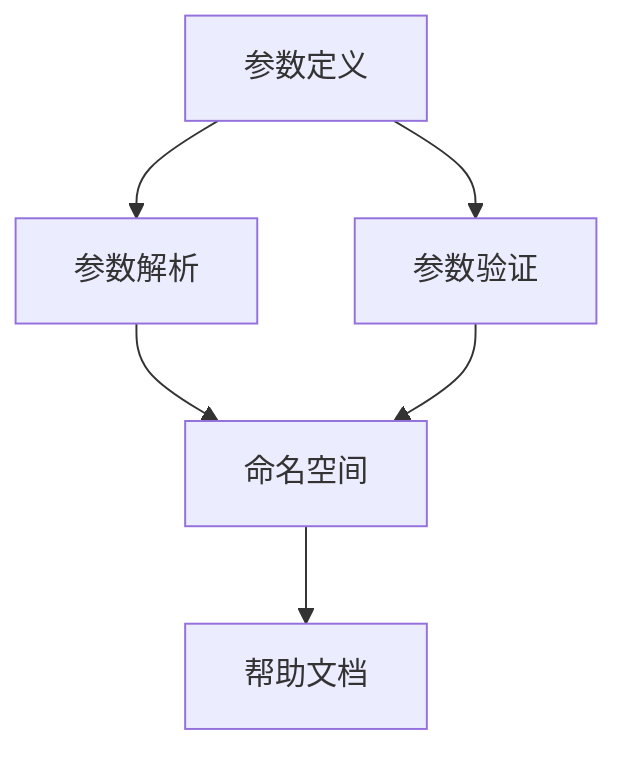

                 

# 参数解析器（ArgParser）模块

> 关键词：参数解析器, 命令行参数, 命令行工具, Python, 程序开发, 数据科学, 编程语言

## 1. 背景介绍

在现代软件开发中，命令行参数解析器（通常称为ArgParser）是必不可少的一部分。无论是在数据科学、机器学习、Web开发还是系统管理等众多领域，几乎所有的程序都需要处理和解析命令行参数，以便从用户那里接收输入并执行特定的操作。然而，尽管命令行参数解析器非常重要，但如何有效地设计和实现它却是一个值得深入探讨的话题。

本文将深入探讨ArgParser的基本原理、实现步骤、优缺点、应用场景，并结合Python的argparse库，通过实际代码示例，详细介绍如何高效地开发和使用命令行参数解析器。此外，本文还将讨论ArgParser未来的发展趋势和面临的挑战，以期为开发者提供全面的指导。

## 2. 核心概念与联系

### 2.1 核心概念概述

ArgParser是一个用于解析和处理命令行参数的工具，它是现代编程语言中不可或缺的组成部分。在Python中，argparse库提供了强大的命令行参数解析功能，能够帮助开发者快速、灵活地处理命令行参数。通过argparse，开发者可以轻松地定义、解析和验证命令行参数，从而实现程序的自动化和可扩展性。

具体来说，ArgParser负责以下几个关键任务：

- **参数定义**：允许开发者定义和描述命令行参数的含义和类型。
- **参数解析**：将命令行参数解析为Python对象，供程序使用。
- **参数验证**：确保参数符合预定义的规则和类型。
- **帮助文档生成**：自动生成详细的命令行帮助文档，方便用户使用。

这些功能的实现依赖于几个关键概念：

- **参数**：命令行参数是用户在执行程序时传递给程序的输入信息。
- **类型**：命令行参数的类型可以是字符串、整数、浮点数等。
- **默认值**：命令行参数可以具有默认值，当用户未提供该参数时，程序将使用默认值。
- **选项**：命令行参数可以是一个选项（Option），它通常以短横线（-）或双横线（--）开头。
- **命名空间（Namespace）**：命令行参数解析后的结果将被存储在一个命名空间中，供程序使用。

### 2.2 核心概念之间的关系

以下是一个简单的Mermaid流程图，展示了ArgParser的各个概念之间的关系：



这个流程图展示了ArgParser从参数定义到参数解析、验证、生成帮助文档的完整流程。

## 3. 核心算法原理 & 具体操作步骤

### 3.1 算法原理概述

ArgParser的算法原理主要基于以下两个步骤：

1. **参数定义**：开发者通过argparse库中的函数和类定义命令行参数，包括参数的名称、类型、默认值、选项等。这些定义将用于创建参数对象，这些对象包含了参数的元数据。
2. **参数解析**：当程序接收到命令行参数时，ArgParser将使用这些定义来解析和验证这些参数，并将它们转换为Python对象。

### 3.2 算法步骤详解

下面是一个详细的算法步骤清单，展示了如何使用argparse库创建和解析命令行参数：

1. **导入argparse库**：首先，需要在程序中导入argparse库。

2. **创建ArgumentParser对象**：使用argparse.ArgumentParser()函数创建一个ArgumentParser对象。

3. **添加参数**：使用ArgumentParser.add_argument()函数向ArgumentParser对象添加命令行参数。这个函数接受多个参数，包括参数的名称、类型、默认值、选项等。

4. **解析命令行参数**：在程序中，使用ArgumentParser.parse_args()函数解析命令行参数，并将它们转换为Python对象。这个函数将根据之前的参数定义来解析和验证命令行参数。

5. **访问参数**：解析后的参数将被存储在ArgumentParser对象中，可以通过访问这个对象来获取参数值。

### 3.3 算法优缺点

ArgParser的优点包括：

- **易用性**：argparse库提供了丰富的API，使得开发者可以轻松地定义、解析和验证命令行参数。
- **灵活性**：argparse库支持多种参数类型和选项，可以满足不同的需求。
- **可扩展性**：argparse库可以轻松地扩展，以满足不断变化的需求。

ArgParser的缺点包括：

- **复杂性**：对于复杂的命令行参数结构，开发者需要花费额外的时间和精力来定义和管理这些参数。
- **学习曲线**：对于新手开发者，argparse库的学习曲线可能比较陡峭。

### 3.4 算法应用领域

ArgParser广泛应用于各种编程语言和开发领域，包括：

- **数据科学**：在数据科学领域，ArgParser可以帮助数据科学家轻松地处理命令行参数，从而进行数据分析和建模。
- **机器学习**：在机器学习领域，ArgParser可以用于处理命令行参数，如超参数、数据路径等。
- **Web开发**：在Web开发中，ArgParser可以用于处理命令行参数，如数据库连接参数、API路径等。
- **系统管理**：在系统管理中，ArgParser可以用于处理命令行参数，如服务启动参数、日志配置等。

## 4. 数学模型和公式 & 详细讲解  
### 4.1 数学模型构建

在ArgParser中，参数的解析和验证过程可以通过数学模型来描述。假设我们有一个命令行参数x，其类型为整数，默认值为1。我们可以将这个参数的定义表示为一个数学模型：

$$
x = \begin{cases}
1, & \text{if user did not provide x} \\
\text{argparse对象解析的x}, & \text{otherwise}
\end{cases}
$$

这个模型描述了命令行参数x的解析和验证过程。如果用户没有提供参数x，则使用默认值1；否则，使用argparse对象解析的x。

### 4.2 公式推导过程

假设我们有两个命令行参数x和y，其类型均为整数。我们可以将这两个参数的解析和验证过程表示为一个数学模型：

$$
(x, y) = \begin{cases}
(1, 1), & \text{if user did not provide x or y} \\
(\text{argparse对象解析的x}, \text{argparse对象解析的y}), & \text{otherwise}
\end{cases}
$$

这个模型描述了命令行参数x和y的解析和验证过程。如果用户没有提供参数x或y，则使用默认值1；否则，使用argparse对象解析的x和y。

### 4.3 案例分析与讲解

假设我们有一个简单的Python程序，用于计算两个整数的和。该程序使用argparse库定义命令行参数，代码如下：

```python
import argparse

def main():
    parser = argparse.ArgumentParser()
    parser.add_argument('--num1', type=int, default=1)
    parser.add_argument('--num2', type=int, default=1)
    args = parser.parse_args()
    result = args.num1 + args.num2
    print(result)

if __name__ == '__main__':
    main()
```

在这个程序中，我们使用argparse库定义了两个整数参数num1和num2，并使用它们的和作为输出。如果用户没有提供参数num1或num2，则使用默认值1。程序代码如下所示：

```python
import argparse

def main():
    parser = argparse.ArgumentParser()
    parser.add_argument('--num1', type=int, default=1)
    parser.add_argument('--num2', type=int, default=1)
    args = parser.parse_args()
    result = args.num1 + args.num2
    print(result)

if __name__ == '__main__':
    main()
```

在这个程序中，我们首先创建一个ArgumentParser对象。然后，我们使用add_argument()函数向ArgumentParser对象添加两个命令行参数num1和num2。这两个参数的类型均为整数，默认值为1。最后，我们使用parse_args()函数解析命令行参数，并将它们转换为Python对象。程序将输出这两个参数的和。

## 5. 项目实践：代码实例和详细解释说明

### 5.1 开发环境搭建

要在Python中使用argparse库，首先需要安装Python环境。安装步骤如下：

1. 下载并安装Python。
2. 打开命令行终端。
3. 运行pip install argparse命令，安装argparse库。

安装完成后，就可以开始编写和使用argparse库了。

### 5.2 源代码详细实现

下面是一个使用argparse库的完整代码示例，用于计算两个整数的和：

```python
import argparse

def main():
    parser = argparse.ArgumentParser()
    parser.add_argument('--num1', type=int, default=1)
    parser.add_argument('--num2', type=int, default=1)
    args = parser.parse_args()
    result = args.num1 + args.num2
    print(result)

if __name__ == '__main__':
    main()
```

在这个程序中，我们首先创建一个ArgumentParser对象。然后，我们使用add_argument()函数向ArgumentParser对象添加两个命令行参数num1和num2。这两个参数的类型均为整数，默认值为1。最后，我们使用parse_args()函数解析命令行参数，并将它们转换为Python对象。程序将输出这两个参数的和。

### 5.3 代码解读与分析

我们可以逐步解读上面的代码：

```python
import argparse
```

首先，我们使用argparse库，导入ArgumentParser类。

```python
def main():
```

然后，我们定义一个名为main()的函数，用于执行程序。

```python
parser = argparse.ArgumentParser()
```

接下来，我们创建一个ArgumentParser对象。

```python
parser.add_argument('--num1', type=int, default=1)
```

然后，我们使用add_argument()函数向ArgumentParser对象添加第一个命令行参数num1。这个参数的类型为整数，默认值为1。

```python
parser.add_argument('--num2', type=int, default=1)
```

接着，我们使用add_argument()函数向ArgumentParser对象添加第二个命令行参数num2。这个参数的类型为整数，默认值为1。

```python
args = parser.parse_args()
```

然后，我们使用parse_args()函数解析命令行参数，并将它们转换为Python对象。

```python
result = args.num1 + args.num2
```

最后，我们将两个参数的和赋值给变量result，并输出结果。

### 5.4 运行结果展示

假设我们运行上面的程序，并使用命令行参数--num1 2 --num2 3，输出如下：

```
5
```

这个输出表明，程序成功解析了命令行参数，并计算了两个整数的和。

## 6. 实际应用场景

ArgParser在实际应用场景中具有广泛的应用，以下是一些典型的应用场景：

### 6.1 数据科学

在数据科学中，ArgParser可以帮助数据科学家轻松地处理命令行参数，如数据路径、数据类型等。例如，以下代码可以读取一个CSV文件：

```python
import argparse

def main():
    parser = argparse.ArgumentParser()
    parser.add_argument('--data', type=str, default='data.csv')
    args = parser.parse_args()
    data = pd.read_csv(args.data)
    print(data)

if __name__ == '__main__':
    main()
```

### 6.2 机器学习

在机器学习中，ArgParser可以用于处理命令行参数，如模型路径、训练集路径、验证集路径等。例如，以下代码可以训练一个简单的线性回归模型：

```python
import argparse
import pandas as pd
from sklearn.linear_model import LinearRegression

def main():
    parser = argparse.ArgumentParser()
    parser.add_argument('--data', type=str, default='data.csv')
    parser.add_argument('--model', type=str, default='model.pkl')
    parser.add_argument('--train', type=str, default='train.csv')
    parser.add_argument('--validate', type=str, default='validate.csv')
    args = parser.parse_args()
    data = pd.read_csv(args.data)
    X = data.iloc[:, :-1]
    y = data.iloc[:, -1]
    train_data = pd.read_csv(args.train)
    validate_data = pd.read_csv(args.validate)
    model = LinearRegression()
    model.fit(X, y)
    model.save(args.model)

if __name__ == '__main__':
    main()
```

### 6.3 Web开发

在Web开发中，ArgParser可以用于处理命令行参数，如数据库连接参数、API路径等。例如，以下代码可以查询MySQL数据库：

```python
import argparse
import mysql.connector

def main():
    parser = argparse.ArgumentParser()
    parser.add_argument('--host', type=str, default='localhost')
    parser.add_argument('--user', type=str, default='root')
    parser.add_argument('--password', type=str, default='')
    parser.add_argument('--database', type=str, default='')
    args = parser.parse_args()
    conn = mysql.connector.connect(host=args.host, user=args.user, password=args.password, database=args.database)
    cursor = conn.cursor()
    cursor.execute('SELECT * FROM users')
    result = cursor.fetchall()
    print(result)

if __name__ == '__main__':
    main()
```

### 6.4 系统管理

在系统管理中，ArgParser可以用于处理命令行参数，如服务启动参数、日志配置等。例如，以下代码可以启动一个简单的Web服务器：

```python
import argparse

def main():
    parser = argparse.ArgumentParser()
    parser.add_argument('--host', type=str, default='localhost')
    parser.add_argument('--port', type=int, default=5000)
    parser.add_argument('--log', type=str, default='logs/app.log')
    args = parser.parse_args()
    host = args.host
    port = args.port
    log_file = args.log
    print(f'Starting web server at {host}:{port}, log file: {log_file}')

if __name__ == '__main__':
    main()
```

## 7. 工具和资源推荐

### 7.1 学习资源推荐

为了帮助开发者系统掌握ArgParser的原理和实践技巧，这里推荐一些优质的学习资源：

1. Python官方文档：Python官方文档提供了argparse库的详细文档，是学习和使用argparse的必备资源。

2. 《Python命令行参数解析》教程：这是一份详细的ArgParser教程，适合初学者和进阶者学习。

3. Python ArgParse示例：这是一个包含大量实际示例的GitHub仓库，适合开发者参考和学习。

4. 《ArgParse实战》书籍：这本书介绍了ArgParse的全面用法，适合深入学习。

5. Udemy ArgParser课程：这是一门由Udemy提供的ArgParse在线课程，适合初学者学习。

通过对这些资源的学习实践，相信你一定能够快速掌握ArgParser的精髓，并用于解决实际的命令行参数问题。

### 7.2 开发工具推荐

高效的开发离不开优秀的工具支持。以下是几款用于ArgParser开发的常用工具：

1. PyCharm：PyCharm是一个流行的Python IDE，支持ArgParser的开发和调试。

2. Visual Studio Code：Visual Studio Code是一个轻量级的代码编辑器，支持ArgParser的开发和调试。

3. Sublime Text：Sublime Text是一个流行的代码编辑器，支持ArgParser的开发和调试。

4. Jupyter Notebook：Jupyter Notebook是一个交互式开发环境，支持ArgParser的开发和调试。

5. GitHub：GitHub是一个代码托管平台，支持ArgParser的协作开发和版本控制。

合理利用这些工具，可以显著提升ArgParser任务的开发效率，加快创新迭代的步伐。

### 7.3 相关论文推荐

ArgParser技术的发展源于学界的持续研究。以下是几篇奠基性的相关论文，推荐阅读：

1. "Argument Parsing in Python"：这是一篇介绍ArgParser的论文，详细介绍了Python中的argparse库。

2. "Command Line Arguments Parsing with Python"：这是一篇介绍ArgParser的博客文章，适合初学者学习。

3. "The Power of Command Line Arguments"：这是一篇介绍ArgParser的论文，介绍了ArgParser的强大功能和应用。

4. "Parameterized Scripting in Python"：这是一篇介绍ArgParser的博客文章，介绍了Python中的参数化脚本。

5. "Python Command Line Arguments Best Practices"：这是一篇介绍ArgParser的博客文章，介绍了ArgParser的最佳实践。

这些论文代表了大语言模型微调技术的发展脉络。通过学习这些前沿成果，可以帮助研究者把握学科前进方向，激发更多的创新灵感。

除上述资源外，还有一些值得关注的前沿资源，帮助开发者紧跟ArgParser技术的最新进展，例如：

1. arXiv论文预印本：人工智能领域最新研究成果的发布平台，包括大量尚未发表的前沿工作，学习前沿技术的必读资源。

2. 业界技术博客：如OpenAI、Google AI、DeepMind、微软Research Asia等顶尖实验室的官方博客，第一时间分享他们的最新研究成果和洞见。

3. 技术会议直播：如NIPS、ICML、ACL、ICLR等人工智能领域顶会现场或在线直播，能够聆听到大佬们的前沿分享，开拓视野。

4. GitHub热门项目：在GitHub上Star、Fork数最多的ArgParser相关项目，往往代表了该技术领域的发展趋势和最佳实践，值得去学习和贡献。

5. 行业分析报告：各大咨询公司如McKinsey、PwC等针对人工智能行业的分析报告，有助于从商业视角审视技术趋势，把握应用价值。

总之，对于ArgParser技术的学习和实践，需要开发者保持开放的心态和持续学习的意愿。多关注前沿资讯，多动手实践，多思考总结，必将收获满满的成长收益。

## 8. 总结：未来发展趋势与挑战

### 8.1 研究成果总结

ArgParser作为现代编程语言中的重要组成部分，其研究和应用已经取得了丰硕的成果。argparse库在Python社区中被广泛应用，极大地简化了命令行参数的处理。开发者可以根据自己的需求定义和解析命令行参数，从而实现程序的自动化和可扩展性。

### 8.2 未来发展趋势

展望未来，ArgParser技术将呈现以下几个发展趋势：

1. **易用性进一步提升**：ArgParser将继续朝着更易用的方向发展，提供更丰富的API和更友好的用户界面。

2. **功能更加丰富**：ArgParser将增加更多的功能，如类型检查、默认值计算、命名空间验证等，以满足更多的需求。

3. **性能持续优化**：ArgParser将继续优化其性能，提升解析和验证的速度，降低资源消耗。

4. **跨平台支持**：ArgParser将支持更多的操作系统和编程语言，成为跨平台的参数解析标准。

5. **社区和生态系统发展**：ArgParser将加强与Python社区和生态系统的合作，推动其在更多的领域和应用中得到广泛应用。

### 8.3 面临的挑战

尽管ArgParser技术已经取得了显著的进展，但在迈向更加智能化、普适化应用的过程中，它仍面临诸多挑战：

1. **复杂性管理**：随着命令行参数的复杂性增加，如何管理和维护这些参数，将是一个重要的问题。

2. **学习曲线**：对于新手开发者，ArgParser的学习曲线可能仍然比较陡峭，需要更多教育和培训资源。

3. **兼容性问题**：不同版本的Python和操作系统可能存在兼容性问题，需要进一步优化和测试。

4. **安全性问题**：命令行参数解析器需要处理用户输入，可能会存在安全漏洞，需要进行严格的安全检查和防御。

5. **性能优化**：对于大型的程序，命令行参数解析器需要处理大量的输入数据，性能优化是一个重要的研究方向。

### 8.4 研究展望

为了应对这些挑战，未来的ArgParser研究需要在以下几个方面寻求新的突破：

1. **易用性提升**：进一步优化API和用户界面，降低学习曲线，使开发者能够更轻松地使用ArgParser。

2. **功能丰富化**：增加更多的功能，如类型检查、默认值计算、命名空间验证等，提高参数解析的准确性和可靠性。

3. **跨平台支持**：加强与Python社区和生态系统的合作，推动ArgParser成为跨平台的参数解析标准。

4. **性能优化**：进一步优化ArgParser的性能，提升解析和验证的速度，降低资源消耗。

5. **安全性增强**：加强对命令行参数的安全检查和防御，确保程序的安全性和可靠性。

总之，ArgParser技术需要不断创新和优化，才能更好地适应未来的发展需求。通过积极应对挑战，不断追求卓越，ArgParser必将在未来的软件开发中发挥更大的作用。

## 9. 附录：常见问题与解答

**Q1：如何定义命令行参数？**

A: 使用argparse.ArgumentParser()函数创建一个ArgumentParser对象。然后，使用ArgumentParser.add_argument()函数向ArgumentParser对象添加命令行参数。例如：

```python
parser = argparse.ArgumentParser()
parser.add_argument('--num1', type=int, default=1)
```

**Q2：如何解析命令行参数？**

A: 使用ArgumentParser.parse_args()函数解析命令行参数。例如：

```python
args = parser.parse_args()
```

**Q3：如何访问解析后的命令行参数？**

A: 解析后的命令行参数将被存储在ArgumentParser对象中，可以通过访问ArgumentParser对象来获取参数值。例如：

```python
args.num1
```

**Q4：如何处理命令行参数的默认值？**

A: 命令行参数可以具有默认值，当用户未提供该参数时，程序将使用默认值。例如：

```python
parser.add_argument('--num1', type=int, default=1)
```

**Q5：如何在命令行参数中添加选项？**

A: 命令行参数可以是一个选项（Option），它通常以短横线（-）或双横线（--）开头。例如：

```python
parser.add_argument('--num1', type=int, default=1)
parser.add_argument('--num2', type=int, default=1)
```

以上问答提供了关于ArgParser的基本知识，帮助开发者更好地理解和应用这一重要工具。通过深入学习和实践，开发者可以更高效地开发命令行参数解析器，提升程序的自动化和可扩展性。

---

作者：禅与计算机程序设计艺术 / Zen and the Art of Computer Programming

