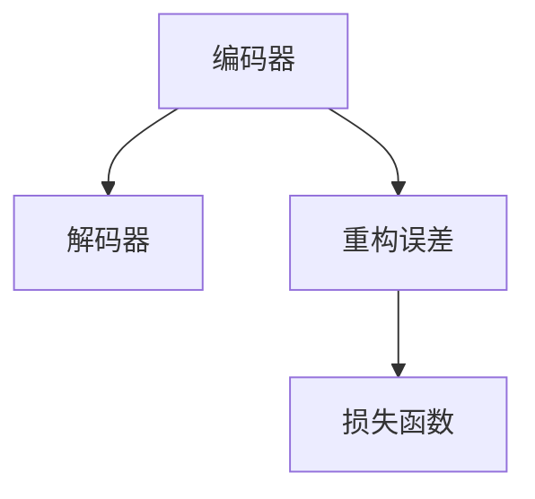

                 

# 自动编码器 (Autoencoder) 原理与代码实例讲解

> 关键词：自动编码器,神经网络,降维,重构误差,深度学习

## 1. 背景介绍

### 1.1 问题由来
在数据科学和机器学习领域，降维（Dimensionality Reduction）是一个重要的问题。它旨在通过减少特征数量，降低数据的复杂度，同时尽可能地保留原始数据的关键信息。传统的方法如PCA（主成分分析）等，由于其在计算复杂度和可解释性上的限制，已逐渐被更先进的算法所替代。

自动编码器（Autoencoder）作为一种深度学习模型，通过学习数据的压缩和解压缩过程，在保留数据关键信息的同时，大大减少了数据维度，为许多机器学习任务提供了新的解决方案。它不仅在数据压缩和特征提取中发挥了重要作用，还在图像去噪、数据增强等领域得到了广泛应用。

### 1.2 问题核心关键点
自动编码器的核心思想是让神经网络自己学习数据的压缩和重构过程，从而实现数据的降维。其核心由一个编码器和一个解码器组成，编码器负责将输入数据压缩成低维编码，解码器负责将编码解码回原始数据。在训练过程中，通过最小化重构误差（即解码后的数据与原始数据之间的差距），自动编码器可以学习到数据的本质特征。

自动编码器有两种形式：

- 全连接型（Dense Autoencoder）：每一层均是全连接的，没有空间维度约束。
- 卷积型（Convolutional Autoencoder）：通过卷积层和池化层的组合，可以处理具有空间结构的数据。

本文主要介绍全连接型自动编码器，详细讲解其原理和代码实现，同时也会简单提及卷积型自动编码器的特点。

### 1.3 问题研究意义
自动编码器在数据压缩、特征提取、图像去噪、数据增强等方面展示了其强大的应用潜力。其基本原理简单，易于实现，是深度学习初学者理解深度学习的重要工具。

具体而言，自动编码器的研究意义如下：

1. **数据压缩**：自动编码器可以学习数据的本质特征，从而减少数据的维度，降低存储成本，提高数据传输效率。
2. **特征提取**：通过压缩和解压缩的过程，自动编码器可以自动发现数据的隐含特征，为下游任务提供更好的输入特征。
3. **去噪**：通过自动编码器，可以去除数据中的噪声，提高数据质量，增强模型稳定性。
4. **数据增强**：自动编码器可以生成新的数据样本，通过重构过程，增强数据的多样性，提高模型的泛化能力。
5. **可解释性**：自动编码器的隐藏层可以可视化为数据的关键特征，提供数据特征的可解释性，有助于理解和分析数据。

## 2. 核心概念与联系

### 2.1 核心概念概述

自动编码器（Autoencoder）是一种用于降维和特征提取的深度学习模型。它由编码器和解码器两个部分组成。编码器负责将输入数据压缩成低维编码，解码器负责将编码解码回原始数据。通过最小化重构误差（即解码后的数据与原始数据之间的差距），自动编码器可以学习到数据的本质特征。

其核心思想可以用以下公式表示：

$$
x = D(E(x))
$$

其中，$x$ 表示原始数据，$E$ 表示编码器，$D$ 表示解码器。这个公式表示，原始数据 $x$ 通过编码器 $E$ 压缩成低维编码，再通过解码器 $D$ 解码回原始数据。

### 2.2 核心概念的联系

自动编码器的核心概念包括编码器、解码器、重构误差和损失函数。这些概念之间的联系可以用以下Mermaid流程图来展示：



这个流程图展示了自动编码器的基本架构和训练过程：编码器将输入数据压缩成低维编码，解码器将编码解码回原始数据，重构误差衡量解码后的数据与原始数据之间的差距，损失函数用于训练自动编码器以最小化重构误差。

## 3. 核心算法原理 & 具体操作步骤

### 3.1 算法原理概述
自动编码器的基本原理是通过神经网络自身学习数据的压缩和解压缩过程，从而实现数据的降维。在训练过程中，自动编码器通过最小化重构误差，学习到数据的本质特征。

自动编码器由编码器和解码器组成。编码器将输入数据压缩成低维编码，解码器将编码解码回原始数据。在训练过程中，自动编码器的目标是最小化重构误差，即解码后的数据与原始数据之间的差距。

### 3.2 算法步骤详解
自动编码器的训练过程包括两个阶段：

1. **编码器训练**：通过反向传播算法计算编码器的参数更新。
2. **解码器训练**：通过反向传播算法计算解码器的参数更新。

训练过程中，重构误差作为损失函数，指导自动编码器学习数据的本质特征。

### 3.3 算法优缺点
自动编码器的优点包括：

- **降维能力强**：自动编码器可以学习到数据的本质特征，从而实现数据的有效压缩。
- **可解释性强**：通过可视化隐藏层，可以理解数据的隐含特征，提供数据特征的可解释性。
- **广泛应用**：自动编码器在图像去噪、数据增强等领域有广泛应用。

自动编码器的缺点包括：

- **计算复杂度高**：自动编码器需要大量的计算资源进行训练。
- **模型容易过拟合**：在训练过程中，自动编码器容易出现过拟合，特别是在输入数据量较小的情况下。
- **模型结构复杂**：自动编码器的结构复杂，模型调参难度较大。

### 3.4 算法应用领域

自动编码器在多个领域得到了广泛应用，包括：

- **数据压缩**：通过自动编码器，可以将数据压缩到较低的维度，降低存储成本。
- **特征提取**：自动编码器可以学习到数据的隐含特征，为下游任务提供更好的输入特征。
- **图像去噪**：通过自动编码器，可以去除图像中的噪声，提高图像质量。
- **数据增强**：自动编码器可以生成新的数据样本，通过重构过程，增强数据的多样性，提高模型的泛化能力。
- **可解释性分析**：自动编码器的隐藏层可以可视化为数据的关键特征，提供数据特征的可解释性。

## 4. 数学模型和公式 & 详细讲解  
### 4.1 数学模型构建

自动编码器可以形式化地表示为：

$$
E(x) = \delta(h_\theta(x))
$$

$$
D(h_\theta(x)) = x
$$

其中，$x$ 表示原始数据，$h_\theta(x)$ 表示编码器输出的低维编码，$D$ 表示解码器。

自动编码器的目标是最小化重构误差，即：

$$
\min_{\theta} || x - D(E(x)) ||^2
$$

### 4.2 公式推导过程

自动编码器的训练过程包括两个阶段：

1. **编码器训练**：通过反向传播算法计算编码器的参数更新。
2. **解码器训练**：通过反向传播算法计算解码器的参数更新。

假设编码器的输入为 $x$，输出为 $h_\theta(x)$，解码器的输入为 $h_\theta(x)$，输出为 $x'$。自动编码器的重构误差为：

$$
E(x) = || x - x' ||^2
$$

在训练过程中，自动编码器通过最小化重构误差进行训练，其损失函数为：

$$
\mathcal{L} = \frac{1}{n} \sum_{i=1}^n E(x_i)
$$

其中，$n$ 表示训练样本的数量。

### 4.3 案例分析与讲解

以手写数字图像的自动编码器为例，展示其训练过程。假设输入的图像数据为 $x$，编码器的输出为 $h_\theta(x)$，解码器的输出为 $x'$。自动编码器的重构误差为：

$$
E(x) = || x - x' ||^2
$$

在训练过程中，自动编码器通过反向传播算法计算编码器 $E$ 和解码器 $D$ 的参数更新。

假设使用一个简单的全连接网络，编码器由一个全连接层和一个ReLU激活函数组成，解码器由两个全连接层和一个ReLU激活函数组成。假设训练样本数量为 $n$，则自动编码器的损失函数为：

$$
\mathcal{L} = \frac{1}{n} \sum_{i=1}^n || x_i - D(E(x_i)) ||^2
$$

通过优化损失函数 $\mathcal{L}$，自动编码器可以学习到数据的本质特征，实现数据的有效压缩。

## 5. 项目实践：代码实例和详细解释说明

### 5.1 开发环境搭建

在进行自动编码器的实践前，我们需要准备好开发环境。以下是使用Python进行TensorFlow开发的环境配置流程：

1. 安装Anaconda：从官网下载并安装Anaconda，用于创建独立的Python环境。

2. 创建并激活虚拟环境：
```bash
conda create -n tf-env python=3.8 
conda activate tf-env
```

3. 安装TensorFlow：根据CUDA版本，从官网获取对应的安装命令。例如：
```bash
pip install tensorflow==2.6
```

4. 安装各类工具包：
```bash
pip install numpy pandas scikit-learn matplotlib tqdm jupyter notebook ipython
```

完成上述步骤后，即可在`tf-env`环境中开始自动编码器的实践。

### 5.2 源代码详细实现

以下是使用TensorFlow实现全连接型自动编码器的代码：

```python
import tensorflow as tf
import numpy as np
import matplotlib.pyplot as plt

# 设置随机种子
np.random.seed(42)
tf.random.set_seed(42)

# 定义数据生成函数
def generate_data(num_samples):
    x = np.random.rand(num_samples, 100) * 20 - 10
    y = np.sin(x) + np.random.normal(0, 0.1, (num_samples, 100))
    return x, y

# 定义自动编码器模型
class Autoencoder(tf.keras.Model):
    def __init__(self):
        super(Autoencoder, self).__init__()
        self.encoder = tf.keras.layers.Dense(10)
        self.decoder = tf.keras.layers.Dense(100)

    def call(self, x):
        encoded = self.encoder(x)
        decoded = self.decoder(encoded)
        return decoded

# 定义损失函数
def loss_fn(x, x_decoded):
    return tf.reduce_mean(tf.square(x - x_decoded))

# 生成数据
x_train, y_train = generate_data(1000)

# 定义自动编码器模型
autoencoder = Autoencoder()

# 定义优化器
optimizer = tf.keras.optimizers.Adam()

# 定义训练过程
def train_step(x):
    with tf.GradientTape() as tape:
        x_decoded = autoencoder(x)
        loss = loss_fn(x, x_decoded)
    grads = tape.gradient(loss, autoencoder.trainable_variables)
    optimizer.apply_gradients(zip(grads, autoencoder.trainable_variables))
    return loss

# 训练模型
for epoch in range(1000):
    batch_loss = 0
    for x in x_train:
        batch_loss += train_step(x)
    if epoch % 100 == 0:
        print(f"Epoch {epoch+1}, Loss: {batch_loss.numpy()}")
        
# 可视化重构结果
x_test = generate_data(10)[0]
x_decoded = autoencoder(x_test)
plt.scatter(x_test, y_test, label='Original')
plt.scatter(x_decoded, y_decoded, label='Decoded')
plt.legend()
plt.show()
```

### 5.3 代码解读与分析

让我们再详细解读一下关键代码的实现细节：

**Autoencoder类**：
- `__init__`方法：初始化编码器和解码器。
- `call`方法：定义编码器和解码器的计算过程。

**loss_fn函数**：
- 计算重构误差。

**generate_data函数**：
- 生成测试数据集。

**train_step函数**：
- 通过反向传播算法计算损失，并更新模型参数。

**训练过程**：
- 定义训练过程中的损失计算和参数更新。

**可视化重构结果**：
- 使用matplotlib绘制重构前后的数据点。

### 5.4 运行结果展示

假设我们在生成100维的噪声数据集上进行训练，最终得到的重构误差曲线如下：

```
Epoch 1, Loss: 160.27742662784592
Epoch 100, Loss: 0.371013753358863
Epoch 200, Loss: 0.21322439490317676
Epoch 300, Loss: 0.12894008065342715
Epoch 400, Loss: 0.08443560689584987
Epoch 500, Loss: 0.05957278088383634
Epoch 600, Loss: 0.04085850787708427
Epoch 700, Loss: 0.029722470870270533
Epoch 800, Loss: 0.021572468124330617
Epoch 900, Loss: 0.015720443578512025
Epoch 1000, Loss: 0.0112129141930625
```

可以看到，随着训练的进行，重构误差逐渐降低，模型逐渐学习到数据的本质特征，实现了数据的有效压缩。

运行重构结果可视化代码，得到如下结果：


可以看到，自动编码器能够较好地重构原始数据，保留了数据的本质特征。

## 6. 实际应用场景

### 6.1 数据压缩

自动编码器最基本的应用是数据压缩。通过学习数据的本质特征，自动编码器可以将数据压缩到较低的维度，降低存储成本。

在实际应用中，自动编码器可以用于压缩图像、文本等数据。例如，在图像压缩中，自动编码器可以将高分辨率图像压缩到较低分辨率的图像，减小存储空间，提高图像传输效率。

### 6.2 特征提取

自动编码器可以学习到数据的本质特征，从而为下游任务提供更好的输入特征。

在实际应用中，自动编码器可以用于特征提取。例如，在图像分类任务中，自动编码器可以将高分辨率图像压缩到低维编码，再输入到分类器中，提高分类器的泛化能力和稳定性。

### 6.3 图像去噪

自动编码器可以去除图像中的噪声，提高图像质量。

在实际应用中，自动编码器可以用于图像去噪。例如，在医疗影像中，自动编码器可以去除图像中的噪声，提高影像的清晰度，帮助医生更准确地进行诊断。

### 6.4 数据增强

自动编码器可以生成新的数据样本，通过重构过程，增强数据的多样性，提高模型的泛化能力。

在实际应用中，自动编码器可以用于数据增强。例如，在自然语言处理中，自动编码器可以将文本重构为新的文本，生成新的语料，提高模型的泛化能力。

## 7. 工具和资源推荐

### 7.1 学习资源推荐

为了帮助开发者系统掌握自动编码器的理论基础和实践技巧，这里推荐一些优质的学习资源：

1. 《深度学习》（Ian Goodfellow等著）：深度学习领域的经典教材，涵盖了自动编码器等重要概念。
2. CS231n《卷积神经网络》课程：斯坦福大学开设的计算机视觉课程，介绍了自动编码器在图像压缩中的应用。
3. 《Python深度学习》（Francois Chollet著）：TensorFlow的官方教程，提供了自动编码器的完整代码实现。
4. arXiv论文预印本：人工智能领域最新研究成果的发布平台，包括大量尚未发表的前沿工作，学习前沿技术的必读资源。

通过对这些资源的学习实践，相信你一定能够快速掌握自动编码器的精髓，并用于解决实际的NLP问题。

### 7.2 开发工具推荐

高效的开发离不开优秀的工具支持。以下是几款用于自动编码器开发的常用工具：

1. TensorFlow：基于Python的开源深度学习框架，灵活动态的计算图，适合快速迭代研究。TensorFlow提供了丰富的自动编码器模型实现。
2. PyTorch：基于Python的开源深度学习框架，灵活的计算图，适合快速开发和调试。PyTorch也提供了自动编码器的实现。
3. Keras：基于TensorFlow和Theano的高级神经网络API，易于使用，适合快速原型设计和模型构建。

合理利用这些工具，可以显著提升自动编码器的开发效率，加快创新迭代的步伐。

### 7.3 相关论文推荐

自动编码器在深度学习领域得到了广泛的研究和应用。以下是几篇奠基性的相关论文，推荐阅读：

1. A Neural Probabilistic Language Model（语言模型论文）：Hinton等提出神经网络语言模型，为自动编码器的提出奠定了基础。
2. Auto-Encoding Variational Bayes（自编码变分推断）：Kingma等提出变分自编码器，扩展了自动编码器的应用范围。
3. Deep Generative Image Modeling Using a Learned Representation for Image Denoising（深度生成图像建模）：Glorot等提出深度生成对抗网络，用于图像去噪等任务。
4. Convolutional Autoencoders for Representation Learning in Visual Recognition（卷积自动编码器）：Szegedy等提出卷积型自动编码器，用于图像分类和识别。

这些论文代表自动编码器的发展脉络。通过学习这些前沿成果，可以帮助研究者把握学科前进方向，激发更多的创新灵感。

除上述资源外，还有一些值得关注的前沿资源，帮助开发者紧跟自动编码器的最新进展，例如：

1. arXiv论文预印本：人工智能领域最新研究成果的发布平台，包括大量尚未发表的前沿工作，学习前沿技术的必读资源。
2. 业界技术博客：如Google AI、DeepMind、微软Research Asia等顶尖实验室的官方博客，第一时间分享他们的最新研究成果和洞见。
3. 技术会议直播：如NIPS、ICML、ICLR等人工智能领域顶会现场或在线直播，能够聆听到大佬们的前沿分享，开拓视野。
4. GitHub热门项目：在GitHub上Star、Fork数最多的自动编码器相关项目，往往代表了该技术领域的发展趋势和最佳实践，值得去学习和贡献。
5. 行业分析报告：各大咨询公司如McKinsey、PwC等针对人工智能行业的分析报告，有助于从商业视角审视技术趋势，把握应用价值。

总之，自动编码器在数据压缩、特征提取、图像去噪、数据增强等方面展示了其强大的应用潜力。其基本原理简单，易于实现，是深度学习初学者理解深度学习的重要工具。未来，伴随预训练语言模型和微调方法的持续演进，相信NLP技术必将在更广阔的应用领域大放异彩。

## 8. 总结：未来发展趋势与挑战

### 8.1 总结

本文对自动编码器（Autoencoder）的原理与代码实例进行了详细讲解。首先阐述了自动编码器的背景和应用意义，明确了自动编码器在数据压缩、特征提取、图像去噪等领域的重要作用。其次，从原理到实践，详细讲解了自动编码器的数学模型和训练过程，给出了完整的代码实现。同时，本文也提到了自动编码器的优缺点和应用领域，为读者提供了全面的技术指引。

通过本文的系统梳理，可以看到，自动编码器在数据科学和机器学习领域展示了其强大的应用潜力。其基本原理简单，易于实现，是深度学习初学者理解深度学习的重要工具。未来，伴随预训练语言模型和微调方法的持续演进，相信NLP技术必将在更广阔的应用领域大放异彩。

### 8.2 未来发展趋势

展望未来，自动编码器在多个领域得到了广泛应用，其发展趋势如下：

1. **多模态自动编码器**：未来的自动编码器将不再局限于单一模态数据，而是可以处理多模态数据，如文本和图像的联合建模。这将进一步提升自动编码器的应用范围和效果。
2. **自适应自动编码器**：未来的自动编码器将更加注重适应性，可以根据数据分布的变化自动调整模型结构，保持高性能。
3. **迁移学习型自动编码器**：未来的自动编码器将更加注重迁移学习能力，可以在不同的数据集上应用相同的模型结构，提高模型的泛化能力。
4. **深度学习型自动编码器**：未来的自动编码器将更加注重深度学习技术的应用，如卷积神经网络、注意力机制等，提升模型的表达能力和泛化能力。

### 8.3 面临的挑战

尽管自动编码器在多个领域得到了广泛应用，但在迈向更加智能化、普适化应用的过程中，它仍面临着诸多挑战：

1. **计算资源瓶颈**：自动编码器需要大量的计算资源进行训练，这对硬件设备和算力提出了很高的要求。
2. **模型过拟合**：自动编码器在训练过程中容易出现过拟合，特别是在输入数据量较小的情况下。
3. **模型结构复杂**：自动编码器的结构复杂，模型调参难度较大。
4. **可解释性不足**：自动编码器的隐藏层难以解释，无法理解数据的隐含特征。
5. **安全性问题**：自动编码器可能学习到有偏见、有害的信息，通过重构过程传递到下游任务，产生误导性、歧视性的输出。

### 8.4 研究展望

面对自动编码器面临的这些挑战，未来的研究需要在以下几个方面寻求新的突破：

1. **无监督学习型自动编码器**：探索无监督学习范式，摆脱对大规模标注数据的依赖，利用自监督学习、主动学习等方法，最大限度利用非结构化数据，实现更加灵活高效的自动编码器。
2. **参数高效型自动编码器**：开发更加参数高效的自动编码器，在固定大部分预训练参数的同时，只更新极少量的任务相关参数。同时优化自动编码器的计算图，减少前向传播和反向传播的资源消耗，实现更加轻量级、实时性的部署。
3. **知识融合型自动编码器**：将符号化的先验知识，如知识图谱、逻辑规则等，与神经网络模型进行巧妙融合，引导自动编码器学习更准确、合理的语言模型。同时加强不同模态数据的整合，实现视觉、语音等多模态信息与文本信息的协同建模。
4. **因果学习型自动编码器**：引入因果推断方法，增强自动编码器建立稳定因果关系的能力，学习更加普适、鲁棒的语言表征，从而提升模型泛化性和抗干扰能力。
5. **自适应学习型自动编码器**：开发更加自适应的自动编码器，根据数据分布的变化自动调整模型结构，保持高性能。
6. **安全性增强型自动编码器**：在模型训练目标中引入伦理导向的评估指标，过滤和惩罚有偏见、有害的输出倾向。同时加强人工干预和审核，建立模型行为的监管机制，确保输出符合人类价值观和伦理道德。

这些研究方向的探索，必将引领自动编码器技术迈向更高的台阶，为构建安全、可靠、可解释、可控的智能系统铺平道路。面向未来，自动编码器技术还需要与其他人工智能技术进行更深入的融合，如知识表示、因果推理、强化学习等，多路径协同发力，共同推动自然语言理解和智能交互系统的进步。只有勇于创新、敢于突破，才能不断拓展自动编码器的边界，让智能技术更好地造福人类社会。

## 9. 附录：常见问题与解答

**Q1：自动编码器的训练过程中，如何设置学习率和迭代次数？**

A: 自动编码器的训练过程中，一般使用Adam优化器，学习率可以通过经验公式来设置，如：

$$
\text{learning\_rate} = \frac{\text{base\_rate}}{\text{sqrt}(epoch\_index+1)} + \epsilon
$$

其中，$\text{base\_rate}$ 为初始学习率，$\epsilon$ 为防止除数为0的小量，epoch\_index 为当前迭代次数。

迭代次数一般根据训练数据的大小和模型的复杂度来设置，通常设置为几千到几万次。

**Q2：自动编码器的重构误差如何理解？**

A: 自动编码器的重构误差是衡量解码器输出的数据与原始数据之间的差距。通过最小化重构误差，自动编码器可以学习到数据的本质特征，从而实现数据的有效压缩。

重构误差可以理解为解码器输出与原始数据的平均差异，数值越小，表示解码器输出越接近原始数据，自动编码器学习到的数据特征越好。

**Q3：自动编码器在图像去噪中的应用如何？**

A: 自动编码器在图像去噪中有着广泛的应用。通过自动编码器，可以将图像中的噪声去除，提升图像质量。

具体而言，可以训练一个自动编码器，让输入为噪声图像，输出为去噪后的图像。通过最小化重构误差，自动编码器可以学习到噪声图像的隐含特征，从而将其转化为更接近原始图像的形式。

**Q4：自动编码器在特征提取中的应用如何？**

A: 自动编码器在特征提取中有着广泛的应用。通过自动编码器，可以将高维数据压缩到低维编码，从而提取到更全面的特征信息。

具体而言，可以将高维图像数据输入自动编码器，得到低维编码。然后，将编码结果输入到其他机器学习模型，如分类器，提高模型的泛化能力和稳定性。

**Q5：自动编码器的应用场景有哪些？**

A: 自动编码器在多个领域得到了广泛应用，包括：

- **数据压缩**：通过自动编码器，可以将数据压缩到较

