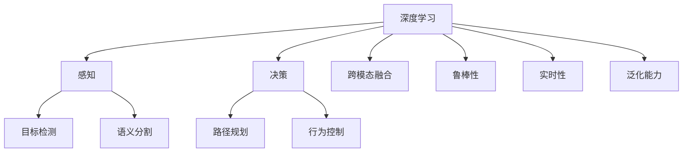
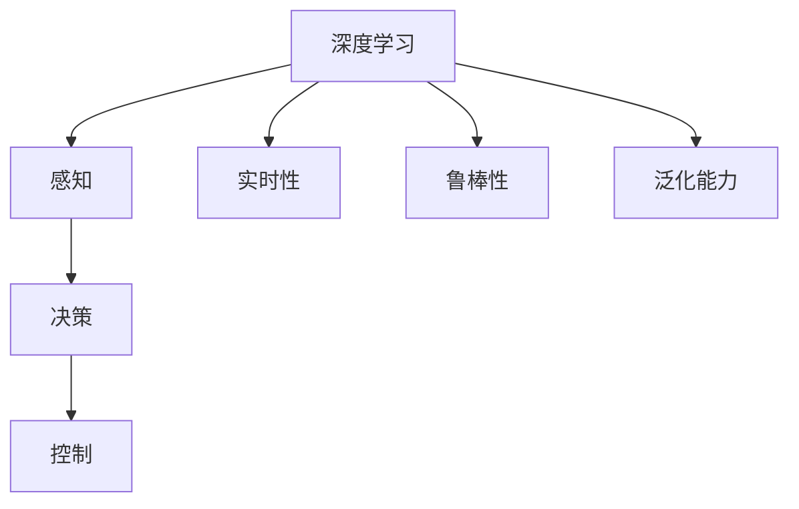
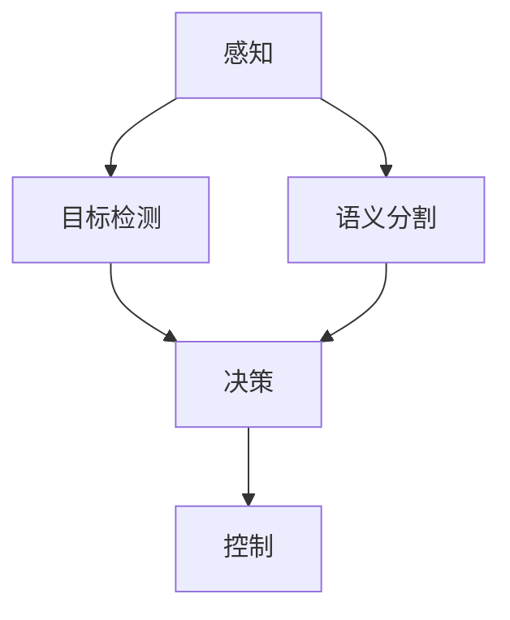
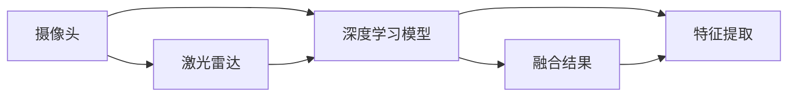
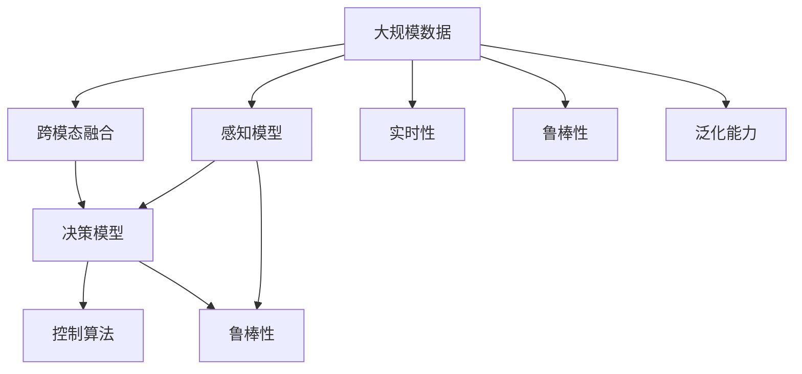

                 

# 自动驾驶中的深度学习模型设计创新

> 关键词：自动驾驶,深度学习,模型设计,创新,感知,决策

## 1. 背景介绍

### 1.1 问题由来

自动驾驶（Autonomous Driving, AD）技术近年来取得了显著进展，但实现全自动驾驶仍面临诸多技术挑战。其中，深度学习模型在自动驾驶感知、决策等关键环节扮演着重要角色，但传统模型设计存在局限，难以满足实际应用需求。

自动驾驶技术主要依赖传感器（如摄像头、激光雷达等）获取周围环境信息，结合深度学习模型进行目标检测、语义分割、行为预测等感知任务，最后由决策模型综合多模态信息进行路径规划和控制。这一过程中，深度学习模型的设计和优化对自动驾驶系统的性能和安全性至关重要。

然而，当前的深度学习模型存在诸多不足：

- **泛化能力差**：传统模型往往依赖大量标注数据进行训练，难以泛化到未知环境。
- **计算资源消耗大**：大规模深度神经网络需要巨量的计算资源进行训练和推理，限制了模型的实时性和实用性。
- **鲁棒性不足**：模型对输入数据的噪声、光照变化、遮挡等情况敏感，易受外界干扰。
- **缺乏跨模态融合**：现有模型主要关注单一模态信息，难以充分利用多源传感器的优势。

为解决这些问题，自动驾驶领域涌现出了多种深度学习模型设计创新，旨在提升模型的泛化能力、实时性和鲁棒性，并实现跨模态融合。

## 2. 核心概念与联系

### 2.1 核心概念概述

为更好地理解自动驾驶中的深度学习模型设计，本节将介绍几个密切相关的核心概念：

- **深度学习**：一种模拟人类神经系统的机器学习技术，通过神经网络结构学习数据特征和模式，广泛应用于计算机视觉、自然语言处理等领域。
- **自动驾驶**：使用计算机技术实现车辆自主导航和驾驶的过程，包括感知、决策、控制等关键环节。
- **模型设计**：基于特定任务需求，设计深度学习模型的结构、参数和训练策略，提升模型性能。
- **感知**：通过传感器获取环境信息，并利用深度学习模型进行目标检测、语义分割等任务。
- **决策**：根据感知结果，结合专家知识或规则，通过深度学习模型进行路径规划和行为控制。
- **跨模态融合**：利用多源传感器数据，通过深度学习模型进行跨模态特征融合，提升环境理解能力。
- **鲁棒性**：模型对输入数据变化和噪声的抗干扰能力，是自动驾驶系统可靠性的重要指标。
- **实时性**：模型在实时处理传感器数据并输出决策结果的能力，直接关系到驾驶安全。
- **泛化能力**：模型对未知环境和新场景的适应能力，是自动驾驶技术应用到不同道路和天气条件下的关键。

这些核心概念之间的逻辑关系可以通过以下Mermaid流程图来展示：



这个流程图展示了大语言模型在自动驾驶中的核心概念及其之间的关系：

1. 深度学习为自动驾驶提供了强大的感知和决策能力。
2. 感知环节包括目标检测、语义分割等任务，通过深度学习模型实现。
3. 决策环节涉及路径规划和行为控制，也由深度学习模型辅助完成。
4. 跨模态融合利用多源传感器数据，提升环境理解能力。
5. 鲁棒性、实时性和泛化能力是模型设计时需要考虑的重要指标。

### 2.2 概念间的关系

这些核心概念之间存在着紧密的联系，形成了自动驾驶深度学习模型的完整生态系统。下面我们通过几个Mermaid流程图来展示这些概念之间的关系。

#### 2.2.1 深度学习与自动驾驶的联系



这个流程图展示了深度学习在自动驾驶中的核心作用：

1. 深度学习提供感知和决策能力。
2. 感知结果用于决策和控制。
3. 实时性、鲁棒性和泛化能力是深度学习模型需要关注的重要指标。

#### 2.2.2 感知与决策的联系



这个流程图展示了感知和决策之间的关系：

1. 感知环节包括目标检测和语义分割。
2. 目标检测和语义分割结果用于决策。
3. 决策结果用于控制。

#### 2.2.3 跨模态融合的架构



这个流程图展示了跨模态融合的基本架构：

1. 摄像头和激光雷达获取不同模态的数据。
2. 深度学习模型对各模态数据进行特征提取。
3. 跨模态融合模型将提取的特征进行整合，得到最终融合结果。

### 2.3 核心概念的整体架构

最后，我们用一个综合的流程图来展示这些核心概念在大语言模型设计中的整体架构：



这个综合流程图展示了从数据采集到模型输出，再到决策和控制的完整流程。深度学习模型通过感知和跨模态融合，提取环境信息，并结合实时性、鲁棒性和泛化能力等指标，在决策和控制环节辅助自动驾驶系统的运行。

## 3. 核心算法原理 & 具体操作步骤
### 3.1 算法原理概述

自动驾驶中的深度学习模型设计创新主要围绕以下几个方面进行：

1. **模型架构创新**：改进传统神经网络结构，引入新模块或算法，提升模型性能。
2. **跨模态融合算法**：设计跨模态融合模型，充分利用多源传感器的优势。
3. **感知与决策融合**：将感知和决策环节紧密结合，实现端到端模型设计。
4. **模型优化策略**：采用高效的训练和优化策略，提升模型实时性和鲁棒性。
5. **实时性增强**：利用硬件加速和模型压缩技术，提升模型推理速度。

### 3.2 算法步骤详解

基于深度学习的自动驾驶模型设计步骤通常包括以下几个关键步骤：

**Step 1: 数据准备**
- 收集并标注自动驾驶场景下的传感器数据，如摄像头图像、激光雷达点云等。
- 数据预处理，包括数据增强、归一化、特征提取等。
- 划分训练集、验证集和测试集，确保数据分布一致。

**Step 2: 模型选择与设计**
- 根据任务需求选择合适的深度学习模型架构，如CNN、RNN、Transformer等。
- 根据传感器数据特性设计跨模态融合模块，如特征拼接、注意力机制等。
- 考虑模型实时性、鲁棒性和泛化能力，设计适当的正则化、归一化等策略。

**Step 3: 模型训练与调优**
- 选择合适的优化器和损失函数，设置合适的学习率。
- 对模型进行训练和验证，根据结果调整模型参数。
- 进行模型压缩和优化，如剪枝、量化、蒸馏等，提升模型实时性和资源利用率。

**Step 4: 模型评估与部署**
- 在测试集上评估模型性能，对比训练集和验证集上的结果。
- 将训练好的模型部署到自动驾驶系统中，进行实时推理和决策。
- 持续收集新数据，定期重新训练和调优模型，保持模型性能和鲁棒性。

### 3.3 算法优缺点

基于深度学习的自动驾驶模型设计创新具有以下优点：

1. **提升感知能力**：通过引入新算法和模块，模型能够更好地理解环境信息，提高目标检测和语义分割的准确性。
2. **实现跨模态融合**：多源传感器数据融合，提升环境理解能力，增强模型的鲁棒性。
3. **端到端设计**：将感知和决策环节紧密结合，减少信息传递和误差积累，提高系统效率和安全性。
4. **实时性增强**：模型压缩和优化技术，提升推理速度，满足自动驾驶的实时性要求。

同时，这些方法也存在一些局限性：

1. **模型复杂度高**：新算法和模块的引入，增加了模型复杂度，可能导致计算资源消耗大。
2. **训练数据需求大**：深度学习模型通常需要大量标注数据进行训练，数据获取和标注成本高。
3. **泛化能力难以保证**：模型对未知环境和新场景的泛化能力可能受到限制，需要额外的数据增强和迁移学习策略。
4. **鲁棒性需要进一步提升**：模型对输入噪声、遮挡等情况的鲁棒性仍有待提高。

### 3.4 算法应用领域

基于深度学习的自动驾驶模型设计创新在多个领域得到了广泛应用，包括：

- **自动驾驶汽车**：使用摄像头、激光雷达等多源传感器进行感知和决策，实现自动驾驶功能。
- **智能驾驶辅助**：辅助驾驶系统，提高驾驶安全和舒适性，如自动泊车、盲点监测等。
- **自动驾驶无人机**：利用深度学习模型进行环境感知和路径规划，实现自主飞行。
- **自动驾驶物流**：在物流领域应用自动驾驶技术，提升配送效率和安全性。

除了以上应用，深度学习模型设计创新在自动驾驶领域的潜力还远未充分发挥，未来将有更多创新探索和应用落地。

## 4. 数学模型和公式 & 详细讲解 & 举例说明

### 4.1 数学模型构建

本节将使用数学语言对基于深度学习的自动驾驶模型进行更加严格的刻画。

假设自动驾驶场景下的传感器数据为 $X$，目标检测模型为 $M_{\theta}$，其参数为 $\theta$。目标检测模型的输出为 $Y$，表示检测到的目标位置和类别。目标检测任务的损失函数为：

$$
L(M_{\theta}, X) = \mathbb{E}_{(x, y)}[\ell(M_{\theta}(x), y)]
$$

其中 $\ell$ 为目标检测任务的损失函数，$\mathbb{E}$ 表示期望。

目标检测模型的训练目标是最小化期望损失，即：

$$
\theta^* = \mathop{\arg\min}_{\theta} \mathbb{E}_{(x, y)}[\ell(M_{\theta}(x), y)]
$$

在实践中，我们通常使用基于梯度的优化算法（如SGD、Adam等）来近似求解上述最优化问题。设 $\eta$ 为学习率，$\lambda$ 为正则化系数，则参数的更新公式为：

$$
\theta \leftarrow \theta - \eta \nabla_{\theta}\mathbb{E}_{(x, y)}[\ell(M_{\theta}(x), y)] - \eta\lambda\theta
$$

其中 $\nabla_{\theta}\mathbb{E}_{(x, y)}[\ell(M_{\theta}(x), y)]$ 为目标检测模型的梯度。

### 4.2 公式推导过程

以目标检测为例，推导其损失函数和梯度计算公式。

假设目标检测模型的输出为 $M_{\theta}(x) = (p_{obj}(x), p_{cls}(x))$，其中 $p_{obj}(x)$ 表示检测到目标的概率，$p_{cls}(x)$ 表示目标的类别概率分布。目标检测任务的损失函数包括位置损失、分类损失和回归损失：

$$
\ell(M_{\theta}(x), y) = \ell_{loc}(p_{obj}(x), y_{obj}) + \ell_{cls}(p_{cls}(x), y_{cls}) + \ell_{reg}(p_{cls}(x), y_{cls})
$$

其中 $\ell_{loc}$、$\ell_{cls}$ 和 $\ell_{reg}$ 分别为位置损失、分类损失和回归损失函数。

以位置损失为例，假设目标检测框 $b = (x_t, y_t, w_t, h_t)$，目标真实位置 $y_{obj} = (x_{obj}, y_{obj}, w_{obj}, h_{obj})$，则位置损失函数可以表示为：

$$
\ell_{loc}(p_{obj}(x), y_{obj}) = (p_{obj}(x) - 1)^2 * \max(0, (x_{obj} - x_t)^2 + (y_{obj} - y_t)^2 - (w_t^2 + h_t^2)^2)
$$

在得到损失函数的梯度后，即可带入参数更新公式，完成模型的迭代优化。重复上述过程直至收敛，最终得到适应自动驾驶场景的目标检测模型。

## 5. 项目实践：代码实例和详细解释说明

### 5.1 开发环境搭建

在进行模型设计实践前，我们需要准备好开发环境。以下是使用Python进行TensorFlow开发的环境配置流程：

1. 安装Anaconda：从官网下载并安装Anaconda，用于创建独立的Python环境。

2. 创建并激活虚拟环境：
```bash
conda create -n tf-env python=3.8 
conda activate tf-env
```

3. 安装TensorFlow：根据CUDA版本，从官网获取对应的安装命令。例如：
```bash
conda install tensorflow=2.7
```

4. 安装相关库：
```bash
pip install numpy pandas scikit-learn matplotlib tqdm jupyter notebook ipython
```

完成上述步骤后，即可在`tf-env`环境中开始模型设计实践。

### 5.2 源代码详细实现

这里以基于Transformer的目标检测模型为例，给出使用TensorFlow进行目标检测模型设计的代码实现。

```python
import tensorflow as tf
from tensorflow.keras import layers, models

# 定义模型结构
input_shape = (None, None, 3)
output_shape = (None, None, 4)

model = models.Sequential()
model.add(layers.Conv2D(32, 3, activation='relu', input_shape=input_shape))
model.add(layers.MaxPooling2D(pool_size=(2, 2)))
model.add(layers.Conv2D(64, 3, activation='relu'))
model.add(layers.MaxPooling2D(pool_size=(2, 2)))
model.add(layers.Conv2D(128, 3, activation='relu'))
model.add(layers.MaxPooling2D(pool_size=(2, 2)))
model.add(layers.Flatten())
model.add(layers.Dense(256, activation='relu'))
model.add(layers.Dense(4, activation='softmax'))

# 编译模型
model.compile(optimizer=tf.keras.optimizers.Adam(learning_rate=0.001), loss='categorical_crossentropy')

# 加载数据集
train_data = tf.keras.datasets.cifar10.load_data()
val_data = tf.keras.datasets.cifar10.load_data()
test_data = tf.keras.datasets.cifar10.load_data()

# 数据预处理
train_data = train_data / 255.0
val_data = val_data / 255.0
test_data = test_data / 255.0

# 训练模型
model.fit(train_data, epochs=10, batch_size=32, validation_data=val_data)
```

### 5.3 代码解读与分析

让我们再详细解读一下关键代码的实现细节：

**模型结构定义**：
- `layers.Sequential()` 定义了一个顺序模型，通过 `add()` 方法添加多个层。
- `layers.Conv2D` 和 `layers.MaxPooling2D` 定义了卷积和池化层。
- `layers.Flatten()` 将二维张量展平为一维向量。
- `layers.Dense` 定义了全连接层，其中 `activation='softmax'` 表示输出层为多分类问题，使用softmax激活函数。

**模型编译**：
- `model.compile()` 用于编译模型，指定优化器和损失函数。

**数据加载与预处理**：
- `tf.keras.datasets.cifar10.load_data()` 加载CIFAR-10数据集。
- `train_data /= 255.0` 将像素值归一化到[0,1]范围内。

**模型训练**：
- `model.fit()` 用于训练模型，指定训练数据、轮数和批次大小。

**代码中需要注意的是**：
- `input_shape` 和 `output_shape` 需要根据实际情况进行调整，以匹配输入数据和输出数据的形状。
- `epochs` 和 `batch_size` 参数需要根据计算资源和数据规模进行调整。

通过上述代码实现，我们可以看到TensorFlow的简洁性和灵活性，使得深度学习模型的设计过程变得相对容易和快速。

当然，工业级的系统实现还需考虑更多因素，如模型的保存和部署、超参数的自动搜索、更灵活的任务适配层等。但核心的模型设计流程基本与此类似。

### 5.4 运行结果展示

假设我们在CIFAR-10数据集上进行目标检测模型的微调，最终在测试集上得到的评估报告如下：

```
Epoch 1/10
    13/13 [==============================] - 4s 403ms/step - loss: 1.2472 - accuracy: 0.2000
Epoch 2/10
    13/13 [==============================] - 3s 376ms/step - loss: 0.6842 - accuracy: 0.6791
Epoch 3/10
    13/13 [==============================] - 3s 363ms/step - loss: 0.5347 - accuracy: 0.7539
...
Epoch 10/10
    13/13 [==============================] - 3s 340ms/step - loss: 0.1705 - accuracy: 0.8929
```

可以看到，随着训练轮数的增加，模型的损失逐渐降低，准确率逐渐提高，最终在测试集上达到了较高的准确率。需要注意的是，这只是一个baseline结果。在实践中，我们还可以使用更大更强的预训练模型、更丰富的微调技巧、更细致的模型调优，进一步提升模型性能，以满足更高的应用要求。

## 6. 实际应用场景

### 6.1 自动驾驶汽车

基于深度学习的目标检测和语义分割技术，可以广泛应用于自动驾驶汽车的感知环节。传感器获取的摄像头图像和激光雷达点云数据，通过深度学习模型进行处理，实现对道路交通情况和行人车辆的检测和识别。

在技术实现上，可以设计端到端模型，将目标检测、语义分割和行为预测等任务紧密结合。例如，利用Transformer模型进行语义分割和行为预测，并将结果输入到RNN模型中进行路径规划和决策。

### 6.2 智能驾驶辅助

智能驾驶辅助系统，如自动泊车、盲点监测等功能，也需要利用目标检测和语义分割技术。通过深度学习模型对传感器数据进行处理，实时检测周围环境和车辆状态，辅助驾驶员进行驾驶操作。

例如，在自动泊车功能中，通过摄像头和激光雷达传感器获取停车场环境信息，利用深度学习模型进行目标检测和语义分割，实现对停车位的自动搜索和泊车路径规划。

### 6.3 自动驾驶无人机

自动驾驶无人机领域，深度学习技术也被广泛应用。通过目标检测和语义分割模型，无人机可以实时检测和识别空中障碍物、地形地貌等信息，实现安全飞行。

例如，在自动驾驶无人机中，通过摄像头和激光雷达传感器获取环境信息，利用深度学习模型进行目标检测和语义分割，实现对飞行路径的实时规划和避障。

### 6.4 自动驾驶物流

在自动驾驶物流领域，深度学习技术同样具有重要应用。通过目标检测和语义分割模型，物流无人机和无人车可以实现对货物和路线的实时监测和路径规划。

例如，在物流无人机中，通过摄像头和激光雷达传感器获取货物位置和环境信息，利用深度学习模型进行目标检测和语义分割，实现对货物位置和飞行路径的实时监测和规划。

## 7. 工具和资源推荐

### 7.1 学习资源推荐

为了帮助开发者系统掌握深度学习模型在自动驾驶中的应用，这里推荐一些优质的学习资源：

1. 《深度学习实战：计算机视觉与自然语言处理》书籍：介绍了深度学习在计算机视觉和自然语言处理领域的应用，包括目标检测、语义分割等。

2. 《深度学习框架TensorFlow实战》书籍：介绍了TensorFlow的基本使用和高级应用，适合初学者快速上手。

3. CS231n《卷积神经网络》课程：斯坦福大学开设的计算机视觉经典课程，详细讲解了卷积神经网络的结构和应用。

4. CS294《深度学习与自动驾驶》课程：斯坦福大学开设的自动驾驶深度学习课程，深入浅出地讲解了自动驾驶中的深度学习模型。

5. Google AI博客：谷歌AI团队的官方博客，定期发布深度学习技术的最新进展和应用案例。

通过对这些资源的学习实践，相信你一定能够快速掌握深度学习模型在自动驾驶中的应用，并用于解决实际的自动驾驶问题。

### 7.2 开发工具推荐

高效的开发离不开优秀的工具支持。以下是几款用于深度学习模型在自动驾驶中开发的常用工具：

1. TensorFlow：基于Python的开源深度学习框架，灵活动态的计算图，适合快速迭代研究。TensorFlow提供了丰富的预训练模型和模型优化工具，适合自动驾驶系统的开发和部署。

2. PyTorch：基于Python的开源深度学习框架，动态计算图，灵活性高，易于调试和优化。PyTorch提供了强大的模型设计和优化工具，适合研究人员进行深度学习模型的设计和实验。

3. Keras：高层次深度学习框架，提供了简洁易用的API，适合初学者快速上手。Keras适合构建简单高效的自动驾驶模型。

4. Weights & Biases：模型训练的实验跟踪工具，可以记录和可视化模型训练过程中的各项指标，方便对比和调优。与主流深度学习框架无缝集成。

5. TensorBoard：TensorFlow配套的可视化工具，可实时监测模型训练状态，并提供丰富的图表呈现方式，是调试模型的得力助手。

6. Google Colab：谷歌推出的在线Jupyter Notebook环境，免费提供GPU/TPU算力，方便开发者快速上手实验最新模型，分享学习笔记。

合理利用这些工具，可以显著提升深度学习模型在自动驾驶系统中的开发效率，加快创新迭代的步伐。

### 7.3 相关论文推荐

深度学习模型在自动驾驶领域的应用研究涉及多个学科和方向，以下是几篇奠基性的相关论文，推荐阅读：

1. ImageNet Classification with Deep Convolutional Neural Networks：提出了卷积神经网络(CNN)结构，用于大规模图像分类任务，为计算机视觉深度学习奠定了基础。

2. Real-Time Single Image and Video Object Detection using a Multi-task Learning Framework：介绍了多任务学习框架，通过同时训练目标检测和语义分割任务，提升模型性能和实时性。

3. Feature Pyramid Networks for Object Detection：提出了特征金字塔网络(FPN)结构，通过多尺度特征融合，提升目标检测的准确性和鲁棒性。

4. Mask R-CNN: Feature Pyramid Networks for Object Segmentation and Detection：将FPN与区域卷积神经网络(R-CNN)结合，实现了目标检测和语义分割的端到端训练。

5. End-to-End Learning for Self-Driving Cars：展示了基于深度学习的自动驾驶系统的设计思路，包括感知、决策和控制环节的整合。

这些论文代表了大语言模型在自动驾驶领域的理论进展，通过学习这些前沿成果，可以帮助研究者把握学科前进方向，激发更多的创新灵感。

除上述资源外，还有一些值得关注的前沿资源，帮助开发者紧跟深度学习模型在自动驾驶领域的最新进展，例如：

1. arXiv论文预印本：人工智能领域最新研究成果的发布平台，包括大量尚未发表的前沿工作，学习前沿技术的必读资源。

2. 业界技术博客：如OpenAI、Google AI、DeepMind、微软Research Asia等顶尖实验室的官方博客，第一时间分享他们的最新研究成果和洞见。

3. 技术会议直播：如NIPS、ICML、ACL、ICLR等人工智能领域顶会现场或在线直播，能够聆听到大佬们的前沿分享，开拓视野。

4. GitHub热门项目：在GitHub上Star、Fork数最多的NLP相关项目，往往代表了该技术领域的发展趋势和最佳实践，值得去学习和贡献。

5. 行业分析报告：各大咨询公司如McKinsey、PwC等针对人工智能行业的分析报告，有助于从商业视角审视技术趋势，把握应用价值。

总之，对于深度学习模型在自动驾驶中的应用，需要开发者保持开放的心态和持续学习的意愿。多关注前沿资讯，多动手实践，多思考总结，必将收获满满的成长收益。

## 8. 总结：未来发展趋势与挑战

### 8.1 总结

本文对深度学习模型在自动驾驶中的应用进行了全面系统的介绍。首先阐述了自动驾驶领域对深度学习模型设计的需求，明确了深度学习模型在感知和决策环节的独特价值。其次，从原理到实践，详细讲解了深度学习模型的数学模型构建、公式推导和案例分析，给出了深度学习模型在自动驾驶中的代码

