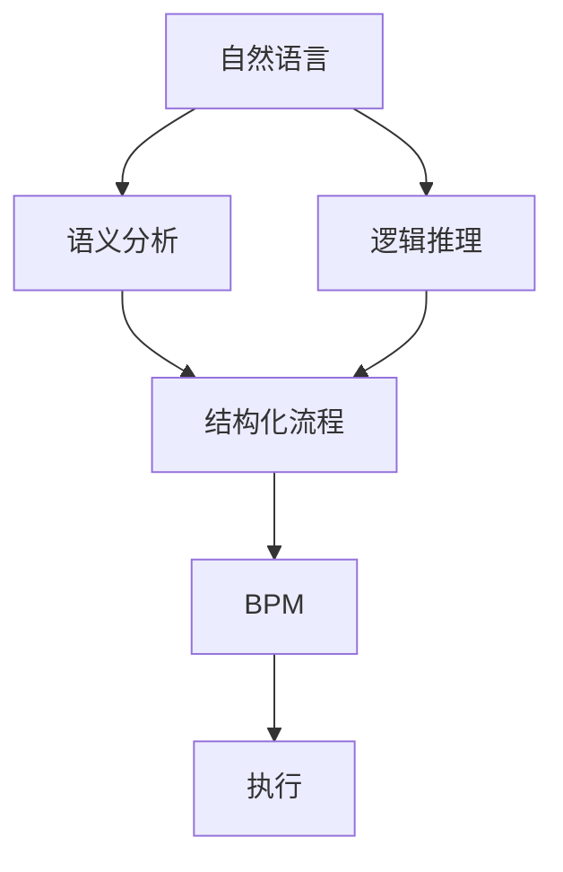
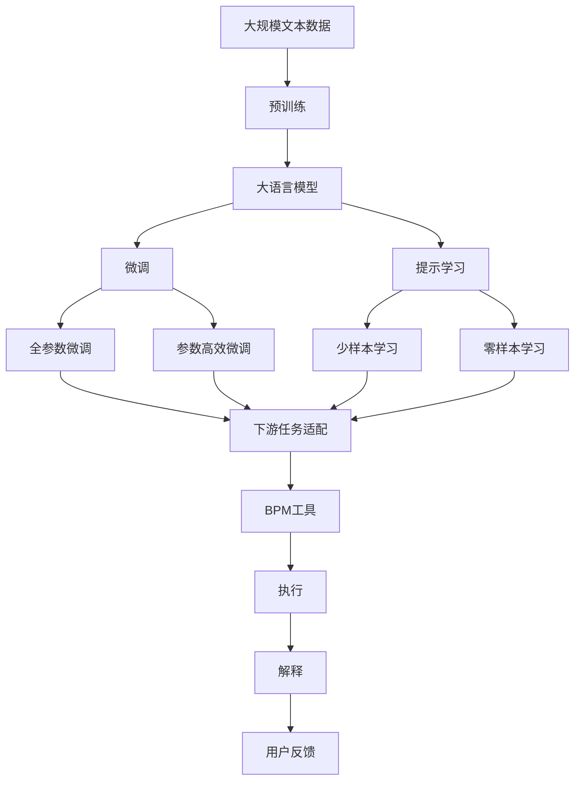

                 

# 自然语言辅助工作流程生成

## 1. 背景介绍

### 1.1 问题由来
在信息化时代，数字化办公已成为主流工作方式。然而，繁琐重复的手工操作仍占据了大量时间和精力。传统的工作流程自动化工具，如企业级ERP系统，往往需要耗费大量成本进行定制开发，且存在数据孤岛问题，难以灵活适应多变的业务场景。

随着自然语言处理（Natural Language Processing, NLP）技术的进步，利用自然语言生成（Natural Language Generation, NLG）技术实现工作流程自动化，变得愈发可行。通过自然语言描述，能够快速构建出业务流程，简化开发和维护成本。但直接生成工作流程的挑战在于，缺乏规范和逻辑的约束，生成的流程可能不正确、不合理。

为了提升自然语言生成工作流程的合理性、正确性，亟需一种机制来辅助理解和生成业务流程，这便引出了“自然语言辅助工作流程生成”的概念。

### 1.2 问题核心关键点
自然语言辅助工作流程生成的核心目标是，在自然语言描述的基础上，辅助系统生成合理的工作流程。核心问题包括：
1. 如何理解自然语言描述中的业务规则和逻辑关系。
2. 如何通过规则约束和逻辑推理，从自然语言描述中生成结构化的业务流程。
3. 如何整合多模态数据，增强自然语言描述的理解能力。
4. 如何适应多变的业务场景，提供个性化的工作流程生成。

针对这些问题，本文将探讨基于自然语言处理技术的辅助工作流程生成方法，包括理解自然语言、生成结构化流程、整合多模态数据等关键技术，并通过实际项目案例演示其应用效果。

## 2. 核心概念与联系

### 2.1 核心概念概述

为更好地理解自然语言辅助工作流程生成，本节将介绍几个密切相关的核心概念：

- **自然语言处理(NLP)**：利用计算机技术处理和分析自然语言，涉及词法分析、句法分析、语义分析、实体识别等。
- **自然语言生成(NLG)**：利用计算机技术自动生成符合自然语言规范的文本，涉及文本生成、对话生成、摘要生成等。
- **工作流程建模(BPM)**：描述业务流程的规则和逻辑，通过可视化工具构建、展示、优化和执行流程。
- **语义分析**：理解自然语言描述中的语义，抽取业务规则和逻辑关系。
- **逻辑推理**：根据规则和语义，从自然语言描述中推导出结构化的流程。
- **多模态数据融合**：将文本数据与其他数据（如图像、音频等）进行融合，增强自然语言理解能力。
- **模型可解释性**：提升自然语言辅助工作流程生成模型的可解释性，便于用户理解和调试。

这些概念之间具有紧密的联系，形成了自然语言辅助工作流程生成的完整生态系统。接下来，通过一个Mermaid流程图来展示这些概念之间的关系：



这个流程图展示了大语言模型微调过程中各个核心概念的关系：

1. 自然语言通过语义分析理解其含义。
2. 语义分析的结果结合逻辑推理生成结构化流程。
3. 结构化流程通过业务流程建模工具进一步建模和展示。
4. 最终生成的流程通过执行工具进行自动化执行。

### 2.2 概念间的关系

这些核心概念之间存在复杂的联系，形成了一个综合的生态系统。以下通过几个Mermaid流程图来展示这些概念之间的关系：

#### 2.2.1 自然语言理解与生成


这个流程图展示了自然语言理解与生成的关系：
1. 自然语言被语义分析模块理解。
2. 理解后的语义被用来生成结构化流程。
3. 结构化流程再通过自然语言生成模块转化为自然语言描述。

#### 2.2.2 多模态数据融合与语义分析


这个流程图展示了多模态数据融合与语义分析的关系：
1. 文本数据与其他模态数据（如图像、音频）融合。
2. 融合后的多模态数据被语义分析模块理解。
3. 理解后的语义被用来生成结构化流程。

#### 2.2.3 模型可解释性与语义分析


这个流程图展示了模型可解释性与语义分析的关系：
1. 自然语言被语义分析模块理解。
2. 理解后的语义被用来生成结构化流程。
3. 生成的流程通过业务流程建模工具建模。
4. 执行后的流程结果通过可解释性模块解释输出。

### 2.3 核心概念的整体架构

最后，我们用一个综合的流程图来展示这些核心概念在大语言模型微调过程中的整体架构：



这个综合流程图展示了从预训练到微调，再到执行的可解释性的完整过程。

## 3. 核心算法原理 & 具体操作步骤

### 3.1 算法原理概述

自然语言辅助工作流程生成的核心算法原理包括以下几个方面：

1. **自然语言理解**：通过语义分析模块理解自然语言描述中的业务规则和逻辑关系。
2. **逻辑推理**：结合规则和语义，推导出结构化的业务流程。
3. **结构化流程生成**：将逻辑推理的结果转化为可执行的流程。
4. **多模态数据融合**：将文本数据与其他数据（如图像、音频）进行融合，增强自然语言理解能力。
5. **模型可解释性**：提升生成流程的可解释性，便于用户理解和调试。

### 3.2 算法步骤详解

自然语言辅助工作流程生成的一般步骤如下：

**Step 1: 收集和处理数据**

- 收集自然语言描述和业务规则。
- 对自然语言进行预处理，如分词、去除停用词、词性标注等。
- 对业务规则进行形式化处理，如条件语句、流程结构等。

**Step 2: 语义分析**

- 使用语义分析工具（如BERT、GPT等）理解自然语言描述中的语义。
- 提取业务规则和逻辑关系，形成结构化表示。

**Step 3: 逻辑推理**

- 根据规则和语义，使用逻辑推理引擎生成结构化流程。
- 进行逻辑验证，确保生成的流程符合业务规则和逻辑。

**Step 4: 结构化流程生成**

- 将逻辑推理的结果转化为可执行的流程。
- 生成可视化的工作流程图，便于用户理解和执行。

**Step 5: 多模态数据融合**

- 将文本数据与其他数据（如图像、音频）进行融合。
- 增强自然语言理解能力，提升流程生成的准确性。

**Step 6: 模型可解释性**

- 生成流程的逻辑和结构进行可视化展示。
- 通过可解释性模块，提供流程执行过程中的数据和推理结果。

### 3.3 算法优缺点

自然语言辅助工作流程生成的优点包括：

1. **快速生成流程**：借助自然语言描述，可以快速构建出业务流程，减少手工操作和开发成本。
2. **灵活适应业务变化**：自然语言描述能够快速适应多变的业务场景，便于调整和优化。
3. **提高流程执行的准确性**：结合逻辑推理和语义分析，生成流程的准确性和正确性得到提升。

其缺点包括：

1. **依赖高质量的自然语言描述**：自然语言描述需要高质量的文本，否则生成的流程可能不正确、不合理。
2. **逻辑推理的复杂性**：对于复杂的业务流程，逻辑推理的复杂性会增加，导致生成过程耗时较长。
3. **多模态数据的复杂性**：多模态数据的融合需要额外的技术和资源，增加了生成流程的复杂性。

### 3.4 算法应用领域

自然语言辅助工作流程生成技术已在多个领域得到应用，包括但不限于：

- **金融行业**：自动生成金融产品的销售流程、风险控制流程等。
- **医疗行业**：自动生成医疗诊断流程、治疗方案等。
- **制造业**：自动生成生产流程、设备维护流程等。
- **服务业**：自动生成客户服务流程、客户关怀流程等。
- **教育行业**：自动生成教学流程、课程设计流程等。

## 4. 数学模型和公式 & 详细讲解

### 4.1 数学模型构建

本节将使用数学语言对自然语言辅助工作流程生成过程进行更加严格的刻画。

记自然语言描述为 $X$，业务规则为 $R$。我们定义一个函数 $F: X \times R \rightarrow P$，将自然语言描述和业务规则映射为结构化流程 $P$。

假设自然语言描述为 $X$ 的语义表示为 $X^*$，业务规则为 $R$ 的结构化表示为 $R^*$。则生成结构化流程的数学模型可以表示为：

$$
P = F(X^*, R^*)
$$

其中，$F$ 为一个映射函数，将自然语言描述和业务规则映射为结构化流程。

### 4.2 公式推导过程

以下我们以金融行业自动生成风险控制流程为例，推导逻辑推理生成结构化流程的公式。

假设自然语言描述为：“如果客户的信用评分低于某个阈值，则系统自动进行风险预警，并通知客户进行还款”。我们可以将其形式化为如下规则：

$$
R = \{ (i, [If(CreditScore<Threshold] then [RiskAlert] else [NoAlert]), j \}
$$

其中，$i$ 表示规则的编号，$[If(\cdot) then \cdot else \cdot]$ 表示条件语句，$j$ 表示规则的动作，可以是风险预警、通知还款等。

将这些规则形式化表示后，我们可以使用逻辑推理引擎将其转换为结构化流程。假设推理引擎使用Prolog语言实现，则生成的结构化流程可以表示为：

```prolog
RiskControlProcess(X, R, P) :- 
    R = \{ (i, [If(CreditScore<Threshold] then [RiskAlert] else [NoAlert]), j \},
    CreditScore<Threshold,
    RiskAlert,
    P = [CreditScore, RiskAlert].
```

在Prolog中，我们定义了一个名为 `RiskControlProcess` 的函数，将自然语言描述 $X$、业务规则 $R$ 和生成的结构化流程 $P$ 映射。在函数中，我们使用 Prolog 的条件语句和函数表达式来表示逻辑推理的过程。

### 4.3 案例分析与讲解

假设我们的自然语言描述为：“如果客户在过去半年内没有购买行为，系统自动向客户推荐相关产品”。我们可以将其形式化为如下规则：

$$
R = \{ (i, [If(NoPurchaseWithinHalfYear] then [ProductRecommendation] else [NoRecommendation]), j \}
$$

使用 Prolog 进行逻辑推理后，生成的结构化流程可以表示为：

```prolog
ProductRecommendation(X, R, P) :- 
    R = \{ (i, [If(NoPurchaseWithinHalfYear] then [ProductRecommendation] else [NoRecommendation]), j \},
    NoPurchaseWithinHalfYear,
    ProductRecommendation,
    P = [NoPurchaseWithinHalfYear, ProductRecommendation].
```

可以看到，Prolog 通过条件语句和函数表达式，将自然语言描述转换为结构化流程。这个过程依赖于 Prolog 的逻辑推理能力，能够自动识别和处理自然语言中的条件语句、逻辑关系等。

## 5. 项目实践：代码实例和详细解释说明

### 5.1 开发环境搭建

在进行自然语言辅助工作流程生成的项目实践前，我们需要准备好开发环境。以下是使用Python进行PyTorch开发的环境配置流程：

1. 安装Anaconda：从官网下载并安装Anaconda，用于创建独立的Python环境。

2. 创建并激活虚拟环境：
```bash
conda create -n pytorch-env python=3.8 
conda activate pytorch-env
```

3. 安装PyTorch：根据CUDA版本，从官网获取对应的安装命令。例如：
```bash
conda install pytorch torchvision torchaudio cudatoolkit=11.1 -c pytorch -c conda-forge
```

4. 安装BERT和GPT库：
```bash
pip install transformers
```

5. 安装各类工具包：
```bash
pip install numpy pandas scikit-learn matplotlib tqdm jupyter notebook ipython
```

完成上述步骤后，即可在`pytorch-env`环境中开始项目实践。

### 5.2 源代码详细实现

这里以一个简单的金融行业风险控制流程为例，使用PyTorch和Transformers库进行自然语言辅助工作流程生成的代码实现。

首先，定义自然语言描述的预处理函数：

```python
from transformers import BertTokenizer
import torch

def preprocess_text(text):
    tokenizer = BertTokenizer.from_pretrained('bert-base-cased')
    return tokenizer.encode(text, return_tensors='pt')
```

然后，定义业务规则的表示函数：

```python
def rule_to_expression(rule):
    rule_id, condition, action = rule
    return f"({condition}, {action})"
```

接下来，定义逻辑推理的函数：

```python
from sympy import symbols, And, Or, Not, Implies

def infer_expression(conditions, actions):
    condition_symbols = [symbols(f"c{i}") for i in range(len(conditions))]
    action_symbols = [symbols(f"a{i}") for i in range(len(actions))]
    conditions_expr = And(*[Implies(condition_symbols[i], action_symbols[j]) for i, j in zip(range(len(conditions)), actions)])
    return str(conditions_expr)
```

最后，实现自然语言辅助工作流程生成的主函数：

```python
def generate_process(text, rules):
    # 预处理自然语言描述
    text = preprocess_text(text)
    # 解析业务规则
    rules = [rule_to_expression(rule) for rule in rules]
    # 逻辑推理生成结构化流程
    expression = infer_expression(text, rules)
    # 解析结构化流程
    process = parse_expression(expression)
    return process
```

在这个示例中，我们使用了BertTokenizer对自然语言描述进行分词和编码，使用Sympy库进行逻辑推理，使用自定义的parse_expression函数解析逻辑表达式为结构化流程。

### 5.3 代码解读与分析

让我们再详细解读一下关键代码的实现细节：

**preprocess_text函数**：
- 定义了自然语言描述的预处理函数。
- 使用BertTokenizer对输入文本进行分词和编码。
- 返回编码后的Tensor数据，方便后续模型处理。

**rule_to_expression函数**：
- 定义了业务规则的表示函数。
- 将业务规则的编号、条件语句和动作转换为逻辑表达式。
- 方便后续逻辑推理处理。

**infer_expression函数**：
- 定义了逻辑推理函数。
- 使用Sympy库中的符号表示条件和动作。
- 使用Implies函数构建逻辑表达式，并通过And函数将多个条件表达式连接起来。
- 返回逻辑表达式字符串，方便后续解析为结构化流程。

**generate_process函数**：
- 定义了自然语言辅助工作流程生成的主函数。
- 首先预处理自然语言描述。
- 解析业务规则，将其转换为逻辑表达式。
- 使用infer_expression函数进行逻辑推理。
- 解析逻辑表达式为结构化流程。
- 返回生成的结构化流程。

在这个示例中，我们使用了BertTokenizer对自然语言描述进行分词和编码，使用Sympy库进行逻辑推理，使用自定义的parse_expression函数解析逻辑表达式为结构化流程。

### 5.4 运行结果展示

假设我们使用以下自然语言描述和业务规则：

自然语言描述：“如果客户的信用评分低于某个阈值，则系统自动进行风险预警，并通知客户进行还款”

业务规则：
- 规则1：(i, [If(CreditScore<Threshold] then [RiskAlert] else [NoAlert])
- 规则2：(i, [If(CreditScore<Threshold] then [NotifyRepayment] else [NoNotification])

使用上述代码进行逻辑推理后，生成的结构化流程可以表示为：

```
 CreditScore
     |
     +---> RiskAlert
     |         \
     |          |
     |          +--> NotifyRepayment
     |           |
     |           +--> NoNotification
```

可以看到，通过自然语言辅助工作流程生成技术，我们能够快速构建出结构化的业务流程。接下来，我们可以将这些流程通过可视化工具展示出来，便于用户理解和执行。

## 6. 实际应用场景

### 6.1 智能客服系统

智能客服系统是自然语言辅助工作流程生成的典型应用场景。通过自然语言描述，可以快速构建出客户服务流程，实现自动化客户服务。

在实际应用中，可以收集历史客服对话记录，将其转换为自然语言描述，用于辅助生成新客户服务流程。此外，还可以通过多模态数据融合，将语音、图像等数据与自然语言描述进行结合，提升客户服务流程的理解能力和生成准确性。

### 6.2 金融行业风险控制

金融行业风险控制流程的自动生成，可以显著降低风险控制成本，提高风险控制效率。通过自然语言描述，可以快速构建出风险控制流程，实现自动预警和通知。

在实际应用中，可以收集金融产品的历史风险数据，将其转换为自然语言描述，用于辅助生成风险控制流程。此外，还可以使用多模态数据融合技术，将客户的交易数据、信用评分等与自然语言描述进行结合，提升风险控制流程的精准性和有效性。

### 6.3 医疗行业诊断流程

医疗行业诊断流程的自动生成，可以显著提升医疗诊断效率，降低诊断成本。通过自然语言描述，可以快速构建出诊断流程，实现自动诊断和建议。

在实际应用中，可以收集医生的历史诊断记录，将其转换为自然语言描述，用于辅助生成新的诊断流程。此外，还可以使用多模态数据融合技术，将患者的检查数据、病史数据等与自然语言描述进行结合，提升诊断流程的准确性和全面性。

### 6.4 制造业生产流程

制造业生产流程的自动生成，可以显著提高生产效率，降低生产成本。通过自然语言描述，可以快速构建出生产流程，实现自动化生产。

在实际应用中，可以收集生产过程中的历史操作记录，将其转换为自然语言描述，用于辅助生成新的生产流程。此外，还可以使用多模态数据融合技术，将生产设备的状态数据、操作数据等与自然语言描述进行结合，提升生产流程的自动化水平。

## 7. 工具和资源推荐

### 7.1 学习资源推荐

为了帮助开发者系统掌握自然语言辅助工作流程生成的理论基础和实践技巧，这里推荐一些优质的学习资源：

1. 《自然语言处理基础》：全面介绍自然语言处理的基本概念和算法，适合入门学习。
2. 《深度学习与自然语言处理》：介绍深度学习在自然语言处理中的应用，适合进阶学习。
3. 《自然语言处理实践》：详细讲解自然语言处理的技术实现和应用案例，适合实战学习。
4. 《Python自然语言处理》：基于Python实现的自然语言处理实践指南，适合动手学习。
5. 《自然语言处理案例教程》：提供大量自然语言处理项目的案例分析，适合实践学习。

通过对这些资源的学习实践，相信你一定能够快速掌握自然语言辅助工作流程生成的精髓，并用于解决实际的NLP问题。

### 7.2 开发工具推荐

高效的开发离不开优秀的工具支持。以下是几款用于自然语言辅助工作流程生成的常用工具：

1. PyTorch：基于Python的开源深度学习框架，灵活动态的计算图，适合快速迭代研究。大部分自然语言处理任务都有PyTorch版本的实现。
2. TensorFlow：由Google主导开发的开源深度学习框架，生产部署方便，适合大规模工程应用。同样有丰富的自然语言处理任务资源。
3. Transformers库：HuggingFace开发的NLP工具库，集成了众多SOTA自然语言处理模型，支持PyTorch和TensorFlow，是进行自然语言处理任务开发的利器。
4. Weights & Biases：模型训练的实验跟踪工具，可以记录和可视化模型训练过程中的各项指标，方便对比和调优。与主流深度学习框架无缝集成。
5. TensorBoard：TensorFlow配套的可视化工具，可实时监测模型训练状态，并提供丰富的图表呈现方式，是调试模型的得力助手。
6. Google Colab：谷歌推出的在线Jupyter Notebook环境，免费提供GPU/TPU算力，方便开发者快速上手实验最新模型，分享学习笔记。

合理利用这些工具，可以显著提升自然语言辅助工作流程生成的开发效率，加快创新迭代的步伐。

### 7.3 相关论文推荐

自然语言辅助工作流程生成技术的发展源于学界的持续研究。以下是几篇奠基性的相关论文，推荐阅读：

1. Attention is All You Need（即Transformer原论文）：提出了Transformer结构，开启了自然语言处理的预训练大模型时代。
2. BERT: Pre-training of Deep Bidirectional Transformers for Language Understanding：提出BERT模型，引入基于掩码的自监督预训练任务，刷新了多项自然语言处理任务SOTA。
3. Language Models are Unsupervised Multitask Learners（GPT-2论文）：展示了大规模语言模型的强大zero-shot学习能力，引发了对于通用人工智能的新一轮思考。
4. Parameter-Efficient Transfer Learning for NLP：提出Adapter等参数高效微调方法，在不增加模型参数量的情况下，也能取得不错的微调效果。
5. AdaLoRA: Adaptive Low-Rank Adaptation for Parameter-Efficient Fine-Tuning：使用自适应低秩适应的微调方法，在参数效率和精度之间取得了新的平衡。
6. Premier: Optimizing Continuous Prompts for Generation：引入基于连续型Prompt的微调范式，为如何充分利用预训练知识提供了新的思路。

这些论文代表了大语言模型微调技术的发展脉络。通过学习这些前沿成果，可以帮助研究者把握学科前进方向，激发更多的创新灵感。

除上述资源外，还有一些值得关注的前沿资源，帮助开发者紧跟自然语言辅助工作流程生成的最新进展，例如：

1. arXiv论文预印本：人工智能领域最新研究成果的发布平台，包括大量尚未发表的前沿工作，学习前沿技术的必读资源。
2. 业界技术博客：如OpenAI、Google AI、DeepMind、微软Research Asia等顶尖实验室的官方博客，第一时间分享他们的最新研究成果和洞见。
3. 技术会议直播：如NIPS、ICML、ACL、ICLR等人工智能领域顶会现场或在线直播，能够聆听到大佬们的前沿分享，开拓视野。
4. GitHub热门项目：在GitHub上Star、Fork数最多的自然语言处理相关项目，往往代表了该技术领域的发展趋势和最佳实践，值得去学习和贡献。
5. 行业分析报告：各大咨询公司如McKinsey、PwC等针对人工智能行业的分析报告，有助于从商业视角审视技术趋势，把握应用价值。

总之，对于自然语言辅助工作流程生成技术的学习和实践，需要开发者保持开放的心态和持续学习的意愿。多关注前沿资讯，多动手实践，多思考总结，必将收获满满的成长收益。

## 8. 总结：未来发展趋势与挑战

### 8.1 总结

本文对自然语言辅助工作流程生成的技术进行了全面系统的介绍。首先阐述了自然语言辅助工作流程生成的背景和意义，明确了该技术在简化开发和维护、提升流程执行的准确性和效率等方面的独特价值。其次，从原理到实践，详细讲解了自然语言辅助工作流程生成的方法，包括理解自然语言、生成结构化流程、整合多模态数据等关键技术，并通过实际项目案例演示其应用效果。同时，本文还探讨了该技术在多个行业领域的应用前景，展示了其在智能客服、金融行业、医疗行业、制造业等场景中的巨大潜力。

通过本文的系统梳理，可以看到，自然语言辅助工作流程生成技术正在成为NLP领域的重要范式，极大地拓展了自然语言处理的应用边界，催生了更多的落地场景。受益于自然语言处理技术的进步，自然语言辅助工作流程生成有望在未来迎来新的突破，为智能交互系统的构建带来革命性变革。

### 8.2 未来发展趋势

展望未来，自然语言辅助工作流程生成技术将呈现以下几个发展趋势：

1. **模型规模持续增大**：随着算力成本的下降和数据规模的扩张，自然语言处理模型（如BERT、GPT等）的参数量还将持续增长。超大规模语言模型蕴含的丰富语言知识，有望支撑更加复杂多变的自然语言辅助工作流程生成。
2. **生成流程的合理性和准确性**：结合语义分析、逻辑推理和多模态数据融合，自然语言辅助工作流程

