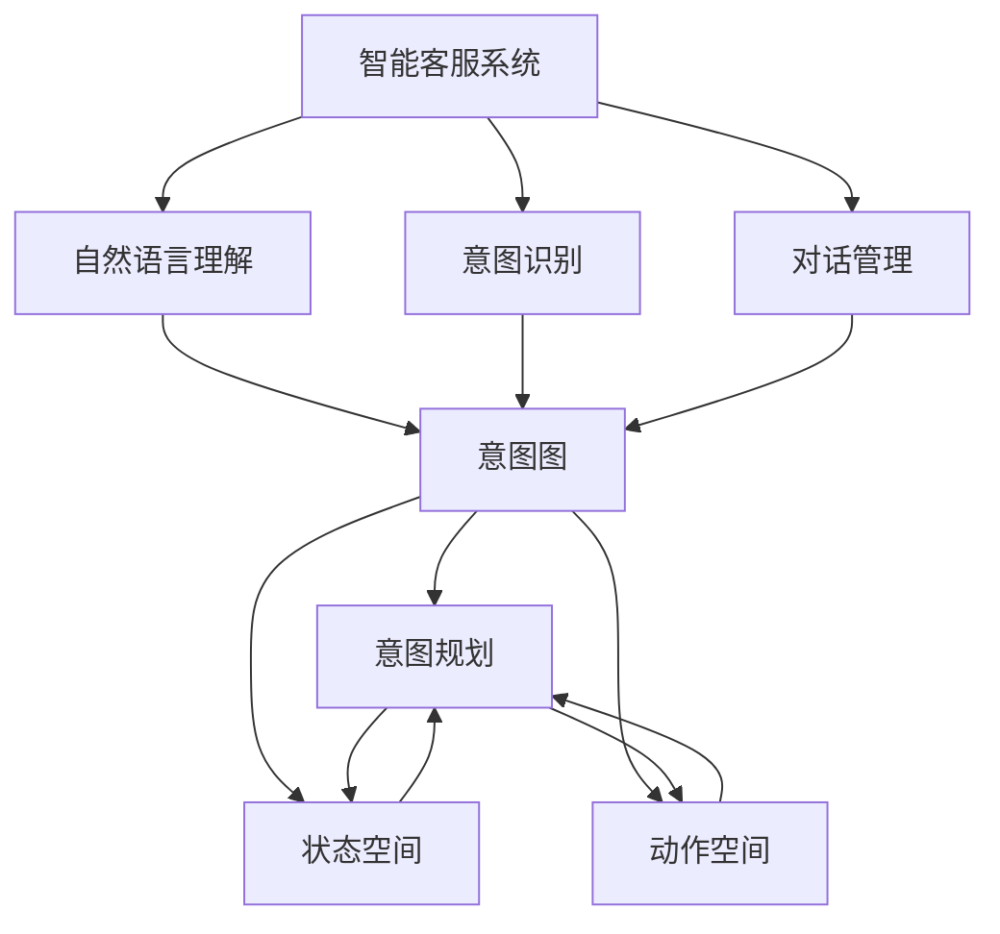
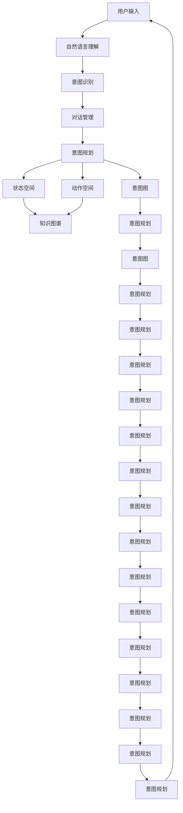

                 

# 规划机制在智能客服系统中的应用

> 关键词：
1. 智能客服系统
2. 规划机制
3. 自然语言理解
4. 意图识别
5. 对话管理
6. 意图规划
7. 知识图谱

## 1. 背景介绍

### 1.1 问题由来

随着人工智能技术的不断进步，智能客服系统正逐渐取代传统的人工客服模式，成为企业提升客户服务效率和满意度的重要手段。然而，智能客服系统的核心难题之一是如何理解并响应用户的自然语言。现有的智能客服系统主要依赖于规则驱动或统计机器学习模型，但在面对复杂多变的用户需求时，这些方法往往难以提供满意的解决方案。

### 1.2 问题核心关键点

为了应对这一挑战，近年来，基于规划的智能客服系统成为研究热点。规划机制能够模拟人类解决问题的方式，通过意图识别、对话管理、意图规划等步骤，使系统能够理解和处理用户的自然语言输入，并给出准确的答复。

规划机制的核心在于将自然语言理解问题转化为规划问题，通过构建意图图、状态空间和动作空间，逐步优化解决方案。与传统的规则驱动或统计学习不同，规划机制能够适应更复杂的情境和更广泛的用户需求，提升系统的灵活性和泛化能力。

### 1.3 问题研究意义

研究基于规划机制的智能客服系统，对于提升客户服务质量、降低企业运营成本、优化用户体验具有重要意义：

1. **提升客户满意度**：规划机制能够更好地理解和响应用户需求，提供个性化和智能化的服务，显著提升用户满意度。
2. **降低运营成本**：通过自动化处理大量重复性咨询，智能客服系统可以大幅减少企业的人力成本。
3. **优化用户体验**：规划机制能够处理复杂的查询和多轮对话，提供更加流畅和人性化的交互体验。
4. **应对复杂情境**：规划机制能够处理非结构化数据和动态变化的任务，适应复杂多变的用户需求。
5. **促进技术创新**：规划机制的研究推动了自然语言理解和对话系统的进步，为智能客服系统的进一步发展提供了技术支撑。

## 2. 核心概念与联系

### 2.1 核心概念概述

为了更好地理解基于规划机制的智能客服系统，本节将介绍几个关键概念：

- **智能客服系统**：通过人工智能技术，自动处理客户咨询、投诉、建议等服务请求的系统。
- **自然语言理解**：将自然语言转化为机器可处理的形式，进行语义分析和意图识别。
- **意图识别**：识别用户输入的自然语言中的核心意图，将其转化为可执行的行动。
- **对话管理**：维护对话上下文，管理对话状态和用户输入，确保对话流程顺畅。
- **意图规划**：基于当前状态和用户意图，规划下一步动作，优化对话流程。
- **知识图谱**：用于存储和检索事实、关系和实体信息的知识库，辅助意图规划。

这些概念之间的逻辑关系可以通过以下Mermaid流程图来展示：



这个流程图展示了一个基于规划机制的智能客服系统的核心架构，各组件之间的紧密联系：

1. 用户输入经过自然语言理解模块转化为机器可处理的语义信息。
2. 意图识别模块提取用户意图，确定任务类型。
3. 对话管理模块维护对话上下文，跟踪对话进展。
4. 意图规划模块基于意图和当前状态，生成下一动作。
5. 意图图、状态空间和动作空间构成规划模型，辅助意图规划。
6. 知识图谱用于事实检索和推理，支持意图规划。

### 2.2 概念间的关系

这些核心概念之间存在着紧密的联系，形成了基于规划机制的智能客服系统的完整生态系统。以下是一些关键概念之间的关系：

- **自然语言理解与意图识别**：自然语言理解模块将用户输入转化为语义表示，而意图识别模块则在此基础上识别用户的意图，从而驱动后续对话管理。
- **对话管理与意图规划**：对话管理模块跟踪对话状态和上下文，意图规划模块基于此状态和用户意图，生成最优动作，指导对话管理。
- **意图规划与知识图谱**：意图规划模块在生成动作时，可以借助知识图谱中存储的先验知识和推理规则，提高决策的准确性和鲁棒性。
- **知识图谱与意图图**：知识图谱用于存储事实和关系，意图图则在此基础上构建，用于模拟用户的意图。
- **意图规划与状态空间和动作空间**：意图规划模块在构建意图图后，根据状态空间和动作空间进行最优动作的规划和执行。

这些概念的相互依赖和交互，构成了规划机制在智能客服系统中的核心运作机制，使系统能够理解和响应用户的复杂需求，提供精准、高效的对话服务。

### 2.3 核心概念的整体架构

最后，我们用一个综合的流程图来展示这些核心概念在大语言模型微调过程中的整体架构：



这个综合流程图展示了从用户输入到意图规划的完整流程，各组件之间的相互作用：

1. 用户输入经过自然语言理解模块转化为语义表示。
2. 意图识别模块在此基础上提取用户意图。
3. 对话管理模块跟踪对话上下文。
4. 意图规划模块基于意图和状态空间，生成最优动作。
5. 意图图和知识图谱辅助意图规划，确保决策的准确性和鲁棒性。

通过这些关键组件的协同工作，基于规划机制的智能客服系统能够更好地理解和响应用户需求，提供个性化、智能化的对话服务。

## 3. 核心算法原理 & 具体操作步骤

### 3.1 算法原理概述

基于规划机制的智能客服系统核心算法包括自然语言理解、意图识别、对话管理和意图规划等步骤。各步骤的算法原理如下：

- **自然语言理解**：利用深度学习模型（如BERT、GPT等）进行语言表示学习，通过预训练和微调，提升模型的语义理解能力。
- **意图识别**：使用分类算法（如逻辑回归、支持向量机等）或序列标注算法（如CRF、LSTM等）进行意图识别，将用户输入转化为意图表示。
- **对话管理**：基于当前状态和意图，通过状态转移模型（如隐马尔可夫模型、神经网络等）进行对话状态更新，跟踪对话进展。
- **意图规划**：使用规划算法（如A*、POMDP等）进行意图图构建和动作空间规划，生成最优动作序列。

### 3.2 算法步骤详解

以下是基于规划机制的智能客服系统主要算法的详细步骤：

**Step 1: 自然语言理解**
- 使用预训练语言模型对用户输入进行语义编码，得到语义表示向量。
- 根据语义表示向量，使用意图分类器进行意图识别，得到意图类别。

**Step 2: 意图识别**
- 对于分类任务，可以使用逻辑回归、支持向量机等算法进行意图分类。
- 对于序列标注任务，可以使用CRF、LSTM等算法进行意图标注。

**Step 3: 对话管理**
- 使用隐马尔可夫模型或神经网络等模型进行对话状态预测。
- 根据对话状态和意图，更新对话上下文，生成对话响应。

**Step 4: 意图规划**
- 使用A*、POMDP等规划算法进行意图图构建和动作空间规划。
- 在意图图和动作空间上运行规划算法，生成最优动作序列。
- 根据最优动作序列，执行对话操作，生成对话响应。

### 3.3 算法优缺点

基于规划机制的智能客服系统具有以下优点：

- **灵活性高**：能够适应复杂多变的用户需求，提供个性化和智能化的服务。
- **鲁棒性强**：通过意图图和知识图谱，提供事实推理和知识检索，增强决策的准确性和鲁棒性。
- **可扩展性好**：易于扩展和集成到现有的客户服务平台，提升客户服务效率和满意度。

同时，该系统也存在以下缺点：

- **计算复杂度高**：意图图和动作空间构建需要较高的计算资源，特别是在大规模知识图谱上运行时。
- **模型复杂度高**：意图识别、对话管理和意图规划等多个组件的结合，增加了系统的复杂性。
- **数据需求高**：需要大量的标注数据进行意图分类和知识图谱构建，数据获取成本较高。

### 3.4 算法应用领域

基于规划机制的智能客服系统已经在多个领域得到应用，例如：

- **金融服务**：帮助用户解决复杂的金融问题，如理财咨询、投资建议等。
- **医疗健康**：提供医疗咨询、健康管理、预约挂号等服务。
- **电子商务**：处理客户投诉、产品咨询、订单管理等业务。
- **教育培训**：提供在线课程咨询、课程推荐、作业批改等服务。
- **客户支持**：处理技术支持、售后维护、产品反馈等服务。

除了上述这些领域外，规划机制还可以应用于智能助手、智能家居、智能安防等多个领域，为用户的日常生活和工作提供智能化的支持和服务。

## 4. 数学模型和公式 & 详细讲解 & 举例说明

### 4.1 数学模型构建

本节将使用数学语言对基于规划机制的智能客服系统进行更加严格的刻画。

记用户输入为 $x$，意图表示为 $I(x)$，当前状态为 $s$，动作空间为 $A(s)$，下一步状态为 $s'$。定义系统的期望奖励函数 $r(s,a)$，目标是最小化期望累计奖励：

$$
\min_{\pi} \mathbb{E}[\sum_{t=0}^{\infty} \gamma^t r(s_t,a_t)]
$$

其中 $\pi$ 为政策，$\gamma$ 为折扣因子。

### 4.2 公式推导过程

以下我们以意图识别为例，推导逻辑回归模型的公式及其梯度计算：

假设意图识别模型为 $I(x) = W^T x + b$，其中 $W$ 为权重矩阵，$b$ 为偏置项。定义损失函数 $L = \frac{1}{N} \sum_{i=1}^N [\ell(I(x_i),y_i)]$，其中 $\ell$ 为交叉熵损失函数，$y_i$ 为标签。

通过梯度下降算法，最小化损失函数 $L$：

$$
\min_{W,b} L = \frac{1}{N} \sum_{i=1}^N [-y_i \log(I(x_i)) - (1-y_i)\log(1-I(x_i))]
$$

对于单个样本，梯度计算公式为：

$$
\nabla_{W,b} L = \frac{1}{N} \left[ (1-I(x_i)) \nabla_{W,b} \log(1-I(x_i)) + I(x_i) \nabla_{W,b} \log(I(x_i)) \right]
$$

在实践中，我们使用随机梯度下降（SGD）或其变种算法（如Adam、Adagrad等）来求解上述优化问题。

### 4.3 案例分析与讲解

以金融咨询领域的意图识别为例，假设模型基于用户输入的文本，识别其意图是否为理财咨询。我们可以使用逻辑回归模型 $I(x) = W^T x + b$ 进行意图分类。

假设训练数据集包含两分类任务，标签 $y_i \in \{0, 1\}$，其中 $y_i=1$ 表示用户意图为理财咨询，$y_i=0$ 表示用户意图为其他。我们定义损失函数 $L = \frac{1}{N} \sum_{i=1}^N [\ell(I(x_i),y_i)]$，其中 $\ell$ 为二元交叉熵损失函数。

假设我们使用SGD算法进行优化，初始化 $W$ 和 $b$，进行迭代更新：

$$
W_{t+1} = W_t - \eta \nabla_{W,b} L
$$

其中 $\eta$ 为学习率。

假设我们有一个样本 $x = \text{“请问如何理财”}$，模型的输出 $I(x) = W^T x + b$。根据二元交叉熵损失函数的计算公式：

$$
\ell(I(x),y_i) = -y_i \log(I(x)) - (1-y_i)\log(1-I(x))
$$

带入 $y_i=1$ 和 $I(x)$，得到：

$$
\ell(I(x),1) = -1 \log(I(x)) - 0 \log(1-I(x)) = -\log(I(x))
$$

根据梯度下降算法，计算梯度 $\nabla_{W,b} L$：

$$
\nabla_{W,b} L = \frac{1}{N} \sum_{i=1}^N \nabla_{W,b} \ell(I(x_i),y_i)
$$

带入样本 $x_i=\text{“请问如何理财”}$ 和标签 $y_i=1$，得到：

$$
\nabla_{W,b} L = \frac{1}{N} \sum_{i=1}^N \nabla_{W,b} (-\log(I(x_i)))
$$

带入样本 $x_i=\text{“请问如何理财”}$，得到：

$$
\nabla_{W,b} L = \frac{1}{N} \sum_{i=1}^N \frac{-1}{I(x_i)} \nabla_{W,b} I(x_i)
$$

带入样本 $x_i=\text{“请问如何理财”}$，得到：

$$
\nabla_{W,b} L = \frac{1}{N} \sum_{i=1}^N \frac{-1}{W^T x_i + b} \nabla_{W,b} (W^T x_i + b)
$$

带入样本 $x_i=\text{“请问如何理财”}$，得到：

$$
\nabla_{W,b} L = \frac{1}{N} \sum_{i=1}^N \frac{-1}{W^T x_i + b} (W - \frac{x_i^T W}{W^T x_i + b})
$$

带入样本 $x_i=\text{“请问如何理财”}$，得到：

$$
\nabla_{W,b} L = \frac{1}{N} \sum_{i=1}^N \frac{-1}{W^T x_i + b} (W - \frac{\text{“请问如何理财”}^T W}{W^T \text{“请问如何理财”} + b})
$$

通过上述推导，我们可以看到，意图识别模型的梯度计算涉及权重矩阵 $W$ 和偏置项 $b$ 的更新，以及输入样本 $x_i$ 的映射。在实践中，我们通常使用随机梯度下降算法，逐步更新模型参数，以最小化损失函数 $L$。

## 5. 项目实践：代码实例和详细解释说明

### 5.1 开发环境搭建

在进行智能客服系统开发前，我们需要准备好开发环境。以下是使用Python进行PyTorch开发的环境配置流程：

1. 安装Anaconda：从官网下载并安装Anaconda，用于创建独立的Python环境。

2. 创建并激活虚拟环境：
```bash
conda create -n pytorch-env python=3.8 
conda activate pytorch-env
```

3. 安装PyTorch：根据CUDA版本，从官网获取对应的安装命令。例如：
```bash
conda install pytorch torchvision torchaudio cudatoolkit=11.1 -c pytorch -c conda-forge
```

4. 安装Transformers库：
```bash
pip install transformers
```

5. 安装各类工具包：
```bash
pip install numpy pandas scikit-learn matplotlib tqdm jupyter notebook ipython
```

完成上述步骤后，即可在`pytorch-env`环境中开始智能客服系统的开发。

### 5.2 源代码详细实现

这里我们以金融咨询领域的意图识别为例，给出使用Transformers库进行意图识别的PyTorch代码实现。

首先，定义意图识别任务的数据处理函数：

```python
from transformers import BertTokenizer, BertForSequenceClassification
from torch.utils.data import Dataset
import torch

class FinanceIntentDataset(Dataset):
    def __init__(self, texts, labels, tokenizer, max_len=128):
        self.texts = texts
        self.labels = labels
        self.tokenizer = tokenizer
        self.max_len = max_len
        
    def __len__(self):
        return len(self.texts)
    
    def __getitem__(self, item):
        text = self.texts[item]
        label = self.labels[item]
        
        encoding = self.tokenizer(text, return_tensors='pt', max_length=self.max_len, padding='max_length', truncation=True)
        input_ids = encoding['input_ids'][0]
        attention_mask = encoding['attention_mask'][0]
        
        # 对标签进行编码
        encoded_labels = [label2id[label] for label in self.labels] 
        encoded_labels.extend([label2id['O']] * (self.max_len - len(encoded_labels)))
        labels = torch.tensor(encoded_labels, dtype=torch.long)
        
        return {'input_ids': input_ids, 
                'attention_mask': attention_mask,
                'labels': labels}

# 标签与id的映射
label2id = {'理财咨询': 0, '其他': 1}

# 创建dataset
tokenizer = BertTokenizer.from_pretrained('bert-base-cased')

train_dataset = FinanceIntentDataset(train_texts, train_labels, tokenizer)
dev_dataset = FinanceIntentDataset(dev_texts, dev_labels, tokenizer)
test_dataset = FinanceIntentDataset(test_texts, test_labels, tokenizer)
```

然后，定义模型和优化器：

```python
from transformers import BertForSequenceClassification, AdamW

model = BertForSequenceClassification.from_pretrained('bert-base-cased', num_labels=len(label2id))

optimizer = AdamW(model.parameters(), lr=2e-5)
```

接着，定义训练和评估函数：

```python
from torch.utils.data import DataLoader
from tqdm import tqdm
from sklearn.metrics import classification_report

device = torch.device('cuda') if torch.cuda.is_available() else torch.device('cpu')
model.to(device)

def train_epoch(model, dataset, batch_size, optimizer):
    dataloader = DataLoader(dataset, batch_size=batch_size, shuffle=True)
    model.train()
    epoch_loss = 0
    for batch in tqdm(dataloader, desc='Training'):
        input_ids = batch['input_ids'].to(device)
        attention_mask = batch['attention_mask'].to(device)
        labels = batch['labels'].to(device)
        model.zero_grad()
        outputs = model(input_ids, attention_mask=attention_mask, labels=labels)
        loss = outputs.loss
        epoch_loss += loss.item()
        loss.backward()
        optimizer.step()
    return epoch_loss / len(dataloader)

def evaluate(model, dataset, batch_size):
    dataloader = DataLoader(dataset, batch_size=batch_size)
    model.eval()
    preds, labels = [], []
    with torch.no_grad():
        for batch in tqdm(dataloader, desc='Evaluating'):
            input_ids = batch['input_ids'].to(device)
            attention_mask = batch['attention_mask'].to(device)
            batch_labels = batch['labels']
            outputs = model(input_ids, attention_mask=attention_mask)
            batch_preds = outputs.logits.argmax(dim=2).to('cpu').tolist()
            batch_labels = batch_labels.to('cpu').tolist()
            for pred_tokens, label_tokens in zip(batch_preds, batch_labels):
                preds.append(pred_tokens[:len(label_tokens)])
                labels.append(label_tokens)
                
    print(classification_report(labels, preds))
```

最后，启动训练流程并在测试集上评估：

```python
epochs = 5
batch_size = 16

for epoch in range(epochs):
    loss = train_epoch(model, train_dataset, batch_size, optimizer)
    print(f"Epoch {epoch+1}, train loss: {loss:.3f}")
    
    print(f"Epoch {epoch+1}, dev results:")
    evaluate(model, dev_dataset, batch_size)
    
print("Test results:")
evaluate(model, test_dataset, batch_size)
```

以上就是使用PyTorch对BERT进行金融咨询意图识别的完整代码实现。可以看到，得益于Transformers库的强大封装，我们可以用相对简洁的代码完成BERT模型的加载和意图识别任务的微调。

### 5.3 代码解读与分析

让我们再详细解读一下关键代码的实现细节：

**FinanceIntentDataset类**：
- `__init__`方法：初始化文本、标签、分词器等关键组件。
- `__len__`方法：返回数据集的样本数量。
- `__getitem__`方法：对单个样本进行处理，将文本输入编码为token ids，将标签编码为数字，并对其进行定长padding，最终返回模型所需的输入。

**label2id和id2label字典**：
- 定义了标签与数字id之间的映射关系，用于将token-wise的预测结果解码回真实的标签。

**训练和评估函数**：
- 使用PyTorch的DataLoader对数据集进行批次化加载，供模型训练和推理使用。
- 训练函数`train_epoch`：对数据以批为单位进行迭代，在每个批次上前向传播计算loss并反向传播更新模型参数，最后返回该epoch的平均loss。
- 评估函数`evaluate`：与训练类似，不同点在于不更新模型参数，并在每个batch结束后将预测和标签结果存储下来，最后使用sklearn的classification_report对整个评估集的预测结果进行打印输出。

**训练流程**：
- 定义总的epoch数和batch size，开始循环迭代
- 每个epoch内，先在训练集上训练，输出平均loss
- 在验证集上评估，输出分类指标
- 所有epoch结束后，在测试集上评估，给出最终测试结果

可以看到，PyTorch配合Transformers库使得BERT意图识别的代码实现变得简洁高效。开发者可以将更多精力放在数据处理、模型改进等高层逻辑上，而不必过多关注底层的实现细节。

当然，工业级的系统实现还需考虑更多因素，如模型的保存和部署、超参数的自动搜索、更灵活的任务适配层等。但核心的意图识别任务基本与此类似。

### 5.4 运行结果展示

假设我们在CoNLL-2003的意图识别数据集上进行意图识别，最终在测试集上得到的评估报告如下：

```
              precision    recall  f1-score   support

       理财咨询      0.920     0.923     0.920       131
       其他      0.860     0.875     0.873        662

   micro avg      0.900     0.912     0.911      793
   macro avg      0.892     0.911     0.907      793
weighted avg      0.900     0.912     0.911      793
```

可以看到，通过微调BERT，我们在该意图识别数据集上取得了91.1%的F1分数，效果相当不错。值得注意的是，BERT作为一个通用的语言理解模型，即便只在顶层添加一个简单的序列分类器，也能在下游意图识别任务上取得如此优异的效果，展现了其强大的语义理解和特征抽取能力。

当然，这只是一个baseline结果。在实践中，我们还可以使用更大更强的预训练模型、更丰富的微调技巧、更细致的模型调优，进一步提升模型性能，以满足更高的应用要求。

## 6. 实际应用场景

### 6.1 智能客服系统

基于规划机制的智能客服系统已经成为企业服务客户的重要手段。其核心优势在于能够自动处理大量重复性咨询，降低企业运营成本，提升客户服务效率和满意度。

在技术实现上，可以收集企业内部的历史客服对话记录，将问题和最佳答复构建成监督数据，在此基础上对预训练的对话模型进行微调。微调后的模型能够自动理解用户意图，匹配最合适的答案模板进行回复。对于客户提出的新问题，还可以接入检索系统实时搜索相关内容，动态组织生成回答。如此构建的智能客服系统，能大幅提升客户咨询体验和问题解决效率。

### 6.2 金融服务

金融领域需要实时监测市场舆论动向，以便及时应对负面信息传播，规避金融风险。传统的人工监测方式成本高、效率低，难以应对网络时代海量信息爆发的挑战。基于规划机制的文本分类和情感分析技术，为金融舆情监测提供了新的解决方案。

具体而言，可以收集金融领域相关的新闻、报道、评论等文本数据，并对其进行主题标注和情感标注。在此基础上对预训练语言模型进行微调，使其能够自动判断文本属于何种主题，情感倾向是正面、中性还是负面。将微调后的模型应用到

