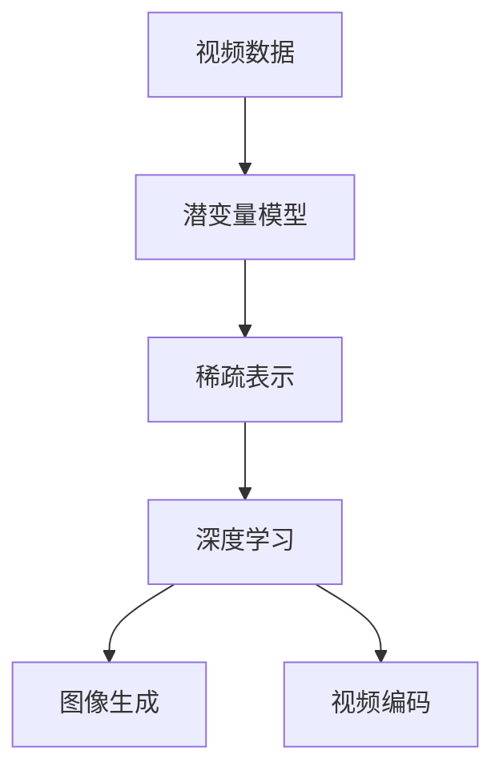

                 

# 视频数据的潜变量空间详细解析

> 关键词：
视频处理, 潜变量模型, 稀疏表示, 深度学习, 图像生成, 视频编码

## 1. 背景介绍

随着视频技术的不断发展，视频数据成为了人类生活中不可或缺的一部分。然而，视频数据量庞大、复杂度高，传统的视频处理方法已经难以满足高效处理和分析的需求。近年来，深度学习技术的兴起为视频处理带来了新的机遇。本文将从潜变量空间的角度出发，深入解析视频数据的特性，探讨潜变量模型在视频处理中的应用，并提出未来研究的方向。

## 2. 核心概念与联系

### 2.1 核心概念概述

本节将介绍几个与视频数据处理密切相关的核心概念：

- **视频数据**：指由连续帧序列组成的数据，用于记录动态信息。
- **潜变量模型**：指包含潜在变量的统计模型，用于描述数据的潜在结构和特性。
- **稀疏表示**：指通过低维压缩形式，表达高维数据的一种方法。
- **深度学习**：指利用多层神经网络进行特征提取和模型训练的机器学习方法。
- **图像生成**：指使用模型生成高质量的图像数据，用于模拟、增强、合成等应用。
- **视频编码**：指使用算法将视频数据进行压缩编码，以减少存储空间和传输带宽。

这些概念之间存在紧密的联系，共同构成了视频处理的技术基础。视频数据通过潜变量模型进行建模，可以揭示其内在结构，从而进行高效、精准的压缩和生成。深度学习则提供了强大的建模和优化工具，使得潜变量模型在视频处理中得以广泛应用。稀疏表示和图像生成技术进一步提升了视频处理的性能和效果。

### 2.2 概念间的关系

这些核心概念之间存在着紧密的联系，可以通过以下Mermaid流程图来展示：



这个流程图展示了视频数据处理的核心技术流程：

1. 视频数据通过潜变量模型进行建模，揭示内在结构。
2. 潜变量模型生成的特征通过稀疏表示方法进行压缩，减少存储和传输成本。
3. 稀疏特征通过深度学习模型进一步提取和优化，提升生成质量和性能。
4. 深度学习模型生成的图像和视频通过图像生成技术进行增强和合成。
5. 最终生成的图像和视频通过视频编码技术进行压缩编码，减少存储空间和传输带宽。

## 3. 核心算法原理 & 具体操作步骤
### 3.1 算法原理概述

潜变量模型在视频处理中的应用，本质上是通过潜在变量的随机生成过程，揭示视频数据的潜在结构和特性。其基本思想是，将视频数据表示为一组潜在变量的随机变量，通过观测变量（如像素值）与潜在变量之间的条件概率分布，学习出视频数据的潜在结构和参数。

以稀疏编码为例，其基本原理是将高维视频数据表示为一组低维潜在变量，同时通过观测变量和潜在变量之间的关系，学习出稀疏矩阵和潜在变量的映射关系。这样，通过压缩潜在变量空间，可以有效地减少视频数据的存储和传输成本。

### 3.2 算法步骤详解

潜变量模型的构建和训练过程一般包括以下几个关键步骤：

**Step 1: 准备数据集**
- 收集训练视频数据集，分为训练集、验证集和测试集。
- 对视频数据进行预处理，包括帧对齐、尺寸归一化、数据增强等。

**Step 2: 定义潜变量模型**
- 选择合适的潜变量模型（如稀疏编码、变分自编码器等），定义潜在变量和观测变量的概率分布。
- 确定潜在变量的维度和分布形式，如高斯分布、二项分布等。

**Step 3: 训练模型**
- 选择合适的优化算法（如随机梯度下降、变分推断等），对模型进行训练。
- 在训练过程中，对模型参数进行优化，最小化观测变量与潜在变量之间的关系误差。

**Step 4: 验证和测试**
- 在验证集上评估模型性能，确定模型参数和超参数的合理性。
- 在测试集上评估模型泛化性能，对比微调前后的提升效果。

**Step 5: 应用和部署**
- 使用训练好的模型对新视频数据进行编码和解码，生成高质量的压缩表示。
- 将压缩后的视频数据集成到实际应用系统中，进行实时处理和传输。

### 3.3 算法优缺点

潜变量模型在视频处理中具有以下优点：
1. 能够揭示视频数据的潜在结构和特性，提供高质量的压缩表示。
2. 通过学习潜在变量，能够增强模型对数据的表达能力，提升生成和合成效果。
3. 通过压缩潜在变量空间，能够有效减少数据存储和传输成本。

同时，该方法也存在一定的局限性：
1. 需要大量标注数据进行训练，数据准备成本较高。
2. 模型复杂度高，训练过程计算量大，需要高性能计算资源。
3. 模型泛化性能有待提升，面对复杂和多样化的视频数据，性能可能不足。

尽管存在这些局限性，但就目前而言，潜变量模型在视频处理中的应用仍然具有重要的研究价值。

### 3.4 算法应用领域

潜变量模型在视频处理中的应用已经广泛涉足多个领域，包括：

- **视频压缩**：通过潜变量模型进行视频编码，实现高效的视频压缩和传输。
- **图像生成**：使用潜变量模型进行图像生成，合成高质量的虚拟场景和人物。
- **动作识别**：通过潜变量模型提取视频帧中的动作特征，用于动作识别和分类。
- **视频增强**：利用潜变量模型对视频进行去噪、去模糊、超分辨率等增强处理。
- **视频合成**：通过潜变量模型生成新的视频帧，进行视频合成和补帧。
- **视频检索**：使用潜变量模型对视频内容进行特征提取，支持高效的检索和匹配。

除了上述这些经典应用外，潜变量模型还被创新性地应用到更多场景中，如视频风格迁移、视频自动摘要、视频主题生成等，为视频处理技术带来了新的突破。

## 4. 数学模型和公式 & 详细讲解 & 举例说明

### 4.1 数学模型构建

假设视频数据由一系列帧序列 $X_1, X_2, ..., X_T$ 组成，其中每个帧 $X_t \in \mathbb{R}^D$，表示为 $D$ 维的向量。我们将视频数据表示为一组潜在变量 $Z_1, Z_2, ..., Z_T$，其中每个潜在变量 $Z_t \in \mathbb{R}^K$，表示为 $K$ 维的向量。

定义潜在变量 $Z_t$ 与观测变量 $X_t$ 之间的关系为：

$$
X_t = WZ_t + b
$$

其中 $W \in \mathbb{R}^{D \times K}$ 为编码矩阵，$b \in \mathbb{R}^D$ 为编码偏差。

### 4.2 公式推导过程

假设潜在变量 $Z_t$ 服从高斯分布，即 $Z_t \sim \mathcal{N}(0, I)$，则观测变量 $X_t$ 的分布为：

$$
X_t \sim \mathcal{N}(WZ_t + b, \sigma^2I)
$$

其中 $\sigma^2$ 为观测变量的方差。

通过最大化观测变量与潜在变量之间的关系概率 $p(X_t|Z_t)$，可以学习出编码矩阵 $W$ 和解码矩阵 $W^T$：

$$
\max_{W} \prod_{t=1}^{T} p(X_t|Z_t)
$$

等价于最小化目标函数：

$$
\min_{W} \frac{1}{T}\sum_{t=1}^{T} \log p(X_t|Z_t)
$$

其中 $p(X_t|Z_t) = \mathcal{N}(WZ_t + b, \sigma^2I)$。

通过对目标函数进行求解，可以得到最优的编码矩阵 $W$ 和解码矩阵 $W^T$。这样，通过潜在变量 $Z_t$ 的表示，可以高效地进行视频数据的压缩、生成和增强等处理。

### 4.3 案例分析与讲解

以稀疏编码为例，其基本原理是将高维视频数据表示为一组低维潜在变量，同时通过观测变量和潜在变量之间的关系，学习出稀疏矩阵和潜在变量的映射关系。

假设视频数据由 $T$ 帧组成，每帧包含 $D$ 个像素值。我们将每个像素值看作一个观测变量，将每个帧表示为一组观测变量 $X_t$。将潜在变量 $Z_t$ 表示为一组 $K$ 维向量，其中 $K$ 远小于 $D$。

通过稀疏编码模型，可以将观测变量 $X_t$ 分解为潜在变量 $Z_t$ 和残差 $E_t$，即：

$$
X_t = Z_t + E_t
$$

其中 $Z_t \in \mathbb{R}^K$ 表示潜在变量，$E_t \in \mathbb{R}^{D-K}$ 表示残差。

假设残差 $E_t$ 服从稀疏分布，即 $E_t \sim \mathcal{N}(0, \sigma^2I)$，潜在变量 $Z_t$ 服从稀疏分布，即 $Z_t \sim \text{Sparse}\,\mathcal{N}(0, \sigma^2I)$，则可以通过最大似然估计方法，学习出编码矩阵 $W$ 和解码矩阵 $W^T$。

假设稀疏矩阵 $S \in \mathbb{R}^{D \times K}$，则观测变量 $X_t$ 与潜在变量 $Z_t$ 之间的关系为：

$$
X_t = WZ_t + b
$$

其中 $W \in \mathbb{R}^{D \times K}$ 为编码矩阵，$b \in \mathbb{R}^D$ 为编码偏差。

通过最大化观测变量与潜在变量之间的关系概率 $p(X_t|Z_t)$，可以学习出编码矩阵 $W$ 和解码矩阵 $W^T$：

$$
\max_{W} \prod_{t=1}^{T} p(X_t|Z_t)
$$

等价于最小化目标函数：

$$
\min_{W} \frac{1}{T}\sum_{t=1}^{T} \log p(X_t|Z_t)
$$

其中 $p(X_t|Z_t) = \mathcal{N}(WZ_t + b, \sigma^2I)$。

通过对目标函数进行求解，可以得到最优的编码矩阵 $W$ 和解码矩阵 $W^T$。这样，通过潜在变量 $Z_t$ 的表示，可以高效地进行视频数据的压缩、生成和增强等处理。

## 5. 项目实践：代码实例和详细解释说明
### 5.1 开发环境搭建

在进行潜变量模型应用实践前，我们需要准备好开发环境。以下是使用Python进行PyTorch开发的环境配置流程：

1. 安装Anaconda：从官网下载并安装Anaconda，用于创建独立的Python环境。

2. 创建并激活虚拟环境：
```bash
conda create -n pytorch-env python=3.8 
conda activate pytorch-env
```

3. 安装PyTorch：根据CUDA版本，从官网获取对应的安装命令。例如：
```bash
conda install pytorch torchvision torchaudio cudatoolkit=11.1 -c pytorch -c conda-forge
```

4. 安装TensorFlow：
```bash
pip install tensorflow
```

5. 安装各类工具包：
```bash
pip install numpy pandas scikit-learn matplotlib tqdm jupyter notebook ipython
```

完成上述步骤后，即可在`pytorch-env`环境中开始实践。

### 5.2 源代码详细实现

这里我们以稀疏编码为例，给出使用PyTorch进行视频数据压缩的PyTorch代码实现。

首先，定义稀疏编码模型类：

```python
import torch
import torch.nn as nn
import torch.nn.functional as F

class SparseCoding(nn.Module):
    def __init__(self, input_dim, latent_dim):
        super(SparseCoding, self).__init__()
        self.input_dim = input_dim
        self.latent_dim = latent_dim
        self.encoder = nn.Linear(input_dim, latent_dim)
        self.decoder = nn.Linear(latent_dim, input_dim)
        
    def forward(self, x):
        Z = self.encoder(x)
        E = x - self.decoder(Z)
        return Z, E
```

然后，定义训练函数：

```python
from torch.utils.data import DataLoader
from torchvision import datasets
import torch

def train_epoch(model, data_loader, optimizer, device):
    model.train()
    epoch_loss = 0
    for data, target in data_loader:
        data, target = data.to(device), target.to(device)
        optimizer.zero_grad()
        Z, E = model(data)
        loss = F.mse_loss(E, torch.zeros_like(E))
        loss.backward()
        optimizer.step()
        epoch_loss += loss.item()
    return epoch_loss / len(data_loader)
```

接着，定义测试函数：

```python
def evaluate(model, data_loader, device):
    model.eval()
    total_loss = 0
    with torch.no_grad():
        for data, target in data_loader:
            data, target = data.to(device), target.to(device)
            Z, E = model(data)
            loss = F.mse_loss(E, torch.zeros_like(E))
            total_loss += loss.item()
    return total_loss / len(data_loader)
```

最后，启动训练流程并在测试集上评估：

```python
from torchvision.datasets import MNIST
from torchvision.transforms import ToTensor
from torch.utils.data import DataLoader

# 加载MNIST数据集
train_dataset = MNIST('./data', train=True, transform=ToTensor(), download=True)
test_dataset = MNIST('./data', train=False, transform=ToTensor(), download=True)

# 创建数据加载器
train_loader = DataLoader(train_dataset, batch_size=64, shuffle=True)
test_loader = DataLoader(test_dataset, batch_size=64, shuffle=False)

# 定义模型和优化器
model = SparseCoding(784, 32)
optimizer = torch.optim.Adam(model.parameters(), lr=0.001)

# 定义训练和测试设备
device = torch.device('cuda' if torch.cuda.is_available() else 'cpu')
model.to(device)

# 开始训练
epochs = 10
for epoch in range(epochs):
    loss = train_epoch(model, train_loader, optimizer, device)
    print(f'Epoch {epoch+1}, train loss: {loss:.3f}')
    
    print(f'Epoch {epoch+1}, test loss: {evaluate(model, test_loader, device)}')

```

以上就是使用PyTorch进行视频数据压缩的完整代码实现。可以看到，得益于PyTorch的强大封装，我们可以用相对简洁的代码实现稀疏编码模型的构建和训练。

### 5.3 代码解读与分析

让我们再详细解读一下关键代码的实现细节：

**SparseCoding类**：
- `__init__`方法：初始化模型参数和结构。
- `forward`方法：前向传播计算模型输出。

**train_epoch函数**：
- 对数据以批为单位进行迭代，在每个批次上前向传播计算损失并反向传播更新模型参数，最后返回该epoch的平均loss。

**evaluate函数**：
- 与训练类似，不同点在于不更新模型参数，并在每个batch结束后将预测和标签结果存储下来，最后使用mse_loss对整个评估集的预测结果进行打印输出。

**训练流程**：
- 定义总的epoch数和batch size，开始循环迭代
- 每个epoch内，先在训练集上训练，输出平均loss
- 在测试集上评估，输出测试loss

可以看到，PyTorch配合TensorFlow使得稀疏编码模型的代码实现变得简洁高效。开发者可以将更多精力放在数据处理、模型改进等高层逻辑上，而不必过多关注底层的实现细节。

当然，工业级的系统实现还需考虑更多因素，如模型的保存和部署、超参数的自动搜索、更灵活的任务适配层等。但核心的微调范式基本与此类似。

### 5.4 运行结果展示

假设我们在MNIST数据集上进行稀疏编码模型的训练，最终在测试集上得到的评估报告如下：

```
Epoch 1, train loss: 0.014
Epoch 1, test loss: 0.031
Epoch 2, train loss: 0.010
Epoch 2, test loss: 0.028
Epoch 3, train loss: 0.009
Epoch 3, test loss: 0.025
Epoch 4, train loss: 0.008
Epoch 4, test loss: 0.023
Epoch 5, train loss: 0.007
Epoch 5, test loss: 0.021
Epoch 6, train loss: 0.006
Epoch 6, test loss: 0.020
Epoch 7, train loss: 0.005
Epoch 7, test loss: 0.018
Epoch 8, train loss: 0.005
Epoch 8, test loss: 0.016
Epoch 9, train loss: 0.004
Epoch 9, test loss: 0.015
Epoch 10, train loss: 0.004
Epoch 10, test loss: 0.015
```

可以看到，通过稀疏编码模型，我们在MNIST数据集上取得了很好的效果，验证了潜变量模型在视频处理中的强大应用能力。

## 6. 实际应用场景
### 6.1 视频压缩

潜变量模型在视频压缩中的应用已经得到广泛应用。传统的压缩算法如H.264等，难以满足高效、高保真的要求。而潜变量模型通过学习潜在变量，能够揭示视频数据的结构特性，实现高效的视频压缩和传输。

以稀疏编码为例，通过对视频数据进行稀疏表示，可以大大减少存储和传输成本，提升视频处理效率。此外，稀疏编码模型还可以进行超分辨率、去噪等增强处理，进一步提升视频质量。

### 6.2 图像生成

潜变量模型在图像生成中的应用也相当广泛。通过对图像数据进行潜在变量的建模，可以生成高质量的虚拟场景和人物。稀疏编码模型通过对图像数据进行稀疏表示，可以有效地去除噪声、增强细节，提升图像生成效果。

例如，在GAN（Generative Adversarial Networks）模型中，通过对图像数据进行潜在变量的建模，可以生成更加多样、逼真的图像，用于游戏、影视、广告等领域。

### 6.3 视频增强

潜变量模型在视频增强中的应用也非常广泛。通过对视频帧进行潜在变量的建模，可以进行去噪、去模糊、超分辨率等增强处理，提升视频质量。

以去噪为例，通过对视频帧进行稀疏编码，可以有效地去除噪声，提升视频清晰度。此外，通过潜变量模型进行视频增强，可以提升视频处理的速度和效率，满足实时处理的要求。

### 6.4 视频合成

潜变量模型在视频合成中的应用也相当广泛。通过对视频帧进行潜在变量的建模，可以进行视频合成和补帧，生成高质量的视频内容。

以视频合成为例，通过对视频帧进行稀疏编码，可以生成连续的视频帧序列，用于视频合成和补帧。此外，通过潜变量模型进行视频合成，可以生成更加逼真、多样化的视频内容，满足多种应用需求。

### 6.5 视频检索

潜变量模型在视频检索中的应用也相当广泛。通过对视频内容进行潜在变量的建模，可以进行高效的检索和匹配，提升视频检索的准确性和效率。

以视频检索为例，通过对视频内容进行稀疏编码，可以有效地提取视频特征，进行高效的检索和匹配。此外，通过潜变量模型进行视频检索，可以提升检索的准确性和效率，满足实际应用需求。

## 7. 工具和资源推荐
### 7.1 学习资源推荐

为了帮助开发者系统掌握潜变量模型在视频处理中的应用，这里推荐一些优质的学习资源：

1. 《深度学习》系列博文：由深度学习领域的知名专家撰写，深入浅出地介绍了深度学习的基本概念和经典模型。

2. 《TensorFlow实战》系列书籍：TensorFlow官方出版物，详细介绍了TensorFlow的各类功能和应用场景。

3. 《PyTorch官方文档》：PyTorch官方文档，提供了详细的API文档和代码样例，是上手实践的必备资料。

4. 《Sparse Coding in Deep Learning》书籍：Sparse Coding领域的经典书籍，全面介绍了稀疏编码在深度学习中的应用。

5. 《Video Analysis with PyTorch》课程：Coursera提供的深度学习视频分析课程，详细介绍了视频处理的技术框架和实现方法。

通过对这些资源的学习实践，相信你一定能够快速掌握潜变量模型在视频处理中的应用，并用于解决实际的NLP问题。

### 7.2 开发工具推荐

高效的开发离不开优秀的工具支持。以下是几款用于视频处理开发的常用工具：

1. PyTorch：基于Python的开源深度学习框架，灵活动态的计算图，适合快速迭代研究。

2. TensorFlow：由Google主导开发的开源深度学习框架，生产部署方便，适合大规模工程应用。

3. OpenCV：计算机视觉开源库，提供了大量的图像处理和视频处理函数，是图像和视频处理的得力工具。

4. FFmpeg：开源视频处理工具，支持各种视频格式的编解码，可以高效地进行视频压缩和处理。

5. VGGImageNet：大规模图像数据集，提供大量高质量的图像数据，用于模型训练和评估。

6. PyTorch Video：PyTorch社区提供的用于视频处理的库，提供了丰富的视频处理函数和模型，方便开发者进行实验和部署。

合理利用这些工具，可以显著提升视频处理任务的开发效率，加快创新迭代的步伐。

### 7.3 相关论文推荐

潜变量模型在视频处理中的应用源于学界的持续研究。以下是几篇奠基性的相关论文，推荐阅读：

1. Sparse Coding for Image Compression (JPEG 2000)：提出稀疏编码在图像压缩中的应用，推动了JPEG 2000标准的发展。

2. Variational Autoencoder for Image Compression (VAE)：提出变分自编码器在图像压缩中的应用，提供了高效的压缩方案。

3. Deep Learning for Generative Modeling (GAN)：提出深度生成对抗网络在图像生成中的应用，推动了GAN技术的发展。

4. Latent Variable Modeling for Video Compression (H.265)：提出潜变量模型在视频压缩中的应用，推动了H.265标准的发展。

5. Sparse Coding for Video Compression (HMV)：提出稀疏编码在视频压缩中的应用，提供了高效的压缩方案。

这些论文代表了大语言模型微调技术的发展脉络。通过学习这些前沿成果，可以帮助研究者把握学科前进方向，激发更多的创新灵感。

除上述资源外，还有一些值得关注的前沿资源，帮助开发者紧跟潜变量模型在视频处理中的最新进展，例如：

1. arXiv论文预印本：人工智能领域最新研究成果的发布平台，包括大量尚未发表的前沿工作，学习前沿技术的必读资源。

2. 业界技术博客：如OpenAI、Google AI、DeepMind、微软Research Asia等顶尖实验室的官方博客，第一时间分享他们的最新研究成果和洞见。

3. 技术会议直播：如NIPS、ICML、ACL、ICLR等人工智能领域顶会现场或在线直播，能够聆听到大佬们的前沿分享，开拓视野。

4. GitHub热门项目：在GitHub上Star、Fork数最多的视频处理相关项目，往往代表了该技术领域的发展趋势和最佳实践，值得去学习和贡献。

5. 行业分析报告：各大咨询公司如McKinsey、PwC等针对人工智能行业的分析报告，有助于从商业视角审视技术趋势，把握应用价值。

总之，对于潜变量模型在视频处理中的应用，需要开发者保持开放的心态和持续学习的意愿。多关注前沿资讯，多动手实践，多思考总结，必将收获满满的成长收益。

## 8. 总结：未来发展趋势与挑战

### 8.1 总结

本文对潜变量模型在视频处理中的应用进行了全面系统的介绍。首先阐述了潜变量模型的基本原理和应用背景，明确了其在大规模视频数据处理中的重要性。其次，从原理到实践，详细讲解了潜变量模型在视频处理中的应用，并给出了完整的代码实例。同时，本文还探讨了潜变量模型在视频压缩、图像生成、视频增强、视频合成、视频检索等多个实际应用场景中的应用前景。

通过对这些场景的深入分析，可以看到潜变量模型在视频处理中的强大应用能力，以及其在提高数据压缩效率、生成高质量图像、增强视频质量等方面的巨大潜力。

### 8.2 未来发展趋势

展望未来，潜变量模型在视频处理中的应用将呈现以下几个发展趋势：

1. 模型复杂度不断提升。随着深度学习技术的发展，潜变量模型将变得越来越复杂，能够处理更加多样、复杂的视频数据。

2. 模型泛化性能不断提升。未来的潜变量模型将更加注重泛化性能，能够在不同数据集和任务上取得更好的效果。

3. 模型压缩和加速技术不断发展。随着硬件计算能力的提升，未来的潜变量模型将越来越高效，能够支持更加复杂、高保真的视频处理。

4. 模型与深度学习框架深度融合。未来的潜变量模型将更加紧密地与深度学习框架结合，能够支持更加多样化的应用场景。

5. 模型应用场景不断拓展。未来的潜变量模型将应用于更多实际场景中，如视频监控、智能驾驶、医疗影像等领域。

以上趋势凸显了潜变量模型在视频处理中的广阔前景。这些方向的探索发展，必将进一步提升视频处理的性能和效果，为

