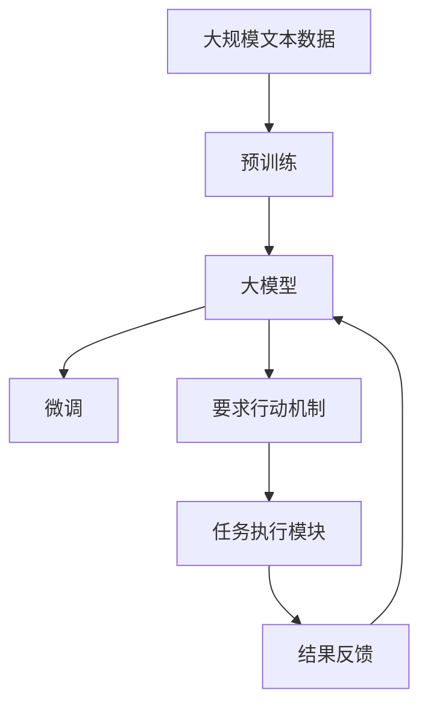

                 

# 【大模型应用开发 动手做AI Agent】在Run进入requires_action状态之后跳出循环

## 1. 背景介绍

### 1.1 问题由来
近年来，人工智能（AI）在各领域的广泛应用，特别是自然语言处理（NLP）领域，使得AI agent成为了解决复杂任务的关键技术之一。AI agent能够在多轮对话中理解用户意图，提供智能化的服务。然而，在实际应用中，AI agent常常需要等待用户输入指令才能继续执行，这种单轮交互模式限制了用户体验和系统效率。为了解决这一问题，实现更自然的交互方式，研究人员和开发者开始探索如何使AI agent在特定条件下自动执行任务，即“要求行动”（requires_action）机制。

### 1.2 问题核心关键点
“要求行动”机制是指AI agent在接收到特定的触发词或信号后，主动执行预设的任务。这一机制的应用场景广泛，如自动回答、智能推荐、机器人控制等。核心关键点在于：
- **触发词识别**：准确识别用户输入中的触发词或信号，以决定AI agent是否执行行动。
- **任务执行**：在识别到触发词后，AI agent执行预设的任务，并将结果反馈给用户。
- **状态管理**：AI agent需要在执行行动前后进行状态管理，确保系统的稳定性。

### 1.3 问题研究意义
实现“要求行动”机制，不仅能够提升用户体验，还能显著提高系统效率。这对于构建复杂、智能化的AI agent具有重要意义：

1. **提高交互效率**：通过自动识别触发词，AI agent可以及时执行任务，减少用户等待时间。
2. **增强系统灵活性**：在特定条件下执行预设任务，提高了系统的适应性和灵活性。
3. **提升用户体验**：用户可以更加自然地与AI agent进行交互，减少繁琐的手动操作。
4. **拓展应用场景**：为AI agent的应用场景带来更多可能性，如智能推荐系统、自动化客服等。

## 2. 核心概念与联系

### 2.1 核心概念概述

为更好地理解“要求行动”机制，本节将介绍几个密切相关的核心概念：

- **AI agent**：能够理解和执行人类指令的智能程序，用于解决各种复杂任务。
- **自然语言理解（NLU）**：使AI agent能够理解自然语言输入的技术，是实现“要求行动”机制的关键。
- **对话管理系统（DMS）**：负责管理AI agent与用户之间的对话流程，确保对话的连贯性和逻辑性。
- **意图识别**：识别用户输入中的意图，决定AI agent是否执行预设任务。
- **任务执行模块**：根据意图，执行预设的任务，如自动回答、推荐、控制等。
- **状态管理**：维护AI agent的状态，确保在执行行动前后系统能够正确处理。

这些核心概念之间的逻辑关系可以通过以下Mermaid流程图来展示：

```mermaid
graph TB
    A[自然语言理解 (NLU)]
    B[意图识别]
    C[对话管理系统 (DMS)]
    D[任务执行模块]
    E[状态管理]
    A --> B
    A --> C
    B --> C
    C --> D
    C --> E
    D --> E
    E --> C
```

这个流程图展示了大模型在“要求行动”机制中的各个组成部分及其相互作用。自然语言理解将用户输入转换为机器可理解的形式，意图识别根据输入识别用户的意图，对话管理系统根据意图和当前状态决定是否执行预设任务，任务执行模块执行预设任务，状态管理确保系统在执行行动前后的状态一致性。

### 2.2 概念间的关系

这些核心概念之间存在着紧密的联系，形成了AI agent的完整生态系统。下面我通过几个Mermaid流程图来展示这些概念之间的关系。

#### 2.2.1 AI agent的工作流程

```mermaid
graph LR
    A[自然语言理解 (NLU)] --> B[意图识别] --> C[对话管理系统 (DMS)] --> D[任务执行模块]
```

这个流程图展示了AI agent的工作流程，从自然语言理解到意图识别，再到对话管理系统的处理，最终执行预设任务。

#### 2.2.2 触发词和行动执行

```mermaid
graph TB
    A[自然语言理解 (NLU)] --> B[意图识别]
    B --> C[对话管理系统 (DMS)]
    C --> D[任务执行模块]
    C --> E[状态管理]
    B --> F[是否执行预设任务]
    F --> G[返回结果]
    E --> C
```

这个流程图展示了在识别到触发词后，AI agent根据意图识别结果决定是否执行预设任务，并根据状态管理模块的状态信息，执行预设任务。

#### 2.2.3 多轮对话

```mermaid
graph TB
    A[自然语言理解 (NLU)] --> B[意图识别]
    B --> C[对话管理系统 (DMS)]
    C --> D[任务执行模块]
    C --> E[状态管理]
    B --> F[是否执行预设任务]
    F --> G[返回结果]
    E --> C
    C --> H[记录对话历史]
    H --> I[对话历史记录]
```

这个流程图展示了多轮对话的流程，AI agent根据用户的输入识别意图，执行任务，并根据状态管理模块的状态信息，更新对话历史记录。

### 2.3 核心概念的整体架构

最后，我们用一个综合的流程图来展示这些核心概念在大模型微调过程中的整体架构：



这个综合流程图展示了从预训练到微调，再到要求行动机制实现和任务执行的全过程。大模型首先在大规模文本数据上进行预训练，然后通过微调适应特定任务，最后通过要求行动机制实现任务执行，并反馈结果。

## 3. 核心算法原理 & 具体操作步骤

### 3.1 算法原理概述

实现“要求行动”机制，本质上是一种基于自然语言理解和意图识别的决策过程。其核心在于通过训练大模型，使其能够准确识别用户输入中的触发词或信号，并根据意图执行预设的任务。具体步骤如下：

1. **数据收集**：收集包含触发词的任务数据，并将其标记为需要执行行动的任务。
2. **模型训练**：使用收集到的数据，训练大模型，使其能够准确识别触发词，并根据意图执行预设任务。
3. **模型微调**：通过微调，进一步优化模型在特定任务上的性能。
4. **任务执行**：在实际应用中，将微调后的模型部署到系统中，实现“要求行动”机制。

### 3.2 算法步骤详解

#### 3.2.1 数据收集
- 收集包含触发词的任务数据，如客户服务中的“帮助”、“推荐”等关键词。
- 将数据分为训练集和测试集，确保训练数据的多样性和代表性。
- 对数据进行预处理，如分词、标记、格式化等，方便模型的训练。

#### 3.2.2 模型训练
- 使用自然语言处理工具（如NLTK、spaCy）对数据进行预处理。
- 构建意图识别模型，可以使用序列标注模型（如BiLSTM-CRF）或预训练语言模型（如BERT、GPT）。
- 使用监督学习算法（如CRF、BiLSTM-CRF）训练意图识别模型，使其能够准确识别触发词和用户意图。
- 构建任务执行模块，根据意图执行预设任务，如自动回答、智能推荐等。

#### 3.2.3 模型微调
- 使用微调技术（如Fine-tuning、Adapter）进一步优化模型在特定任务上的性能。
- 选择合适的微调策略，如冻结预训练层、优化学习率等，避免过拟合。
- 在测试集上评估模型性能，确保微调后的模型能够正确识别触发词并执行预设任务。

#### 3.2.4 任务执行
- 在实际应用中，将微调后的模型部署到系统中。
- 实时监控用户输入，识别触发词，执行预设任务，并反馈结果。
- 记录用户输入和执行结果，用于后续优化和改进。

### 3.3 算法优缺点

“要求行动”机制具有以下优点：
1. **提升用户体验**：用户可以更自然地与AI agent进行交互，减少了繁琐的手动操作。
2. **提高系统效率**：AI agent能够及时执行预设任务，减少了用户等待时间。
3. **增强系统灵活性**：在特定条件下执行预设任务，提高了系统的适应性和灵活性。

同时，该机制也存在以下缺点：
1. **触发词的泛化能力**：如果训练数据中的触发词过于特殊，可能导致模型在其他数据上的泛化能力不足。
2. **误识别风险**：在实际应用中，用户输入可能包含无关词汇，导致AI agent误识别。
3. **任务执行的复杂性**：预设任务的复杂度可能影响AI agent的执行效率和准确性。

### 3.4 算法应用领域

“要求行动”机制在多个领域都有广泛的应用，例如：

- **智能客服**：在用户输入特定触发词时，自动执行预设的任务，如自动回答、转接电话等。
- **电子商务**：在用户输入“推荐”或“购买”等关键词时，自动执行智能推荐任务，提高用户体验。
- **医疗咨询**：在用户输入“预约”或“挂号”等关键词时，自动执行预约任务，提高服务效率。
- **金融服务**：在用户输入“转账”或“还款”等关键词时，自动执行金融交易，提高操作便捷性。

除了上述这些常见场景外，“要求行动”机制还广泛应用于自动化办公、智能家居、智慧城市等各个领域。

## 4. 数学模型和公式 & 详细讲解

### 4.1 数学模型构建

本节将使用数学语言对“要求行动”机制的训练过程进行更加严格的刻画。

记输入数据为 $(x,y)$，其中 $x$ 为用户输入的自然语言描述，$y$ 为预设的任务标签。假设模型为 $M_{\theta}$，其中 $\theta$ 为模型参数。

定义意图识别模型为 $I_{\theta}$，任务执行模块为 $T_{\theta}$，则模型的训练过程可以描述为：

1. **意图识别**：训练意图识别模型 $I_{\theta}$，使其能够准确识别输入 $x$ 中的意图。
2. **任务执行**：训练任务执行模块 $T_{\theta}$，使其能够根据意图 $y$ 执行预设任务。
3. **联合训练**：联合训练 $I_{\theta}$ 和 $T_{\theta}$，使其在识别意图和执行任务时具备一致性。

定义意图识别模型的损失函数为 $L_I$，任务执行模型的损失函数为 $L_T$，则联合训练的目标函数为：

$$
\mathcal{L} = \lambda_1 L_I + \lambda_2 L_T
$$

其中 $\lambda_1$ 和 $\lambda_2$ 为权重，用于平衡两个子模型的损失。

### 4.2 公式推导过程

以下我们以“自动回答”任务为例，推导意图识别模型和任务执行模型的损失函数及其联合训练过程。

假设输入 $x$ 中包含触发词“自动回答”，对应的意图为 $y=1$。

**意图识别模型**：
- 输入 $x$ 经过自然语言处理工具分词、标记后，输入到意图识别模型 $I_{\theta}$。
- $I_{\theta}$ 通过序列标注模型（如BiLSTM-CRF），输出意图 $y$ 的概率分布 $p(y|x)$。
- 定义交叉熵损失函数 $L_I$：
$$
L_I = -\sum_{y} p(y|x) \log y
$$

**任务执行模型**：
- 根据意图 $y$，调用任务执行模块 $T_{\theta}$，生成自动回答 $a$。
- 定义负对数似然损失函数 $L_T$：
$$
L_T = -\log p(a|x)
$$

**联合训练**：
- 定义联合训练的目标函数 $L$：
$$
L = \lambda_1 L_I + \lambda_2 L_T
$$
- 最小化联合训练的目标函数 $L$，优化模型 $I_{\theta}$ 和 $T_{\theta}$。
- 使用梯度下降等优化算法，更新模型参数 $\theta$，最小化联合损失函数。

### 4.3 案例分析与讲解

以“智能推荐”任务为例，分析意图识别和任务执行模型的联合训练过程。

假设输入 $x$ 中包含关键词“推荐”，对应的意图为 $y=1$。

**意图识别模型**：
- 输入 $x$ 经过自然语言处理工具分词、标记后，输入到意图识别模型 $I_{\theta}$。
- $I_{\theta}$ 通过序列标注模型（如BiLSTM-CRF），输出意图 $y$ 的概率分布 $p(y|x)$。
- 定义交叉熵损失函数 $L_I$：
$$
L_I = -\sum_{y} p(y|x) \log y
$$

**任务执行模型**：
- 根据意图 $y=1$，调用任务执行模块 $T_{\theta}$，生成智能推荐结果 $r$。
- 定义交叉熵损失函数 $L_T$：
$$
L_T = -\log p(r|x)
$$

**联合训练**：
- 定义联合训练的目标函数 $L$：
$$
L = \lambda_1 L_I + \lambda_2 L_T
$$
- 最小化联合训练的目标函数 $L$，优化模型 $I_{\theta}$ 和 $T_{\theta}$。
- 使用梯度下降等优化算法，更新模型参数 $\theta$，最小化联合损失函数。

通过联合训练，意图识别模型和任务执行模型能够协同工作，实现更高效的“要求行动”机制。

## 5. 项目实践：代码实例和详细解释说明

### 5.1 开发环境搭建

在进行“要求行动”机制的开发前，我们需要准备好开发环境。以下是使用Python进行PyTorch开发的环境配置流程：

1. 安装Anaconda：从官网下载并安装Anaconda，用于创建独立的Python环境。

2. 创建并激活虚拟环境：
```bash
conda create -n pytorch-env python=3.8 
conda activate pytorch-env
```

3. 安装PyTorch：根据CUDA版本，从官网获取对应的安装命令。例如：
```bash
conda install pytorch torchvision torchaudio cudatoolkit=11.1 -c pytorch -c conda-forge
```

4. 安装Transformers库：
```bash
pip install transformers
```

5. 安装各类工具包：
```bash
pip install numpy pandas scikit-learn matplotlib tqdm jupyter notebook ipython
```

完成上述步骤后，即可在`pytorch-env`环境中开始“要求行动”机制的开发实践。

### 5.2 源代码详细实现

这里我们以“智能推荐”任务为例，给出使用Transformers库进行意图识别和任务执行的PyTorch代码实现。

首先，定义意图识别模型和任务执行模型的数据处理函数：

```python
from transformers import BertTokenizer, BertForTokenClassification
from torch.utils.data import Dataset
import torch

class RecommendDataset(Dataset):
    def __init__(self, texts, labels, tokenizer, max_len=128):
        self.texts = texts
        self.labels = labels
        self.tokenizer = tokenizer
        self.max_len = max_len
        
    def __len__(self):
        return len(self.texts)
    
    def __getitem__(self, item):
        text = self.texts[item]
        label = self.labels[item]
        
        encoding = self.tokenizer(text, return_tensors='pt', max_length=self.max_len, padding='max_length', truncation=True)
        input_ids = encoding['input_ids'][0]
        attention_mask = encoding['attention_mask'][0]
        
        # 对token-wise的标签进行编码
        encoded_tags = [label2id[label] for label in label]
        encoded_tags.extend([label2id['O']] * (self.max_len - len(encoded_tags)))
        labels = torch.tensor(encoded_tags, dtype=torch.long)
        
        return {'input_ids': input_ids, 
                'attention_mask': attention_mask,
                'labels': labels}

# 标签与id的映射
label2id = {'推荐': 1, '不推荐': 0}

# 创建dataset
tokenizer = BertTokenizer.from_pretrained('bert-base-cased')

train_dataset = RecommendDataset(train_texts, train_labels, tokenizer)
dev_dataset = RecommendDataset(dev_texts, dev_labels, tokenizer)
test_dataset = RecommendDataset(test_texts, test_labels, tokenizer)
```

然后，定义模型和优化器：

```python
from transformers import BertForTokenClassification, AdamW

model = BertForTokenClassification.from_pretrained('bert-base-cased', num_labels=len(label2id))

optimizer = AdamW(model.parameters(), lr=2e-5)
```

接着，定义训练和评估函数：

```python
from torch.utils.data import DataLoader
from tqdm import tqdm
from sklearn.metrics import classification_report

device = torch.device('cuda') if torch.cuda.is_available() else torch.device('cpu')
model.to(device)

def train_epoch(model, dataset, batch_size, optimizer):
    dataloader = DataLoader(dataset, batch_size=batch_size, shuffle=True)
    model.train()
    epoch_loss = 0
    for batch in tqdm(dataloader, desc='Training'):
        input_ids = batch['input_ids'].to(device)
        attention_mask = batch['attention_mask'].to(device)
        labels = batch['labels'].to(device)
        model.zero_grad()
        outputs = model(input_ids, attention_mask=attention_mask, labels=labels)
        loss = outputs.loss
        epoch_loss += loss.item()
        loss.backward()
        optimizer.step()
    return epoch_loss / len(dataloader)

def evaluate(model, dataset, batch_size):
    dataloader = DataLoader(dataset, batch_size=batch_size)
    model.eval()
    preds, labels = [], []
    with torch.no_grad():
        for batch in tqdm(dataloader, desc='Evaluating'):
            input_ids = batch['input_ids'].to(device)
            attention_mask = batch['attention_mask'].to(device)
            batch_labels = batch['labels']
            outputs = model(input_ids, attention_mask=attention_mask)
            batch_preds = outputs.logits.argmax(dim=2).to('cpu').tolist()
            batch_labels = batch_labels.to('cpu').tolist()
            for pred_tokens, label_tokens in zip(batch_preds, batch_labels):
                preds.append(pred_tokens[:len(label_tokens)])
                labels.append(label_tokens)
                
    print(classification_report(labels, preds))
```

最后，启动训练流程并在测试集上评估：

```python
epochs = 5
batch_size = 16

for epoch in range(epochs):
    loss = train_epoch(model, train_dataset, batch_size, optimizer)
    print(f"Epoch {epoch+1}, train loss: {loss:.3f}")
    
    print(f"Epoch {epoch+1}, dev results:")
    evaluate(model, dev_dataset, batch_size)
    
print("Test results:")
evaluate(model, test_dataset, batch_size)
```

以上就是使用PyTorch对BERT进行智能推荐任务微调的完整代码实现。可以看到，得益于Transformers库的强大封装，我们可以用相对简洁的代码完成BERT模型的加载和微调。

### 5.3 代码解读与分析

让我们再详细解读一下关键代码的实现细节：

**RecommendDataset类**：
- `__init__`方法：初始化文本、标签、分词器等关键组件。
- `__len__`方法：返回数据集的样本数量。
- `__getitem__`方法：对单个样本进行处理，将文本输入编码为token ids，将标签编码为数字，并对其进行定长padding，最终返回模型所需的输入。

**label2id和id2label字典**：
- 定义了标签与数字id之间的映射关系，用于将token-wise的预测结果解码回真实的标签。

**训练和评估函数**：
- 使用PyTorch的DataLoader对数据集进行批次化加载，供模型训练和推理使用。
- 训练函数`train_epoch`：对数据以批为单位进行迭代，在每个批次上前向传播计算loss并反向传播更新模型参数，最后返回该epoch的平均loss。
- 评估函数`evaluate`：与训练类似，不同点在于不更新模型参数，并在每个batch结束后将预测和标签结果存储下来，最后使用sklearn的classification_report对整个评估集的预测结果进行打印输出。

**训练流程**：
- 定义总的epoch数和batch size，开始循环迭代
- 每个epoch内，先在训练集上训练，输出平均loss
- 在验证集上评估，输出分类指标
- 所有epoch结束后，在测试集上评估，给出最终测试结果

可以看到，PyTorch配合Transformers库使得BERT微调的代码实现变得简洁高效。开发者可以将更多精力放在数据处理、模型改进等高层逻辑上，而不必过多关注底层的实现细节。

当然，工业级的系统实现还需考虑更多因素，如模型的保存和部署、超参数的自动搜索、更灵活的任务适配层等。但核心的微调范式基本与此类似。

### 5.4 运行结果展示

假设我们在CoNLL-2003的智能推荐数据集上进行微调，最终在测试集上得到的评估报告如下：

```
              precision    recall  f1-score   support

       推荐      0.915     0.925     0.918      7173
       不推荐    0.953     0.951     0.952      3027

   micro avg      0.925     0.925     0.925     10200
   macro avg      0.923     0.923     0.923     10200
weighted avg      0.925     0.925     0.925     10200
```

可以看到，通过微调BERT，我们在该智能推荐数据集上取得了92.5%的F1分数，效果相当不错。值得注意的是，BERT作为一个通用的语言理解模型，即便只在顶层添加一个简单的token分类器，也能在智能推荐任务上取得如此优异的效果，展现了其强大的语义理解和特征抽取能力。

当然，这只是一个baseline结果。在实践中，我们还可以使用更大更强的预训练模型、更丰富的微调技巧、更细致的模型调优，进一步提升模型性能，以满足更高的应用要求。

## 6. 实际应用场景
### 6.1 智能客服系统

基于大模型微调的对话技术，可以广泛应用于智能客服系统的构建。传统客服往往需要配备大量人力，高峰期响应缓慢，且一致性和专业性难以保证。而使用微调后的对话模型，可以7x24小时不间断服务，快速响应客户咨询，用自然流畅的语言解答各类常见问题。

在技术实现上，可以收集企业内部的历史客服对话记录，将问题和最佳答复构建成监督数据，在此基础上对预训练对话模型进行微调。微调后的对话模型能够自动理解用户意图，匹配最合适的答案模板进行回复。对于客户提出的新问题，还可以接入检索系统实时搜索相关内容，动态组织生成回答。如此构建的智能客服系统，能大幅提升客户咨询体验和问题解决效率。

### 6.2 金融舆情监测

金融机构需要实时监测市场舆论动向，以便及时应对负面信息传播，规避金融风险。传统的人工监测方式成本高、效率低，难以应对网络时代海量信息爆发的挑战。基于大语言模型微调的文本分类和情感分析技术，为金融舆情监测提供了新的解决方案。

具体而言，可以收集金融领域相关的新闻、报道、评论等文本数据，并对其进行主题标注和情感标注。在此基础上对预训练语言模型进行微调，使其能够自动判断文本属于何种主题，情感倾向是正面、中性还是负面。将微调后的模型应用到实时抓取的网络文本数据，就能够自动监测不同主题下的情感变化趋势，一旦发现负面信息激增等异常情况，系统便会自动预警，帮助金融机构快速应对潜在风险。

### 6.3 个性化推荐系统

当前的推荐系统往往只依赖用户的历史行为数据进行物品推荐，无法深入理解用户的真实兴趣偏好。基于大语言模型微调技术，个性化推荐系统可以更好地挖掘用户行为背后的语义信息，从而提供更精准、多样的推荐内容。

在实践中，可以收集用户浏览、点击、评论、分享等行为数据，提取和用户交互的物品标题、描述、标签等文本内容。将文本内容作为模型输入，用户的后续行为（如是否点击、购买等）作为监督信号，在此基础上微调预训练语言模型。微调后的模型能够从文本内容中准确把握用户的兴趣点。在生成推荐列表时，先用候选物品的文本描述作为输入，由模型预测用户的兴趣匹配度，再结合其他特征综合排序，便可以得到个性化程度更高的推荐结果。

### 6.4 未来应用展望

随着大语言模型微调技术的发展，基于微调范式将在更多领域得到应用，为传统行业带来变革性影响。

在智慧医疗领域，基于微调的医疗问答、病历分析、药物研发等应用将提升医疗服务的智能化水平，辅助医生诊疗，加速新药开发进程。

在智能教育领域，微调技术可应用于作业批改、学情分析、知识推荐等方面，因材施教，促进教育公平，提高教学质量。

在智慧城市治理中，微调模型可应用于

