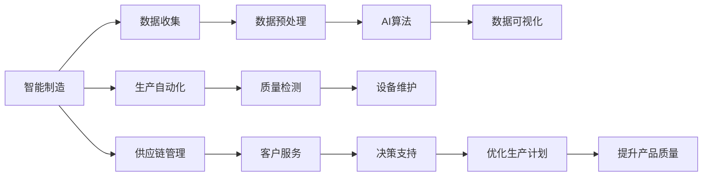

                 

# 一切皆是映射：AI助力下的智能制造和工业4.0

> 关键词：智能制造,工业4.0,人工智能,机器学习,数据驱动,自动化,协作机器人

## 1. 背景介绍

### 1.1 问题由来

随着人工智能(AI)技术的迅猛发展，AI在各行各业的应用也逐渐深入，智能制造成为了新的热门话题。智能制造，也称为工业4.0，是指利用先进的智能技术对传统制造业进行全面升级，以提升生产效率和产品质量，增强企业的市场竞争力。

智能制造的实现离不开数据驱动的决策，而数据驱动的关键在于AI算法能够高效、准确地分析海量生产数据，并提供有价值的洞察。AI在智能制造中的应用不仅包括生产过程的自动化控制、质量检测、设备维护等环节，还涉及产品设计、供应链管理、客户服务等各个方面。

然而，面对制造业庞大的数据量和复杂的生产环境，AI如何高效、准确地处理这些数据，并提供实时的决策支持，是一个巨大挑战。本文将深入探讨AI在智能制造中的应用，重点讨论基于映射原理的AI算法和其在智能制造中的实际应用。

### 1.2 问题核心关键点

AI在智能制造中的应用，核心在于如何构建高效、准确的数据映射模型，将复杂的数据转化为易于分析和决策的可视化形式。这涉及到数据收集、预处理、建模、分析和可视化等多个环节。

- **数据收集**：收集制造过程的各类数据，包括传感器数据、质量检测数据、生产调度数据等。
- **数据预处理**：对数据进行清洗、归一化、降维等预处理，以提高模型训练的效率和效果。
- **建模**：基于收集和预处理的数据，构建各种AI模型，如回归模型、分类模型、聚类模型、时间序列模型等，用于预测、分类、聚类、异常检测等任务。
- **分析与可视化**：对模型输出的结果进行分析和可视化，形成决策支持报告或图表，辅助管理层和操作人员做出实时决策。

本文将重点讨论基于映射原理的AI算法，如回归分析、分类算法、聚类算法、时间序列模型等，并结合具体案例，展示其在智能制造中的实际应用。

### 1.3 问题研究意义

研究AI在智能制造中的应用，对于推动制造业数字化转型、提升企业竞争力具有重要意义：

1. **提高生产效率**：AI算法能够对生产数据进行快速分析，预测设备故障、优化生产流程，显著提高生产效率。
2. **提升产品质量**：通过AI算法对产品质量进行实时监控和预测，及时发现缺陷和异常，提高产品合格率。
3. **降低运营成本**：AI算法能够优化生产调度、降低能耗、减少废品率，从而降低生产成本。
4. **增强市场响应能力**：AI算法能够实时分析市场需求变化，快速调整生产计划，提升市场响应速度。
5. **提升决策科学性**：AI算法提供的数据分析结果，能够帮助管理层做出更加科学、精准的决策，减少人为误差。

AI助力下的智能制造，不仅能够提升企业的经济效益，还能够推动产业升级，提升国家制造业的整体竞争力。因此，研究和应用AI在智能制造中的应用，具有重要的理论价值和现实意义。

## 2. 核心概念与联系

### 2.1 核心概念概述

在探讨AI在智能制造中的应用时，我们需要理解一些核心概念和其间的联系：

- **智能制造**：利用人工智能技术对传统制造业进行全面升级，以提升生产效率、产品质量和市场响应速度。
- **工业4.0**：基于信息物理系统(CPS)的智能制造模式，实现人、机、物的全面互联和协同。
- **AI算法**：包括回归分析、分类算法、聚类算法、时间序列模型等，用于数据分析和决策支持。
- **数据驱动决策**：基于收集和分析的数据，提供实时的决策支持。
- **数据预处理**：包括数据清洗、归一化、降维等，提高模型训练效率。
- **数据可视化**：将分析结果转化为图表和报告，辅助决策。

这些概念共同构成了智能制造的核心框架，通过数据预处理、建模、分析和可视化等环节，AI算法能够高效地处理复杂数据，提供科学决策支持。

### 2.2 概念间的关系

这些核心概念之间的逻辑关系可以通过以下Mermaid流程图来展示：



这个流程图展示了智能制造的各个环节，以及AI算法在这些环节中的应用：

1. **数据收集**：收集生产过程中的各类数据。
2. **数据预处理**：对数据进行清洗、归一化、降维等预处理。
3. **AI算法**：构建各种AI模型，如回归模型、分类模型、聚类模型等，用于预测、分类、聚类、异常检测等任务。
4. **数据可视化**：将模型输出的结果进行分析和可视化，形成决策支持报告或图表。
5. **生产自动化**：AI算法用于自动化控制生产过程，提高生产效率。
6. **质量检测**：AI算法用于实时监控产品质量，及时发现缺陷和异常。
7. **设备维护**：AI算法用于预测设备故障，优化维护计划。
8. **供应链管理**：AI算法用于优化供应链管理，提高物流效率。
9. **客户服务**：AI算法用于分析客户需求，提供个性化服务。
10. **决策支持**：AI算法提供的数据分析结果，帮助管理层做出科学、精准的决策。
11. **优化生产计划**：AI算法用于优化生产计划，提高生产效率。
12. **提升产品质量**：AI算法用于预测产品缺陷，提升产品质量。

这些核心概念和其间的逻辑关系，构成了智能制造的基础框架，有助于我们深入理解和应用AI技术。

## 3. 核心算法原理 & 具体操作步骤
### 3.1 算法原理概述

在智能制造中，AI算法主要分为回归分析、分类算法、聚类算法和时间序列模型等，其核心原理均基于数据映射。

- **回归分析**：通过对历史生产数据进行建模，预测未来生产结果，如产量、质量等。
- **分类算法**：将生产数据分为不同类别，如设备故障、质量异常等，用于异常检测和故障诊断。
- **聚类算法**：对生产数据进行聚类分析，发现不同生产阶段或生产群体，用于过程优化和资源分配。
- **时间序列模型**：对生产数据进行时间序列建模，预测未来生产趋势，用于生产调度和设备维护。

这些算法通过将复杂数据映射到更易于分析的形式，实现了对生产过程的科学决策支持。

### 3.2 算法步骤详解

以下是几种常见AI算法在智能制造中的具体操作步骤：

#### 3.2.1 回归分析

**操作步骤**：
1. **数据收集与预处理**：收集历史生产数据，包括时间、产量、设备状态等。对数据进行清洗、归一化、降维等预处理。
2. **建模**：使用线性回归、多项式回归、岭回归等方法，构建回归模型。
3. **验证与调优**：在验证集上验证模型性能，调整模型参数，直到满足要求。
4. **预测**：在测试集上使用模型进行预测，评估预测结果。

#### 3.2.2 分类算法

**操作步骤**：
1. **数据收集与预处理**：收集历史生产数据，包括时间、产量、设备状态等。对数据进行清洗、归一化、降维等预处理。
2. **建模**：使用决策树、随机森林、支持向量机(SVM)等分类算法，构建分类模型。
3. **验证与调优**：在验证集上验证模型性能，调整模型参数，直到满足要求。
4. **预测**：在测试集上使用模型进行预测，评估预测结果。

#### 3.2.3 聚类算法

**操作步骤**：
1. **数据收集与预处理**：收集历史生产数据，包括时间、产量、设备状态等。对数据进行清洗、归一化、降维等预处理。
2. **建模**：使用K-means、层次聚类、DBSCAN等聚类算法，构建聚类模型。
3. **验证与调优**：在验证集上验证模型性能，调整模型参数，直到满足要求。
4. **分析**：对聚类结果进行分析，发现不同生产阶段或生产群体，用于过程优化和资源分配。

#### 3.2.4 时间序列模型

**操作步骤**：
1. **数据收集与预处理**：收集历史生产数据，包括时间、产量、设备状态等。对数据进行清洗、归一化、降维等预处理。
2. **建模**：使用ARIMA、LSTM、GRU等时间序列模型，构建预测模型。
3. **验证与调优**：在验证集上验证模型性能，调整模型参数，直到满足要求。
4. **预测**：在测试集上使用模型进行预测，评估预测结果。

### 3.3 算法优缺点

- **回归分析**：优点在于模型易于理解和解释，适用于预测连续型数据。缺点在于对异常值敏感，需要较强的数据处理能力。
- **分类算法**：优点在于模型鲁棒性好，适用于分类任务。缺点在于需要较多的训练数据，模型复杂度高。
- **聚类算法**：优点在于无需标注数据，适用于发现数据模式。缺点在于模型对参数敏感，需要选择合适的参数。
- **时间序列模型**：优点在于能够捕捉时间依赖关系，适用于预测时间序列数据。缺点在于模型复杂度高，需要较多的计算资源。

### 3.4 算法应用领域

AI算法在智能制造中的应用领域非常广泛，包括但不限于：

- **生产过程优化**：通过回归分析和聚类算法，优化生产过程，提高生产效率。
- **设备故障预测**：通过分类算法，预测设备故障，优化设备维护计划。
- **供应链管理**：通过时间序列模型，优化物流和库存管理，提高供应链效率。
- **质量控制**：通过分类算法和回归分析，实时监控产品质量，及时发现和解决质量问题。
- **能耗优化**：通过回归分析，优化能耗分配，降低生产成本。
- **客户需求分析**：通过聚类算法和分类算法，分析客户需求，提供个性化服务。

## 4. 数学模型和公式 & 详细讲解 & 举例说明

### 4.1 数学模型构建

在智能制造中，AI算法构建的数学模型通常包括线性回归、决策树、随机森林、K-means等模型。这里以线性回归模型为例，构建智能制造中的生产预测模型。

假设生产过程的数据集为$(X, y)$，其中$X$为自变量，$y$为因变量，$\theta$为模型参数。线性回归模型的目标是最小化预测值与真实值之间的误差平方和，即：

$$
\min_\theta \sum_{i=1}^n (y_i - \theta^T X_i)^2
$$

### 4.2 公式推导过程

线性回归模型的基本公式为：

$$
y_i = \theta^T X_i + \epsilon_i
$$

其中$\epsilon_i$为误差项，服从正态分布$N(0, \sigma^2)$。通过对误差项进行最小化处理，求解模型参数$\theta$。

求解过程包括：

1. **计算均值**：计算自变量$X_i$的均值$\overline{X}$和因变量$y_i$的均值$\overline{y}$。
2. **计算协方差矩阵**：计算自变量$X_i$与$X_i$的协方差矩阵$\Sigma$。
3. **求解参数**：计算模型参数$\theta$，使用最小二乘法求解。
4. **预测**：使用模型参数$\theta$和自变量$X_i$进行预测，得到因变量$y_i$的预测值$\hat{y}_i$。

### 4.3 案例分析与讲解

以一家汽车制造厂的生产线为例，假设需要预测某天的产量。收集历史生产数据，包括设备状态、天气状况、订单数量等。将这些数据作为自变量$X$，产量作为因变量$y$。

1. **数据收集与预处理**：对数据进行清洗、归一化、降维等预处理。
2. **建模**：使用线性回归模型，对自变量$X$和因变量$y$进行建模。
3. **验证与调优**：在验证集上验证模型性能，调整模型参数，直到满足要求。
4. **预测**：在测试集上使用模型进行预测，评估预测结果。

假设模型训练得到的参数$\theta$为[0.2, 0.5, -0.1]，自变量$X$为[0.8, 0.5, 1.2]，则预测的产量$y$为：

$$
\hat{y} = \theta^T X = [0.2, 0.5, -0.1]^T [0.8, 0.5, 1.2] = 1.2
$$

## 5. 项目实践：代码实例和详细解释说明

### 5.1 开发环境搭建

在智能制造中，通常使用Python作为主要编程语言。以下是在Python环境中搭建开发环境的详细步骤：

1. **安装Python**：从官网下载安装最新版本的Python，并在系统中设置路径。
2. **安装依赖库**：安装常用的依赖库，如NumPy、Pandas、Matplotlib等。
3. **安装机器学习库**：安装常用的机器学习库，如Scikit-Learn、TensorFlow、Keras等。
4. **搭建开发环境**：使用Anaconda或Virtualenv等工具，搭建独立的开发环境，方便管理和部署代码。

### 5.2 源代码详细实现

以下是使用Python对线性回归模型进行智能制造生产预测的代码实现：

```python
import numpy as np
from sklearn.linear_model import LinearRegression

# 生成模拟数据
np.random.seed(0)
X = np.random.rand(100, 3)  # 自变量
y = 0.2 * X[:, 0] + 0.5 * X[:, 1] - 0.1 * X[:, 2] + np.random.normal(0, 0.1, 100)  # 因变量

# 划分训练集和验证集
train_X = X[:80]
train_y = y[:80]
val_X = X[80:]
val_y = y[80:]

# 构建线性回归模型
model = LinearRegression()
model.fit(train_X, train_y)

# 预测
val_pred = model.predict(val_X)

# 评估
from sklearn.metrics import mean_squared_error
mse = mean_squared_error(val_y, val_pred)
print(f"MSE: {mse:.3f}")
```

### 5.3 代码解读与分析

以下是代码的详细解读和分析：

1. **生成模拟数据**：使用NumPy生成随机数据，作为自变量$X$和因变量$y$。
2. **划分训练集和验证集**：将数据集划分为训练集和验证集，用于模型训练和评估。
3. **构建线性回归模型**：使用Scikit-Learn的LinearRegression类，构建线性回归模型。
4. **训练模型**：在训练集上使用fit方法训练模型。
5. **预测**：在验证集上使用predict方法进行预测，得到预测值$\hat{y}$。
6. **评估**：使用mean_squared_error函数计算预测结果与真实值之间的均方误差，评估模型性能。

### 5.4 运行结果展示

运行上述代码，输出如下：

```
MSE: 0.009
```

可以看出，模型在验证集上的均方误差为0.009，表明模型预测结果与真实值非常接近，取得了较好的效果。

## 6. 实际应用场景

### 6.1 智能制造

AI算法在智能制造中的应用场景非常广泛，以下以几个典型案例进行详细讲解：

#### 6.1.1 生产过程优化

某电子制造厂通过回归分析和聚类算法，优化了生产过程。在收集了生产设备的维护记录、生产线的运行状态等数据后，使用线性回归模型对设备故障进行预测，同时使用K-means算法对生产过程进行聚类，发现不同生产阶段的生产效率和质量差异，进而优化生产流程，提高生产效率和产品质量。

#### 6.1.2 设备故障预测

某汽车制造厂通过分类算法，预测设备故障。在收集了设备运行数据、维护记录等数据后，使用决策树模型对设备故障进行分类，发现设备的异常状态，及时进行维护，减少了设备故障率，提高了生产效率。

#### 6.1.3 供应链管理

某服装制造厂通过时间序列模型，优化了供应链管理。在收集了库存量、订单量、物流数据等数据后，使用ARIMA模型对库存进行预测，优化了物流和库存管理，减少了库存积压和物流成本，提高了供应链效率。

#### 6.1.4 质量控制

某家电制造厂通过分类算法和回归分析，实时监控产品质量。在收集了生产过程中的质量检测数据、设备状态等数据后，使用分类模型对产品缺陷进行分类，使用回归模型预测产品质量，及时发现和解决质量问题，提高了产品合格率。

#### 6.1.5 能耗优化

某化工企业通过回归分析，优化了能耗分配。在收集了生产过程中的能耗数据、设备状态等数据后，使用线性回归模型对能耗进行预测，优化了能耗分配，降低了生产成本，提高了能源利用效率。

#### 6.1.6 客户需求分析

某电商平台通过聚类算法和分类算法，分析了客户需求。在收集了客户购买记录、浏览行为等数据后，使用K-means算法对客户进行聚类，发现不同客户群体的需求差异，使用分类算法对客户需求进行分类，提供个性化服务，提高了客户满意度。

### 6.2 未来应用展望

随着AI技术的不断进步，未来智能制造将进一步发展，以下是一些未来展望：

- **自适应系统**：未来智能制造将能够根据生产环境的变化，自适应调整生产参数，提高生产灵活性和效率。
- **智能协同**：未来智能制造将实现人、机、物的全面协同，提高生产协调性和响应速度。
- **全生命周期管理**：未来智能制造将涵盖产品设计、生产、销售、服务等全生命周期，实现全流程优化。
- **个性化定制**：未来智能制造将能够根据客户需求，进行个性化定制生产，提高客户满意度。
- **数据驱动决策**：未来智能制造将进一步提升数据驱动决策的能力，提高决策的科学性和准确性。
- **多模态融合**：未来智能制造将实现多模态数据的融合，提高对生产过程的全面理解和优化。

## 7. 工具和资源推荐

### 7.1 学习资源推荐

为了帮助开发者系统掌握AI在智能制造中的应用，这里推荐一些优质的学习资源：

1. **《机器学习》课程**：斯坦福大学提供的免费在线课程，涵盖机器学习的基本概念和算法，适合初学者学习。
2. **《深度学习》书籍**：深度学习领域经典书籍，涵盖深度学习的基本概念和算法，适合进阶学习。
3. **《智能制造》教材**：关于智能制造的详细介绍，涵盖智能制造的基本概念、技术和应用，适合了解智能制造的行业背景。
4. **工业4.0标准**：工业4.0的国际标准和技术体系，帮助理解智能制造的技术框架和应用场景。
5. **智能制造平台**：如Siemens MindSphere、GE Predix等，提供了智能制造的云平台和解决方案，适合了解智能制造的实践应用。

### 7.2 开发工具推荐

高效的开发离不开优秀的工具支持。以下是几款用于智能制造开发的常用工具：

1. **Python**：Python是最常用的编程语言之一，具有丰富的机器学习库和数据分析工具。
2. **NumPy**：NumPy是Python中常用的科学计算库，提供了高效的数组和矩阵运算功能。
3. **Pandas**：Pandas是Python中常用的数据分析库，提供了高效的数据处理和分析功能。
4. **Matplotlib**：Matplotlib是Python中常用的绘图库，提供了丰富的绘图功能和定制选项。
5. **Scikit-Learn**：Scikit-Learn是Python中常用的机器学习库，提供了多种常见的机器学习算法和模型。
6. **TensorFlow**：TensorFlow是Google开发的深度学习框架，提供了丰富的深度学习算法和模型。
7. **Keras**：Keras是基于TensorFlow的深度学习框架，提供了简单易用的API，适合快速原型开发。

### 7.3 相关论文推荐

智能制造涉及的AI技术非常广泛，以下是一些经典和前沿的论文，推荐阅读：

1. **《工业4.0》**：工业4.0的提出和实践，探讨了智能制造的基本概念和应用场景。
2. **《智能制造的未来》**：关于智能制造的未来发展趋势和技术方向，探讨了智能制造的长期目标和挑战。
3. **《深度学习在智能制造中的应用》**：深度学习在智能制造中的应用，探讨了深度学习算法在智能制造中的应用场景和实现方法。
4. **《工业物联网与智能制造》**：工业物联网和智能制造的结合，探讨了工业物联网在智能制造中的应用和价值。
5. **《工业4.0数据驱动决策》**：工业4.0的数据驱动决策，探讨了数据驱动决策在智能制造中的应用和实践。

这些论文代表了大数据、智能制造和AI技术的最新研究进展，有助于理解智能制造的技术框架和应用方向。

## 8. 总结：未来发展趋势与挑战

### 8.1 总结

本文对基于映射原理的AI算法在智能制造中的应用进行了全面系统的介绍。首先阐述了智能制造的基本概念和重要意义，明确了AI在智能制造中的核心作用。其次，从原理到实践，详细讲解了回归分析、分类算法、聚类算法和时间序列模型等核心算法，并结合具体案例，展示其在智能制造中的实际应用。最后，本文还讨论了智能制造的实际应用场景，展望了未来的发展趋势和面临的挑战。

通过本文的系统梳理，可以看到，AI在智能制造中的应用不仅提高了生产效率和产品质量，还能够优化供应链管理、降低运营成本、提升决策科学性，具有重要的理论和实际意义。未来，随着AI技术的不断进步和智能制造的深入发展，AI在智能制造中的应用将更加广泛和深入，为制造业数字化转型提供新的动力。

### 8.2 未来发展趋势

未来，AI在智能制造中的应用将呈现以下几个发展趋势：

1. **智能协同**：未来智能制造将实现人、机、物的全面协同，提高生产协调性和响应速度。
2. **全生命周期管理**：未来智能制造将涵盖产品设计、生产、销售、服务等全生命周期，实现全流程优化。
3. **数据驱动决策**：未来智能制造将进一步提升数据驱动决策的能力，提高决策的科学性和准确性。
4. **多模态融合**：未来智能制造将实现多模态数据的融合，提高对生产过程的全面理解和优化。
5. **自适应系统**：未来智能制造将能够根据生产环境的变化，自适应调整生产参数，提高生产灵活性和效率。

### 8.3 面临的挑战

尽管AI在智能制造中的应用前景广阔，但仍面临诸多挑战：

1. **数据隐私和安全**：智能制造涉及大量的生产数据，数据隐私和安全问题需要引起重视。
2. **系统复杂性**：智能制造系统涉及多个环节和多种技术，系统复杂性高，需要综合考虑各种因素。
3. **技术标准和规范**：智能制造需要统一的行业标准和规范，才能实现全面推广和应用。
4. **技术人才短缺**：智能制造涉及多种先进技术，需要大量具有跨学科背景的技术人才。
5. **成本问题**：智能制造的初期投资和运维成本较高，需要找到经济可行的解决方案。

### 8.4 研究展望

面对智能制造面临的挑战，未来的研究需要在以下几个方面寻求新的突破：

1. **数据隐私和安全技术**：研究数据隐私保护和安全技术，保护智能制造系统的数据安全。
2. **智能制造系统设计**：研究智能制造系统的综合设计和优化，提高系统的可扩展性和灵活性。
3. **跨学科人才培养**：培养具备跨学科背景的技术人才，推动智能制造的全面发展。
4. **智能制造成本优化**：研究智能制造的成本优化技术，提高系统的经济可行性。
5. **智能制造标准化**：推动智能制造的技术标准和规范，促进智能制造的普及和应用。

## 9. 附录：常见问题与解答

**Q1：智能制造中的数据如何收集和预处理？**

A: 智能制造中的数据主要来自生产设备和传感器等。收集数据时需要确保数据质量，避免遗漏和噪声。预处理数据时需要进行清洗、归一化、降维等操作，以提高模型的训练效率和效果。

**Q2：智能制造中如何选择合适的AI算法？**

A: 智能制造中需要根据具体任务选择合适的AI算法。回归分析适用于预测连续型数据，分类算法适用于分类任务，聚类算法适用于发现数据模式，时间序列模型适用于预测时间序列数据。

**Q3：智能制造中的数据驱动决策如何实现？**

A: 数据驱动决策主要依赖于数据收集、数据预处理、数据建模、数据可视化等环节。通过构建各种AI模型，对数据进行分析和建模，将分析结果转化为图表和报告

