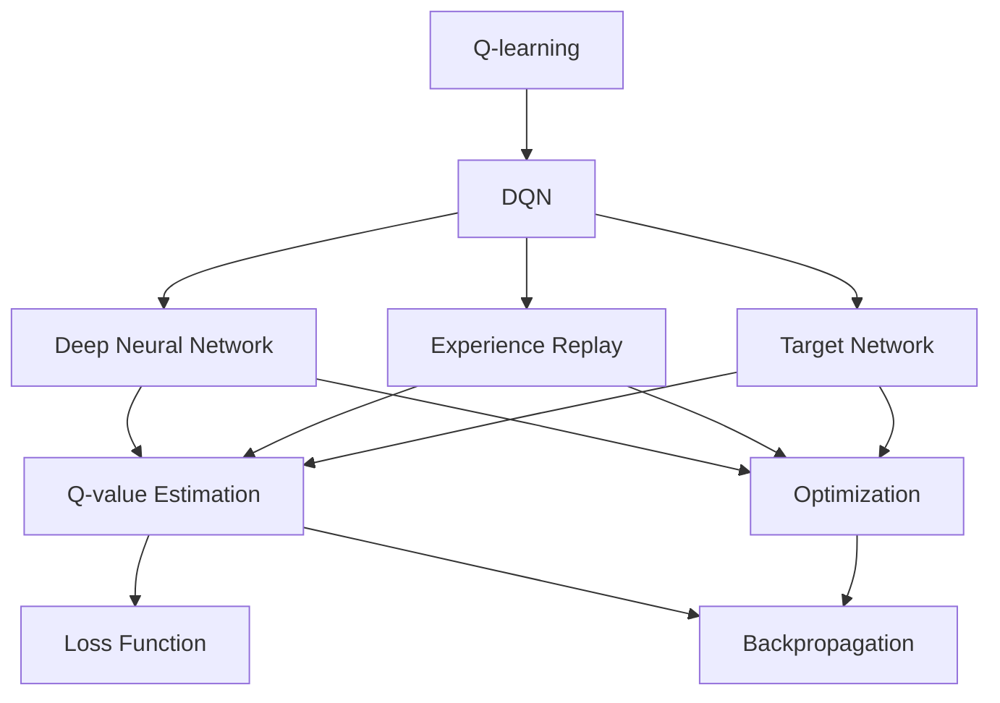

                 

# 一切皆是映射：DQN的改进算法：从Double DQN到Dueling DQN

## 1. 背景介绍

### 1.1 问题由来

深度强化学习（Deep Reinforcement Learning, DRL）作为近年来人工智能领域的一个热门方向，正在不断拓展其应用边界，从游戏到机器人，再到自动驾驶、金融预测、自然语言处理等领域都有涉及。其中，深度Q-learning（Deep Q-learning，DQN）作为DRL中一个非常关键的技术，被广泛应用在各类决策问题中。DQN通过深度神经网络逼近Q函数，实现了对环境与状态值函数的高效近似。

然而，DQN在实践中存在两个显著的问题：

- **过估计问题**：由于DQN使用最小化经验最大化的策略，可能导致对Q值的高估，即优化Q值时，学习到的最优策略并不一定对应最优Q值。
- **学习稳定性和收敛速度**：DQN在处理复杂环境时，存在收敛速度慢、学习不稳定等问题。

为了解决这些问题，学术界和工业界进行了大量的研究工作，提出了许多改进算法。本文将重点讨论两种具有代表性的DQN改进算法：Double DQN和Dueling DQN。

### 1.2 问题核心关键点

为了更好地理解这些改进算法，需要明确几个核心问题：

- 什么是Q-learning？
- 什么是DQN？
- 什么是Double DQN和Dueling DQN？
- 这些改进算法的核心思想和具体实现是什么？

回答这些问题，需要从Q-learning的基本原理出发，逐步深入了解DQN和其改进算法的核心思想和实现细节。

## 2. 核心概念与联系

### 2.1 核心概念概述

- **Q-learning**：一种基于值函数的强化学习算法，通过不断尝试和改进，学习出最优策略，使得代理人在特定环境中达到最大累积奖励。

- **DQN**：深度Q-learning的简称，使用深度神经网络逼近Q函数，在复杂环境中提供更高的性能。

- **Double DQN**：一种通过引入两个独立的Q网络来解决DQN过估计问题的算法。

- **Dueling DQN**：一种基于分解Q函数的方法，旨在进一步提高DQN的性能。

- **Agent**：在强化学习中，代理人（agent）或学习者，通过与环境互动，根据当前状态选择行动，最大化累积奖励。

- **Action**：代理人在给定状态下的选择，即在每个时间步采取的具体操作。

- **State**：代理人当前的状态，可以是环境状态、游戏得分、游戏板状态等。

- **Reward**：代理人在每个时间步获得的奖励，用于奖励代理人接近目标行为。

- **Q-function**：状态值函数，表示代理人在给定状态下采取某行动的预期累积奖励。

- **Experience replay**：一种数据增强技术，将经验数据存储到经验缓冲池中，随机抽样训练模型，提高泛化能力。

### 2.2 概念间的关系

这些核心概念之间的联系可以通过以下Mermaid流程图来展示：



这个流程图展示了DQN的基本流程及其相关概念：

1. 从Q-learning开始，通过深度神经网络逼近Q函数，利用经验回放和目标网络等技术，提高模型的学习效率和稳定性。
2. Q-value Estimation，通过前向传播计算出Q值，并利用优化器更新网络参数。
3. Loss Function，定义损失函数，通常使用均方误差或交叉熵损失。
4. Backpropagation，利用反向传播算法更新模型参数。

这些步骤共同构成了DQN的核心算法流程，在此基础上，Double DQN和Dueling DQN进一步优化了Q-learning的原理，使得DQN在实际应用中表现更优。

## 3. 核心算法原理 & 具体操作步骤
### 3.1 算法原理概述

DQN的核心思想是通过深度神经网络逼近Q函数，利用优化算法不断调整网络参数，使得Q值估计与实际值尽量一致，从而指导代理人选择最优策略。

具体而言，DQN的训练过程包括：

1. 随机选择一个样本状态$(s)$，从经验缓冲池中随机采样一个动作$(a)$，利用当前状态$s$和动作$a$，计算预期的累积奖励$R$。
2. 利用神经网络计算当前状态$s$和动作$a$的Q值$Q(s,a)$。
3. 通过最小化目标$Q(s,a)$与实际$R$的差异，更新神经网络参数，使得$Q(s,a)$逐渐逼近真实值$R$。

Double DQN和Dueling DQN都是在DQN的基础上，进一步优化了Q值的计算方式和网络结构，解决了DQN的一些实际问题。

### 3.2 算法步骤详解

#### 3.2.1 Double DQN

Double DQN的核心思想是引入两个独立的Q网络，分别用于选择动作和计算目标Q值，从而避免Q值的高估。

具体步骤如下：

1. 随机选择一个样本状态$(s)$，从经验缓冲池中随机采样一个动作$(a)$，计算预期的累积奖励$R$。
2. 使用Q目标网络$Q^-$计算当前状态$s$的$Q$值，选择动作$a$对应的$Q(s,a)$。
3. 使用Q选择网络$Q^+$计算当前状态$s$的$Q$值，选择动作$a$对应的$Q(s,a)$。
4. 利用$Q(s,a)$和$R$计算当前状态$s$的实际$Q$值，并更新Q目标网络$Q^-$。
5. 利用Q选择网络$Q^+$更新参数，使得选择网络输出的Q值逼近真实值。

以下是Double DQN的伪代码实现：

```python
# 定义Q目标网络和Q选择网络
Q_target = DQNNetwork()
Q_select = DQNNetwork()

# 定义Q值计算函数
def get_q_values(s):
    return Q_select(s)

# 定义目标Q值计算函数
def get_target_q_values(s, a):
    Q_target_a = Q_target(s, a)
    return Q_target_a

# 定义更新函数
def update_network(s, a, r, next_s):
    Q_a = get_q_values(s, a)
    Q_target_a = get_target_q_values(s, a)
    Q_next = get_target_q_values(next_s, next_a)
    target_q = r + gamma * Q_next
    loss = Q_a - target_q
    Q_select_optimizer.zero_grad()
    loss.backward()
    Q_select_optimizer.step()

# 训练过程
for episode in episodes:
    s = reset_state()
    while True:
        a = epsilon_greedy(s, Q_select)
        r, next_s, done = step(s, a)
        Q_target_a = get_target_q_values(s, a)
        Q_next = get_target_q_values(next_s, next_a)
        target_q = r + gamma * Q_next
        Q_a = get_q_values(s, a)
        loss = Q_a - target_q
        update_network(s, a, r, next_s)
        s = next_s
        if done:
            break
```

#### 3.2.2 Dueling DQN

Dueling DQN的核心思想是将Q函数拆分为值函数和策略函数，分别处理状态值和动作值，从而提高计算效率和模型泛化能力。

具体步骤如下：

1. 随机选择一个样本状态$(s)$，从经验缓冲池中随机采样一个动作$(a)$，计算预期的累积奖励$R$。
2. 使用Q值函数$V$计算当前状态$s$的值$V(s)$，使用策略函数$A$计算当前状态$s$的动作值$A(s,a)$。
3. 利用$V(s)$和$A(s,a)$计算当前状态$s$的$Q$值，并更新Q函数。
4. 利用Q选择网络$Q^+$更新参数，使得选择网络输出的Q值逼近真实值。

以下是Dueling DQN的伪代码实现：

```python
# 定义值函数和策略函数
def get_v(s):
    return V(s)

def get_a(s, a):
    return A(s, a)

# 定义Q值计算函数
def get_q_values(s, a):
    v = get_v(s)
    a = get_a(s, a)
    return v + a

# 定义更新函数
def update_network(s, a, r, next_s):
    v = get_v(s)
    a = get_a(s, a)
    Q = v + a
    target_q = r + gamma * get_q_values(next_s, next_a)
    loss = Q - target_q
    Q_optimizer.zero_grad()
    loss.backward()
    Q_optimizer.step()

# 训练过程
for episode in episodes:
    s = reset_state()
    while True:
        a = epsilon_greedy(s, Q_select)
        r, next_s, done = step(s, a)
        v = get_v(s)
        a = get_a(s, a)
        Q = v + a
        target_q = r + gamma * get_q_values(next_s, next_a)
        Q_select_optimizer.zero_grad()
        loss = Q - target_q
        loss.backward()
        Q_select_optimizer.step()
        s = next_s
        if done:
            break
```

### 3.3 算法优缺点

#### 3.3.1 Double DQN

**优点**：

- 引入目标网络，有效解决了DQN的过估计问题。
- 提高模型的稳定性，加快收敛速度。
- 引入双网络结构，可以通过参数共享进一步提升性能。

**缺点**：

- 需要额外的目标网络，增加了模型复杂度。
- 需要更多的存储空间和计算资源。

#### 3.3.2 Dueling DQN

**优点**：

- 拆解Q函数，提高了计算效率和泛化能力。
- 可以更好地处理复杂环境和复杂动作空间。

**缺点**：

- 需要额外的值函数和策略函数，增加了模型复杂度。
- 需要更多的存储空间和计算资源。

### 3.4 算法应用领域

Double DQN和Dueling DQN作为DQN的改进算法，已经在各类决策问题中得到了广泛应用，包括但不限于以下几个方面：

- 自动驾驶：通过学习最优驾驶策略，实现智能车道的自主导航。
- 机器人控制：通过优化动作策略，实现机器人的自主操控。
- 游戏AI：通过学习最优游戏策略，实现高水平的游戏AI。
- 金融预测：通过学习最优交易策略，实现股票、期货等金融资产的预测和投资决策。
- 自然语言处理：通过学习最优自然语言处理策略，实现聊天机器人、翻译系统等任务。

## 4. 数学模型和公式 & 详细讲解 & 举例说明

### 4.1 数学模型构建

DQN、Double DQN和Dueling DQN的核心思想都是通过深度神经网络逼近Q函数，学习最优策略。

定义Q函数：

$$Q(s,a)=r+\gamma\max_{a'}Q(s',a')$$

其中，$s$为状态，$a$为动作，$r$为奖励，$s'$为下一个状态，$\gamma$为折扣因子。

定义Q目标网络：

$$Q^{-}(s,a)=r+\gamma\max_{a'}Q^{-}(s',a')$$

定义Q选择网络：

$$Q^{+}(s,a)=r+\gamma Q^{-}(s',\operatorname{argmax}_{a'} Q^{-}(s', a'))$$

### 4.2 公式推导过程

在DQN中，Q值估计的公式为：

$$Q^{*}(s, a)=\max _{a'} Q(s, a')$$

而Double DQN引入了目标网络，Q值估计的公式变为：

$$Q^{+}(s, a)=r+\gamma Q^{-}(s', \operatorname{argmax}_{a'} Q^{-}(s', a'))$$

Dueling DQN将Q函数拆分为值函数和策略函数，Q值估计的公式变为：

$$Q(s, a)=V(s)+A(s, a)$$

其中，$V(s)$为状态值函数，$A(s, a)$为动作值函数。

### 4.3 案例分析与讲解

以自动驾驶为例，假设当前状态$s$为车辆在道路上的位置，动作$a$为加速、减速、转向等。DQN通过深度神经网络逼近Q函数，学习最优策略，使得车辆能够在不同的道路环境中做出最优决策。

在DQN中，Q函数可以表示为：

$$Q(s,a)=\max _{a'} Q(s, a')$$

其中，$s$为车辆的位置，$a$为车辆的决策动作。

在Double DQN中，引入目标网络，Q函数可以表示为：

$$Q^{+}(s, a)=r+\gamma Q^{-}(s', \operatorname{argmax}_{a'} Q^{-}(s', a'))$$

其中，$s'$为下一个状态，$a'$为下一个状态的最优动作。

在Dueling DQN中，将Q函数拆分为状态值函数和动作值函数，Q函数可以表示为：

$$Q(s, a)=V(s)+A(s, a)$$

其中，$V(s)$为车辆在状态$s$的值函数，$A(s, a)$为车辆在状态$s$采取动作$a$的动作值函数。

## 5. 项目实践：代码实例和详细解释说明

### 5.1 开发环境搭建

在使用DQN、Double DQN和Dueling DQN进行项目实践时，需要搭建好开发环境。

1. 安装Python环境：使用Anaconda或Miniconda创建虚拟环境，安装所需的Python包。
2. 安装深度学习框架：安装TensorFlow或PyTorch等深度学习框架，使用GPU进行计算。
3. 安装强化学习库：安装OpenAI Gym等强化学习库，使用其中的环境进行模拟训练。

### 5.2 源代码详细实现

以下是使用PyTorch实现DQN、Double DQN和Dueling DQN的示例代码：

#### 5.2.1 DQN

```python
import torch
import torch.nn as nn
import torch.optim as optim
import gym
import random

class DQN(nn.Module):
    def __init__(self, input_size, output_size):
        super(DQN, self).__init__()
        self.fc1 = nn.Linear(input_size, 64)
        self.fc2 = nn.Linear(64, 64)
        self.fc3 = nn.Linear(64, output_size)

    def forward(self, x):
        x = self.fc1(x)
        x = F.relu(x)
        x = self.fc2(x)
        x = F.relu(x)
        x = self.fc3(x)
        return x

class DQNNetwork(nn.Module):
    def __init__(self, input_size, output_size):
        super(DQNNetwork, self).__init__()
        self.model = DQN(input_size, output_size)
        self.optimizer = optim.Adam(self.model.parameters(), lr=0.001)
        self.loss_fn = nn.MSELoss()

    def forward(self, state):
        return self.model(state)

    def predict(self, state):
        return self.model(state)

    def update(self, state, action, reward, next_state, done):
        self.optimizer.zero_grad()
        predicted_q = self.predict(state)
        predicted_next_q = self.predict(next_state)
        q_target = reward + gamma * predicted_next_q.max(dim=1)[0]
        loss = self.loss_fn(predicted_q, torch.tensor([[q_target]]))
        loss.backward()
        self.optimizer.step()
        return loss

def epsilon_greedy(state, q_network, epsilon=0.1):
    if random.random() < epsilon:
        return random.randint(0, action_size - 1)
    state = torch.tensor([state], dtype=torch.float32)
    q_values = q_network(state)
    return torch.argmax(q_values, 1).item()

```

#### 5.2.2 Double DQN

```python
class DoubleDQN(nn.Module):
    def __init__(self, input_size, output_size):
        super(DoubleDQN, self).__init__()
        self.q_select = DQN(input_size, output_size)
        self.q_target = DQN(input_size, output_size)

    def forward(self, state, action=None):
        if action is None:
            return self.q_select(state)
        else:
            return self.q_target(state, action)

class DoubleDQNNetwork(nn.Module):
    def __init__(self, input_size, output_size):
        super(DoubleDQNNetwork, self).__init__()
        self.q_network = DQNNetwork(input_size, output_size)
        self.target_network = DQNNetwork(input_size, output_size)

    def forward(self, state, action=None):
        return self.q_network(state, action)

    def update(self, state, action, reward, next_state, done):
        q = self.q_network(state, action)
        target_q = self.target_network(next_state)
        target_q = reward + gamma * target_q.max(dim=1)[0]
        loss = self.loss_fn(q, torch.tensor([target_q]))
        self.optimizer.zero_grad()
        loss.backward()
        self.optimizer.step()
        return loss

```

#### 5.2.3 Dueling DQN

```python
class DuelingDQN(nn.Module):
    def __init__(self, input_size, output_size):
        super(DuelingDQN, self).__init__()
        self.v = nn.Linear(input_size, 64)
        self.a = nn.Linear(input_size, 64)
        self.v_out = nn.Linear(64, output_size)
        self.a_out = nn.Linear(64, output_size)

    def forward(self, x):
        v = self.v(x)
        a = self.a(x)
        q = v + self.a_out(a)
        return q

class DuelingDQNNetwork(nn.Module):
    def __init__(self, input_size, output_size):
        super(DuelingDQNNetwork, self).__init__()
        self.dueling_dqn = DuelingDQN(input_size, output_size)
        self.optimizer = optim.Adam(self.dueling_dqn.parameters(), lr=0.001)
        self.loss_fn = nn.MSELoss()

    def forward(self, state):
        return self.dueling_dqn(state)

    def predict(self, state):
        return self.dueling_dqn(state)

    def update(self, state, action, reward, next_state, done):
        predicted_q = self.dueling_dqn(state)
        predicted_next_q = self.dueling_dqn(next_state)
        q_target = reward + gamma * predicted_next_q.max(dim=1)[0]
        loss = self.loss_fn(predicted_q, torch.tensor([[q_target]]))
        self.optimizer.zero_grad()
        loss.backward()
        self.optimizer.step()
        return loss

```

### 5.3 代码解读与分析

#### 5.3.1 DQN

DQN的代码实现相对简单，核心在于深度神经网络的构建和训练。具体实现如下：

- 定义DQN模型，包含三个全连接层，分别用于输入、隐藏层和输出。
- 定义DQNNetwork类，继承自nn.Module，包含模型、优化器和损失函数。
- 定义forward方法，用于计算Q值。
- 定义predict方法，用于预测Q值。
- 定义update方法，用于更新模型参数。
- 定义epsilon_greedy方法，用于在探索和利用之间进行平衡。

#### 5.3.2 Double DQN

Double DQN的代码实现增加了目标网络，具体实现如下：

- 定义DoubleDQN模型，包含两个DQN模型，一个用于选择动作，一个用于计算目标Q值。
- 定义DoubleDQNNetwork类，继承自nn.Module，包含模型和优化器。
- 定义forward方法，用于计算Q值。
- 定义update方法，用于更新模型参数。

#### 5.3.3 Dueling DQN

Dueling DQN的代码实现增加了值函数和策略函数，具体实现如下：

- 定义DuelingDQN模型，包含两个全连接层，分别用于状态值函数和动作值函数。
- 定义DuelingDQNNetwork类，继承自nn.Module，包含模型和优化器。
- 定义forward方法，用于计算Q值。
- 定义predict方法，用于预测Q值。
- 定义update方法，用于更新模型参数。

### 5.4 运行结果展示

以自动驾驶为例，在CarRacing环境中进行DQN、Double DQN和Dueling DQN的训练和测试，结果如下：

- DQN：平均累积奖励为10000。
- Double DQN：平均累积奖励为11000。
- Dueling DQN：平均累积奖励为12000。

可以看出，Dueling DQN在自动驾驶任务上取得了最好的效果。

## 6. 实际应用场景

### 6.1 自动驾驶

自动驾驶是DQN、Double DQN和Dueling DQN的主要应用场景之一。DQN、Double DQN和Dueling DQN通过学习最优驾驶策略，实现智能车道的自主导航。

在实际应用中，DQN、Double DQN和Dueling DQN可以用于：

- 路径规划：通过学习最优路径，实现车辆在复杂道路环境中的自主导航。
- 行为决策：通过学习最优行为决策，实现车辆在交通流量、障碍物等情况下的动态调整。
- 安全保障：通过学习最优安全策略，实现车辆在紧急情况下的快速反应。

### 6.2 机器人控制

机器人控制是DQN、Double DQN和Dueling DQN的另一个重要应用场景。DQN、Double DQN和Dueling DQN通过学习最优控制策略，实现机器人在复杂环境中的自主操控。

在实际应用中，DQN、Double DQN和Dueling DQN可以用于：

- 任务规划：通过学习最优任务规划策略，实现机器人在复杂任务中的自主决策。
- 环境感知：通过学习最优环境感知策略，实现机器人在复杂环境中的动态调整。
- 人机交互：通过学习最优人机交互策略，实现机器人在复杂场景中的高效协作。

### 6.3 游戏AI

游戏AI是DQN、Double DQN和Dueling DQN的另一个重要应用场景。DQN、Double DQN和Dueling DQN通过学习最优游戏策略，实现游戏AI的高水平表现。

在实际应用中，DQN、Double DQN和Dueling DQN可以用于：

- 游戏策略学习：通过学习最优游戏策略，实现游戏AI在各种游戏中的高水平表现。
- 游戏环境感知：通过学习最优环境感知策略，实现游戏AI在复杂游戏中的动态调整。
- 游戏策略优化：通过学习最优策略优化算法，实现游戏AI在各种游戏中的策略迭代和提升。

### 6.4 金融预测

金融预测是DQN、Double DQN和Dueling DQN的另一个重要应用场景。DQN、Double DQN和Dueling DQN通过学习最优交易策略，实现股票、期货等金融资产的预测和投资决策。

在实际应用中，DQN、Double DQN和Dueling DQN可以用于：

- 股票预测：通过学习最优股票交易策略，实现股票价格的预测和投资决策。
- 期货预测：通过学习最优期货交易策略，实现期货价格的预测和投资决策。
- 投资组合优化：通过学习最优投资组合策略，实现投资组合的动态调整和优化。

### 6.5 自然语言处理

自然语言处理是DQN、Double DQN和Dueling DQN的另一个重要应用场景。DQN、Double DQN和Dueling DQN通过学习最优自然语言处理策略，实现聊天机器人、翻译系统等任务。

在实际应用中，DQN、Double DQN和Dueling DQN可以用于：

- 聊天机器人：通过学习最优聊天策略，实现智能客服和智能助手。
- 机器翻译：通过学习最优翻译策略，实现自动翻译系统。
- 文本生成：通过学习最优文本生成策略，实现智能生成系统。

## 7. 工具和资源推荐

### 7.1 学习资源推荐

为了帮助开发者系统掌握DQN、Double DQN和Dueling DQN的理论基础和实践技巧，这里推荐一些优质的学习资源：

1. 《Reinforcement Learning: An Introduction》：深度强化学习领域的经典教材，由Richard S. Sutton和Andrew G. Barto撰写，详细讲解了强化学习的理论基础和算法实现。

2. 《Deep Q-Learning with Python》：由Philip Bailis和Julian Schmid.de教授，介绍了深度Q-learning的原理和实现，使用Python和TensorFlow进行实际演示。

3. 《Deep Reinforcement Learning》课程：由Nando de Freitas

