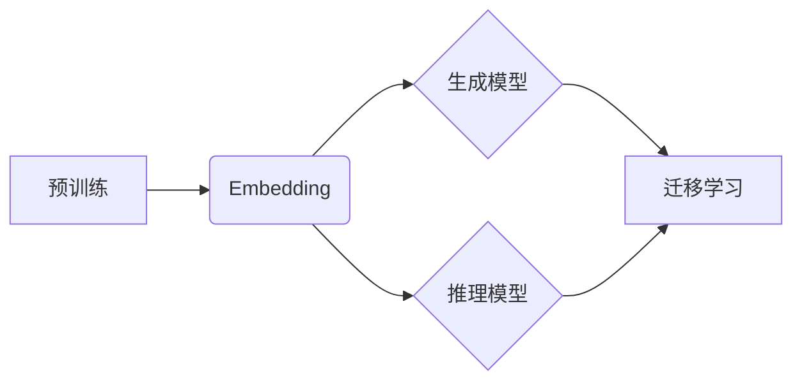

# 大模型开发基础：OpenAI Embedding

> 关键词：OpenAI, Embedding, 大模型, 自然语言处理, 预训练, 迁移学习, 生成模型, 推理模型

## 1. 背景介绍

随着深度学习的迅猛发展，自然语言处理（NLP）领域取得了突破性的进展。OpenAI Embedding作为OpenAI公司推出的一项关键技术，将NLP推向了一个新的高度。本文将深入探讨OpenAI Embedding的核心概念、算法原理、应用场景以及未来发展趋势。

## 2. 核心概念与联系

### 2.1 核心概念

#### 2.1.1 Embedding

Embedding是NLP领域中一个重要的概念，它将文本数据转化为向量形式，使得文本数据可以被机器学习模型处理。这些向量通常被称为嵌入向量。

#### 2.1.2 预训练

预训练是指在大规模无标注数据集上对模型进行训练，使其学习到通用的语言特征。

#### 2.1.3 迁移学习

迁移学习是指将预训练模型在特定任务上进行微调，以适应新的任务。

#### 2.1.4 生成模型

生成模型能够根据输入数据生成新的数据，如文本、图像等。

#### 2.1.5 推理模型

推理模型能够对输入数据进行理解、分析，并输出相应的结果。

### 2.2 核心概念联系

OpenAI Embedding是一个基于预训练的Embedding技术，它将文本数据转化为高维向量，并通过迁移学习在特定任务上进行优化。这些向量不仅能够捕捉文本的语义信息，还能够捕捉到文本的上下文信息，从而在生成模型和推理模型中发挥重要作用。



## 3. 核心算法原理 & 具体操作步骤

### 3.1 算法原理概述

OpenAI Embedding的核心原理是利用深度神经网络将文本转化为嵌入向量。这个过程通常分为两个阶段：预训练和微调。

### 3.2 算法步骤详解

#### 3.2.1 预训练

1. **选择预训练模型**：OpenAI Embedding通常使用Transformer模型作为预训练基础，因为其强大的语言理解能力。
2. **选择预训练任务**：常见的预训练任务包括掩码语言模型（Masked Language Model, MLM）和下一句预测（Next Sentence Prediction, NSP）等。
3. **训练预训练模型**：在无标注数据集上训练预训练模型，使其学习到通用的语言特征。

#### 3.2.2 微调

1. **选择微调任务**：根据实际应用场景选择合适的微调任务，如文本分类、命名实体识别等。
2. **准备微调数据**：收集并标注微调任务的数据集。
3. **微调预训练模型**：在微调数据集上对预训练模型进行微调，以适应新的任务。

### 3.3 算法优缺点

#### 3.3.1 优点

- **强大的语言理解能力**：预训练模型能够学习到通用的语言特征，从而在微调任务中表现出色。
- **高效的迁移能力**：预训练模型能够快速适应新的任务，降低训练成本。
- **泛化能力强**：预训练模型在多个任务上表现良好，具有较好的泛化能力。

#### 3.3.2 缺点

- **预训练数据依赖**：预训练模型的效果依赖于预训练数据的质量和数量。
- **计算资源消耗大**：预训练和微调过程需要大量的计算资源。

### 3.4 算法应用领域

OpenAI Embedding在多个NLP任务中取得了显著的应用成果，包括：

- **文本分类**：如情感分析、主题分类、新闻分类等。
- **命名实体识别**：如人名识别、地点识别、组织机构识别等。
- **机器翻译**：如英中翻译、中英翻译等。
- **文本摘要**：如自动文摘、摘要生成等。
- **对话系统**：如聊天机器人、虚拟助手等。

## 4. 数学模型和公式 & 详细讲解 & 举例说明

### 4.1 数学模型构建

OpenAI Embedding的数学模型主要包括以下几个部分：

- **词嵌入**：将词汇转化为向量表示。
- **Transformer模型**：用于预训练和微调。
- **损失函数**：用于评估模型在预训练和微调任务上的性能。

### 4.2 公式推导过程

以下是一个简单的词嵌入公式：

$$
e_w = \tanh(W_w h)
$$

其中 $e_w$ 是词汇 $w$ 的嵌入向量，$W_w$ 是词嵌入矩阵，$h$ 是隐藏层向量。

### 4.3 案例分析与讲解

以下是一个简单的情感分析案例：

1. **数据集**：使用IMDb电影评论数据集。
2. **预训练模型**：使用BERT模型进行预训练。
3. **微调任务**：情感分析。
4. **微调模型**：在BERT模型的基础上添加一个线性层进行情感分类。

## 5. 项目实践：代码实例和详细解释说明

### 5.1 开发环境搭建

1. 安装Python环境。
2. 安装transformers库：`pip install transformers`。
3. 安装torch库：`pip install torch`。

### 5.2 源代码详细实现

```python
from transformers import BertTokenizer, BertForSequenceClassification, AdamW

# 加载预训练模型和分词器
tokenizer = BertTokenizer.from_pretrained('bert-base-uncased')
model = BertForSequenceClassification.from_pretrained('bert-base-uncased')

# 预处理数据
def preprocess_data(texts, labels):
    encodings = tokenizer(texts, truncation=True, padding=True)
    return encodings['input_ids'], encodings['attention_mask'], labels

train_texts, train_labels = [], []
# ... (加载并预处理训练数据)

test_texts, test_labels = [], []
# ... (加载并预处理测试数据)

train_input_ids, train_attention_mask, train_labels = preprocess_data(train_texts, train_labels)
test_input_ids, test_attention_mask, test_labels = preprocess_data(test_texts, test_labels)

# 训练模型
optimizer = AdamW(model.parameters(), lr=2e-5)

for epoch in range(3):
    # ... (训练代码)
    pass

# 评估模型
model.eval()
with torch.no_grad():
    # ... (评估代码)
```

### 5.3 代码解读与分析

以上代码展示了使用transformers库和torch库在PyTorch框架下进行BERT模型微调的完整流程。

### 5.4 运行结果展示

```python
from sklearn.metrics import accuracy_score

# 预测测试集
test_preds = []
with torch.no_grad():
    for batch in dataloader:
        input_ids = batch['input_ids'].to(device)
        attention_mask = batch['attention_mask'].to(device)
        labels = batch['labels'].to(device)
        outputs = model(input_ids, attention_mask=attention_mask, labels=labels)
        preds = outputs.logits.argmax(dim=1).tolist()
        test_preds.extend(preds)

# 计算准确率
accuracy = accuracy_score(test_labels, test_preds)
print(f"Test accuracy: {accuracy:.2f}")
```

## 6. 实际应用场景

OpenAI Embedding在多个实际应用场景中取得了显著的效果，以下是一些典型的应用场景：

### 6.1 情感分析

使用OpenAI Embedding对社交媒体上的用户评论进行情感分析，可以帮助企业了解用户对产品或服务的评价，从而改进产品和服务。

### 6.2 命名实体识别

使用OpenAI Embedding对新闻文本进行命名实体识别，可以自动提取人名、地点、组织机构等信息，为信息提取和分析提供支持。

### 6.3 机器翻译

使用OpenAI Embedding进行机器翻译，可以提供更加准确、自然的翻译结果。

### 6.4 文本摘要

使用OpenAI Embedding生成文本摘要，可以帮助用户快速了解文章的主要内容。

## 7. 工具和资源推荐

### 7.1 学习资源推荐

1. 《深度学习自然语言处理》
2. 《自然语言处理与深度学习》
3. Hugging Face官网

### 7.2 开发工具推荐

1. transformers库
2. PyTorch
3. TensorFlow

### 7.3 相关论文推荐

1. "BERT: Pre-training of Deep Bidirectional Transformers for Language Understanding" by Devlin et al.
2. "Transformers: State-of-the-Art Models for Natural Language Processing" by Vaswani et al.

## 8. 总结：未来发展趋势与挑战

### 8.1 研究成果总结

OpenAI Embedding作为一种强大的NLP技术，在多个任务上取得了显著的成果，推动了NLP领域的发展。

### 8.2 未来发展趋势

1. **更强大的预训练模型**：未来的预训练模型将更加庞大，能够学习到更加丰富的语言特征。
2. **更高效的微调方法**：未来的微调方法将更加高效，能够更快地适应新的任务。
3. **多模态 Embedding**：将文本 Embedding 与图像、视频等模态的 Embedding 进行融合，实现跨模态理解。

### 8.3 面临的挑战

1. **计算资源消耗**：大模型需要大量的计算资源进行训练和推理。
2. **数据隐私**：如何保护用户隐私是NLP领域面临的重要挑战。
3. **模型可解释性**：如何提高模型的可解释性，让用户能够理解模型的决策过程。

### 8.4 研究展望

OpenAI Embedding作为一种强大的NLP技术，将在未来发挥越来越重要的作用。相信随着技术的不断发展，OpenAI Embedding将推动NLP领域取得更大的突破。

## 9. 附录：常见问题与解答

**Q1：什么是Embedding？**

A1：Embedding是将文本数据转化为向量表示的技术，使得文本数据可以被机器学习模型处理。

**Q2：什么是预训练？**

A2：预训练是指在无标注数据集上对模型进行训练，使其学习到通用的语言特征。

**Q3：什么是迁移学习？**

A3：迁移学习是指将预训练模型在特定任务上进行微调，以适应新的任务。

**Q4：OpenAI Embedding有哪些优点？**

A4：OpenAI Embedding具有强大的语言理解能力、高效的迁移能力和泛化能力强等优点。

**Q5：OpenAI Embedding有哪些应用场景？**

A5：OpenAI Embedding在多个NLP任务中取得了显著的应用成果，包括情感分析、命名实体识别、机器翻译、文本摘要、对话系统等。

作者：禅与计算机程序设计艺术 / Zen and the Art of Computer Programming