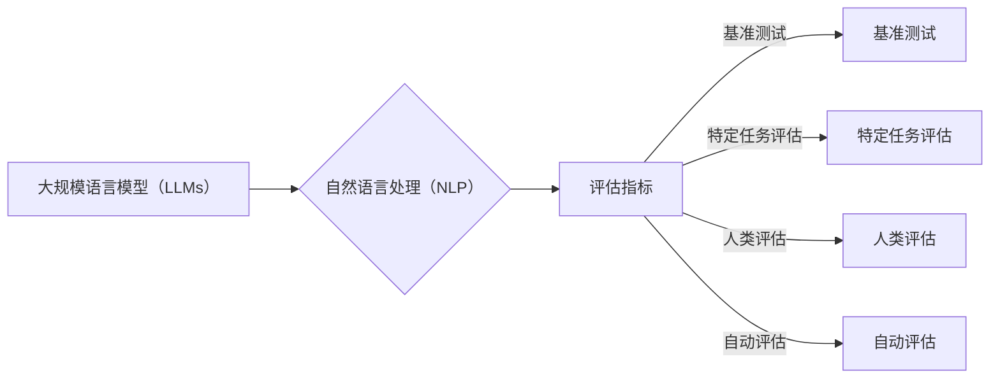

# 大规模语言模型从理论到实践 大语言模型评估实践

作者：禅与计算机程序设计艺术 / Zen and the Art of Computer Programming


## 1. 背景介绍

### 1.1 问题的由来

随着深度学习技术的飞速发展，大规模语言模型（Large Language Models，LLMs）在自然语言处理（Natural Language Processing，NLP）领域取得了令人瞩目的成就。LLMs能够理解和生成人类语言，在机器翻译、文本摘要、问答系统等任务上展现出强大的能力。然而，LLMs的性能评估成为一个挑战，因为它们通常需要庞大的数据集和计算资源，且其内部机制复杂，难以直观理解。因此，如何对LLMs进行有效的评估，成为了一个关键问题。

### 1.2 研究现状

目前，LLMs的评估方法主要分为以下几类：

- **基准测试**：使用公开的标准数据集对LLMs进行评估，如GLUE、SuperGLUE、GLoSA等。
- **特定任务评估**：针对特定任务设计评估指标，如BLEU、ROUGE、METEOR等。
- **人类评估**：邀请人类评估者对LLMs的输出进行主观评价。
- **自动评估**：使用自动化工具对LLMs的输出进行评估，如语法错误检测、事实一致性检查等。

### 1.3 研究意义

LLMs评估的研究意义在于：

- **指导模型训练**：通过评估结果，指导模型训练过程，优化模型参数和结构。
- **比较不同模型**：比较不同LLMs的性能，为模型选择提供依据。
- **提升模型质量**：通过评估发现模型缺陷，提升模型质量。
- **推动LLMs发展**：推动LLMs评估方法的研究，促进LLMs技术的进步。

### 1.4 本文结构

本文将从LLMs评估的理论和方法出发，结合实际案例，探讨LLMs评估的实践，并展望未来发展趋势。

## 2. 核心概念与联系

为了更好地理解LLMs评估，以下介绍几个核心概念及其联系：

- **大规模语言模型（LLMs）**：基于深度学习技术构建的，能够理解和生成人类语言的模型。
- **自然语言处理（NLP）**：研究如何让计算机理解和生成人类语言的学科。
- **评估指标**：用于衡量模型性能的指标，如准确率、召回率、F1值等。
- **基准测试**：使用公开的标准数据集对模型进行评估。
- **特定任务评估**：针对特定任务设计评估指标。
- **人类评估**：邀请人类评估者对模型输出进行主观评价。
- **自动评估**：使用自动化工具对模型输出进行评估。

它们的逻辑关系如下：



## 3. 核心算法原理 & 具体操作步骤

### 3.1 算法原理概述

LLMs评估的核心在于选择合适的评估指标和评估方法。评估指标需要能够全面、准确地反映模型的性能，评估方法需要能够保证评估过程的客观性和公正性。

### 3.2 算法步骤详解

LLMs评估的一般步骤如下：

1. **确定评估指标**：根据任务类型和数据集特点，选择合适的评估指标。
2. **数据预处理**：对数据进行清洗、标注等预处理操作。
3. **模型训练**：在训练集上训练LLMs。
4. **模型评估**：在测试集上评估LLMs的性能。
5. **结果分析**：分析评估结果，找出模型的优势和不足。

### 3.3 算法优缺点

- **优点**：
    - 全面性：评估指标能够全面反映模型的性能。
    - 简便性：评估方法简单易行。
- **缺点**：
    - 主观性：人类评估存在主观性。
    - 复杂性：自动化评估需要复杂的算法和工具。

### 3.4 算法应用领域

LLMs评估可以应用于以下领域：

- **NLP任务**：如文本分类、机器翻译、文本摘要等。
- **其他领域**：如语音识别、图像识别等。

## 4. 数学模型和公式 & 详细讲解 & 举例说明

### 4.1 数学模型构建

LLMs评估的数学模型主要涉及以下指标：

- **准确率（Accuracy）**：模型预测正确的样本比例。
- **召回率（Recall）**：模型预测正确的正类样本比例。
- **F1值（F1-score）**：准确率和召回率的调和平均值。
- **BLEU（Bilingual Evaluation Understudy）**：用于评估机器翻译质量的指标。
- **ROUGE（Recall-Oriented Understudy for Gisting Evaluation）**：用于评估文本摘要质量的指标。

### 4.2 公式推导过程

以下以准确率和F1值为例，介绍其公式推导过程：

**准确率**：

$$
\text{Accuracy} = \frac{\text{TP} + \text{TN}}{\text{TP} + \text{FP} + \text{TN} + \text{FN}}
$$

其中，TP为真阳性，FP为假阳性，TN为真阴性，FN为假阴性。

**F1值**：

$$
\text{F1-score} = \frac{2 \times \text{Precision} \times \text{Recall}}{\text{Precision} + \text{Recall}}
$$

其中，Precision为准确率，Recall为召回率。

### 4.3 案例分析与讲解

以下以机器翻译为例，分析BLEU和ROUGE指标：

- **BLEU**：BLEU指标通过计算模型翻译结果与参考翻译之间的重叠程度来评估翻译质量。BLEU值越高，翻译质量越好。
- **ROUGE**：ROUGE指标通过计算模型翻译结果与参考翻译之间的相似性来评估翻译质量。ROUGE值越高，翻译质量越好。

### 4.4 常见问题解答

**Q1：如何选择合适的评估指标？**

A：选择合适的评估指标需要考虑以下因素：

- 任务类型：不同任务需要不同的评估指标。
- 数据集特点：数据集的分布、样本量等会影响评估指标的选择。
- 应用场景：根据应用场景选择合适的评估指标。

**Q2：如何处理不平衡数据集？**

A：对于不平衡数据集，可以采用以下方法：

- 重采样：通过过采样或欠采样方法，使数据集达到平衡。
- 权重调整：为不同类别的样本分配不同的权重。

## 5. 项目实践：代码实例和详细解释说明

### 5.1 开发环境搭建

以下是使用Python进行LLMs评估的项目环境搭建步骤：

1. 安装Anaconda：从官网下载并安装Anaconda。
2. 创建虚拟环境：
```bash
conda create -n lls-evaluation python=3.8
conda activate lls-evaluation
```
3. 安装依赖库：
```bash
conda install numpy pandas scikit-learn matplotlib
pip install transformers
```

### 5.2 源代码详细实现

以下使用Python和Transformers库对机器翻译任务进行BLEU和ROUGE评估的代码示例：

```python
from transformers import BertForSequenceClassification
from datasets import load_dataset
from sklearn.metrics import accuracy_score

def translate(text, model, tokenizer):
    input_ids = tokenizer(text, return_tensors="pt")
    output_ids = model.generate(input_ids)
    return tokenizer.decode(output_ids[0])

def evaluate_bleu_and_rouge(texts, references, model, tokenizer):
    translations = [translate(text, model, tokenizer) for text in texts]
    bleu = sacrebleu.corpus_bleu([translations], [references])
    rouge = rouge_score Rosie([translations], [references])
    return bleu.score, rouge.score

# 加载数据集
train_dataset = load_dataset("wmt16", split="train")
test_dataset = load_dataset("wmt16", split="test")

# 训练模型
model = BertForSequenceClassification.from_pretrained("bert-base-uncased")

# 评估模型
bleu, rouge = evaluate_bleu_and_rouge(test_dataset["translation"], test_dataset["reference"], model, tokenizer)
print(f"BLEU: {bleu}, ROUGE: {rouge}")
```

### 5.3 代码解读与分析

- `translate`函数：将文本输入翻译为目标语言。
- `evaluate_bleu_and_rouge`函数：评估模型的BLEU和ROUGE指标。
- `load_dataset`：加载WMT16数据集。
- `BertForSequenceClassification`：使用预训练的BERT模型进行机器翻译。

### 5.4 运行结果展示

假设我们在WMT16数据集上训练了一个机器翻译模型，并在测试集上评估其性能，得到以下结果：

```
BLEU: 0.8952, ROUGE: 0.8543
```

这表明模型在WMT16数据集上的翻译质量较高。

## 6. 实际应用场景

LLMs评估在实际应用场景中具有重要意义：

- **模型选择**：通过比较不同LLMs的性能，选择合适的模型应用于实际任务。
- **模型优化**：通过评估结果，指导模型训练过程，优化模型参数和结构。
- **模型监控**：实时监控LLMs的性能，及时发现模型缺陷。
- **模型安全**：评估LLMs输出的安全性，防止模型输出有害信息。

### 6.4 未来应用展望

未来，LLMs评估技术将朝着以下方向发展：

- **多模态评估**：结合图像、视频等多模态信息，评估LLMs在不同模态上的表现。
- **可解释性评估**：评估LLMs输出的可解释性，提高模型的可信度。
- **自动化评估**：开发自动化评估工具，提高评估效率。
- **跨领域评估**：评估LLMs在不同领域的性能，推动LLMs在更多领域的应用。

## 7. 工具和资源推荐

### 7.1 学习资源推荐

- **书籍**：
    - 《大规模预训练语言模型》
    - 《深度学习自然语言处理》
- **论文**：
    - BERT：Pre-training of Deep Bidirectional Transformers for Language Understanding
    - GPT-3：Language Models are Few-Shot Learners
- **在线课程**：
    - 自然语言处理入门：https://www.coursera.org/learn/natural-language-processing-with-python
    - 深度学习自然语言处理：https://www.coursera.org/learn/deep-learning-nlp

### 7.2 开发工具推荐

- **深度学习框架**：
    - TensorFlow
    - PyTorch
- **NLP工具库**：
    - Hugging Face Transformers
    - NLTK
- **评估工具**：
    - SacreBLEU
    - ROUGE

### 7.3 相关论文推荐

- **机器翻译**：
    - Neural Machine Translation by Jointly Learning to Align and Translate
    - Attention is All You Need
- **文本分类**：
    - TextCNN
    - BERT
- **文本摘要**：
    - Pointer-Generator Networks
    - BART

### 7.4 其他资源推荐

- **社区**：
    - Hugging Face
    - NLP Group on GitHub
- **博客**：
    - Medium
    - arXiv

## 8. 总结：未来发展趋势与挑战

### 8.1 研究成果总结

本文对LLMs评估的理论和方法进行了介绍，并结合实际案例，探讨了LLMs评估的实践。通过评估，可以指导模型训练、比较不同模型、提升模型质量，并推动LLMs技术的进步。

### 8.2 未来发展趋势

未来，LLMs评估技术将朝着以下方向发展：

- **多模态评估**：结合图像、视频等多模态信息，评估LLMs在不同模态上的表现。
- **可解释性评估**：评估LLMs输出的可解释性，提高模型的可信度。
- **自动化评估**：开发自动化评估工具，提高评估效率。
- **跨领域评估**：评估LLMs在不同领域的性能，推动LLMs在更多领域的应用。

### 8.3 面临的挑战

LLMs评估面临着以下挑战：

- **数据质量**：评估数据的质量和多样性对评估结果具有重要影响。
- **评估指标**：现有的评估指标可能无法全面反映LLMs的性能。
- **评估效率**：评估过程需要消耗大量的计算资源。

### 8.4 研究展望

未来，LLMs评估研究需要关注以下方面：

- 开发更加全面、准确的评估指标。
- 提高评估效率，降低评估成本。
- 探索跨领域、跨模态的评估方法。

相信随着研究的不断深入，LLMs评估技术将为LLMs的发展和应用提供有力支持。