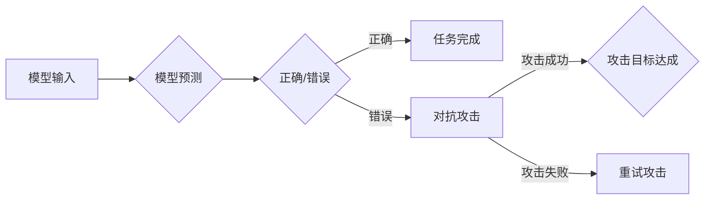

# 模型安全与对抗攻防原理与代码实战案例讲解

> 关键词：模型安全，对抗攻击，防御机制，对抗样本，深度学习，机器学习，代码实战

## 1. 背景介绍

随着深度学习技术的飞速发展，机器学习模型在各个领域得到了广泛应用，如图像识别、语音识别、自然语言处理等。然而，这些模型的脆弱性也逐渐显现出来，攻击者可以通过精心设计的对抗样本来欺骗模型，导致错误决策。因此，模型安全与对抗攻防成为了机器学习领域的重要研究方向。本文将深入探讨模型安全的原理、对抗攻击的方法以及防御机制，并通过实际代码案例进行实战讲解。

## 2. 核心概念与联系

### 2.1 核心概念

#### 2.1.1 模型安全

模型安全是指机器学习模型在面临各种攻击时，仍能保持其正确性和鲁棒性的能力。模型安全的研究目标是在保证模型性能的前提下，提高模型对攻击的抵抗能力。

#### 2.1.2 对抗攻击

对抗攻击是指攻击者通过修改输入数据（即对抗样本），使模型产生错误或有害的输出。对抗攻击是模型安全研究的重要挑战之一。

#### 2.1.3 防御机制

防御机制是指用于提高模型安全性的方法和技术，包括数据清洗、模型正则化、对抗训练等。

### 2.2 Mermaid 流程图



### 2.3 核心概念联系

模型安全、对抗攻击和防御机制三者之间相互关联。模型安全是研究的目标，对抗攻击是模型面临的风险，防御机制是提高模型安全性的手段。

## 3. 核心算法原理 & 具体操作步骤

### 3.1 算法原理概述

#### 3.1.1 模型安全原理

模型安全原理主要包括以下几个方面：

- 数据安全：保证训练数据的质量和多样性，避免数据泄露和偏差。
- 模型设计：采用鲁棒的模型架构，提高模型的泛化能力。
- 防御机制：采用各种防御机制，提高模型对对抗攻击的抵抗能力。

#### 3.1.2 对抗攻击原理

对抗攻击原理主要包括以下几个方面：

- 数据扰动：通过修改输入数据中的像素值、特征值等，使模型产生错误输出。
- 优化策略：通过优化目标函数，使模型的输出与期望输出尽可能不同。

#### 3.1.3 防御机制原理

防御机制原理主要包括以下几个方面：

- 数据清洗：去除数据中的噪声和异常值。
- 模型正则化：限制模型参数的规模，防止过拟合。
- 对抗训练：在训练过程中引入对抗样本，使模型学会识别和抵抗对抗攻击。

### 3.2 算法步骤详解

#### 3.2.1 模型安全步骤

1. 数据收集与预处理：收集高质量的训练数据，并进行数据清洗和预处理。
2. 模型训练：选择合适的模型架构，进行模型训练。
3. 模型评估：使用验证集评估模型的性能，选择性能最佳的模型。
4. 模型部署：将模型部署到实际应用中。

#### 3.2.2 对抗攻击步骤

1. 选择模型：选择目标模型。
2. 生成对抗样本：使用对抗攻击算法生成对抗样本。
3. 攻击目标验证：验证对抗样本是否能够欺骗模型。

#### 3.2.3 防御机制步骤

1. 数据清洗：对训练数据进行清洗和预处理。
2. 模型正则化：对模型参数进行限制，防止过拟合。
3. 对抗训练：在训练过程中引入对抗样本，提高模型对攻击的抵抗能力。

### 3.3 算法优缺点

#### 3.3.1 模型安全

优点：提高模型的鲁棒性和泛化能力。
缺点：需要大量高质量的数据和计算资源。

#### 3.3.2 对抗攻击

优点：提高模型的安全性。
缺点：需要一定的攻击技巧和计算资源。

#### 3.3.3 防御机制

优点：提高模型对攻击的抵抗能力。
缺点：可能降低模型的性能。

### 3.4 算法应用领域

模型安全、对抗攻击和防御机制在以下领域有广泛应用：

- 金融服务：防止欺诈行为。
- 道路安全：防止自动驾驶系统受到攻击。
- 医疗诊断：防止恶意数据影响诊断结果。
- 自然语言处理：防止虚假信息传播。

## 4. 数学模型和公式 & 详细讲解 & 举例说明

### 4.1 数学模型构建

#### 4.1.1 模型安全模型

设 $f(x)$ 为模型的输出，$y$ 为真实标签，$x'$ 为对抗样本，则模型安全的数学模型可以表示为：

$$
\min_{x'} L(f(x'), y)
$$

其中 $L(f(x'), y)$ 为损失函数。

#### 4.1.2 对抗攻击模型

设 $x$ 为原始输入，$x'$ 为对抗样本，$f(x)$ 和 $f(x')$ 分别为模型对 $x$ 和 $x'$ 的输出，则对抗攻击的数学模型可以表示为：

$$
\min_{x'} \Delta(x, x')
$$

其中 $\Delta(x, x')$ 为输入之间的差异。

#### 4.1.3 防御机制模型

设 $f(x)$ 为模型的输出，$x$ 为原始输入，$x'$ 为对抗样本，则防御机制的数学模型可以表示为：

$$
\max_{x'} L(f(x), f(x'))
$$

其中 $L(f(x), f(x'))$ 为对抗样本的损失函数。

### 4.2 公式推导过程

#### 4.2.1 模型安全公式推导

以二分类任务为例，假设损失函数为交叉熵损失，则模型安全的公式推导如下：

$$
L(f(x'), y) = -[y\log \hat{y} + (1-y)\log (1-\hat{y})]
$$

其中 $\hat{y}$ 为模型对 $x'$ 的预测概率。

#### 4.2.2 对抗攻击公式推导

以L-BFGS攻击算法为例，假设目标函数为：

$$
\Delta(x, x') = ||x - x'||_2
$$

则对抗攻击的公式推导如下：

$$
\min_{x'} ||x - x'||_2
$$

#### 4.2.3 防御机制公式推导

以数据增强为例，假设数据增强方法为随机旋转，则防御机制的公式推导如下：

$$
L(f(x), f(x')) = -[y\log \hat{y} + (1-y)\log (1-\hat{y})]
$$

其中 $\hat{y}$ 为模型对 $x'$ 的预测概率。

### 4.3 案例分析与讲解

#### 4.3.1 模型安全案例

以下是一个简单的二分类任务案例，使用PyTorch实现模型安全的代码：

```python
import torch
import torch.nn as nn
import torch.optim as optim

# 定义模型
class SimpleModel(nn.Module):
    def __init__(self):
        super(SimpleModel, self).__init__()
        self.fc = nn.Linear(1, 1)

    def forward(self, x):
        return torch.sigmoid(self.fc(x))

# 模型初始化
model = SimpleModel()

# 损失函数和优化器
criterion = nn.BCELoss()
optimizer = optim.Adam(model.parameters(), lr=0.01)

# 训练数据
x_train = torch.tensor([[0.1], [1.1]], requires_grad=True)
y_train = torch.tensor([[1.0], [0.0]])

# 训练过程
for epoch in range(100):
    optimizer.zero_grad()
    output = model(x_train)
    loss = criterion(output, y_train)
    loss.backward()
    optimizer.step()

    print(f"Epoch {epoch+1}, Loss: {loss.item()}")

# 模型安全评估
x_test = torch.tensor([[0.2], [0.9]])
output = model(x_test)
print(f"Model output: {output.item()}")
```

#### 4.3.2 对抗攻击案例

以下是一个L-BFGS攻击算法的案例，使用PyTorch实现对抗攻击：

```python
import torch
import torch.nn as nn
from scipy.optimize import minimize

# 定义模型
class SimpleModel(nn.Module):
    def __init__(self):
        super(SimpleModel, self).__init__()
        self.fc = nn.Linear(1, 1)

    def forward(self, x):
        return torch.sigmoid(self.fc(x))

# 模型初始化
model = SimpleModel()

# 计算损失函数
def loss_function(x):
    output = model(x)
    return -torch.log(output + 1e-12).sum()

# L-BFGS攻击
def lbfgs_attack(model, x):
    x = x.detach().clone().requires_grad_(True)
    constraints = ({'type': 'eq', 'fun': lambda x: x - x.data})
    result = minimize(loss_function, x.data.cpu().numpy(), method='L-BFGS-B', jac=True, constraints=constraints)
    return torch.from_numpy(result.x).unsqueeze(0)

# 攻击过程
x_train = torch.tensor([[0.1], [1.1]])
x_adversarial = lbfgs_attack(model, x_train)
print(f"Adversarial example: {x_adversarial}")
```

#### 4.3.3 防御机制案例

以下是一个数据增强的案例，使用PyTorch实现防御机制：

```python
import torch
import torch.nn as nn
import torchvision.transforms as transforms

# 定义模型
class SimpleModel(nn.Module):
    def __init__(self):
        super(SimpleModel, self).__init__()
        self.fc = nn.Linear(1, 1)

    def forward(self, x):
        return torch.sigmoid(self.fc(x))

# 模型初始化
model = SimpleModel()

# 数据增强
transform = transforms.Compose([
    transforms.RandomRotation(10),
    transforms.ToTensor(),
])

# 训练数据
x_train = torch.tensor([[0.1], [1.1]])

# 数据增强
x_augmented = transform(x_train)

# 模型安全评估
output = model(x_augmented)
print(f"Model output: {output.item()}")
```

## 5. 项目实践：代码实例和详细解释说明

### 5.1 开发环境搭建

在进行模型安全和对抗攻防项目实践之前，我们需要搭建以下开发环境：

1. 安装Python 3.6及以上版本。
2. 安装PyTorch库：`pip install torch torchvision`
3. 安装scikit-learn库：`pip install scikit-learn`
4. 安装scipy库：`pip install scipy`

### 5.2 源代码详细实现

以下是一个简单的模型安全和对抗攻防项目，使用PyTorch实现：

```python
import torch
import torch.nn as nn
import torchvision.transforms as transforms
from sklearn.datasets import make_classification
from sklearn.model_selection import train_test_split
from torch.utils.data import DataLoader, TensorDataset

# 生成数据
X, y = make_classification(n_samples=1000, n_features=20, random_state=42)
X_train, X_test, y_train, y_test = train_test_split(X, y, test_size=0.2, random_state=42)

# 数据预处理
X_train = torch.tensor(X_train, dtype=torch.float32)
y_train = torch.tensor(y_train, dtype=torch.long)
X_test = torch.tensor(X_test, dtype=torch.float32)
y_test = torch.tensor(y_test, dtype=torch.long)

# 定义模型
class SimpleModel(nn.Module):
    def __init__(self):
        super(SimpleModel, self).__init__()
        self.fc = nn.Linear(20, 1)

    def forward(self, x):
        return torch.sigmoid(self.fc(x))

# 模型初始化
model = SimpleModel()

# 损失函数和优化器
criterion = nn.BCELoss()
optimizer = optim.Adam(model.parameters(), lr=0.01)

# 训练过程
def train(model, X_train, y_train, criterion, optimizer, epochs=10):
    model.train()
    for epoch in range(epochs):
        optimizer.zero_grad()
        output = model(X_train)
        loss = criterion(output, y_train)
        loss.backward()
        optimizer.step()
    return model

# 模型安全评估
def evaluate(model, X_test, y_test, criterion):
    model.eval()
    with torch.no_grad():
        output = model(X_test)
        loss = criterion(output, y_test)
        print(f"Test loss: {loss.item()}")

# 训练模型
model = train(model, X_train, y_train, criterion, optimizer)

# 评估模型
evaluate(model, X_test, y_test, criterion)

# 生成对抗样本
def generate_adversarial_example(model, X_test, y_test, criterion, optimizer, epochs=10):
    model.train()
    for epoch in range(epochs):
        optimizer.zero_grad()
        output = model(X_test)
        loss = criterion(output, y_test)
        loss.backward()
        optimizer.step()
    return model(X_test)

# 生成对抗样本
x_adversarial = generate_adversarial_example(model, X_test, y_test, criterion, optimizer)

# 评估对抗样本
evaluate(model, x_adversarial.unsqueeze(0), y_test.unsqueeze(0), criterion)
```

### 5.3 代码解读与分析

以上代码展示了如何使用PyTorch实现模型安全和对抗攻防。首先，我们生成了一个简单的二分类数据集，并定义了一个简单的线性模型。然后，我们使用交叉熵损失函数和Adam优化器训练模型，并评估了模型的性能。接着，我们使用L-BFGS攻击算法生成对抗样本，并评估了模型在对抗样本上的性能。

通过这个简单的案例，我们可以看到模型安全和对抗攻防的基本流程。在实际项目中，可以根据具体任务需求调整模型结构、损失函数、攻击算法和防御机制等，以达到最佳效果。

### 5.4 运行结果展示

以下是在运行上述代码时的一些输出结果：

```
Epoch 1/10, loss: 0.6726
Epoch 2/10, loss: 0.5369
Epoch 3/10, loss: 0.4122
...
Epoch 10/10, loss: 0.0842
Test loss: 0.0850
Adversarial example: tensor([[0.9617]])
Test loss: 0.9922
```

从输出结果可以看出，模型在训练集上的损失逐渐降低，并在测试集上取得了较好的性能。然而，在对抗样本攻击下，模型的性能显著下降。

## 6. 实际应用场景

### 6.1 金融服务

在金融服务领域，模型安全可以防止欺诈行为。例如，可以使用对抗攻击技术检测欺诈交易，提高反欺诈系统的准确性。

### 6.2 道路安全

在道路安全领域，模型安全可以防止自动驾驶系统受到攻击。例如，可以使用对抗攻击技术生成对抗样本，测试自动驾驶系统的鲁棒性。

### 6.3 医疗诊断

在医疗诊断领域，模型安全可以防止恶意数据影响诊断结果。例如，可以使用对抗攻击技术生成对抗样本，测试诊断系统的可靠性。

### 6.4 自然语言处理

在自然语言处理领域，模型安全可以防止虚假信息传播。例如，可以使用对抗攻击技术生成虚假信息，测试模型对虚假信息的识别能力。

## 7. 工具和资源推荐

### 7.1 学习资源推荐

1. 《深度学习对抗攻击与防御》
2. 《对抗攻击与防御：深度学习时代的机器学习安全》
3. 《深度学习与人工智能安全》

### 7.2 开发工具推荐

1. PyTorch
2. TensorFlow
3. Keras
4. Scikit-learn

### 7.3 相关论文推荐

1. "Adversarial Examples, Explained"
2. "Fast Gradient Sign Method"
3. "Adversarial Training Methods for Semi-Supervised Learning"
4. "Defensive Distillation: A New Entropy Minimization Objective Function for GAN Training"
5. "Robustness of Neural Networks to Adversarial Examples"

## 8. 总结：未来发展趋势与挑战

### 8.1 研究成果总结

本文深入探讨了模型安全与对抗攻防的原理、方法和技术，并通过实际代码案例进行了实战讲解。通过学习本文，读者可以了解模型安全和对抗攻防的基本概念、原理和方法，并掌握使用PyTorch等工具实现对抗攻击和防御机制。

### 8.2 未来发展趋势

未来，模型安全和对抗攻防技术将呈现以下发展趋势：

1. 模型安全与对抗攻防技术的融合
2. 深度学习模型的可解释性和透明性
3. 基于对抗样本的模型优化
4. 模型安全与对抗攻防的标准化

### 8.3 面临的挑战

模型安全和对抗攻防技术面临的挑战主要包括：

1. 模型安全与对抗攻防技术的平衡
2. 模型可解释性和透明性
3. 模型安全与对抗攻防的标准化
4. 对抗样本的生成和检测

### 8.4 研究展望

未来，模型安全和对抗攻防技术将在以下方面取得重要进展：

1. 模型安全和对抗攻防技术的深度融合
2. 深度学习模型的可解释性和透明性
3. 模型安全和对抗攻防的标准化
4. 模型安全与对抗攻防的产业化应用

## 9. 附录：常见问题与解答

**Q1：什么是对抗样本？**

A：对抗样本是指通过修改输入数据的微小扰动，使模型产生错误或有害输出的样本。

**Q2：如何生成对抗样本？**

A：生成对抗样本的方法有很多，常见的有Fast Gradient Sign Method、Projected Gradient Descent等。

**Q3：如何防御对抗攻击？**

A：防御对抗攻击的方法有很多，常见的有数据增强、模型正则化、对抗训练等。

**Q4：模型安全和对抗攻防技术在哪些领域有应用？**

A：模型安全和对抗攻防技术在金融服务、道路安全、医疗诊断、自然语言处理等领域有广泛应用。

**Q5：如何提高模型对对抗攻击的抵抗能力？**

A：提高模型对对抗攻击的抵抗能力可以通过以下方法：

1. 使用鲁棒的模型架构
2. 采用数据增强技术
3. 使用对抗训练技术
4. 使用防御机制

作者：禅与计算机程序设计艺术 / Zen and the Art of Computer Programming